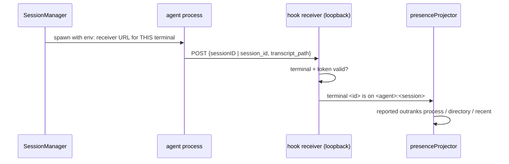

# Design: agent-session-hook-identity

## Architecture



## Decisions

### D1: The terminal's identity is the URL, not an environment key

A report names its terminal by the per-terminal renewable token URL `CursorHookRuntime` already issues; no pane key is added to the environment.

orca stamps `ORCA_PANE_KEY` alongside a shared endpoint and token, so any process that can read the endpoint can name any pane. This repo already ships the stronger form (`src/cursor/CursorHookRuntime.ts` `create(sessionId)`): the URL is unguessable, single-terminal, and revoked on exit — which is exactly `agent-hook-identity/spec.md#a-session-report-is-accepted-only-for-the-terminal-it-was-issued-to`. The runtime gains an agent segment on the path so one receiver serves several producers; nothing about the token model changes.

### D2: OpenCode needs no configuration overlay

AnyWhere Terminal ships one plugin file inside a directory it owns and stamps `OPENCODE_CONFIG_DIR` at that directory into the pane's environment. The user's configuration is neither copied nor mirrored.

Measured on OpenCode 1.18.22, not inferred: `OPENCODE_CONFIG_DIR` is **additive** — `packages/opencode/src/config/paths.ts` `directories()` returns `[global, ...project .opencode, ...home, OPENCODE_CONFIG_DIR]` — and every one of those directories is scanned for plugins by `Glob.scan("{plugin,plugins}/*.{ts,js}")` (`packages/opencode/src/config/plugin.ts`). A probe run with `OPENCODE_CONFIG_DIR` pointed at a throwaway directory loaded the plugin AND still used the model from the user's own `~/.config/opencode/opencode.jsonc`.

orca's overlay — mirroring the user's config as symlinks so `plugins/` can become a real directory (`src/main/opencode/hook-service.ts`) — protects a user config that a *replacing* config dir would hide. That cost is not owed on this version, and an overlay that mirrors a config we never need to read is a failure mode (stale mirrors, Windows symlink permissions) bought for nothing.

When the environment already carries `OPENCODE_CONFIG_DIR`, ours is not written: the user's selection reaches OpenCode unchanged and that terminal simply has no report, per `agent-hook-identity/spec.md#reporting-preserves-the-users-own-opencode-configuration`.

### D3: WITHDRAWN — Codex is not a reporting agent in this change

D3 held that Codex reporting was an installer writing owned entries into `~/.codex/hooks.json`. That installs nothing: Codex refuses to run a hook whose `trusted_hash` is not recorded in `config.toml` (`codex-rs/hooks/src/registry.rs` gates on it unless `bypass_hook_trust`), and orca does not write that hash itself — it opens a codex app-server trust-grant session, with a ledger, a mutation queue and a rollback path (`src/main/codex/codex-hook-trust-grant.ts`).

That is a subsystem, not an installer, over a second file in a second format that orca also manages. Codex already titles its rows from its own terminal title, so what is forgone is exactness when two Codex panes share one directory — not a name. Reporting for Codex is a change of its own.

### D4: A report is a fourth kind of evidence, ranked above the rest

`ClaudeSessionEvidence` becomes an ordered set — `reported` > `process` > `directory` > `recent` — and `settleContestedSessions` awards a contested session to the strictly highest rank rather than to `process` alone.

The ranking is the whole mechanism behind `worktree-agent-presence/spec.md#one-session-belongs-to-one-pane`, and it is what lets the guess survive: `sessionUnderCwd` remains the fallback for a pane the extension did not launch, or whose reporting is off, and is simply outranked whenever a report arrives.

### D5: WITHDRAWN — the only reporter names an id, so there is no path to prefer

D5 preferred a Codex report's `transcript_path` over its `session_id`. With D3 withdrawn, OpenCode is the only reporter and it reports `sessionID` — already the key its own store uses. A locator that can also carry a path would be a branch no producer reaches.

### D6: The plugin reports identity only

The producer sends the session id and nothing else, matching the existing `cursor-agent-status` privacy requirement rather than inventing a second standard.

OpenCode's plugin sees every event including message parts; the filter is in the producer, so conversation text never crosses the socket at all.

## Interfaces

```ts
/** Which step matched, and so how much the match is worth. Ordered. */
export type ClaudeSessionEvidence = "reported" | "process" | "directory" | "recent";

/** One agent's report about the terminal that issued the credential. */
export interface AgentSessionReport {
  terminalId: string;
  agent: "opencode";
  sessionId: string;
}
```

## Risk Map

| Component | Risk | Mitigation |
|---|---|---|
| `OPENCODE_CONFIG_DIR` | Overwriting a user-set value would silently drop their configuration | D2 — preserve theirs and forfeit the report; covered by its scenario |
| Hook receiver | A second producer widens the accepted request surface | D1 — same per-terminal token, path gains only an agent segment; existing body cap, deadline and dedup are unchanged |
| Reported sessions map | One entry per live terminal, cleared on exit by the existing `release(sessionId)` | Bounded by pane count; no growth axis of its own |
| Plugin event stream | OpenCode emits an event per message part; a report per event would flood the socket | D6 — the producer reports only on session identity changing, one POST per session per run |
