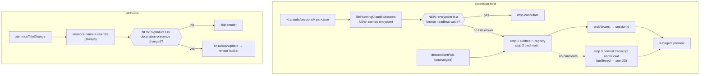

# Design: fix-false-agent-signals

## Architecture

Two reject-only guards on existing paths. Nothing else moves.



## Decisions

### D1: Classify headless by the registry's `entrypoint`, not by argv

Measured on claude 2.1.239 (`discovery.md` §9.2): a live `claude -p` writes a normal PID
registry file and removes it on exit, so it really can compete inside
`resolveClaudeSession` step 1 — and since its transcript is written at that instant, it wins
the `pickNewest` mtime tie-break essentially always. The captured file:

```json
{"pid":30454, …, "kind":"interactive", "entrypoint":"sdk-cli", …}
```

`kind` is useless — the headless run also reports `"interactive"`. `entrypoint` separates
them: `"cli"` for interactive sessions, `"sdk-cli"` for the `-p` run.

`runningSessions.ts` already opens and `JSON.parse`s this file, so reading one more field
costs nothing. The alternative — reconstructing argv via `ps -o args=` — needs a widened
`ps` query, a second parse variant, a changed `ResolveClaudeSessionDeps`, and edits to both
provider wirings, to arrive at the same answer. Rejected on surface area alone.

This also retires A7: with no argv string to inspect, there is no place that needs
token-boundary name matching, which was A7's only remaining justification
(`discovery.md` §8).

### D2: Allow-list known headless values; unknown `entrypoint` stays a candidate

The filter is `entrypoint === "sdk-cli"`, expressed as membership in a
`HEADLESS_ENTRYPOINTS` set — **not** `entrypoint !== "cli"`.

The inverted form looks equivalent and is not. `entrypoint` is a version-fragile field of
another product: older builds may omit it, and future builds may add values for the VS Code
extension, an IDE integration, or a new launcher. Under `!== "cli"` every one of those would
be silently misclassified as headless and the user's real session would stop resolving —
a worse bug than the one being fixed, and a silent one. Under the allow-list the same drift
degrades to today's behaviour.

Same reasoning as the existing "never throw, degrade to cwd fallbacks" contract in
`processTree.ts`, and as orca's degraded-scan stickiness rule (doc 01 §3.5): when the signal
is unavailable or unrecognised, keep what you have.

### D3: Filter the running list once, before step 1 — and leave step 3 alone

The filter is applied to the result of `listRunning()` at the top of `resolveClaudeSession`,
not inside the step-1 branch. One line, and it covers step 2 as well: a headless run in the
same cwd is just as able to hijack the cwd fallback as the subtree intersection.

It is applied even when a step has a single candidate. A lone headless match must fall
through to the next step rather than resolve to a one-shot transcript.

Step 3 (`newestSessionUnderCwd`) is left unfiltered. It reads transcripts from disk, where
no `entrypoint` exists, so filtering would mean parsing every candidate transcript's
metadata. It is also only reachable when nothing is running for that pane at all, which
makes the residual failure both rarer and milder. Recorded in `discovery.md` §9.3 rather
than fixed here.

### D4: Compare a decoration-stripped signature; keep the raw title as the name

`TerminalFactory.ts:448-452` calls `onTabBarUpdate()` for every OSC title write. Agent TUIs
rewrite the title once per spinner frame, so one running agent drives ~10 full
`renderTabBar()` passes/second: Map rebuild, `querySelectorAll`, and unconditional
`statusSpan.className` / `dataset.status` writes (`TabBarUtils.ts:183-189`). Only the label
text write is guarded (`:180`).

Signature = title with `U+2800`–`U+28FF` (braille) and `U+25D0`–`U+25D3` (quarter circles)
removed, whitespace runs collapsed to one space, trimmed. Store the last signature on the
instance; skip `onTabBarUpdate()` when unchanged.

**The compared state is (signature, decoration-present), not signature alone.** Because the
label renders the raw `name`, `⠋ Fix tests` → `Fix tests` changes the displayed text while
leaving the signature identical — gating on the signature alone froze a spinner on a
finished agent's tab, i.e. reintroduced the false signal this change removes
(`.reviews/round-1.md` [W1]). The presence check uses a NON-global regex: `.test()` on a
`/g` regex advances `lastIndex` and would alternate results.

Titles over 1024 characters bypass the gate and always render. xterm accepts OSC payloads
up to 10 MB and any program can emit one; two full scans per frame to avoid one render is
the wrong trade (`.reviews/round-1.md` [S1]).

`instance.name` is assigned the **raw** title on every event regardless. This matters: the
moment any non-decorative change forces a render, the tab shows the newest text, and no
other consumer of `name` (custom-name resolution, split active-pane label,
`buildTabBarData`) ever sees a mutilated string.

Rejected alternative — debouncing title updates: delays real title changes by the debounce
window and still re-renders once per settled frame. The signature compare is exact and costs
one string comparison.

### D5: Scope the A6 guard to the paths that can actually carry text

A6 is not a live bug (`discovery.md` §7); the guard exists so a future programmatic send
path cannot regress into "text and `\r` in one write", which leaves Claude's composer
editable (doc 05 §1.5).

The guard must not be written as `/.+\r$/`: in JavaScript `.` matches `\x1b`, so that
predicate flags the legitimate bare Alt+Enter payload `"\x1b\r"` (`main.ts:1052`). The
predicate is `/[^\x00-\x1f]\r$/` — a printable character immediately before the terminator.

It is asserted over the two paths that insert text into a pty (`InputHandler` paste,
`DragDropHandler` path insertion), not over "all send paths": native keystroke forwarding
(`TerminalFactory.ts:186-195`) writes single keys and has no payload to append `\r` to, so
including it would add noise without adding coverage.

## Interfaces

```ts
// src/webview/terminal/titleSignature.ts
export function titleSignature(title: string): string;
export interface TitleTrackedInstance { name: string; lastTitleSignature?: string; lastTitleDecorated?: boolean }
export function applyTitleChange(i: TitleTrackedInstance, title: string, requestRender: () => void): void;

// src/vault/readers/runningSessions.ts
export interface RunningClaudeSession {
  // …existing fields…
  /** Raw `entrypoint` from the registry file; undefined when absent. */
  entrypoint?: string;
}
export function isHeadlessSession(session: RunningClaudeSession): boolean;
// HEADLESS_ENTRYPOINTS stays module-private: `ReadonlySet` is an erased view over a live
// Set, so exporting it would let a caller `add("cli")` and reclassify every interactive
// session process-wide — the failure D2 exists to prevent (.reviews/round-1.md [S2]).
```

No existing exported signature changes. `ResolveClaudeSessionDeps`, `processTree`, and both
provider wirings are untouched.

## Design Constraints

- `entrypoint` belongs to another product's on-disk format and is not covered by any
  compatibility guarantee — hence D2's allow-list.
- The webview bundle is single-file iife, so `titleSignature` must be a plain static import.
- `runningSessions.ts` parses registry files defensively (malformed → skip, never throw);
  the new field must not introduce a throw path.

## Risk Map

| Component | Risk | Mitigation |
|---|---|---|
| `runningSessions` | Dedupe by `sessionId` could hand the caller a headless entry for a session that also has a live interactive pid, so the filter then erases the sessionId entirely | `winsDedupe` prefers interactive over headless before comparing `startedAt`; two tests pin both orderings (.reviews/round-1.md [W2]) |
| `resolveClaudeSession` | Over-filtering makes a real pane resolve to null | D3 filters the list, not the outcome — an emptied step falls through to the next; D2 keeps unknown `entrypoint` values. Both covered by tests in task 2_2 |
| `resolveClaudeSession` | Claude renames `entrypoint` values and the filter silently stops working | Degrades to today's behaviour, not to a new failure — that is exactly why D2 is an allow-list rather than `!== "cli"` |
| `runningSessions` | Reading a new field introduces a parse throw on odd files | Field is read with a `typeof === "string"` guard inside the existing try/catch-per-file loop; malformed-file test already exists and stays green |
| `TerminalFactory` | Signature gate hides a legitimate title change | Signature strips only two fixed codepoint ranges plus whitespace; task 1_2 asserts text-change-behind-an-unchanged-spinner still renders, and that the first title after creation always renders |
| `TerminalFactory` | Signature state stored per instance leaks across a tab being recreated | Field lives on the terminal instance object created by `createTerminal`, so it dies with the instance |
| A6 guard test | Predicate flags the legitimate `"\x1b\r"` Alt+Enter payload | D5 fixes the predicate to `/[^\x00-\x1f]\r$/` and the test asserts that payload is allowed |
| Data scale | None — no new collection, endpoint, or derived value; the registry scan's size and cadence are unchanged | n/a |
