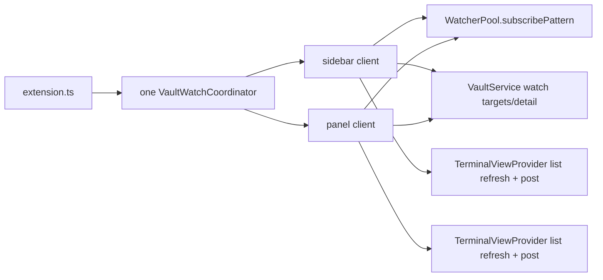

# Design: extract-vault-watch-coordinator (refactor: src/providers/TerminalViewProvider.ts)

## Diagnosis

| | |
|---|---|
| Target | `src/providers/TerminalViewProvider.ts` |
| Lines at start | 1723 |
| Shape | `god-class` (from `asm refactor shape`) |
| Because | `TerminalViewProvider` holds 1653/1723 lines (96%) across 60 members; the 60% god-class threshold fired |
| Direct tests | No direct watcher-owner suite; `src/vault/VaultService.watchTargets.test.ts` covers targets only, so this change adds coordinator lifecycle tests |
| Why now | Vault watcher performance work needs one lifecycle owner before changing when watchers arm or pause |

## Decisions

### D1: Target structure

Watcher subscriptions, debounce timers, follow generations, and their teardown move together; provider-owned refresh supersession and message delivery stay in the provider.

```text
src/providers/
  VaultWatchCoordinator.ts       # one extension-host owner; one behavior-preserving client per resolved vault webview
  VaultWatchCoordinator.test.ts  # direct lifecycle, debounce, stale-follow and multi-client preservation proof
  TerminalViewProvider.ts        # facade: IPC, list refresh sequencing, safe webview delivery
  fsWatcherPool.ts               # unchanged physical watcher API
src/extension.ts                 # constructs and disposes the shared coordinator
```



Left in `TerminalViewProvider` on purpose: `_vaultRefreshSeq`, `handleRequestVaultSessions`, rename refreshes, `autoRefreshVaultList`, and `safeSendWithRetry`; they share one supersession order that watcher ownership must not split.

Clusters ordered by coupling ascending, never by size. `Deps` = runtime collaborators the cluster reads today.

| # | Cluster | Lines | LOC | Deps | Technique | Task |
|---|---|---|---|---|---|---|
| 1 | Coordinator contract and proof harness | new | — | `WatcherPool`, `VaultService` | Add the typed per-webview client seam and test it before wiring | `1_1` |
| 2 | Vault watcher ownership | 103-120, 249-265, 674-823, 1161-1164 | ~180 | coordinator client, provider callbacks | Move fields with the methods that exclusively own them; provider delegates | `1_2` |

Deliberately not cut: vault list loading, rename, launch, Raw copy, continuation and preview-file cancellation — none share the watcher fields.

### D2: Preservation proof

| | |
|---|---|
| Suite command | `pnpm run test:unit` |
| Baseline | **2482** tests green at `64dfc7a`, type-check clean |

Rules every task obeys:

- Baseline suite stays green after every task; the test count may only grow. A drop or an unplanned assertion edit stops the task.
- New coordinator tests are additive and establish the extraction seam before `TerminalViewProvider` delegates to it.
- Re-run `asm refactor shape` on `src/providers/TerminalViewProvider.ts` and `src/providers/VaultWatchCoordinator.ts` after the cut; moving the god-class responsibility into another oversized class is not completion.
- The same step failing twice means the seam is wrong; stop and re-plan rather than weakening lifecycle assertions.

The preserved runtime contract is:

- each resolved sidebar/panel webview still creates its own four store subscriptions;
- each webview still follows at most one session independently;
- store events retain the existing 150 ms pool debounce plus 300 ms provider refresh debounce;
- follow events retain the existing 400 ms debounce and stale-generation guards;
- view disposal releases that view's store/follow subscriptions and timers;
- no focus, visibility, collapse, refcount or agent-scoped refresh optimization lands in this change.

### D3: Expected test moves

None. Existing assertions stay in place; only additive coordinator and provider-delegation cases are allowed.

### D4: Allowed non-pure transformations

- `1_1`: expose an idempotent coordinator/client `dispose()` so extension deactivation and webview disposal share one teardown path.
- `1_2`: append an optional coordinator constructor dependency to preserve existing test constructors; production passes the single extension-host instance explicitly.
- `1_2`: capture each attached client in its own dispose closure so a stale webview cannot dispose a newer attachment.

## Risk Map

| Risk | Mitigation |
|---|---|
| A shared coordinator accidentally deduplicates or globally serializes sidebar/panel behavior | Per-client state; tests assert two clients retain independent physical subscriptions and follow generations |
| Async follow-target resolution installs after switch/dispose | Client generation guard is checked before subscriptions are published |
| Moving auto-refresh breaks manual/rename supersession | `_vaultRefreshSeq` and list delivery stay in `TerminalViewProvider`; coordinator calls the existing refresh callback |
| Timer or watcher survives client/coordinator disposal | Fake-timer tests assert pending callbacks stay silent and every returned disposable is released exactly once |
| Constructor churn breaks unrelated provider suites | Coordinator dependency is appended and optional; production wiring is the only mandatory caller change |
