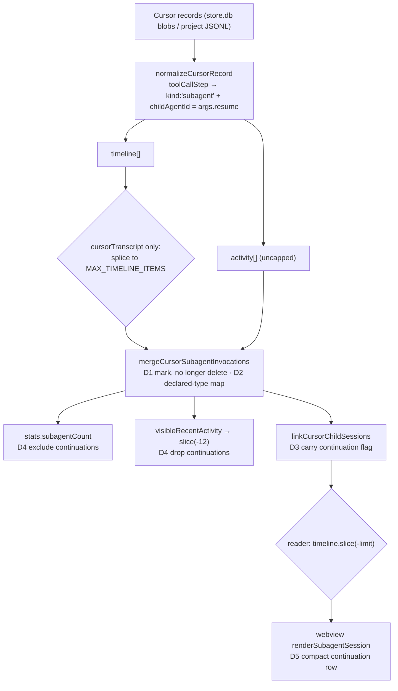

# Design: show-cursor-subagent-continuations

## Architecture

Where a continuation is lost today, and where each decision intervenes:



Both cuts are why the defect is worse than "no marker at the resume position":

- `C2` runs **after** the merge, so the merged card — pinned at the *launch* position, i.e. the
  oldest — is sliced away while its continuations have already been deleted. The agent then
  appears **nowhere**, even though it was consulted seconds ago. This is the literal "shows
  nothing at all", and preserving continuations at their own recent positions fixes it. Naming
  happens in the merge, before this cut, so a continuation that outlives its launch card keeps
  the declared type.
- `C1` runs **before** the merge, so a group merged there can be missing a launch that a sibling
  array still holds — hence the cross-array type map (D2) rather than a per-array search.

## Decisions

### D1: Continuations are marked, not deleted

`mergeCursorSubagentInvocations` SHALL retain every group member, marking members after the
first `continuation: true`, instead of filtering them out.

The merge's job is agent identity, not suppression. Group order is source order, so `group[0]`
stays the owner card and each later member keeps its own `title` and `prompt` — the description
the agent was actually re-invoked with, which is the information the collapsed card destroyed.

Result/status stay per-invocation rather than being hoisted onto the owner: the store's
correlation already attaches each call's own result, and showing a turn's result at that turn is
both more honest and what makes the continuation row worth clicking. The JSONL mirror records no
`tool_result` blocks (verified in `260824-1200-integrate-cursor-agent`, review W17), so
continuations there simply render title-only.

The pass copies rather than mutates. Steps are shared objects between `timeline` and `activity`
and each array is merged separately, so marking in place would let whichever array merged last
decide the other's owner — the timeline's first entry could arrive already flagged as a
continuation, rendering subordinate to a launch card that is not there. Copying makes the pass
idempotent and independent of merge order.

### D2: Declared type resolves over the full decoded set

The merge SHALL take a `childAgentId → declared type` map built from every decoded invocation,
and apply it to all members of a group. When no entry exists, the step SHALL carry no agent type
rather than the invoking tool's name.

`launchStep()` searches only the array it was handed, which `C1` may have already truncated.
Building the map before either array is merged makes naming independent of cut order and of
which array is merged first — the fragile alternative is relying on `activity` being merged
first and mutating the shared objects.

Reach, stated honestly: the type propagates whenever the launch call is itself keyed to the
agent id, which is the background-launch case the user hit (`run_in_background: true`, whose
result echoes `Agent ID:`). A foreground launch's result is the agent's answer and carries no
id, and the JSONL mirror records no results at all, so in those cases nothing links launch to
continuation and the floor below applies. The map is what keeps the reachable case correct
under either cut; it cannot invent a link that was never written.

Rejected: reading the type out of the child transcript. A census of the 14 Cursor child
transcripts on this machine found `subagent_type` only under `message.content[].input` — that is
the child *spawning its own* sub-agent. A child transcript never records its own type, so the
data does not exist to read.

Floor case: the launch lies outside the decoded window entirely (the JSONL mirror reads a byte
window; the store fails closed). Nothing can name it, so the chip is omitted — silence over a
label known to be wrong.

The floor is unqualified, so it has to hold on every surface, not just the linked sub-session:
the public activity step carries `undeclared` and the shared activity renderer drops the badge
and chip when it is set. Without that, the recent strip and the unresolved-child inline fallback
still printed `@Task` (review W2), which the spec forbids.

### D3: The continuation flag rides the existing linking path

`linkCursorChildSessions` SHALL carry `continuation` onto the `subagentSession` it emits, and a
continuation whose child does not resolve SHALL remain the inline step it already falls back to.

Both invocations of one agent share a `childAgentId`, so they already resolve to the same
candidate through the existing `resolved` cache — one lookup, not N — and already receive the
same `entryId`. Nothing new is fetched; only a boolean is forwarded.

### D4: Counts and the recent-activity strip stay agent-level

`stats.subagentCount` SHALL count distinct agent identities, and both reader paths SHALL drop
continuations from recent activity **before** capping it.

Counting agents rather than invocations was presented and accepted at the previous change's
Gate 2; retaining the steps must not silently revert it. Order matters as much as the filter:
`cursorTranscript` capped its own strip to 12 first, so a run of 12+ resumes filled the tail and
the later filter emptied it (review W1). One exported predicate now serves both paths so they
cannot drift on what "agent-level" excludes. The 12-slot strip is a compact
"what happened lately" summary where per-turn rows would crowd out other tools — the timeline is
where locality matters.

### D5: A continuation renders as a compact expandable row

The webview SHALL render a `continuation` sub-session as a slim single-line row — a `↻` glyph,
the `@agent` chip, that invocation's title — with the launch card's collapsible body behaviour
and no `firstMessage` paragraph.

Slim is the whole point: the original complaint was N equally-weighted cards for one agent, so a
continuation must read as subordinate to its launch card while still being present and
clickable. `breaksRun` already treats `subagentSession` as prominent, so continuations never hide
behind a "Show N more" cap.

Card expansion state already survives this: `nestedCardKeys` keys on `[entryId, title]`, and a
continuation's title differs from its launch's, so each row holds its own state; duplicate
requests for the shared `entryId` are already coalesced by `populateNested`.

### D6: Expanding an invocation reveals its own turn

Expanding a sub-session SHALL scroll to and mark the child turn whose text the invocation's
bounded prompt begins, and SHALL do nothing when no turn matches.

Every invocation of one agent opens the SAME child transcript, so without this the second and
third rows are indistinguishable from the first — they all dump the full conversation at the top,
which is the locality problem again one level down.

Correlation is by prompt text, not ordinal. Verified against the real `82e87c39` child: it holds
exactly one user turn per invocation, and each turn is that invocation's prompt — the reader
already strips Cursor's `<timestamp>`/`<user_query>` envelope (`classifyCursorUserText`), so the
rendered turn text IS the prompt. Ordinal matching would be cheaper but silently wrong whenever
the child detail is tail-bounded or carries a gap; a prefix match degrades to no focus instead.

The hint travels in a module-local `WeakMap` keyed by the body element, set when the card expands
and read by `renderNestedInto` after it renders. The child arrives on an async round trip, so a
closure cannot carry it, and the bag contract is shared with the popup and the workflow board —
widening it for one provider's hint would push a Cursor concern into three call sites.

## Interfaces

```ts
// src/vault/types.ts — additive, optional, structured-clone-safe
type VaultActivityStep =
  | { kind: "tool"; /* … */ }
  | {
      kind: "subagent";
      /* … existing … */
      /** A re-invocation of an agent launched earlier in this session. */
      continuation?: boolean;
      /** `name` is the invoking tool's, not a declared type — render no chip (D2). */
      undeclared?: boolean;
    };

type VaultTimelineItem =
  | /* … */
  | {
      kind: "subagentSession";
      /* … existing … */
      /** Render subordinate to the launch card addressing the same `entryId`. */
      continuation?: boolean;
    };

// src/vault/readers/cursorNormalization.ts
/** `childAgentId → declared subagent type`, over every decoded invocation (D2). */
export function collectCursorAgentTypes(
  ...groups: readonly (readonly { kind: string }[])[]
): Map<string, string>;

/** A name that is not the invoking tool's own — drives whether an agent chip is shown (D2). */
export function isCursorDeclaredAgentType(name: string): boolean;

/** Returns a new array; group members are copied, never mutated (D1). */
export function mergeCursorSubagentInvocations<T extends { kind: string }>(
  items: T[],
  declaredTypes?: Map<string, string>,
): T[];

/** Distinct agents rather than invocations (D4). */
export function countCursorAgents(items: readonly { kind: string }[]): number;

/** Shared by both reader paths so "agent-level" means one thing (D4). */
export function isCursorContinuationStep(step: { kind: string }): boolean;
```

## Risk Map

| Component | Risk | Mitigation |
|---|---|---|
| `mergeCursorSubagentInvocations` | Steps are shared between `timeline` and `activity`, so in-place marking lets the array merged last decide the other's owner | D1 copies instead of mutating; asserted by the idempotency and no-mutation cases in `cursorNormalization.test.ts` (task 2_1) |
| Timeline growth | Continuations are no longer dropped, so a heavily-resumed agent adds one item per invocation | Bounded upstream and unchanged: `MAX_TIMELINE_ITEMS` (500) then the reader's `limit` slice; continuation rows are single-line and carry no `firstMessage` |
| `stats.subagentCount` | Retaining steps silently reverts "count agents, not invocations" | D4 counts distinct `childAgentId`s via `countCursorAgents`, so it does not depend on marking; asserted in task 2_2 |
| Recent-activity strip | Continuations could crowd the 12 slots | D4 drop in `visibleRecentActivity`, the single boundary both reader paths already pass through |
| Child linking | One agent resumed N times could issue N locator lookups | Existing `resolved` cache is keyed by `childAgentId`, which is identical across the group — unchanged by D3 |
| Declared-type map | An unbounded map keyed by attacker-influenced ids | Keys are already `isSafeCursorChatId`-validated; values reuse the existing `MAX_TOOL_NAME_CHARS` bound, and the map's size is bounded by the decoded record set |
| Unlinked continuation | No child transcript resolves, so the row cannot be a `subagentSession` | D3 leaves it as the inline `kind: "subagent"` step the path already renders — visible, just not expandable, and carrying `undeclared` when no type was decoded |
| Turn focus (D6) | A prompt that prefixes several turns marks the wrong one; `scrollIntoView` is absent in jsdom | Match the FIRST turn only and require a bounded minimum prefix; feature-detect `scrollIntoView` before calling it |
| Recent-activity strip | Capping before filtering can empty the strip on a long resume run | Filter then cap in both paths via the shared predicate; regression covers 13 resumes plus earlier tool activity |

## Known limitations

- Two invocations of one agent sharing both an identical title and an identical child remain
  indistinguishable to card-expansion state — the existing `nestedCardKeys` floor, unchanged.
- When the launch is outside the decoded window entirely, continuations render with no agent
  chip (D2 floor). Rarer than the tail-cap case, and no local data can resolve it.
