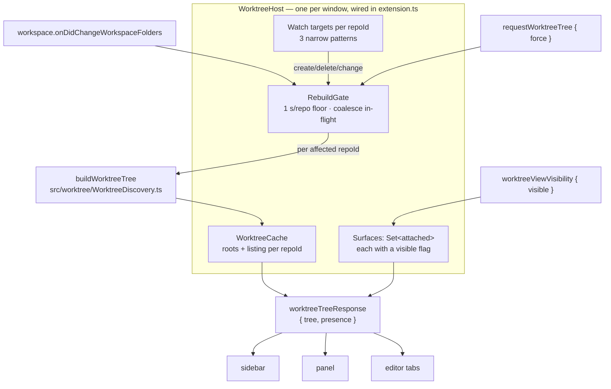

# Design: cache-and-broadcast-worktree-tree

## Architecture



## Decisions

### D1: One window-scoped host; surfaces attach to it

The worktree tree SHALL be owned by a single `WorktreeHost` constructed once in
`src/extension.ts`, alongside the watcher pool. Each surface calls `attach({ isReady, post })`
and receives a `Disposable`; attaching or detaching a surface SHALL NOT create or destroy a
watcher, and SHALL NOT trigger a git command by itself.

Neither existing precedent fits as-is. `FileTreeHost` is shared across the three providers but
keeps a single `attachPost` (`src/providers/fileTreeHost.ts:157`) — last attach wins, so it
cannot broadcast. `VaultWatchCoordinator` does keep a `Set` of clients
(`src/providers/VaultWatchCoordinator.ts:289`) but each client owns its own watchers and its
own re-read, which is exactly the per-surface duplication this change must not have. The host
takes the coordinator's attach/`Set` shape and moves the work behind it to window scope.

### D2: Cache per `repoId`, merge per rebuild, keep the last good listing

The cache SHALL hold the resolved repository set and one entry per `repoId`, in memory only.
A rebuild scoped to one repository SHALL replace only that entry and leave every other entry
untouched, so a signal in repo A costs no git in repo B.

```
CachedRepo { repo: WorktreeRepo; degraded?: string }
```

On a failed rebuild the previous `repo` SHALL be retained and `degraded` set from the failure
reason; the entry is never emptied. `buildWorktreeTree` already confines a per-repo failure to
`RepoListing.degraded` with empty worktrees (`src/worktree/WorktreeDiscovery.ts:124`), so the
stickiness rule lives in the cache: an incoming listing that is degraded contributes its reason
and keeps the stored worktrees.

A repository absent from the newly resolved root set SHALL be dropped from the cache, so a
removed workspace folder cannot leave a group behind.

### D3: Three narrow watch patterns per repository, based at the common dir

Per `repoId`, and only these:

| # | Base | Glob | Events | Answers |
|---|------|------|--------|---------|
| W1 | `<repoId>` | `worktrees/*` | create, delete | a worktree was added or removed |
| W2 | `<repoId>` | `worktrees/*/HEAD` | change | a linked worktree switched branch |
| W3 | `<repoId>` | `HEAD` | change | the main worktree switched branch |

Basing all three at `<repoId>` rather than at `<repoId>/worktrees` matters: a repository with no
linked worktrees has no `worktrees/` directory yet, and a watcher based on a directory that does
not exist never sees it appear. `worktrees/*` matches one path segment, so
`worktrees/<name>/index`, `logs/`, `refs/` and `COMMIT_EDITMSG` — everything an agent writes
continuously — match nothing.

W2 and W3 SHALL supply the `change` handler. `subscribe()` is unusable here: it creates its
watcher with `ignoreChange = true` (`src/providers/fsWatcherPool.ts:185`), and a branch switch
rewrites `HEAD` in place, so the event would never arrive.

The common dir of a repo opened as a linked worktree lies outside every workspace folder, so
each pattern is created from an absolute base — which `subscribePattern` already does
(`fsWatcherPool.ts:312`).

### D4: One rebuild gate — floor, coalesce, and a forced path that bypasses both

Rebuilds SHALL pass through a gate holding, per scope (`repoId` or whole-tree):

1. **Coalescing** — one in-flight rebuild promise per scope. A request arriving while one runs
   awaits it instead of starting a second.
2. **Floor** — a signal-driven rebuild less than `REBUILD_FLOOR_MS = 1000` after that scope's
   last rebuild is deferred to the remainder of the window, and further signals inside it
   collapse into that one deferred rebuild.
3. **Forced bypass** — `force` from a request, and any future post-mutation rebuild, run
   immediately and reset the floor.

The pool's 150 ms debounce (`fsWatcherPool.ts:353`) collapses a burst; the floor bounds the
*sustained* stream an active agent produces. Both are needed — neither substitutes for the
other.

The clock SHALL be injected (`now: () => number`) and the timer scheduled through an injected
`setTimeout`, so the floor is testable without real waiting — the same injection shape
`createGitCapabilities` already uses (`src/worktree/gitCapabilities.ts:68`).

### D5: `subscribePattern` reports its outcome, without breaking its caller

`subscribePattern` SHALL return

```ts
export interface PatternSubscription extends vscode.Disposable {
  readonly active: boolean;
  readonly failureReason?: string;
}
```

Widening the return type is source-compatible: the sole existing caller
(`src/providers/VaultWatchCoordinator.ts:46`) stores it as a `Disposable` and is untouched. A
discriminated result (`{ok:true,…} | {ok:false,…}`) would force that caller to change and would
make every future caller unwrap before disposing, for no gain — the failure is a property of
the subscription, not an alternative to it.

`active` SHALL be false exactly when no watcher was created. A host that receives an inactive
subscription for any of D3's three patterns SHALL mark that repository `degraded` with the
reason; the repository stays reachable by a forced refresh.

### D6: The push carries tree and presence in one envelope, from day one

```ts
// src/worktree/presenceTypes.ts
export interface WorktreePresence {
  rowsByWorktreeId: Record<string, WorktreeAgentRow[]>;
  scannedAt: number;
  degradedSources: PresenceDegradation[];
}
```

`WorktreeAgentRow`, `WorktreeSubagentRow` and `PresenceDegradation` SHALL be declared exactly as
`docs/design/worktree-agent-presence.md` § 2 defines them, and this change SHALL NOT populate
them: the host emits `{ rowsByWorktreeId: {}, scannedAt: <now>, degradedSources: [] }` until
WT-004.0 supplies the projection.

Declaring them now is what makes the envelope final. WT-002.1, WT-003.1 and WT-004.1 all consume
this message; a `presence` field added later would change the shape under three tasks. The
declarations are types only — no behavior to drift, and WT-004 still owns their semantics.

`WorktreeInfo` deliberately carries no agent or activity field (`src/worktree/types.ts:8`); the
envelope keeps that separation while making a row keyed to an absent worktree unrepresentable.

### D7: A surface receives pushes only after it declares the view visible

Each attached surface SHALL carry a `visible` flag, initialised **false**. `worktreeViewVisibility
{ visible }` sets it for the surface the message arrived on. A push SHALL be delivered to every
attached surface whose flag is true and whose `isReady()` holds — including the one that sent the
request that produced it — and to no other.

Default-false, not default-true: all three surfaces retain their DOM while hidden
(`webviewOptions: { retainContextWhenHidden: true }`, `src/extension.ts:212`), so a
default-true host would post into panels that have never shown the view — which is the cost the
gate exists to avoid. No surface sends this message until WT-002.1 adds the segment; until then
the host correctly pushes to nobody, and `requestWorktreeTree` still answers the requester.

This message is **not** in `docs/design/worktree-rpc.md` § 2.1 today. That table gains the row as
part of this change (task 4_2) — the doc states the skip rule (§ 1) without naming the message
that makes it possible.

### D8: This change does not acquire the git extension API

Repository open/close and per-repository state events from `vscode.git` SHALL NOT be wired here,
so `WorktreeTreeDeps.getGitApi` stays unpassed and root resolution keeps falling back to
`git rev-parse` (`src/worktree/repoRoots.ts:101`).

`docs/design/worktree-model.md` § 3.5 lists them as two invalidation rows, and calls the state
event "a supplementary signal worth taking where it is *free*". It is not free here: the only
acquisition pipeline in the repo is ~130 lines inside `createGitDecorationProvider`
(`src/providers/gitDecorationProvider.ts:208-330`), entangled with its own retry, enablement,
and permanently-disabled state and its own log vocabulary. Duplicating it is worse than not
having it; extracting it is a behavior-preserving refactor of a reviewed file and belongs to its
own change, not to a task about freshness.

What the rows would have covered is already covered: branch changes by W2/W3, membership by W1,
root-set changes by `onDidChangeWorkspaceFolders`. The residue is one case — `git init` inside an
existing non-repo workspace folder, which appears on the next forced refresh rather than
immediately.

### D9: One production factory assembles the discovery dependencies

`buildWorktreeTree` has no production caller today; every dependency is injected
(`WorktreeTreeDeps`, `src/worktree/WorktreeDiscovery.ts:160`). A single
`createWorktreeTreeDeps()` SHALL assemble `createGitCommandRunner()`,
`createGitCapabilities(runner)`, `normalizeWorktreePath` bound to `fs.realpath` and the real
platform, and `fs.stat`. The host takes the assembled deps as a constructor parameter, so tests
drive it with fakes and never touch git.

## Interfaces

```ts
// src/providers/WorktreeHost.ts
export interface WorktreeSurface {
  isReady(): boolean;
  post(message: ExtensionToWebViewMessage): void;
}

export interface WorktreeHost extends vscode.Disposable {
  /** Register one surface. Disposing detaches only that surface. */
  attach(surface: WorktreeSurface): vscode.Disposable;
  /** Route an inbound worktree message from `surface`. Unknown types ignored. */
  handleMessage(surface: WorktreeSurface, msg: WebViewToExtensionMessage): void;
}
```

```ts
// src/types/messages.ts — added to the two unions
export interface RequestWorktreeTreeMessage { type: "requestWorktreeTree"; force?: boolean }
export interface WorktreeViewVisibilityMessage { type: "worktreeViewVisibility"; visible: boolean }
export interface WorktreeTreeResponseMessage {
  type: "worktreeTreeResponse";
  tree: WorktreeTree;
  presence: WorktreePresence;
}
```

## Risk Map

| Component | Risk | Mitigation |
|---|---|---|
| Watch patterns (D3) | A glob one segment too wide turns every agent keystroke into two git spawns and a broadcast | W1 is `worktrees/*`, not `worktrees/**`; the assertion is a test that sustained writes to `worktrees/<name>/index` produce zero rebuilds while one write to its `HEAD` produces exactly one (task 2_3) |
| Watch patterns (D3) | A watcher based on a not-yet-existing `worktrees/` directory silently never fires | All three patterns base at `<repoId>`, which always exists; covered by a fresh-repo fixture (task 2_3) |
| Rebuild gate (D4) | Real timers make the floor untestable, so it ships unverified or flaky | `now` and `setTimeout` injected (D4); the floor test drives a fake clock (task 2_2) |
| Cache (D2) | A transient failure drops a group to zero worktrees, reading as "the user deleted their worktrees" | Stickiness is a cache invariant, not a caller convention, and is asserted by a fail-after-success test (task 2_1) |
| Message envelope (D6) | Four later tasks consume this shape; a change costs all four | Presence declared and shipped now, empty (D6) |
| Pool change (D5) | Widening a shared pool's return type regresses the vault's watching | Source-compatible widening; the pool's existing suite plus `VaultWatchCoordinator.test.ts` must stay green (task 1_3) |
| Broadcast fan-out | Pushes per rebuild grow with attached surfaces (sidebar + panel + N editor tabs) | Bounded by the visibility gate (D7): only surfaces showing the view are posted to, and the tree is metadata-only — no file lists, no diffs |
| Git work per rebuild | Grows with repositories in the window, not with worktrees | Two commands per affected repo, listings already bounded at concurrency 8 (`WorktreeDiscovery.ts:18`); a scoped signal rebuilds one repo (D2) |
| Cache size | One entry per `repoId`, one row per worktree, in memory for the window's life | Bounded by workspace folders × worktrees; nothing persisted, and entries for repos leaving the root set are dropped (D2) |
| Scope deviation (D8) | Two invalidation rows from the design doc are not implemented | Coverage argued in D8 and surfaced at Gate 2; the residual case recovers on forced refresh |
