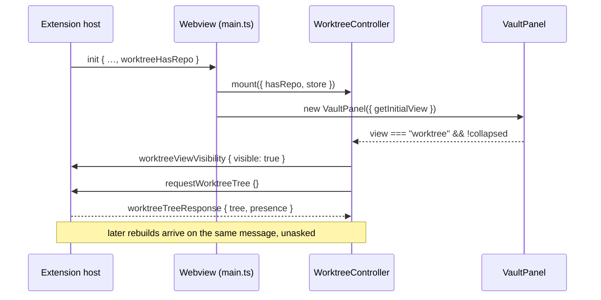

# Design: wire-live-worktree-tree

## Architecture



## Decisions

### D1: Repository presence reaches the webview on `init`, computed without git

`WorktreeHost` SHALL contribute `worktreeHasRepo: boolean` to the `init` payload, spread beside `fileTreeHost.initPayload()` at every send site, and SHALL compute it synchronously by walking up from each workspace folder to the filesystem root looking for a `.git` entry.

The view has to be chosen before the first paint, and the host pushes nothing to a surface that has not declared the view visible — so a webview that opened on the sessions body could never learn it should not have. A value that arrives with `init` closes that loop without a round trip. The probe is synchronous on purpose: an awaited answer would make `initPayload()` return a stale `false` on a cold window, which is the exact failure the field exists to prevent.

The probe's definition of "repository" is deliberately looser than git's — a `.git` present while git is unusable opens the Worktree body on its own `git unavailable` state, which is the truthful report; the alternative silently hides a repository the user has.

```ts
// src/worktree/hasGitRepo.ts
export function hasGitRepo(folders: readonly string[], exists?: (p: string) => boolean): boolean;

// src/providers/WorktreeHost.ts
export interface WorktreeInitPayload { worktreeHasRepo: boolean }
interface WorktreeHost { initPayload(): WorktreeInitPayload }
```

### D2: One controller owns the worktree message seam

The webview's worktree wiring SHALL live in `WorktreeController`, not in `main.ts`, which keeps only the mount call and one router delegation. `worktreePreview.ts` is deleted; `worktreeFixtures.ts` stays as test data.

`FileTreeController` set this precedent for the same reason: the composition root stays a composition root, and the feature's message handling is testable without booting a webview.

### D3: Visibility is view × section, declared only when it moves

`visible` SHALL be `view === "worktree" && !panel.isCollapsed()`, posted only when the value changes, with `requestWorktreeTree` following each transition into visible. Nothing polls.

A collapsed section shows the body no more than a different segment does, and both retain their DOM — which is precisely the render cost the host's gate exists to avoid paying.

The render guard is NOT reset when the section re-expands. The sessions list resets its own because its DOM can be cleared while hidden; the worktree body is only `display: none`, so the DOM the signature describes is still on screen.

### D4: The controller owns the three render states

| State | Set when | Cleared when |
|---|---|---|
| `loading` | mount, until the first response | first `worktreeTreeResponse` |
| `noFolder` | `init.workspaceRoot === null` | never — it is the workspace's shape |
| `refreshing` | a forced request is posted | the next response, or the view becoming not visible |

`refreshing` is cleared on becoming invisible because the host skips pushes to a surface that stopped showing the view: a force in flight across that transition would otherwise leave the marker claiming a rebuild is still coming back.

### D5: The live view offers no control whose effect it cannot produce

The view SHALL mount with no context menu, no create control, and no row-level open control while no action path exists. `WorktreeViewDeps.actions` and `onActivateAgent` become optional; absent `actions` means no `contextmenu` listener and no menu instance.

Under fixtures these controls were the vocabulary being signed off. Over a real worktree the same controls either do nothing or state fixture-sourced evidence about the user's repository — a remove confirmation would name untracked files it never counted. Phase 5 and 6 return each control with the operation behind it.

## Risk Map

| Component | Risk | Mitigation |
|---|---|---|
| `init` payload | A send site missed when the field is added posts init without it | Field is required on `InitMessage`, so `pnpm run check-types` fails on any missed site |
| `hasGitRepo` probe | Disagrees with git's own answer (`.git` present, git unusable) | Accepted and specified: the Worktree body opens on its `git unavailable` state (D1) |
| `refreshing` marker | A forced request unanswered across a visibility change leaves the marker set | Cleared on the visible→invisible transition (D4) |
| Tree size | Worktrees per repo grows with the user's branches | Existing render cap of 20 per repo with a "Show all" affordance; this change adds no new unbounded list |
| Action surface | Removing the fixture dialogs is a visible regression from the signed-off shell | Recorded in proposal.md § Out of scope; PLAN Phase 5/6 restore each control with its operation |
