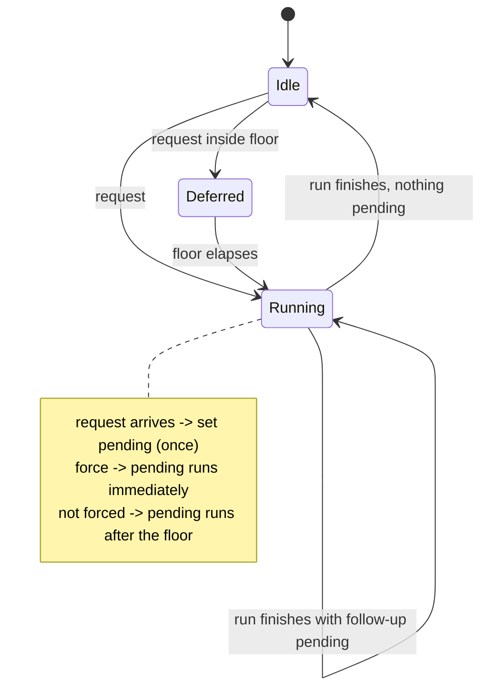

# Design: fix-worktree-freshness-contract

## Decisions

### D1: Root resolution reports why it failed, and absence is not failure

`resolveRepoRoots` SHALL return, for every folder it was given, either the resolved repository or
the reason resolution did not produce one, distinguishing "this folder is not a repository" from
"git could not answer".

The information already exists and is discarded: `GitCommandResult` carries `timedOut` and
`failedToSpawn` (`src/worktree/gitCommandRunner.ts:17-20`), and `resolveToplevel` collapses all of
them into `undefined` at `src/worktree/repoRoots.ts:56`. `resolveCommonDir` collapses the same way
at `:76`, `:80`. Both are one-line reads away from the truth. `describeFailure` already exists in
`WorktreeDiscovery` for listing failures and is the reason string's source, so degraded copy stays
uniform across all three causes.

### D2: Stickiness lives in the cache, keyed by workspace folder

The cache SHALL remember which workspace folder produced which `repoId` on the last successful
resolution, and a folder that is still open but failed to resolve SHALL carry its remembered
repository forward, marked degraded.

A failed resolution never learns the `repoId` — the `repoId` *is* the normalized common dir, which
is what resolution failed to read. The folder path is the only stable key available, and
`workspaceFolders()` is read at rebuild time (`WorktreeHost.ts:115`), so "folder still open" is
authoritative and free. This is what separates a transient failure from the user removing the
folder, which `applyBuild`'s `repos.clear()` (`WorktreeCache.ts:65`) currently cannot do.

Putting it in the cache rather than behind a stateful resolver keeps one owner for degraded, which
is also where D3 has to live.

### D3: An unavailable git degrades the tree; it does not empty it

`read()` SHALL return the retained repositories, each marked degraded with the git-unavailable
reason, and SHALL keep reporting git as unavailable. It SHALL return no repositories only when
none is retained.

Today `read()` returns `repos: []` whenever `gitAvailable` is false (`WorktreeCache.ts:84-92`),
discarding every cached listing. Because the negative probe is memoised for
`GIT_CAPABILITY_RETRY_INTERVAL_MS = 30 min` (`gitCapabilities.ts:13,108`), a forced refresh re-reads
the cached `absent` and cannot recover it — the panel is empty for half an hour after one transient
`EAGAIN`. Retention and the existing memo then compose correctly: the tree stays visible and stale
rather than absent, which is what the memo was safe to assume all along.

### D4: One pending follow-up per scope, and `force` never joins a running rebuild

The gate SHALL hold at most one pending follow-up per scope. A **forced request or a structural
signal** arriving while a rebuild for that scope is running SHALL set it rather than resolve against
the running rebuild; `force` SHALL schedule that follow-up immediately, and a signal SHALL schedule
it subject to the floor. A plain non-forced request SHALL keep resolving against the running
rebuild, which is what keeps `worktree-tree-protocol`'s "Concurrent requests without force produce
one rebuild" true.

The gate therefore has to be told which it is: a watcher signal and a webview request are both
non-forced today and reach `request()` indistinguishably, so a `signal` option carries the
difference and `WorktreeHost`'s watcher callback is its only producer.

`if (state.inFlight) return state.inFlight` (`rebuildGate.ts:132-134`) is correct only when the
request precedes the running rebuild's git read, which the gate cannot know. The single pending
slot is what keeps "one rebuild, one push" true for the follow-up as well, so N signals during one
rebuild still produce one further rebuild.

### D5: Watch targets are rebased so no watcher is recursive over the git directory

| # | Base | Pattern | Events | Recursive |
|---|---|---|---|---|
| W1 | `<commonDir>` | `HEAD` | change | no |
| W2 | `<commonDir>` | `worktrees` | create, delete | no |
| W3 | `<commonDir>/worktrees` | `*` | create, delete | no |
| W4 | `<commonDir>/worktrees` | `*/HEAD` | change | yes — scoped to `worktrees/` |

The rule is stated in the vendored API contract (`node_modules/@types/vscode/index.d.ts:13857-13860`):
a pattern containing `**` **or path segments** is watched recursively, otherwise non-recursively.
Today's `worktrees/*` and `worktrees/*/HEAD` (`worktreeWatchTargets.ts:30-31`) therefore each open a
recursive watcher over the whole common dir, where `files.watcherExclude` does not exclude `index`,
`logs/`, or `refs/`. The narrowness claimed in that file's comment holds at the event-filter layer
only.

The premise that forced the current base — *"a watcher based on a directory that does not exist
never sees it appear"* (`worktreeWatchTargets.ts:20-22`) — is contradicted by the same contract at
`:13861-13863`: **"paths that do not exist in the file system will be monitored with a delay until
created"**. W3/W4 may therefore be based inside `worktrees/` before it exists, and no
re-subscription lifecycle is needed. W2 remains because a non-recursive watcher on the common dir
is what reports `worktrees/` itself appearing without waiting on that delay.

W4 stays recursive because catching HEAD one level down otherwise costs one watcher per linked
worktree plus the churn of reconciling them. Scoped to `worktrees/`, it monitors small per-worktree
metadata only — no `objects/`, `logs/`, or `refs/`.

### D6: The host module owns the presence types; the view re-exports them

`src/worktree/presenceTypes.ts` SHALL be the only declaration of `PresenceDegradation`,
`WorktreeSubagentRow`, `WorktreeAgentRow` and `WorktreePresence`;
`src/webview/worktree/worktreeViewTypes.ts` SHALL re-export them.

This is the move that file's own header already specifies — *"When the host modules land these move
to `src/worktree/` and this file re-exports them"* (`worktreeViewTypes.ts:5-8`) — and that its line
21 already performs for `WorktreeInfo` / `WorktreeRepo` / `WorktreeTree`. The host copy is the wire
type (`src/types/messages.ts:6`). Structural typing makes the two compile today, so the drift this
prevents is silent: a field added host-side renders nowhere and, being absent from
`worktreeSignature()`, never invalidates the render guard.

## Risk Map

| Component | Risk | Mitigation |
|---|---|---|
| `WorktreeCache` folder→repoId memory | Grows with folders opened over the window's life, never pruned | Bound to the current `workspaceFolders()` on every `applyBuild`; a folder no longer open drops its entry — same pass that already rebuilds `order` and `folders` |
| `WorktreeCache.read()` | Retained-but-degraded repos are indistinguishable from fresh ones to a consumer that ignores `degraded` | D3 keeps `gitAvailable: false` on the tree, so the flag still carries the whole-tree truth; the panel delta makes it visible |
| `rebuildGate` follow-up | A run that always re-signals itself becomes an unbounded rebuild loop | Follow-up is a single slot, and a non-forced follow-up is still floored at one per second per repo — the sustained ceiling is unchanged |
| `rebuildGate` follow-up | A rejected follow-up has no waiter, producing an unhandled rejection | The follow-up adopts the pending deferred's `reject`; when no request is waiting the gate resolves it the way `dispose()` already does |
| W3/W4 based on a not-yet-existing `worktrees/` | The "monitored until created" contract is asserted by docs, not by this repo's tests | Task 4_2 verifies it against the real VS Code watcher rather than the pool double; W2 is the fallback that reports the directory appearing regardless |
| W4 recursive over `worktrees/` | Grows with linked worktrees per repo; a repo with many worktrees widens one recursive watch | Metadata only — no `objects/`, `logs/`, `refs/`; growth axis is worktree count (tens), not repository size |
| Four tests currently asserting the defects | Rewriting an assertion can silently weaken it instead of correcting it | Each rewrite lands in the same task as its fix, so the corrected assertion must fail before the fix and pass after — a rewrite that never went red is a defect in the task |
| `WorktreeView` empty-state reorder | The `gitMissing` state is reachable only when nothing is retained, a case the fixtures do not currently produce | `worktreeFixtures.ts:123` already returns the git-unavailable empty tree; the retained variant is added beside it |
