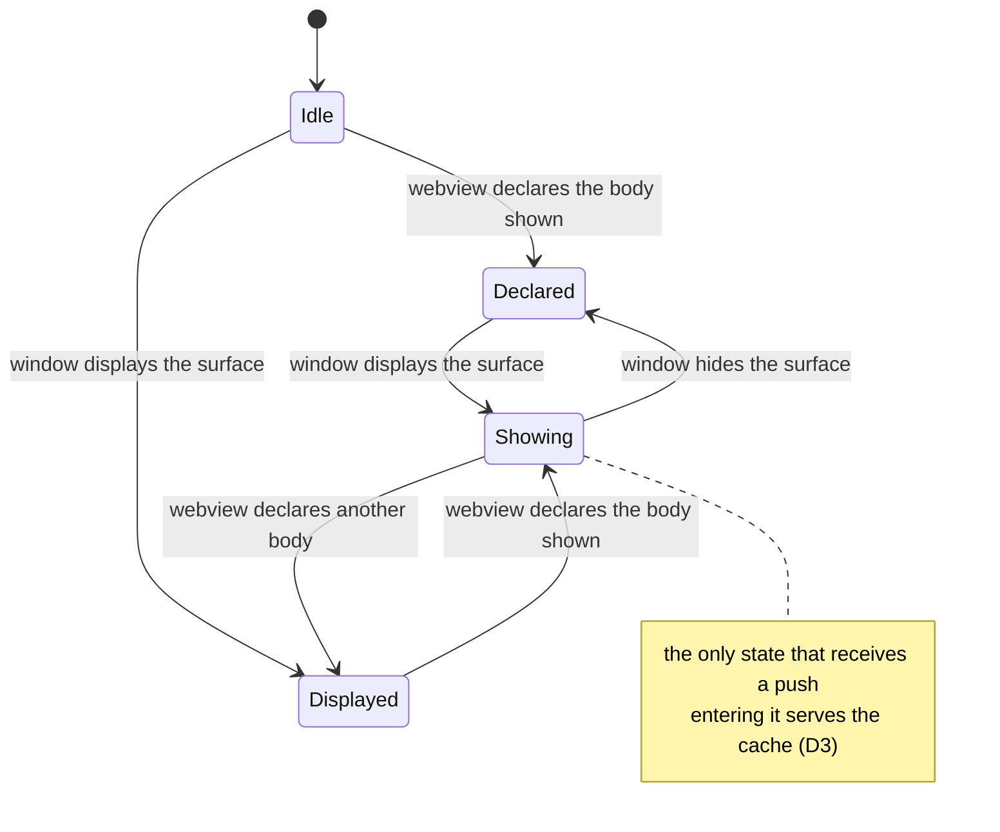

# Design: stop-wasted-worktree-renders

## Decisions

### D1: The window reports display state; the webview keeps declaring the view

`WorktreeHost` SHALL learn whether a surface is being displayed from the extension host, not from
the webview, and SHALL keep taking "which body is shown" from the webview's existing
`worktreeViewVisibility` message.

Both providers already hold the signal: `TerminalViewProvider.ts:231` subscribes
`webviewView.onDidChangeVisibility` seven lines below the worktree attach at `:224`, and
`TerminalEditorProvider.ts:309` subscribes `onDidChangeViewState`, whose event carries
`webviewPanel.visible`. Both edges are there; only the wiring is missing.

The alternative — a new host→webview "hidden" message so the webview re-declares — needs a message
the protocol does not have, and asks a webview VS Code has frozen to report on its own state. The
host's own event is the authority. It also repairs the case where a declaration outlives the
webview that made it: `TerminalEditorProvider` holds `this.worktreeSurface` across a script
restart, so a stale `visible: true` survives a reload the webview does not.

### D2: Two independent facts, ANDed at the gate

`SurfaceState` SHALL carry a second flag for "the window is displaying this surface", defaulting
false, and `broadcast()` SHALL require it alongside the existing declaration and `isReady()`.

Neither flag can stand for the other, which is why this is an AND and not a replacement: the
worktree body can be the shown body inside a panel the user has hidden, and a fully visible panel
can be showing the sessions body. The existing default-false comment on `visible` states the same
reasoning for the declaration, and the new flag inherits it — a surface that has never reported
must not be pushed to.

### D3: Entering the showing state serves the cache, never a rebuild

On the transition into the state where both facts hold, the host SHALL post the current listings to
that surface alone. It SHALL request a build only where none has been produced.

The watches are not torn down while a surface is hidden, so the cache is current — a rebuild would
re-read git to produce what the cache already holds, and would push it to every showing surface
rather than the one that just appeared. Requesting a build when nothing has been built yet is the
existing `built === false` path in `handleMessage`, reused rather than repeated.

This is what keeps the falling edge from becoming a staleness bug: the moment the user can see the
panel again is the moment it is brought up to date.

### D4: The provider reports through the attachment it was given

`attach()` SHALL return a handle carrying both `dispose()` and the display-state setter, rather
than the host exposing a setter keyed by surface identity.

The return value is already stored (`worktreeAttachment`) and already pushed onto `disposables`, so
a handle that still has `dispose()` is a superset of today's contract and no call site changes
shape. Keying by surface identity instead would let a provider report for a surface it never
attached, or for one whose attachment it has already disposed — the exact class of bug the stale
`this.worktreeSurface` field makes reachable in the editor provider.

### D5: The guard's coverage is proved by construction, not by a list

The signature test SHALL derive its field set from the wire types, so a field added to the wire
types and omitted from the key fails the build.

`worktreeRenderSignature.test.ts:43-80` walks six hand-written mutations. The key is complete over
today's types, so nothing is broken — but Phase 4 adds fields to the presence rows, and the
existing test's shape means such a field renders stale forever with no failing test and no compile
error, which is the failure mode WT-003.2's Notes name.

Two halves, and both are needed:

- A fully populated fixture typed so every field must be present. `Required<T>` on the wire types
  makes an added field a type error until the fixture sets it.
- A walk over that fixture's own keys, asserting each moves the signature, with deliberate
  exclusions named in an allow-list carrying the reason. `scannedAt` is the only current entry, and
  the rule that keeps the allow-list honest is that it lists field names, never whole types.

## Risk Map

| Component | Risk | Mitigation |
|---|---|---|
| Display-state flag | A provider that never reports leaves its surface permanently silent — worse than the bug being fixed | Both providers are wired in the same task as the flag, and the surface-count assertions in the host tests fail loudly if a surface never becomes showing |
| Editor panel | `onDidChangeViewState` fires for activity changes too, so `visible` can repeat its current value | The transition into showing is edge-triggered on the ANDed value, not on the event, so a repeat is a no-op |
| D3 single-surface post | A second code path that builds the same message can drift from `broadcast()` | The message is built once and the recipient loop takes the surface set, so broadcast and single-surface delivery differ only in that set |
| `Required<T>` fixture | Nested optional objects and union-typed fields do not flatten, so the fixture can compile while a nested field is unset | The walk descends into the nested row and subagent shapes explicitly; a type whose fields are not walked is named in the allow-list with its reason, which is what review reads |
| Allow-list | It can quietly grow into a way to silence the test | It carries a reason per entry and lists field names only — never a whole type, which would re-open the gap wholesale |
