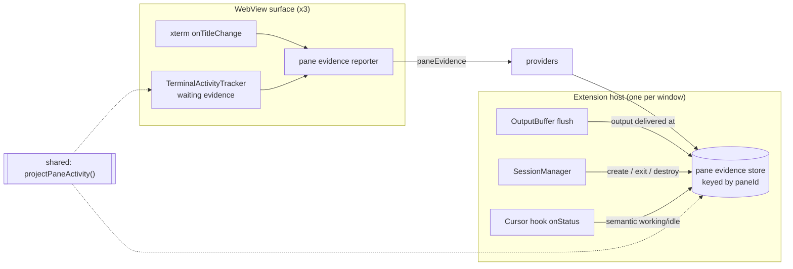

# Design: add-host-pane-evidence

## Architecture



The store is a passive registry in WT-004.0: nothing reads it yet. `WorktreeHost.presence()`
keeps returning an empty projection until WT-004.1 consumes the store. That boundary is
deliberate — `docs/PLAN.md` WT-004.0 Notes require the seam built and verified before any row
is projected.

## Decisions

### D1: The store is a standalone window-scoped registry, not a SessionManager field

`createPaneEvidenceStore()` is constructed in `extension.ts` beside `worktreeHost` and injected
into the three writers that already exist (`SessionManager`, the Cursor hook `onStatus`
callback, the providers' message switch).

`SessionManager` is already 1462 lines and owns pty lifecycle; presence evidence is a different
concern with a different consumer. Injecting a narrow sink keeps `SessionManager`'s new surface
to three call sites and lets `WorktreeHost` take the store as a plain read dependency in
WT-004.1 without reaching through the session manager.

### D2: Entries are created by pane creation and removed by pane closure — never by session removal

`SessionManager.sessions` is the wrong lifetime, and it is worth being exact about why. A
natural pty exit runs `transitionState(id, "live", "exited-preserved")` and then
`cleanupSession(id)`, which reaches `this.sessions.delete(sessionId)` — while the tab is still
on screen showing `[Process exited with code N]`. Keying the store's lifetime to the session
map would therefore destroy exactly the evidence `worktree-agent-presence.md` § 6 says must be
durable: *"The pane's pty exits, tab still open → `activity: "exited"` … durable for exactly as
long as the tab is."*

The store's own entry set is the gate instead:

| Event | Call | Why there |
|---|---|---|
| `createSession` | `create(id, { exited: restoringExited })` | The only place a pane comes into existence. `restoringExited` seeds a restored read-only tab correctly instead of claiming it is live |
| `respawnFallbackShell` | `markExited(id, false)` | The one path that puts a live pty back into a pane that exited |
| `pty.onExit` (natural) | `markExited(id, true)` | Durable for the life of the tab |
| `destroySession` | `delete(id)` | Closing one pane — synchronous, before the queue, and reached whether or not a session still exists |
| `destroyAllForView` | `deleteForView(viewId)` | Closing a whole view. It reaches `performDestroy` directly, never `destroySession`, so a per-pane delete alone would leak every pane an editor panel held (.reviews/round-1.md B1) |
| `dispose` | clear | `dispose()` clears `this.sessions` directly and never calls `cleanupSession`; without this the store would outlive the window |

`cleanupSession` deliberately does **not** delete: it runs on natural exit too, and deleting
there is the bug above.

The store keeps its own pane-to-view index for `deleteForView`, rather than reading
`viewSessions` back from `SessionManager`. That map has the same defect as `sessions` and for
the same reason: `cleanupSession` splices a naturally-exited pane out of it while the tab is
still on screen, so a view close that walked it would leave behind exactly the durable `exited`
evidence this decision exists to protect.

`report()` mutates an existing entry and never creates one, so a webview cannot grow the store
by naming ids the host never issued — `DESIGN.md` § 8.5's rule that webview-supplied ids are
re-resolved host-side, enforced by construction rather than by a predicate that could go stale.
The bound is the window's open pane count.

### D3: Unknown is `undefined`, absent is a value — per signal, not per pane

```ts
interface PaneEvidence {
  /** Decorative signature of the last reported title. `undefined` = never reported. */
  title?: string;
  /** Whether the last reported raw title carried a decorative frame. */
  decorated?: boolean;
  /** `undefined` = never reported; `false` = reported as not waiting. */
  waiting?: boolean;
  /** Epoch ms of the last pty output chunk. `undefined` = none since the pane opened. */
  lastOutputAt?: number;
  /** True while the pty has exited and the pane is still open. */
  exited: boolean;
  /** Last agent-reported semantic state; `null` when cleared, `undefined` when never set. */
  semantic?: "working" | "idle" | null;
}
```

Optionality carries the distinction, so no parallel `reported: boolean` field can drift out of
step with the value it describes. WT-004.1 reads the same optionality to qualify
`agentSource` / `activitySource` (`worktree-agent-presence.md` § 3.3, "Absence is not `none`").

This is why `paneEvidence` carries **partial** evidence (§ Interfaces). Title and waiting change
at different moments and arrive from different sources; a message that required both would make
the first title report invent `waiting: false`, collapsing unknown into proven-absent on the one
field the seam exists to keep honest. The store therefore assigns only the fields a message
actually carries.

### D4: Waiting evidence is reported, not re-derived host-side

`worktree-agent-presence.md` § 3.3 leaves this open. Waiting is derived by
`hasCurrentCursorApproval`, which reads the xterm buffer through the terminal object — state
that does not exist in the host at all. Moving the derivation would mean streaming buffer
content across the boundary, so the derived boolean travels instead.

Title evidence follows the same shape, and for I9 its normalization happens in the webview,
before the message exists.

### D5: One shared module owns the activity rules and the constants both sides compare against

`src/shared/paneEvidence.ts`, pure and dependency-free:

```ts
export const OUTPUT_IDLE_WINDOW_MS = 1500;
export const MAX_REPORTED_TITLE_CHARS = 1024;

export type LiveActivity = "running" | "waiting" | "idle";
export type PaneActivity = LiveActivity | "exited";

export interface LiveActivityEvidence {
  waiting: boolean;
  semanticWorking: boolean;
  outputActive: boolean;
}

export function projectLiveActivity(e: LiveActivityEvidence): LiveActivity;
export function projectPaneActivity(e: LiveActivityEvidence & { exited: boolean }): PaneActivity;
```

`TerminalActivityTracker.project()` replaces its inline ternary with `projectLiveActivity` and
takes its `idleDelayMs` default from `OUTPUT_IDLE_WINDOW_MS` (today a bare `1500`). The store
computes `outputActive` as `now - lastOutputAt < OUTPUT_IDLE_WINDOW_MS`.

Two functions rather than one narrowing call: the tracker's `TerminalActivityStatus` is a
three-state type used across `WebviewState` and `TabBarUtils`, and a cast to remove `"exited"`
at the one call site that can never produce it is worse than an exact signature.

### D6: The host observes output at the flush point, storing a timestamp and never the bytes

`OutputBuffer` gains an optional `onFlush(tabId, at)` constructor callback, invoked when the
webview takes delivery of a flush — `postMessage` resolving `true`. A rejection, a resolved
`false` (VS Code's "dropped, not deliverable"), or a synchronous throw record nothing: output
the surface never received must not read as activity on it. `at` is stamped when the flush was
produced rather than when delivery was confirmed, so a slow confirmation still dates the output
correctly (.reviews/round-2.md W1). A late resolution needs no generation token — the store
mutates existing entries and never creates one, so a stamp for a pane already deleted is a
no-op. `SessionManager` passes it at both construction sites
(`createSession`, `respawnFallbackShell`).

`pty.onData` is one line away and looks cheaper, but it is the wrong instant. The webview's
`markOutput` fires when the `output` message *arrives*; `pauseOutput()` holds a buffer for the
whole of a snapshot-restore replay, so a host clock started at `onData` can cross the idle
window and read `idle` while the tab, having received nothing yet, is about to read `running`.
Sharing `projectPaneActivity` does not save that — the two sides would be projecting different
evidence. `worktree-agent-presence.md` § 3.3 names the flush point for this reason.

Cost is one callback per flush, which is already batched to a 4–16 ms adaptive interval — not
per chunk.

### D7: Title evidence is reported from the factory's single `onTitleChange` site

`TerminalFactory.ts:451` is the one place both root tabs and split panes wire
`applyTitleChange`, with `id` in scope. A new optional `onTitleEvidence(id, rawTitle)` dep is
wired there; `main.ts`'s three `onTitleChange` handlers stay untouched.

The reporter — not `applyTitleChange` — computes `titleSignature(raw)` and
`hasDecorativeFrame(raw)` and holds the last sent triple per pane, because waiting changes
arrive from a different source and both must collapse into one change-gated message.
`titleSignature.ts` gains an exported `hasDecorativeFrame`, derived from the regex it already
holds, so the two sides cannot drift.

`TerminalActivityTracker` gains one optional dep, `onWaitingChange(sessionId, waiting)`, fired
only when the stored `waiting` evidence flips — `setWaiting` is called on every output write, so
an ungated callback would be an animation-rate message source. Because it fires on the flip and
not on the tracker's initial `false`, a pane that has never waited reports no waiting evidence
at all, which is what keeps unknown distinct from proven-absent (D3).

### D8: Reporting is unconditional on which view a surface is showing

Unlike `worktreeTreeResponse`, which is gated on `worktreeViewVisibility` and window display,
`paneEvidence` flows whenever a pane's evidence changes.

Presence is window state, not per-surface state (`DESIGN.md` § 8.6). A surface that gated its
reports on showing the worktree view would leave the host blind to exactly the panes it alone
renders whenever the user is looking at the sessions body — the under-reporting this seam
exists to remove. The cost is one small message per real title change per pane; the change gate,
not a visibility gate, is what bounds it.

### D9: The shared projection covers today's evidence, and is the place title rules land next

`worktree-agent-presence.md` § 6 adds two title-derived rules — a shell title (`zsh` / `bash` /
`pwsh`) forces `idle`, a spinner-only title feeds `running`, a neutral title proves neither.
They are **not** in `projectLiveActivity` here, deliberately: the terminal tab applies no title
rule today, so adding one now would change what the tab shows, which is outside WT-004.0 and
directly against task 1_2's acceptance.

The store already holds `title` and `decorated`, so WT-004.1 adds those rules by widening
`LiveActivityEvidence` and this one function — and they then land on the tab and the worktree
row together, which is the whole point of the shared seam. This is an extension point, not a
rework.

### D10: The store announces changes; it does not decide what to do about one

`createPaneEvidenceStore` takes an optional `onChange(paneId)`, fired on any mutation.

Nothing subscribes in WT-004.0. `worktree-agent-presence.md` § 3.7 makes "pane activity status
changed" a presence rebuild trigger coalesced into the tree's 150 ms debounce — that debounce
and the push belong to WT-004.1. Emitting the signal now costs one callback and stops WT-004.1
from having to reopen this module to add one; deciding the cadence here would be guessing at a
contract § 3.7 already owns.

Output going idle is a clock event, not a mutation, so it fires no `onChange` — WT-004.1's
rebuild trigger has to arm a timer for it either way, and a store that fired its own idle timer
would be a second, competing debounce.

## Interfaces

```ts
// src/types/messages.ts — WebView -> Extension
// Partial by contract (D3): each field is evidence that changed, and absence of a
// field means "unchanged", never "false". `title` and `decorated` travel as a pair.
export interface PaneEvidenceMessage {
  type: "paneEvidence";
  paneId: string;
  title?: string;
  decorated?: boolean;
  waiting?: boolean;
}

// src/session/PaneEvidenceStore.ts
export interface PaneEvidenceStore {
  /** The only entry-creating call. */
  create(paneId: string, init?: { exited?: boolean }): void;
  /** Assigns only the fields the message carries. No-op for an unknown pane. */
  report(msg: PaneEvidenceMessage): void;
  markOutput(paneId: string, at: number): void;
  markExited(paneId: string, exited: boolean): void;
  setSemantic(paneId: string, state: "working" | "idle" | null): void;
  delete(paneId: string): void;
  clear(): void;
  read(paneId: string): PaneEvidence | undefined;
  activityFor(paneId: string, now?: number): PaneActivity | undefined;
}

// src/session/OutputBuffer.ts — new optional 4th constructor argument
type OnFlush = (tabId: string, at: number) => void;
```

## Risk Map

| Component | Risk | Mitigation |
|---|---|---|
| `TerminalActivityTracker` | Extracting the rules changes the tab's activity indicator | Rules extracted verbatim; the existing `TerminalActivityTracker.test.ts` suite runs unchanged as the regression gate (task 1_2) |
| Pane evidence store | Unbounded growth from reports for unknown panes | D2 — `report` mutates existing entries only, so no message can create one. Bound = open pane count, which the window already bounds |
| Pane evidence store | Title field grows with a hostile OSC payload | `MAX_REPORTED_TITLE_CHARS` truncation in the reporter and again in the store |
| `paneEvidence` message rate | A message per title frame would flood the boundary at animation rate | Reporter gates on the decoration-stripped signature plus the decoration flag (I9); a spinner produces zero messages. Waiting is gated on the evidence flip, not on `setWaiting` being called (D7) |
| Pane lifecycle | Evidence deleted while the tab is still open, or leaked after it closes | D2 pins each lifecycle call to a named site. Closing a pane and closing a view are two paths, not one — `destroyAllForView` reaches `performDestroy` directly — so each gets its own deletion, both synchronous and both ahead of the async queue |
| `SessionManager` | A restored read-only tab claims to be live, or a respawned fallback shell inherits a stale `exited` | `create` seeds from `restoringExited`; `respawnFallbackShell` clears it explicitly at the pty swap (D2) — no reliance on `wirePty` being the single path |
| `OutputBuffer` flush callback | Per-flush work on the extension's hottest path | One clock read into an existing `Map` entry, at the already-batched 4–16 ms flush interval; no allocation, no bytes retained |
| Inbound `paneEvidence` | Providers cast after a discriminant check only, so a malformed payload reaches the store | The store validates every field and the title/decorated pairing before assigning, and drops the message otherwise (spec: reject evidence a report cannot justify) |
| Revived editor panels | A panel restored through `TerminalPanelSerializer` never routes its reports | The serializer is threaded the store the same way it is already threaded `worktreeHost` (`src/extension.ts:269`), and task 3_2 leases it |
