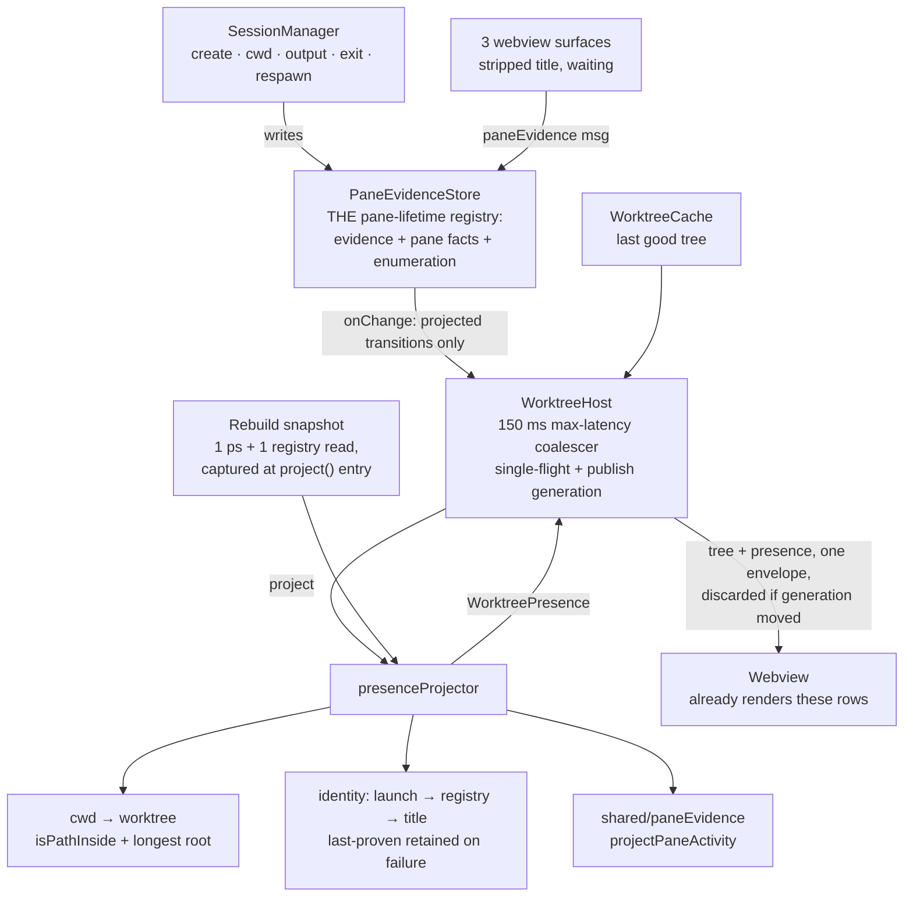

# Design: project-worktree-agent-presence

## Architecture



The webview half already exists — `worktreeViewTypes.ts`, `worktreeFormat.ts` and
`worktreeRenderSignature.ts` consume `WorktreePresence` end to end from fixtures. This change swaps
the producer.

## Decisions

### D1: Presence is projected in the extension host, from the pane evidence store

The projection reads `PaneEvidenceStore`, never a webview tracker and never `SessionManager`
directly.

Both facts only a webview can see — title and waiting — already reach the host through the WT-004.0
seam. The tracker is per-surface and cannot see panes on the other two surfaces, so it is
structurally the wrong source for a window-scoped view
(`docs/design/worktree-agent-presence.md` § 3.3). D2 explains why the store, not the session map, is
the pane set.

### D2: The evidence store is the pane-lifetime registry and the enumerable pane set

`PaneEvidence` gains the facts a projection needs — `cwd`, `ptyPid`, `shell`, `isAgentLaunch`
(`viewId` is already indexed) — and the store gains `panes()`. `SessionManager` seeds them at
`create`, updates `cwd` from `setCurrentCwd`, and updates `ptyPid` / `shell` / `isAgentLaunch` when
`respawnFallbackShell` swaps the pty. Entries are removed only by pane closure or view closure.

**Enumerating from `SessionManager` would be wrong, not merely inconvenient.** `cleanupSession`
deletes a naturally-exited session from `sessions` and `viewSessions`
(`src/session/SessionManager.ts:1415-1434`) while the tab is still on screen showing
`[Process exited]`. A projection walking the session map would drop that pane's row entirely, when
the contract is that it keeps a row reading `exited` until the tab closes. The store already has
exactly the right lifetime — that is why WT-004.0 gave it a pane-to-view index instead of reading
`viewSessions` back — so the pane facts belong beside the evidence rather than in a second registry
with a third lifetime.

`session.currentCwd` stays the owner for persistence and snapshots; the store's copy has one writer,
`SessionManager`, at the same call sites that set the session's own fields.

### D3: Presence publication is coalesced, self-expiring, single-flight, and generation-checked

Four separate rules, each closing a different hole:

1. **Coalescing is a max-latency cap, not a resettable debounce.** The first change arms a timer for
   150 ms; further changes inside that window do not push it out. A resettable debounce starves
   under continuous output — which is precisely the workload an agent produces.
2. **Output notifies on projected transitions, not on every timestamp.** `markOutput` fires
   `onChange` only when the pane's *projected* activity moved. Sustained output therefore announces
   once on entering `running`, not once per flush.
3. **Idle expiry is scheduled, not discovered on read.** `activityFor` derives `outputActive` from a
   clock, so nothing announces the `running` → `idle` edge when output simply stops. The store arms
   a per-pane deadline at `lastOutputAt + OUTPUT_IDLE_WINDOW_MS` and fires `onChange` when it
   elapses — the same idle-timer shape `TerminalActivityTracker` already runs webview-side. Without
   it the worktree row reads `running` forever while the tab reads `idle`, which is the exact
   disagreement `src/shared/paneEvidence.ts` exists to prevent.
4. **Publication is serialized and generation-checked.** `project()` is async, so two projections can
   finish out of order and a slow presence-only job can republish a tree the git rebuild already
   superseded. The host keeps a monotonic publish generation: a projection is single-flight (a change
   arriving mid-projection marks dirty and re-runs after), and a result whose generation no longer
   matches is discarded rather than broadcast.

A presence rebuild still bypasses `rebuildGate`'s one-second floor, because that floor bounds **git**
reads and WT-001.2 requires an agent working inside a worktree to drive no git rebuild. What it must
not bypass is publication ordering, which is a different property that happened to live in the same
place.

### D4: Identity resolves over the ranks that have a source, reusing the registry that owns them

| Rank | Source | Proof |
|---|---|---|
| 1 | `launch` | `isAgentLaunch` is set and `agentKindForExecutable(shell)` returns an id |
| 2 | `registry` | The rebuild's session resolution returns a session for the pane |
| 3 | `process` | **No source.** Needs the recognition table `docs/PLAN.md` defers |
| 4 | `title` | The reported title token-matches a curated title name |
| 5 | `none` | Nothing proved one — the row renders as a plain terminal |

**Rank 1 is `agentKindForExecutable` (`src/vault/registry.ts`), not a new matcher.** It already
normalizes a basename, strips `.exe/.cmd/.bat/.ps1`, and resolves the registry's aliases — which is
how a Cursor pane launched as `agent` or `cursor-agent` is recognised at all. Four call sites already
gate it on `isAgentLaunch`. A second matcher driven off `VAULT_AGENT_IDS` alone would silently
disagree with the launch data for exactly that agent.

Rank 1 needs no teardown guard: `respawnFallbackShell` clears `isAgentLaunch`
(`src/session/SessionManager.ts:742`), so the rank stops claiming the moment a shell reclaims the
pane. D2 keeps the store's copy in step at the same site.

Rank 3 is skipped, not faked. Rank 2 answers `claude` only, so a Codex or OpenCode pane resolves by
rank 1 or 4 or not at all — a limitation the UI already states rather than hides. `agent` is omitted
whenever the source is `none`; an unreported title is *unknown* and falls through to the next rank,
never resolving to `none` by itself.

### D5: The shared module carries only what the webview also needs

`src/shared/agentNames.ts` exports `isShellName` and `matchTitleAgentName`, both built on
`(?<![\w./\\-])name(?:\.(exe|cmd|bat|ps1))?(?![\w./\\-])`. It is dependency-free because D6 puts
`isShellName` in the webview bundle. Rank 1 does not go through it (D4).

`includes` makes `openclaude ⊃ claude` and `opencode-blinker ⊃ opencode` into false identities —
misfires the reference implementation hit and documented
(`/Users/huybuidac/Projects/ai-oss/orca/src/shared/agent-name-token-match.ts`).

**The title name list is curated and deliberately narrower than `VAULT_AGENT_IDS`.** `cursor` is an
ordinary English word, so a title-driven rank reading the launchable-agent list would paint plain
shell titles as agent activity — the same reason the reference excludes short names like `amp` from
its title path while still launching them. Title identity is the weakest rank; widening it is how it
starts lying.

### D6: The two title rules land in the shared activity projection

`projectLiveActivity` takes one more field, `titleClass: "shell" | "agent" | "neutral" | "unknown"`,
and applies: `exited` → `waiting` → `titleClass === "shell"` forces `idle` → `running` → `idle`.

`src/shared/paneEvidence.ts` already records that these rules belong in that function so they reach
the tab and the worktree row in one change. `waiting` deliberately outranks the shell rule: a false
`idle` on a pane blocked on the user hides a prompt they must answer, the costlier of the two errors.
A row forced idle this way reports `activitySource: "title"`.

### D7: A decoration-only title is neutral for activity, not evidence of running

`titleClass` is `neutral` for a title whose stripped form is empty, whatever its decoration flag.

`docs/design/worktree-agent-presence.md` § 6 says a spinner-only title "feeds activity". That holds
inside the webview, which sees frames arrive. It cannot hold in the host: WT-004.0 strips decoration
*before* sending, precisely so an animation produces zero messages, so the host receives one report
and can never distinguish a spinner that is animating from one frozen at the moment its process hung.
Deriving `running` from it would make a hung agent read as working forever. The activity evidence is
the **output** a live spinner produces, not the title it leaves behind — the reference implementation
had to add `clearWorkingIndicators` for exactly this, because stale exit titles kept reporting
working (`/Users/huybuidac/Projects/ai-oss/orca/src/shared/agent-title-status.ts`). § 6 should be
corrected to say decoration does not independently prove activity; the corresponding output does.

### D8: One resolution slot per pane, with negative results retried

The projector holds one entry per pane: `{ ptyPid, cwd, outcome }`. A **proven** outcome is reused
while the pane's id, pty pid and cwd all hold. An **absent** or **failed** outcome is re-attempted on
the next rebuild.

Keying the map by the triple itself leaks: a pane that changes directory leaves its old key behind,
and per-pane eviction never reaches it. Worse, caching a negative on the triple is a correctness bug,
not a cost one — a shell pane resolves to "no session", the user then starts an agent in it without
changing pty pid or cwd, and rank 2 would never be retried for the life of that pane. Retrying is
affordable precisely because D9 makes the shared work per-rebuild rather than per-pane: a retry is a
set lookup against a snapshot that was going to be taken anyway.

### D9: The rebuild owns its snapshot; the TTL does not define the boundary

`project()` captures one snapshot at entry and passes it to every pane: one process-table read and
one running-session registry read, both as shared promises. `src/pty/processTableSnapshot.ts` may
back the process table with a TTL so a later external scan can join it, but the TTL never decides
what "one rebuild" means.

A TTL alone cannot satisfy an absolute per-rebuild bound: pane resolutions are sequential and
awaited, so a TTL expiring mid-rebuild lets a later pane issue a second `ps`. The registry read has
the same shape and is worse — `resolveClaudeSession` calls `listRunning()` itself on every
invocation (`src/session/resolveClaudeSession.ts:57`), so N panes are N registry scans today. Both
are hoisted into the snapshot and injected through the existing `ResolveClaudeSessionDeps` seam,
which needs no change to accept them.

### D10: Failure is typed and identity is retained, never silently downgraded

The process-table snapshot returns a typed outcome — `ok` with descendants, `unsupported`, or
`failed` with a reason — in the discriminated-union shape `src/worktree/repoRoots.ts:60-76` already
uses. A resolution that fails or is inconclusive **retains that pane's last proven identity and its
source**, and appends a `PresenceDegradation` naming the source, its reason, and the epoch of the
first consecutive failure. A source that succeeds replaces its rows and clears its entry; a source
that succeeded and found nothing is not named.

`docs/design/worktree-agent-presence.md` § 5 requires "session resolution times out → keep the row's
previous identity". Mapping a `ps` timeout to an empty descendant list, as `descendantPids` does
today, makes that impossible: the projector cannot tell "this pane has no agent" from "we could not
look", so a transient timeout silently demotes a proven `claude` row to a plain terminal.

**The registry reader keeps its untyped shape here.** Giving `listRunningClaudeSessions` a typed
outcome is assigned to WT-004.2 by `docs/PLAN.md`, and pulling it forward would take that task's
work. It is safe to defer *because* identity is now retained: an unreadable registry can no longer
clear a row, it can only fail to sharpen one. What it cannot yet do is say so, which is the gap
WT-004.2 closes.

### D11: `rowId` is `window:<paneId>`, and an identity epoch bounds timestamp inheritance

The projector holds per-row timestamps across rebuilds keyed by `rowId`: `startedAt` on first sight,
`stateStartedAt` reset only when `activity` actually changes, `finishedAt` stamped entering `idle`
from `running` or `waiting` and cleared on any transition out. `lastActivityAt` is the newest
evidence timestamp the row saw, **quantized to whole seconds**.

Rows are keyed by pane, but the timestamps describe an *agent*, and a pane outlives the agents inside
it. When the resolved agent or session id changes, the row enters a new identity epoch and
`startedAt` / `stateStartedAt` / `finishedAt` reset — otherwise a fresh agent inherits the age and
finish time of the one that ran in that pane an hour ago. A source *upgrade* for the same agent
(title proving what launch already claimed) is not a new epoch.

Quantizing `lastActivityAt` is what makes the coalescer worth having: the field is in the webview's
render signature (`src/webview/worktree/worktreeRenderSignature.ts`), so an unquantized value differs
on every push and no push is ever guarded out.

### D12: The projector supplies the listing's ranking key

`orderWorktrees` already takes a `WorktreeActivityRank`; the host passes one backed by the newest
`lastActivityAt` across each worktree's rows, `undefined` for a worktree with no rows.

Ordering is applied where the tree is assembled, so a presence-only push reuses the order the last
git rebuild produced and a worktree's rank takes effect on the next one. That lag is the point: a
list re-sorting itself every 150 ms while an agent typed would move rows out from under the cursor.
Before the first projection every worktree ranks as having none, so order is stable rather than
intermediate.

### D13: Path containment and entry ids come from their existing owners

Pane-to-worktree attribution uses `isPathInside` (`src/utils/pathBoundary.ts`) and selects the
longest matching root, mirroring `matchRepository` (`src/worktree/repoRoots.ts:79-97`). Vault handles
are built with `formatEntryId` (`src/vault/types.ts:53`).

`isPathInside` already handles the three cases a hand-rolled `startsWith(id + sep)` gets wrong —
filesystem-root roots, Windows separator drift, and drive-letter casing — and its header records that
it was extracted specifically so the worktree module would not grow a third copy. `formatEntryId`
exists because a locally assembled `agent:sessionId` parses differently from every other producer
once a session id contains its own colon.

## Interfaces

```ts
// src/shared/agentNames.ts        (dependency-free; imported from both bundles)
export function isShellName(text: string | undefined): boolean;
export function matchTitleAgentName(text: string | undefined): VaultAgentId | undefined;

// src/shared/paneEvidence.ts      (extended)
export type TitleClass = "shell" | "agent" | "neutral" | "unknown";
export interface LiveActivityEvidence {
  waiting: boolean; semanticWorking: boolean; outputActive: boolean;
  titleClass: TitleClass;              // "unknown" when no surface has reported
}

// src/session/PaneEvidenceStore.ts (extended — D2)
export interface PaneEvidence {
  /* …existing… */
  cwd?: string; ptyPid?: number; shell?: string; isAgentLaunch?: boolean; viewId?: string;
}
export interface PaneEvidenceStore {
  /* …existing… */
  panes(): readonly (PaneEvidence & { paneId: string })[];
  markCwd(paneId: string, cwd: string): void;
  markProcess(paneId: string, p: { ptyPid?: number; shell?: string; isAgentLaunch?: boolean }): void;
}

// src/pty/processTableSnapshot.ts  (D9, D10)
export type DescendantsOutcome =
  | { kind: "ok"; pids: readonly number[] }
  | { kind: "unsupported" }
  | { kind: "failed"; reason: string };
export interface ProcessTableSnapshot { descendantsOf(rootPid: number): Promise<DescendantsOutcome> }
export function createProcessTableSnapshot(opts?: {
  ttlMs?: number; now?(): number; exec?: ProcessTreeDeps["exec"]; platform?: NodeJS.Platform;
}): ProcessTableSnapshot;

// src/worktree/presenceProjector.ts
export type IdentityOutcome =
  | { kind: "proven"; agent: VaultAgentId; source: WorktreeAgentRow["agentSource"]; entryId?: string }
  | { kind: "absent" }
  | { kind: "failed"; source: PresenceDegradation["source"]; reason: string };
export interface PresenceProjectorDeps {
  panes(): readonly (PaneEvidence & { paneId: string })[];   // the STORE, not SessionManager
  activityFor(paneId: string, now?: number): PaneActivity | undefined;
  /** One snapshot per rebuild — process table + running-session registry. */
  openSnapshot(): Promise<ResolutionSnapshot>;
  normalize(p: string): string;
  now?(): number;
}
export interface PresenceProjector {
  project(worktreeIds: readonly string[]): Promise<WorktreePresence>;
  rank(worktreeId: string): number | undefined;
}
```

## Risk Map

| Component | Risk | Growth axis / bound | Mitigation |
|---|---|---|---|
| Idle expiry (D3.3) | Row reads `running` forever after output stops | one timer per pane with recent output | Deadline armed at `lastOutputAt + OUTPUT_IDLE_WINDOW_MS`, cleared on delete; test asserts the row flips to `idle` with no further evidence |
| Push churn (D3.1, D3.2, D11) | Sustained output pushes at 150 ms and repaints the tree | pushes per second under continuous output | Transition-only notification, max-latency coalescer, and second-quantized `lastActivityAt`; test drives a continuous stream and bounds the pushes — *not* an assertion that the render guard absorbs it, which is false while `lastActivityAt` moves |
| Publication (D3.4) | A slow presence job republishes a superseded tree | concurrent projections | Single-flight + monotonic publish generation; test interleaves a slow presence job with a git rebuild |
| Pane enumeration (D2) | An exited pane's row vanishes instead of reading `exited` | — | Store is the pane set; test exits a pty, asserts the session left `SessionManager` and the row survives, then closes the pane and asserts it goes |
| Resolution cache (D8) | A negative cached on an unchanged pane never retries | one slot per live pane | Proven outcomes reused, absent/failed retried; test starts an agent in a resolved-empty pane without moving pty pid or cwd |
| Cache growth (D8) | Stale keys accumulate for a live pane that changes directory | one slot per live pane | One slot per pane, overwritten in place; evicted against the live pane set each rebuild |
| `ps` + registry reads (D9) | panes × rebuilds, unbounded today | 1 process-table + 1 registry read per rebuild | Snapshot captured at `project()` entry; test advances the fake clock past the TTL *between* pane resolutions and still observes one read |
| Typed failure (D10) | A `ps` timeout demotes a proven agent to a plain terminal | — | Typed outcome plus last-proven retention; test fails the read and asserts identity and source are unchanged and a degradation is appended |
| Identity epoch (D11) | A new agent inherits the previous agent's age | — | Epoch reset on agent/session change, not on source upgrade; both cases tested |
| Title identity (D5) | A common word paints a shell as an agent | curated list, not `VAULT_AGENT_IDS` | Token-bounded matcher; `cursor`-as-a-word and `openclaude` both covered |
| Store cwd/process copy (D2) | Two copies of a pane's facts drift | — | One writer, at the same sites that set the session's own fields, including the fallback respawn |
