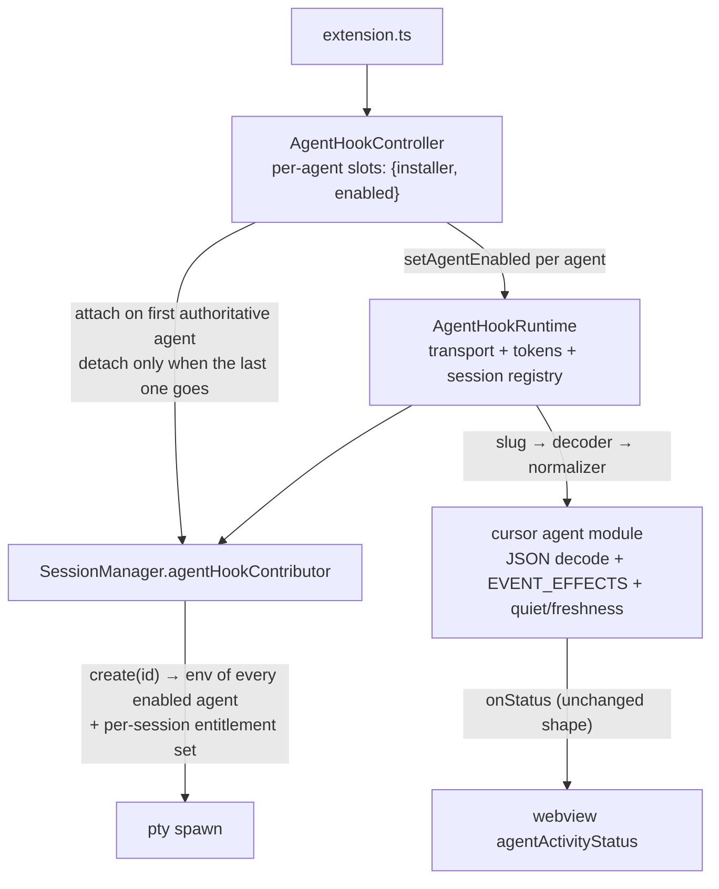

# Design: generalize-agent-hook-runtime

> Mechanism authority: [docs/design/agent-hook-server.md](../../../docs/design/agent-hook-server.md) § 2, § 4.1, § 4.2, § 5, § 7. This file records only the choices that doc leaves open for this change.

## Architecture

## Decisions

### D1: One multi-agent contributor, not a contributor collection

The generalized `AgentHookRuntime` remains the single `SessionEnvironmentContributor`; `SessionManager` keeps its singular slot (renamed `agentHookContributor`), and `create(sessionId)` returns the merged env of every *enabled* agent registration.

agent-hook-server.md § 2 allows either shape. One contributor preserves `SessionManager`'s proven release-on-swap semantics untouched, guarantees per-agent coordinates arrive whole or not at all (one mint site), and makes "one runtime" structural rather than conventional — there is no second slot for a second runtime to occupy.

### D2: One session token, plus a per-session entitlement set that disable removes from

The per-session renewable token is unchanged and shared by every agent in that pane — the trust boundary is the pane (agent-hook-server.md § 7), so per-agent tokens would add state without adding a boundary.

Authority is instead two-part, both re-checked at use time:

1. **Global**: the agent slug is registered and currently enabled.
2. **Session entitlement**: `create(sessionId)` records the set of agents whose coordinates that spawn actually received. A post is accepted only if its slug is in that session's set.

`setAgentEnabled(agent, false)` **removes that agent from every live session's entitlement set** and clears its per-session semantic state and dedup entries. Re-enabling affects only future `create()` calls: a pane that inherited agent A's URL before the disable can never post as A again without a fresh pty. Without this the URL would lie dormant in the pane's environment and revive on re-enable — dormant authority surviving disable, which § 7 forbids and which today's all-or-nothing `setEnabled(false)` prevents by clearing the whole session registry.

Disabling the last enabled agent, and `dispose()`, clear the session registry entirely — for a Cursor-only window that is exactly today's behaviour.

### D3: Target layout — new `src/agentHooks/`, cursor becomes a registration

- `src/agentHooks/AgentHookRuntime.ts` — transport, auth, dedup, session/token/entitlement registry, `registerAgent({ id, slug, envVar, decode, normalizer })`, per-agent `setAgentEnabled`.
- `src/agentHooks/AgentHookController.ts` — per-agent slots `{installer, initialEnabled}`, reconcile serialized per agent, aggregate contributor lifecycle per D6.
- `src/agentHooks/agents/cursor.ts` — the Cursor agent module: JSON decoder, `EVENT_EFFECTS` table, quiet window, freshness expiry, `working|idle` semantic states, `ANYWHERE_TERMINAL_CURSOR_URL`, slug `cursor`.
- `src/cursor/CursorHookRuntime.ts` and `CursorHookController.ts` are **deleted** (imports updated) — a surviving re-export is the "second runtime beside the first" failure mode PLAN.md names. `CursorHookInstaller.ts` and `CursorExecutableResolver.ts` stay in `src/cursor/` untouched.

### D4: Agent-facing contract frozen; HTTP response follows the authority

`ANYWHERE_TERMINAL_CURSOR_URL`, the `/<sessionId>/<token>/cursor` path shape, the installed wrapper script content, and the `anywhereTerminal.cursorAgent.hooks.enabled` key survive byte-identical — wrapper scripts already installed in users' `~/.cursor/hooks.json` reference them. New agents add a slug and env var via registration; nothing existing moves.

The response becomes **204 with no body** per agent-hook-server.md § 4.1, replacing today's `200 {}`. The wrapper discards the response (`curl --output /dev/null`; PowerShell `| Out-Null`), so no agent observes the difference; the `{}` an agent reads comes from the wrapper's own stdout, which is untouched.

Reason-code parity holds at the path level: an unregistered slug stays `bad-path`, exactly as a non-`cursor` third segment does today. `agent-disabled` and `not-entitled` are new codes reachable only in states a single-agent build cannot enter.

### D5: Core owns transport and containment; the agent module owns decode and semantics

The core validates method, path, token, entitlement, size, and deadline, then hands the registration **bounded raw bytes plus request metadata**. The registration's `decode` produces its own event shape (Cursor's JSON today; Claude's form-encoded envelope in WT-006.3 without touching the core), and its `normalizer` owns event vocabulary, state machine, and timers.

Two containment rules make that boundary safe:

- **Exceptions never escape.** A throwing `decode` or `normalizer` is caught by the core, dropped with a reason code, and answered 204 — fail-open governs (§ 4.1), so a buggy agent module must never stall the agent or crash the handler.
- **Dedup is namespaced per agent.** The digest map is keyed by `slug + digest`, so identical bytes posted to two slugs are two events, not one silently swallowed.

`onStatus` generalizes to carry the registration's agent id; the webview `agentActivityStatus` message shape is unchanged.

### D6: Aggregate contributor lifecycle

Per-agent reconciliation controls only `runtime.setAgentEnabled(agent, …)`. The contributor itself is attached and detached on the aggregate:

1. Attach on the first agent whose install reconciles successfully while enabled.
2. Disabling one of several authoritative agents does **not** detach — the remaining agents' live sessions keep their coordinates (D2 removes only the disabled agent's entitlement).
3. Detach only when no authoritative agent remains.
4. `dispose()` detaches once, disables every slot, then disposes the shared runtime.

Applying today's per-agent authority dance independently would call `setContributor(undefined)` on any single disable, and `SessionManager.setAgentHookContributor` releases every tracked session on a swap — so one agent's disable would revoke another's live panes. That is the specific regression this decision exists to prevent.

## Risk Map

| Component | Risk | Mitigation |
|---|---|---|
| AgentHookRuntime | Regression while moving shipped auth/transport | Migrate `CursorHookRuntime.test.ts` (556 lines) with assertions intact, construction and the 204 expectation adapted; all reason-code and token-lifecycle cases keep passing |
| Entitlement set (D2) | Dormant authority revived by re-enable | Two-agent test: disable A → A rejected, B valid; re-enable A → the old A URL still rejected; fresh `create()` → both valid |
| Contributor lifecycle (D6) | One agent's disable revokes another's panes | Controller tests for pending-install-while-another-succeeds, disabling one of two, disabling the last, dispose during pending reconcile, per-agent revision races |
| Agent module boundary (D5) | A throwing decoder stalls or crashes the handler | Fake-agent tests: alternate encoding, throwing decode, throwing normalizer, identical bodies to two slugs |
| Bind failure | Panes lose inference fallback | Controller test: `createRuntime()` rejection leaves the contributor unattached and no authority granted |
| SessionManager seam | Partial coordinates or leaked authority on swap | Rename only — release-on-swap logic untouched; `SessionManager.cursorHooks.test.ts` migrated intact; env minted per agent in one `create()` call |
| extension.ts wiring | Second runtime left beside the first | D3 deletes the old modules; the build Verify Gate's type check fails on any stale import |
| Current-state docs | Docs keep naming deleted modules | Task 2_2 leases `docs/DESIGN.md`, `docs/design/agent-cli-integration.md`, `docs/design/session-manager.md` and updates them with the rename |
| Session registry growth | Unbounded map | Bounded by live pane count, entries removed on `release()`/teardown (unchanged); dedup already TTL+LRU capped, now per slug |
