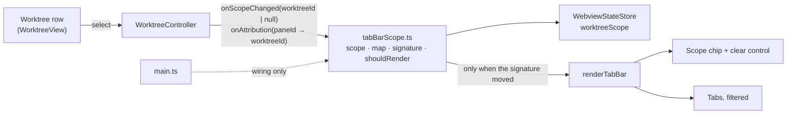

# Design: scope-tabs-to-the-selected-worktree

The scope model, the join, the escape hatch and the layout are owned by
[worktree-scope.md](../../../docs/design/worktree-scope.md). This file records only what that
document leaves to the implementation, and the two places the shipped code contradicts it.

## Architecture

Both arrows out of the controller are dep callbacks in the shape `onCreateAvailability` already
uses (`WorktreeController.ts`); nothing new crosses the webview↔host boundary.

## Decisions

### D1: Scope is webview-local state on the surface, persisted through the existing store

Scope lives in the `tabBarScope.ts` coordinator (D8), is written with `store.updateState(...)`
under a new `worktreeScope?: string` key in `WebviewState`, and is read by nothing host-side.

`worktree-scope.md` § 2.1 already forbids sending it to the host. The store is the same mechanism
`vaultView`, `worktreeCollapsed` and `worktreeExpandedRows` use, so per-surface persistence, the
absent-means-default rule, and the older-build case all come for free rather than being rebuilt.

### D2: The controller publishes attribution; the tab bar consumes it

The controller already holds the presence envelope and already resolves which worktree published a
row (`WorktreeController.ts`, `rowsByWorktreeId`). It reports a pane→worktree map outward; the tab
bar joins its own tabs to it by pane id.

The alternative — the tab bar reading presence itself — is a second attribution path, and
`worktree-scope.md` § 3.1 rules it out by name: two paths are how the tab bar and the worktree row
start disagreeing about the same pane. A tab whose pane id the map does not hold is *unattributed*
and is shown; the map carries no third value for it, because an absent key already means exactly
that and a sentinel would invite a fourth outcome.

A pane the map places in more than one worktree is left **unattributed** rather than resolved by
last-write-wins. `worktreeIdOf` today returns the first bucket holding a matching row
(`WorktreeController.ts:618-625`), and a naive `Map.set` would silently pick the last — two
different answers to a question the evidence did not settle. Under "hide only what is proven",
a contradiction is not proof.

A **split tab** is one tab over several panes. It is attributed to the scoped worktree when any of
its panes is, and hidden only when every one of its panes is attributed elsewhere — the same
"prove it belongs elsewhere" rule applied to a set. `buildTabBarData` already walks a split's
leaves for activity aggregation and is where this belongs.

### D3: A scoped tab bar is visible whatever the tab count

`renderTabBar` today toggles visibility on `terminals.size >= 2`. Scope adds a second, independent
reason to be visible: the surface is scoped.

This is forced, not chosen. The chip is the only thing on screen saying the list is a subset
(`worktree-scope.md` § 7 rule 1), so a scope that filters down to one tab would otherwise hide its
own escape hatch — the exact failure the rule exists to prevent. It contradicts an applied
requirement, which is why `tab-bar-component` carries a MODIFIED delta rather than only ADDED ones.

### D4: The chip is a child of `#tab-bar`, rendered by `renderTabBar`

It is the head element of the same reconciled child list the tabs and the "+" button live in, so
it survives re-render the way they do and needs no second render path or second element to
position. `renderTabBar`'s existing tail-trimming loop is what would otherwise delete it.

### D5: The card treatment marks selection, and stops marking expansion

`WorktreeView.renderWorktree` wraps a worktree in `.wt-card` when it is *expanded*. The card is the
loudest treatment in the tree, so today the panel emphasises whatever the user last disclosed and
calls nothing selected — and once selection exists, that emphasis reads as a selection the user
never made.

The card becomes the selection mark. Grouping a worktree with its agent rows is still needed and is
kept, as a quieter container that carries no selection meaning.

### D6: The rollout setting follows the `rowActivation` path exactly

`anywhereTerminal.worktree.workbench`, boolean, default `false`. Read host-side in
`SettingsReader.ts` (the webview has no `workspace.getConfiguration`), delivered on the init
message, and updated live through an `affectsConfiguration` listener — the three pieces
`worktree.rowActivation` already has, including its defaulting discipline for a hand-edited value.

Off is *inert*, not merely hidden: no tab is filtered, no chip is rendered, and a persisted scope
does not take effect. A setting that hides the chip but keeps the filter would be the invisible
filter with extra steps.

### D7: Scope is re-resolved on every tree push, from the tree alone

| The tree now says | Scope |
|---|---|
| The scoped worktree is present | Kept |
| It is present and reported `missing` | Kept — the registration exists and panes may still be attributed to it |
| It is absent (removed, pruned, or never there — including a persisted id) | Cleared, and said |

"Said" reuses the panel's existing action-result surface — the same one a create that could not
open reports through — rather than a second notice channel. It is *staged* into that surface just
before the tree is handed to the panel, so a single repaint carries the notice and the tree that
caused it: the notice is never painted beside a row for the worktree it says is gone.

**A restored scope marks no row, and this is required rather than missing.** After a reload the
chip names a worktree while the panel marks nothing — `specs/worktree-panel/spec.md` forbids
selecting a worktree on the user's behalf on a reload, and `specs/tab-bar-component/spec.md`
requires the scope to survive one. The two together mandate exactly this state, so seeding the
panel's mark from the restored scope would repeal the first clause. Pinned by a negative assertion
in `tabBarScopeWiring.test.ts` (round-2 V6), because it reads like an omission and a later round
would otherwise "fix" it.

**No attribution retention, and this is deliberate.** A degraded presence source cannot empty
attribution, so there is nothing to retain. Attribution is `attribute(normalize(pane.cwd),
worktreeIds)` (`presenceProjector.ts:820`, resolved at `:342-345`) — a pure function of the pane's
own cwd and the tree's worktree ids. `deps.panes()` is the in-process evidence store and cannot
fail, and the pane loop runs unconditionally; a `panes`/`registry` failure
(`presenceDeps.ts:196-213`) fails the *agent identity* lookup for a pane without removing it or
changing its worktree key. Each pass is either a fresh projection or a replay guarded by
`sameTree(...)` (`presenceProjector.ts:896-899`), so attribution is never stale against the tree.

A "last good attribution" cache would therefore be machinery for an unreachable state — and worse,
it would be actively harmful: the one case where attribution legitimately shrinks is a repo whose
listing failed contributing no worktree ids, so its panes reproject to `worktreeId === undefined`.
Retaining the old map there would keep hiding tabs on an attribution the current tree no longer
supports, which is exactly what the invariant in 1_7 exists to catch. Two review passes proposed
this cache; it is recorded here so a third does not.

### D8: The tab bar gets its own signature, in its own coordinator

`worktreeSignature()` covers the whole worktree-panel presentation — titles, activity, timestamps,
delegations, degradation (`worktreeRenderSignature.ts:74-125`). Extending it with attribution and
scope would make every presence scan re-enter `renderTabBar`, which is the opposite of what D8
asks for. The tab bar gets a **separate** signature over exactly three inputs: the effective scope,
the pane→worktree entries sorted by pane id, and the tab-layout membership needed to notice a
split's leaves changing.

That signature and the render decision live in a new `src/webview/tabBarScope.ts`, not in
`main.ts`. The decision is currently made at `main.ts:355-375`, and **no test in the repo imports
`main.ts`** — it is a 1452-line side-effectful bootstrap, so a render-suppression claim asserted
there could not be verified at all. A small module owning the scope, the map, the signature and
`shouldRender` is directly unit-testable, and leaves `main.ts` as wiring.

This is also what makes tasks 1_3, 1_5 and 1_6 verifiable without inventing a composition-test
harness: each tests the coordinator rather than the bootstrap.

**Where the wiring itself lives (round-1).** The decision above is unchanged, but "leaves `main.ts`
as wiring" turned out to be the load-bearing half: the four joins left there — `applyTree` before
`handleTreeResponse`, the label→chip mapping, the `shouldRender` gate, and the flag-flip path — are
exactly where B1, B2 and W1 landed, each a defect no single-object test could reach. The wiring is
therefore named and exported as `src/webview/tabBarScopeWiring.ts`, constructed by `main.ts` and
driven in `tabBarScopeWiring.test.ts` by the real view, controller and coordinator together. It is
composition, not a second controller: it holds no state of its own beyond the drop queue that
carries a notice across `deliver`.

### D9: Failure surface — the persisted surface state

One mutable resource outlives the request: the per-surface webview state holding `worktreeScope`.

| Question | Answer |
|---|---|
| Who owns writes | The surface's own `main.ts`, via `store.updateState` — a synchronous read/merge/write (`WebviewStateStore.ts:205-214`). One writer per surface |
| What serializes concurrent access | Nothing needs to: each webview holds its own state object and surfaces never share one. Two surfaces writing different scopes is the feature (`worktree-scope.md` § 2.2) |
| Crash mid-write | Each `setState` receives one complete merged object, so a half-written key is not reachable. The wrapper promises no transactionality and no recovery from a thrown write — a write that throws propagates, and the previous scope stands, which is a legal state |
| Failed or malformed read | **Fails open — unscoped.** Reads are guarded but the stored object is cast structurally, not validated (`WebviewStateStore.ts:174-200`), so the consumer must check `typeof worktreeScope === "string"` itself. A non-string, or a string naming a worktree absent from the tree, resolves to unscoped. Failing closed would leave a surface filtered by something it could not read |
| Unrelated keys | An update must preserve them; the merge is what guarantees it, and it is asserted rather than assumed |
| Two racing hosts | n/a — the state is per webview, not shared across windows or machines |

## Risk Map

| Component | Risk | Mitigation |
|---|---|---|
| The join | A pane the evidence cannot place is hidden, and is then unreachable from a tab bar that looks complete | The invariant test (task 1_7): an unattributed pane is shown in every scope, red when it is not |
| `renderTabBar` visibility | A scope filtering to ≤1 tab hides the chip with the bar | D3; asserted at the boundary, not at the caller |
| Split tabs | A split tab with one in-scope pane is hidden because another pane is attributed elsewhere | D2's any-pane rule, covered in 1_2 |
| Attribution map | Rebuilt per presence scan; grows with this window's panes | Bounded by the panes one window holds — tens, not a growth axis. Built from the envelope already in hand, no second scan |
| Tab-bar render | Scope recomputation on every presence push re-renders the bar | D8 — signature covers map + scope; asserted by a no-DOM-work test (1_6) |
| Rollout setting | Off leaves dead-but-live code paths that filter anyway | D6 — inert, not hidden; asserted with the setting off (1_7) |
| Scoped worktree disappears | Surface stays filtered by a worktree that no longer exists | D7 table, both branches tested (1_4) |
| Card treatment | Selection and expansion both claim the loudest treatment | D5 — spec requires exactly one carrier, and none when nothing is selected |
