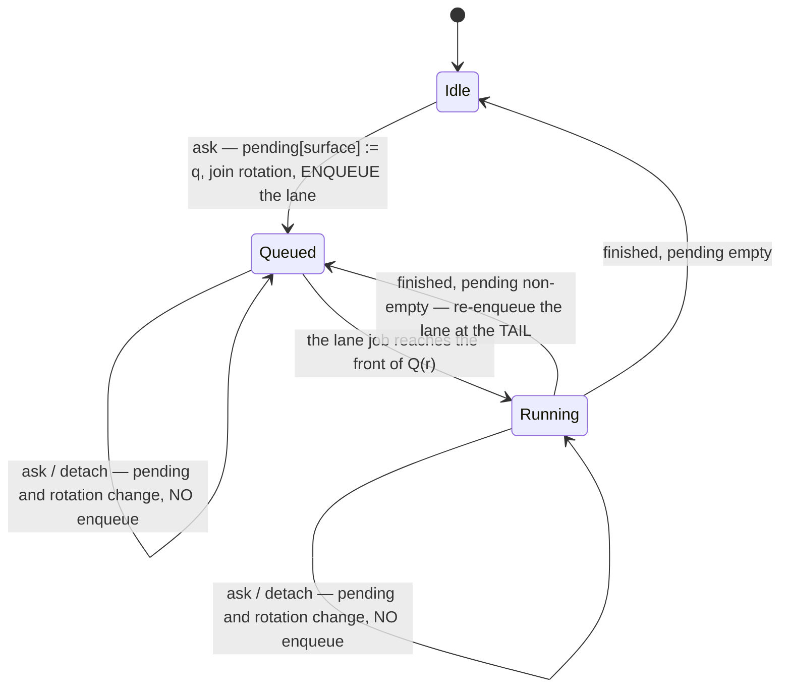

# Design: coalesce-assessment-requests-at-the-host

## Two requirements over one schedule

Per repository `r` the mutation queue `Q(r)` is a FIFO of jobs, each either a mutation `M` (remove,
lock, unlock, prune, create) or an assessment run `A`. `S(r)` is the set of attached surfaces asking
about `r`.

- **R1 — bound.** At every instant, `|{A ∈ Q(r)}| ≤ 1`, independent of how many requests are made,
  how they are patterned, and how many surfaces attach or detach.
- **R2 — progress.** For a mutation `M` enqueued at `t`, no job is placed ahead of `M` after `t`, so
  `delay(M) ≤ cost(A)`.

Neither yields, and the bound is a constant rather than a function of `|S(r)|`. One **assessment lane
per repository** satisfies both: the lane holds the pending requests outside the queue and puts at
most one job in it.

A lane job serves **one** request: the next surface in the rotation that is still attached and still
has a pending request. It takes that request, deletes the pending entry, assesses it, and replies
with that request's own token. `Queued ∪ Running` therefore holds at most one `A` per repository,
which is R1. Every enqueue — the first and the re-enqueue — appends through the same `queue.run`
tail, and the re-enqueue happens after `mutationCoordinator.run`'s own `finally` has settled, so
nothing is ever placed ahead of a mutation already waiting, which is R2.

**Why the lane is per repository and not per surface.** A slot keyed by `(surface, repository)` was
drafted here and REFUTED by the plan attack. Detaching a surface deletes its records but cannot
retract a queue job already appended, so attach → ask → detach, repeated `N` times, leaves `N` jobs
ahead of a mutation with `S(r)` empty. The bound has to be over the queue, and only something keyed
by the queue's own key — the repository — can be.

**What the panel could never do.** The parent change's `beginAssess` tried to enforce this from the
webview. It saw one surface and keyed on the single live worktree id, so alternating rows defeated it
(`.reviews/round-6.md` B5). It is also what made a dropped reply permanent (W6), because the guard
that refuses a duplicate refuses the re-ask that would recover.

## Decisions

### D1: One assessment lane per repository, holding at most one queue job

`WorktreeHost` holds, per `repoId`, a lane: a map of pending requests keyed by surface, a rotation
order over those surfaces, and whether a lane job is enqueued-or-running. A request writes
`pending[surface]` unconditionally and joins the rotation; it enqueues a lane job only when none is
outstanding for that repository.

The bound belongs to the host because this is the only place that can see every surface, and to the
repository because that is what the queue is keyed by.

Serving is **round-robin over the rotation**, not first-come: two panels asking continuously must
each be answered, and a lane that always served the same one would starve the other. Fairness is a
requirement here, not a nicety — the spec's third scenario is written against it.

### D2: A lane job serves the surface's latest question, not the one that enqueued it

The enqueued closure carries no request. On start it walks the rotation, takes the first pending
request belonging to a still-attached surface, deletes that pending entry, and assesses it; the reply
carries that request's `token` and `worktreeId`.

This is what makes coalescing sound rather than lossy: the job always answers a live question, so
work is never spent on one the user replaced. A closure that captured its own request at enqueue time
would answer a replaced question and then have to be discarded — the "skip a stale job" shape, which
bounds the cost of a backlog rather than the backlog.

### D3: A request superseded before it is served is answered by its successor

This **amends the parent change's D12**, which reads "every `worktreeRemoveAssess` from a live
surface is followed by exactly one reply carrying its token". After this change:

> A request that is still pending when the same surface asks again is replaced, and receives no reply
> of its own. A request already being served always replies, whatever arrives after it.

The plan attack refuted the stronger reading and the refutation is accepted: supersession *during* a
run cannot retract that run, so a superseded request does sometimes get its own reply — which the
parent's D11 token check then discards. The decision is about admission, not about cancellation.

It also refuted the justification first written here, that supersession means the user moved on. **It
does not.** The case that matters most is the opposite one: after a lost answer the user re-asks
*because* they are still waiting, and that re-ask supersedes their own earlier message. The correct
ground is narrower and survives that case — the successor asks the same thing the predecessor did, so
serving the successor answers the user. Nothing is owed to a message; something is owed to a
question.

### D4: The panel supersedes a repeat; it never blocks one

`WorktreeController.beginAssess` stops refusing a same-worktree duplicate. Every ask mints a token and
replaces `liveAssess`.

Two consequences, and they are why B5 and W6 are one change. The panel is no longer pretending to
bound host work, which it never could. And a request whose reply was lost in transit no longer wedges
the row: the next ask replaces it, so the recovery is the gesture the user would make anyway. Nothing
else about D11 changes — `liveAssess` is still one field, every ask replaces it, so at most one token
is live and only the latest reply can open a report.

### Rejected

| Alternative | Why not |
|---|---|
| A pending slot keyed by `(surface, repository)` | Drafted, then refuted: `N` attach/ask/detach cycles leave `N` jobs queued with no surfaces attached, because detach cannot retract an appended job. The lane is the repair. |
| Skip a stale job when it reaches the front of the queue | Bounds the *cost* of a backlog, not the backlog — and it cannot even do that cheaply: `mutationCoordinator.run` awaits its forced rebuild barrier *before* `resolve`, so a job that has entered the coordinator has already paid for itself. Making the skip free would need an admission hook on the shared coordinator, which is machinery every mutation would then carry. |
| Coalesce or prioritise inside `createKeyedSerialQueue` / `MutationQueue` | Every destructive worktree verb runs through them, and that module's header states it is deliberately non-coalescing because dropping one of two enqueued bodies is exactly the bug. Changing it to fix one read verb changes remove, lock, unlock, prune and create at once. |
| Run the assessment outside the mutation queue, taking only the barrier | Releases the queue before the assessment's own async reads, so this extension's *own* mutations could interleave with them. That is strictly wider than the window the parent's D10 measured against `blocked` → force, and it would give back the parity round-4 B3 asked for. |
| Deliver the reply through a retrying `postCritical` on `WorktreeSurface` | Designed as D5, attacked, and CUT. It was justified by an obligation the attack refuted independently of retries — a finite retry cannot guarantee an answer either — and it charged real hazards for that non-benefit: a new optional member on an interface three providers implement, a reply reordered behind traffic sent during its 50 ms sleeps, and a lengthened issue-to-redemption window the parent's ledger claims is unchanged. D4 already gives a lost answer its recovery. |
| Give the assess token a high-water mark, as the create form's `opening` has | The create form needed it because a replayed opening could mint a debris deletion authorization. Here R1 bounds the extra work at one lane job, and a replay only ever re-asks the question the live token already stands for — see the ledger's sixth row for what that does and does not establish. |

## Obligation ledger

Dispositions below carry the plan attack's verdicts. Four rows were refuted as first written; each is
recorded as the attack left it and then restated as the mechanism actually supports.

| Claim | Semantics | Defeater | Witness / check | Disposition |
|---|---|---|---|---|
| At most one assessment job is in a repository's mutation queue | `∀ r: \|{A ∈ Q(r)}\| ≤ 1`, over all request patterns and all surface churn | The outstanding flag written after an `await`, so two handler turns both read false and both enqueue; a request arriving between clearing the flag and re-reading `pending`, enqueuing nothing and leaving it unserved; or admission keyed by anything the queue is not keyed by | D1 and D6. Test: hold `forceRebuild` unresolved, alternate two worktrees from one surface and run `N` attach/ask/detach cycles, and assert `coordinator.run` was entered exactly once; release and assert exactly one further entry | supported — restated. The attack **refuted** the `(surface, repository)` slot this row was first written against, with the churn counterexample; the per-repository lane is the repair and the churn cycle is now a Verify, not a hypothesis |
| A mutation is never delayed by assessment work admitted after it | For `M` enqueued at `t`, every job ahead of `M` was enqueued before `t`; `delay(M) ≤ cost(A)` | A re-enqueue that jumps the queue — reusing the finished job's position rather than appending | The attack confirmed the FIFO half directly: `mutationCoordinator.run`'s `finally` awaits `settle()` and the promise settles before the host can re-enter `queue.run`, so the re-enqueue lands at the tail. The bound half needed R1, which the lane now gives as a constant. Test: assess, then a mutation, then a burst of asks; the mutation body runs before any assessment admitted after it | supported — restated. **Refuted** as first written, where the bound was `\|S\|·cost(A)` and `\|S\|` could be zero while jobs remained |
| A removal request is never left in a state where asking again does nothing | For every worktree and surface, an ask always posts a request and can always open a report, whatever became of any earlier answer | The parent's `beginAssess` refusing the re-ask; or a host slot that stays occupied by a request whose reply was lost | D4 — the panel refuses nothing, and the host's pending entry is deleted when its job starts, so neither side retains a request that can block the next one. Tests: a reply dropped outright, then a re-ask, produces a report; a second ask for the same worktree posts a second request | supported. This **replaces** a row claiming the user always receives the answer to the question they are currently asking, which the attack **refuted**: with all delivery attempts failed there is no answer and nothing re-enqueues. That claim was also what made the first spec delta inadmissible; both were rewritten to the property the mechanism has |
| Delivery of a reply is best-effort, and a lost one costs a question rather than a state | A reply that never arrives leaves no host or panel state behind, and no authority outstanding that the panel can spend | A design that retains something on either side pending delivery — a slot, a timer, an un-redeemed grant the panel believes in | The pending entry is deleted at job start and `liveAssess` is replaced by the next ask; a fingerprint the panel never received cannot be sent back. Named rather than closed: making this channel reliable is out of scope and the retrying sender that would have narrowed it was cut | n/a — accepted residual. The extension→webview channel is best-effort for every message; an acknowledged protocol for this one reply is new machinery for a failure whose cost is one click |
| Coalescing never answers one question with another question's answer | The reply's `token` and `worktreeId` are those of the request the job took from `pending`, never those of the request that caused the enqueue | The closure capturing its own request at enqueue time and replying with it | D2 — the closure captures nothing. Test: enqueue behind a held barrier, supersede, release; the single reply carries the successor's token and worktreeId | supported — the attack confirmed it directly, including that a successor arriving after the take does not alter the running job's pair |
| Force authority is issued at most once per served request, and never for a request that was replaced before it ran | `issuances ≤ requests served`, and a request replaced while still pending is never assessed | A lane job re-serving a request it already took; or a `pending` entry that survives the take | The entry is deleted at take, so a request is served at most once and only a later write can re-enqueue. Test: three asks coalesced into two served requests issue at most two fingerprints | supported — restated. **Refuted** as first written, which promised *strictly fewer* issuances whenever supersession occurs: a successor arriving after its predecessor started yields two runs and two fingerprints, because clearing at take bounds re-service, not supersession timing |
| A replayed assess token cannot leave the panel holding authority for a worktree or a state it was not shown | A duplicate delivery of an earlier request costs one lane job, and any report it opens describes the worktree that request named, assessed now | A reply whose `worktreeId` or evidence differs from what the live token's question asked about | The reply carries the `worktreeId` the job read from `pending` and the panel renders that; the fingerprint is re-evaluated against `isIdentityPreservingSubset` when the removal redeems it | n/a — restated. **Refuted** as first written, which claimed a replayed token can mint nothing spendable: after a lost reply the token is still live, so a duplicate's reply passes the live-token check and opens a report with a fresh fingerprint. That is the user's own question answered currently, not misdirected authority — which is why the high-water mark stays rejected, on this ground rather than the one first given |
| An assessment inflates `mutationQueue.isBusy` for its repository | A read makes the repository report busy while it runs | A quarantine or admission decision reading `isBusy` and treating a read as a write | **Not introduced here.** `assessRemovalReport` has entered the queue since the parent's D10. The attack searched independently and confirmed no production consumer — only the interface, its implementation, and tests. R1 strictly shortens the window | n/a — pre-existing, no consumer |
| A registration replaced during the assessment's own reads cannot be told apart | — | Barrier resolves A; the async status, ignored and proof reads replace A with B before `stillObserved` can see it | **Not a claim this change makes.** Shared with the shipped `blocked` → force path and named `n/a` by the parent's D10. The attack confirmed this child does not change the window | n/a — pre-existing and shared; needs its own PLAN task, already recorded in the parent's workflow.md |

## Design Constraints

### D6: Admission bookkeeping is written synchronously, in the handler's own turn

The `pending` write, the outstanding flag, the take at job start, and the clear-and-re-enqueue at the
end each happen in one synchronous block, with no `await` between reading a value and writing the
decision it implies.

Stated because this host has lost it before: the create form's own comment records the same rule and
the round-1 defect that motivated it (`WorktreeHost.ts:611-615`). A flag written after an await lets
two handler turns both observe "no job outstanding" and enqueue two, breaking R1; a `pending` read
after an await lets a request that arrived in the window be dropped with no job left to serve it,
which is a lost wakeup. The attack confirmed no handler turn can interleave inside the synchronous
decision as specified — that confirmation is *of the specification*, so the implementation has to
hold it.

## Risk Map

| Component | Risk | Mitigation |
|---|---|---|
| Assessment lane (`WorktreeHost.ts`) | Growth axis is repositories in the workspace — one lane each, each holding one pending request per attached surface. Neither is request-driven | Bounded by workspace folders × attached surfaces, both human-created. The queue contribution is the constant R1, which is what the growth question is actually about |
| Assessment lane | Round-robin starvation under two continuously-asking panels | D1 serves the rotation rather than the newest request; the spec's third scenario is the witness, and it is in task 1_1's Verify |
| Assessment lane | A lost wakeup leaves a request pending with no job — the failure the parent's spec forbids | D6, plus the third ledger row's re-ask recovery. Verified by the mid-run interleaving test in task 1_1, not by inspection |
| `WorktreeController` (D4) | Removing the duplicate guard restores an unbounded request door if D1 is absent or wrong | Deps order: 1_2 lands only after 1_1. The controller test asserts a repeat posts a message; the host test asserts a repeat enqueues no second job |
| Lost reply | The user's click appears to do nothing once | Accepted residual, fourth ledger row. D4 makes the next click the recovery; the retrying sender that would have narrowed it was cut for the reasons in § Rejected |
| `src/extension.worktreeAssembly.test.ts` | Strengthening the walk could weaken what it already proves — the parent's round-6 adjudication rests on it | Task 3_1 must reproduce the barrier-bypass falsifier and report it as mutation evidence; its Verify cannot observe that, which is stated in the task rather than left implied |
