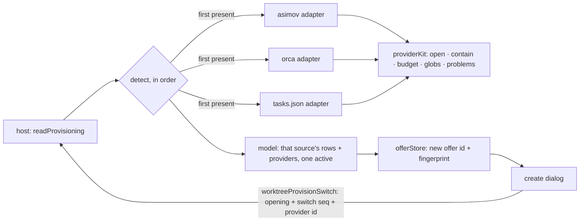

# Design: detect-the-provider-the-repo-already-uses

> Expands [worktree-provisioning.md](../../../docs/design/worktree-provisioning.md) § 3.2, § 3.3,
> § 4.1 and [worktree-create.md](../../../docs/design/worktree-create.md) § 4.3.
> D7 and D8 correct that document; both are carried to blueprint sync.

## Architecture



The dispatcher is the only thing that knows there is more than one adapter. Each adapter stays what
§ 3 says it is: a pure function from file text to a partial model, executing nothing and reading
nothing outside the repository.

## Decisions

### D1: JSONC is parsed by `jsonc-parser`, not by stripping comments

`.vscode/tasks.json` SHALL be parsed with `jsonc-parser` (MIT, no dependencies), the parser VS Code
itself uses for that file.

A comment stripper is a scanner that has to be right about string literals, escapes and `//` inside
a URL before it can strip anything, and it would be reading an untrusted checked-in file. Using the
editor's own parser makes the adapter agree with the editor by construction rather than by our test
coverage. It is the change's only new runtime dependency; the extension's runtime surface goes from
two packages to three.

`parse()` runs in tolerant mode with its error list captured: a file malformed beyond what JSONC
permits yields a `malformed` problem naming the file, never a throw, matching the fail-open rule the
existing reader already follows.

### D2: The shared kit takes a provider context; nothing in it is Asimov-shaped

The root preparation, the safe provider-file open, containment, the budgets, glob expansion, id
minting and problem construction SHALL move to `providerKit.ts` **and take the calling provider's
identity as a parameter**. No moved function may close over `ASIMOV_PROVIDER_FILE`.

The helpers are not provider-agnostic today: `problem()` stamps `ASIMOV_PROVIDER_FILE` into every
problem it builds, and `entriesFor` stamps it into every entry's `source`. Moved unchanged, an orca
entry would claim it came from `asimov/worktree.yaml`, and every existing Asimov test would still
pass, because that is exactly what those tests assert. So "the Asimov suite passes with no edits"
is a regression witness and **not** an acceptance witness for this task: the kit needs its own
tests that call it as a non-Asimov provider.

The extraction also takes the *sequence* at `asimovProvider.ts:396-424`, not only the declarations
— prepare the resolved root, prove the provider file is contained, then open it. Three adapters
opening three checked-in files need one ordering of those three steps, and it is the ordering this
repository has already had to fix once (round-1 B2: the old code read first and checked after).

### D3: A source that is present is the answer, even when its answer is empty

`readProvisioning` SHALL try, in this order: `asimov/worktree.yaml`, then orca
(`orca.yaml` / `.worktreeinclude`), then `.vscode/tasks.json`. A source is a **hit** when at least
one of its files is present, whatever that file then yields — rows, nothing, or a problem. The first
hit supplies `entries`, `setup` and `ports`; every later source whose files are present is appended
to `providers[]` with `active: false` and contributes no row.

Presence, not usefulness, because the alternative reads a repository's own answer as an absence. A
checked-in `asimov/worktree.yaml` holding only comments is a repository saying "nothing here"; a
file that cannot be read is a repository with a broken config it needs told about. Falling through
either one offers a different tool's answer to a question this repository already answered, and does
it silently. The cost is a first offer that can be empty, and D5's switch row is what makes the
other source one click away rather than hidden.

The order is a module constant, never a directory listing, so the active source cannot depend on
enumeration order or on when a file was written. `.vscode/worktree.json` is absent from the list on
purpose: WT-012.4 inserts it at the front, where § 4.1 puts it, by editing one array.

### D4: A task's command is quoted unless the task declares itself a shell task

For an entry whose `type` is exactly `"shell"`, `script` SHALL be `command` verbatim followed by
each `args` element rendered as a POSIX single-quoted word. For **every other** entry — including
one with no `type` — `command` SHALL be rendered as a single-quoted word too.

VS Code runs a process task without a shell: its `command` is a literal executable name, and
`./bin/build; touch /tmp/x` names a file with a semicolon in it. Rendering that verbatim into a
string a later task hands to `sh -c` turns a task VS Code runs safely into two commands. Quoting it
preserves the semantics the task file declared instead of inventing shell semantics it never had —
and it is also what makes an ordinary executable path containing a space keep working. An absent
`type` is quoted rather than guessed, because a wrong guess in that direction is the injection and
a wrong guess in the other is a step that fails visibly.

`args` are single-quoted in both cases (`'` → `'\''`), which no argument text escapes.

This fills a gap rather than following one: worktree-provisioning.md § 3.3 defers to "the shell
quoting § 2.4 already applies", and that document has no § 2.4 — § 2 has no subsections and states
no quoting rule. The dangling reference is carried to blueprint sync. Nothing here runs anything;
WT-012.11 owns the shell and owns whether a Windows rendering is needed.

`options.cwd` is not honoured and is not silently dropped: an entry declaring one is offered with an
`unsubstituted`-class problem naming the task, for the same reason a `${...}` token is — the step
will run in the new worktree, and a task that asked for a different directory would do something
other than what it says.

### D5: A switch is a new request with its own identity, not a re-entry of the open one

The dialog SHALL offer an inactive provider through a message carrying `repoId`, the `opening`, a
monotonically increasing `switch` sequence minted by the dialog, and the provider's `id`. It SHALL
NOT carry a file, a path, a command, or a model. The host SHALL re-resolve that provider alone,
mint a **new** offer id, and post a fresh offer — and SHALL publish an answer only when its `switch`
is the highest this opening has seen.

The opening machinery cannot be reused unchanged, and saying so was wrong in the first draft. The
host admits one provisioning read per `(repo, opening)` and deliberately holds that marker until the
opening is retired (`WorktreeHost.ts:2188-2200`, `:2235-2244`), so a switch in the same opening
either joins a finished read and does nothing, or clears a marker that exists to stop exactly that.
Clearing it without a new identity admits this schedule: the user picks orca, its read is slow; the
user picks tasks, that read resolves first and draws; orca's read then lands and replaces it — the
earlier choice overwrites the later one, and the opening check cannot tell them apart because both
carry the same opening. The `switch` sequence is what makes latest-wins expressible.

The offer id is not echoed back and is not an authority: the sequence orders answers, and the offer
store already mints a new id per resolution, evicts the old one, and refuses a create against a
superseded id. Nothing here can execute rows the user has not seen; what the sequence prevents is a
redraw in the wrong order.

Taking a switch submits nothing and creates nothing.

### D6: An adapter records the source's stated intent, never the source's preconditions

The orca adapter SHALL offer a `sharedDirectories` entry whose directory does not exist, and SHALL
NOT check that it is gitignored. `orca.yaml` keys outside the two that map SHALL be ignored with no
problem record.

Enforcing another tool's preconditions at read time would make the section disagree with the file
the user is looking at; what the material turns out to be is a per-entry apply outcome WT-012.2
already reports. Reporting unmapped keys would make every orca repository look misconfigured, since
those keys configure orca.

### D7: orca's setup block is ONE step, with its newlines intact

`scripts.setup` SHALL become a single `setup[] { kind: "shell" }` whose `script` is the block scalar
verbatim, trailing whitespace trimmed. It SHALL NOT be split per line.

A block scalar is one shell program, and orca runs it as one: it writes a single `setup-runner`
script and executes that. Split per line, this

```yaml
scripts:
  setup: |
    if [ -f package.json ]; then
      pnpm install
    fi
```

becomes three steps, the first and third of which are syntax errors on their own. Conditionals,
loops, pipelines, line continuations, heredocs, a `cd` that the next line depends on, and every
exported variable break the same way.

This **contradicts** worktree-provisioning.md § 3.2, which says "a single block scalar, split on
newlines, blank lines dropped". That line is wrong about the thing it describes and is corrected at
blueprint sync. A user who wants two steps writes two entries in a provider that has a list.

### D8: A provider names every file it read

`ProvisionProvider.file: string` SHALL become `files: readonly string[]`, non-empty, in the order
the adapter reads them.

orca is one provider over two files by its own design, and with both present no single value
truthfully answers "which file said so". The row the user sees names what it read. The field has no
shipped consumer today — nothing renders `providers[]` yet — so this is a rename before first use
rather than a migration.

### D9: Names scanned and rows emitted are two accounts, and both span every source

The kit SHALL carry one budget object holding a scanned-name count and a row count, and the
dispatcher SHALL pass the same object to every adapter it calls. `scanNames` SHALL charge that
shared account rather than starting a fresh `MAX_SCAN` per glob.

The claim that a repository cannot make the read unbounded is false today and the first draft of
this ledger asserted it anyway. `scanNames` allocates its counter per call, so `a/*.md` and `b/*.md`
over two directories of 2,001 non-matching names each scan ~4,002 names while emitting zero rows —
the row budget never engages, because nothing matched. Three sources multiply it again. Rows and
names have to be counted separately because a glob that matches nothing still costs the scan.

## Interfaces

```ts
// src/worktree/provisioning/providerKit.ts — shared by all three adapters.
export interface ProviderDeps {
  readFile(p: string): Promise<string>;
  readdir(p: string): Promise<readonly string[]> | AsyncIterable<string>;
  realpath?(p: string): Promise<string>;
  lstat?(p: string): Promise<unknown>;
}

/** Who is asking. Every problem and every entry is stamped from this, never from a constant. */
export interface ProviderContext {
  readonly id: ProvisionProvider["id"];
  /** The file currently being read — an orca read changes this between its two files. */
  readonly file: string;
}

/** Rows emitted and names scanned, shared across every adapter one read calls (D9). */
export interface ProviderBudget {
  rows: number;
  scanned: number;
}
export function newBudget(): ProviderBudget;

/** Prepare root → prove containment → open. The one ordering, for all three adapters (D2). */
export function openProviderFile(
  deps: ProviderDeps,
  repoRoot: string,
  relPath: string,
): Promise<{ kind: "text"; text: string } | { kind: "absent" } | { kind: "problem"; problem: ProvisionProblem }>;

/** One adapter. Pure: file text in, partial model out. Never throws. */
export interface ProviderAdapter {
  readonly id: ProvisionProvider["id"];
  /** Every file it may read, repo-relative POSIX, in read order. */
  readonly files: readonly string[];
  /** `null` when none of its files is present — the only signal to try the next source (D3). */
  read(deps: ProviderDeps, repoRoot: string, budget: ProviderBudget): Promise<ProvisionModel | null>;
}

// src/worktree/provisioning/readProvisioning.ts
export const DETECTION_ORDER: readonly ProviderAdapter[];
export function readProvisioning(
  deps: ProviderDeps,
  repoRoot: string,
  prefer?: ProvisionProvider["id"],
): Promise<ProvisionModel>;
```

```ts
// src/types/messages.ts — WebView → Extension. No path, no command, no model (D5).
export interface WorktreeProvisionSwitchMessage {
  type: "worktreeProvisionSwitch";
  repoId: string;
  /** Echoes the opening, exactly as the create-defaults conversation does. */
  opening: number;
  /** Dialog-minted, increasing. The host publishes only the highest it has seen (D5). */
  switch: number;
  /** One of the ids the host itself put in `providers[]`. */
  provider: ProvisionProvider["id"];
}

// MODIFIED (D8): `file: string` becomes
export interface ProvisionProvider {
  readonly id: "asimov" | "orca" | "vscodeTasks" | "native";
  readonly files: readonly string[];
  readonly active: boolean;
}
```

## Obligation ledger

Dispositions carry the plan attack's verdict. Two rows it refuted and two it left unresolved are
what produced D9, D4's classification, and D2's rewrite.

| Claim | Semantics | Defeater | Witness / check | Disposition |
|---|---|---|---|---|
| No adapter reads a file outside the repository | For every path any adapter opens, its resolved path is inside the resolved repo root | A provider file is itself a symlink out of the checkout; a `..` segment survives normalization; a glob expands across a symlinked directory | `openProviderFile` (D2) is the only open, and it contains before it opens; witnesses run the escape cases against **each** adapter's own files, including `.vscode/tasks.json` and both orca files symlinked out | supported |
| A repository cannot make the read unbounded | Bytes/file ≤ `MAX_PROVIDER_BYTES`; rows ≤ `MAX_MODEL_ROWS`; names scanned ≤ `MAX_SCAN` — the last two counted across every glob and every source of one read | Refuted as first drafted: `scanNames` allocated a counter per glob, so two non-matching 2,001-name directories scanned ~4,002 names while emitting no rows and never tripping the row cap | D9's two-account shared budget; witness is the two-directory non-matching glob case plus a second source finding the scan account already spent | supported (after D9) |
| The model the user sees is the model that would run | The rows shown are the rows the held offer's fingerprint covers, after a switch as much as before | A switch reuses the offer id, or mutates the held model in place | The offer store mints a new id per resolution, evicts the predecessor, and refuses a create against a superseded id; the attack found no schedule that executes unseen rows | supported |
| The user's latest choice is the one drawn | For any interleaving of switches in one opening, the offer finally shown is the one for the last provider the user picked | Two switches in flight; the earlier read resolves last and overwrites the later one. Both carry the same `opening`, which is why the existing guard cannot separate them | D5's `switch` sequence, with a witness that resolves the reads in reverse order and asserts the later choice survives; plus switch-then-close and switch-then-submit | supported (after D5) |
| A checked-in file cannot inject a second command | For any task entry, the produced `script` runs exactly one command whatever the file says | Refuted as first drafted: a `type: "process"` task whose `command` is `./bin/build; touch /tmp/x` — legal and harmless to VS Code, which uses no shell — rendered verbatim into shell text | D4's classification; witness renders that exact entry and asserts one quoted word, and asserts a `type: "shell"` entry keeps its command verbatim | supported (after D4) |
| Nothing this change adds executes anything | No adapter and no dispatcher module can spawn a process or write a file | An adapter imports `node:child_process`, or a write API, directly — the deps interface constrains what is injected, not what a module may import | Left unresolved by the attack, which is correct: capability-absence in `ProviderDeps` is an argument, not enforcement. A test now reads the four module sources and asserts none imports a process, write or delete API | supported (after the import witness) |

## Risk Map

| Component | Risk | Mitigation |
|---|---|---|
| `jsonc-parser` | A new runtime dependency in a published extension | Pinned exact version, MIT, zero transitive dependencies, bundled by esbuild like the existing two; D1 records why a hand-rolled stripper is worse |
| `providerKit` extraction | A move that looks behaviour-preserving and silently restamps provenance | D2: the kit takes a `ProviderContext`; the Asimov suite passing unedited is the regression half, and the kit's own non-Asimov tests are the acceptance half |
| Scan budget | Unbounded directory enumeration that no row cap can see | D9's separate `scanned` account, shared across globs and sources; witnessed by the non-matching two-directory case |
| `setup` from `tasks.json` | Text from an untrusted file reaching a shell later | D4's classification and quoting; steps start unchecked (worktree-create.md § 4.3); `${...}` and `options.cwd` reported, never substituted |
| Switch affordance | Two reads in one opening, answering out of order | D5's `switch` sequence with latest-wins, witnessed in reverse completion order |
| `providers[]` row growth | One row per detected source | Bounded by `DETECTION_ORDER.length`, a compile-time constant |
| Blueprint drift | D7 and D8 contradict worktree-provisioning.md § 3.2 and § 2 | Both named here and carried to blueprint sync; neither is applied silently |
