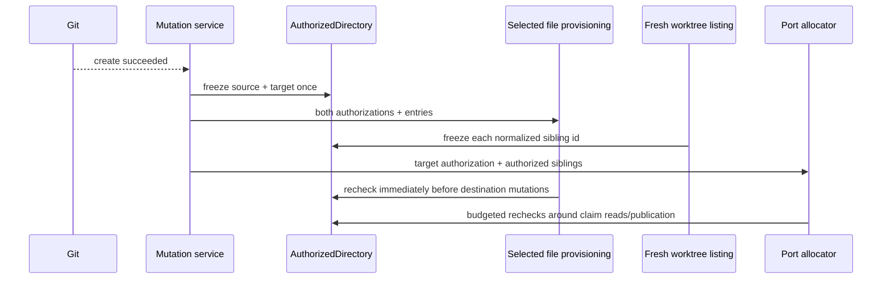

# Design: freeze-the-first-observed-worktree-before-writing

## Architecture



## Interfaces

```ts
export interface FileIdentity {
  readonly dev: number | bigint;
  readonly ino: number | bigint;
}

export interface AuthorizationBudget {
  run<T>(work: () => Promise<T>): Promise<T>;
}

export interface AuthorizedDirectory {
  readonly path: string;
  readonly platform: NodeJS.Platform;
  readonly components: readonly {
    readonly path: string;
    readonly identity: FileIdentity;
  }[];
}

export async function authorizeDirectory(
  path: string,
  deps?: AuthorizedDirectoryDeps,
  budget?: AuthorizationBudget,
): Promise<AuthorizedDirectory | undefined>;

export async function directoryStillAuthorized(
  authorization: AuthorizedDirectory,
  deps?: AuthorizedDirectoryDeps,
  budget?: AuthorizationBudget,
): Promise<boolean>;
```

Only `authorizeDirectory()` constructs the value. `ino === 0`, a symlink, a non-directory component, an unreadable component, budget expiry, or a component whose identity changes during the mint returns `undefined`.

## Decisions

### D1: Authority means first stable observation, never the inode Git created

The mutation service freezes both the main-checkout source and new-worktree destination immediately after `git worktree add` returns success and before any extension-owned selected provisioning work. Git exposes no directory descriptor, so the design claims only those first stable observations.

Agent or terminal processes launched after provisioning are outside this authority: they receive a path and perform their own later filesystem activity. The accepted residual for selected writes is the same one already documented by `applyEntries`: Node exposes no `openat`/dirfd traversal, so substitution between the final component recheck and the following syscall cannot be eliminated. cmux closes that window with descriptor-pinned `openat(O_NOFOLLOW)` traversal; this change reuses its attack schedules, not a guarantee Node cannot implement.

### D2: One platform-aware component authorizer owns non-vacuous identity

`src/utils/authorizedDirectory.ts` extracts the component-freeze discipline from `ClaudeHookInstaller` and uses `path.win32` or `path.posix` according to the injected platform. Every component from filesystem root through the leaf is an ordinary directory with a nonzero inode identity.

The same module owns identity comparison. Affected direct `dev`/`ino` comparisons in claim-source proof, staged-temporary ownership, and lock release consume it so Windows volumes with `ino === 0` fail closed instead of accepting arbitrary substitutions.

Every filesystem await can run through an injected `AuthorizationBudget`. Port listing and allocation pass their existing transaction budget. Mutation-seam and installer callers use the unbounded default; they are outside the port transaction, and this change claims no new wall-clock bound for them.

### D3: One source/target pair crosses selected file provisioning; target authority crosses ports

`MutationServiceDeps.applyProvision` receives the source and destination authorizations minted at the mutation seam. `applyPorts` receives the same destination authorization. Neither consumer may mint replacement authority.

`applyEntries` rechecks destination authorization immediately before each entry and again before every destination `mkdir`, `open`, or symlink mutation it starts. Its existing no-follow descent remains required; authorization detects replacement of components above the destination root that descent cannot see.

If either mint or a later recheck fails, Git create remains `ok`, affected selected work receives failed outcomes, and launch ordering remains unchanged.

### D4: Sibling authority is frozen at the fresh normalized listing boundary

The production port-listing binding authorizes each normalized `WorktreeInfo.id`, never `displayPath`, immediately after the fresh Git listing and carries that value with the record. A missing, expired, or changed authorization makes sibling proof incomplete and fails fresh allocation.

The normalized target listing row receives the same leaf identity as the mutation-issued target authorization and is excluded by that identity. Raw display aliases never decide claim location or self-identity. This is first-observation stability, not proof of historical sibling ownership.

### D5: The final claim entry remains no-follow and source-proven

Directory authority complements rather than replaces final-entry checks. `.env.worktree` is still opened `O_NOFOLLOW`, validated as a regular file, read within its byte bound, and sampled by non-vacuous identity, mode, and bytes immediately before and after relevant reads and before publication.

## Risk Map

| Component | Risk | Mitigation |
|---|---|---|
| Target mint | Replacement is trusted after Git create | D1/D3 — mint once at mutation seam; selected writers only recheck |
| Component traversal | Windows path is split as POSIX or zero inode compares equal | D2 — platform path module and fail-closed zero-inode tests |
| File provisioning | Admission succeeds, then destination root changes before actual write | D3 — recheck in `applyEntries` at each mutating boundary, not only entry admission |
| Source provisioning | Destination is authorized but copied bytes come through a substituted source | D1/D3 — source and destination are frozen together and passed as one pair |
| Sibling scan | Authorization multiplies unbounded filesystem waits | D2/D4 — every sibling lstat uses the existing transaction budget |
| Self-exclusion | Raw and normalized paths disagree | D4 — authorize normalized ids and compare leaf identity |
| Final claim file | Stable directory contains a substituted final entry | D5 — final-entry no-follow/opened identity and byte proof remain mandatory |
| Shared staged writer | Zero inode makes temporary or lock ownership vacuous | D2 — shared identity helper refuses ownership proof when identity is unavailable |
| Final syscall window | Ancestor changes after recheck | D1 — explicit residual; witnesses prove every detectable earlier schedule fails closed |

## Obligation Ledger

| Claim | Semantics | Defeater | Witness / check | Disposition |
|---|---|---|---|---|
| Selected target writes use the first observed post-create destination | One destination authorization is minted after Git success and carried to file/port writers | Consumer constructs authority from the current path after replacement | Replace root or ancestor after mint; both file and port writes fail and redirected tree stays untouched | supported |
| Selected file reads use the first observed post-create source | Source and destination are minted together; source is rechecked before each selected read | Main checkout ancestor is substituted after create | Substitute source ancestor; copy/link result fails without reading replacement bytes | supported |
| Unavailable identity is never treated as proof in this flow | Directory, claim-source, staged-temp, and lock ownership require nonzero identity | Distinct entries with `ino === 0` compare equal | Zero-inode fixtures refuse authorization, commit ownership, and lock release | supported |
| File and port consumers cannot derive different target authority | Both receive the same opaque value and can only recheck it | One consumer realpaths or remints from its path | Shared ancestor substitution integration witness makes both consumers fail from one minted value | supported |
| Sibling claims come from a budgeted stable listing-time directory | Normalized authorization is minted/rechecked through the allocation budget around each read | Deep or stalled sibling path outlives the transaction | Expired authorizer fails fresh allocation within the transaction bound | supported |
| The target is not its own sibling under a display alias | Normalized listing id is authorized; leaf identity matching target is excluded | Raw record spelling differs from normalized id | Production binding fixture carries alias display path plus normalized target id; retained assignment is reused | supported |
| The exact inode Git created is proven | — | Git returns no directory descriptor; path back-links re-resolve | D1 and discovery.md state the API limit and make no such claim | n/a — selected contract is first stable observation |
| No substitution can occur in the final syscall window | — | Node exposes no descriptor-relative traversal | cmux demonstrates the stronger construction; spec triggers only on changes observed before a write begins | n/a — explicitly outside the achievable Node guarantee |
