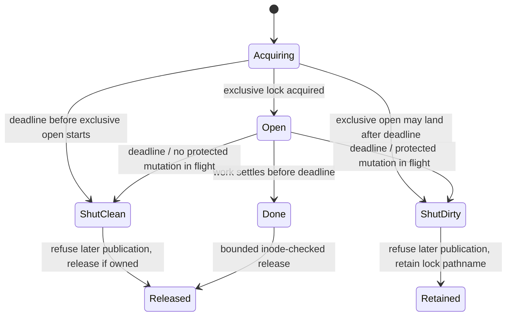

# Design: never-release-a-lock-a-pending-write-still-owns

## Architecture



A protected mutation already in flight may settle after `ShutDirty`, but it remains inside the retained cross-process lock. No later target or staged-file mutation may start.

## Interfaces

```ts
export interface LockDeadline {
  readonly elapsed: Promise<void>;
  readonly expired: boolean;
  cancel(): void;
}

export interface WriteGate {
  readonly open: boolean;
  guard<T>(step: () => Promise<T>): Promise<T>;
}

export type LockedOutcome<T> =
  | { readonly kind: "done"; readonly value: T }
  | { readonly kind: "unavailable" }
  | { readonly kind: "timedOut"; readonly retainedLockPath?: string };

export interface StagedReplacement {
  readonly path: string;
  commit(kind: "create" | "replace", gate?: WriteGate): Promise<boolean>;
  discard(gate?: WriteGate): Promise<boolean>;
  abandon(): Promise<void>; // close only; never unlink
}
```

`LockDeadline` is a structural interface mirroring the existing worktree `Deadline`; `src/utils` owns no clock implementation and imports nothing from `src/worktree`. The caller owns `cancel()`.

`LockedFile.withLock()` keeps its existing overload for callers that request no deadline. The deadline overload begins before lock acquisition, passes one `WriteGate` to the work callback, and returns a typed outcome. `stageReplacement`, `commit`, `discard`, and `atomicReplace` accept that same gate.

## Decisions

### D1: The result is bounded; an in-flight protected mutation retains serialization

The selected policy is fail-closed lock retention. Deadline expiry with no protected mutation in flight refuses later publication and releases normally. Expiry while exclusive lock acquisition or a protected mutation may land returns a timed-out result and deliberately leaves or permits the lock pathname to appear.

This restates the impossible half of the rejected invariant: the result is bounded, while an operation capable of creating the lock or publishing protected state is either bounded before it starts or converts the lock into the repository's established administrative lock. Nothing steals that lock by age.

### D2: One latched gate owns acquisition and protected mutation entry

The gate closes when either `deadline.expired` becomes true or `deadline.elapsed` resolves. Timer resolution latches it closed permanently; a later backward wall-clock adjustment cannot reopen it. The synchronous entry predicate is `latchedOpen && !deadline.expired`, so a spent wall-clock deadline cannot admit one step before the timer callback runs.

Exclusive `open(lockPath, "wx")` is guarded before work begins. If its result loses the deadline race, the outcome is dirty because the lock may appear later; any late handle is closed without unlinking the pathname. A parent-directory `mkdir` that loses the race is observed but classified clean because its only late effect is idempotent directory existence, and no exclusive open starts afterward.

For protected work, `guard()` entry checks the predicate, increments an in-flight counter, then races the step. Deadline with counter zero becomes `ShutClean`; deadline with a positive counter becomes permanently `ShutDirty`. Late resolution or rejection is observed and cannot become unhandled.

### D3: Retained resources are closed without releasing serialization

A dirty outcome never performs unowned pathname cleanup. The owned lock handle is closed asynchronously without unlinking the lock. A staged operation that resolves after timeout is `abandon()`ed: its handle closes, but its temporary pathname is retained.

`stageReplacement` routes its own failure cleanup through the same gate. If failure arrives after the gate is dirty, it abandons instead of calling the current internal `discard()` unlink. Late rejections and resolutions therefore share one close-only path.

`StagedReplacement.commit("create")` treats successful `link` as publication and leaves temporary cleanup to `discard`; it no longer performs an internal post-publication unlink whose refusal could obscure commit success. Replace commit remains one atomic rename. This makes publication and cleanup separately gateable.

### D4: A retained lock is distinct from a failed release

A dirty timeout returns `retainedLockPath`; port application maps it to failed uncommitted names plus `lockRetained`. The host logs the exact path, while the panel states that later operations may remain blocked until cleanup without exposing repository internals.

`lockReleaseFailed` remains reserved for cleanup attempted after work settled. Reusing it would recreate the inaccurate failure reporting fixed by the parent change's F005.

### D5: Publication cannot continue as a new transaction after expiry

The gate crosses staging and publication. Before publication, failure cleanup uses the gate and dirty expiry abandons instead of unlinking. If stage completes after expiry, commit is refused before its syscall. If commit itself was in flight, it may land later, but only while the retained lock still serializes every cooperating process.

After publication, inode-owned temporary cleanup is a safe cleanup exception rather than a new publication step. It may start after expiry because it can only unlink the staged pathname whose nonzero identity this transaction owns; failure cannot alter the committed target.

A failed-but-present claim is safe: after deliberate lock cleanup, a later attempt reads and reuses the persisted assignment. Success-without-persistence remains forbidden.

### D6: Inode-owned cleanup may finish late because it cannot publish or release a successor

Temporary cleanup and lock release are raced against the result bound. A late temporary unlink can remove only the owned staged inode and a late lock unlink can remove only the nonzero identity of the lock this operation acquired. Both can end cleanup later; neither can alter the committed target or release a successor.

A stalled or failed staged-temp cleanup adds `temporaryCleanupFailed`; a stalled or failed lock release keeps `lockReleaseFailed`. Committed port outcomes remain successful with either warning.

### D7: Existing consumers prove the primitive beyond the port path

Repository-local `info/exclude` mutation adopts the deadline-aware gate and returns distinct clean-timeout or retained-lock failure data. Its generic caller is not promised a panel notice; the port caller maps retained exclude serialization into the port warning contract and every retained path is logged host-side.

`allocateWorktreePorts` owns one `Deadline` from before port-lock acquisition through the subsequent exclude update. `addToGitExclude` accepts that deadline; standalone callers may omit it and then own/cancel a local deadline. Cancellation occurs only in the owner's `finally` after every guarded operation and cleanup outcome has settled, so it cannot disarm an in-flight race.

The Claude hook installer keeps the old no-deadline overload and must remain behaviorally unchanged. This change does not modify the separate `afterDelay` implementation.

### D8: No automatic reclamation follows retention

cmux uses OS advisory leases and bounded orphan cleanup; t3code removes locks by age. Neither construction can prove a Node lock-file owner dead across every supported platform. This change keeps the parent's accepted no-TTL policy: retained locks require explicit administrative cleanup.

## Risk Map

| Component | Risk | Mitigation |
|---|---|---|
| Lock acquisition | Exclusive open hangs before the gate exists | D2 — deadline and gate begin before acquisition; late open implies retained path |
| Gate clock | Timer and wall clock disagree or reopen | D2 — synchronous wall-clock check plus permanent timer latch |
| Stage/commit | A later publication begins after deadline | D5 — one gate crosses the chain; post-expiry guard refuses entry |
| Late stage | Resolved staged handle leaks after caller returns | D3 — late resolution invokes close-only `abandon`, retaining pathname |
| Create commit | Target link succeeds but cleanup refusal reports failure | D3/D6 — publication defines success; safe cleanup is separately bounded and warned |
| Late mutation | Claim lands after failed result | D1/D5 — retained lock preserves serialization; next attempt reuses persisted value |
| Clean timeout | Every timeout poisons the repository | D1/D2 — zero-in-flight timeout releases; dedicated witness distinguishes states |
| Release | Returning early deletes a successor later | D6 — shared nonzero identity and inode-checked unlink remain mandatory |
| Reporting | Retention is mislabeled as release failure | D4/D7 — distinct typed state, wire warning, and host log |
| Shared primitive | Hook installation changes unexpectedly | D7 — compatibility overload and direct-consumer regression suites |
| Stale lock | Automatic cleanup steals from a paused live mutation | D8 — no TTL; exact path logged for deliberate administration |
| Threadpool | Abandoned syscall consumes a libuv worker | D8 — explicit residual; at most one retained mutation per repository lock and no automatic retry loop |

## Obligation Ledger

| Claim | Semantics | Defeater | Witness / check | Disposition |
|---|---|---|---|---|
| The result is bounded across lock acquisition and protected mutations | One uncancelled deadline spans exclusive open, stage, commit, prepublication discard, safe cleanup, and exclude update | Exclusive open or any protected/cleanup step never settles | Inject each stall; caller returns within the bound and cancellation occurs only after settlement | supported |
| No later claim publication starts after expiry | Publication entry requires permanent timer latch and unexpired wall clock; inode-owned cleanup is the only exception | Timer resolves, clock moves backward, late stage tries commit | Already-spent, timer-first, backward-clock, and late-stage witnesses leave publication spies untouched | supported |
| An in-flight late mutation remains serialized | Dirty timeout retains or permits appearance of the exact lock pathname | Cleanup unlinks after returning | Stalled commit returns retained; second allocator reports lock unavailable and writes nothing | supported |
| A clean timeout does not retain the lock | Zero protected mutations in flight transitions to `ShutClean` | Every timeout is treated dirty | Expiry between guarded steps removes owned lock and leaves no newly started publication | supported |
| Late-resolving resources do not leak open handles | Lock/stage handles close without unlink on dirty timeout | Late stage resolves after caller returned | Handle-close spies fire; lock and temporary pathnames remain | supported |
| Committed state is not relabeled failed by cleanup | Link/rename defines commit; temporary cleanup is separate | Create link succeeds, then cleanup is refused or stalls | Result stays committed; discard/release warning names cleanup | supported |
| Lock release cannot delete a successor | Release compares shared nonzero identity before unlink | Successor replaces pathname while release is pending | Successor-substitution regression remains green under deadline overload | supported |
| A filesystem syscall is cancelled at deadline | — | Node cannot safely cancel the relevant syscall | discovery.md records API limits and rejected worker/cancellation options | n/a — retained serialization replaces cancellation |
| Retained locks are reclaimed automatically | — | Paused live owner is indistinguishable from dead owner cross-platform | D8 preserves explicit administrative cleanup | n/a — no-TTL fail-closed policy is selected |
