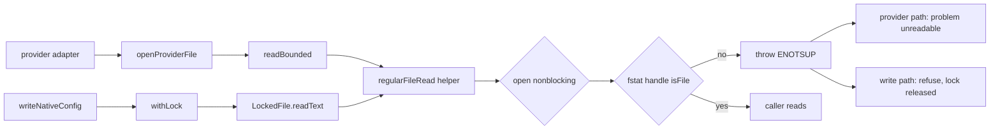

# Design: open-a-provider-file-without-waiting-on-it

## Decisions

### D1: One helper opens nonblocking AND proves the opened handle regular

`src/utils/regularFileRead.ts` SHALL export a function that opens a path with
`O_RDONLY | O_NONBLOCK` where the platform defines `O_NONBLOCK`, `fstat`s the OPEN HANDLE, and
refuses anything `isFile()` rejects by closing the handle and throwing an error carrying
`code: "ENOTSUP"`.

Neither half works alone. Both were probed on this host (darwin, Node `fs/promises`) rather than
reasoned about:

| Path | `O_RDONLY` alone | with `O_NONBLOCK` alone | Both halves |
|---|---|---|---|
| named pipe, no writer | waits forever | opens, first read yields 0 bytes, so an EMPTY configuration | refused |
| named pipe, with a writer | opens, reads the stream | opens, reads the stream | refused |
| directory | opens, read throws `EISDIR` | same | refused, one step earlier |
| ordinary file | reads | reads (the flag is a no-op on regular files) | reads |

`fstat` on the handle rather than `stat` on the path, for the same reason `readBounded` already
enforces its byte cap on the read: a path checked before the open describes a file the open need
not have landed on. The handle cannot be swapped underneath.

The requirement this discharges is scoped to what the object at the path makes knowable. An
ordinary file on a hung mount still blocks, and no `O_NONBLOCK` closes that — the spec says so.

### D2: The refusal is the reader's existing `unreadable`, not a new vocabulary

The thrown error SHALL carry `code: "ENOTSUP"`, alongside the `EFBIG` `readBounded` already mints.

`openProviderFile` classifies any throw `isAbsence` rejects — anything but `ENOENT`/`ENOTDIR` — as
the `unreadable` problem, quoting `errnoOf(error)`. The plan attack checked every other errno branch
in the subsystem (`providerKit.ts:824-839`, `readProvisioning.ts:223-239`,
`writeNativeConfig.ts:460-482`) and found none that treats `ENOTSUP` as absence or success. So no
classifier changes, and the native-config writer keeps mapping a failed `baseFor` to `unnamed` with
no rule of its own.

### D3: The flag composition is a pure function, so the platform lacking the constant is testable

The helper SHALL take its flags from an exported pure function of a constants record rather than
reading `node:fs`'s constants inline.

`fs.constants.O_NONBLOCK` is undefined on win32, so the composition must degrade to `O_RDONLY`.
Computed inline it degrades at module load and cannot vary, leaving the win32 arm asserted and
unwitnessed on the only platform CI runs. As a function of its input, both arms are witnessed on
either host.

On win32 the operative half is the regular-file test, and that is sufficient there: the provider
paths are fixed constants, `extends` must match an adapter's declared file
(`readProvisioning.ts:202-228`), and every provider read is containment-checked before it opens
(`providerKit.ts:637-684`). A Windows named pipe lives in the `\\.\pipe\` namespace, which no
repository-contained pathname reaches.

### D4: Both readers of a repository-controlled path use the helper — the writer gains no rule

`readBounded` and `LockedFile.readText` SHALL both read through D1's helper. `writeNativeConfig`
SHALL NOT gain a file-type check of its own.

The first draft of this decision put the check in the writer's existing locked `lstat`, and the plan
attack refuted it: `lstat` then a path-based `readText` is a race, and replacing `worktree.json`
with a named pipe in that window still hangs while the lock is held. WT-012.19 does not cover it —
that task anchors the DIRECTORY's identity, which stops parent redirection but not a child name
changing inside the anchored directory (`docs/PLAN.md:783-794`).

Fixing the open closes the stationary case and the raced case together, because there is no window
left: the open itself refuses. It also removes the reason to touch the writer at all, so this
change adds nothing to a module already at six review rounds.

`LockedFile` takes its `fs` injected, and `open` is part of that interface, so the helper is reached
through the injected dependency and its suite needs no real pipe to drive the refusal.

**Merge seam.** `LockedFile` was moved to `src/utils/lockedFile.ts` by peer commit `132d20ce`,
which is not on this branch; here it still lives in `src/agentHooks/install/lockedJsonFile.ts` and
that commit does not touch `readText`. The edit is deliberately one line at the read plus its
imports, so rename detection carries it, and the merge must land it in the moved file.

## Architecture

## Risk Map

| Component | Risk | Mitigation |
|---|---|---|
| the helper | The flag breaks an ordinary read on a filesystem where `O_NONBLOCK` is not a no-op for regular files | Every provisioning read and every locked write goes through it, so a regression fails `readProvisioning.test.ts`, `writeNativeConfig.test.ts` and `lockedJsonFile.test.ts` rather than only the new witness |
| the helper | `isFile()` refuses something legitimate | A hard link IS a regular file and `open` follows a symlink before `fstat` sees it; both are asserted in task 1_1. The plan attack confirmed no supported configuration is a socket or device: provider paths are fixed constants and containment-checked |
| `LockedFile.readText` | The change lands on a file another branch has moved | D4's merge seam; the hunk is minimal by design |
| growth axis | None — one `fstat` per open, and opens are already bounded by the adapter list | n/a |

## Obligation ledger

| Claim | Semantics | Defeater | Witness / check | Disposition |
|---|---|---|---|---|
| A path holding an object that is not an ordinary file is refused rather than awaited | For every path reaching the helper, the returned promise settles with no external event, whenever the object's type is knowable at open | A named pipe with no writer at a contained, recognized provider path | Task 1_1 opens a real `mkfifo` path through the helper, raced against a timer that fails the test; a directory and a symlink-to-pipe are refused the same way | supported — narrowed from the first draft's universal claim, which the plan attack refuted against a hung mount, and which the spec now excludes explicitly |
| A writerless pipe is never read as an empty configuration | The result is a reported problem, not a model with zero entries | `O_NONBLOCK` alone: probed here, the open succeeds and the first read yields 0 bytes | Task 1_2 asserts the reason is `unreadable` AND that no entry was inherited from that file | supported |
| The native-config lock is released whatever the target holds, and whenever it changes | After a refused save the lock file is gone and a second save of the same path returns a verdict, including when the target became a pipe AFTER the writer observed it | The first draft's `lstat`-then-`readText` race: replace `worktree.json` between the two and the path-based read still hangs under the lock | Task 1_3 drives both: a pipe already present, and an injected `lstat` that swaps the target for a pipe before returning. Both assert a refusal, no lock file left, and a following save that runs | supported — the first draft was refuted here; closing the open removes the window rather than narrowing it |
| Ordinary reads are unchanged | Every existing provider read and locked write returns what it returned before | `O_NONBLOCK` altering regular-file read semantics | The existing provisioning and `lockedJsonFile` suites stay green with no assertion changed; hard link and symlink cases asserted in task 1_1 | supported |
| The bound holds where `O_NONBLOCK` is undefined | The composed flag equals `O_RDONLY` and the regular-file test still refuses | A win32 host, which this change cannot run | D3's pure function called with a constants record lacking `O_NONBLOCK`, plus D3's anchored argument that no repository-contained pathname on win32 reaches an object whose `O_RDONLY` open waits | supported — the first draft left this `unresolved` by proving only the numeric degradation |
| No other unbounded configuration read is left in this subsystem | Every read of a repository-controlled configuration path goes through the helper | A second reader nobody listed | The plan attack enumerated them: `readBounded` and `LockedFile.readText` are the only two. `applyEntries`' directory scan and stream copy are the same class under a different owner and are named out of scope in proposal.md | supported |
