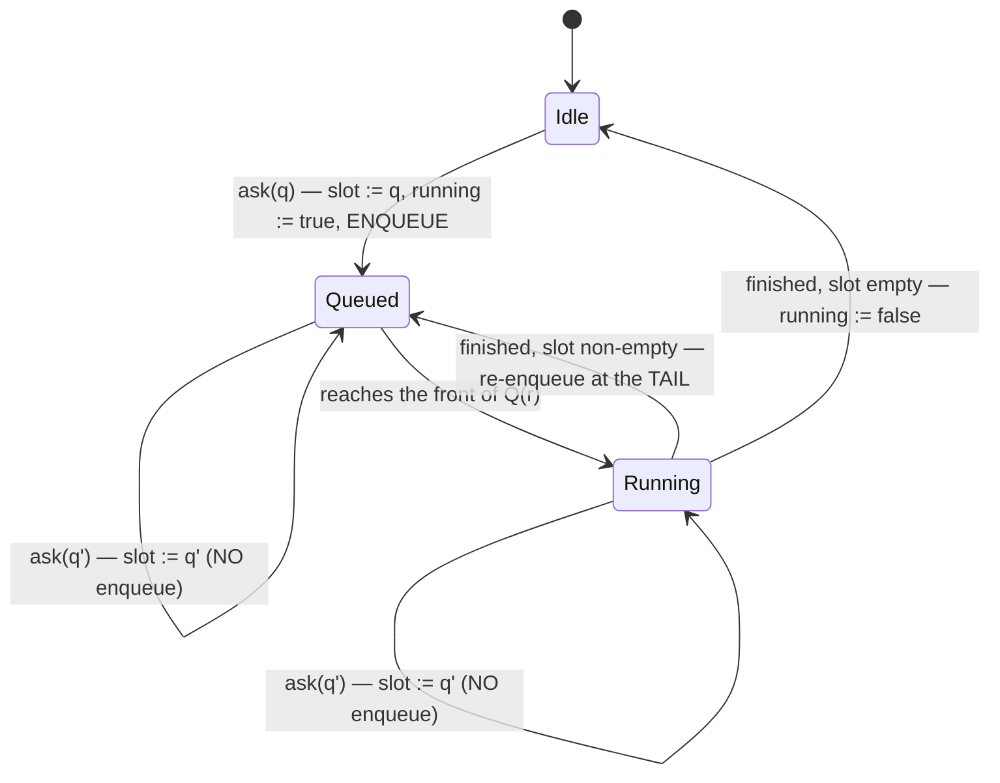

# Design: coalesce-assessment-requests-at-the-host

## Two requirements over one schedule

Per repository `r` the mutation queue `Q(r)` is a FIFO of jobs, each either a mutation `M` (remove,
lock, unlock, prune, create) or an assessment run `A`. `S` is the set of attached surfaces.

- **R1 — bound.** At every instant, `|{A ∈ Q(r)}| ≤ |S|`, independent of how many requests the user
  makes or how they are patterned.
- **R2 — progress.** For a mutation `M` enqueued at `t`, no job is placed ahead of `M` after `t`, so
  `delay(M) ≤ |S| · cost(A)`.

Neither yields. One construction satisfies both: admission is a **per `(surface, repository)` slot
plus a boolean**, and the queue is only ever appended to.

`Queued ∪ Running` holds at most one `A` per `(s, r)`, which is R1. Every enqueue — the first and the
re-enqueue — appends through the same `queue.run` tail, so nothing is ever placed ahead of a mutation
already waiting, which is R2. Supersession changes the *payload* of a pending slot, never the queue's
contents, which is why the two requirements do not compete: the bound is enforced by never enqueuing
a second job, not by cancelling one.

The parent change's `beginAssess` tried to enforce R1 from the webview instead. It could not: it saw
one surface, and it keyed on the single live worktree id, so alternating rows defeated it
(`.reviews/round-6.md` B5). It is also what made a dropped reply permanent (W6), because the guard
that refuses a duplicate refuses the re-ask that would recover.

## Decisions

### D1: The host admits at most one assessment run per surface per repository

`WorktreeHost` holds, keyed by `(surfaceKey, repoId)`, the latest unanswered request and whether a
run for that pair is enqueued-or-running. A request updates the slot unconditionally; it enqueues a
run only when none is outstanding.

The bound belongs here because this is the only place that can see every surface. A rule the panel
owns is a rule the panel can lose — B5 and W6 are the same guard losing it twice.

Keyed by repository as well as surface because the run is enqueued on `coordinator.run(repoId)` and
takes *that* repository's rebuild barrier. A slot keyed by surface alone would let a run enqueued for
repo A serve a question about repo B, resolving it against a barrier that never covered it — the
exact freshness property the parent's D10 exists to establish.

### D2: A run serves the surface's latest question, not the one that enqueued it

The enqueued closure carries no token. On start it reads the slot, clears it, and assesses that
request; its reply carries that request's `token` and `worktreeId`.

This is what makes coalescing sound rather than lossy: the run always answers the newest question, so
the answer the user is waiting for is the one that gets produced. A closure that captured its own
request would answer a question the user had already replaced and then have to be discarded, which is
the "skip a stale job" shape — cheaper per job, but leaving the queue length unbounded.

### D3: A superseded request is answered by its successor, and receives no reply of its own

This **amends the parent change's D12**, which reads "every `worktreeRemoveAssess` from a live
surface is followed by exactly one reply carrying its token". After this change the obligation is to
the *question*, not the *message*:

> The latest request a live surface has made is followed by exactly one reply carrying its token.

Nothing is lost. A request is superseded only when the same surface asked again, so the user is no
longer waiting on it, and the parent's D11 token check already discards its reply on arrival. Issuing
a reply for it would post a message whose only possible fate is to be dropped.

The obligation the parent's spec states — *asking to remove a worktree SHALL NOT leave the user with
no response* — is unchanged and is what the ledger's third row is written against.

### D4: The panel supersedes a repeat; it never blocks one

`WorktreeController.beginAssess` stops refusing a same-worktree duplicate. Every ask mints a token and
replaces `liveAssess`.

Two consequences, and they are the whole reason B5 and W6 are one change. The panel is no longer
pretending to bound host work, which it never could. And a request whose reply was lost in transit no
longer wedges the row: the next ask replaces it, so the recovery is the gesture the user would make
anyway. Nothing else about D11 changes — the live token is still what decides whether a reply opens a
dialog, and it is still cleared by any dialog opening.

### D5: The assessment reply is delivered through the retrying critical sender

`WorktreeSurface` gains an optional `postCritical?(message): Promise<boolean>`, implemented by both
providers as `safeSendWithRetry(message, 2, shouldAbort)` and falling back to `post` where a surface
does not offer it. Only the assessment reply uses it; `post` stays fire-and-forget for broadcast
traffic.

Reuse, not new machinery: `safeSendWithRetry` already exists in both providers, already retries
transient `postMessage` failures, and already takes the `shouldAbort` predicate the vault refresh uses
for exactly this — *do not deliver a superseded answer* (`TerminalViewProvider.ts:1681-1699`). The
predicate here is "the slot has moved on", so a retry can never resurrect an answer to a replaced
question.

This also settles round-6 S1. Both the fulfilled and the rejected arm go through one reply helper, and
that helper's rejection handling is attached to the assessment promise rather than chained after the
success handler — so a delivery failure is never reported as a failed assessment, and a throw from
either arm cannot escape.

### D6: Admission bookkeeping is written synchronously, in the handler's own turn

The slot write, the outstanding flag, and the clear-and-re-enqueue at the end of a run each happen in
one synchronous block, with no `await` between reading a value and writing the decision it implies.

Stated as a decision because this host has lost it before: the create form's own comment records the
same rule and the round-1 defect that motivated it (`WorktreeHost.ts:611-615`). A flag written after
an await lets two handler turns both observe "no run outstanding" and enqueue two, which silently
doubles R1's bound; a slot read after an await lets a request that arrived in the window be dropped
with no run left to serve it, which is a lost wakeup and leaves the user with no response.

### Rejected

| Alternative | Why not |
|---|---|
| Skip a stale job when it reaches the front of the queue | Bounds the *cost* of a backlog, not the backlog. Queue length stays `O(clicks)` and `mutationQueue.isBusy` — whose comment says a quarantine decision must be able to see queued work — keeps counting it. |
| Coalesce or prioritise inside `createKeyedSerialQueue` / `MutationQueue` | Every destructive worktree verb runs through them, and that module's header states it is deliberately non-coalescing because dropping one of two enqueued bodies is exactly the bug. Changing it to fix one read verb changes remove, lock, unlock, prune and create at once. |
| Run the assessment outside the mutation queue, taking only the barrier | Releases the queue before the assessment's own async reads, so this extension's *own* mutations could interleave with them. That is strictly wider than the window the parent's D10 measured against `blocked` → force, and it would give back the parity round-4 B3 asked for. |
| Give the assess token a high-water mark, as the create form's `opening` has | The create form needed it because a replayed opening could mint a debris deletion authorization. Here a replayed token costs at most one extra assessment — R1 still holds — and its reply is discarded by the live-token check, so it mints nothing any panel can spend. Recorded in the ledger rather than built. |

## Obligation ledger

| Claim | Semantics | Defeater | Witness / check | Disposition |
|---|---|---|---|---|
| At most one assessment run is outstanding per surface per repository | `∀ s, r: |{A enqueued or running for (s,r)}| ≤ 1` | The outstanding flag written after an `await`, so two handler turns both read false and both enqueue; or a request arriving between clearing the flag and re-reading the slot, enqueuing nothing and leaving the slot unserved | D1 and D6. Test: hold `forceRebuild` unresolved, deliver N requests alternating two worktrees from one surface, and assert `coordinator.run` was entered exactly once; release, and assert exactly one further run | supported |
| A mutation is never delayed by assessment work admitted after it | For `M` enqueued at `t`, every job ahead of `M` was enqueued before `t`; `delay(M) ≤ |S| · cost(A)` | A re-enqueue that jumps the queue — a coalescing rule that reuses the finished run's position rather than appending | The re-enqueue goes through the same `queue.run(repoId, …)` tail as the first, and `keyedSerialQueue` appends. Test: assess, then a mutation, then two more assessments; assert the mutation body runs before any assessment admitted after it | supported |
| The user always receives the answer to the question they are currently asking | For the latest request of a live surface, exactly one reply carrying its token is posted, or the surface detached | The run reads the slot, clears it, and its reply is dropped in transit — the slot is empty, so nothing re-enqueues and no answer ever comes | D5 retries a transient failure with a supersession-aware abort; D4 makes the user's next ask the recovery for a permanent one, where the parent's guard made it unreachable. Tests: a `postCritical` resolving `false` twice then `true` delivers once; a reply lost outright followed by a re-ask produces a report | supported |
| Coalescing never answers one question with another question's answer | The reply's `token` and `worktreeId` are those of the request the run read from the slot, never those of the request that caused the enqueue | The closure capturing its own request at enqueue time and replying with it | D2 — the closure captures nothing. Test: enqueue for A behind a held barrier, supersede with B, release; the single reply carries B's token and B's `worktreeId` | supported |
| Coalescing cannot increase force-authority issuance | Fingerprints issued ≤ assessment requests made, strictly fewer whenever supersession occurs | A run that re-enqueues a request it already served, assessing it twice | The slot is cleared at start, so a request is served at most once; the re-enqueue fires only on a slot written after that clear. Test: three requests coalesced into two runs issue at most two fingerprints | supported |
| A replayed assess token cannot mint anything spendable | A duplicate delivery of an earlier request costs one extra run and no authority | Replay of a `worktreeRemoveAssess` the panel already superseded | **Not a claim this change strengthens.** R1 bounds the extra work; the parent's D11 live-token check discards the reply, and a fingerprint the panel never receives cannot be sent back. Named because the sibling `opening` flow carries a high-water mark for a hazard that has no analogue here | n/a — no spendable authority reaches a panel that did not receive the reply |
| An assessment inflates `mutationQueue.isBusy` for its repository | A read makes the repo report busy while it runs | A quarantine or admission decision reading `isBusy` and treating a read as a write | **Not introduced here.** `assessRemovalReport` has entered the queue since the parent change's D10; `rg -n 'isBusy' src/` finds the interface and its own implementation and no production consumer. This change strictly reduces how long it is true | n/a — pre-existing, no consumer; R1 shortens the window rather than widening it |
| A registration replaced during the assessment's own reads cannot be told apart | — | Barrier resolves A; the async status, ignored and proof reads replace A with B before `stillObserved` can see it | **Not a claim this change makes.** Shared with the shipped `blocked` → force path and named `n/a` by the parent's D10 for the same reason | n/a — pre-existing and shared; needs its own PLAN task, already recorded in the parent's workflow.md |

## Risk Map

| Component | Risk | Mitigation |
|---|---|---|
| Host admission slot (`WorktreeHost.ts`) | Growth axis is `surfaces × repositories`, both created by human action and neither request-driven. Uncapped only if surfaces were — they are not | One entry per `(surface, repo)`, swept on detach through the existing surface teardown at `WorktreeHost.ts:2913-2916` alongside `surfaces.delete` |
| Host admission slot | A lost wakeup leaves a request with no run and no reply — the failure the parent's spec forbids | D6, plus the ledger's third row's re-ask recovery. Verified by the interleaving test in task 1_1, not by inspection |
| `WorktreeController` (`D4`) | Removing the duplicate guard restores an unbounded request door if D1 is absent or wrong | Deps order: 1_2 lands only after 1_1. The controller test asserts a repeat posts a message; the host test asserts a repeat enqueues nothing |
| `WorktreeSurface.postCritical` | A new optional capability on an interface three providers implement; a surface that omits it silently loses retry | Falls back to `post`, so absence is the parent change's shipped behaviour rather than silence. Both production providers implement it in task 2_2 |
| Assessment reply retry | A retry could deliver an answer to a question the user replaced | `shouldAbort` reads the live slot, the same construction `TerminalViewProvider.ts:1681-1699` already uses for the vault refresh |
| `src/extension.worktreeAssembly.test.ts` | Strengthening the walk could weaken what it already proves — the parent's round-6 adjudication rests on it | The existing barrier-bypass mutation must still fail the walk after the change; task 3_1's Verify runs both the new walk and the barrier falsifier |
