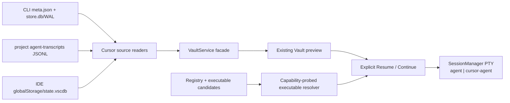
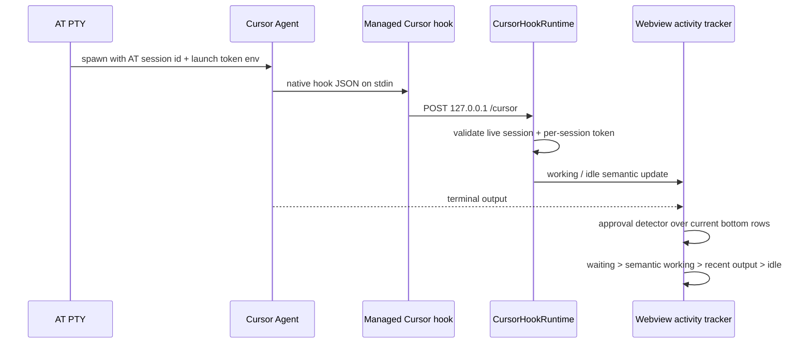

# Design: integrate-cursor-agent

## Architecture

### Vault and launch



### Semantic terminal status



## Target Layout

```text
src/cursor/
  CursorExecutableResolver.ts  # ordered alias probing and Cursor capability validation
  CursorHookInstaller.ts       # owned hooks.json merge/remove + managed platform script
  CursorHookRuntime.ts         # loopback server, per-session tokens, event normalization, quiet completion
src/vault/readers/
  cursorPaths.ts               # safe CLI/project/IDE source resolution
  cursorStore.ts               # bounded CLI root-graph decoder
  cursorTranscript.ts          # bounded project JSONL parser and mirror reconciliation
  cursorIdeReader.ts           # Cursor IDE Composer state reader
  cursorReader.ts              # combined list/entry/detail adapters
src/webview/terminal/
  CursorApprovalDetector.ts    # pure current-screen approval classifier
```

Existing files remain owners of their current seams: `registry.ts` owns launch records, `VaultService.ts` stays the reader/watch facade, `SessionManager.ts` owns PTY lifecycle/env composition, and `TerminalActivityTracker.ts` owns the final tab status projection.

## Decisions

### D1: Keep terminal-first execution and add local history preview

Cursor joins the existing terminal/Vault product surface. Execution remains a real interactive PTY; the Vault now renders normalized local history for Cursor Agent CLI and Cursor IDE through the same preview contract used by Claude, Codex, and OpenCode.

This does not admit ACP or an application-owned Cursor runtime. Transcript detail is a read-only adapter over local stores: CLI `store.db` plus its project JSONL mirror, and IDE Composer `state.vscdb` as a separate source. Unsupported schemas degrade to limited metadata rather than weakening the terminal-first boundary (`discovery.md` Options; `docs/research/20260823-cursor-agent-cli-integration.md` § Transcript preview follow-up).

### D2: Keep stable agent identity separate from the resolved executable

The registry id is `cursor`; launch never derives a command from that id or the display label. Detection uses ordered candidates:

```text
agent         -- accept only when help exposes the required Cursor capability set
cursor-agent  -- compatibility fallback
```

`AgentDetectRule` gains aliases and optional required help tokens. Cursor requires positional-prompt usage plus `--resume`, `--mode plan`, and `--force`; one resolver serves continuation-target detection and launch-time revalidation while other agents retain one-candidate behavior.

This follows Orca's pinned distinction (`cursor` can open the desktop app; `cursor-agent` is the CLI) and Cursor's 2026 rename to `agent`. A plain successful `agent --version` is insufficient because unrelated binaries may own that basename.

### D3: Separate metadata indexing from explicit detail decoding

The CLI index scans `~/.cursor/chats/<bucket>/<chat-id>/meta.json` and accepts only schema version 1, files up to 64 KiB, safe ids up to 200 characters, absolute control-free cwd values up to 16 KiB, valid timestamps, `hasConversation: true`, non-subagent status, sibling `store.db`, and a stored agent identity matching the chat directory. Titles reuse the existing 120-character newline-free bound.

Candidates are grouped by chat id before emission. Every ambiguous duplicate-id group is omitted from both list and point lookup and counted unreadable; containment checks remain mandatory. List refresh never decodes transcript bodies.

Cursor retains a serializable metadata/location cache, while decoded detail stays bounded and non-persistent. CLI list refresh watches metadata and database eligibility; selected detail follows `store.db`/WAL changes. Project transcript and IDE index variants store only safe stamps and derived entry metadata, never transcript payloads.

A detail discriminator distinguishes normalized timeline output from limited metadata fallback. Raw blobs, private database fields, and transcript bodies never enter the persisted Vault cache.

### D4: Schema-1 Cursor chats resume through the official chat-id contract

The admitted compatibility profile combines the safe schema-1 chat-directory name (`<chat-id>`) with the installed CLI's official help contract: `Start the Cursor Agent`, positional `[prompt...]`, and `--resume [chatId]`. The reader emits `canResume: true`; launch still resolves and structurally probes `agent` before falling back to `cursor-agent`, so an unrelated executable cannot receive the identifier.

```text
resume:   <resolved-executable> --resume <chat-id>
continue: <resolved-executable> [permission args] <handoff-prompt>
fork:     unsupported
cwd:      entry.cwd via node-pty spawn options
```

Row activation always opens preview. Resume remains an explicit row button, preview-header action, or context-menu action and is offered only for a validated CLI entry. Cursor IDE and unmatched project-transcript entries are source-qualified and non-resumable; host-side capability checks reject forged or stale launch messages.

Permission choices are default approval behavior with no flag, plan only via `--mode plan`, and dangerous full access via `--force`. No captured model or permission state is invented from metadata.

### D5: Cursor hook installation is machine-scoped, owned, and reversible

The machine-scoped `anywhereTerminal.cursorAgent.hooks.enabled` setting defaults false. A stable managed wrapper lives under the extension's machine-global storage, and its absolute path plus hook fields form the ownership tuple that survives extension upgrades.

The installer applies:

```text
acquire bounded sibling lock → read → validate version/shape
→ remove exact owned entries → merge desired entries
→ re-read/compare and retry (max 3) → atomic same-directory replace
```

It preserves unknown top-level fields, event arrays, entry order, file mode, and unrelated hooks. Unsupported/malformed documents are never rewritten; runtime acceptance clears immediately, and cleanup failure is reported. The advisory lock reduces AT-window races but does not claim exclusion against arbitrary external writers.

Observer entries use a 2-second Cursor hook timeout, never `failClosed`, and call a stable platform wrapper. Native-Windows installation occurs only after the generated no-op command executes successfully and prints valid empty JSON. User-level installation avoids committed project hooks and duplicate user/project observers; `CURSOR_CONFIG_DIR` does not relocate native hooks.

### D6: Use one Cursor-specific runtime with renewable session tokens

The simplest admitted construct is a Cursor-specific runtime, not a provider framework with one implementation.

`CursorHookRuntime` binds loopback and registers each PTY incarnation with a random token. `SessionManager` owns one optional contributor:

```ts
interface SessionEnvironmentContributor {
  create(sessionId: string): Record<string, string>;
  release(sessionId: string): void;
}
```

The managed wrapper prints `{}` to Cursor, no-ops without AT variables, and uses 500 ms connect / 1.5-second total POST limits. The server accepts POST only, caps bodies at 1 MiB, applies a 5-second body deadline, validates live session and token, and always returns fail-open.

Initial spawn and fallback-shell spawn both call `create`; fallback first invalidates the old token and clears semantic/waiting state. Failed spawn, natural exit, destroy, hook disable, and manager disposal release authority. Disabling hooks immediately rejects later events and clears all semantic state.

AT PTYs are respawned when the extension host reloads, so Orca's endpoint file for daemonized surviving PTYs is unnecessary.

### D7: Define one exact hook event-to-state contract

Installed events and effects are:

| Cursor event | Effect |
|---|---|
| `sessionStart` | identity/session boundary; clear prior semantic state, never completion |
| `beforeSubmitPrompt` | start/refresh working; new turn boundary |
| `preToolUse`, `postToolUse`, `postToolUseFailure` | start/refresh working |
| `beforeShellExecution`, `afterShellExecution` | start/refresh working; shell completion is not turn completion |
| `beforeMCPExecution`, `afterMCPExecution` | start/refresh working |
| `afterAgentResponse`, `stop`, `sessionEnd` | done candidate behind the cancelable quiet window |
| unknown event | ignore and return fail-open |

No hook produces waiting. Per-session dedup uses an in-memory 256-entry, five-minute LRU keyed by a SHA-256 digest of the bounded body; digests and bodies are never logged. Errors log only a reason code and session suffix.

`TerminalActivityTracker` remains the single webview projection owner with `waiting > semanticWorking OR outputActive > idle`. Done candidates wait 1.5 seconds; renewed working cancels them. A 30-minute freshness lease clears orphaned semantic state, status is never persisted, and disabled hooks clear immediately.

### D8: Detect approval only from completed live writes and verified identity

`CursorApprovalDetector` runs from the completion callback of live `OutputMessage` writes only. Restore/snapshot replay never invokes it, and queued xterm writes cannot be inspected before their bytes commit.

The detector requires validated Cursor hook identity or strict current Cursor title identity, then examines at most the bottom eight rows of xterm's active screen for the prompt, at least two recognized key-bound choices, and the final choice at the current bottom. It never scans historical scrollback or matches a lone phrase.

Waiting outranks hook working and output evidence. Exit, hook release, identity loss, disable, and screen changes clear waiting; resize/reflow and split-pane routing are fixture-tested. A bare title can prove Cursor identity but never working or completion.

### D9: Extend existing seams; defer structural refactors

`asm refactor shape` reports `registry.ts` unremarkable and `VaultService.ts` as a god-class. The feature adds one typed row to each existing reader map and one watch branch; extracting the facade during this behavior change would mix refactoring with new external behavior.

Likewise, a provider-neutral hook Adapter/Strategy is not admitted: there is one hook provider in scope, no equivalent current implementation, and a Cursor-specific runtime is the simpler construct. If a second agent hook integration is funded, the shared transport/installer seam can be extracted with two concrete variants and tests.

### D10: Keep Cursor identifier domains and payload content isolated

Hook `conversation_id` is used only for hook correlation inside a validated AT pane. It is not written into Vault entries and is never assumed equal to CLI storage id, resume id, hook `session_id`, `generation_id`, IDE transcript id, or ACP session id.

The hook runtime parses only the event name and minimum status fields. Prompt text, shell output, user email, raw hook bodies, and parser excerpts are discarded after bounded in-memory parsing; errors expose reason codes only.

### D11: Decode CLI detail from the validated root graph

CLI detail reuses `src/vault/sqlite.ts`, which snapshots the database with WAL/SHM sidecars and queries the disposable snapshot. One bounded query reads the supported schema, `meta['0']`, root blob, and reachable message/archive blobs from one consistent snapshot.

The decoder requires SQLite `user_version = 1`, `meta(key,value)`, `blobs(id,data)`, a safe chat-directory id equal to stored `agentId`, and 64-character content hashes. It hex-decodes bounded metadata, ignores `blobEncryptionKey`, verifies every fetched blob against SHA-256, and follows only the recognized protobuf wire fields:

```text
ConversationStateStructure.field 1  → current JSON message refs
ConversationStateStructure.field 13 → summary archive refs
ConversationSummaryArchive.field 1  → archived JSON message refs
```

Each blob is capped at 5 MiB to match the installed implementation, total decoded output is bounded, and only reachable blobs are fetched. Recognized JSON roles/content blocks normalize into existing messages and activity steps; system/generated summary records are filtered. Unknown wire types, hash mismatches, missing roots, oversized values, or schema drift return limited metadata.

The decoder correlates bounded root-reachable Cursor `Task`/`Agent` `tool-call` and `tool-result` blocks by `toolCallId`; blocking results attach to the invocation, while background launch results contribute only a safe task identity and later injected completion notices attach the final result. It recognizes a child Agent ID only from those correlated bounded results, using a strict safe-id shape; unrelated tool output is never scanned for child identity.

A child Agent ID is not a CLI Resume identity. After parent CLI detail validates the parent store and cwd, the combined reader derives that cwd's exact project bucket and point-resolves only `<bucket>/agent-transcripts/<child-id>/<child-id>.jsonl` or the legacy flat equivalent. Exactly one contained candidate converts the inline invocation into the existing lazy `subagentSession` shape with a source-qualified `cursor:project:<bucket>:<child-id>` entry id. Expanding the existing `AGENT` card therefore reuses nested-detail IPC and timeline rendering for the saved child transcript; no match, ambiguity, or limited child detail retains the bounded inline Prompt/Result card. No global child-id scan or fabricated transcript is permitted.

### D12: Treat project JSONL as a CLI mirror/fallback, not IDE identity

The project transcript reader supports nested `<id>/<id>.jsonl` and legacy flat `<id>.jsonl` and parses an explicitly resolved file in bounded chunks with physical-line locators. It preserves text and tool-use structure, tolerates incomplete tails and malformed/unknown records locally, and never invents historical timestamps.

Project JSONL envelopes expose no metadata-level parent/child marker: observed parent and child files share the same `role` plus `message.content` shape. Listing every unmatched JSONL would therefore publish child agents as top-level sessions, while classifying them would require transcript-content scans during indexing. The accepted boundary lists neither: project JSONL is an exact detail source only. A same-project id matching a validated CLI chat supplies mirror/fallback detail; a safe Agent ID from a validated parent Task result supplies lazy child detail. Orphan unmatched JSONL remains hidden rather than weakening the metadata-only list contract.

### D13: Read Cursor IDE Composer as a separate SQLite source

Cursor IDE Composer history is read from the supported local `globalStorage/state.vscdb` records using the same WAL-aware SQLite substrate and a Cursor IDE-specific compatibility profile derived from `claude-code-history-viewer`. IDE session ids never enter CLI Resume commands.

Top-level user-visible Cursor entries carry source identity (`cli` or `ide`); project JSONL remains a view-only detail source. Vault ids use explicit non-colliding domains:

```text
CLI row:              cursor:<chat-id>
project/child detail: cursor:project:<base64url-project-bucket>:<safe-transcript-id>
IDE Composer row:     cursor:ide:<base64url-storage-context>:<safe-composer-id>
```

Only the first form may supply its unqualified `chat-id` as the CLI Resume operand, and only after the explicit identity proof below. Project identities exist solely so the existing nested-detail route can address an exact mirror or child transcript; they are never top-level rows or launch operands. Decoders validate and containment-check every encoded storage context and leaf id before path construction.

Selected CLI detail may use an in-memory cache keyed by `chatId + latestRootBlobId`; IDE list caches store stamps and derived metadata only. Open top-level previews watch their exact DB/WAL and matching mirror source; nested child detail remains an explicit lazy read. Changed-path refresh branches by top-level Cursor source before generic chat-id validation.

### D14: Prove Cursor CLI identity on explicit Resume actions

Supported schema-1 `meta.json` omits `agentId`, so list indexing cannot both remain metadata-only and prove the store identity. The list therefore treats a unique safe chat-directory name as a candidate CLI identity and `canResume` as source capability, not final authorization.

Resume and Copy Resume Command share one host-side proof before executable resolution or side effects. The proof point-resolves the CLI candidate, opens one WAL-aware disposable snapshot, reads only the bounded supported store profile plus `meta['0']`, and requires stored `agentId === candidate.chatId`. Missing, locked, malformed, unsupported, or mismatched stores reject the action before command construction, clipboard mutation, or terminal creation; they do not remove the metadata row. Detail decoding reuses the same profile/identity parser before following transcript roots.

`VaultLauncher` owns both launch and command-copy entry resolution so the proof cannot drift between actions. `LaunchBuilder` remains pure and retains its independent source/capability rejection; `TerminalViewProvider` no longer builds Resume strings from an entry it resolved separately.

## Interfaces

```ts
// src/vault/types.ts
export interface AgentDetectRule {
  executable: string;
  aliases?: string[];
  argvContains?: string[];
  requiredHelpTokens?: string[];
}

// src/cursor/CursorExecutableResolver.ts
export async function resolveAgentExecutable(def: AgentVaultDefinition): Promise<string | null>;

// src/vault/types.ts
export interface VaultSessionEntry {
  // existing fields...
  canResume?: boolean;
  source?: "cli" | "ide";
}

export interface VaultSessionDetail {
  // existing fields...
  contentKind?: "timeline" | "metadata-only";
}

// src/vault/cacheTypes.ts
export interface CursorFileCacheEntry {
  metaStamp: FileStamp;
  dbPresent: boolean;
  entry: VaultSessionEntry;
}
// Cursor cache adds safe CLI locations plus IDE stamps and derived entries;
// project JSONL is exact-detail-only and decoded transcript content is never persisted.

// src/vault/readers/cursorStore.ts
export async function verifyCursorStoreIdentity(
  dbPath: string,
  expectedAgentId: string,
  options?: CursorStoreOptions,
): Promise<boolean>;

// src/vault/readers/cursorReader.ts
export async function resolveCursorProjectTranscriptForCwd(
  transcriptId: string,
  cwd: string,
  options?: CursorCombinedReaderOptions,
): Promise<CursorTranscriptCandidate | null>;

// src/vault/VaultService.ts
export interface VaultWatchTarget {
  baseDir: string;
  glob: string;
  events?: Array<"create" | "change" | "delete">;
}
export class VaultService {
  verifyResumeIdentity(entry: VaultSessionEntry): Promise<boolean>;
}

// src/vault/VaultLauncher.ts
export class VaultLauncher {
  resolve(entryId: string, mode: LaunchMode, prompt?: string, target?: ContinuationTarget): Promise<CreateSessionOptions>;
  buildResumeCommand(entryId: string): Promise<string>;
}

// src/cursor/CursorHookRuntime.ts
export type CursorSemanticState = "working" | "idle";
export interface CursorActivityUpdate {
  sessionId: string;
  agent: "cursor";
  state: CursorSemanticState | null;
}
export interface CursorHookRuntime extends Disposable, SessionEnvironmentContributor {
  setEnabled(enabled: boolean): void;
}

// host → webview, src/types/messages.ts
export interface AgentActivityStatusMessage {
  type: "agentActivityStatus";
  tabId: string;
  agent: "cursor" | null;
  state: "working" | "idle" | null;
}

// src/webview/terminal/TerminalActivityTracker.ts
export type TerminalActivityStatus = "idle" | "running" | "waiting";
setAgentStatus(sessionId: string, state: "working" | "idle" | null): void;
setWaiting(sessionId: string, waiting: boolean): void;
```

## Design Constraints

- Cursor CLI/hooks/storage are proprietary and automatically updated; capability probes and schema guards replace version ordering assumptions.
- Hook configuration is an external user-owned file. No write occurs before the user enables the setting, and every write is reversible by exact ownership.
- The hook server is loopback-only, body-capped, timeout-bounded, and authenticated per session.
- Native Windows hook execution remains less verified than POSIX; setup failures must leave Cursor usable and status on PTY-output fallback.
- No new runtime dependency is required.

## Risk Map

| Component | Risk | Mitigation |
|---|---|---|
| Cursor metadata readers | Private metadata drift, oversized fields, or duplicate ids corrupt the list | D3 exact schema/bounds, containment, grouped ambiguity rejection, unreadable accounting |
| CLI transcript decoder | Private graph drift, malicious blobs, or WAL inconsistency exposes or misorders content | D11 one snapshot, root-reachable reads, hash verification, per-blob/total bounds, limited fallback |
| Project transcript mirror | JSONL duplicates CLI rows, publishes child agents as rows, or crosses project context | D12 exact same-project point resolution only, no standalone project rows, byte-offset parsing, incomplete-tail tolerance |
| Cursor IDE history | Composer ids or state records are mistaken for CLI chats | D13 source-qualified ids, separate compatibility profile, no Resume/Fork |
| Resume identifier | A stale directory id or another storage UUID reaches `agent --resume` | D4 UI/source gates plus D14 explicit bounded store-identity proof for Resume and Copy |
| Cursor history scale | Chat count grows and active stores write continuously | D3/D13 metadata-only top-level list caches, root-keyed detail reuse, exact-source preview watchers |
| Executable aliases | An unrelated `agent` binary is launched | D2 requires interactive Cursor help capabilities; launch re-probes and falls back to `cursor-agent` |
| Hook config | AT windows or future schemas clobber user hooks | D5 machine scope, stable ownership, bounded advisory lock, compare/retry, atomic replace, untouched unsupported schema |
| Hook availability | Missing lifecycle events leave a tab stuck working | D7 exact event table, quiet completion, freshness lease, immediate disable clear, PTY-output fallback |
| Hook spoofing | Another local process posts status for a pane | D6 loopback + renewable random token + live-session registry; release on every lifecycle boundary |
| Sensitive hook payload | Prompt/output/account data leaks into diagnostics | D10 minimum-field normalization; raw bodies and parser excerpts never enter logs/cache/IPC |
| Approval detection | Queued writes, restore replay, prose, or old scrollback creates false waiting | D8 completed live-write callback, identity gate, current-screen structural matcher, explicit clear paths |
| Status races | Output timer idles a hook-proven run or done fires before late work | D7 one projection owner, explicit precedence, cancelable 1.5-second quiet window |
| Cross-store identity | IDE/ACP/project transcript id is offered as resumable CLI chat | D4/D12/D13 reconcile only validated CLI mirrors and never merge Resume domains |
| Windows hooks | Generated command cannot execute natively | D5 no-op command probe gates installation; failure stays on output fallback |
