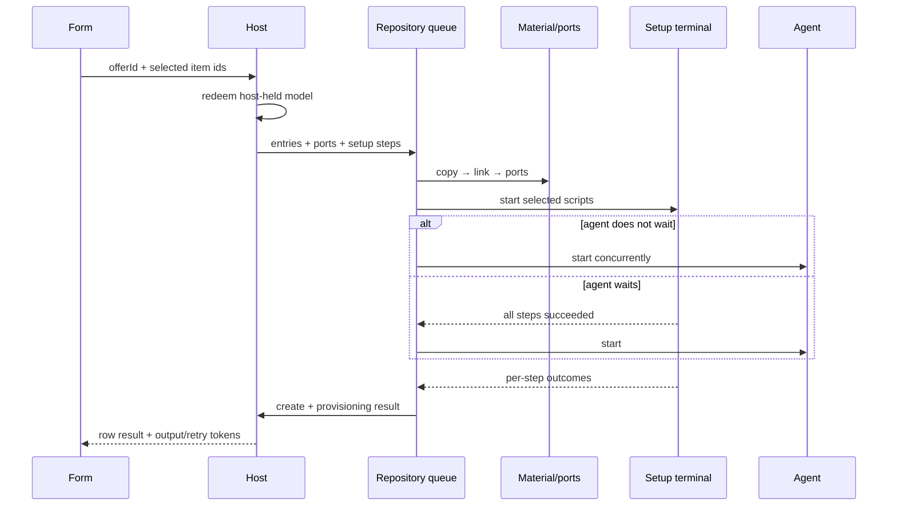

# Design: run-the-setup-the-user-saw

## Architecture



## Decisions

### D1: Redemption produces execution values, never webview authority

`WorktreeHost` resolves all three selectable classes from one current offer: entries, ports, and setup steps. It derives the asimov environment class as `providers.some(p => p.id === "asimov" && p.active)`; the current merge marks both native and its named base active, so native-extending-asimov is included. The create request carries those host-owned values; the webview remains capable of sending only opaque ids.

An unknown or superseded offer keeps the existing fail-closed create refusal. Retry uses the retained setup values from the original redemption and never reads a provider file.

### D2: One output terminal, one shell process per step

A setup run owns one VS Code pseudoterminal for output and input. Its first child starts only after `Pseudoterminal.open()` establishes the write sink; VS Code discards earlier events. For each step, the runner starts a fresh PTY child and streams it through that terminal.

POSIX reuses `detectShell()` and launches the validated user shell with its login arguments followed by `-c` and the exact script as one argv element. Windows uses `powershell.exe -NoProfile -NonInteractive -EncodedCommand <payload>`; the UTF-16LE base64 payload decodes to the exact script, contains no Win32 quoting metacharacters, and stays one argument through node-pty's command-line join. `shell: true`, command-line interpolation, VS Code tasks, and provider-specific dispatch are absent.

The terminal forwards user input to the current PTY and keeps a 1 MiB tail transcript while streaming. Closing it during execution cancels the run; closing it later does not invalidate `View output`, which recreates a read-only terminal from that bounded transcript. Reaching the shared two-hour deadline kills the current child and fails the step. One process exits before the next starts; the first non-zero, signal, spawn failure, cancellation, or timeout marks later steps skipped.

### D3: Setup remains inside repository mutation serialization

The mutation service includes selected setup in the condition that mints source/destination authority and the normalized result worktree id, so a setup-only selection has the same target proof and row merge key as entries or ports. Setup starts only after entry application and authoritative port allocation. Every successful port result is added to the child environment under its configured name and authoritative value.

The setup promise remains inside the repository coordinator, so remove, retry, and another create cannot race commands against the same repository state. The accepted cost is that one repository's mutations and the create result may wait up to the shared two-hour setup bound; closing the terminal cancels earlier.

For an agent create with `waitForSetup: false`, agent launch starts immediately after setup starts and the service awaits both independently. With `waitForSetup: true`, launch is called only after all selected setup steps succeed. No selected setup means the ordinary launch path regardless of the carried boolean.

### D4: Retry is capability-bound to one surviving worktree

A failed run mints an opaque retry id and retains one immutable record per normalized worktree id: repository id/path, worktree path, original directory authorization, branch, setup steps, environment class, material/port results, and contest membership.

`worktreeSetupRetry` carries only worktree id plus retry id. The host resolves the current row; the service then requires the token, path, and original directory authority to agree before entering the repository queue. A retry rotates the token, runs setup only, rewrites the manifest from retained results, and emits a provisioning-only report — never a second mutation/create notice. Success removes retry state. Authoritative rebuild reconciliation drops records for worktrees no longer present, bounding the store to live rows and preventing remove/recreate reuse.

A retry report omits entries, ports, and contests rather than re-sending steps whose contest indices could outlive the original membership array. The controller preserves those fields and replaces setup fields only.

The setup output id is separately opaque and bound to the originating surface. `worktreeSetupViewOutput` reveals the live terminal or recreates one from its bounded transcript. Starting a retry retires the prior output handle and transcript.

### D5: The manifest is an atomic record, not an execution input

After initial setup settles — including an empty selection or a failure — the service writes version 1 to `anywhere-terminal-provision.json` under the directory returned by `readWorktreeGitDir`.

The writer authorizes that administrative directory, rechecks it around a `LockedFile.atomicReplace`, and serializes only successful materialization, authoritative allocated/reused ports, and every selected setup source with `ok | failed | skipped`. Retry replaces the same manifest with the latest setup outcomes while preserving the retained material and port records.

Manifest failure is a warning on the provisioning result. It does not change create, setup, port, launch, or retry outcomes, and the manifest is never read to authorize execution.

### D6: Setup state rides the existing provisioning result

`WorktreeProvisionResultMessage` gains setup outcomes, optional output/retry ids, and an optional manifest warning. Its entry/port/contest fields become an all-present initial-result arm or an all-absent setup-only update arm. Initial create uses the existing ordered delivery; retry uses a new provisioning-only host delivery so no second mutation notice competes with the create row.

The create form adds one wait checkbox beside the agent controls. It defaults off, stays visible while agent launch is selected, and is disabled whenever the current selection contains no setup step. A failed setup notice exposes `View output` and `Retry setup`; retry refreshes that same notice.

## Interfaces

```ts
interface ProvisionSetupResult {
  readonly id: string;
  readonly source: string;
  readonly script: string;
  readonly outcome:
    | { readonly kind: "ok" }
    | { readonly kind: "failed"; readonly reason: string }
    | { readonly kind: "skipped"; readonly reason: string };
}

interface SetupRunInput {
  readonly repoId: string;
  readonly mainPath: string;
  readonly worktreeId: string;
  readonly worktreePath: string;
  readonly branch: string;
  readonly steps: readonly ProvisionSetupStep[];
  readonly asimovEnvironment: boolean;
  /** Authoritative allocated/reused values under their configured names. */
  readonly ports: Readonly<Record<string, number>>;
  readonly authorization: AuthorizedDirectory;
}

interface SetupRunResult {
  readonly steps: readonly ProvisionSetupResult[];
  readonly outputId?: string;
  readonly succeeded: boolean;
}
```

`WorktreeProvisionResultMessage` adds `setup`, `setupOutputId`, `setupRetryId`, and `manifestWarning`. Initial results require `steps` and `ports` and may carry `contests`; setup-only retry updates structurally forbid all three. The two new inbound actions carry opaque tokens only.

## Risk Map

| Component | Risk | Mitigation |
|---|---|---|
| Offer redemption | A forged or stale selection chooses unseen command text | Filter ids against the current host-held offer; contract and host-action tests cover foreign, stale, and omitted ids |
| Shell invocation | Win32 quoting or line breaks change the script before execution | POSIX uses one `-c` argv value; Windows uses one metacharacter-free `EncodedCommand` payload and verifies the decoded bytes in an executable test |
| Working directory | A setup-only create has no authority, or a replaced worktree redirects setup | Include setup in authorization/result-id guards; recheck before every child; retry requires the original authority |
| Process lifetime | Hung or abandoned scripts hold the mutation queue | One shared two-hour deadline, terminal-close cancellation, child kill, later-step skips, and the queue cost stated explicitly |
| Agent sequencing | A gated agent starts after failed setup, or an ungated agent waits | Explicit two-branch orchestration tests with controlled promises and launch spies |
| Retry state | Tokens survive removal/recreation or grow per attempt | One rotating record per live worktree, reconciled after rebuild; success and disappearance evict it |
| Output state | Output before terminal open is lost, memory grows, or another surface reveals it | Start after `open`; retain a 1 MiB tail and one opaque origin-scoped handle per failed live worktree |
| Manifest | Partial JSON or wrong administrative directory becomes evidence | Git resolves the directory; authorize it; stage and rename atomically; reader treats absence/malformed/version drift as unproven |
| Shared files | WT-012.5 is concurrently changing native-config seams | Setup work avoids `writeNativeConfig.ts`; host edits are localized to offer redemption and action routing |

## Obligation Ledger

| Claim | Semantics | Defeater | Witness/check | Disposition |
|---|---|---|---|---|
| Only consented command text executes | Every launched script equals one selected step in the redeemed current offer | Webview text, stale id, provider re-read, or unselected id reaches spawn | Host-action integration tests inspect setup values and stale-offer refusal | supported |
| Script text is one shell argument | POSIX carries exact text in one argv value; Windows carries one payload whose decoded text is exact | Win32 joining, interpolation, `shell: true`, or task dispatch changes it | POSIX argv tests plus a real PowerShell decode/execute witness with quotes, CRLF, and newlines | supported |
| Setup runs in the created checkout | Setup-only and mixed selections mint authority; every child uses the authorized worktree cwd | Authorization guard omits setup, or ancestry changes before a step or retry | Setup-only create, authority substitution, and retry recreation tests | supported |
| Copy, link, and ports precede setup | No setup child starts before both apply phases settle | A rejected or slow apply is bypassed | Mutation-service controlled-promise order tests | supported |
| Agent wait choice is exact | Off overlaps setup; on starts only after all steps succeed; gated failure starts none | One unconditional await or unconditional launch | Three scheduling tests: off, on-success, on-failure | supported |
| A failed setup cannot erase successful state | Worktree, earlier provisioning, and successful steps remain; later steps skip | Rollback, repeated materialization, or create-error relabelling | Service result and retry tests assert no remove/copy/port replay | supported |
| Retry cannot cross identity | A retry token is valid only for the originally authorized surviving directory | Remove/recreate at same path accepts old steps | Directory identity replacement and token-rotation tests | supported |
| Spawned work is bounded | One active child per run; the two-hour deadline or cancel kills it and settles | Orphan process or unresolved completion after terminal closes | Fake-clock/cancel tests assert kill, queue release, and terminal outcome | supported |
| Manifest publication is atomic and descriptive | Readers see old or complete new version; it never authorizes execution | Partial write, basename-derived git dir, or read-before-run drives spawn | Writer rename-failure, git-dir, retry-replace, and reader-degradation tests | supported |
| Retained setup state is bounded | At most one retry/output record per live worktree | Every attempt or departed row adds a permanent record | Reconciliation and repeated-retry size tests | supported |
