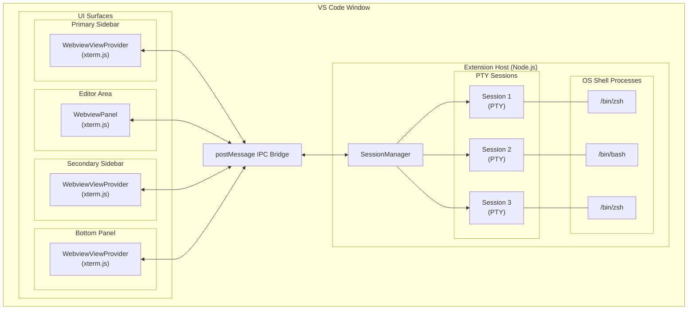
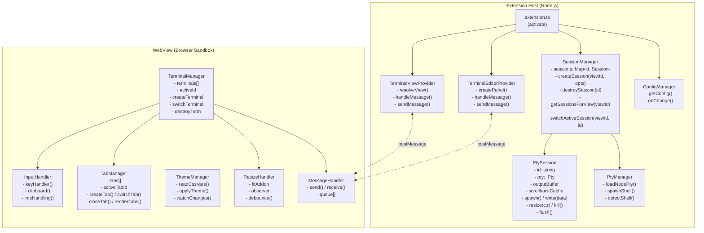
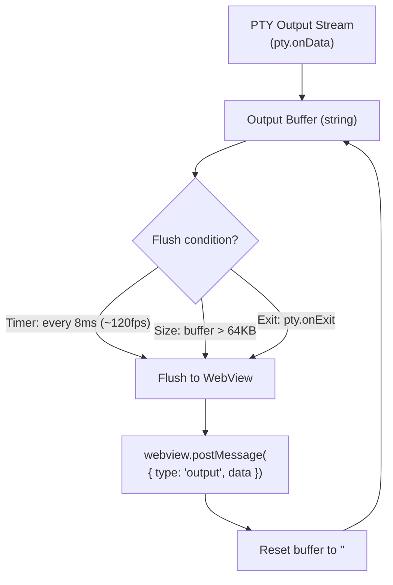
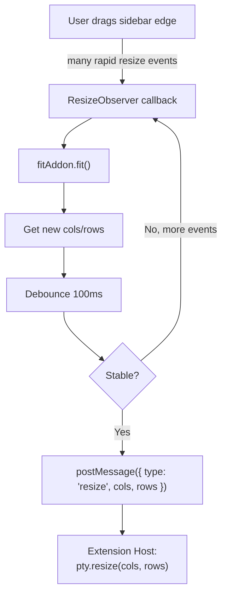
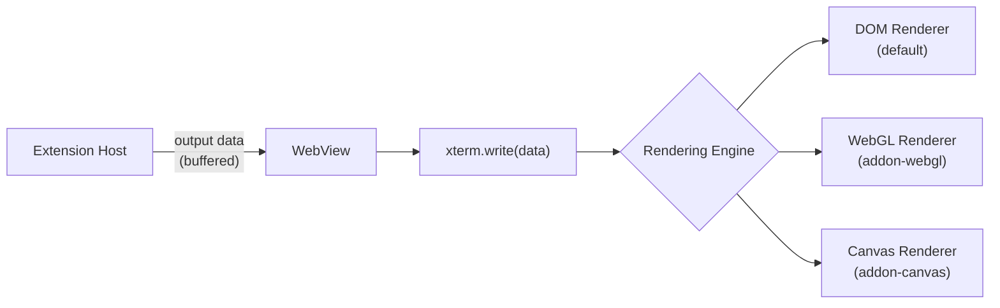
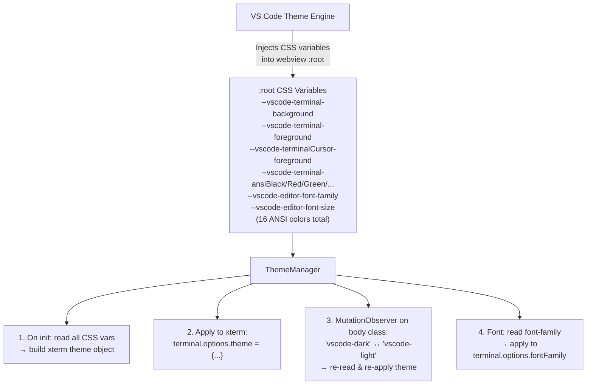
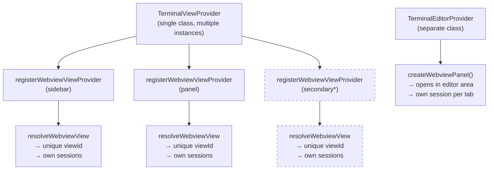
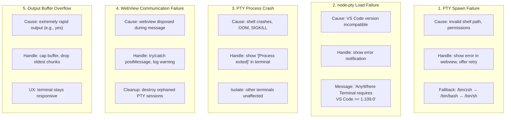
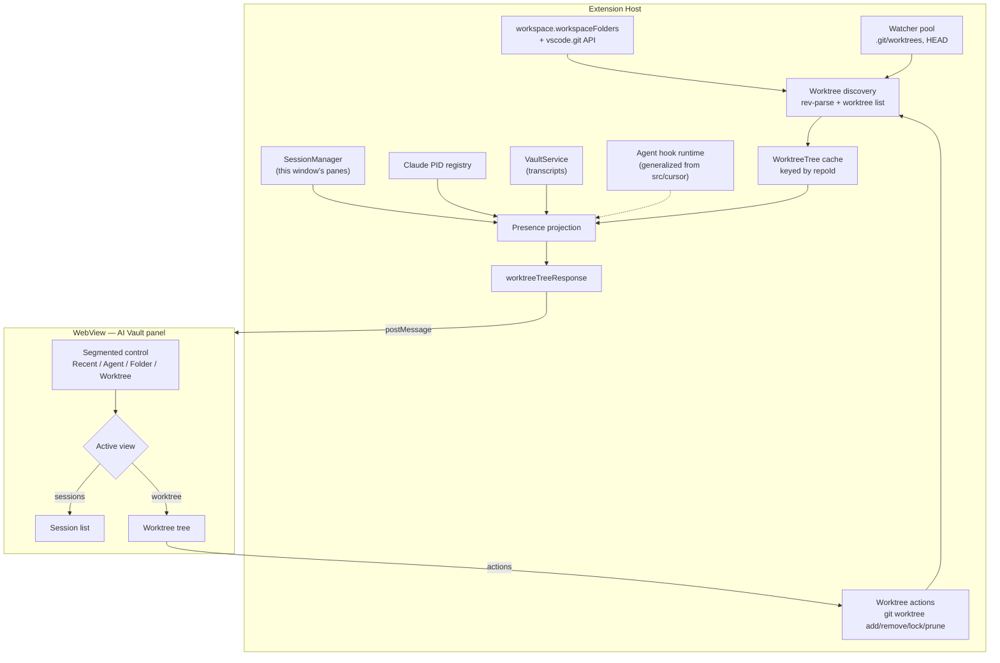

# AnyWhere Terminal - System Design

## 1. Architecture Overview

AnyWhere Terminal follows a **3-layer architecture** with strict separation between the VS Code Extension Host (backend), the IPC Bridge (transport), and the WebView (frontend).



---

## 2. Component Design

### 2.1 Component Diagram



### 2.2 File Structure

```
src/
├── extension.ts                    # Entry point, activate/deactivate
├── providers/
│   ├── TerminalViewProvider.ts     # WebviewViewProvider for sidebar/panel
│   └── TerminalEditorProvider.ts   # WebviewPanel for editor area
├── session/
│   ├── SessionManager.ts          # Central session registry
│   └── PtySession.ts              # Single PTY session wrapper
├── pty/
│   └── PtyManager.ts              # node-pty loader and shell detection
├── config/
│   └── ConfigManager.ts           # Settings reader
├── types/
│   └── messages.ts                # Shared message type definitions
└── webview/
    ├── main.ts                    # Webview entry point
    ├── terminal/
    │   ├── TerminalManager.ts     # xterm.js instance management
    │   └── InputHandler.ts        # Keyboard/clipboard handling
    ├── ui/
    │   ├── TabManager.ts          # Tab bar UI
    │   └── ThemeManager.ts        # Theme integration
    └── utils/
        ├── ResizeHandler.ts       # FitAddon + debounced resize
        └── MessageHandler.ts      # postMessage wrapper
media/
├── webview.js                     # Bundled webview code
├── webview.css                    # Additional styles (if needed)
└── icon.svg                       # Extension icon
```

---

## 3. Data Flow & Sequence Diagrams

Detailed data flow diagrams are documented in separate files for maintainability:

| Flow | Document | Description |
|------|----------|-------------|
| Terminal Initialization | [flow-initialization.md](design/flow-initialization.md) | WebView creation → PTY spawn → first prompt |
| User Input Round-Trip | [flow-user-input.md](design/flow-user-input.md) | Keystroke → PTY → output with flow control |
| Clipboard (Copy/Paste) | [flow-clipboard.md](design/flow-clipboard.md) | Cmd+C/V handling, SIGINT vs copy |
| View Collapse/Expand | [flow-view-lifecycle.md](design/flow-view-lifecycle.md) | retainContextWhenHidden, scrollback cache |
| Multi-Tab Lifecycle | [flow-multi-tab.md](design/flow-multi-tab.md) | Create, switch, close tabs with operation queue |

---

## 4. Message Protocol

> Full specification: [design/message-protocol.md](design/message-protocol.md)

The extension and webview communicate via `postMessage` using discriminated union types. Core terminal messages cover ready/init, input/output, tabs, splits, resize, restore, config, and errors. File-tree messages share the same bridge and route directory reads, search, watching, reveal, path copy, and confirmed delete actions through the extension host.

---

## 5. Component Designs

Detailed component designs are documented in separate files:

| Component | Document | Description |
|-----------|----------|-------------|
| PtyManager | [design/pty-manager.md](design/pty-manager.md) | node-pty loading, shell detection, spawn config |
| SessionManager | [design/session-manager.md](design/session-manager.md) | Session lifecycle, operation queue, kill tracking |
| Output Buffering | [design/output-buffering.md](design/output-buffering.md) | Two-layer buffering, flow control (100K/5K watermarks) |
| xterm.js Integration | [design/xterm-integration.md](design/xterm-integration.md) | Terminal setup, addon loading, renderer selection |
| Theme Integration | [design/theme-integration.md](design/theme-integration.md) | CSS variable mapping, location-aware background |
| Resize Handling | [design/resize-handling.md](design/resize-handling.md) | Smart resize, debouncing, DPI-aware dimensions |
| Keyboard & Input | [design/keyboard-input.md](design/keyboard-input.md) | Custom key handler, clipboard, IME, bracketed paste |
| WebView Provider | [design/webview-provider.md](design/webview-provider.md) | WebviewViewProvider lifecycle, CSP, ready handshake |
| Error Handling | [design/error-handling.md](design/error-handling.md) | Error categories, fallback chains, user notifications |
| Build System | [design/build-system.md](design/build-system.md) | Dual-target esbuild, dependencies, packaging |
| Worktree Model | [design/worktree-model.md](design/worktree-model.md) | Worktree discovery, identity, path normalization, cache + watch |
| Agent Presence | [design/worktree-agent-presence.md](design/worktree-agent-presence.md) | Which agents run in a worktree, evidence model, external sessions |
| Worktree Protocol | [design/worktree-rpc.md](design/worktree-rpc.md) | Host↔webview messages for the Worktree view |
| Worktree Panel UI | [design/worktree-panel-ui.md](design/worktree-panel-ui.md) | The fourth vault segment, tree structure, states, interaction |
| Worktree Actions | [design/worktree-actions.md](design/worktree-actions.md) | Create, remove, lock, prune, launch — and the safety model |
| Agent Hook Server | [design/agent-hook-server.md](design/agent-hook-server.md) | Loopback hook endpoint for authoritative agent status |

---

## 6. Build System

> Full specification: [design/build-system.md](design/build-system.md)

Dual-target esbuild configuration: Extension Host bundle (Node.js, CJS) and WebView bundle (Browser, IIFE). `node-pty` and `vscode` are externalized from the extension bundle. The webview bundle includes xterm.js and all addons as a self-contained IIFE.

---

## 7. Performance Design

### 7.1 Output Buffering Strategy



See [output-buffering.md](design/output-buffering.md) for the complete two-layer buffering and flow control design (100K high watermark / 5K low watermark).

### 7.2 Resize Debouncing



### 7.3 Rendering Pipeline



---

## 8. Theme Integration



See [theme-integration.md](design/theme-integration.md) for the complete theme design including location-aware background colors.

---

## 9. View Placement Strategy

### 9.1 Supported Locations and APIs

| Location | API | Registration | Notes |
|----------|-----|-------------|-------|
| **Primary Sidebar** | `WebviewViewProvider` | `viewsContainers.activitybar` | Fully supported |
| **Bottom Panel** | `WebviewViewProvider` | `viewsContainers.panel` | Fully supported |
| **Editor Area** | `WebviewPanel` | `createWebviewPanel()` | Opens as editor tab |
| **Secondary Sidebar** | `WebviewViewProvider` | `viewsContainers.secondarySidebar` (proposed) OR user "Move View" | Proposed API in VS Code 1.104+ |

### 9.2 Provider Reuse Pattern



> *Secondary sidebar uses same provider, different viewId. Dashed = proposed API.

---

## 10. Error Handling



See [error-handling.md](design/error-handling.md) for the complete error handling design including error categories, fallback chains, and user notification patterns.

---

## 11. Security Considerations

### 11.1 WebView Content Security Policy

```
Content-Security-Policy:
  default-src 'none';                    # Block all by default
  style-src ${webview.cspSource}         # Allow VS Code webview styles
           'unsafe-inline';              # Allow inline styles for xterm
  script-src 'nonce-${nonce}';           # Only nonce-tagged scripts
  font-src ${webview.cspSource};         # Allow VS Code fonts
  img-src ${webview.cspSource};          # Allow webview images
```

### 11.2 PTY Security

- Shell spawned with user's environment (`process.env`)
- Working directory defaults to workspace root
- No elevated privileges
- PTY processes are children of the Extension Host process
- All PTY processes killed on extension deactivation

---

## 12. Testing Strategy

### 12.1 Unit Tests
- `SessionManager`: session CRUD, number recycling, cleanup
- `PtyManager`: shell detection, node-pty loading
- `ConfigManager`: setting reads, defaults, changes
- Message protocol: serialization/deserialization

### 12.2 Integration Tests
- Extension activation/deactivation
- WebView creation and message flow
- PTY spawn and I/O round-trip
- View lifecycle (create, hide, show, dispose)

### 12.3 Manual Test Matrix

| Test Case | Sidebar | Panel | Editor | Secondary |
|-----------|---------|-------|--------|-----------|
| Shell prompt appears | [ ] | [ ] | [ ] | [ ] |
| `ls -la` output correct | [ ] | [ ] | [ ] | [ ] |
| Resize works | [ ] | [ ] | [ ] | [ ] |
| Copy/paste works | [ ] | [ ] | [ ] | [ ] |
| Ctrl+C interrupts | [ ] | [ ] | [ ] | [ ] |
| Multi-tab works | [ ] | [ ] | [ ] | [ ] |
| vim opens and works | [ ] | [ ] | [ ] | [ ] |
| Theme matches | [ ] | [ ] | [ ] | [ ] |
| Collapse/expand recovery | [ ] | [ ] | [ ] | [ ] |
| Heavy output (`find /`) | [ ] | [ ] | [ ] | [ ] |

---

## 13. Worktree & Agent Presence Subsystem

A fourth view inside the AI Vault panel: the git worktrees of the workspace's repositories,
with the agents running inside each one. The view answers a question the session list cannot
— *where is work happening right now, and what is blocked* — and turns each worktree into a
place to act (open, create, remove, launch an agent).

### 13.1 Architecture



Four properties define the subsystem:

1. **The worktree tree and the agent presence projection are separate models**, pushed
   together in one message. Worktrees come from git and change rarely; presence comes from
   live panes and changes constantly. Merging them would let one stale git read erase live
   agent evidence.
2. **Evidence is never collapsed to a single status.** Every agent row carries what we know,
   where it came from, and how strongly — so the dot, the icon, and any future notifier each
   apply their own rule.
3. **Scope is this VS Code window**, with one deliberate exception: an agent running in a
   worktree from another window appears as an explicitly labelled `external` row. A worktree
   view that reports "nobody is working here" while an agent is mid-turn is worse than one
   that admits it cannot reach that pane.
4. **The host owns freshness.** Watcher-driven, debounced, pushed. Nothing polls except the
   machine-wide session registry, which emits no events.
5. **Discovery and presence are owned once per window, not once per surface.** Three webview
   surfaces render this view; if each drove its own watchers, git invocations, and registry
   scans, a user with the sidebar and an editor panel open would pay for everything twice.
   One owner per extension host with attached clients — the shape
   `VaultWatchCoordinator` already uses — and source work pauses only when *no* client has the
   Worktree view active.

**Remote development.** The blueprint assumes the extension runs workspace-side, which it
does: it declares `main` and loads `node-pty`, so in SSH, WSL, and dev-container windows VS
Code runs it on the remote, where git, the ptys, `~/.claude`, and the hook runtime all live
together. Nothing in the design reaches across the local/remote boundary, so no additional
work is required — but the assumption is recorded rather than left implicit. Browser-only
hosts (github.dev) are already unsupported for an unrelated reason: `node-pty` cannot load
there.

### 13.2 Component responsibilities

| Concern | Owner | Design |
|---------|-------|--------|
| Repo roots, worktree enumeration, identity, cache, watch | Extension host, new worktree module | [worktree-model.md](design/worktree-model.md) |
| Per-pane title and waiting evidence reaching the host | Each webview surface reports; the host aggregates by pane id | [worktree-agent-presence.md](design/worktree-agent-presence.md) § 3.3 + § 13.6 below |
| Pane→worktree mapping, agent identity, activity, external rows, subagents | Extension host, new presence module | [worktree-agent-presence.md](design/worktree-agent-presence.md) |
| Message contract and validation | `src/types/messages.ts` + the view provider | [worktree-rpc.md](design/worktree-rpc.md) |
| The fourth segment, tree rendering, states, keyboard | WebView, alongside `VaultPanel` | [worktree-panel-ui.md](design/worktree-panel-ui.md) |
| Create / remove / lock / prune / launch | Extension host, extending the vault launcher with a fresh-launch contract | [worktree-actions.md](design/worktree-actions.md) |
| Authoritative status and live subagent rosters | Extension host, **generalizing the existing Cursor hook runtime** to multiple agents | [agent-hook-server.md](design/agent-hook-server.md) |

### 13.3 Reuse — what this subsystem does not rebuild

| Existing capability | Location | Used for |
|---------------------|----------|----------|
| `vscode.git` API types + repository state events | `src/providers/git.ts` | Repo roots without re-implementing repo detection; branch changes for repos VS Code already has open |
| Watcher pool with per-event-kind debounce | `src/providers/fsWatcherPool.ts` | Watching `.git/worktrees` and `HEAD` — via `subscribePattern` only, since `subscribe()` ignores change events. The pool does **not** pause on window blur, and it currently cannot report a watcher-creation failure to its caller |
| Loopback hook runtime with per-session tokens | `src/cursor/CursorHookRuntime.ts` | **The** agent hook endpoint, widened from one agent to several. Already does constant-time token compare and liveness re-check at use time |
| Hook config installer with cross-process lock + atomic rename | `src/cursor/CursorHookInstaller.ts` | Writing managed entries into an agent's settings file without losing a concurrent edit |
| Hook enable/disable controller | `src/cursor/CursorHookController.ts` | Settings-driven lifecycle; one controller for all agents, never two |
| Pty env contributor seam | `SessionEnvironmentContributor`, `SessionManager.ts:101` | Reaching the agent at spawn — **currently a singular slot that must widen** |
| Shared watch coordinator with attached clients | `src/providers/VaultWatchCoordinator.ts` | The pattern for owning discovery once per window rather than once per webview surface |
| Per-pane activity projection **rules** | `src/webview/terminal/TerminalActivityTracker.ts` | The projection logic only. The tracker instance itself is webview-side and sees just its own surface's panes, so presence cannot consume it — see § 13.6 |
| Live Claude session registry | `src/vault/readers/runningSessions.ts` | External rows, with headless runs excluded |
| Pane→session resolution | `src/session/resolveClaudeSession.ts` | Linking a pane to a vault entry |
| Agent registry, argv builder, launcher | `src/vault/registry.ts`, `LaunchBuilder.ts`, `VaultLauncher.ts` | Launching an agent into a worktree |
| Session preview overlay | `src/webview/vault/PreviewController.ts` | Opening a transcript from an agent row |
| Reveal / copy-path / copy-resume handlers | `src/providers/TerminalViewProvider.ts` | Worktree variants of the same actions |
| Render-signature no-op guard | `src/webview/vault/vaultRenderSignature.ts` | Suppressing spinner-driven re-renders |

### 13.4 Truthfulness invariants

These hold across every layer and are testable statements, not aspirations. Each prevents a
specific false claim the view could otherwise make.

| # | Invariant |
|---|-----------|
| I1 | A failed or timed-out scan never downgrades a row. Absence of evidence is not evidence of absence |
| I2 | A spinner frame proves activity, never identity. No agent icon without a proven identity |
| I3 | An `external` row is never focusable and is always labelled as running outside this window |
| I4 | Identity confidence and activity confidence are derived independently from their own source; neither is collapsed into a single field |
| I5 | Transcript-derived subagents are history, rendered as history, with `live: false` |
| I6 | A resumed or cleared session landing idle is not a completed turn |
| I7 | Hook status is never carried across a window reload — the process that published it is gone, so the pane returns to inference |
| I8 | Degraded data is labelled with its failing source and reason; a repo that fails to list keeps its last good listing. An empty result that is genuinely empty is not degraded |
| I9 | Decorative title frames are stripped in the webview, before any message, comparison, render signature, or identity test |
| I10 | The extension never deletes files directly; directory removal is delegated to git — which still deletes recursively, so this bounds our bugs, not git's consequences |
| I11 | A subagent row nests exactly one level, carries no pane identity, and activates its parent's pane |
| I12 | Children inherit their parent's freshness — a stale parent leaves no provably-working child |
| I13 | Every turn state maps to exactly one activity; a state no event can produce does not exist |
| I14 | A confirmation authorizes the blocker set it was shown; a blocker that appears afterwards re-prompts, and a working agent is never force-removable |
| I15 | A failed or timed-out mutation still forces a rebuild; a state git and the filesystem disagree about is reported as indeterminate, never as a clean failure |
| I16 | Agent-reported identity is a lookup key only; no reported path is opened on the report's authority |

### 13.5 Security posture

| Surface | Control |
|---------|---------|
| Webview-supplied ids | Re-resolved host-side to paths the host itself issued |
| Webview-supplied **paths** | One action takes one: `worktreeCreate` names a path for an object that does not exist yet, so there is no id to resolve from. It is untrusted input — validated host-side, revalidated after any queue wait, symlinked components refused, with a residual TOCTOU window documented rather than denied |
| Git invocation | argv arrays only; refs and paths validated; leading `-` rejected |
| Destructive actions | Blockers re-evaluated at execution and bound to the confirmation by fingerprint; a newly appeared blocker re-prompts; a running or waiting agent is never force-removable; the main worktree is never removable |
| File deletion | Never performed directly; delegated to `git worktree remove`, whose deletion is recursive and irreversible |
| Hook endpoint | Loopback bind, ephemeral port, **per-session** token re-validated against live registration at use time, POST-only, fail-open, 1 MB cap. The trust boundary is the pane, not the agent: same-pane child processes inherit the coordinates and are inside it |
| Agent config mutation | Opt-in setting, off by default; cross-process lock + atomic rename; unknown keys preserved; symlinked destination refused; uninstall command; absolute script path reconciled on extension update |
| Agent-reported identity | `sessionId` looked up in the vault store; `transcriptPath` compared against the store, never opened on the report's authority |
| Prompt delivery | Native prefill preferred; otherwise an argv token or a pty write, never shell interpolation |
| Launch environment | **Known pre-existing gap.** `PtyManager.buildEnvironment()` clones the whole host `process.env` and the agent allowlist merges over it rather than filtering, so launched agents inherit host credentials. Affects every vault launch, not just this feature; recorded, not fixed here |

### 13.6 Host / webview boundary and multi-surface fan-out

The AI Vault is **not** its own webview. It is a DOM section mounted into the same webview
document that hosts the terminals (`src/providers/webviewHtml.ts:694-696`), and that document
is loaded by **three** surfaces — sidebar, panel, and editor — each of which therefore runs
its own `VaultPanel` instance over its own state. Three consequences the design must hold:

| Consequence | Rule |
|-------------|------|
| There is no single "the webview" | The host **broadcasts** the tree to every live webview. A reply to one surface's request still goes to all, because they render the same window-scoped truth |
| Every surface retains its DOM while hidden | All three are registered with `retainContextWhenHidden: true` (`src/extension.ts:198-231`, `src/providers/TerminalEditorProvider.ts:189-197`). A hidden surface's tree still costs DOM work on push, so pushes are skipped for surfaces whose Worktree view is not the active segment, and the render-signature guard catches the rest |
| Per-surface state is not window state | Anything scoped to the window — which panes exist, what each is doing — must be projected **host-side**. Anything genuinely per-surface — scroll, collapse, expansion — stays in that surface's own persisted state |

The last row is why the agent-activity projection lives in the host rather than reusing the
existing per-surface tracker: a tracker in the sidebar cannot see a pane in the editor, so a
window-scoped view built on it would under-report by construction. The projection *rules* are
shared with the tracker; the *instance* is not.

---

## 14. Key Design Decisions — Worktree Subsystem

| # | Decision | Alternative rejected | Rationale |
|---|----------|---------------------|-----------|
| D1 | Worktree is a fourth **view** that swaps the panel body | A fourth `GroupMode` in `groupEntries()` | Grouping buckets already-loaded sessions, so a worktree with zero agents would vanish. A worktree is a different entity that exists, and is actionable, with no sessions |
| D2 | Group by normalized `git-common-dir`, not by repository `rootUri` | Group by workspace folder | A workspace holding both a repo and one of its own linked worktrees would otherwise render two groups for one repo |
| D3 | `WorktreeInfo.id` is the normalized absolute path | Composite `<repoId>:<path>` | Paths may contain `:`; a path already belongs to exactly one worktree, so a composite id buys nothing and costs an escaping rule |
| D4 | Realpath both sides of every path comparison | Lexical comparison | macOS reports `/private/var` from the process table and `/var` from git; without realpath every worktree under a symlinked root shows zero agents |
| D5 | Tree and presence are one message | Two messages | Prevents rendering an agent row whose worktree is absent from the tree currently held |
| D6 | External (other-window) agents shown, labelled, non-focusable | Hide them entirely | Silence would claim a busy worktree is idle. Labelling is honest; offering focus would be a lie |
| D7 | Subagents from transcripts, flagged `live: false`, fetched lazily | Live roster from day one | A live roster requires hooks. Transcript data is real but post-hoc; rendering it as live would be the exact failure the evidence model exists to prevent |
| D8 | Persist a new `vaultView` key beside `vaultGroupMode` | Widen the `vaultGroupMode` union | Keeps a *view* value from flowing into `groupEntries()`, and leaves existing persisted state valid |
| D9 | Default to the Worktree view only when the workspace has a git repo | Always default to Worktree | A repo-less workspace would open on a permanently empty panel, which reads as broken |
| D10 | Destructive actions confirm through a host round trip that names live panes and external agents | Client-side confirmation | Only the host can see live panes and registry sessions; the blockers are re-evaluated at execution, so a confirmation is a permission, not a bypass token |
| D11 | Removal never deletes the branch and never kills panes | Bundle both into "remove" | Each is a separate consequence; bundling destroys work the user believed was merely un-checked-out |
| D12 | Hook installation is opt-in, off by default | On by default | It writes into a config file the user owns. The view degrades gracefully without it, which makes off-by-default acceptable rather than crippling |
| D13 | Hook status supersedes inference only while fresh | Hook status always wins | A stale hook row must fall back to identity-only, or a reload resurrects an unanswerable question card |
| D14 | Virtualization is out of scope; cap with a "show all" affordance | Virtualize the tree | Worktree counts are tens, not thousands. A cap that says so beats a silent truncation and beats premature machinery |
| D15 | The create form carries an agent picker; creating and launching is one action | Two separate actions the user composes | Creating a worktree in order to put an agent in it is one intent. The launch reuses the standalone launch path, and a failed launch never rolls back a successful create |
| D16 | No filesystem path on any tree row | Path truncated from the left on the worktree row | At sidebar width a path crowds out the branch name, which is the identity users navigate by. The path stays reachable from the tooltip and the copy action |
| D17 | The worktree row's leading glyph shows the strongest agent state | A separate status column | One glyph slot keeps rows single-line and aligned; `waiting` outranks `running` because it is the state that needs a human |
| D18 | Generalize the existing Cursor hook stack into one multi-agent runtime | A second `AgentHookServer` beside it, or per-launch `--settings` injection | `src/cursor/` already ships the loopback runtime, per-session tokens, the env-contributor seam, the locked+atomic config installer, and an event reducer. A second server would duplicate all of it and collide on the singular contributor slot; two controllers could disagree about enablement and disposal. The reference implementation also chose global install over `--settings`, and tests that choice explicitly |
| D19 | No on-disk endpoint artifact; env at spawn is the only channel | The reference's endpoint file | That file exists to let a *static* config entry find a *moving* server — necessary there because ptys are daemonized and agents can be remote. Here ptys die with the window, so spawn-time env can never go stale, and a window-global file against a window-local runtime would misroute one window's events into another's |
| D20 | No single `confidence` field; derive it per source | One field on the row | A pane can be authoritative for identity and fallback for activity, or the reverse. One field forces a lossy choice; the sources already carry the answer |
| D21 | Watch `.git/worktrees` non-recursively plus the two `HEAD` targets, with a 1 s/repo rebuild floor | Recursive `worktrees/**` | That subtree holds `index`, `FETCH_HEAD`, `ORIG_HEAD` and `logs/`, which churn on nearly every git operation. An agent working in a linked worktree would drive a relist plus a broadcast several times a second, indefinitely |
| D22 | Confirmations are bound to their blocker set by fingerprint | A bare `force: true` re-send | Otherwise confirming "3 untracked files" also authorizes deleting a worktree that acquired a live agent in the meantime — approval for something the user never saw |
| D23 | Ship in stages: navigation core first, then create+launch, then hooks | All seven phases in sequence | The first four phases answer "which worktrees exist, where are my agents, take me there", which is the daily-use core. Hook work is the largest and least certain piece and should not gate it |
| D24 | The launch environment gap is recorded, not fixed here | Fold an env-policy fix into this feature | It affects every vault launch, predates this feature, and changing it touches unrelated paths. Fixing it inside a worktree feature would hide a security change in an unrelated diff |

Decisions made on the user's behalf and recorded rather than asked: D3, D4, D5, D8, D11, D14,
D19–D22. D15–D17 were derived from the reference screenshots reviewed 2026-08-25 and supersede
earlier placeholders in the UI design. D18, D23, and D24 were chosen by the user at the peer-review
triage on 2026-08-25.

---

## 15. Cross-Document Consistency Registry

Contract-critical values and the intentional cross-layer mappings. A value here has exactly
one definition; every other document references it.

| Value | Canonical form | Defined in | Referenced by |
|-------|----------------|-----------|---------------|
| Path normalization rule | realpath → NFC → collapse/strip separators → Windows drive-letter uppercase + case-insensitive compare | [worktree-model.md](design/worktree-model.md) § 3.1 | agent-presence § 3.1, actions § 3, rpc § 4 |
| `WorktreeInfo.id` | Normalized absolute worktree path | [worktree-model.md](design/worktree-model.md) § 2 | rpc § 2, presence § 2, ui § 3, actions § 2 |
| `repoId` | Normalized absolute git common dir | [worktree-model.md](design/worktree-model.md) § 3.2 | rpc § 2, ui § 3.1, actions § 3 |
| `rowId` | `window:<paneId>` or `external:<agent>:<sessionId>` | [worktree-agent-presence.md](design/worktree-agent-presence.md) § 3.5 | rpc § 2, ui § 6 |
| Vault entry id | `<agent>:<sessionId>` — **pre-existing**, defined in `src/vault/types.ts:53` | Code | presence § 2, rpc § 2, actions § 2 |
| Activity vocabulary | `running` / `waiting` / `idle` / `exited` — the first three match `TerminalActivityStatus`; `exited` means the pty died with the tab still open | [worktree-agent-presence.md](design/worktree-agent-presence.md) § 2 | ui § 3.3, hook-server § 4.5 |
| Turn-state vocabulary | `working` / `waiting` / `done` — hook-layer only, **deliberately distinct** from the activity vocabulary above. There is no `blocked` | [agent-hook-server.md](design/agent-hook-server.md) § 3 | presence § 3.3 |
| Evidence tuple | `agentSource`, `activitySource` — confidence is **derived**, never a field | [worktree-agent-presence.md](design/worktree-agent-presence.md) § 2 | ui § 4, hook-server § 4.5 |
| Degradation record | `PresenceDegradation { source, reason, since }` / `WorktreeRepo.degraded` — a reason, never a bare boolean | [worktree-agent-presence.md](design/worktree-agent-presence.md) § 2 | ui § 3, model § 2 |
| Scope values | `window` / `external` | [worktree-agent-presence.md](design/worktree-agent-presence.md) § 2 | ui § 4, rpc § 3 |
| Watcher debounce | 150 ms — the pool's existing `DEBOUNCE_MS` | `src/providers/fsWatcherPool.ts:35` | model § 3.5, presence § 3.7 |
| Watcher rebuild floor | 1 s per repo, watcher-driven rebuilds only; forced refresh bypasses it | [worktree-model.md](design/worktree-model.md) § 3.5 | presence § 3.7 |
| External-scan cadence | Flat 5 s while any surface shows the view; paused otherwise | [worktree-agent-presence.md](design/worktree-agent-presence.md) § 3.7 | — |
| Hook staleness window | 60 s — a status older than this is identity-only | [agent-hook-server.md](design/agent-hook-server.md) § 4.5 | presence § 3.3 |
| Minimum supported git | 2.31 — supplies `locked` / `prunable`. Only `-z` (2.36) has a fallback | [worktree-model.md](design/worktree-model.md) § 3.3 | — |
| Git command timeout | 10 s for read-only listings; mutations get a longer, cancellable budget | [worktree-model.md](design/worktree-model.md) § 5 | rpc § 5, actions § 3.6 |
| Action outcome | `ok` / `error` / `indeterminate` | [worktree-rpc.md](design/worktree-rpc.md) § 2.2 | actions § 3.6 |
| Hook env var | `AT_HOOK_URL` — base, session id, and token in one value so a partial set cannot be inherited. The only channel; no on-disk endpoint artifact | [agent-hook-server.md](design/agent-hook-server.md) § 4.2 | — |
| Hook settings keys | `anywhereTerminal.agentHooks.claude.enabled`, `anywhereTerminal.agentHooks.claudeConfigDir`, and the pre-existing `anywhereTerminal.cursorAgent.hooks.enabled` | [agent-hook-server.md](design/agent-hook-server.md) § 4.7 | — |
| Hook uninstall command | `anywhereTerminal.agentHooks.uninstall` | [agent-hook-server.md](design/agent-hook-server.md) § 4.7 | — |
| Persisted view keys | `vaultView`, `vaultGroupMode`, `worktreeCollapsed`, `worktreeExpandedRows` — per **surface**, not per window | [worktree-panel-ui.md](design/worktree-panel-ui.md) § 2.1 | — |
| Worktree settings keys | `anywhereTerminal.worktree.createRoot` (string, default empty = sibling of the main worktree), `anywhereTerminal.worktree.rowActivation` (`focus` \| `preview`, default `focus`) | [worktree-actions.md](design/worktree-actions.md) § 3.2, [worktree-panel-ui.md](design/worktree-panel-ui.md) § 6 | — |
| `WorktreeOpenAfter` | `none` / `terminal` / `agent` / `newWindow` / `addToWorkspace` | [worktree-rpc.md](design/worktree-rpc.md) § 2.2 | actions § 3.2 |
| Worktree row state precedence | `waiting` > `running` > `idle` > `exited` | [worktree-panel-ui.md](design/worktree-panel-ui.md) § 7.2 | ui § 8 |

**Intentional mapping, not an equality**: the hook layer's turn state and the presence layer's
activity are different vocabularies on purpose. Turn state describes an agent's conversation;
activity describes a terminal. The mapping is total in one direction and partial in the other:

| Turn state | Activity |
|------------|----------|
| `working` | `running` |
| `waiting` | `waiting` |
| `done` | `idle` — never `exited`, because a finished turn does not close the pane |

`exited` has no turn-state preimage. It is produced only by pty exit and overrides any
published hook state.
