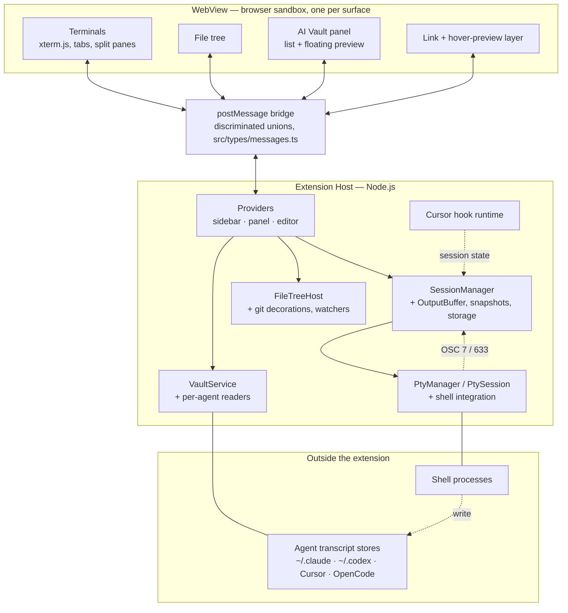
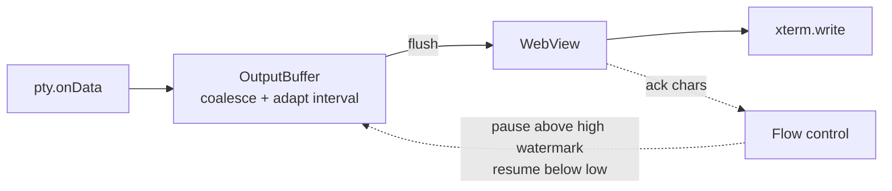
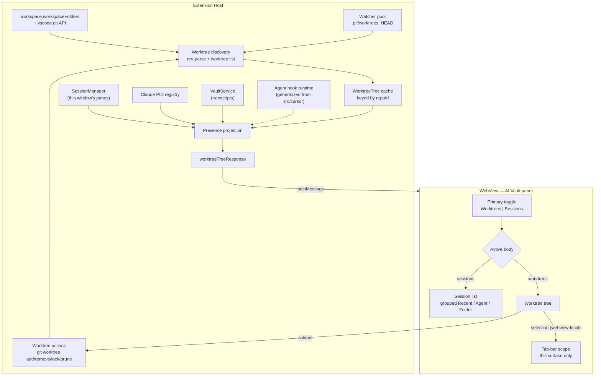

# AnyWhere Terminal — System Design

A VS Code / Cursor extension that runs real terminals in every UI surface, and reads the
on-disk transcripts of AI coding CLIs so past sessions can be browsed and resumed.

This file is the index and the architecture-level view. Every subsystem has its own design
doc under `design/`; nothing here restates what those own.

## 1. Architecture Overview

Three layers with a hard boundary between them. The Extension Host owns processes, the
filesystem, and all VS Code API access. The WebView owns rendering and input. Nothing
crosses except serialized messages.

Two facts about this diagram carry most of the design weight:

- **A surface is a WebView, and every surface runs the same bundle.** Sidebar, panel and
  editor differ only by `data-terminal-location` on `<body>`. This is why a feature added to
  the shared bundle appears in all three surfaces whether or not its host handler exists —
  see the editor-surface gaps in `../audit/`.
- **The vault reads files the extension does not write.** Agent CLIs own those stores; the
  extension is a reader that must tolerate formats changing underneath it.

## 2. Component Design

### 2.1 File Structure

First-party source, by line count. Test files sit beside the code they cover (`*.test.ts`)
and are excluded from these counts.

| Path | Lines | Holds |
|------|-------|-------|
| `src/extension.ts` | 881 | activate, command registration, surface wiring |
| `src/commands/` | 397 | terminal and export commands |
| `src/providers/` | 8 295 | the three surface providers, panel serializer, `FileTreeHost`, git decorations, fs watcher pool, link and preview resolution |
| `src/session/` | 4 649 | `SessionManager`, `OutputBuffer`, snapshot pipeline, `SessionStorage`, shell-integration consumer |
| `src/pty/` | 1 509 | `PtyManager`, `PtySession`, OSC parser, process queries |
| `src/vault/` | 3 828 | `VaultService`, cache, launch, rename |
| `src/vault/readers/` | 9 068 | per-agent transcript parsers, shared detail pipeline |
| `src/cursor/` | 1 171 | hook install, runtime, executable resolution |
| `src/types/` | 1 486 | `messages.ts` (the IPC contract), `errors.ts` |
| `src/settings/` | 345 | settings readers |
| `src/shared/` | 74 | values used by both host and webview |
| `src/utils/` | 62 | |
| `src/webview/` | 2 869 | `main.ts`, `InputHandler`, split panes, tab bar, drag-drop |
| `src/webview/vault/` | 5 978 | vault list, preview, floating window |
| `src/webview/fileTree/` | 4 776 | tree, search, row actions |
| `src/webview/links/` | 3 264 | path detection, hover preview |
| `src/webview/terminal/` | 1 050 | `TerminalFactory`, activity tracking, title gating |
| `src/webview/messaging/` | 409 | `MessageRouter` |
| `src/webview/split/` | 396 | split tree renderer |
| `src/webview/state/` | 382 | persisted webview state |
| `src/webview/resize/` | 268 | fit and debounce |
| `src/webview/ui/` | 224 | banners, tab-bar helpers |
| `src/webview/theme/` | 189 | `ThemeManager` |
| `src/webview/flow/` | 53 | flow-control acks |
| `src/vendor/` | 39 827 | vendored VS Code sources (126 files) and Seti icons |

`src/vendor/` is upstream VS Code code pinned to a known SHA, not our design surface — see
[build-system.md](design/build-system.md) for how it is vendored and gated.

### 2.2 Surfaces

| Surface | API | Registration | Notes |
|---------|-----|--------------|-------|
| Primary Sidebar | `WebviewViewProvider` | `viewsContainers.activitybar` | |
| Bottom Panel | `WebviewViewProvider` | `viewsContainers.panel` | |
| Editor Area | `WebviewPanel` | `createWebviewPanel()` | Own provider; restored by `TerminalPanelSerializer` |
| Secondary Sidebar | `WebviewViewProvider` | user "Move View" | Same provider as the primary sidebar |

Sidebar and panel share one `TerminalViewProvider` class with one instance each; the editor
area has a separate `TerminalEditorProvider`. That asymmetry is the source of the
editor-surface gaps recorded in `../audit/`.

## 3. Data Flows

| Flow | Document |
|------|----------|
| Terminal initialization | [flow-initialization.md](design/flow-initialization.md) |
| User input round-trip | [flow-user-input.md](design/flow-user-input.md) |
| Clipboard and image paste | [flow-clipboard.md](design/flow-clipboard.md) |
| View collapse / disposal / host restart | [flow-view-lifecycle.md](design/flow-view-lifecycle.md) |
| Multi-tab and split panes | [flow-multi-tab.md](design/flow-multi-tab.md) |

## 4. Subsystem Designs

| Subsystem | Document |
|-----------|----------|
| Message protocol | [message-protocol.md](design/message-protocol.md) |
| PTY spawning and shell detection | [pty-manager.md](design/pty-manager.md) |
| Session lifecycle and snapshots | [session-manager.md](design/session-manager.md) |
| Output buffering and flow control | [output-buffering.md](design/output-buffering.md) |
| xterm.js integration and split panes | [xterm-integration.md](design/xterm-integration.md) |
| Theme integration | [theme-integration.md](design/theme-integration.md) |
| Resize handling | [resize-handling.md](design/resize-handling.md) |
| Keyboard and input | [keyboard-input.md](design/keyboard-input.md) |
| WebView providers and surfaces | [webview-provider.md](design/webview-provider.md) |
| File tree | [file-tree.md](design/file-tree.md) |
| Link detection and hover preview | [link-detection.md](design/link-detection.md) |
| AI Vault | [vault.md](design/vault.md) |
| Vault transcript readers | [vault-readers.md](design/vault-readers.md) |
| Agent CLI integration | [agent-cli-integration.md](design/agent-cli-integration.md) |
| Error handling | [error-handling.md](design/error-handling.md) |
| Build system | [build-system.md](design/build-system.md) |

Planned, not yet implemented — see § 8:
[worktree-model.md](design/worktree-model.md) ·
[worktree-agent-presence.md](design/worktree-agent-presence.md) ·
[worktree-rpc.md](design/worktree-rpc.md) ·
[worktree-actions.md](design/worktree-actions.md) ·
[worktree-panel-ui.md](design/worktree-panel-ui.md) ·
[agent-hook-server.md](design/agent-hook-server.md)

## 5. Performance Design

Two mechanisms carry terminal throughput; both are specified in
[output-buffering.md](design/output-buffering.md) and
[resize-handling.md](design/resize-handling.md).

- **Two-layer buffering.** The host coalesces PTY output and flushes on an adaptive timer
  whose interval moves between a floor and a ceiling with measured throughput.
- **Credit-based flow control.** The WebView acks consumed characters; the host pauses the
  PTY above a high watermark and resumes below a low one, so a runaway writer cannot
  outrun rendering.
- **Resize is debounced and computed in the WebView**, which measures cell dimensions and
  sends only settled `cols`/`rows`.

Rendering loads the WebGL addon where available. On context loss or construction failure it
falls back to xterm's built-in DOM renderer — there is no canvas addon — and a `webglFailed`
latch makes every later terminal skip WebGL too (`src/webview/terminal/TerminalFactory.ts:117-130`).

## 6. Security

### 6.1 WebView Content Security Policy

`default-src 'none'` with per-load nonce-gated scripts; styles, fonts and images limited to
the webview source, plus `blob:`/`data:` images for pasted-image previews. Exact directives
and rationale: [webview-provider.md](design/webview-provider.md).

### 6.2 Terminal output is attacker-controlled

Anything rendered in a terminal may come from a hostile process. Two consequences are
designed for rather than assumed away:

- **Links are resolved by the host, never by a webview-supplied path.** Path candidates are
  re-resolved against the session's cwd and the workspace before anything opens.
- **Hover preview blocks sensitive paths by default** and caps how much it reads.

See [link-detection.md](design/link-detection.md).

### 6.3 PTY and vault

Shells inherit the user's environment with no elevated privileges, are children of the
Extension Host, and are killed on deactivation. Vault messages carry an entry id only — the
host re-resolves every on-disk location itself, and reads agent stores with bounded scans
and a read-only SQLite snapshot. See [vault.md](design/vault.md).

## 7. Testing Strategy

| Layer | Runner | Scope |
|-------|--------|-------|
| Unit | vitest (`pnpm test:unit`) | The bulk of the suite; host and webview modules, jsdom for webview |
| Integration | vitest | File-tree RPC, git decorations, extension activation |
| VS Code host | `vscode-test` (`pnpm test`) | See the gap noted in [build-system.md](design/build-system.md) § 14 |

Build gates run at package time, not in CI: type-check, lint, bundle-size ceiling, vendor
header check, VSIX contents check. [build-system.md](design/build-system.md) § 14 records
which gates are wired and which are not.

### 7.1 Manual Test Matrix

| Test case | Sidebar | Panel | Editor | Secondary |
|-----------|---------|-------|--------|-----------|
| Shell prompt appears | [ ] | [ ] | [ ] | [ ] |
| Resize and reflow | [ ] | [ ] | [ ] | [ ] |
| Copy / paste / image paste | [ ] | [ ] | [ ] | [ ] |
| Ctrl+C interrupts | [ ] | [ ] | [ ] | [ ] |
| Tabs and split panes | [ ] | [ ] | [ ] | [ ] |
| Full-screen app (vim) | [ ] | [ ] | [ ] | [ ] |
| Theme matches | [ ] | [ ] | [ ] | [ ] |
| Collapse / expand recovery | [ ] | [ ] | [ ] | [ ] |
| Host restart restores sessions | [ ] | [ ] | [ ] | [ ] |
| File tree actions | [ ] | [ ] | [ ] | [ ] |
| Vault list, preview, resume | [ ] | [ ] | [ ] | [ ] |
| Heavy output (`find /`) | [ ] | [ ] | [ ] | [ ] |

The editor column is where this matrix earns its keep — several features are present in the
editor surface but unhandled by its host provider (`../audit/`).

## 8. Worktree & Agent Presence Subsystem

The primary body of the AI Vault panel: the git worktrees of the workspace's repositories, with
the agents running inside each one. It answers a question the session list cannot — *where is
work happening right now, and what is blocked* — turns each worktree into a place to act (open,
create, remove, launch an agent), and lets selecting one scope that surface's terminal tab bar
to the panes inside it.

### 8.1 Architecture

Four properties define the subsystem:

1. **The worktree tree and the agent presence projection are separate models**, pushed
   together in one message. Worktrees come from git and change rarely; presence comes from
   live panes and changes constantly. Merging them would let one stale git read erase live
   agent evidence.
2. **Evidence is never collapsed to a single status.** Every agent row carries what we know,
   where it came from, and how strongly — so the dot, the icon, and any future notifier each
   apply their own rule.
3. **Scope is this VS Code window**, with one deliberate exception: an agent running in a
   worktree from another window appears as an explicitly labelled `external` row. A worktree
   view that reports "nobody is working here" while an agent is mid-turn is worse than one
   that admits it cannot reach that pane.
4. **The host owns freshness.** Watcher-driven, debounced, pushed. Nothing polls except the
   machine-wide session registry, which emits no events.
5. **Discovery and presence are owned once per window, not once per surface.** Three webview
   surfaces render this view; if each drove its own watchers, git invocations, and registry
   scans, a user with the sidebar and an editor panel open would pay for everything twice.
   One owner per extension host with attached clients — the shape
   `VaultWatchCoordinator` already uses — and source work pauses only when *no* client has the
   Worktree view active.

**Remote development.** The blueprint assumes the extension runs workspace-side, which it
does: it declares `main` and loads `node-pty`, so in SSH, WSL, and dev-container windows VS
Code runs it on the remote, where git, the ptys, `~/.claude`, and the hook runtime all live
together. Nothing in the design reaches across the local/remote boundary, so no additional
work is required — but the assumption is recorded rather than left implicit. Browser-only
hosts (github.dev) are already unsupported for an unrelated reason: `node-pty` cannot load
there.

### 8.2 Component responsibilities

| Concern | Owner | Design |
|---------|-------|--------|
| Repo roots, worktree enumeration, identity, cache, watch | Extension host, new worktree module | [worktree-model.md](design/worktree-model.md) |
| Per-pane title and waiting evidence reaching the host | Each webview surface reports; the host aggregates by pane id | [worktree-agent-presence.md](design/worktree-agent-presence.md) § 3.3 + § 8.6 below |
| Pane→worktree mapping, agent identity, activity, external rows, subagents | Extension host, new presence module | [worktree-agent-presence.md](design/worktree-agent-presence.md) |
| Message contract and validation | `src/types/messages.ts` + the view provider | [worktree-rpc.md](design/worktree-rpc.md) |
| The panel body, tree rendering, states, keyboard | WebView, alongside `VaultPanel` | [worktree-panel-ui.md](design/worktree-panel-ui.md) |
| Selecting a worktree, and the tab bar it scopes | WebView, per surface — no host involvement | [worktree-scope.md](design/worktree-scope.md) |
| How long an inferred `running` may keep claiming confirmation | WebView, as a projection over a presence row | [worktree-activity-ceiling.md](design/worktree-activity-ceiling.md) |
| Create / remove / lock / prune / launch | Extension host, extending the vault launcher with a fresh-launch contract | [worktree-actions.md](design/worktree-actions.md) |
| Authoritative status and live subagent rosters | Extension host, **generalizing the existing Cursor hook runtime** to multiple agents | [agent-hook-server.md](design/agent-hook-server.md) |

### 8.3 Reuse — what this subsystem does not rebuild

| Existing capability | Location | Used for |
|---------------------|----------|----------|
| `vscode.git` API types + repository state events | `src/providers/git.ts` | Repo roots without re-implementing repo detection; branch changes for repos VS Code already has open |
| Root-aware path containment | `src/utils/pathBoundary.ts` | "Is this folder inside that worktree / repo root?" — extracted from `gitDecorationProvider.ts`, which had the only correct implementation of filesystem-root, separator-drift and drive-case handling |
| Watcher pool with per-event-kind debounce | `src/providers/fsWatcherPool.ts` | Watching `.git/worktrees` and `HEAD` — via `subscribePattern` only, since `subscribe()` ignores change events. The pool does **not** pause on window blur, and it currently cannot report a watcher-creation failure to its caller |
| Loopback hook runtime with per-session tokens | `src/agentHooks/AgentHookRuntime.ts` | **The** agent hook endpoint, serving every registered agent. Constant-time token compare, liveness re-check at use time, and a per-session entitlement set a disable strikes permanently |
| Per-agent event vocabulary and state machine | `src/agentHooks/agents/*.ts` | Decode plus semantics per agent; the runtime core owns only transport, auth, dedup, and containment |
| Hook config installer with cross-process lock + atomic rename | `src/cursor/CursorHookInstaller.ts` | Writing managed entries into an agent's settings file without losing a concurrent edit |
| Hook enable/disable controller | `src/agentHooks/AgentHookController.ts` | Settings-driven lifecycle with one slot per agent; the contributor is an aggregate, so disabling one agent never revokes another's panes |
| Pty env contributor seam | `SessionEnvironmentContributor`, `SessionManager.ts:103` | Reaching every enabled agent at spawn through one contributor, so coordinates arrive whole or not at all |
| Shared watch coordinator with attached clients | `src/providers/VaultWatchCoordinator.ts` | The pattern for owning discovery once per window rather than once per webview surface |
| Per-pane activity projection **rules** | `src/webview/terminal/TerminalActivityTracker.ts` | The projection logic only. The tracker instance itself is webview-side and sees just its own surface's panes, so presence cannot consume it — see § 8.6 |
| Live Claude session registry | `src/vault/readers/runningSessions.ts` | External rows, with headless runs excluded |
| Pane→session resolution | `src/session/resolveClaudeSession.ts` | Linking a pane to a vault entry |
| Agent registry, argv builder, launcher | `src/vault/registry.ts`, `LaunchBuilder.ts`, `VaultLauncher.ts` | Launching an agent into a worktree |
| Session preview overlay | `src/webview/vault/PreviewController.ts` | Opening a transcript from an agent row |
| Reveal / copy-path / copy-resume handlers | `src/providers/TerminalViewProvider.ts` | Worktree variants of the same actions |
| Render-signature no-op guard | `src/webview/vault/vaultRenderSignature.ts` | Suppressing spinner-driven re-renders |

### 8.4 Truthfulness invariants

These hold across every layer and are testable statements, not aspirations. Each prevents a
specific false claim the view could otherwise make.

| # | Invariant |
|---|-----------|
| I1 | A failed or timed-out scan never downgrades a row. Absence of evidence is not evidence of absence |
| I2 | A spinner frame proves activity, never identity. No agent icon without a proven identity |
| I3 | An `external` row is never focusable and is always labelled as running outside this window |
| I4 | Identity confidence and activity confidence are derived independently from their own source; neither is collapsed into a single field |
| I5 | Transcript-derived subagents are history, rendered as history, with `live: false` |
| I6 | A resumed or cleared session landing idle is not a completed turn |
| I7 | Hook status is never carried across a window reload — the process that published it is gone, so the pane returns to inference |
| I8 | Degraded data is labelled with its failing source and reason; a repo that fails to list keeps its last good listing. An empty result that is genuinely empty is not degraded |
| I9 | Decorative title frames are stripped in the webview, before any message, comparison, render signature, or identity test |
| I10 | The extension never deletes files directly; directory removal is delegated to git — which still deletes recursively, so this bounds our bugs, not git's consequences |
| I11 | A subagent row nests exactly one level, carries no pane identity, and activates its parent's pane |
| I12 | Children inherit their parent's freshness — a stale parent leaves no provably-working child |
| I13 | Every turn state maps to exactly one activity; a state no event can produce does not exist |
| I14 | A confirmation authorizes the blocker set it was shown; a blocker that appears afterwards re-prompts, and a working agent is never force-removable |
| I15 | A failed or timed-out mutation still forces a rebuild; a state git and the filesystem disagree about is reported as indeterminate, never as a clean failure |
| I16 | Agent-reported identity is a lookup key only; no reported path is opened on the report's authority |
| I17 | The confirmation ceiling degrades an unconfirmed `running` rather than animating it or calling it idle |
| I18 | A scoped tab bar hides only a pane proven to belong elsewhere; a pane the evidence does not place is presented in every scope |
| I19 | No filter is invisible, and none silences an attention state |

**An invariant enters this table with the task that proves it, never ahead of it.**
`src/test/invariants/registry.ts` mirrors every row here and is checked against this section on
every run; its own gate forbids the statuses `uncovered` and `deferred`, so a row added before its
covering test exists turns the suite red rather than recording an intention. Nothing is currently
committed but unlisted.

### 8.5 Security posture

| Surface | Control |
|---------|---------|
| Webview-supplied ids | Re-resolved host-side to paths the host itself issued |
| Webview-supplied **paths** | One action takes one: `worktreeCreate` names a path for an object that does not exist yet, so there is no id to resolve from. It is untrusted input — validated host-side, revalidated after any queue wait, symlinked components refused, with a residual TOCTOU window documented rather than denied |
| Git invocation | argv arrays only; refs and paths validated; leading `-` rejected |
| Destructive actions | Blockers re-evaluated at execution and bound to the confirmation by fingerprint; a newly appeared blocker re-prompts; a running or waiting agent is never force-removable; the main worktree is never removable |
| File deletion | Never performed directly; delegated to `git worktree remove`, whose deletion is recursive and irreversible. Evidenced, not proven: real-git tests cover the removal paths they exercise, and `pnpm run gate:fs-deletion` is a regression tripwire over `src/worktree/**` plus `WorktreeHost.ts`. The tripwire does no value-flow analysis — a destructive `node:fs` value obtained from a call, passed through `any`, carried through an erased alias, or reached through a structurally typed parameter is not decided, and those four limits are themselves asserted by fixtures |
| Hook endpoint | Loopback bind, ephemeral port, **per-session** token re-validated against live registration at use time, POST-only, fail-open, 1 MB cap. The trust boundary is the pane, not the agent: same-pane child processes inherit the coordinates and are inside it |
| Agent config mutation | Opt-in setting, off by default; cross-process lock + atomic rename; unknown keys preserved; symlinked destination refused; uninstall command. Cursor: one frozen inline POSIX command with exact historical migration and Windows removal-only cleanup. Claude: one separate frozen inline command reconciled against a canonical hook-group identity at one destination-local path per operation |
| Agent-reported identity | `sessionId` looked up in the vault store; `transcriptPath` compared against the store, never opened on the report's authority |
| Prompt delivery | Native prefill preferred; otherwise an argv token or a pty write, never shell interpolation |
| Launch environment | **Known pre-existing gap.** `PtyManager.buildEnvironment()` clones the whole host `process.env` and the agent allowlist merges over it rather than filtering, so launched agents inherit host credentials. Affects every vault launch, not just this feature; recorded, not fixed here |

### 8.6 Host / webview boundary and multi-surface fan-out

The AI Vault is **not** its own webview. It is a DOM section mounted into the same webview
document that hosts the terminals (`src/providers/webviewHtml.ts:694-696`), and that document
is loaded by **three** surfaces — sidebar, panel, and editor — each of which therefore runs
its own `VaultPanel` instance over its own state. Three consequences the design must hold:

| Consequence | Rule |
|-------------|------|
| There is no single "the webview" | The host **broadcasts** the tree to every live webview. A reply to one surface's request still goes to all, because they render the same window-scoped truth |
| Every surface retains its DOM while hidden | All three are registered with `retainContextWhenHidden: true` (`src/extension.ts:198-231`, `src/providers/TerminalEditorProvider.ts:189-197`). A hidden surface's tree still costs DOM work on push, so a push goes only to a surface whose Worktree view is the active segment *and* which the window reports it is displaying (`worktree-rpc.md` § 1) — neither fact implies the other, and the declaration alone survives hiding. The render-signature guard catches the rest |
| Per-surface state is not window state | Anything scoped to the window — which panes exist, what each is doing — must be projected **host-side**. Anything genuinely per-surface — scroll, collapse, expansion — stays in that surface's own persisted state |

The last row is why the agent-activity projection lives in the host rather than reusing the
existing per-surface tracker: a tracker in the sidebar cannot see a pane in the editor, so a
window-scoped view built on it would under-report by construction. The projection *rules* are
shared with the tracker; the *instance* is not.

---

### 8.7 Recorded debts

Findings that review adjudicated valid and non-gating, each deferred with a written reason
because its blast radius exceeded the change that found it. They are planned as their own
slices rather than folded into whatever change next opens the file — a rule applied at one call
site while three others keep the old one leaves the codebase less consistent, not more.

Inventory, triage lines, and the decisions each one still owes:
[worktree-subsystem-debts.md](design/worktree-subsystem-debts.md).

## 9. Key Design Decisions — Worktree Subsystem

| # | Decision | Alternative rejected | Rationale |
|---|----------|---------------------|-----------|
| D1 | Worktree is its own **body**, not a grouping mode | A fourth `GroupMode` in `groupEntries()` | Grouping buckets already-loaded sessions, so a worktree with zero agents would vanish. A worktree is a different entity that exists, and is actionable, with no sessions. (Originally worded "a fourth view" beside three segments; D28 replaced that presentation. The durable decision is the separate body) |
| D2 | Group by normalized `git-common-dir`, not by repository `rootUri` | Group by workspace folder | A workspace holding both a repo and one of its own linked worktrees would otherwise render two groups for one repo |
| D3 | `WorktreeInfo.id` is the normalized absolute path | Composite `<repoId>:<path>` | Paths may contain `:`; a path already belongs to exactly one worktree, so a composite id buys nothing and costs an escaping rule |
| D4 | Realpath both sides of every path comparison | Lexical comparison | macOS reports `/private/var` from the process table and `/var` from git; without realpath every worktree under a symlinked root shows zero agents |
| D5 | Tree and presence are one message | Two messages | Prevents rendering an agent row whose worktree is absent from the tree currently held |
| D6 | External (other-window) agents shown, labelled, non-focusable | Hide them entirely | Silence would claim a busy worktree is idle. Labelling is honest; offering focus would be a lie |
| D7 | Subagents from transcripts, flagged `live: false`, fetched lazily | Live roster from day one | A live roster requires hooks. Transcript data is real but post-hoc; rendering it as live would be the exact failure the evidence model exists to prevent |
| D8 | Persist a new `vaultView` key beside `vaultGroupMode` | Widen the `vaultGroupMode` union | Keeps a *view* value from flowing into `groupEntries()`, and leaves existing persisted state valid |
| D9 | Default to the Worktree view only when the workspace has a git repo | Always default to Worktree | A repo-less workspace would open on a permanently empty panel, which reads as broken |
| D10 | Destructive actions confirm through a host round trip that names live panes and external agents | Client-side confirmation | Only the host can see live panes and registry sessions; the blockers are re-evaluated at execution, so a confirmation is a permission, not a bypass token |
| D11 | Removal never deletes the branch and never kills panes | Bundle both into "remove" | Each is a separate consequence; bundling destroys work the user believed was merely un-checked-out |
| D12 | Hook installation is opt-in, off by default | On by default | It writes into a config file the user owns. The view degrades gracefully without it, which makes off-by-default acceptable rather than crippling |
| D13 | Hook status supersedes inference only while fresh | Hook status always wins | A stale hook row must fall back to identity-only, or a reload resurrects an unanswerable question card |
| D14 | Virtualization is out of scope; cap with a "show all" affordance | Virtualize the tree | Worktree counts are tens, not thousands. A cap that says so beats a silent truncation and beats premature machinery |
| D15 | The create form carries an agent picker; creating and launching is one action | Two separate actions the user composes | Creating a worktree in order to put an agent in it is one intent. The launch reuses the standalone launch path, and a failed launch never rolls back a successful create |
| D16 | No filesystem path on any tree row | Path truncated from the left on the worktree row | At sidebar width a path crowds out the branch name, which is the identity users navigate by. The path stays reachable from the row hint, the copy action, the inspector drawer (D29), and the create form |
| D17 | The worktree row's leading glyph shows the strongest agent state | A separate status column | One glyph slot keeps rows single-line and aligned; `waiting` outranks `running` because it is the state that needs a human |
| D18 | Generalize the existing Cursor hook stack into one multi-agent runtime | A second `AgentHookServer` beside it, or per-launch `--settings` injection | `src/cursor/` already ships the loopback runtime, per-session tokens, the env-contributor seam, the locked+atomic config installer, and an event reducer. A second server would duplicate all of it and collide on the singular contributor slot; two controllers could disagree about enablement and disposal. The reference implementation also chose global install over `--settings`, and tests that choice explicitly |
| D19 | No on-disk endpoint artifact; env at spawn is the only channel | The reference's endpoint file | That file exists to let a *static* config entry find a *moving* server — necessary there because ptys are daemonized and agents can be remote. Here ptys die with the window, so spawn-time env can never go stale, and a window-global file against a window-local runtime would misroute one window's events into another's |
| D20 | No single `confidence` field; derive it per source | One field on the row | A pane can be authoritative for identity and fallback for activity, or the reverse. One field forces a lossy choice; the sources already carry the answer |
| D21 | Watch `.git/worktrees` non-recursively plus the two `HEAD` targets, with a 1 s/repo rebuild floor | Recursive `worktrees/**` | That subtree holds `index`, `FETCH_HEAD`, `ORIG_HEAD` and `logs/`, which churn on nearly every git operation. An agent working in a linked worktree would drive a relist plus a broadcast several times a second, indefinitely |
| D22 | Confirmations are bound to their blocker set by fingerprint | A bare `force: true` re-send | Otherwise confirming "3 untracked files" also authorizes deleting a worktree that acquired a live agent in the meantime — approval for something the user never saw |
| D23 | Ship in stages: navigation core first, then create+launch, then hooks | All seven phases in sequence | The first four phases answer "which worktrees exist, where are my agents, take me there", which is the daily-use core. Hook work is the largest and least certain piece and should not gate it |
| D25 | Selecting a worktree scopes **that surface's own tab bar** (scope model 1) | Cross-surface scope sync; an editor tab per worktree | The whole workbench is already one webview document, so scoping is an internal filter over the extension's own tab list — no editor or native-terminal API, no protocol, no new concepts. Sync needs a *primary surface* concept the extension lacks; an editor tab per worktree bets the default UX on the surface with the most unpaid debt |
| D26 | Scope defaults to `All` and is entered only by an explicit selection | Default the scope to the main worktree | A filter the user never chose must not be on the first time they open the view. This is the mockup's own "a filter can never be invisible" principle applied to first run |
| D27 | The confirmation ceiling degrades the worktree row's **presentation**; the activity value and the terminal tab are unchanged | Share the confidence with the tab by widening the agent-status protocol; or drop the row to `idle` | The two surfaces make different claims: the tab says the terminal is producing output, which stays true past the ceiling; the row says an agent is working, which does not. Both still derive `running` from the one shared rule, so WT-004.0's clause holds on the value. Sharing the confidence would mean widening a shipped protocol union for a surface whose claim is not false |
| D28 | Sessions is demoted to the second value of a `Worktrees \| Sessions` toggle; Recent / Agent / Folder becomes a grouping control inside Sessions | Keep four flat segments | Three of the four are grouping modes of one body and the fourth swaps the body. The squeeze that drops labels from unselected segments is the visible symptom of the mismatch. The two persisted keys are already independent, so the correction needs no migration |
| D29 | Selecting a worktree opens an inspector **drawer** under the tree | Replace the panel body with a detail view | At sidebar width, replacing the body makes selection destructive: the user loses the list they were comparing against and needs a back control to return. The drawer keeps the rail scannable and is where the path lives |
| D30 | Agentless worktrees dim to one line and fold under a single disclosure from four upward | Ship the reference's filter popover; or leave the tail at full weight | It is the part of "hide sleeping" that pays for itself with no filter state to explain, no popover, and no protocol. The popover stays deferred |
| D31 | Containment is resolved, not spelled — every vault resolver realpaths both sides | Keep lexical `path.relative` containment; or fix only the resolver a review happened to open | A symlink inside the root satisfies every lexical test while resolving outside it, and the repo already states the stricter rule for webview-supplied paths (§ 8.5). Tolerance is for **absence only** — the existing `realpathTolerant` swallows every error and rebuilds lexically, which would let a dangling link through, so it stays an availability helper and is not reused here. One rule at every site; fixing one site alone makes it the odd one out |
| D32 | A window's "first row-drawing surface" is defined once and every boundary routes through it | Add the missing branches at each site that decides it inline | The concept decides whether a window subscribes to presence at all. Spelled inline it has drifted at two boundaries already; the defect is the absence of an owner, so adding branches would reproduce it |
| D33 | A transcript look is time-bounded and **fails soft** — a timeout means "achieved nothing" | No timeout; or surface a read timeout as an error state on the row | The cadence gate bounds how often a look starts, never how long one takes, so a hung mount holds its slot forever. Failing soft feeds the existing retry ladder: a slow transcript is usually readable later, and a row that blanks on a sleeping volume tells a worse lie than one keeping its last known line |
| D34 | A preview is suppressed only on exact equality with the title, after the same normalization | Fuzzy or prefix similarity; or leave the duplicate line | Every session is a one-message session at first render, so the row draws one sentence twice. But a near-match still carries something the title did not — a heuristic that hid it would replace a redundancy with a worse lie |
| D35 | The preview service owns "this entry is gone", as a third outcome beside unresolved and uncovered | Push the projector's live entry-id set down into the service | The service already re-resolves on cadence and already distinguishes "not there yet" from "never will be". Naming deletion there keeps the knowledge where the syscall happens, with no cross-layer push and no second definition of "live" to keep in sync. A temporarily unreadable transcript is explicitly NOT a deletion |
| D24 | The launch environment gap is recorded, not fixed here | Fold an env-policy fix into this feature | It affects every vault launch, predates this feature, and changing it touches unrelated paths. Fixing it inside a worktree feature would hide a security change in an unrelated diff |

Decisions made on the user's behalf and recorded rather than asked: D3, D4, D5, D8, D11, D14,
D19–D22, D26, D29, D30. D15–D17 were derived from the reference screenshots reviewed 2026-08-25 and
supersede earlier placeholders in the UI design. D18, D23, and D24 were chosen by the user at the
peer-review triage on 2026-08-25. D25, D27, and D28 were chosen by the user at the blueprint gate on
2026-08-29, against the audit in `docs/audit/2026-08-29-worktree-ui-vs-orca.md`.

---

## 10. Cross-Document Consistency Registry

Contract-critical values and the intentional cross-layer mappings. A value here has exactly
one definition; every other document references it.

| Value | Canonical form | Defined in | Referenced by |
|-------|----------------|-----------|---------------|
| Path normalization rule | realpath → NFC → collapse/strip separators → Windows drive-letter uppercase + case-insensitive compare | [worktree-model.md](design/worktree-model.md) § 3.1 | agent-presence § 3.1, actions § 3, rpc § 4 |
| `WorktreeInfo.id` | Normalized absolute worktree path | [worktree-model.md](design/worktree-model.md) § 2 | rpc § 2, presence § 2, ui § 3, actions § 2 |
| `repoId` | Normalized absolute git common dir | [worktree-model.md](design/worktree-model.md) § 3.2 | rpc § 2, ui § 3.1, actions § 3 |
| `rowId` | `window:<paneId>` or `external:<agent>:<sessionId>` | [worktree-agent-presence.md](design/worktree-agent-presence.md) § 3.5 | rpc § 2, ui § 6 |
| Vault entry id | `<agent>:<sessionId>` — **pre-existing**, defined in `src/vault/types.ts:53` | Code | presence § 2, rpc § 2, actions § 2 |
| Activity vocabulary | `running` / `waiting` / `idle` / `exited` — the first three match `TerminalActivityStatus`; `exited` means the pty died with the tab still open. The Worktree view **presents** two further states, `running (unconfirmed)` and `unknown`, both derived and neither on the wire | [worktree-agent-presence.md](design/worktree-agent-presence.md) § 2 | ui § 3.3, § 7.2, hook-server § 4.5, ceiling § 2 |
| Turn-state vocabulary | `working` / `waiting` / `done` — hook-layer only, **deliberately distinct** from the activity vocabulary above. There is no `blocked` | [agent-hook-server.md](design/agent-hook-server.md) § 3 | presence § 3.3 |
| Evidence tuple | `agentSource`, `activitySource` — confidence is **derived**, never a field | [worktree-agent-presence.md](design/worktree-agent-presence.md) § 2 | ui § 4, hook-server § 4.5 |
| Degradation record | `PresenceDegradation { source, reason, since }` / `WorktreeRepo.degraded` — a reason, never a bare boolean | [worktree-agent-presence.md](design/worktree-agent-presence.md) § 2 | ui § 3, model § 2 |
| Scope values | `window` / `external` | [worktree-agent-presence.md](design/worktree-agent-presence.md) § 2 | ui § 4, rpc § 3 |
| Watcher debounce | 150 ms — the pool's existing `DEBOUNCE_MS` | `src/providers/fsWatcherPool.ts:35` | model § 3.5, presence § 3.7 |
| Watcher rebuild floor | 1 s per repo, watcher-driven rebuilds only; forced refresh bypasses it | [worktree-model.md](design/worktree-model.md) § 3.5 | presence § 3.7 |
| External-scan cadence | Flat 5 s while any surface shows the view; paused otherwise | [worktree-agent-presence.md](design/worktree-agent-presence.md) § 3.7 | — |
| Hook staleness window | 60 s — a status older than this is identity-only | [agent-hook-server.md](design/agent-hook-server.md) § 4.5 | presence § 3.3 |
| Minimum supported git | 2.31 — supplies `locked` / `prunable`. Only `-z` (2.36) has a fallback | [worktree-model.md](design/worktree-model.md) § 3.3 | — |
| Git command timeout | 10 s for read-only listings; mutations get a longer, cancellable budget | [worktree-model.md](design/worktree-model.md) § 5 | rpc § 5, actions § 3.6 |
| Action outcome | `ok` / `error` / `indeterminate` / `unavailable` / `blocked` — `unavailable` is not a failure (nothing was attempted, because what the action would affect could not be read); `blocked` carries the fingerprint the confirmation must echo | [worktree-rpc.md](design/worktree-rpc.md) § 2.2 | actions § 3.6, ui § 5 |
| Hook env var — **shipped** Claude installer v1 | `ANYWHERE_TERMINAL_CLAUDE_URL = http://127.0.0.1:<port>/<sessionId>/<token>` — base, session id, and token in one value so a partial set cannot be inherited. Sole channel; no on-disk endpoint artifact | `src/agentHooks/install/ClaudeHookInstaller.ts` | [agent-hook-server.md](design/agent-hook-server.md) § 4.2 |
| Hook env var — **shipped** Cursor agent | `ANYWHERE_TERMINAL_CURSOR_URL = http://127.0.0.1:<port>/<sessionId>/<token>`; the frozen inline command appends `/cursor`. New installs write only exact entries in `~/.cursor/hooks.json`; released wrapper paths are removal-only migration inputs | `src/agentHooks/agents/cursor.ts:14`, minted by `AgentHookRuntime.ts`; entries owned by `CursorHookInstaller.ts` | [agent-cli-integration.md](design/agent-cli-integration.md) |
| Hook settings keys | `anywhereTerminal.agentHooks.claude.enabled`, `anywhereTerminal.agentHooks.claudeConfigDir`, and the pre-existing `anywhereTerminal.cursorAgent.hooks.enabled` | [agent-hook-server.md](design/agent-hook-server.md) § 4.7 | — |
| Hook uninstall command | `anywhereTerminal.agentHooks.uninstall` | [agent-hook-server.md](design/agent-hook-server.md) § 4.7 | — |
| Persisted view keys | `vaultView`, `vaultGroupMode`, `worktreeCollapsed`, `worktreeExpandedRows`, `worktreeScope` — per **surface**, not per window. An absent collapse array means "never saved" (seed defaults); `[]` means "everything expanded" (seed nothing); an absent `worktreeScope` means All | [worktree-panel-ui.md](design/worktree-panel-ui.md) § 2.1 | scope § 6 |
| Panel body values | `vaultView`: `worktree` \| `sessions` — the two-level toggle changes their presentation, never their values, so no migration exists | [worktree-panel-ui.md](design/worktree-panel-ui.md) § 2 | — |
| Worktree scope | `WorktreeInfo.id \| null`; `null` is All and is the default. Webview-local and per surface — never sent to the host, never broadcast | [worktree-scope.md](design/worktree-scope.md) § 2.1 | ui § 6 |
| Confirmation ceiling | `CONFIRMATION_CEILING_MS = 5 min`, applied only where `activity === "running"` **and** `activitySource === "output"`, measured from `stateStartedAt` — never from `lastActivityAt`, which advances on the very bytes the ceiling exists to see through | [worktree-activity-ceiling.md](design/worktree-activity-ceiling.md) § 2 | ui § 4, § 7.2 |
| Idle-tail fold threshold | 4 agentless worktrees per repo | [worktree-panel-ui.md](design/worktree-panel-ui.md) § 3.6 | — |
| Worktree settings keys | `anywhereTerminal.worktree.createRoot` (string, default `.claude/worktrees`; relative resolves against the main worktree, absolute used as-is; set explicitly it outranks detection, unset the repo's own layout wins), `anywhereTerminal.worktree.rowActivation` (`focus` \| `preview`, default `focus`) | [worktree-actions.md](design/worktree-actions.md) § 3.2, [worktree-panel-ui.md](design/worktree-panel-ui.md) § 6 | — |
| `WorktreeOpenAfter` | `none` / `terminal` / `agent` / `newWindow` / `addToWorkspace` | [worktree-rpc.md](design/worktree-rpc.md) § 2.2 | actions § 3.2 |
| Worktree row state precedence | `waiting` > `running` > `unknown` > `idle` > `exited` — over **presented** states, so it includes the derived `unknown`. `running (unconfirmed)` is a confidence on `running` and carries no rank of its own | [worktree-panel-ui.md](design/worktree-panel-ui.md) § 7.2 | ui § 8, ceiling § 2.2 |

**Intentional mapping, not an equality**: the hook layer's turn state and the presence layer's
activity are different vocabularies on purpose. Turn state describes an agent's conversation;
activity describes a terminal. The mapping is total in one direction and partial in the other:

| Turn state | Activity |
|------------|----------|
| `working` | `running` |
| `waiting` | `waiting` |
| `done` | `idle` — never `exited`, because a finished turn does not close the pane |

`exited` has no turn-state preimage. It is produced only by pty exit and overrides any
published hook state.

**Status:** the Claude installer (v1) is shipped and opt-in; the Cursor runtime still produces
only working/idle transitions on its own, so until a user opts a session into the Claude hook,
the sole live source of `waiting` is the approval detector. See
[agent-cli-integration.md](design/agent-cli-integration.md).

### 10.1 Shipped-code values referenced by more than one document

The registry above covers the planned worktree subsystem. These are values in shipped code
that more than one design doc has to agree on. Each has one canonical definition; every
other doc references it rather than restating it.

| Value | Canonical form | Defined in | Referenced by |
|-------|----------------|-----------|---------------|
| Flow-control ack batch | `ACK_BATCH_SIZE = 5000` | `src/webview/flow/FlowControl.ts:11` | output-buffering, message-protocol. **Hazard:** `src/types/messages.ts:173` restates it in a comment with no shared constant — the two can drift |
| Output watermarks | 100 000 high / 5 000 low, adaptive flush 4–16 ms | [output-buffering.md](design/output-buffering.md) § 2 | flow-user-input, session-manager |
| PTY default geometry | 80 cols × 30 rows | `src/pty/PtySession.ts:139-140` | pty-manager, session-manager |
| Editor-panel grace destroy | 5 000 ms | `src/providers/TerminalEditorProvider.ts:42` | session-manager, webview-provider, flow-view-lifecycle |
| Vault path containment | Resolved on both sides, then a strict relative test. Only an absent tail beneath a resolved in-root parent is tolerated; any other resolution failure refuses. One rule at every vault resolver, enumerated entries included | [worktree-subsystem-debts.md](design/worktree-subsystem-debts.md) § 2.1 | § 8.5, § 9 D31 |
| A failed transcript look | Three outcomes, never conflated: `unresolved` (not there yet — retried), `uncovered` (this source keeps no transcript — never retried), and a vanished vault entry (retires the line). A timeout is `unresolved`, not a fourth | [worktree-subsystem-debts.md](design/worktree-subsystem-debts.md) § 2.3, § 2.5 | § 9 D33, D35 |
| Preview suppression | Exact equality with the row's title after the title's own normalization — never a prefix or similarity test | [worktree-subsystem-debts.md](design/worktree-subsystem-debts.md) § 2.4 | ui § 3.3, § 9 D34 |
| Default scrollback | 10 000 lines | `src/settings/SettingsReader.ts:22` | xterm-integration, build-system |
| `TerminalActivityStatus` | `idle` \| `running` \| `waiting`; precedence `waiting > (semanticWorking \|\| outputActive) > idle`, idle delay 1500 ms | `src/webview/terminal/TerminalActivityTracker.ts:1,30,119-123` | agent-cli-integration, xterm-integration, and § 10's activity-vocabulary row above |
| Max pasted image | 20 MiB | `src/shared/imagePasteTrigger.ts:21` | flow-clipboard, keyboard-input, link-detection |
| File-tree drag MIME | `application/x-anywhere-terminal-file-tree-path` | `src/webview/fileTree/ReadOnlyFileRenderer.ts:101` | file-tree, flow-clipboard |
| Hover-preview defaults | `delay: 300 ms` (clamp 100–2000), `blockSensitive: true` | `src/providers/hoverPreviewSettings.ts:17-20,27` | link-detection, theme-integration |
| Vault entry id | `<agent>:<sessionId>`, split on the **first** colon only | `src/vault/types.ts:53,57` | vault, vault-readers, message-protocol |
| Worktree render cap | `MAX_WORKTREES_PER_REPO = 20` per repo, then a "Show all" affordance — capped visibly, never truncated silently | `src/webview/worktree/WorktreeView.ts:56` | worktree-panel, worktree-model |
