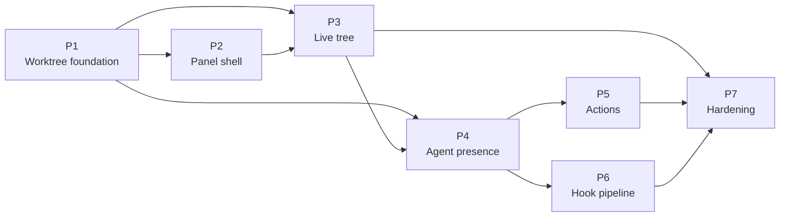

# Implementation Plan — Worktree View & Agent Presence

> **Consumer**: `asimov-plan` — reads one task, reads its linked design doc, scans the codebase, triages a lane, then writes `asimov/changes/<change-id>/`.
> **Rule**: tasks describe WHAT and WHERE, never HOW. No file paths, no function names, no test commands.
> **Status lifecycle**: blueprint writes `todo` → asimov-plan sets `in_progress` after Gate 2 → asimov-build sets `done` after implementation approval.

**Scope**: this plan covers the Worktree view added to the AI Vault panel and the agent
presence it displays. It does not re-baseline the terminal core; `docs/PLAN.v1.md`,
`docs/PLAN.v2.md`, and `docs/PLAN.v3.md` remain the historical record of that work.

## Design References

| Doc | Scope |
|-----|-------|
| [DESIGN.md](DESIGN.md) § 13–15 | Subsystem architecture, decisions, consistency registry |
| [design/worktree-model.md](design/worktree-model.md) | Discovery, identity, path normalization, cache + watch |
| [design/worktree-agent-presence.md](design/worktree-agent-presence.md) | Evidence model, pane mapping, external rows, subagents |
| [design/worktree-rpc.md](design/worktree-rpc.md) | Host↔webview messages, validation, action semantics |
| [design/worktree-panel-ui.md](design/worktree-panel-ui.md) | Fourth segment, tree structure, states, interaction |
| [design/worktree-actions.md](design/worktree-actions.md) | Create, remove, lock, prune, launch, safety model |
| [design/agent-hook-server.md](design/agent-hook-server.md) | Generalizing the existing hook runtime: endpoint, install, state machine |

## Task format

| Field | Meaning |
|-------|---------|
| **Goal** | What this task produces (1-2 sentences) |
| **Design Ref** | Link to the section that specifies it |
| **Depends On** | Task IDs that must land first, or `None` |
| **Size** | Rough appetite (~N days). Not a file list — `asimov-plan` decides scope. |
| **Triage** | Only signals `asimov-plan` cannot see before reading code |
| **Acceptance** | High-level criteria proving the task is done, including its own error and fallback behavior |
| **Status** | todo / in_progress / done |

## Phases Overview

**Staged delivery.** Each stage is independently usable; the plan is sequenced so the daily-use
core lands before the largest and least certain work.

| Stage | Phases | What the user gets |
|-------|--------|--------------------|
| 1 — Navigation core | P1, P2, P3, P4-T1, P5-T1 | "Which worktrees exist, where are my agents, take me there" |
| 2 — Acting on worktrees | P5-T2, P5-T3 | Create a worktree with an agent already running in it |
| 3 — Full presence | P4-T2, P4-T3 | External rows and delegated subagents |
| 4 — Authoritative status | P6 | Real turn state instead of "the terminal is busy" |
| 5 — Hardening | P7 | Cross-cutting invariants and scale |

| Phase | Est. Duration | Key Deliverable |
|-------|--------------|-----------------|
| P1 — Worktree foundation | ~4-5 days | Host can enumerate every worktree of every workspace repo, and knows when that changed |
| P2 — Panel shell | ~4-6 days | Fourth segment renders the tree from fixtures; visual language signed off |
| P3 — Live tree | ~2 days | The shell renders real data without churn, with persisted collapse state |
| P4 — Agent presence | ~8-11 days | Worktree rows show which agents are working inside them, honestly |
| P5 — Actions | ~8-10 days | Navigate, create, remove, lock, prune, and launch agents from the view |
| P6 — Hook pipeline | ~8-11 days | Authoritative turn state and live subagent rosters, on one runtime |
| P7 — Hardening | ~2 days | Cross-cutting invariants pinned as tests; scale verified |

> Estimates were revised upward at the 2026-08-25 peer review. P4 carries a webview→host
> evidence transport that does not exist today; P5 carries a fresh-launch contract the registry
> does not have; P6 carries a generalization plus the migration of a shipped agent onto it.
> Per-task invariant tests moved out of P7 and into the tasks that introduce the behaviour,
> which is why P7 shrinks while the feature phases grow.

---

## Phase 0 — Prerequisites

**Empty, deliberately.** This is a VS Code extension with no backend, no accounts, no secrets,
and an existing release path (`docs/RELEASING.md`) already proven by shipped versions. Every
external dependency the feature needs — the git executable and the built-in `vscode.git`
extension — is either already consumed by the codebase or degrades to a documented empty
state. There is nothing to provision.

---

## Phase 1 — Worktree Foundation

> **Goal**: the host can answer "what worktrees exist, in which repos" correctly and cheaply, and knows when the answer changed. No UI.

### P1-T1: Worktree Discovery & Identity

| Field | Value |
|-------|-------|
| **Goal** | Resolve the workspace's git repositories and enumerate every worktree of each, producing the tree model with stable ids and normalized paths |
| **Design Ref** | [worktree-model.md](design/worktree-model.md) § 2, § 3.1–3.4, § 6 |
| **Depends On** | None |
| **Size** | ~2.5 days |
| **Triage** | `new-dependency` — first direct shelling to `git` from this extension; the git extension API is currently consumed for decorations only |
| **Acceptance** | Multiple workspace repos yield multiple groups in workspace-folder order; a workspace folder that is a linked worktree of an already-listed repo yields one group, not two; the porcelain parse handles detached, bare, locked, and prunable; the `-z` capability falls back once and is remembered, while a git below the documented minimum is reported unsupported rather than silently degraded; paths that differ only by symlink or drive-letter case compare equal; a worktree git flagged prunable whose directory is gone is marked missing, and a locked one is never probed; workspace containment is tested in the direction where a folder opened *inside* a worktree still marks that worktree as in the workspace; ordering is deterministic with an id tie-break, and the presence-derived ranking slot is left empty rather than guessed at; absent git yields an unavailable flag rather than a thrown error; a per-repo listing failure keeps that repo's last good listing and marks it degraded with a reason, without affecting sibling repos |
| **Status** | todo |

### P1-T2: Freshness, Cache & Host Contract

| Field | Value |
|-------|-------|
| **Goal** | Cache the tree per repo, invalidate it from narrowly scoped filesystem and workspace events, and expose it to the webview over the message protocol |
| **Design Ref** | [worktree-model.md](design/worktree-model.md) § 3.5, § 3.6, § 5; [worktree-rpc.md](design/worktree-rpc.md) § 2, § 4 |
| **Depends On** | P1-T1 |
| **Size** | ~2 days |
| **Triage** | `new-api-contract` — adds a message family to the shared protocol union, and requires the shared watcher pool to gain a typed failure outcome it does not have today |
| **Acceptance** | A worktree added or removed on disk produces exactly one rebuild of the affected repo and none of its siblings; a branch switch in either the main or a linked worktree invalidates; sustained writes to the churning files inside a linked worktree's admin directory produce no rebuild at all, which the watch scope must make structurally true rather than filter after the fact; watcher-driven rebuilds are floored at the documented per-repo interval while a forced refresh bypasses it; workspace-folder and repo open/close events invalidate the whole tree, and repository state events supplement the watch for repos VS Code already has open; concurrent tree requests coalesce into one rebuild; the tree is pushed both as a reply and unsolicited, and the webview path handles both identically; a push is broadcast to every live webview surface rather than only the requester, and is skipped for surfaces whose Worktree view is not the active segment; discovery is owned once per window with surfaces attached as clients, so two open surfaces do not double the git and watcher work; the branch-change watch is registered with a change handler, since the pool's simple subscribe path ignores change events; nothing is polled on a timer; a watcher that cannot be created reports that failure to its caller rather than returning an inert subscription, marks the repo degraded with a reason, and leaves refresh-on-show working; a git command exceeding the timeout is killed and treated as a failure that preserves the last good listing |
| **Status** | todo |

---

## Phase 2 — Panel Shell & Visual Language

> **Goal**: the view exists, looks right, and is signed off — before any live data flows into it. This is the design gate.

### P2-T1: Fourth Segment & Static Tree Shell

| Field | Value |
|-------|-------|
| **Goal** | Add the Worktree segment to the vault's segmented control and render the full tree — repo groups, worktree rows, agent rows, subagent rows, and every empty/degraded state — from fixture data |
| **Design Ref** | [worktree-panel-ui.md](design/worktree-panel-ui.md) § 2, § 3, § 5, § 7 |
| **Depends On** | P1-T2 |
| **Size** | ~4-6 days |
| **Triage** | `user-visible-ui` — this is the design gate; acceptance includes user sign-off on the rendered result. The visual reference has been reviewed and its conclusions are recorded in the design doc § 7; this task settles the remaining spacing, tokens, and copy by building and reviewing |
| **Acceptance** | The fourth segment switches the panel body without touching the session grouping path; a persisted view choice wins over the default, and with no persisted choice the view defaults to Worktree only when the workspace has a git repo; a single-repo workspace renders no group header and a multi-repo one renders headers in workspace-folder order; a worktree with no agents renders without a twisty; every state in the design's state table renders its own copy, including the three distinct empty states; no row at any level renders a filesystem path; the worktree row's leading glyph reflects the strongest agent state by the documented precedence; collapsed presence renders the grouped pill with an overflow count and expanded renders the count header plus per-agent rows, with a nine-agent worktree collapsing to the same height as a two-agent one; agent rows truncate preview before title and never truncate the age column or leading icons; rows use theme tokens only, with no hard-coded colours, and state is distinguishable by shape alone; keyboard traversal, expand/collapse, and visible focus work throughout; reduced-motion is honoured. **The rendered shell is reviewed and signed off by the user before Phase 3 begins.** |
| **Status** | todo |

---

## Phase 3 — Live Tree

> **Goal**: real worktrees in the shell, refreshing without destroying the user's place in it.

### P3-T1: Wire Real Data & Persist View State

| Field | Value |
|-------|-------|
| **Goal** | Replace fixtures with the pushed tree, and persist the view choice plus collapse and expansion state across reloads |
| **Design Ref** | [worktree-panel-ui.md](design/worktree-panel-ui.md) § 2.1, § 3, § 8; [worktree-rpc.md](design/worktree-rpc.md) § 2 |
| **Depends On** | P1-T2, P2-T1 |
| **Size** | ~1 day |
| **Triage** | `user-visible-ui` |
| **Acceptance** | The tree renders live worktrees for every workspace repo; the new persisted view key coexists with the existing grouping key and older persisted state remains valid; collapse state survives a reload and a push; expansion state for a worktree that no longer exists is dropped rather than resurrected; a degraded repo renders a stale affordance carrying its reason; search filters branch and path while keeping ancestors of matches visible |
| **Status** | todo |

### P3-T2: Re-render Discipline

| Field | Value |
|-------|-------|
| **Goal** | Ensure a push that changed nothing meaningful does not rebuild the tree DOM, and that animated titles cannot drive re-renders |
| **Design Ref** | [worktree-panel-ui.md](design/worktree-panel-ui.md) § 6.1; [worktree-agent-presence.md](design/worktree-agent-presence.md) § 3.4 |
| **Depends On** | P3-T1 |
| **Size** | ~1 day |
| **Triage** | Risk: this is the difference between a usable panel and one that fights the user. A spinner at animation rate repaints the tree many times per second otherwise |
| **Acceptance** | Decorative title frames are stripped before the render signature is computed, so consecutive spinner frames compare equal; a push whose signature is unchanged performs no DOM work; scroll position, focus, expansion, and any open preview survive an unchanged push; the guard is exercised by a test that pushes a spinner-only title change and asserts zero renders |
| **Status** | todo |

---

## Phase 4 — Agent Presence

> **Goal**: each worktree shows who is working inside it — and never claims more than it can prove.

### P4-T0: Host Evidence Transport

| Field | Value |
|-------|-------|
| **Goal** | Give the extension host a complete, window-wide view of every pane's title and waiting evidence, which today exists only inside individual webviews |
| **Design Ref** | [worktree-agent-presence.md](design/worktree-agent-presence.md) § 3.3 "The host evidence seam"; [DESIGN.md](DESIGN.md) § 13.6 |
| **Depends On** | P1-T2 |
| **Size** | ~2.5 days |
| **Triage** | `new-api-contract`, `cross-boundary` — adds a webview→host direction that does not exist today. Risk: every later presence task consumes this, so an incomplete seam blocks the whole phase. Build and verify it before any row is projected |
| **Acceptance** | Each surface reports its own panes' titles and waiting evidence to the host on change, never on a timer; titles are decoration-stripped in the webview before the message is sent, so a spinner animation produces zero host messages; the host keys evidence by pane id and not by surface, so the same pane reported by two surfaces yields one value and the surfaces agree because the value is normalized; disposing a surface retracts no evidence, since panes outlive the surfaces rendering them, and only session removal clears a pane's evidence; a pane no surface has yet reported is distinguishable from a pane reported as having nothing, so the former falls through to a lower identity rank instead of resolving to "no agent"; the host's own signals — pane lifecycle, cwd, pty exit, output timestamps, and the semantic agent status it already originates — are read at the source rather than round-tripped through a webview; the activity projection rules are shared as pure logic with the existing per-surface tracker so the two cannot disagree about what running means |
| **Status** | todo |

### P4-T1: Window Panes → Worktree Rows

| Field | Value |
|-------|-------|
| **Goal** | Map this window's terminal panes into worktrees and project each into an agent row carrying identity, activity, and the evidence behind both |
| **Design Ref** | [worktree-agent-presence.md](design/worktree-agent-presence.md) § 2, § 3.1–3.4, § 3.7 |
| **Depends On** | P4-T0, P3-T1 |
| **Size** | ~3 days |
| **Triage** | Risk: the evidence model is the feature's credibility. `cross-boundary` — reads session state, activity state, and vault resolution together |
| **Acceptance** | A pane maps to the longest matching worktree on segment boundaries, so a nested worktree and a same-prefix sibling both attribute correctly; symlinked paths match; a pane with no resolvable cwd produces no row; identity follows the documented precedence and uses token-boundary matching, never substring; a spinner-only title sets activity but never identity; a shell title forces idle while a neutral title does not; a pty that exits with its tab still open renders as exited and a closed pane's row disappears entirely; identity confidence and activity confidence are each derived from their own source, so a launch-identified pane with only output evidence is authoritative for one and fallback for the other, and no single collapsed field exists; the row carries the timestamps the UI needs for its age column and the ranking key the tree's ordering consumes; a failed scan retains the previous rows and appends a degradation naming the failing source and its reason, while a source that is genuinely empty appends none; session resolution is memoized and a rebuild issues one process-table read regardless of pane count, which is new machinery rather than existing behaviour; on platforms where the process tree is unavailable, identity degrades to the documented lower ranks rather than failing; tree and presence arrive in one message |
| **Status** | todo |

### P4-T2: External Agent Rows

| Field | Value |
|-------|-------|
| **Goal** | Surface agents running in a worktree from outside this window as labelled, non-focusable rows |
| **Design Ref** | [worktree-agent-presence.md](design/worktree-agent-presence.md) § 3.5 |
| **Depends On** | P4-T1 |
| **Size** | ~1.5 days |
| **Triage** | `user-visible-ui` — introduces a row class with deliberately reduced affordances. The registry reader must gain a typed outcome: it currently maps an unreadable registry to an empty list, which would silently clear every external row |
| **Acceptance** | Live sessions from the machine-wide registry map into worktrees and appear as external rows; headless one-shot runs produce no row anywhere; a session already owned by a window pane produces exactly one row, attributed to the pane; external rows are visibly labelled and expose no focus affordance, offering open-folder, resume-here, and copy-resume-command instead; the scan runs at the documented flat cadence while any surface shows the view and pauses entirely otherwise, with no tiering or jitter machinery; an unreadable registry is distinguishable from an empty one, so the first retains previous rows and appends a degradation while the second clears them and appends none |
| **Status** | todo |

### P4-T3: Subagent Rows

| Field | Value |
|-------|-------|
| **Goal** | On expanding an agent row, show the subagents its session delegated, rendered as history rather than as live workers |
| **Design Ref** | [worktree-agent-presence.md](design/worktree-agent-presence.md) § 3.6; [worktree-panel-ui.md](design/worktree-panel-ui.md) § 3.4 |
| **Depends On** | P4-T1 |
| **Size** | ~1 day |
| **Triage** | Risk: the most tempting place in the feature to overstate what is known |
| **Acceptance** | Subagent rows are fetched only on expansion and only for rows with a resolved session, never on a tree push; every row in this phase carries the not-live flag; the rendering is visibly distinct from the live state-dot vocabulary and labelled as history, and carries no agent icon; nesting is exactly one level regardless of how deeply the source delegated; a subagent row has no pane identity and activating one focuses the parent's pane; when the parent's evidence goes stale every child decays with it in the same pass; per-agent expansion persists independently of worktree collapse; a row with no resolved session expands to an empty list rather than an error; a failed transcript read shows an inline error confined to that row |
| **Status** | todo |

---

## Phase 5 — Actions

> **Goal**: the view becomes a place to act, with a safety model proportional to what each action destroys.

### P5-T1: Navigation & Read-Only Actions

| Field | Value |
|-------|-------|
| **Goal** | Focus a pane, open a session preview, open the worktree folder, reveal it, copy its path, and open a terminal in it |
| **Design Ref** | [worktree-actions.md](design/worktree-actions.md) § 2; [worktree-rpc.md](design/worktree-rpc.md) § 2.1; [worktree-panel-ui.md](design/worktree-panel-ui.md) § 6 |
| **Depends On** | P4-T1 |
| **Size** | ~2 days |
| **Triage** | `user-visible-ui`. Reuse pressure: reveal, copy-path, and copy-resume-command already have host implementations — these are id-resolving wrappers, not new handlers |
| **Acceptance** | Activating a window-scope agent row focuses its pane; activating an external row opens the preview and never attempts focus; preview, resume-here, and copy-resume-command each have their own message rather than being implied by the read-only set; resume-here overrides the session's recorded working directory with the worktree's; opening a worktree as a workspace folder results in one group, not two, on the next rebuild; opening a terminal starts it in the worktree path; every action resolves its path host-side from an id, and an id absent from the current tree is rejected with a refresh rather than acted on; the row-activation behaviour is driven by a documented setting rather than hard-coded; the context menu offers only actions valid for that row's kind and state |
| **Status** | todo |

### P5-T2: Mutating Actions & Safety Model

| Field | Value |
|-------|-------|
| **Goal** | Create, remove, lock, unlock, and prune worktrees, with blockers evaluated by the host and confirmations that name what is at risk |
| **Design Ref** | [worktree-actions.md](design/worktree-actions.md) § 3, § 5, § 6, § 7; [worktree-rpc.md](design/worktree-rpc.md) § 3, § 4 |
| **Depends On** | P5-T1, P4-T2 |
| **Size** | ~4 days |
| **Triage** | `security-privacy` — user-supplied refs and paths reach git; destructive operations. Risk: highest in the feature |
| **Acceptance** | Every git invocation is an argv array and no code path in the feature deletes a file or directory directly; refs and paths are validated before git runs, with leading-dash tokens rejected and the create path required to be absolute, free, and outside every existing worktree of the repo; the create path is treated as untrusted input rather than as a host-issued identifier, is revalidated against a fresh listing after any queue wait, refuses symlinked components, and re-checks its existing ancestor immediately before git runs; the create default path is suffixed on collision and the form shows the final path before submit; the create form supports the post-create modes other than agent launch, which P5-T3 adds, and rejects launch fields attached to any non-launch mode; a clean unlocked worktree with no panes removes without confirmation; a dirty one, one with idle panes, or one with an external agent inside returns every applicable blocker and runs no git command until confirmed; a worktree containing a running or waiting agent is refused outright with no confirmation path offered; a confirmation is bound to the blocker set the user saw, so a blocker that appeared since re-prompts instead of proceeding, while a blocker set that only shrank proceeds; removing a locked worktree after confirmation uses the doubled force flag git actually requires; the main worktree is refused unconditionally, including with force; the confirmation describes force as irrevocable deletion of the path's current contents rather than as a reviewed loss; removal leaves the branch intact and leaves panes alive, and the confirmation says both; prune is offered only when something is prunable and its confirmation names the count; git's own stderr is what the user sees, bounded; mutating actions on one repo serialize; every attempt forces a rebuild — on success, on failure, and on timeout — and a state where git's registration and the filesystem disagree is reported as indeterminate naming what was observed, never as a clean failure; there is no retry of any partially-applied mutation |
| **Status** | todo |

### P5-T3: Launch an Agent into a Worktree

| Field | Value |
|-------|-------|
| **Goal** | Start an agent — optionally with a seed prompt and a chosen permission posture — in a worktree, resume an existing session there, and offer the same launch as a post-create step in the create form |
| **Design Ref** | [worktree-actions.md](design/worktree-actions.md) § 3.2, § 4 |
| **Depends On** | P5-T1, P5-T2 |
| **Size** | ~3 days |
| **Triage** | `new-api-contract`. The registry has resume, fork, and continue — all of which start from an existing session — so a *fresh launch* contract must be added, not merely reused. `continue` also requires a prompt where this view allows none |
| **Acceptance** | The registry gains a declared start capability covering the argv for a brand-new session with an optional prompt, whether the agent supports native prefill, how readiness is detected for agents needing the pty-write path, and how a working-directory override composes with the resume family; no caller assembles a start command itself, and an agent declaring no start capability is simply not offered here; only agents whose executable resolves are offered; permission postures come from the registry, a dangerous one is labelled and never preselected; the session is created with the worktree as its working directory and flagged as an agent launch; launching with no prompt succeeds and uses no template that requires one; a seed prompt uses native prefill where one exists, and where the prompt must be written to the pty the submit is a separate write after the composer is provably ready — never text and Enter in one write; resume-into-worktree reuses the existing resume command with the working directory overridden; launching into a missing or bare worktree is not offered; a second launch into a worktree that already has a running agent is allowed; the create form gains the agent post-create mode, which runs after the create succeeds through this same launch path, and a launch that fails after a successful create is reported as created-but-not-started with no rollback of the worktree |
| **Status** | todo |

---

## Phase 6 — Agent Hook Pipeline

> **Goal**: replace inference with declaration, upgrading presence from "the terminal is busy" to "this agent is waiting on a permission decision, with two subagents working".
>
> **This phase generalizes the hook stack the extension already ships for one agent.** It does not build a second one. Two runtimes disagreeing about enablement, token authority, or disposal would be worse than either alone, so the migration of the existing agent onto the shared runtime is part of the phase, not a follow-up.

### P6-T1: Generalize the Hook Runtime

| Field | Value |
|-------|-------|
| **Goal** | Widen the existing single-agent loopback hook runtime and its env-contributor seam to serve several agents, and migrate the agent already using it onto the generalized form |
| **Design Ref** | [agent-hook-server.md](design/agent-hook-server.md) § 2, § 4.1, § 4.2, § 5, § 7 |
| **Depends On** | P4-T1 |
| **Size** | ~3 days |
| **Triage** | `security-privacy`, `re-review` — changes a shipped security-relevant component rather than adding a new one. Reuse pressure is the point of the task: a new listener beside the existing one is the failure mode |
| **Acceptance** | One runtime serves every hook-capable agent, with no second listener or second controller anywhere in the extension; the session-environment seam accepts contributions from several agents rather than a single slot, and enabling two agents at once has neither displacing the other; the existing agent's hook behaviour is unchanged from the user's perspective and its existing tests pass against the generalized runtime; tokens remain per-session, constant-time compared, re-validated against live registration at use time, and invalidated on pane teardown and on disable, so another pane's token is rejected even when it was valid when minted; the endpoint stays loopback-only on an ephemeral port, accepts POST only, always responds success, and caps the request body; an unauthenticated or malformed request changes no state and raises no user-facing error; spawned terminals receive their coordinates as a single environment value so a partial set cannot be inherited, and that environment is the only distribution channel — no shared on-disk artifact is written anywhere; with two windows open, a pane's events reach the window that spawned it and never the other; a bind failure disables the feature for the session and leaves every pane rendering via inference; the documentation and tests state plainly that the trust boundary is the pane rather than the agent, since same-pane child processes inherit the coordinates |
| **Status** | todo |

### P6-T2: Claude Hook Installation

| Field | Value |
|-------|-------|
| **Goal** | Extend the existing managed-config installer to a second agent, and own the reconciliation the extension does not do today |
| **Design Ref** | [agent-hook-server.md](design/agent-hook-server.md) § 4.3, § 4.7, § 6, § 7 |
| **Depends On** | P6-T1 |
| **Size** | ~2.5 days |
| **Triage** | `security-privacy` — writes into a user-owned configuration file and registers an executable path. The lock, atomic rename, and typed failure reasons already exist and must be reused rather than reimplemented |
| **Acceptance** | Installation is gated behind a per-agent setting that is off by default, and the setting the existing agent already uses keeps its value rather than being silently reset by the generalization; the read-merge-write sequence runs under the existing cross-process lock with its stale-lock timeout, so a concurrent edit from another window, the agent CLI, or the user's editor cannot be lost, and a held fresh lock reports its typed reason rather than forcing; the write lands via same-directory temp plus atomic rename with the mode preserved, and a symlinked destination is refused rather than followed; installing twice yields one managed entry; pre-existing user hooks and unknown top-level keys survive install and uninstall unchanged; an uninstall command removes every managed entry for every agent regardless of what the settings say; the registered script path is absolute, and activation reconciles a path left behind by a previous extension version so an update cannot leave the user's config pointing at a script that no longer exists; the managed config root honours the documented override and the agent's own environment variable; the script guards against the background-job environment that would misattribute events, exits silently when no coordinates are present in its environment so an agent started outside this window makes no status claim, and bounds its own connect and total time; an unwritable configuration fails with a typed reason and a clear message and affects nothing else |
| **Status** | todo |

### P6-T3: Turn State & Presence Upgrade

| Field | Value |
|-------|-------|
| **Goal** | Fold hook events into per-pane turn state and live subagent rosters, and let a fresh status supersede inferred activity |
| **Design Ref** | [agent-hook-server.md](design/agent-hook-server.md) § 3, § 4.4–4.6; [worktree-agent-presence.md](design/worktree-agent-presence.md) § 3.3, § 3.6 |
| **Depends On** | P6-T2, P4-T3 |
| **Size** | ~3 days |
| **Triage** | Risk: this is where a status pipeline starts lying if the guards are omitted |
| **Acceptance** | The documented event-to-state mapping holds, with the ask-user tool decided by tool name rather than event name; every turn state maps to exactly one activity per the documented table and no state exists that no event can produce; a session-start event lands as a boundary that wipes stale rosters and is never counted as a completed turn; an interrupted stop is marked as such; a lead completion is held while any roster child still works; a subagent stop for an unknown child makes no state claim while a startless subagent start proves activity; the interactive prompt is never inherited by the following event; a fresh status supersedes inferred activity as authoritative and turns the roster into live subagent rows; a stale status degrades to identity-only with the prompt cleared, using the documented staleness window; a pty exit overrides any published state; a shell title reclaiming the pane forces completion even against a published working state; nothing is carried across a window reload, since the process that published it is gone and the pane returns to inference; pane teardown clears its status, roster, and token on every teardown path; a reported session identity is used only to look up an existing vault entry and never to synthesize one, and a reported transcript path is compared against the store rather than opened on the report's authority, with the existing resolution retained as the fallback for panes without hook evidence |
| **Status** | todo |

---

## Phase 7 — Hardening

> **Goal**: only what cannot be scoped to a single feature task.
>
> **Invariant tests belong to the task that introduces the behaviour**, not here. A truthfulness rule verified only at the end lets four phases build on an unverified evidence model; each task's acceptance above therefore carries its own invariant coverage. What remains for this phase is genuinely cross-layer: end-to-end integration and scale.

### P7-T1: Cross-Layer Integration & Scale

| Field | Value |
|-------|-------|
| **Goal** | Verify the invariants that span layers and that no single task could have proven, and that the view holds up at realistic worktree and pane counts |
| **Design Ref** | [DESIGN.md](DESIGN.md) § 13.4; [worktree-agent-presence.md](design/worktree-agent-presence.md) § 7; [worktree-model.md](design/worktree-model.md) § 7 |
| **Depends On** | P3-T2, P5-T2, P5-T3, P6-T3 |
| **Size** | ~2 days |
| **Triage** | `re-review` — cross-layer verification cannot live inside any single feature task |
| **Acceptance** | Every invariant in DESIGN.md § 13.4 is covered by at least one test that fails when violated, and each is traceable to the task that owns it, with this task covering only the ones no single task could prove; a tree rebuild for a repo with ten worktrees stays within the documented latency budget and issues one git invocation per affected repo; a presence rebuild with ten panes issues one process-table read; a burst of watcher events collapses into one rebuild per repo and a sustained stream is held to the documented floor; an agent working continuously inside a linked worktree drives no measurable steady-state rebuild or render load; two open webview surfaces do not double the git, watcher, or registry work; a repo whose worktree count exceeds the render budget caps with a show-all affordance rather than truncating silently; no source failure in any layer can downgrade a row rather than marking the scope degraded with a reason |
| **Status** | todo |

---

## Deferred

- ~~Dirty / ahead-behind status per worktree row~~ — deferred. The git extension only exposes state for repositories open in the workspace, so unopened worktrees would need their own status invocation per row on every rebuild. Branch and head come free from the listing; dirty state is computed on demand for the removal safety check only.
- ~~Tree virtualization~~ — deferred per DESIGN.md § 14 D14. Worktree counts are tens; a documented cap beats premature machinery.
- ~~Group-by / sort-by / visibility filters~~ — deferred. The reference offers a filter popover (hide sleeping, hide default branch, hide automation-created); ordering here is deterministic and the counts are tens, so filters are a response to scale this view does not yet have.
- ~~Issue-tracker and forge integration in the create form~~ — deferred. The reference creates worktrees from GitHub / Jira / PR references; that is a separate product surface, not a worktree concern.
- ~~Answering questions and approving permissions from the panel~~ — deferred. Requires the hook pipeline plus paced keystroke delivery and baseline-revalidated answer inference; a separate feature with its own risk surface.
- ~~Codex and OpenCode hook installers~~ — deferred. The endpoint and state machine accommodate them without a rewrite; Claude alone proves the pipeline.
- ~~Completion notifications~~ — deferred. Needs quiet windows, burst cooldown, and reconstructable ids to avoid false alarms; out of scope for a navigation view.
- ~~Process-recognition table for non-Claude running detection~~ — deferred. Until it lands, Codex and OpenCode panes resolve identity by title or not at all, which the UI states rather than hides.
- ~~Cross-window agent focus~~ — not planned. External rows are labelled and non-focusable by design (DESIGN.md § 14 D6).
- ~~Filtering the launch environment~~ — deferred to its own change, per DESIGN.md § 14 D24. Agent launches currently inherit the extension host's entire `process.env`, including credentials, because the agent allowlist merges over that clone rather than replacing it. This predates the feature and affects every vault launch; fixing it inside a worktree change would bury a security change in an unrelated diff. Recorded in DESIGN.md § 13.5 so it is not mistaken for a property the feature provides.
- ~~Per-launch `--settings` hook injection~~ — considered and rejected at the 2026-08-25 triage. It would avoid writing to the user's agent config, but it duplicates a registration seam the extension already owns, loses coverage for agents the user starts by hand in an AT terminal, and the reference implementation explicitly tests that it does *not* take this route. Revisit only if config writes prove problematic in practice.

---

> **Sync rules**:
> - Every edge in the Phases Overview corresponds to at least one task's `Depends On`, and every cross-phase `Depends On` appears as an edge.
> - Task goal/acceptance text must not reference concepts that were changed or removed in the design docs.
