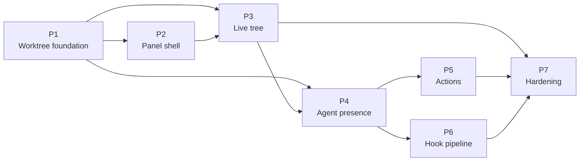

# Implementation Plan — Worktree View & Agent Presence

> **Consumer**: `asimov-plan` — reads one task, reads its linked design doc, scans the codebase, triages a lane, then writes `asimov/changes/<change-id>/`.
> **Rule**: tasks describe WHAT and WHERE, never HOW. No source-file paths, no function names, no test commands. (Design Ref links to `docs/` are the WHERE, and are required.)
> **Status lifecycle**: blueprint writes `todo` → asimov-plan sets `in_progress` after Gate 2 → asimov-build sets `done` after implementation approval.

**Scope**: this plan covers the Worktree view added to the AI Vault panel and the agent
presence it displays. It does not re-baseline the terminal core; `docs/PLAN.v1.md`,
`docs/PLAN.v2.md`, and `docs/PLAN.v3.md` remain the historical record of that work.

## Sync contract

Task heading is `### [WT-<NNN>.<M>]` — epic code, three-digit phase number, task number. The ID is
the tracker sync key: it goes in the issue title and never changes once an issue exists, even when
the task moves phase. This plan stays two levels; `WT-001.1.1` is reserved for sub-issues split
downstream, and the sync ignores deeper IDs.

| Field | Type | Notes |
|-------|------|-------|
| **Epic** | code | Carried by the ID prefix; one per plan. `WT` here |
| **Goal** | 1–2 sentences | What this task produces |
| **Design Ref** | links | The section that specifies it |
| **Depends On** | ID list | Comma-separated, or `None`. Becomes `blocked-by` |
| **Stage** | 1–5 | Ship order — what the user can do once it lands. Cuts across phases. Becomes the GitHub milestone |
| **Size** | XS / S / M / L / XL | Complexity + review load, not duration. XS: one concern, no contract change. S: one concern with its own tests/edge cases. M: feature slice across a few modules, or one new contract. L: cross-boundary, security-sensitive, or a heavy acceptance list. XL: split it unless genuinely irreducible |
| **Labels** | slug list | `new-api-contract`, `data-migration`, `security-privacy`, `infra`, `new-dependency`, `cross-boundary`, `user-visible-ui`, `re-review`. Or `None` |
| **Notes** | optional | Risk or reuse signal `asimov-plan` cannot see before reading code. Omit when nothing applies |
| **Acceptance** | `; `-separated | Observable outcomes only — the mechanism lives in the design doc. Each item becomes one checklist entry on the issue |
| **Status** | todo / in_progress / done | |

Phase = build order; Stage = ship order; `Depends On` is the only structural relation;
`Stage(task) ≥ Stage(dep)`. Phase `Est.` is the reviewed range for the phase, not the sum of its
task sizes — sizes carry no duration at all.

## Design References

| Doc | Scope |
|-----|-------|
| [DESIGN.md](DESIGN.md) § 13–15 | Subsystem architecture, decisions, consistency registry |
| [design/worktree-model.md](design/worktree-model.md) | Discovery, identity, path normalization, cache + watch |
| [design/worktree-agent-presence.md](design/worktree-agent-presence.md) | Evidence model, pane mapping, external rows, subagents |
| [design/worktree-rpc.md](design/worktree-rpc.md) | Host↔webview messages, validation, action semantics |
| [design/worktree-panel-ui.md](design/worktree-panel-ui.md) | Fourth segment, tree structure, states, interaction |
| [design/worktree-actions.md](design/worktree-actions.md) | Create, remove, lock, prune, launch, safety model |
| [design/agent-hook-server.md](design/agent-hook-server.md) | Generalizing the existing hook runtime: endpoint, install, state machine |

## Phases Overview

Phases are the **build order** — what must exist before the next thing can be built. Stages
are the **ship order** — what a user can do once it lands. They cut across each other: P4 spans
Stages 1–3 and P5 spans Stages 1–2. Neither is a parent of the other; the only structural
relation between tasks is `Depends On`.

| Phase | Est. | Key Deliverable |
|-------|------|-----------------|
| P1 — Worktree foundation | ~4-5d | Host can enumerate every worktree of every workspace repo, and knows when that changed |
| P2 — Panel shell | ~5-7d | Visual language designed and signed off, then rendered from fixtures |
| P3 — Live tree | ~2d | The shell renders real data without churn, with persisted collapse state |
| P4 — Agent presence | ~8-11d | Worktree rows show which agents are working inside them, honestly |
| P5 — Actions | ~8-10d | Navigate, create, remove, lock, prune, and launch agents from the view |
| P6 — Hook pipeline | ~8-11d | Authoritative turn state and live subagent rosters, on one runtime |
| P7 — Hardening | ~2d | Cross-cutting invariants pinned as tests; scale verified |

<!-- "What the user gets" becomes the milestone title: "Stage <N> — <text>" -->

| Stage | What the user gets |
|-------|--------------------|
| 1 | Which worktrees exist, where the agents are, and how to get there |
| 2 | Create a worktree with an agent already running in it |
| 3 | Delegated subagents visible as history |
| 4 | Real turn state instead of a busy-looking terminal |
| 5 | Cross-cutting invariants and scale |

> Estimates were revised upward at the 2026-08-25 peer review. P4 carries a webview→host
> evidence transport that does not exist today; P5 carries a fresh-launch contract the registry
> does not have; P6 carries a generalization plus the migration of a shipped agent onto it.
> Per-task invariant tests moved out of P7 and into the tasks that introduce the behaviour,
> which is why P7 shrinks while the feature phases grow.

---

## Phase 0 — Prerequisites

**Empty, deliberately.** This is a VS Code extension with no backend, no accounts, no secrets,
and an existing release path (`docs/RELEASING.md`) already proven by shipped versions. Every
external dependency the feature needs — the git executable and the built-in `vscode.git`
extension — is either already consumed by the codebase or degrades to a documented empty
state. There is nothing to provision.

---

## Phase 1 — Worktree Foundation

> **Goal**: the host can answer "what worktrees exist, in which repos" correctly and cheaply, and knows when the answer changed. No UI.

### [WT-001.1] Worktree Discovery & Identity

| Field | Value |
|-------|-------|
| **Goal** | Resolve the workspace's git repositories and enumerate every worktree of each, producing the tree model with stable ids and normalized paths |
| **Design Ref** | [worktree-model.md](design/worktree-model.md) § 2, § 3.1–3.4, § 6 |
| **Depends On** | None |
| **Stage** | 1 |
| **Size** | M |
| **Labels** | new-dependency |
| **Notes** | First *structured* git read from this extension (`src/providers/gitIgnoreChecker.ts` already spawns `git check-ignore`); the git extension API was previously consumed for decorations only |
| **Acceptance** | Every worktree of every workspace repo is enumerated exactly once, with repos deduped by their shared git directory and grouped in workspace-folder order; a worktree's identity survives symlink and drive-letter differences, so one directory named two ways is one worktree; the state git reports — main, bare, detached, locked, prunable, missing — is carried through rather than inferred; ordering is deterministic and independent of filesystem enumeration order; an unusable git, or a listing that fails for one repo, degrades that scope with a reason instead of emptying it or throwing |
| **Status** | done |

### [WT-001.2] Freshness, Cache & Host Contract

| Field | Value |
|-------|-------|
| **Goal** | Cache the tree per repo, invalidate it from narrowly scoped filesystem and workspace events, and expose it to the webview over the message protocol |
| **Design Ref** | [worktree-model.md](design/worktree-model.md) § 3.5, § 3.6, § 5; [worktree-rpc.md](design/worktree-rpc.md) § 2, § 4 |
| **Depends On** | WT-001.1 |
| **Stage** | 1 |
| **Size** | M |
| **Labels** | new-api-contract |
| **Notes** | Adds a message family to the shared protocol union, and requires the shared watcher pool to gain a typed failure outcome it does not have today |
| **Acceptance** | The tree is rebuilt only when something structural changed, once per affected repo, and never on a timer; an agent working inside a worktree drives no rebuild; every live surface receives the same tree, and a surface not showing the view is skipped; freshness is owned once per window, so a second surface adds no git or watcher work; a watcher or command that fails leaves the repo degraded with a reason and its last good listing intact, never silently stale |
| **Status** | done |

---

## Phase 2 — Panel Shell & Visual Language

> **Goal**: the view exists, looks right, and is signed off — before any live data flows into it. This is the design gate.

### [WT-002.0] Visual Design Pass

| Field | Value |
|-------|-------|
| **Goal** | Produce an approved visual specification for the tree — density, state vocabulary, row anatomy, and empty-state copy — as a throwaway mockup rather than by building the panel |
| **Design Ref** | [worktree-panel-ui.md](design/worktree-panel-ui.md) § 3, § 7 |
| **Depends On** | None |
| **Stage** | 1 |
| **Size** | S |
| **Labels** | user-visible-ui |
| **Notes** | Iterating a mockup is far cheaper than rebuilding the webview. The mockup is disposable — it produces a spec, not code to reuse. Runs in parallel with Phase 1. Delivered as [docs/ui/worktree.html](ui/worktree.html), a standalone reviewable page authored with Claude Design; WT-002.1 reads it as the visual reference, and [worktree-panel-ui.md](design/worktree-panel-ui.md) § 7.7 records where the two disagreed |
| **Acceptance** | The mockup covers every row kind and every state the design names, at sidebar width; where the mockup and the design doc disagree the disagreement is reported rather than silently resolved, and the resolution is recorded; the values § 7.6 assigns to the shell task are deliberately left open here, not guessed in prose |
| **Status** | done |

### [WT-002.1] Fourth Segment & Static Tree Shell

| Field | Value |
|-------|-------|
| **Goal** | Add the Worktree segment to the vault's segmented control and render every surface the view owns — repo groups, worktree rows, agent rows, subagent rows, each empty and degraded state, the row context menus, and the create and remove dialogs — from fixture data, with no host protocol behind any of it |
| **Design Ref** | [worktree-panel-ui.md](design/worktree-panel-ui.md) § 2, § 3, § 5, § 6, § 7; [worktree-actions.md](design/worktree-actions.md) § 3, § 5 |
| **Depends On** | WT-001.1 |
| **Stage** | 1 |
| **Size** | XL |
| **Labels** | user-visible-ui |
| **Notes** | Irreducible despite the size: the visual vocabulary has to be settled in one pass, because spacing, emphasis steps, and state shapes are only judgeable against each other. Depends on the tree model's shape, not on its transport — fixtures typed against the real model make WT-003.1 a change of producer rather than a rewrite. This is the design gate; acceptance includes user sign-off on the rendered result. This task settles the spacing, tokens, indicator, and empty-state copy that § 7.6 leaves to it. Every action surface here is inert by construction — a dialog that renders is not an action that runs, and no menu item may reach a host operation |
| **Acceptance** | The Worktree segment swaps the panel body without disturbing the existing session views or their persisted state; every row kind and state in the approved design renders from fixtures, including each distinct empty state, both dialogs, and the refusal that offers no confirmation at all; the vocabulary holds at sidebar width — state is legible by shape alone, presence collapses to a fixed height regardless of agent count, and no row exposes a filesystem path; keyboard traversal follows the declared tree hierarchy and focus survives every disclosure toggle, with focus visibility and reduced motion working throughout; no control in the view reaches a host operation, and one that cannot yet act is absent rather than present and inert; the rendered shell matches the WT-002.0 spec and is signed off by the user before Phase 3 begins |
| **Status** | done |

---

## Phase 3 — Live Tree

> **Goal**: real worktrees in the shell, refreshing without destroying the user's place in it.

### [WT-003.1] Wire Real Data & Persist View State

| Field | Value |
|-------|-------|
| **Goal** | Replace fixtures with the pushed tree, and persist the view choice plus collapse and expansion state across reloads |
| **Design Ref** | [worktree-panel-ui.md](design/worktree-panel-ui.md) § 2.1, § 3, § 8; [worktree-rpc.md](design/worktree-rpc.md) § 2 |
| **Depends On** | WT-001.2, WT-002.1 |
| **Stage** | 1 |
| **Size** | S |
| **Labels** | user-visible-ui |
| **Notes** | The view already renders this from fixtures (WT-002.1); what this task adds is the evidence that makes the claim true, not the pixels. The shell already persists the three keys and prunes ids that vanished; what it deliberately does not do is choose the opening view from repo presence, because it has no repo knowledge — that rule (§ 2.2) lands here |
| **Acceptance** | The shell renders the live tree, and view, collapse, and expansion state survive a reload; an absent persisted view opens on the worktree body when the workspace has a git repo and on sessions when it has none, while any persisted choice wins over both; state written by an older build stays valid, and a persisted set that is empty means everything is expanded rather than nothing was ever saved; worktrees that disappear drop out of persisted state rather than resurfacing |
| **Status** | done |

### [WT-003.2] Re-render Discipline

| Field | Value |
|-------|-------|
| **Goal** | Ensure a push that changed nothing meaningful does not rebuild the tree DOM, and that animated titles cannot drive re-renders |
| **Design Ref** | [worktree-panel-ui.md](design/worktree-panel-ui.md) § 6.1; [worktree-agent-presence.md](design/worktree-agent-presence.md) § 3.4 |
| **Depends On** | WT-003.1 |
| **Stage** | 1 |
| **Size** | XS |
| **Labels** | None |
| **Notes** | Risk: this is the difference between a usable panel and one that fights the user. A spinner at animation rate repaints the tree many times per second otherwise. The shell already carries a render signature over the fixture shapes; this task's work is proving it covers every input the live data can move, since a field omitted from the key renders stale forever |
| **Acceptance** | A push that changed nothing meaningful performs no DOM work, so scroll, focus, and expansion survive it; animated titles cannot drive re-renders, and a continuously working agent produces no steady-state render load |
| **Status** | done |

---

## Phase 4 — Agent Presence

> **Goal**: each worktree shows who is working inside it — and never claims more than it can prove.

### [WT-004.0] Host Evidence Transport

| Field | Value |
|-------|-------|
| **Goal** | Give the extension host a complete, window-wide view of every pane's title and waiting evidence, which today exists only inside individual webviews |
| **Design Ref** | [worktree-agent-presence.md](design/worktree-agent-presence.md) § 3.3 "The host evidence seam"; [DESIGN.md](DESIGN.md) § 13.6 |
| **Depends On** | WT-001.2 |
| **Stage** | 1 |
| **Size** | L |
| **Labels** | new-api-contract, cross-boundary |
| **Notes** | Adds a webview→host direction that does not exist today. Risk: every later presence task consumes this, so an incomplete seam blocks the whole phase. Build and verify it before any row is projected |
| **Acceptance** | The host holds a complete, window-wide view of pane title and waiting evidence, updated on change rather than polled; evidence is keyed by pane, so surfaces reporting the same pane agree and a surface closing retracts nothing; unreported evidence is distinguishable from evidence proving absence; the worktree row and the terminal tab derive running from the same rules and cannot disagree |
| **Status** | todo |

### [WT-004.1] Window Panes → Worktree Rows

| Field | Value |
|-------|-------|
| **Goal** | Map this window's terminal panes into worktrees and project each into an agent row carrying identity, activity, and the evidence behind both |
| **Design Ref** | [worktree-agent-presence.md](design/worktree-agent-presence.md) § 2, § 3.1–3.4, § 3.7 |
| **Depends On** | WT-004.0, WT-003.1 |
| **Stage** | 1 |
| **Size** | L |
| **Labels** | cross-boundary |
| **Notes** | Risk: the evidence model is the feature's credibility. Reads session state, activity state, and vault resolution together. Four tasks depend directly on this one |
| **Acceptance** | Each pane attributes to exactly one worktree, correctly for nested and same-prefix siblings; identity is claimed only when proven, by the documented precedence, and never from a spinner or a substring match; identity and activity are qualified independently, so a row can be certain of one and uncertain of the other; a pane's lifecycle is reflected without a closed pane leaving a row behind; a failed source degrades the scope with a reason and never rewrites a live row to idle; presence and tree arrive together, and a rebuild costs one process-table read regardless of pane count |
| **Status** | todo |

### [WT-004.2] External Agent Rows

| Field | Value |
|-------|-------|
| **Goal** | Surface agents running in a worktree from outside this window as labelled, non-focusable rows |
| **Design Ref** | [worktree-agent-presence.md](design/worktree-agent-presence.md) § 3.5 |
| **Depends On** | WT-004.1 |
| **Stage** | 2 |
| **Size** | M |
| **Labels** | user-visible-ui |
| **Notes** | Introduces a row class with deliberately reduced affordances. The registry reader must gain a typed outcome: it currently maps an unreadable registry to an empty list, which would silently clear every external row. The view already renders this from fixtures (WT-002.1); what this task adds is the evidence that makes the claim true, not the pixels. The external row's label and its missing focus affordance are already drawn |
| **Acceptance** | Agents running in a worktree from outside this window appear, labelled, and are never offered focus; a session owned by a window pane is never duplicated as an external row, and headless runs produce none; the scan runs only while the view is visible; an unreadable registry is distinguishable from an empty one and never silently clears the rows |
| **Status** | todo |

### [WT-004.3] Subagent Rows

| Field | Value |
|-------|-------|
| **Goal** | On expanding an agent row, show the subagents its session delegated, rendered as history rather than as live workers |
| **Design Ref** | [worktree-agent-presence.md](design/worktree-agent-presence.md) § 3.6; [worktree-panel-ui.md](design/worktree-panel-ui.md) § 3.4 |
| **Depends On** | WT-004.1 |
| **Stage** | 3 |
| **Size** | S |
| **Labels** | None |
| **Notes** | Risk: the most tempting place in the feature to overstate what is known. The view already renders this from fixtures (WT-002.1); what this task adds is the evidence that makes the claim true, not the pixels. The historical treatment and its section label exist; the lazy read on expansion does not |
| **Acceptance** | Subagents are read lazily on expansion, never on a tree push; they render as history, visibly distinct from live agents, exactly one level deep; a subagent has no pane of its own, and its freshness is its parent's; a row with nothing to show, or a read that fails, stays confined to that row |
| **Status** | todo |

---

## Phase 5 — Actions

> **Goal**: the view becomes a place to act, with a safety model proportional to what each action destroys.

### [WT-005.1] Navigation & Read-Only Actions

| Field | Value |
|-------|-------|
| **Goal** | Focus a pane, open a session preview, open the worktree folder, reveal it, copy its path, and open a terminal in it |
| **Design Ref** | [worktree-actions.md](design/worktree-actions.md) § 2; [worktree-rpc.md](design/worktree-rpc.md) § 2.1; [worktree-panel-ui.md](design/worktree-panel-ui.md) § 6 |
| **Depends On** | WT-004.1 |
| **Stage** | 1 |
| **Size** | M |
| **Labels** | user-visible-ui |
| **Notes** | Reuse pressure: reveal, copy-path, and copy-resume-command already have host implementations — these are id-resolving wrappers, not new handlers. The view already renders this from fixtures (WT-002.1); what this task adds is the evidence that makes the claim true, not the pixels. Both context menus exist with their item sets and omissions; every item currently reaches nothing. Second reuse signal: this view's menu duplicates the vault menu's whole lifecycle — construction, placement, dismissal, focus — and the two have already drifted; extracting the shared shell belongs here rather than growing a third copy |
| **Acceptance** | Each row's activation does the one thing that row can do, with external rows never offered focus; actions resolve their target host-side from an id, so nothing runs against a path the webview supplied or an id that has gone stale; opening a worktree as a folder leaves the tree with one group, not two; row activation is configurable rather than hard-coded |
| **Status** | todo |

### [WT-005.2] Mutating Actions & Safety Model

| Field | Value |
|-------|-------|
| **Goal** | Create, remove, lock, unlock, and prune worktrees, with blockers evaluated by the host and confirmations that name what is at risk |
| **Design Ref** | [worktree-actions.md](design/worktree-actions.md) § 3, § 5, § 6, § 7; [worktree-rpc.md](design/worktree-rpc.md) § 3, § 4 |
| **Depends On** | WT-005.1, WT-004.2 |
| **Stage** | 2 |
| **Size** | L |
| **Labels** | security-privacy |
| **Notes** | User-supplied refs and paths reach git; destructive operations. Risk: highest in the feature. The view already renders this from fixtures (WT-002.1); what this task adds is the evidence that makes the claim true, not the pixels. Both dialogs render — the blocker list, the fingerprint the confirmation carries, and the refusal that has no confirm button in it — but every blocker they show is fixture-derived, so nothing here has been evaluated by anything. The safety semantics are reviewed in THIS task, not in the one that drew them. The create form also states a resolved destination only when given one, so the host must supply the free path it will actually take. Reuse signal: the dialog shell duplicates the vault continuation dialog's focus trap and disposal. Registers the two `anywhereTerminal.worktree.*` settings keys, which no manifest declares yet |
| **Acceptance** | No user-supplied ref or path reaches git as anything but a literal token, and a create path is revalidated immediately before use; the suggested create path follows the repo's own worktree layout when it has one and an explicit setting whenever the user stated one, falling back to the documented default only when neither exists, and a root inside the main worktree leaves the parent's `git status` clean without touching a tracked file; a destructive action names every applicable blocker before running, and a confirmation authorizes exactly the blocker set the user saw and no more; the main worktree, and any worktree holding a working agent, are refused outright with no confirmation path; what removal destroys and what it leaves alone is stated before it runs and true afterwards; every attempt leaves the tree reflecting reality, reporting indeterminate rather than clean failure when git and the filesystem disagree, and nothing partially applied is retried |
| **Status** | todo |

### [WT-005.3] Launch an Agent into a Worktree

| Field | Value |
|-------|-------|
| **Goal** | Start an agent — optionally with a seed prompt and a chosen permission posture — in a worktree, resume an existing session there, and offer the same launch as a post-create step in the create form |
| **Design Ref** | [worktree-actions.md](design/worktree-actions.md) § 3.2, § 4 |
| **Depends On** | WT-005.1, WT-005.2 |
| **Stage** | 2 |
| **Size** | M |
| **Labels** | new-api-contract |
| **Notes** | The registry has resume, fork, and continue — all of which start from an existing session — so a fresh-launch contract must be added, not merely reused. `continue` also requires a prompt where this view allows none. The view already renders this from fixtures (WT-002.1); what this task adds is the evidence that makes the claim true, not the pixels. The create form's agent picker, permission postures, and seed-prompt field are drawn, with the dangerous posture offered but never preselected; which agents the list may contain is a host answer this task supplies |
| **Acceptance** | Starting a fresh session is a declared registry capability, so an agent that cannot start one is simply not offered; a launch runs in the chosen worktree, with a permission posture the user picked and a dangerous one never preselected; a seeded prompt arrives submitted, never left editable and never through a shell string; create-then-launch is the same path as a standalone launch, and a failed launch leaves the created worktree in place |
| **Status** | todo |

---

## Phase 6 — Agent Hook Pipeline

> **Goal**: replace inference with declaration, upgrading presence from "the terminal is busy" to "this agent is waiting on a permission decision, with two subagents working".
>
> **This phase generalizes the hook stack the extension already ships for one agent.** It does not build a second one. Two runtimes disagreeing about enablement, token authority, or disposal would be worse than either alone, so the migration of the existing agent onto the shared runtime is part of the phase, not a follow-up.

### [WT-006.1] Generalize the Hook Runtime

| Field | Value |
|-------|-------|
| **Goal** | Widen the existing single-agent loopback hook runtime and its env-contributor seam to serve several agents, and migrate the agent already using it onto the generalized form |
| **Design Ref** | [agent-hook-server.md](design/agent-hook-server.md) § 2, § 4.1, § 4.2, § 5, § 7 |
| **Depends On** | WT-004.1 |
| **Stage** | 4 |
| **Size** | L |
| **Labels** | security-privacy, re-review |
| **Notes** | Changes a shipped security-relevant component rather than adding a new one. Reuse pressure is the point of the task: a new listener beside the existing one is the failure mode |
| **Acceptance** | One runtime serves every hook-capable agent, with the agent already shipping on it migrated and behaviourally unchanged; a token is bound to its pane and stops working the moment that pane or the feature does; the endpoint is unreachable off-host and cannot be made to change state, error, or stall the agent by any malformed request; coordinates reach a pane only through its own environment, whole or not at all, with nothing written to disk; a runtime that cannot start leaves every pane on inference |
| **Status** | todo |

### [WT-006.2] Claude Hook Installation

| Field | Value |
|-------|-------|
| **Goal** | Extend the existing managed-config installer to a second agent, and own the reconciliation the extension does not do today |
| **Design Ref** | [agent-hook-server.md](design/agent-hook-server.md) § 4.3, § 4.7, § 6, § 7 |
| **Depends On** | WT-006.1 |
| **Stage** | 4 |
| **Size** | L |
| **Labels** | security-privacy |
| **Notes** | Writes into a user-owned configuration file and registers an executable path. The lock, atomic rename, and typed failure reasons already exist and must be reused rather than reimplemented |
| **Acceptance** | Installation is opt-in per agent and preserves whatever the user already set; the user's config survives concurrent editors, interrupted writes, symlinked destinations, and keys we do not recognise; installing repeatedly converges, and uninstall removes everything managed regardless of settings; an extension update cannot leave a registered script path dangling; a hook with no coordinates, or no runtime to reach, costs the agent nothing and claims nothing |
| **Status** | todo |

### [WT-006.3] Turn State & Presence Upgrade

| Field | Value |
|-------|-------|
| **Goal** | Fold hook events into per-pane turn state and live subagent rosters, and let a fresh status supersede inferred activity |
| **Design Ref** | [agent-hook-server.md](design/agent-hook-server.md) § 3, § 4.4–4.6; [worktree-agent-presence.md](design/worktree-agent-presence.md) § 3.3, § 3.6 |
| **Depends On** | WT-006.2, WT-004.3 |
| **Stage** | 4 |
| **Size** | M |
| **Labels** | None |
| **Notes** | Risk: this is where a status pipeline starts lying if the guards are omitted |
| **Acceptance** | Turn state follows the documented event mapping, with boundaries, interrupts, and completions held open by working children each distinguished from an ordinary finished turn; a fresh status is authoritative over inference and decays to identity-only when stale; process reality — pty exit, a shell reclaiming the pane, a window reload — overrides anything published; nothing the agent reports can create vault state or cause a path to be opened; pane teardown leaves no status, roster, or token behind |
| **Status** | todo |

---

## Phase 7 — Hardening

> **Goal**: only what cannot be scoped to a single feature task.
>
> **Invariant tests belong to the task that introduces the behaviour**, not here. A truthfulness rule verified only at the end lets four phases build on an unverified evidence model; each task's acceptance above therefore carries its own invariant coverage. What remains for this phase is genuinely cross-layer: end-to-end integration and scale.

### [WT-007.1] Cross-Layer Integration & Scale

| Field | Value |
|-------|-------|
| **Goal** | Verify the invariants that span layers and that no single task could have proven, and that the view holds up at realistic worktree and pane counts |
| **Design Ref** | [DESIGN.md](DESIGN.md) § 13.4; [worktree-agent-presence.md](design/worktree-agent-presence.md) § 7; [worktree-model.md](design/worktree-model.md) § 7 |
| **Depends On** | WT-003.2, WT-005.2, WT-005.3, WT-006.3 |
| **Stage** | 5 |
| **Size** | M |
| **Labels** | re-review |
| **Notes** | Cross-layer verification cannot live inside any single feature task |
| **Acceptance** | Every truthfulness invariant is covered by a test that fails when violated, and each is traceable to the task that owns it; the documented latency and per-rebuild cost budgets hold at realistic worktree and pane counts; event bursts and sustained streams both collapse to the documented rebuild bounds; a second surface adds no work, and a repo past the render budget caps visibly rather than truncating silently |
| **Status** | todo |

---

## Deferred

- ~~Dirty / ahead-behind status per worktree row~~ — deferred. The git extension only exposes state for repositories open in the workspace, so unopened worktrees would need their own status invocation per row on every rebuild. Branch and head come free from the listing; dirty state is computed on demand for the removal safety check only.
- ~~Tree virtualization~~ — deferred per DESIGN.md § 14 D14. Worktree counts are tens; a documented cap beats premature machinery.
- ~~Group-by / sort-by / visibility filters~~ — deferred. The reference offers a filter popover (hide sleeping, hide default branch, hide automation-created); ordering here is deterministic and the counts are tens, so filters are a response to scale this view does not yet have.
- ~~Issue-tracker and forge integration in the create form~~ — deferred. The reference creates worktrees from GitHub / Jira / PR references; that is a separate product surface, not a worktree concern.
- ~~Answering questions and approving permissions from the panel~~ — deferred. Requires the hook pipeline plus paced keystroke delivery and baseline-revalidated answer inference; a separate feature with its own risk surface.
- ~~Codex and OpenCode hook installers~~ — deferred. The endpoint and state machine accommodate them without a rewrite; Claude alone proves the pipeline.
- ~~Completion notifications~~ — deferred. Needs quiet windows, burst cooldown, and reconstructable ids to avoid false alarms; out of scope for a navigation view.
- ~~Process-recognition table for non-Claude running detection~~ — deferred. Until it lands, Codex and OpenCode panes resolve identity by title or not at all, which the UI states rather than hides.
- ~~Cross-window agent focus~~ — not planned. External rows are labelled and non-focusable by design (DESIGN.md § 14 D6).
- ~~Filtering the launch environment~~ — deferred to its own change, per DESIGN.md § 14 D24. Agent launches currently inherit the extension host's entire `process.env`, including credentials, because the agent allowlist merges over that clone rather than replacing it. This predates the feature and affects every vault launch; fixing it inside a worktree change would bury a security change in an unrelated diff. Recorded in DESIGN.md § 13.5 so it is not mistaken for a property the feature provides.
- ~~Per-launch `--settings` hook injection~~ — considered and rejected at the 2026-08-25 triage. It would avoid writing to the user's agent config, but it duplicates a registration seam the extension already owns, loses coverage for agents the user starts by hand in an AT terminal, and the reference implementation explicitly tests that it does *not* take this route. Revisit only if config writes prove problematic in practice.

---

> **Sync rules**:
> - Every edge in the Phases Overview corresponds to at least one task's `Depends On`, and every cross-phase `Depends On` appears as an edge.
> - Every task's `Stage` is ≥ the `Stage` of everything it depends on.
> - Task goal/acceptance text must not reference concepts that were changed or removed in the design docs.
