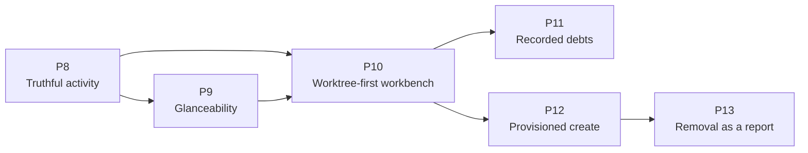

# Implementation Plan — Worktree-First Workbench

> **Consumer**: `asimov-plan` — reads one task, reads its linked design doc, scans the codebase, triages a lane, then writes `asimov/changes/<change-id>/`.
> **Rule**: tasks describe WHAT and WHERE, never HOW. No source-file paths, no function names, no test commands. (Design Ref links to `docs/` are the WHERE, and are required.)
> **Status lifecycle**: blueprint writes `todo` → asimov-plan sets `in_progress` after Gate 2 → asimov-build sets `done` after implementation approval.

**Scope**: the remaining Worktree-view work identified by
`docs/audit/2026-08-29-worktree-ui-vs-orca.md` — the truthfulness ceiling on inferred activity,
the glanceability findings, and the worktree-first workbench redesign.

Phase 11 extends that scope once: the review debts the audit did not raise and the redesign
accumulated — findings adjudicated valid, deferred with reasons, and left without an owner.
[worktree-subsystem-debts.md](design/worktree-subsystem-debts.md) records them and the ones
deliberately deferred again.

`docs/PLAN.v4.md` is the shipped record of WT phases 0–7 (discovery, panel shell, live tree,
agent presence, actions, hook pipeline, hardening). Its task IDs remain the tracker keys for
that work; this plan continues the same `WT` epic from Phase 8 and Stage 6.

Closed by the change archived as `restore-view-affordances` and not re-planned here: the
`[hidden]` CSS reset (audit § A1), the `here` → `open` pill rename (§ E1), routing the Worktree
view and the vault session list through the delegated tooltip widget (§ E2), and § D1, which was
the same CSS fix. Audit § B6 (a possibly duplicated agent row) was **dropped by the user** without
reproduction and is not planned. Audit § C is deferred by design, not debt.

## Sync contract

Task heading is `### [WT-<NNN>.<M>]` — epic code, three-digit phase number, task number. The ID is
the tracker sync key: it goes in the issue title and never changes once an issue exists, even when
the task moves phase.

| Field | Type | Notes |
|-------|------|-------|
| **Epic** | code | Carried by the ID prefix; one per plan. `WT` here |
| **Goal** | 1–2 sentences | What this task produces |
| **Design Ref** | links | The section that specifies it |
| **Depends On** | ID list | Comma-separated, or `None`. Becomes `blocked-by` |
| **Stage** | 6–7 | Ship order — what the user can do once it lands. Cuts across phases. Becomes the GitHub milestone |
| **Size** | XS / S / M / L / XL | Complexity + review load, not duration. XS: one concern, no contract change. S: one concern with its own tests/edge cases. M: feature slice across a few modules, or one new contract. L: cross-boundary, security-sensitive, or a heavy acceptance list. XL: split it |
| **Labels** | slug list | `new-api-contract`, `data-migration`, `security-privacy`, `infra`, `new-dependency`, `cross-boundary`, `user-visible-ui`, `re-review`. Or `None` |
| **Notes** | optional | Risk or reuse signal `asimov-plan` cannot see before reading code. Omit when nothing applies |
| **Acceptance** | `; `-separated | Observable outcomes only — the mechanism lives in the design doc. Each item becomes one checklist entry on the issue |
| **Status** | todo / in_progress / done | |

Phase = build order; Stage = ship order; `Depends On` is the only structural relation;
`Stage(task) ≥ Stage(dep)`.

## Design References

| Doc | Scope |
|-----|-------|
| [DESIGN.md](DESIGN.md) § 8–10 | Subsystem architecture, decisions, consistency registry |
| [design/worktree-panel-ui.md](design/worktree-panel-ui.md) | Panel body, two-level toggle, row anatomy, idle tail, inspector, state vocabulary |
| [design/worktree-scope.md](design/worktree-scope.md) | Scope model, the tab-bar filter, the All chip and its attention badge, layout by location |
| [design/worktree-activity-ceiling.md](design/worktree-activity-ceiling.md) | The confirmation ceiling on inferred `running` |
| [design/worktree-create.md](design/worktree-create.md) | The four creation modes, path derivation, the branch/source combobox, form presentation, the PR source, and where create is offered |
| [design/worktree-provisioning.md](design/worktree-provisioning.md) | Provider detection, the merged model and its provenance, and copy / link / ports / setup |
| [design/worktree-removal.md](design/worktree-removal.md) | The check set and its fail-closed rules, orphan proofs, guarded branch deletion, force semantics |
| [design/worktree-agent-presence.md](design/worktree-agent-presence.md) | Evidence model the rows and the scope join both read |
| [design/worktree-subsystem-debts.md](design/worktree-subsystem-debts.md) | Recorded review debts, their triage lines, and the decisions each still owes |

**Reference artifact**: `docs/ui/worktree.html` is the visual reference for Phase 10. It is
uncommitted at the time of writing and **cannot render** — its entire `wk-*` design language
lives in a `worktree-workbench.css` that exists nowhere in the repo. Commit it as the reference
only once it renders standalone; a reference no reviewer can open is not one. Where it and a
design doc disagree, [worktree-panel-ui.md](design/worktree-panel-ui.md) § 7.7 records the
resolution.

`docs/ui/create-worktree.html` is the visual reference for Phases 12–13, with
`docs/ui/worktree-create-dialog.css` beside it. Unlike `worktree.html` it renders standalone. The
brief that produced it is `docs/ui/create-worktree-design-brief.md`; revisions since are recorded
in `docs/ui/create-worktree-revision-brief.md`.

## Phases Overview

| Phase | Est. | Key Deliverable |
|-------|------|-----------------|
| P8 — Truthful activity | ~2-3d | Every state is legible by shape, and a row stops spinning once nothing has confirmed it |
| P9 — Glanceability | ~4-6d | The list surfaces the two worktrees that matter, each row says what just happened, and creating one is a worktree question rather than a git one |
| P10 — Worktree-first workbench | ~9-13d | Selecting a worktree scopes the surface to it — built behind a setting, which WT-010.6 retired once the composition was whole |
| P11 — Recorded debts | ~8-12d | One rule per concept: containment, promotion, a bounded look, what a row shows, what a lookup means, and who knows an entry is gone |
| P12 — Provisioned create | ~14-19d | A created worktree arrives usable: the form says what it will be filled with and where that was declared, and every way a branch or a destination can already be taken becomes a choice instead of a git error |
| P13 — Removal as a report | ~4-6d | Removal shows what was checked, treats unproven as blocking, and can delete a merged branch only under a guard |

| Stage | What the user gets |
|-------|--------------------|
| 6 | A list that can be scanned in one second and rows that stop overstating |
| 7 | Pick a worktree and the workbench follows it |
| 8 | The same panel, holding up on a symlinked vault, a sleeping disk, and a deleted session |
| 9 | A new worktree comes with its `.env`, its ports and its install already done, and says where each instruction came from |
| 10 | Removing a worktree shows its homework, and can take the branch with it only when that is provably safe |

> P10 is detailed here because its design is settled, not because it is next. Per the revision
> rule, reassess it against what P8 and P9 actually shipped before planning its first task.

---

## Phase 0 — Prerequisites

**Empty, deliberately.** This is a re-baseline of a shipped subsystem inside a released
extension. Every dependency — git, the built-in `vscode.git` extension, the hook runtime, the
release path — is already in place and already proven by the work in `docs/PLAN.v4.md`. There is
nothing to provision.

---

## Phase 8 — Truthful Activity

> **Goal**: the state vocabulary carries meaning by shape, and no row claims work on evidence that has stopped moving.

### [WT-008.1] State Legible by Shape

| Field | Value |
|-------|-------|
| **Goal** | Give every activity state its own shape in the tree, so working, waiting, idle, unknown, and exited are distinguishable at a glance and without colour |
| **Design Ref** | [worktree-panel-ui.md](design/worktree-panel-ui.md) § 7.2, § 3.2, § 3.3 |
| **Depends On** | None |
| **Stage** | 6 |
| **Size** | S |
| **Labels** | user-visible-ui |
| **Notes** | WT-002.1's acceptance already claimed "state is legible by shape alone"; at HEAD that holds for row kind, not for activity, which is the thing users scan for. This settles the glyph shapes § 7.6 leaves to the building task, and WT-008.2 adds one member to the vocabulary it establishes — do not settle five shapes in a way that leaves no room for a sixth |
| **Acceptance** | Each activity state renders a distinct shape on both the worktree row's leading glyph and the agent row's state glyph, using one vocabulary rather than two; `unknown` is distinguishable from `idle`, because one is an absence of evidence and the other is a positive claim; the shapes stay distinct with colour removed and under reduced motion, and no two states collapse to the same static form; the worktree row still shows the strongest state among its agents, by the documented precedence; the change moves no wire value and adds no field |
| **Status** | done |

### [WT-008.2] Confirmation Ceiling on Inferred Activity

| Field | Value |
|-------|-------|
| **Goal** | Stop a row animating `running` once its state has stood unchanged past the ceiling with nothing but terminal output behind it, degrading it to an unconfirmed claim rather than to idle |
| **Design Ref** | [worktree-activity-ceiling.md](design/worktree-activity-ceiling.md); [worktree-panel-ui.md](design/worktree-panel-ui.md) § 4, § 7.2, § 6.1; [DESIGN.md](DESIGN.md) § 8.4 (the ceiling invariant is added by this task) |
| **Depends On** | WT-008.1 |
| **Stage** | 6 |
| **Size** | M |
| **Labels** | user-visible-ui, re-review |
| **Notes** | Risk: this is a truthfulness fix, and the three obvious shortcuts are all wrong. Downgrading the activity to `idle` swaps one false claim for another and moves a value every consumer reads; measuring staleness from the row's last-activity stamp measures the very bytes the ceiling exists to see through. And the clock measures unchanged-activity age, not time since confirmation — the design says so explicitly, because describing it as the latter makes the doc promise a grace period the mechanism does not give. The design also **narrows** WT-004.0 rather than satisfying it whole, and that narrowing is the single most important thing for the review round to agree with |
| **Acceptance** | A row claiming `running` on output inference alone stops animating once its state has stood unchanged past the ceiling, and says how long and on what evidence; the claim degrades to unconfirmed and never to idle, and the activity value, the evidence tuple, and every message shape are unchanged; a row backed by a fresh agent report, an external registry row, and any state other than `running` are never marked unconfirmed at any age; a report arriving on a degraded row restores it on the same push, and a change of activity restarts the clock, while a change of *source* does not — a run already past the ceiling is unconfirmed the moment its report ages out, with no grace period; a clock that has not run, or that runs backwards, yields a confirmed row rather than manufacturing staleness; the view re-derives confidence on one scheduled deadline rather than an interval, re-arms it on every push and clears it on disposal, and performs no DOM work when the re-derivation moves nothing; the elapsed hint has no clock of its own; the unconfirmed and animated forms stay distinguishable under reduced motion; the ceiling invariant enters the truthfulness table with a test that goes red when it is violated |
| **Status** | done |

---

## Phase 9 — Glanceability

> **Goal**: the list answers "where is work happening" in one second, and the create dialog stops reading like git plumbing.

### [WT-009.1] Fold the Idle Tail

| Field | Value |
|-------|-------|
| **Goal** | Dim agentless worktrees to a single line and collapse them under one disclosure once there are enough of them to bury the worktrees that hold agents |
| **Design Ref** | [worktree-panel-ui.md](design/worktree-panel-ui.md) § 3.6, § 3 ordering, § 8 |
| **Depends On** | None |
| **Stage** | 6 |
| **Size** | S |
| **Labels** | user-visible-ui |
| **Notes** | This is the part of the reference's "hide sleeping" filter that pays for itself; the filter popover itself stays deferred, so resist growing filter state here. The trap is treating "no agents" and "no evidence" as the same thing — a worktree whose presence source failed is unknown, not idle, and folding it hides exactly what the degradation marker exists to show |
| **Acceptance** | Worktrees holding agents render in full and sort ahead of agentless ones, with the existing deterministic order inside each part; an agentless worktree renders as one dim line carrying its branch and marks and no presence block; from the documented threshold upward the agentless ones fold under a single disclosure stating an exact count of what it hides, and below it they stay visible; a worktree whose presence is degraded is never folded and never reads as agentless; a search match inside the fold opens it; the fold's state persists with the rest of the tree and survives a push that changed nothing |
| **Status** | done |

### [WT-009.2] Last-Activity Preview on Agent Rows

| Field | Value |
|-------|-------|
| **Goal** | Give each agent row a second line carrying the last thing that happened in that session, and move the model id off the row |
| **Design Ref** | [worktree-panel-ui.md](design/worktree-panel-ui.md) § 3.3, § 7.1, § 8 |
| **Depends On** | WT-008.1 |
| **Stage** | 6 |
| **Size** | S |
| **Labels** | user-visible-ui |
| **Notes** | Corrected at planning: the data does NOT already exist on the row. `WorktreeAgentRow` declares `preview` and the row renderer already draws it, but the presence projector never populates it, so the span is empty on every row. The vault session list renders no preview line either, so the reuse pressure this task was warned about is not there. Sourcing the content means reading transcript text the `agent-session-index` spec currently forbids reading beyond a bounded title preview — that decision is WT-009.5's, and this task keeps only the layout half. Two things to hold: the preview is decoration-stripped like every other title, and it is a render-signature input, so a preview that changes must repaint while a spinner frame must not. **Superseded in part**: the decoration-stripping half of that last sentence, and the spinner clause in Acceptance below, were reversed by WT-009.5 — a preview is message text, so a leading marker is content — and the stale spec requirement was retired by WT-011.4. The layout half stands |
| **Acceptance** | An agent row renders two lines — identity, marks and age above, its last-activity preview below — and never a third; neither line wraps and each truncates independently, the preview consuming none of the first line's width; a row with nothing to preview renders no empty second line and no placeholder; a spinner frame is neither displayed in the preview nor able to trigger a re-render; the model id no longer appears on any list row and is absent entirely when unknown; the age column and the leading glyphs never truncate. What fills the preview is WT-009.5's |
| **Status** | done |

### [WT-009.5] Fill the Preview Line With What the Session Last Did

| Field | Value |
|-------|-------|
| **Goal** | Give the agent row's preview line a real source, and settle what transcript-derived text a passive row is allowed to carry |
| **Design Ref** | [worktree-panel-ui.md](design/worktree-panel-ui.md) § 3.3, § 7.1; [worktree-agent-presence.md](design/worktree-agent-presence.md) |
| **Depends On** | WT-009.2 |
| **Stage** | 6 |
| **Size** | M |
| **Labels** | user-visible-ui, security-privacy |
| **Notes** | Split out of WT-009.2, which assumed this data was already on the row; it is not — the presence projector populates no preview at all. The nearest contract is the vault detail reader's `latestMessage` / `recentActivity`, but `agent-session-index` states that the bounded title preview is the ONLY transcript-derived value the system touches and forbids reading message bodies past it. Putting a last message on a passive row means that text crosses IPC on every presence scan and enters the render signature, so the spec clause is amended deliberately or the source is narrowed to hook-reported tool and turn state, which needs no amendment but leaves external and registry-only rows blank. A per-push transcript parse per row is the data-scale trap; whatever source wins is read through an index or a change-stamped cache, never re-parsed per scan. It also inherits WT-009.2's review finding W1: the shared `stripDecorations` treats a leading `- ` or `* ` as decoration, which is ordinary content in prose, so a bulleted preview loses its marker and a marker-only preview draws no line at all. Harmless while no row carries a preview; this task chooses the input and so is the only one able to size the pattern against it — either narrow the preview's stripper to unambiguous spinner frames or strip at read time where provenance is known, and cover `"* item"` and `"- item"`. **Privacy fork decided by the user (option A):** the index requirement is widened deliberately — a bounded last-activity line joins the bounded title preview as a transcript-derived value the index may carry. Nothing about egress changes; the `0o600` cache and the never-off-the-machine clause stand. Scoping this correctly matters: the same spec already lets the DETAIL path read message bodies (workflow agents, teammate turns, per-turn segments), so what moves is what a passively-refreshed LIST may hold, not whether bodies are read at all. The read is bounded by the transcript's mtime, not by the scan cadence — a scan that finds no newer file performs no read |
| **Acceptance** | Every row whose session the chosen source covers shows its last activity on the preview line, and a row the source does not cover shows nothing rather than a placeholder; a preview that opens with a bullet or a dash keeps the text a reader expects to see; the text is bounded and single-line at the point it is read, not at the point it is drawn; presence scans that find no new activity perform no additional transcript reads; whichever privacy position is taken is written into the owning spec rather than left implied by the code |
| **Status** | done |

### [WT-009.3] Create Form Reads as a Worktree Form

| Field | Value |
|-------|-------|
| **Goal** | Restructure the create dialog around the branch name, state the destination once, and reveal the agent block only when the user has asked for an agent |
| **Design Ref** | [worktree-create.md](design/worktree-create.md) § 4 |
| **Depends On** | None |
| **Stage** | 6 |
| **Size** | M |
| **Labels** | user-visible-ui |
| **Notes** | The path transparency is a safety property, not clutter — the host states the free path it will actually take before a filesystem write is authorized, and that must survive the restructure rather than be traded for tidiness. What changes is that it is stated once instead of twice, in a dialog whose own tree deliberately shows no path on any row. The always-visible agent block currently contradicts an "After creating: Nothing" selection sitting directly above it |
| **Acceptance** | The branch name is the lead input with nothing above it, and submission stays blocked until it validates; the resolved destination appears exactly once, shortened, with the exact value reachable without leaving the dialog, and a collision states the suffixed result without restating a full path; the agent block is absent unless the user chose to start an agent, and appears when they do, with the dangerous posture labelled and never preselected; base ref, branch source, and the path override live behind a collapsed advanced section; the host still supplies and displays the free path it will take before the action can be authorized; focus order, the focus trap, and dismissal behave as they did |
| **Status** | done |

> **Reopened 2026-08-30, closed 2026-08-31.** One acceptance clause was unmet, not the whole task:
> *"a collision states the suffixed result without restating a full path"*. The host sent
> `collidedWith` as a full absolute path and the dialog rendered it verbatim, while applying
> `lastSegment()` to the resolved path a few lines below. The host now sends the taken directory's
> name and the note opens with it. Reopening rather than superseding keeps the record that this
> acceptance was mis-verified rather than re-derived. Rule:
> [worktree-create.md](design/worktree-create.md) § 4.2.

### [WT-009.4] Create Is Offered Where the Intent Arrives

| Field | Value |
|-------|-------|
| **Goal** | Add a per-repo create control on group headers and a create action in the body of each empty state, alongside the existing toolbar button and context-menu item |
| **Design Ref** | [worktree-create.md](design/worktree-create.md) § 7; [worktree-panel-ui.md](design/worktree-panel-ui.md) § 3.1, § 5 |
| **Depends On** | WT-009.3 |
| **Stage** | 6 |
| **Size** | S |
| **Labels** | user-visible-ui |
| **Notes** | Four entry points, one dialog and one action behind them — a second create path is how the safety model acquires a hole. The header control must be reachable by keyboard, not hover only, or it is invisible to the users most likely to want it. A repo with only its main checkout is a distinct empty state from a workspace with no repo at all, and it is the one that needs the CTA — a workspace with no repository has nothing to create in, so it carries no create. Follow-up left open: the create-defaults request and its answer tell "open a form" from "update the open one" by whether a branch is present, a convention no type enforces; a `kind: "open" \| "update"` tag on both would |
| **Acceptance** | The group header offers create on hover and on keyboard focus, opening the form already scoped to that repo, and appears only where group headers are rendered; the empty state for a repository with only its main checkout carries the create action in the body, and the states describing nothing to create in — no folder, no repository, git unavailable, no match — offer none; the toolbar button and the context-menu item are unchanged; every entry point opens one dialog and runs one action, differing only in the repo it opens on; the toolbar button remains absent from every sessions body |
| **Status** | done |

---

## Phase 10 — Worktree-First Workbench

> **Goal**: selecting a worktree makes the surface about that worktree — its panes in the tab bar, its detail under the tree — behind one setting until the composition is whole.

### [WT-010.1] Scope a Surface's Tab Bar to the Selected Worktree

| Field | Value |
|-------|-------|
| **Goal** | Make selecting a worktree filter that surface's own tab bar to the panes inside it, named by a chip that can always be escaped |
| **Design Ref** | [worktree-scope.md](design/worktree-scope.md) § 2, § 3.1, § 3.2, § 3.4, § 6, § 7; [worktree-panel-ui.md](design/worktree-panel-ui.md) § 6.1, § 7.3, § 2.3; [DESIGN.md](DESIGN.md) § 8.4 (the hides-only-what-is-proven invariant is added by this task) |
| **Depends On** | WT-008.1 |
| **Stage** | 7 |
| **Size** | L |
| **Labels** | user-visible-ui |
| **Notes** | The redesign's thinnest end-to-end slice, so it lands first. It needs no new protocol: the workbench is already one webview document and pane→worktree attribution already reaches the view, so this is a filter over a list the extension owns. The risk is in what the filter hides — a pane whose directory is unknown or outside every worktree produces no presence row at all, and hiding it would make it unreachable from a tab bar the user cannot tell is filtered. Registers the rollout setting, which no manifest declares yet. The attention badge and the behaviour when a scope holds nothing are deliberately WT-010.2's, so a defect in either cannot hold this slice hostage |
| **Acceptance** | Selecting a worktree filters this surface's tab bar to its panes, and changes no other surface, no process, and nothing the host holds; a pane presence could not attribute stays visible in every scope, while one attributed elsewhere is hidden; a scope that is set is always named on screen, and the control that clears it is reachable whenever it is — including when the panel is collapsed; clearing the scope restores every tab it hid; the card treatment marks the selected worktree and only it, so emphasis no longer reads as selection where the user selected nothing; a removed or pruned scoped worktree drops the scope with a reason, while a `missing` one keeps it; scope persists per surface, absent means all, and an id no longer in the tree resolves to all; two surfaces hold different scopes with neither following the other; a push that changes no attribution performs no tab-bar DOM work; the hides-only-what-is-proven invariant enters the truthfulness table with a test that goes red when it is violated; everything here is inert while the rollout setting is off |
| **Status** | done |

### [WT-010.2] Nothing Hidden Goes Unheard

| Field | Value |
|-------|-------|
| **Goal** | Count the hidden panes that need a human on the escape control, and settle what a selection does to the active pane and to a scope holding nothing |
| **Design Ref** | [worktree-scope.md](design/worktree-scope.md) § 3.3, § 4.2, § 4.3; [DESIGN.md](DESIGN.md) § 8.4 (the no-invisible-filter invariant is added by this task) |
| **Depends On** | WT-010.1 |
| **Stage** | 7 |
| **Size** | M |
| **Labels** | user-visible-ui, re-review |
| **Notes** | This is the task that makes the filter safe, and it is separated from the filter itself so its correctness is reviewed on its own. Two traps: a badge that is always present is a badge nobody reads, and a count drawn from one evidence source under-reports, because the two sources covering `waiting` do not cover the same panes today. Selection is navigation here — pinning the active pane was considered and rejected in the design, because it creates an attribution outcome the join does not have and makes the empty-scope region unreachable in the common case |
| **Acceptance** | Hidden panes that are waiting raise a count on the escape control, from either evidence source, and no badge renders when there are none; clearing the scope from the badge yields a tab bar holding every pane the count named; the badge uses the same attention vocabulary a waiting row uses, not an error treatment; selecting a worktree activates its first in-scope pane, leaves an already-in-scope active pane where it is, and shows the empty-scope region when the scope holds none; the previously active pane keeps running across the change and returns when the scope is cleared; the empty-scope region offers the two things worth doing there, carries no error styling, and never clears the scope the user chose; the no-invisible-filter invariant enters the truthfulness table with a test that goes red when it is violated |
| **Status** | done |

### [WT-010.3] Two-Level Worktrees / Sessions Toggle

| Field | Value |
|-------|-------|
| **Goal** | Replace the four flat segments with a primary Worktrees / Sessions toggle, demoting Recent / Agent / Folder to a grouping control shown only inside Sessions |
| **Design Ref** | [worktree-panel-ui.md](design/worktree-panel-ui.md) § 2, § 2.1, § 2.2, § 2.3; [DESIGN.md](DESIGN.md) § 9 D28 |
| **Depends On** | WT-010.1 |
| **Stage** | 7 |
| **Size** | M |
| **Labels** | user-visible-ui |
| **Notes** | No migration exists to write: the two persisted keys are already independent and already carry these exact values, and inventing one would be the bug. The current label-dropping CSS is a symptom of the squeeze this removes, so it goes with it rather than surviving as dead style. Both control levels are tab-like and must keep their roles, labels, and keyboard semantics rather than becoming buttons that happen to look selected |
| **Acceptance** | One primary control switches the body and always shows both values labelled; the grouping control renders inside the sessions body and nowhere else; state written by an older build keeps its meaning with no migration and no key change; the default-body rule is unchanged — a persisted choice wins, otherwise a workspace with a repo opens on worktrees and one without opens on sessions; both levels expose tab semantics to assistive technology and are fully keyboard operable; the shipped four-segment control remains in place while the rollout setting is off |
| **Status** | done |

### [WT-010.4] Rail Composition and Layout by Location

| Field | Value |
|-------|-------|
| **Goal** | Give the panel and editor locations a two-column rail beside the terminal, and the sidebar a rail that collapses after a selection |
| **Design Ref** | [worktree-scope.md](design/worktree-scope.md) § 5; [worktree-panel-ui.md](design/worktree-panel-ui.md) § 2.3, § 7.1 |
| **Depends On** | WT-010.1, WT-010.3 |
| **Stage** | 7 |
| **Size** | M |
| **Labels** | user-visible-ui |
| **Notes** | One mechanism, two location-appropriate feels — not two implementations. The surfaces differ today only by a location attribute on the document, and that is the seam to use rather than a second layout path. The auto-collapse is a consequence of an explicit selection, never a timer, and must be reversible by the same control that performed it |
| **Acceptance** | The panel and editor locations render the rail beside the terminal region with both visible at once; the sidebar keeps the stacked layout and collapses the rail on an explicit selection, reversibly, staying expanded until the next selection once the user reopens it; scope behaves identically in every layout; the escape control survives a collapsed rail; layout animations respect reduced motion; the shipped layout is unchanged while the rollout setting is off |
| **Status** | done |

### [WT-010.5] Worktree Inspector Drawer

| Field | Value |
|-------|-------|
| **Goal** | Open a capped detail region under the tree on selection, carrying the worktree's path, actions, agents and their models, and its delegation history |
| **Design Ref** | [worktree-panel-ui.md](design/worktree-panel-ui.md) § 3.7, § 3.2, § 6; [worktree-actions.md](design/worktree-actions.md) § 2; [DESIGN.md](DESIGN.md) § 9 D29 |
| **Depends On** | WT-010.1, WT-009.2 |
| **Stage** | 7 |
| **Size** | L |
| **Labels** | user-visible-ui |
| **Notes** | Puts the model identifier back into the render signature: WT-009.2 removed it when the model left the list row, and the guard must key it again once the drawer draws it. Sized L rather than M: it carries an accessible drawer shell and its focus lifecycle *and* the action surface inside it, and the second is where the risk is. A drawer, not a body swap — at sidebar width, replacing the body makes selection destructive and forces a back control. Reuse pressure is high: every action it offers already has a handler and an id-resolving path, and growing a parallel set is the failure mode. It is also one of only two places a path is shown in full, so the no-path-on-a-row rule has to survive it |
| **Acceptance** | Selecting a worktree opens the drawer and scopes the tab bar from one gesture, and selecting another replaces its contents rather than stacking; the drawer is capped so the tree above stays visible and scannable; it shows the full path, and no list row gains one; every action it offers resolves host-side from an id and runs the same operation as the equivalent menu item, with external agents still never offered focus; the model id appears here and on no row; dismissal is explicit and leaves the scope alone; focus is trapped correctly, returns where it came from, and survives the drawer opening and closing; the drawer is absent while the rollout setting is off |
| **Status** | done |

### [WT-010.6] Default the Workbench On

| Field | Value |
|-------|-------|
| **Goal** | Flip the rollout setting's default, retire the gate, and remove the superseded control and layout it was protecting |
| **Design Ref** | [worktree-panel-ui.md](design/worktree-panel-ui.md) § 2.3; [DESIGN.md](DESIGN.md) § 10 |
| **Depends On** | WT-010.1, WT-010.2, WT-010.3, WT-010.4, WT-010.5 |
| **Stage** | 7 |
| **Size** | S |
| **Labels** | user-visible-ui, re-review |
| **Notes** | The gate's purpose ends when the composition is whole; leaving it registered leaves two supported layouts to test forever. Removing the old control is the point of the task — a flag flipped but never cleaned up is how a codebase acquires a permanent second UI. Verification requirement, not an observable outcome: no dead style, state key, or unreachable branch is left behind for the retired path, which the review round confirms by reading the diff |
| **Acceptance** | The workbench composition is what a user sees with no setting configured; the superseded four-segment control and the layout branch it guarded are gone rather than merely unreachable; a user who had explicitly set the flag either way lands on the workbench rather than on a path that no longer exists; the registry and the design docs no longer describe the setting as live |
| **Status** | done |

---

## Phase 11 — Recorded Debts

> **Goal**: the subsystem holds one rule per concept rather than one per call site. Most tasks
> here close a finding review already adjudicated valid and then deferred with a written reason —
> see [worktree-subsystem-debts.md](design/worktree-subsystem-debts.md) for each one's triage line.
> WT-011.11 and WT-011.12 arrived differently: both were found by build evidence rather than by
> review, and both are recorded here because they are debts of the same kind, not because a round
> deferred them.
> Nothing here changes what the panel presents when everything is healthy, which is what makes the
> phase reviewable as hardening rather than as feature work.

### [WT-011.1] Containment That Survives a Symlink

| Field | Value |
|-------|-------|
| **Goal** | Every vault path resolver decides containment on resolved paths rather than on strings, so a symlink inside the root cannot resolve outside it |
| **Design Ref** | [worktree-subsystem-debts.md](design/worktree-subsystem-debts.md) § 2.1; [DESIGN.md](DESIGN.md) § 8.5, § 9 D31 |
| **Depends On** | None |
| **Stage** | 8 |
| **Size** | M |
| **Labels** | security-privacy, cross-boundary, re-review |
| **Notes** | Deferred as repo-wide work precisely because fixing one resolver leaves it the only site with a different rule. Tolerance is load-bearing in one direction only: a resolver that hard-fails on a missing file turns "no transcript yet", the normal early state of a session, into an error — but a resolver that treats *any* resolution failure as absence leaves the hole open through a dangling link. The repo's existing tolerant realpath helper is the wrong tool for that reason: it is an availability helper for naming worktrees, not an authority for reading files |
| **Acceptance** | A candidate reached through a symlink that escapes the root is refused, at every vault resolver — including the one that reaches transcripts by listing a directory rather than by resolving an id; a candidate legitimately inside the root is still accepted when its own tail does not exist yet; a candidate the filesystem declines to resolve for any other reason is refused rather than compared literally; no resolver keeps a second containment rule |
| **Status** | done |

### [WT-011.2] One Definition of a Window's First Row-Drawing Surface

| Field | Value |
|-------|-------|
| **Goal** | The transition to "this window draws rows" is defined in one place, and every boundary that reaches that state routes through it |
| **Design Ref** | [worktree-subsystem-debts.md](design/worktree-subsystem-debts.md) § 2.2; [DESIGN.md](DESIGN.md) § 9 D32 |
| **Depends On** | None |
| **Stage** | 8 |
| **Size** | S |
| **Labels** | re-review |
| **Notes** | The only debt with no round file of its own — carried as a follow-up note from the subscription-seam fix. The concept decides whether a window subscribes to presence at all, and spelled inline it has already drifted at two boundaries. Adding the missing branches would reproduce the defect; the fix is an owner. Boundary: this does not change WHEN a window subscribes, only which boundaries are recognised as reaching the same state |
| **Acceptance** | A window that gains its first row-drawing surface is promoted regardless of which boundary it arrives through; the boundaries previously missed are covered by tests naming them; no site decides the transition on its own inline rule |
| **Status** | done |

### [WT-011.3] A Transcript Look That Cannot Hang

| Field | Value |
|-------|-------|
| **Goal** | A transcript read is time-bounded, and a look that times out is treated as a look that achieved nothing rather than as a result or an error |
| **Design Ref** | [worktree-subsystem-debts.md](design/worktree-subsystem-debts.md) § 2.3; [DESIGN.md](DESIGN.md) § 9 D33 |
| **Depends On** | None |
| **Stage** | 8 |
| **Size** | M |
| **Labels** | re-review |
| **Notes** | Deferred as "a new failure-surface decision rather than remediation", which is the whole task: a timeout has to fail in a direction, and the direction is soft. The cadence gate bounds how often a look starts, never how long one takes, so a stalled network mount or a sleeping volume holds its slot forever. The cache cap belongs here too, but only its own half: eviction currently releases a session whose look is still stalled, so the next ask launches a second read against the same hung path — the bound on outstanding work has to survive eviction, which is why it cannot be split from the timeout. Bounding the *count* of looks a single projection provokes is a different owner and became WT-011.7 |
| **Acceptance** | A read against an unresponsive path abandons within a bound instead of blocking the look; a timed-out look backs off through the existing retry ladder, is not recorded as a resolution, and commits nothing it goes on to observe; a row whose transcript timed out keeps its last known line rather than blanking; outstanding reads stay bounded however many rows ask and whatever the cache evicts |
| **Status** | done |

### [WT-011.4] A Row Never Says the Same Thing Twice

| Field | Value |
|-------|-------|
| **Goal** | A row's preview is suppressed when it repeats the row's own title, so a one-message session does not present the same sentence twice |
| **Design Ref** | [worktree-subsystem-debts.md](design/worktree-subsystem-debts.md) § 2.4; [worktree-panel-ui.md](design/worktree-panel-ui.md) § 3.3; [DESIGN.md](DESIGN.md) § 9 D34 |
| **Depends On** | None |
| **Stage** | 8 |
| **Size** | S |
| **Labels** | user-visible-ui |
| **Notes** | Deferred as "needs a decision, not a patch" — neither the spec nor the preview design carries a rule about what a row shows when two of its lines agree. The decision is exact equality after the normalization the title already receives, never similarity: a near-match still carries something the title did not, and hiding it would replace a redundancy with a worse lie. Every session is a one-message session at its first render, so this is the common case rather than an edge one |
| **Acceptance** | A row whose preview exactly matches its title presents the title alone; a row whose preview differs by any amount presents both; a session that gains a second message regains its preview line |
| **Status** | done |

### [WT-011.5] A Preview Outlives Nothing

| Field | Value |
|-------|-------|
| **Goal** | A preview line is retired when the vault entry that sourced it is gone, while a transcript that is merely unreadable keeps its line |
| **Design Ref** | [worktree-subsystem-debts.md](design/worktree-subsystem-debts.md) § 2.5; [DESIGN.md](DESIGN.md) § 9 D35 |
| **Depends On** | WT-011.3, WT-011.8 |
| **Stage** | 8 |
| **Size** | S |
| **Labels** | re-review |
| **Notes** | **Re-scoped at planning, after oracle review**: the mechanism this task assumed does not exist. `getEntry` returns `null` for a deleted entry and for a failed reader alike, so "the service treats a failed re-resolve as a deletion" would retire a live row's line on a transient SQLite error. The conclusive `found | absent | unknown` signal is a change to the vault readers' contract and its own invariant owner, split out as WT-011.8. Also corrected: the clause promising an *unreadable* transcript keeps its line over-read its own citation — § 2.3 grants that to a look that times out, while a read that fails outright already retires the line, as `worktree-agent-presence` requires and two shipped tests assert. This task no longer touches that behaviour. Original deferral reason follows. Deferred because the obvious fix — handing the projector's live entry-id set to the service — moves ownership a shipped decision assigned elsewhere. The chosen owner is the service itself: it already re-resolves on cadence and already separates "not there yet" from "never will be", so a vanished entry is a third outcome named where the syscall already happens, with no cross-layer push and no second definition of "live". Depends on WT-011.3 because both change how a failed look is classified, and classifying deletion before timeouts fail soft would make the two rules contradict |
| **Acceptance** | A row whose vault entry is conclusively absent stops presenting its preview and stops provoking filesystem work, recovering if the entry reappears; a row whose lookup is merely inconclusive keeps its last known line and re-checks on a later tick; the retirement happens on the first eligible look after the confirmation interval, not on a wall-clock deadline the service cannot honour while a look is outstanding; the outcomes are distinguishable in the service rather than inferred by the caller; no live-entry set is pushed across the layer boundary |
| **Status** | done |

### [WT-011.6] Worktree Attribution That Survives a Symlink

| Field | Value |
|-------|-------|
| **Goal** | The comparisons that decide which worktree or repository a path belongs to agree with where that path actually resolves |
| **Design Ref** | [worktree-subsystem-debts.md](design/worktree-subsystem-debts.md) § 2.1; [DESIGN.md](DESIGN.md) § 9 D31 |
| **Depends On** | WT-011.1 |
| **Stage** | 8 |
| **Size** | M |
| **Labels** | cross-boundary |
| **Notes** | Surfaced while planning WT-011.1, which established the rule and scoped itself to the resolvers that gate a transcript read. Five further sites compare raw workspace-folder, Git API, pane-cwd and webview paths lexically — the same error with a different consequence: a session whose cwd resolves elsewhere is attributed to the wrong worktree, and repository discovery can pick the wrong root. Held back from WT-011.1 deliberately: none of them authorizes a read, several run per push, and "attribution is wrong" is a different acceptance story from "a read escaped the store". Whether the fix is resolution at these sites or resolution once at the boundary that produces the paths is the decision this task owns |
| **Acceptance** | A pane whose cwd resolves outside a worktree is not attributed to it, and one that resolves inside it still is, whatever either spells; repository discovery picks the root a path resolves into; the per-push paths do not gain an unbounded syscall per comparison; no site keeps a private copy of the containment rule |
| **Status** | done |

### [WT-011.7] A Projection Tick Provokes Bounded Work

| Field | Value |
|-------|-------|
| **Goal** | One projection provokes a bounded number of transcript reads, whatever the window draws |
| **Design Ref** | [worktree-subsystem-debts.md](design/worktree-subsystem-debts.md) § 2.3; [DESIGN.md](DESIGN.md) § 9 D33 |
| **Depends On** | WT-011.3 |
| **Stage** | 8 |
| **Size** | S |
| **Labels** | none |
| **Notes** | Split out of WT-011.3 once the code was visible. WT-011.3 bounds how long one look may take and how many may be outstanding at once, both of which the preview service owns. It cannot bound how many a projection starts in total: the projector enriches one worktree's rows and awaits them before starting the next, so a service-side concurrency limit is never reached and every row still costs a look. The decision this task owns is whether the projector fans its preview requests out in one wave so the service's own limit gates the whole projection, or carries an explicit per-projection budget — a fan-out shape the projector owns, not the preview service |
| **Acceptance** | A projection over many worktrees provokes a bounded number of transcript reads rather than one per row; rows the bound excludes keep their last known line and are re-checked on a later tick rather than dropped; the bound holds whether the rows are spread across many worktrees or concentrated in one |
| **Status** | done |

### [WT-011.8] A Vault Lookup That Knows Absent From Unknown

| Field | Value |
|-------|-------|
| **Goal** | A caller asking the vault for one session gets a conclusive answer — the entry is there, it is gone, or the question could not be answered — instead of one `null` meaning all three |
| **Design Ref** | [worktree-subsystem-debts.md](design/worktree-subsystem-debts.md) § 2.5; [DESIGN.md](DESIGN.md) § 9 D36 |
| **Depends On** | none |
| **Stage** | 8 |
| **Size** | M |
| **Labels** | new-api-contract |
| **Notes** | Split out of WT-011.5 at planning, when the oracle showed its central claim was untrue of the code: every reader collapses "no such session" and "I could not look" into the same `null`, and `codexReader.ts` says so in a comment. Any caller that treats absence as actionable is therefore acting on a guess, and WT-011.5 would have acted on it by blanking a live row. The readers already hold the distinction internally — an empty result set is absent, a thrown query or an unparseable file is unknown — so the work is surfacing what they know across `VaultService` and its wiring, not adding a probe. Its own invariant owner (the lookup contract) and independently testable, which is why it is a task rather than remediation folded into WT-011.5. Scope discipline: this widens one lookup's answer, it does not revisit how entries are built or cached |
| **Acceptance** | A lookup for a session the store never had, and for one whose file was deleted, both report absent; a lookup during a reader failure — an unreadable database, an unparseable transcript, a thrown query — reports unknown and is never mistaken for absent; every existing caller keeps its current behaviour, treating anything other than a found entry the way it treats `null` today; the distinction holds for each supported agent source |
| **Status** | done |

### [WT-011.9] A Reused Snapshot Answers For A Store It Can Still Read

| Field | Value |
|-------|-------|
| **Goal** | The reused and freshly-taken read paths give the same status for a store whose readability has changed |
| **Design Ref** | [DESIGN.md](DESIGN.md) § 9 D31 |
| **Depends On** | None |
| **Stage** | 8 |
| **Size** | S |
| **Labels** | security-privacy |
| **Notes** | Raised as W4 in `snapshot-a-live-store-atomically` cycle 2 round 4 and parked there as a decision rather than a patch. The presence check proves a store EXISTS (`fs.access` in its default mode) and the reuse gate proves its `(mtimeMs,size)` is unchanged; neither proves it can still be READ. Revoke read permission on the database file and both keep succeeding, so a retained snapshot is served as `ok` while a cold read of the same store returns `db-unreachable`. The bytes were read lawfully when the snapshot was taken, so this is a status-contract divergence rather than a disclosure — but two paths answering one question differently is what the status vocabulary exists to prevent. The decision this task owns is WHERE the proof belongs, and each candidate moves an accepted contract: proving `R_OK` in the presence check changes what separates `no-db` from `db-unreachable`; folding access state into the generation adds a third input to a two-input proof and costs a syscall per reuse; proving it only at the pool boundary splits the contract across two owners. Existing coverage revokes DIRECTORY search permission, which fails earlier and never reaches this boundary |
| **Acceptance** | A store whose read permission is revoked reports the same status through a reused snapshot as through a fresh one; the reuse path does not gain a syscall per hit unless that is the decision recorded; file-level permission revocation is covered for both entry points, not only directory-level |
| **Status** | done |

### [WT-011.10] An Envelope Is Enriched Only If Its Enrichment Finished

| Field | Value |
|-------|-------|
| **Goal** | A surface that reopens after enrichment was cut short asks for a replacement pass instead of drawing the envelope it was left with |
| **Design Ref** | [worktree-subsystem-debts.md](design/worktree-subsystem-debts.md) § 2.3 |
| **Depends On** | WT-011.7 |
| **Stage** | 8 |
| **Size** | S |
| **Labels** | none |
| **Notes** | Raised as W1 in `bound-the-looks-one-projection-starts` rounds 6 and 7, adjudicated non-blocking both times and left for its own change. The host records `projectedEnriched` from what it REQUESTED, not from whether preview enrichment completed, so a projection whose preview half was skipped by WT-011.7's falling-edge fence still marks the envelope enriched and `enrichmentOwed()` suppresses the replacement pass on reopen. The obvious cheap fix does not work and the attempt is worth not repeating: clearing the flag on the falling edge broke 19 cases, because the host's reconcile is deliberately a state settle rather than an edge check and so runs on every mutation while nothing is drawing. Both routes the reviewer named — propagating whether enrichment completed out of the projection, or holding an explicit outstanding-enrichment obligation — add information to the projector/host seam, which is why this is a decision and not a patch |
| **Acceptance** | A projection whose preview enrichment was skipped does not leave the envelope recorded as enriched; a surface reopening after such a pass is served a replacement pass rather than waiting for the next external scan; the fix does not fire on mutations that changed nothing |
| **Status** | done |

### [WT-011.11] One Clock Decides Whether a Deadline Has Passed

| Field | Value |
|-------|-------|
| **Goal** | A deadline reports itself expired the moment the wait it hands out completes, so a caller that awaits one and then reads it cannot be told it has not passed yet |
| **Design Ref** | [worktree-subsystem-debts.md](design/worktree-subsystem-debts.md) § 2.1 |
| **Depends On** | None |
| **Stage** | 8 |
| **Size** | XS |
| **Labels** | None |
| **Notes** | Found while confirming a verify-gate failure was not mine, and it is a real defect rather than a flaky test. The deadline is built from two clocks that do not agree: the expiry instant is computed from `Date.now()` while the wait is a `setTimeout` of the same duration, and Node's timer may fire up to a millisecond early against `Date.now()`. Reproduced 1 run in 25 at commit 414b0aef on an otherwise quiet machine, so it is not CPU contention — the contention flakes are a separate and unrelated population in `extension.worktreeAssembly`, `snapshotPool` and `VaultPanel`. The margin only has to be one millisecond, so the shortest deadlines are the ones that hit it, which is why the existing test uses `1` and why raising that number would hide the defect rather than fix it |
| **Acceptance** | Awaiting a deadline's completion and then reading whether it expired answers yes, for every duration including the shortest one; the guarantee holds without depending on how promptly the host's timer fires; the existing test keeps its one-millisecond deadline rather than being relaxed to pass |
| **Status** | done |

### [WT-011.12] The Shipped Bundle Resolves Every Module It Requires

| Field | Value |
|-------|-------|
| **Goal** | A packaged extension that would fail to activate because a dependency left an unresolvable module reference in the bundle fails the build instead of the user's editor |
| **Design Ref** | [DESIGN.md](DESIGN.md) § 8.5 |
| **Depends On** | None |
| **Stage** | 8 |
| **Size** | S |
| **Labels** | infra |
| **Notes** | Written after an activation failure that no suite could have caught. A dependency whose package `main` is a UMD bundle calls its factory with `require` as a parameter and the factory then requires a relative path; the bundler cannot follow a require reached through a parameter, so the call survives into the output and resolves against the output directory at runtime. The whole test suite stayed green because the test runner resolves the dependency's ESM entry and never loads the bundle at all — so the gate has to read the built artifact, not the source. The immediate instance was fixed by aliasing that dependency to its ESM build; this task is the tripwire that would have caught it, and it must fail on the artifact rather than assert against a list of known-bad package names |
| **Acceptance** | A build whose output holds a relative `require` that will not resolve at runtime fails the build; the check reads the built artifact rather than the sources; a deliberately reintroduced instance is caught, so the check is not vacuous; node builtins and the editor host module are not reported |
| **Status** | done |

---

## Phase 12 — Provisioned Create

A fresh worktree is a checkout and nothing else. This phase makes the create dialog state what the
new worktree will be filled with, where each instruction was declared, and what to do when the
branch or the destination is already taken.

Sequencing inside the phase is deliberate: **read and display before write**. WT-012.5 is the only
task that writes a config file, and it lands after the states it has to round-trip are drawn.

### [WT-012.0] One Wire Contract for Modes, Offers and Assessments

| Field | Value |
|-------|-------|
| **Goal** | Land the message shapes Phase 12 and Phase 13 are built on: the create-mode union, the provisioning offer and its selection, and the removal assessment |
| **Design Ref** | [worktree-rpc.md](design/worktree-rpc.md) § 2.3, § 2.4, § 2.5, § 4 |
| **Depends On** | None |
| **Stage** | 9 |
| **Size** | M |
| **Labels** | new-api-contract, cross-boundary |
| **Notes** | Every UI and execution task in both phases reads this contract, so it lands first rather than being discovered three tasks in. Two of its properties are safety rules expressed as types rather than as validators that can be forgotten: `baseRef` is structurally absent from the modes that must refuse it, and a selection carries ids against a host-held offer rather than command text |
| **Acceptance** | The create request carries a discriminated branch-mode union in which `baseRef` cannot be expressed for reuse, reattach or adopt, and in which reattach and adopt are separate variants naming different paths and different expected-OID guards, and a destination disposition **independent** of it so an existing branch and a debris-occupied destination can both be stated; the after-create value is a union whose agent fields and setup-wait flag exist only on its agent variant; every selectable provisioning item carries an opaque host-issued id and a selection carries ids only, with no field capable of carrying a command or a path; an unknown or invalidated offer performs no create and no provisioning, re-presents, and requires a second submission; the removal assessment carries a per-check class and a four-value outcome including `notApplicable`, and the legacy boolean blocker record is gone rather than kept beside it; a branch-delete request carries both ref names, both OIDs, and the assessment fingerprint; path validation is mode- and disposition-dependent rather than a blanket non-existence rule |
| **Status** | done |

### [WT-012.16] A Form's Results Belong to the Form That Asked

| Field | Value |
|-------|-------|
| **Goal** | Give the create dialog an opening identity that travels on the wire, so a provisioning result can only reach the form that asked for it, and a cancelled or submitted form retires its own |
| **Design Ref** | [worktree-rpc.md](design/worktree-rpc.md) § 2.1, § 2.2, § 2.4 |
| **Depends On** | WT-012.0 |
| **Stage** | 9 |
| **Size** | M |
| **Labels** | new-api-contract, cross-boundary |
| **Notes** | Split out of WT-012.1 after its review found the invariant unclosable inside that task. A host-local generation is minted only once the host processes a request, so it cannot bind a result to the webview's *live* opening: the dialog clears its cache and posts asynchronously, and a predecessor read can resolve in the gap while the host still believes its generation current. Normal cancel and submit tell the host nothing at all, so a dead form's read still mints host authority. Both are one invariant — **form-opening lifetime across the boundary** — and closing it requires an identity the webview owns and the host echoes, which is a new owner rather than a fix inside a rendering task. WT-012.2 is the first task that would redeem such an offer, so this lands before anything acts on one |
| **Acceptance** | A create form's opening carries an identity minted by the webview, sent on every opening request and echoed on every defaults and offer reply, and a reply whose identity is not the live one is dropped rather than cached or rendered; reopening a dialog while its predecessor's read is still in flight renders nothing from that predecessor, whether the predecessor resolves or rejects; cancelling or submitting a form retires its opening, and a result arriving for a retired opening mints no host authority and leaves no host or controller state behind; duplicate or repeated requests naming one opening join or are ignored rather than each starting another concurrent read, so a repeated message cannot suppress the legitimate result or grow reads without bound; a request naming an opening the host does not hold is answered with nothing |
| **Status** | done |

### [WT-012.1] Bring Over States What a Worktree Will Lack

| Field | Value |
|-------|-------|
| **Goal** | Render a Bring over section in the create dialog from the repository's own provisioning config, with every entry naming the file that declared it |
| **Design Ref** | [worktree-provisioning.md](design/worktree-provisioning.md) § 2, § 3.1, § 4.0, § 4.3 |
| **Depends On** | WT-012.0, WT-012.16 |
| **Stage** | 9 |
| **Size** | M |
| **Labels** | user-visible-ui |
| **Notes** | First slice of the provider layer, deliberately one adapter wide — the normalized model and its provenance rule are the contract every later task in this phase consumes, and they are cheaper to get right against one real file than four. This repo's own `asimov/worktree.yaml` is that file. Globs expand at read time because the list shown must be the list that would be copied |
| **Acceptance** | A repo declaring copy, link, port and setup material shows each of them as its own row, and each row names the source file; a repo declaring none still shows the section, saying the worktree will have no `.env` or `node_modules`; a linked row states that it writes to the main checkout, and that statement is not suppressible; the source badge answers only which file declared the entry, with mode consequences carried separately; nothing in this task writes to disk |
| **Status** | done |

### [WT-012.2] The Files a Worktree Needs Are Put There Safely

| Field | Value |
|-------|-------|
| **Goal** | Materialize the provision model's files after a successful create — copy, then link — reporting each entry, and never failing or rolling back the create because one failed |
| **Design Ref** | [worktree-apply.md](design/worktree-apply.md) § 1, § 2.1, § 2.2, § 3 |
| **Depends On** | WT-012.1 |
| **Stage** | 9 |
| **Size** | L |
| **Labels** | security-privacy, cross-boundary |
| **Notes** | The destructive-adjacent half of the phase: it writes files into a new directory from paths a checked-in file supplied. Containment is `isPathInside` / `isResolvedPathInside` from `src/utils/pathBoundary.ts` — this code must not spell its own test. An escaping entry is refused and reported, never clamped into range, because clamping turns a suspicious entry into a silently different one |
| **Acceptance** | Copy runs before link and no entry runs out of order; an existing destination is never overwritten and that holds for every descendant of a directory copy, not only its top-level name; source and destination are validated against different roots; special files are refused; a symlink inside the repository is preserved rather than dereferenced and one resolving outside is refused; an entry resolving outside the repository is refused rather than clamped; validation is redone immediately before each operation; a lockfile is refused with its reason whether it was named for copy or for link; a `node_modules` link is refused with its reason; where the platform cannot symlink, the entry degrades to a copy and says so per entry; a failed entry leaves the worktree and every earlier entry standing |
| **Status** | done |

### [WT-012.3] The Section Reads Whatever the Repo Already Uses

| Field | Value |
|-------|-------|
| **Goal** | Add the orca and VS Code task adapters behind the same model, with a fixed detection order, and offer a detected-but-unused provider instead of hiding it |
| **Design Ref** | [worktree-provisioning.md](design/worktree-provisioning.md) § 3.2, § 3.3, § 4.1 |
| **Depends On** | WT-012.1 |
| **Stage** | 9 |
| **Size** | M |
| **Labels** | user-visible-ui |
| **Notes** | The tasks.json adapter honours `runOn: "worktreeCreated"` as a **convention read from the file** — the enum that would expose it to an extension is a proposed API a published extension cannot enable, and its dispatcher is core-internal and never fires for our worktrees. tasks.json is JSONC, so comments and trailing commas must parse; there is no JSONC dependency in the tree today |
| **Acceptance** | An orca repo populates the section from `orca.yaml` and `.worktreeinclude` with the right copy/link modes; a repo whose only config is a `worktreeCreated` task populates its setup rows; detection follows the recorded order and the first hit supplies the model; a second detected provider appears as one quiet row offering to switch, never as a merge and never hidden; a JSONC file with comments and trailing commas parses; orca keys outside the two that map are ignored without reporting the repo as misconfigured |
| **Status** | done |

### [WT-012.17] Two Spellings, One Destination Slot

| Field | Value |
|-------|-------|
| **Goal** | Decide, without reading the filesystem, when two declared paths are provably one destination — and surface every pair it cannot prove instead of guessing either way |
| **Design Ref** | [worktree-provisioning.md](design/worktree-provisioning.md) § 4.2, § 4.3; [worktree-apply.md](design/worktree-apply.md) § 2.1, § 2.2 |
| **Depends On** | WT-012.2 |
| **Stage** | 9 |
| **Size** | M |
| **Labels** | new-api-contract |
| **Notes** | The read-time half of the split; WT-012.18 owns the apply-time half. An oracle attack established the boundary: git creates the worktree BEFORE provisioning runs, so the folding rule that decides the answer belongs to a directory that does not exist while the offer is drawn — demanding one row before creation is not satisfiable under the available primitives, which is why this task no longer asks for it. Split out of WT-012.4 after its review reopened the question a sixth time. Six mechanisms are already refuted and the counterexamples are recorded in that change's design.md attack log — a single-file case probe (a case-toggled symlink answers for the wrong volume), `realpath` per path (two aliases, one answer, two slots), `lstat` dev+ino per path (two hard links share an inode; a symlinked parent defeats no-follow; Windows `st_ino` collides past 2^53 without `{ bigint: true }`), and lexical folding on platform alone. That last one is what shipped and what round 7 refuted on BOTH axes: on a folding POSIX volume `mixedcase` and `MixedCase` stay two default-selected rows, copy is applied before link, and the second is charged EEXIST, so the inherited mode wins a destination the merge rule awards to the native entry; on Windows `toLowerCase()` merges `İ` with `i̇` and `ẞ` with `ß`, which NTFS keeps distinct through its own `$UpCase` table with no normalization, silently dropping a declaration. Node exposes no no-follow canonical-directory-entry-name primitive. A conservative fold is NOT the answer either: ASCII-only folding closes the Windows over-merge but makes the other failure worse, because `Straße` and `STRASSE` are one file on APFS and splitting them recreates exactly the round-7 defect. `entryGate.ts` folding case for its lockfile rule is not a precedent — an over-conservative refusal stays visible, while a merge key deletes a row and its provenance for good |
| **Acceptance** | Two declarations whose normalized paths are exactly equal produce one entry, and the native one wins including its `mode` while keeping its own `source`; two declarations related only by case or Unicode folding are neither merged nor discarded — both stay offered, each with the spelling and source its own file wrote, travelling as a group that records the native declaration as the one the merge rule favours; `exclude` matches on the same rule the merge uses, and an exclusion matching nothing is reported rather than dropped; no identity or exclusion decision reads any path at all, on any platform; the read path still imports nothing that executes or mutates |
| **Status** | done |

### [WT-012.18] The Entry That Wins Is the Entry That Lands

| Field | Value |
|-------|-------|
| **Goal** | Arbitrate a destination two selected entries both claim, at the moment that destination exists, so the repository's own declaration wins it or the pair is refused where the user can see it |
| **Design Ref** | [worktree-apply.md](design/worktree-apply.md) § 2.1, § 2.2, § 3; [worktree-provisioning.md](design/worktree-provisioning.md) § 4.2 |
| **Depends On** | WT-012.17 |
| **Stage** | 9 |
| **Size** | M |
| **Labels** | new-api-contract |
| **Notes** | The other half of the split that WT-012.17 records, and the half that can actually observe the destination: git creates the worktree before provisioning runs, so the folding rule that decides the answer is a property of a directory that does not exist while the offer is being drawn. Two mechanisms here are already refuted. Reading `EEXIST` as the collision signal fails four ways — `makeDirectory` returns `written` for a directory that was already there and the second walk merges into it, `EEXIST` cannot tell a rival declaration from material `git worktree add` checked out, a native claimant that fails before claiming leaves no `EEXIST` at all, and the global copy-before-link sort is a prerequisite rule rather than a precedence one. Adopting orca's behaviour also fails: it dedupes exact strings and is first-write-wins, which is not provenance-wins. What is reusable is its no-clobber shape and the exclusive primitives already here — `copyFileNoFollow` opens the destination `O_CREAT \| O_EXCL` and links are one `symlink` call. Two states this task MUST settle with a `D#`, both found by attacking WT-012.17's plan rather than by review: a directory destination that already exists returns `written` and the walk MERGES the loser's children in, so for directory entries ordering alone never yields native-wins; and `Copying SHALL happen before linking` is an ACCEPTED requirement (`asimov/specs/worktree-panel/spec.md:1810-1815`), which a native link claiming its slot ahead of an inherited copy violates outright — two hard requirements over one state, so write both as predicates over one model and either show a construction satisfying both or name the one that yields. Also unowned so far: an unchecked favoured member must neither claim nor block a selected inherited one, and a copied symlink can become a self-loop when a case-sensitive source lands on a case-insensitive destination. Follow-up, deliberately NOT assumed by this task: a twin-create probe inside a private directory under the real destination parent would test two NAMES by creating them rather than testing object identity, which is the one thing the six refuted mechanisms never did — it needs a stated filesystem-support contract and an owner for the artifact a crash leaves behind, and provisioning currently deletes nothing |
| **Acceptance** | When a native and an inherited entry claim one destination slot, the material and the `mode` the worktree ends up with are the native entry's; a directory this apply created is distinguished from one that was already there, and an existing destination stops the lower-priority walk instead of merging into it; a collision the apply cannot causally attribute — the destination pre-existed, the native claimant failed before claiming it, or another process created the name concurrently — is reported as a refused pair naming both declarations and is never resolved in favour of the inherited entry; provisioning still deletes nothing |
| **Status** | done |

### [WT-012.4] One Configuration Assembled From Several Files

| Field | Value |
|-------|-------|
| **Goal** | Support `.vscode/worktree.json` with `extends`, inline keys and `exclude`, rendering per-entry provenance for a merged model and naming a config that could not be read |
| **Design Ref** | [worktree-provisioning.md](design/worktree-provisioning.md) § 3.4, § 4.2, § 4.3, § 9; [worktree-create.md](design/worktree-create.md) § 4.3 |
| **Depends On** | WT-012.3, WT-012.17, WT-012.18 |
| **Stage** | 9 |
| **Size** | L |
| **Labels** | new-api-contract, user-visible-ui |
| **Notes** | The merge rule is the contract the UI's per-row badge depends on, so it is what breaks quietly if provenance is dropped anywhere in the pipeline. Four problem reasons are distinct on purpose — a missing `extends` target is not an unreadable file, and the difference decides whether the inline keys still apply |
| **Acceptance** | A native file extending a provider produces one list whose entries each name their own origin; an inline entry sharing a path with an inherited one wins including its mode; an excluded path is shown as deliberate rather than missing and is not counted in the row total; setup steps from two sources are neither deduped nor reordered; a malformed file, an unknown key, and a missing `extends` target each report distinctly and none of them discards the rest of the file; a missing `extends` target still applies the native file's own inline keys; Create stays enabled through every one of these states |
| **Status** | done |

### [WT-012.5] Configure Writes Our File and Only Ours

| Field | Value |
|-------|-------|
| **Goal** | Make `[Configure…]` write `.vscode/worktree.json`, preserving an existing file's formatting, and never modify a file another tool owns |
| **Design Ref** | [worktree-provisioning.md](design/worktree-provisioning.md) § 6 |
| **Depends On** | WT-012.4 |
| **Stage** | 9 |
| **Size** | M |
| **Labels** | user-visible-ui |
| **Notes** | The only task in the phase that writes a config file, sequenced last among the read tasks for that reason. Switching the active provider is also a write to this file — it rewrites `extends`, never the other framework's file |
| **Acceptance** | Changing an inherited entry produces an inline entry or an exclude rather than an edit to the provider's file; a provider file is byte-identical after any operation this control offers; a first write points `extends` at whatever detection made active rather than freezing today's resolved list; an existing native file keeps its formatting and comments; switching the active provider rewrites only `extends` |
| **Status** | done |

### [WT-012.6] Ports Are Allocated and Named Before They Collide

| Field | Value |
|-------|-------|
| **Goal** | Allocate a free port per configured name under a cross-process lock, excluding values sibling worktrees already claim, and write them into the new worktree |
| **Design Ref** | [worktree-apply.md](design/worktree-apply.md) § 2.3 |
| **Depends On** | WT-012.2 |
| **Stage** | 9 |
| **Size** | M |
| **Labels** | cross-boundary |
| **Notes** | Sequenced before setup because setup consumes the values. The lock is what makes the guarantee real — two VS Code windows scanning the same sibling set and probing independently can both pick the same port, so a file scan without a lock proves nothing. The guarantee is bounded on purpose and the acceptance says so: it covers worktrees this extension creates, not unrelated processes |
| **Acceptance** | Reading claims, choosing values and writing the claim happen under one lock taken in the repository's common git directory, so two windows creating worktrees concurrently never claim the same port; a value already written in any sibling worktree's port file is never handed out; an existing port file in the new checkout is parsed and reused rather than overwritten or ignored, and allocation is skipped where it already covers every name; the port file is added to the repository-local exclude rather than `.gitignore`; a number that differs from what the dialog previewed is reported rather than silently swapped; one name failing to allocate does not prevent the others; the acceptance records that an unrelated process may still bind the port before setup runs |
| **Status** | todo |

### [WT-012.7] One Box for Every Way a Worktree Starts

| Field | Value |
|-------|-------|
| **Goal** | Replace the bare branch field with a single combobox holding refs and a create-new row, ordered by what the typed text most likely means |
| **Design Ref** | [worktree-create.md](design/worktree-create.md) § 4, § 4.1 |
| **Depends On** | WT-012.0 |
| **Stage** | 9 |
| **Size** | L |
| **Labels** | user-visible-ui |
| **Notes** | Independent of the provisioning tasks and can run beside them. The rejected alternative is on the record: source tabs cost height in a narrow modal, split keyboard search across datasets, and force a mode choice before the user has typed. A branch checked out elsewhere is offered disabled because git permits one worktree per branch and failing at submit is the behaviour being removed |
| **Acceptance** | Refs and a create-new row appear in one list with no tab bar; ordering puts an exact match first, then prefixes, then create-new; a branch already checked out in another worktree is offered disabled and badged with the directory that owns it, and cannot be submitted; the branch name remains the lead input with nothing above it and submission stays blocked until it validates; keyboard traversal covers the whole list |
| **Status** | done |

### [WT-012.8] A Branch That Already Exists Is Reused, Not Duplicated

| Field | Value |
|-------|-------|
| **Goal** | Resolve a selection into fresh, reuse or reattach before submit, report what the destination already holds, and refuse the base ref where it cannot apply |
| **Design Ref** | [worktree-create.md](design/worktree-create.md) § 2, § 2.1, § 2.3, § 3, § 6 |
| **Depends On** | WT-012.7 |
| **Stage** | 9 |
| **Size** | L |
| **Labels** | None |
| **Notes** | Recover is deliberately **not** here — it deletes, and is WT-012.12. Adopt is **not** here either: it writes into git's administrative directory and is WT-012.15. Reattach is the subtle one, and was verified against git 2.50.1: it applies **only** while the administrative entry survives, which is exactly git's own `prunable` flag that the model already carries. Once `git worktree prune` has removed that entry neither `repair` nor `add` can attach it, which is why that state is a separate task rather than a clause here. This task must also report the occupied candidate the suffixing skipped, or WT-012.12 has nothing to act on |
| **Acceptance** | An existing branch resolves to reuse rather than a suffixed near-duplicate; a worktree git reports `prunable`, whose administrative entry still exists and whose directory is on that branch at the expected commit, resolves to reattach and repairs in place rather than running `worktree add`; a registration whose administrative entry is actually gone is never offered as reattach; reattach never rewrites the working tree; the resolution reports both the free path and the occupied candidate it skipped, with what was found there; base ref cannot be expressed for reuse or reattach and is validated for fresh, and a debris disposition does not disable it; each mode is resolved before submit rather than surfacing as a git failure after it |
| **Status** | done |

### [WT-012.9] A Pull Request Is a Source, Not a Tab

| Field | Value |
|-------|-------|
| **Goal** | Offer pull requests inside the same combobox, resolving one to a deterministic branch and base, and announcing a fork remote before it is configured |
| **Design Ref** | [worktree-create.md](design/worktree-create.md) § 4.1, § 5 |
| **Depends On** | WT-012.8 |
| **Stage** | 9 |
| **Size** | L |
| **Labels** | user-visible-ui |
| **Notes** | Reverses a recorded deferral for the PR case only — see the Deferred section. Configuring a fork remote is a repository-level side effect, so it is stated up front rather than discovered afterwards. The deterministic branch is what makes the same PR twice a reuse rather than a second worktree |
| **Acceptance** | PRs appear in the same list as refs with no additional tab; a PR resolves to a deterministic branch name and its base; a PR whose head is on a fork states the remote that will be configured before the action is authorized; the same PR selected twice resolves to reuse; an unauthenticated or unreachable forge shows one quiet row and leaves ref search working underneath it; a slow PR lookup never blocks local ref search |
| **Status** | done |

### [WT-012.10] Uncommitted Work Moves With the Intent

| Field | Value |
|-------|-------|
| **Goal** | Offer to move the current worktree's uncommitted changes into the new one, between a successful create and provisioning |
| **Design Ref** | [worktree-create.md](design/worktree-create.md) § 4, § 6 |
| **Depends On** | WT-012.2, WT-012.8 |
| **Stage** | 9 |
| **Size** | S |
| **Labels** | None |
| **Notes** | The Git extension already exposes `migrateChanges`; this is a call and a conditional row, not a reimplementation. Ordering matters — the move lands before setup runs so a setup command sees the moved work |
| **Acceptance** | The row appears only when the source worktree actually has changes to move and states how many; the move happens after git reports success and before provisioning; a failed move is reported with the worktree standing and the changes left where they were; declining leaves both worktrees untouched |
| **Status** | todo |

### [WT-012.11] Setup Runs What the User Actually Saw

| Field | Value |
|-------|-------|
| **Goal** | Execute the selected setup steps in the new worktree against the host-held offer, reporting each, and surface a failure on the worktree row with a retry |
| **Design Ref** | [worktree-provisioning.md](design/worktree-provisioning.md) § 4.0; [worktree-apply.md](design/worktree-apply.md) § 2.4, § 2.5, § 2.6; [worktree-create.md](design/worktree-create.md) § 6 |
| **Depends On** | WT-012.0, WT-012.3, WT-012.6, WT-012.13 |
| **Stage** | 9 |
| **Size** | L |
| **Labels** | security-privacy |
| **Notes** | The consent-critical half of provisioning, split from WT-012.2 because materializing files and executing repo-supplied commands are different risks with different tests. Every step is a shell step: WT-012.13 measured that a task scoped to a directory which is not a workspace folder runs in the window's opened folder instead of refusing, so a `tasks.json` entry contributes its command and loses its identity. Ports precede this task because setup consumes them |
| **Acceptance** | Steps run after ports and after materialization, sequentially, in the new worktree's directory; what executes is the host-held model the offer id names, never text supplied by the webview and never a re-read of the provider file after submit; an expired or changed offer re-presents the model instead of running; setup checkboxes start unchecked, so an unattended dialog runs nothing; every step is passed as the shell's single script argument and never assembled by concatenation, including the ones a `tasks.json` entry supplied; no step is dispatched through the VS Code task system; the documented environment variables are set and `ASIMOV_CHANGE_ID` is not invented; a non-zero exit stops later steps, leaves the worktree and every earlier step standing, and surfaces on the row with a retry that re-runs setup only; the setup-wait choice is honoured — off, the agent starts as soon as the worktree exists, and on, its start is sequenced after the setup runner exits, with a gated failure starting nothing and reporting; a manifest of what was materialized, allocated and run is written into the worktree's administrative directory, and its absence later degrades a claim rather than blocking anything |
| **Status** | todo |

### [WT-012.12] Crash Debris Is Cleared Deliberately

| Field | Value |
|-------|-------|
| **Goal** | Offer recover for a destination holding non-git debris, deleting it only under an explicit authorization bound to what was found there |
| **Design Ref** | [worktree-create.md](design/worktree-create.md) § 2.0, § 2.2, § 6; [worktree-actions.md](design/worktree-actions.md) § 3.1 |
| **Depends On** | WT-012.8 |
| **Stage** | 9 |
| **Size** | L |
| **Labels** | security-privacy |
| **Notes** | Its own task because it is the one create path that deletes, and because it is a **named carve-out of the shared "never delete files directly" invariant** — git cannot remove a directory that is deliberately not a worktree. Every bound is load-bearing and each is separately testable, which is what makes it a task rather than a clause in WT-012.8 |
| **Acceptance** | A destination holding a directory with no `.git` is reported as debris rather than silently skipped by suffixing, and offers recover stating exactly what will be removed; recovery composes with any branch mode, so clearing debris and reusing an existing branch is expressible; a directory holding a `.git` file or directory is never treated as debris; the delete is refused unless the authorization fingerprint matches what the user was shown at that path; the path is re-resolved and its device and inode re-checked immediately before the delete; a path with a symlinked component is refused; the carve-out from the never-delete-directly invariant is recorded in the design rather than left implicit; a partial deletion reports what remains and never reports the create as successful; a bare create never deletes anything |
| **Status** | done |

### [WT-012.13] Prove a Task Can Run Where the Worktree Is

| Field | Value |
|-------|-------|
| **Goal** | Establish whether an extension can execute a `tasks.json` task for a directory that is not a workspace folder, and record the answer as a design decision |
| **Design Ref** | [worktree-provisioning.md](design/worktree-provisioning.md) § 4.0; [worktree-apply.md](design/worktree-apply.md) § 2.4 |
| **Depends On** | None |
| **Stage** | 9 |
| **Size** | S |
| **Labels** | None |
| **Notes** | A **spike**, and it gated WT-012.11's `task` variant rather than merely informing it. **Answered: no.** On 1.105.0 — the declared `engines.vscode` floor, not a newer editor — a task scoped to a directory outside the workspace ran in the window's opened folder, for both a hand-built `WorkspaceFolder` and `TaskScope.Workspace`. It did not refuse; it succeeded in the wrong checkout, which is the failure mode a setup step could not survive. The `task` variant is therefore removed and `.vscode/tasks.json` contributes shell steps built from the entry's command, with identity explicitly not preserved. `runOn: "worktreeCreated"` remains a convention we read and dispatch ourselves — its dispatcher is workbench-internal and its enum is a proposed API — which is unchanged by this answer. Settling it here rather than inside WT-012.11 is what kept the discovery ahead of that task's spec |
| **Acceptance** | The question is answered by a running experiment rather than by reading types: a task declared in a directory outside the workspace is either executed with its identity intact, or shown to be unreachable with the failure recorded; if it is reachable, the mechanism and its constraints are written into the design; if it is not, the `task` variant is removed from the provisioning model, the affected provider row is restated, and every document that names the variant is updated in the same change; either outcome leaves no document claiming the untested behaviour |
| **Status** | done |

### [WT-012.14] Prove Entry Reconstruction on Windows

| Field | Value |
|-------|-------|
| **Goal** | Establish whether an administrative entry written by hand attaches a surviving checkout on Windows, and record the answer as a design decision |
| **Design Ref** | [worktree-create.md](design/worktree-create.md) § 2.4 |
| **Depends On** | None |
| **Stage** | 9 |
| **Size** | S |
| **Labels** | None |
| **Notes** | A **spike**, and it gates WT-012.15. The reconstruction recipe was verified only on macOS with git 2.50.1. Every one of its four files carries a path, one of them absolute, and Windows differs on separator, drive letter, case sensitivity and what `git worktree repair` normalises. The recipe writes into git's own administrative directory, so a platform where it half-works is worse than one where it does not work at all — the failure has to be established before the feature is built on top of it |
| **Acceptance** | The recipe is executed on Windows against a real repository and the result is recorded: the reconstructed worktree either lists, keeps its branch tip, survives a prune and commits back, or it does not and the exact failure is captured; whichever holds is written into the design, and if adoption cannot be made to work there the mode is refused on that platform with a stated reason rather than offered and left to fail |
| **Status** | todo |

### [WT-012.15] A Surviving Checkout Is Re-Registered, Not Abandoned

| Field | Value |
|-------|-------|
| **Goal** | Offer adopt for a populated checkout whose administrative entry is gone, reconstructing the entry in place, and refuse outright when the branch is already held |
| **Design Ref** | [worktree-create.md](design/worktree-create.md) § 2.0, § 2.4, § 6; [worktree-rpc.md](design/worktree-rpc.md) § 2.3 |
| **Depends On** | WT-012.8, WT-012.14 |
| **Stage** | 9 |
| **Size** | L |
| **Labels** | security-privacy |
| **Notes** | Its own task because it is the only path in the subsystem that **writes into git's administrative directory**, which no other task does and which no git command offers. It is separate from reattach for the same reason reattach is separate from reuse: the recognising condition, the commands and the failure modes all differ. The branch-claimed refusal is the load-bearing part — `git worktree add` performs that check and a reconstructed entry never reaches it, so bypassing it silently produces a commit that reverts another worktree's work with no message at all. Treat the index rebuild as part of the operation, not as cleanup: without it the checkout reports every tracked file as both deleted and untracked |
| **Acceptance** | A destination holding a populated checkout whose administrative entry is gone is offered as adopt rather than as debris or a suffixed fresh path; the entry is reconstructed and the checkout then lists, holds the branch at the tip the user was shown, survives a prune, and commits back into the repository; the index is rebuilt so a freshly adopted checkout reports only its genuine working-tree state, and no file inside the worktree is modified by the adoption; a branch any live worktree holds is refused before a single file is written, with no confirmation path offered; the branch tip is re-checked immediately before the write and a move refuses rather than attaching to a different commit; what adoption cannot restore is stated to the user before they authorize it, and is stated rather than probed; a directory holding a valid administrative entry is reattach and never reaches this path; base ref cannot be expressed |
| **Status** | todo |

### [WT-012.19] A Locked Write Refuses a Destination That Moved

| Field | Value |
|-------|-------|
| **Goal** | Close the two leaf redirections a locked write can observe on its own: a followed symlink at the file it edits in place, and a leaf identity that collides because it was read at a double's precision |
| **Design Ref** | [worktree-provisioning.md](design/worktree-provisioning.md) § 7 |
| **Depends On** | WT-012.20 |
| **Stage** | 9 |
| **Size** | M |
| **Labels** | security-privacy |
| **Notes** | Narrowed TWICE. First after a plan attack refuted five of six obligations; then again after three plan attacks and two review cycles, which is what took the directory work and the lock-release reporting out. **Shipped**: bigint ownership identities, and a no-follow leaf read bounded to a non-adversarial filesystem — inode reuse defeats the identity comparison, and Windows exposes a 64-bit id not guaranteed unique on ReFS. **Not shipped, and not this row's any more**: everything directory-shaped is WT-012.21, and lock-release reporting is WT-012.22. The directory-checkpoint machinery was cut because it cannot state its own guarantee — the comparison and the syscall it guards are two calls, so a temporary can land in the decoy between them and cleanup's own guard must then refuse to remove it, manufacturing the condition the requirement forbade. What was cut is now WT-012.21, and the reason is not effort: Node exposes NO `*at` syscall — `fs.openat`, `fs.renameat` and `fs.linkat` are all `undefined` on v24.7, and `FileHandle` carries no descriptor-relative operation, so "anchor the operations to an open directory rather than a path string" is unreachable in this runtime. The reference implementations agree: orca guards leaf opens with `O_NOFOLLOW`, and cmux — Swift, with the whole POSIX surface available — still opens its lock `O_CREAT \| O_RDWR \| O_NOFOLLOW` rather than anchoring. What IS deliverable and separately valuable: `readText` follows symlinks through `openRegularFile` by contract, so the file a locked write reads can be an external one; temporary and lock ownership capture `dev`/`ino` as ordinary numbers, so the 2^53 collision WT-012.17 records can make a different leaf read as owned; and a two-decoy schedule leaves a LIVE lock in a directory that was renamed away, which — since locks are deliberately never reclaimed by age — wedges the file permanently once that directory is restored. A held directory descriptor is not an anchor but IS an identity oracle: `handle.stat({ bigint: true })` answers for the directory the descriptor holds while `stat(path)` answers for whatever the name reaches now, and the two diverge under a rename-plus-symlink that `realpath` cannot see |
| **Acceptance** | A locked write reads the file at the name it edits rather than one a link points to, and refuses when that name is a link; leaf ownership is decided on identities that cannot collide by rounding; reading a file the user merely NAMES as a source still follows links |
| **Status** | done |

---

### [WT-012.21] A Locked Write That Names Its Directory, Not a String

| Field | Value |
|-------|-------|
| **Goal** | Make the lock, the temporary, the read and the commit operate on the directory that was authorized rather than on a pathname that can be redirected between them |
| **Design Ref** | [worktree-provisioning.md](design/worktree-provisioning.md) § 7 |
| **Depends On** | WT-012.19 |
| **Stage** | 10 |
| **Size** | L |
| **Labels** | security-privacy |
| **Notes** | The part of the original WT-012.19 that a plan attack showed no pure-Node mechanism can deliver, kept visible rather than closed by silence. Two acceptance clauses were abandoned there and are restated here: the four operations still NAME STRINGS, so a held descriptor is only an identity oracle and two writers resolving one spelling can hold two live locks; and cleanup reaches the temporary through the current spelling, so a directory renamed under a part-way failure keeps it. Detection has an irreducible ABA hole this task exists to close: redirect after a checkpoint, let an unguarded operation land on the decoy, restore before the next checkpoint, and every comparison compares equal. BLOCKED on a decision this task must not assume: the only mechanisms that close it are a native addon binding `openat`/`renameat` — which means prebuilt binaries per platform, architecture and Electron ABI for an extension whose three dependencies are all pure JS — or accepting the residual as a stated risk. Establish which before designing; do not open this task by writing code |
| **Acceptance** | The lock, the temporary, the read and the commit all reach the same directory object, so a rename-plus-symlink at its name between any two of them cannot make one of them act elsewhere; two writers that resolve one spelling cannot hold two live locks; a failure part-way leaves no temporary behind even when the directory was renamed under it; or, where no mechanism achieves that, the residual is recorded as an accepted risk with its owner, its trigger and what a user can do about it |
| **Status** | todo |

---

### [WT-012.22] A Save Says Which Lock It Left Behind

| Field | Value |
|-------|-------|
| **Goal** | Tell the user, truthfully, that a save may have left a lock behind — without ever naming one, and while saying honestly what the save itself did |
| **Design Ref** | [worktree-provisioning.md](design/worktree-provisioning.md) § 7 |
| **Depends On** | WT-012.19 |
| **Stage** | 9 |
| **Size** | M |
| **Labels** | security-privacy |
| **Notes** | Split out of WT-012.19 after the same invariant survived two fix attempts. The root is that `releaseLock` answers a BOOLEAN while `false` covers four different situations: an indeterminate inspection failure; `ENOENT` with `nlink > 0n`, meaning the holder's lock was renamed away and the canonical name is empty; an identity MISMATCH, meaning a DIFFERENT writer's live lock now holds that name; and a genuine non-ENOENT unlink failure. Only the last is a leaked lock, and the first attempt reported the pathname for all four — which told the user to delete another writer's live lock and destroy the mutual exclusion the lock exists to provide. So this task starts by giving the primitive a TYPED release disposition, and only then decides what reaches the user. Two further traps are already known and must be covered rather than rediscovered: the report must survive a failed model reread (it was published only on the success path), and a landed-but-locked save must not render as "Not saved" — the renderer summarises an all-`unsaved` problem set that way, so a new user-facing classification is needed and not just new detail text. The duplicated bigint identity helper between `regularFileRead` and the locked-file implementation belongs here too. **Narrowed during planning, and the narrowing is the finding**: the Goal above originally asked to NAME a lock that is still genuinely ours. An oracle attack showed that can never be safe — the wire carries no identity, a person acts on the message minutes later, and a lock name is reboundable in between — so what ships names nothing at all. Three further things were found by building rather than by review: `unresolved` was doing double duty as a path list AND the internal residue signal, so emptying it silently stopped the warning firing and granted the authority D5 and D9 withhold; the summary was keyed on `reason` alone while a lock is orthogonal to whether the save wrote, had nothing to do, or was refused; and post-save reports accumulated across attempts, which took three rounds and a handback to state as one rule rather than patch case by case |
| **Acceptance** | No lock pathname reaches the user, in the panel or in any warning, on any release arm; the report survives a failed reread of the model; what the outcome says about the WRITE stays true — a save that wrote nothing is never summarised or detailed as saved; and the report describes the latest attempt only |
| **Status** | done |

---

### [WT-012.20] A Configuration Read That Always Answers

| Field | Value |
|-------|-------|
| **Goal** | Make every read of a repository-named configuration terminate, so a path holding something other than an ordinary file is refused and reported rather than waited on |
| **Design Ref** | [worktree-provisioning.md](design/worktree-provisioning.md) § 4 |
| **Depends On** | WT-012.3 |
| **Stage** | 9 |
| **Size** | S |
| **Labels** | security-privacy |
| **Notes** | Split out of WT-012.5 at its round-6 review. The shared provider read enforces its byte cap on the READ and never on the OPEN, so `open(path, "r")` on a named pipe with no writer waits forever — reproduced on darwin against both `asimov/worktree.yaml` and `.vscode/worktree.json`. Since WT-012.5 moved base validation under the native-config lock, the same wait strands that lock and turns every later save into `unavailable`, leaving the lock file on disk. Two halves are needed and neither suffices alone: nonblocking alone opens the pipe and reads zero bytes, which silently substitutes an empty configuration for a refusal, and a regular-file test alone still waits on the open. The file-type test must read the OPEN HANDLE, not the path, for the same reason the byte cap is enforced on the read. `O_NONBLOCK` is undefined on win32, where a named pipe is not reachable by a repository-relative path at all, so the regular-file half is the operative bound there |
| **Acceptance** | A repository whose configuration, or whose named source to build on, holds a named pipe with nothing writing to it is reported as unreadable rather than as absent, as empty, or as declaring nothing, and the section answers instead of waiting; a save refused for that reason leaves the next save of the same file able to run and leaves no lock behind; ordinary files, hard links, and symlinks to ordinary files read exactly as before |
| **Status** | done |

---

## Phase 13 — Removal as a Report

Removal already has a safety model — a check set, execution-time re-evaluation, and observation
freshness. What it does not have is a way for the user to see it. This phase makes the model
legible, adds the proofs it was missing, and admits one guarded destructive option it previously
refused outright.

### [WT-013.1] Removal Assesses Before It Offers

| Field | Value |
|-------|-------|
| **Goal** | Produce the removal assessment host-side: every check classified and evaluated together, including the ignored material this subsystem itself creates |
| **Design Ref** | [worktree-removal.md](design/worktree-removal.md) § 2, § 2.2, § 2.3, § 3; [worktree-rpc.md](design/worktree-rpc.md) § 2.5 |
| **Depends On** | WT-012.0 |
| **Stage** | 10 |
| **Size** | L |
| **Labels** | security-privacy |
| **Notes** | The three-class taxonomy is the load-bearing part: "unproven blocks" is too blunt to implement, because an unfetched default branch must not prevent a removal nobody asked to delete a branch for. The ignored-material check exists because `git status --porcelain` says nothing about it, and this subsystem deliberately creates ignored material in every worktree it provisions — a report where everything passed, followed by deleting a `node_modules` and a copied `.env`, omitted the thing that mattered. This task excludes the orphan proofs, which are WT-013.2 |
| **Acceptance** | Every check is evaluated together and carries its class and one of four outcomes; `notApplicable` is distinguishable from `passed` on every check that can be inapplicable; an unevaluable confirmable risk stays confirmable rather than refusing; a hard refusal cannot be confirmed past; an agent whose activity cannot be determined, in this window or the registry, is treated as live and refuses; ignored content is reported under a time and entry budget and degrades to could-not-be-determined rather than walking an unbounded tree; material this extension provisioned is named as such when the provisioning manifest is readable, and reported undifferentiated when it is not; the registry read preserves live, dead and unreadable records rather than the presence reader's live-only filter; the assessment is re-evaluated before execution and a newly appeared failure re-prompts rather than riding the previous confirmation |
| **Status** | done |

### [WT-013.2] Proof That Nobody Is Using This Worktree

| Field | Value |
|-------|-------|
| **Goal** | Compute the three orphan proofs — lock age, owning process, merged branch — and put them on the assessment, without ever removing anything automatically |
| **Design Ref** | [worktree-removal.md](design/worktree-removal.md) § 4, § 4.1 |
| **Depends On** | WT-013.1 |
| **Stage** | 10 |
| **Size** | M |
| **Labels** | None |
| **Notes** | Display only, deliberately. An automatic delete path justified by three heuristics is a new way to lose work in the one area of this extension where mistakes are unrecoverable. Each proof needed a named source before it was implementable: the lock's age comes from the lock file git itself writes, the owning process from the **existing** Claude PID registry rather than an invented ownership file, and the merge from a local-ref ancestry test that never issues a fetch to answer a question the user did not ask |
| **Acceptance** | Each proof appears on the assessment with its own class and outcome and reads its value from the named source rather than a new one; a proof that cannot be evaluated withholds only the action it gates and never prevents removal; a worktree that is not locked reports the lock proof as `notApplicable`; a worktree the registry never covered reports the ownership proof as `notApplicable`; the merge proof distinguishes not-merged from could-not-determine and never issues a fetch; the three holding together never causes a removal without an explicit press; rendering is WT-013.4's and this task adds no UI |
| **Status** | done |

### [WT-013.3] A Branch Goes Only Under a Guard

| Field | Value |
|-------|-------|
| **Goal** | Offer branch deletion as a separate opt-in after a successful removal, available only on a proven merge and guarded by the commit the user was shown |
| **Design Ref** | [worktree-removal.md](design/worktree-removal.md) § 5, § 7 |
| **Depends On** | WT-013.4 |
| **Stage** | 10 |
| **Size** | M |
| **Labels** | security-privacy |
| **Notes** | **Reverses a recorded rule** that branch deletion is never part of removal. The reasoning behind that rule is preserved — what changed is that it turned on the word *silently*, and an off-by-default, proof-gated, guarded opt-in is not what it refused. The guard is what makes it safe rather than merely careful: a branch can advance between the merge check and the delete, and without an expected-old-value the window is unbounded |
| **Acceptance** | The control is off by default and never implied by removing the worktree; it is absent rather than disabled when the merge proof is false or unproven; typing the confirmation never unlocks it; both the branch OID and the default-branch OID recorded with the proof are verified immediately before the delete, and a move in either one fails the delete rather than discarding work; the default branch is never offered for deletion; a branch checked out in another worktree is re-checked immediately before the delete and refused; the control is offered in the pre-removal report and executed only after the removal succeeds; a failed branch delete leaves the removal reported as successful and the branch failure reported separately; `git worktree remove` itself never touches the branch |
| **Status** | done |
### [WT-013.4] The Report Is Legible Before It Is Dangerous

| Field | Value |
|-------|-------|
| **Goal** | Render the removal assessment as a report — passed checks included — and ask for a typed confirmation only where one was earned |
| **Design Ref** | [worktree-removal.md](design/worktree-removal.md) § 1, § 2.1, § 2.3, § 2.4, § 3, § 4 |
| **Depends On** | WT-013.1, WT-013.2 |
| **Stage** | 10 |
| **Size** | L |
| **Labels** | user-visible-ui, new-api-contract, security-privacy, cross-boundary |
| **Notes** | Split from the assessment because a check taxonomy and a dialog are different failures with different tests. The class travels on the wire so the typed-confirmation rule is not re-derived in the webview — a safety rule implemented in two places is a safety rule that will disagree with itself |
| **Acceptance** | Every check renders with its outcome including the ones that passed, the ordinary checks and the orphan proofs alike; an unproven check never renders as passed and `notApplicable` never renders as either; typed confirmation appears only when a confirmable risk failed or could not be evaluated, and a withheld proof-gated option never triggers it; a hard refusal renders as a refusal with no confirmation control present at all; the confirmation names every failed check at once; the report states that panes inside the worktree are left running rather than closed; every removal presents this report before deletion, including a clean worktree, and no removal executes until the report's confirmation is answered |
| **Status** | done |

---

## Deferred

- ~~Cross-surface scope sync~~ — deferred per DESIGN.md § 9 D25. Technically supported by the existing host-as-hub RPC, but panes belong to one surface, so a rail driving another surface needs a *primary terminal surface* concept and a multi-panel fan-out policy. Revisit as an opt-in setting holding one host-side scope every surface follows, which needs no primary.
- ~~An editor tab per worktree~~ — deferred per DESIGN.md § 9 D25. Closest to the reference's feel, but it proliferates tabs and the editor surface is second-class today; that debt is paid before any default UX bets on it. Acceptable later as a manual "Open worktree as tab" action, never as the selection default.
- ~~Sharing activity confidence with the terminal tab~~ — deferred per DESIGN.md § 9 D27. The tab's indicator claims the terminal is producing output, which stays true past the ceiling. Sharing the confidence would mean widening a shipped protocol union and adding an emitter for a surface whose claim is not false. Revisit if that indicator is ever restated as a claim about work.
- ~~Group-by / sort-by / visibility filter popover~~ — still deferred. WT-009.1 takes the one part of "hide sleeping" that pays for itself with no filter state; the popover itself remains a response to a scale this view does not have.
- **Create from a pull request is no longer deferred** (user, 2026-08-30). `docs/PLAN.v4.md:396`
  defers issue-tracker and forge integration as *"a separate product surface, not a worktree
  concern"*. The PR case is carved out of that: a PR names a branch **in this repository**, which
  is the object this dialog creates, so the original reasoning does not reach it. Issue-driven and
  URL-driven creation stay deferred on exactly that reasoning. `PLAN.v4.md` is outside this
  document's write scope and still carries the unqualified wording — amending it is a separate,
  authorized edit, and until it happens the two files disagree.
- Everything else deferred for the worktree subsystem stays recorded in `docs/PLAN.v4.md` and is not restated here.

---

> **Sync rules**:
> - Every edge in the Phases Overview corresponds to at least one task's `Depends On`, and every cross-phase `Depends On` appears as an edge.
> - Every task's `Stage` is ≥ the `Stage` of everything it depends on.
> - Task goal/acceptance text must not reference concepts that were changed or removed in the design docs.
