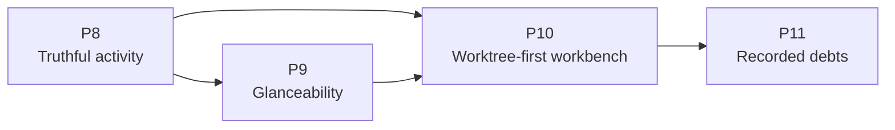

# Implementation Plan — Worktree-First Workbench

> **Consumer**: `asimov-plan` — reads one task, reads its linked design doc, scans the codebase, triages a lane, then writes `asimov/changes/<change-id>/`.
> **Rule**: tasks describe WHAT and WHERE, never HOW. No source-file paths, no function names, no test commands. (Design Ref links to `docs/` are the WHERE, and are required.)
> **Status lifecycle**: blueprint writes `todo` → asimov-plan sets `in_progress` after Gate 2 → asimov-build sets `done` after implementation approval.

**Scope**: the remaining Worktree-view work identified by
`docs/audit/2026-08-29-worktree-ui-vs-orca.md` — the truthfulness ceiling on inferred activity,
the glanceability findings, and the worktree-first workbench redesign.

Phase 11 extends that scope once: the review debts the audit did not raise and the redesign
accumulated — findings adjudicated valid, deferred with reasons, and left without an owner.
[worktree-subsystem-debts.md](design/worktree-subsystem-debts.md) records them and the ones
deliberately deferred again.

`docs/PLAN.v4.md` is the shipped record of WT phases 0–7 (discovery, panel shell, live tree,
agent presence, actions, hook pipeline, hardening). Its task IDs remain the tracker keys for
that work; this plan continues the same `WT` epic from Phase 8 and Stage 6.

Closed by the change archived as `restore-view-affordances` and not re-planned here: the
`[hidden]` CSS reset (audit § A1), the `here` → `open` pill rename (§ E1), routing the Worktree
view and the vault session list through the delegated tooltip widget (§ E2), and § D1, which was
the same CSS fix. Audit § B6 (a possibly duplicated agent row) was **dropped by the user** without
reproduction and is not planned. Audit § C is deferred by design, not debt.

## Sync contract

Task heading is `### [WT-<NNN>.<M>]` — epic code, three-digit phase number, task number. The ID is
the tracker sync key: it goes in the issue title and never changes once an issue exists, even when
the task moves phase.

| Field | Type | Notes |
|-------|------|-------|
| **Epic** | code | Carried by the ID prefix; one per plan. `WT` here |
| **Goal** | 1–2 sentences | What this task produces |
| **Design Ref** | links | The section that specifies it |
| **Depends On** | ID list | Comma-separated, or `None`. Becomes `blocked-by` |
| **Stage** | 6–7 | Ship order — what the user can do once it lands. Cuts across phases. Becomes the GitHub milestone |
| **Size** | XS / S / M / L / XL | Complexity + review load, not duration. XS: one concern, no contract change. S: one concern with its own tests/edge cases. M: feature slice across a few modules, or one new contract. L: cross-boundary, security-sensitive, or a heavy acceptance list. XL: split it |
| **Labels** | slug list | `new-api-contract`, `data-migration`, `security-privacy`, `infra`, `new-dependency`, `cross-boundary`, `user-visible-ui`, `re-review`. Or `None` |
| **Notes** | optional | Risk or reuse signal `asimov-plan` cannot see before reading code. Omit when nothing applies |
| **Acceptance** | `; `-separated | Observable outcomes only — the mechanism lives in the design doc. Each item becomes one checklist entry on the issue |
| **Status** | todo / in_progress / done | |

Phase = build order; Stage = ship order; `Depends On` is the only structural relation;
`Stage(task) ≥ Stage(dep)`.

## Design References

| Doc | Scope |
|-----|-------|
| [DESIGN.md](DESIGN.md) § 8–10 | Subsystem architecture, decisions, consistency registry |
| [design/worktree-panel-ui.md](design/worktree-panel-ui.md) | Panel body, two-level toggle, row anatomy, idle tail, inspector, state vocabulary |
| [design/worktree-scope.md](design/worktree-scope.md) | Scope model, the tab-bar filter, the All chip and its attention badge, layout by location |
| [design/worktree-activity-ceiling.md](design/worktree-activity-ceiling.md) | The confirmation ceiling on inferred `running` |
| [design/worktree-actions.md](design/worktree-actions.md) § 3.2.1–3.2.2 | Create form presentation and where create is offered |
| [design/worktree-agent-presence.md](design/worktree-agent-presence.md) | Evidence model the rows and the scope join both read |
| [design/worktree-subsystem-debts.md](design/worktree-subsystem-debts.md) | Recorded review debts, their triage lines, and the decisions each still owes |

**Reference artifact**: `docs/ui/worktree.html` is the visual reference for Phase 10. It is
uncommitted at the time of writing and **cannot render** — its entire `wk-*` design language
lives in a `worktree-workbench.css` that exists nowhere in the repo. Commit it as the reference
only once it renders standalone; a reference no reviewer can open is not one. Where it and a
design doc disagree, [worktree-panel-ui.md](design/worktree-panel-ui.md) § 7.7 records the
resolution.

## Phases Overview

| Phase | Est. | Key Deliverable |
|-------|------|-----------------|
| P8 — Truthful activity | ~2-3d | Every state is legible by shape, and a row stops spinning once nothing has confirmed it |
| P9 — Glanceability | ~4-6d | The list surfaces the two worktrees that matter, each row says what just happened, and creating one is a worktree question rather than a git one |
| P10 — Worktree-first workbench | ~9-13d | Selecting a worktree scopes the surface to it — built behind a setting, which WT-010.6 retired once the composition was whole |
| P11 — Recorded debts | ~8-12d | One rule per concept: containment, promotion, a bounded look, what a row shows, what a lookup means, and who knows an entry is gone |

| Stage | What the user gets |
|-------|--------------------|
| 6 | A list that can be scanned in one second and rows that stop overstating |
| 7 | Pick a worktree and the workbench follows it |
| 8 | The same panel, holding up on a symlinked vault, a sleeping disk, and a deleted session |

> P10 is detailed here because its design is settled, not because it is next. Per the revision
> rule, reassess it against what P8 and P9 actually shipped before planning its first task.

---

## Phase 0 — Prerequisites

**Empty, deliberately.** This is a re-baseline of a shipped subsystem inside a released
extension. Every dependency — git, the built-in `vscode.git` extension, the hook runtime, the
release path — is already in place and already proven by the work in `docs/PLAN.v4.md`. There is
nothing to provision.

---

## Phase 8 — Truthful Activity

> **Goal**: the state vocabulary carries meaning by shape, and no row claims work on evidence that has stopped moving.

### [WT-008.1] State Legible by Shape

| Field | Value |
|-------|-------|
| **Goal** | Give every activity state its own shape in the tree, so working, waiting, idle, unknown, and exited are distinguishable at a glance and without colour |
| **Design Ref** | [worktree-panel-ui.md](design/worktree-panel-ui.md) § 7.2, § 3.2, § 3.3 |
| **Depends On** | None |
| **Stage** | 6 |
| **Size** | S |
| **Labels** | user-visible-ui |
| **Notes** | WT-002.1's acceptance already claimed "state is legible by shape alone"; at HEAD that holds for row kind, not for activity, which is the thing users scan for. This settles the glyph shapes § 7.6 leaves to the building task, and WT-008.2 adds one member to the vocabulary it establishes — do not settle five shapes in a way that leaves no room for a sixth |
| **Acceptance** | Each activity state renders a distinct shape on both the worktree row's leading glyph and the agent row's state glyph, using one vocabulary rather than two; `unknown` is distinguishable from `idle`, because one is an absence of evidence and the other is a positive claim; the shapes stay distinct with colour removed and under reduced motion, and no two states collapse to the same static form; the worktree row still shows the strongest state among its agents, by the documented precedence; the change moves no wire value and adds no field |
| **Status** | done |

### [WT-008.2] Confirmation Ceiling on Inferred Activity

| Field | Value |
|-------|-------|
| **Goal** | Stop a row animating `running` once its state has stood unchanged past the ceiling with nothing but terminal output behind it, degrading it to an unconfirmed claim rather than to idle |
| **Design Ref** | [worktree-activity-ceiling.md](design/worktree-activity-ceiling.md); [worktree-panel-ui.md](design/worktree-panel-ui.md) § 4, § 7.2, § 6.1; [DESIGN.md](DESIGN.md) § 8.4 (the ceiling invariant is added by this task) |
| **Depends On** | WT-008.1 |
| **Stage** | 6 |
| **Size** | M |
| **Labels** | user-visible-ui, re-review |
| **Notes** | Risk: this is a truthfulness fix, and the three obvious shortcuts are all wrong. Downgrading the activity to `idle` swaps one false claim for another and moves a value every consumer reads; measuring staleness from the row's last-activity stamp measures the very bytes the ceiling exists to see through. And the clock measures unchanged-activity age, not time since confirmation — the design says so explicitly, because describing it as the latter makes the doc promise a grace period the mechanism does not give. The design also **narrows** WT-004.0 rather than satisfying it whole, and that narrowing is the single most important thing for the review round to agree with |
| **Acceptance** | A row claiming `running` on output inference alone stops animating once its state has stood unchanged past the ceiling, and says how long and on what evidence; the claim degrades to unconfirmed and never to idle, and the activity value, the evidence tuple, and every message shape are unchanged; a row backed by a fresh agent report, an external registry row, and any state other than `running` are never marked unconfirmed at any age; a report arriving on a degraded row restores it on the same push, and a change of activity restarts the clock, while a change of *source* does not — a run already past the ceiling is unconfirmed the moment its report ages out, with no grace period; a clock that has not run, or that runs backwards, yields a confirmed row rather than manufacturing staleness; the view re-derives confidence on one scheduled deadline rather than an interval, re-arms it on every push and clears it on disposal, and performs no DOM work when the re-derivation moves nothing; the elapsed hint has no clock of its own; the unconfirmed and animated forms stay distinguishable under reduced motion; the ceiling invariant enters the truthfulness table with a test that goes red when it is violated |
| **Status** | done |

---

## Phase 9 — Glanceability

> **Goal**: the list answers "where is work happening" in one second, and the create dialog stops reading like git plumbing.

### [WT-009.1] Fold the Idle Tail

| Field | Value |
|-------|-------|
| **Goal** | Dim agentless worktrees to a single line and collapse them under one disclosure once there are enough of them to bury the worktrees that hold agents |
| **Design Ref** | [worktree-panel-ui.md](design/worktree-panel-ui.md) § 3.6, § 3 ordering, § 8 |
| **Depends On** | None |
| **Stage** | 6 |
| **Size** | S |
| **Labels** | user-visible-ui |
| **Notes** | This is the part of the reference's "hide sleeping" filter that pays for itself; the filter popover itself stays deferred, so resist growing filter state here. The trap is treating "no agents" and "no evidence" as the same thing — a worktree whose presence source failed is unknown, not idle, and folding it hides exactly what the degradation marker exists to show |
| **Acceptance** | Worktrees holding agents render in full and sort ahead of agentless ones, with the existing deterministic order inside each part; an agentless worktree renders as one dim line carrying its branch and marks and no presence block; from the documented threshold upward the agentless ones fold under a single disclosure stating an exact count of what it hides, and below it they stay visible; a worktree whose presence is degraded is never folded and never reads as agentless; a search match inside the fold opens it; the fold's state persists with the rest of the tree and survives a push that changed nothing |
| **Status** | done |

### [WT-009.2] Last-Activity Preview on Agent Rows

| Field | Value |
|-------|-------|
| **Goal** | Give each agent row a second line carrying the last thing that happened in that session, and move the model id off the row |
| **Design Ref** | [worktree-panel-ui.md](design/worktree-panel-ui.md) § 3.3, § 7.1, § 8 |
| **Depends On** | WT-008.1 |
| **Stage** | 6 |
| **Size** | S |
| **Labels** | user-visible-ui |
| **Notes** | Corrected at planning: the data does NOT already exist on the row. `WorktreeAgentRow` declares `preview` and the row renderer already draws it, but the presence projector never populates it, so the span is empty on every row. The vault session list renders no preview line either, so the reuse pressure this task was warned about is not there. Sourcing the content means reading transcript text the `agent-session-index` spec currently forbids reading beyond a bounded title preview — that decision is WT-009.5's, and this task keeps only the layout half. Two things to hold: the preview is decoration-stripped like every other title, and it is a render-signature input, so a preview that changes must repaint while a spinner frame must not. **Superseded in part**: the decoration-stripping half of that last sentence, and the spinner clause in Acceptance below, were reversed by WT-009.5 — a preview is message text, so a leading marker is content — and the stale spec requirement was retired by WT-011.4. The layout half stands |
| **Acceptance** | An agent row renders two lines — identity, marks and age above, its last-activity preview below — and never a third; neither line wraps and each truncates independently, the preview consuming none of the first line's width; a row with nothing to preview renders no empty second line and no placeholder; a spinner frame is neither displayed in the preview nor able to trigger a re-render; the model id no longer appears on any list row and is absent entirely when unknown; the age column and the leading glyphs never truncate. What fills the preview is WT-009.5's |
| **Status** | done |

### [WT-009.5] Fill the Preview Line With What the Session Last Did

| Field | Value |
|-------|-------|
| **Goal** | Give the agent row's preview line a real source, and settle what transcript-derived text a passive row is allowed to carry |
| **Design Ref** | [worktree-panel-ui.md](design/worktree-panel-ui.md) § 3.3, § 7.1; [worktree-agent-presence.md](design/worktree-agent-presence.md) |
| **Depends On** | WT-009.2 |
| **Stage** | 6 |
| **Size** | M |
| **Labels** | user-visible-ui, security-privacy |
| **Notes** | Split out of WT-009.2, which assumed this data was already on the row; it is not — the presence projector populates no preview at all. The nearest contract is the vault detail reader's `latestMessage` / `recentActivity`, but `agent-session-index` states that the bounded title preview is the ONLY transcript-derived value the system touches and forbids reading message bodies past it. Putting a last message on a passive row means that text crosses IPC on every presence scan and enters the render signature, so the spec clause is amended deliberately or the source is narrowed to hook-reported tool and turn state, which needs no amendment but leaves external and registry-only rows blank. A per-push transcript parse per row is the data-scale trap; whatever source wins is read through an index or a change-stamped cache, never re-parsed per scan. It also inherits WT-009.2's review finding W1: the shared `stripDecorations` treats a leading `- ` or `* ` as decoration, which is ordinary content in prose, so a bulleted preview loses its marker and a marker-only preview draws no line at all. Harmless while no row carries a preview; this task chooses the input and so is the only one able to size the pattern against it — either narrow the preview's stripper to unambiguous spinner frames or strip at read time where provenance is known, and cover `"* item"` and `"- item"`. **Privacy fork decided by the user (option A):** the index requirement is widened deliberately — a bounded last-activity line joins the bounded title preview as a transcript-derived value the index may carry. Nothing about egress changes; the `0o600` cache and the never-off-the-machine clause stand. Scoping this correctly matters: the same spec already lets the DETAIL path read message bodies (workflow agents, teammate turns, per-turn segments), so what moves is what a passively-refreshed LIST may hold, not whether bodies are read at all. The read is bounded by the transcript's mtime, not by the scan cadence — a scan that finds no newer file performs no read |
| **Acceptance** | Every row whose session the chosen source covers shows its last activity on the preview line, and a row the source does not cover shows nothing rather than a placeholder; a preview that opens with a bullet or a dash keeps the text a reader expects to see; the text is bounded and single-line at the point it is read, not at the point it is drawn; presence scans that find no new activity perform no additional transcript reads; whichever privacy position is taken is written into the owning spec rather than left implied by the code |
| **Status** | done |

### [WT-009.3] Create Form Reads as a Worktree Form

| Field | Value |
|-------|-------|
| **Goal** | Restructure the create dialog around the branch name, state the destination once, and reveal the agent block only when the user has asked for an agent |
| **Design Ref** | [worktree-actions.md](design/worktree-actions.md) § 3.2.1, § 3.2 |
| **Depends On** | None |
| **Stage** | 6 |
| **Size** | M |
| **Labels** | user-visible-ui |
| **Notes** | The path transparency is a safety property, not clutter — the host states the free path it will actually take before a filesystem write is authorized, and that must survive the restructure rather than be traded for tidiness. What changes is that it is stated once instead of twice, in a dialog whose own tree deliberately shows no path on any row. The always-visible agent block currently contradicts an "After creating: Nothing" selection sitting directly above it |
| **Acceptance** | The branch name is the lead input with nothing above it, and submission stays blocked until it validates; the resolved destination appears exactly once, shortened, with the exact value reachable without leaving the dialog, and a collision states the suffixed result without restating a full path; the agent block is absent unless the user chose to start an agent, and appears when they do, with the dangerous posture labelled and never preselected; base ref, branch source, and the path override live behind a collapsed advanced section; the host still supplies and displays the free path it will take before the action can be authorized; focus order, the focus trap, and dismissal behave as they did |
| **Status** | done |

### [WT-009.4] Create Is Offered Where the Intent Arrives

| Field | Value |
|-------|-------|
| **Goal** | Add a per-repo create control on group headers and a create action in the body of each empty state, alongside the existing toolbar button and context-menu item |
| **Design Ref** | [worktree-actions.md](design/worktree-actions.md) § 3.2.2; [worktree-panel-ui.md](design/worktree-panel-ui.md) § 3.1, § 5 |
| **Depends On** | WT-009.3 |
| **Stage** | 6 |
| **Size** | S |
| **Labels** | user-visible-ui |
| **Notes** | Four entry points, one dialog and one action behind them — a second create path is how the safety model acquires a hole. The header control must be reachable by keyboard, not hover only, or it is invisible to the users most likely to want it. A repo with only its main checkout is a distinct empty state from a workspace with no repo at all, and it is the one that needs the CTA — a workspace with no repository has nothing to create in, so it carries no create. Follow-up left open: the create-defaults request and its answer tell "open a form" from "update the open one" by whether a branch is present, a convention no type enforces; a `kind: "open" \| "update"` tag on both would |
| **Acceptance** | The group header offers create on hover and on keyboard focus, opening the form already scoped to that repo, and appears only where group headers are rendered; the empty state for a repository with only its main checkout carries the create action in the body, and the states describing nothing to create in — no folder, no repository, git unavailable, no match — offer none; the toolbar button and the context-menu item are unchanged; every entry point opens one dialog and runs one action, differing only in the repo it opens on; the toolbar button remains absent from every sessions body |
| **Status** | done |

---

## Phase 10 — Worktree-First Workbench

> **Goal**: selecting a worktree makes the surface about that worktree — its panes in the tab bar, its detail under the tree — behind one setting until the composition is whole.

### [WT-010.1] Scope a Surface's Tab Bar to the Selected Worktree

| Field | Value |
|-------|-------|
| **Goal** | Make selecting a worktree filter that surface's own tab bar to the panes inside it, named by a chip that can always be escaped |
| **Design Ref** | [worktree-scope.md](design/worktree-scope.md) § 2, § 3.1, § 3.2, § 3.4, § 6, § 7; [worktree-panel-ui.md](design/worktree-panel-ui.md) § 6.1, § 7.3, § 2.3; [DESIGN.md](DESIGN.md) § 8.4 (the hides-only-what-is-proven invariant is added by this task) |
| **Depends On** | WT-008.1 |
| **Stage** | 7 |
| **Size** | L |
| **Labels** | user-visible-ui |
| **Notes** | The redesign's thinnest end-to-end slice, so it lands first. It needs no new protocol: the workbench is already one webview document and pane→worktree attribution already reaches the view, so this is a filter over a list the extension owns. The risk is in what the filter hides — a pane whose directory is unknown or outside every worktree produces no presence row at all, and hiding it would make it unreachable from a tab bar the user cannot tell is filtered. Registers the rollout setting, which no manifest declares yet. The attention badge and the behaviour when a scope holds nothing are deliberately WT-010.2's, so a defect in either cannot hold this slice hostage |
| **Acceptance** | Selecting a worktree filters this surface's tab bar to its panes, and changes no other surface, no process, and nothing the host holds; a pane presence could not attribute stays visible in every scope, while one attributed elsewhere is hidden; a scope that is set is always named on screen, and the control that clears it is reachable whenever it is — including when the panel is collapsed; clearing the scope restores every tab it hid; the card treatment marks the selected worktree and only it, so emphasis no longer reads as selection where the user selected nothing; a removed or pruned scoped worktree drops the scope with a reason, while a `missing` one keeps it; scope persists per surface, absent means all, and an id no longer in the tree resolves to all; two surfaces hold different scopes with neither following the other; a push that changes no attribution performs no tab-bar DOM work; the hides-only-what-is-proven invariant enters the truthfulness table with a test that goes red when it is violated; everything here is inert while the rollout setting is off |
| **Status** | done |

### [WT-010.2] Nothing Hidden Goes Unheard

| Field | Value |
|-------|-------|
| **Goal** | Count the hidden panes that need a human on the escape control, and settle what a selection does to the active pane and to a scope holding nothing |
| **Design Ref** | [worktree-scope.md](design/worktree-scope.md) § 3.3, § 4.2, § 4.3; [DESIGN.md](DESIGN.md) § 8.4 (the no-invisible-filter invariant is added by this task) |
| **Depends On** | WT-010.1 |
| **Stage** | 7 |
| **Size** | M |
| **Labels** | user-visible-ui, re-review |
| **Notes** | This is the task that makes the filter safe, and it is separated from the filter itself so its correctness is reviewed on its own. Two traps: a badge that is always present is a badge nobody reads, and a count drawn from one evidence source under-reports, because the two sources covering `waiting` do not cover the same panes today. Selection is navigation here — pinning the active pane was considered and rejected in the design, because it creates an attribution outcome the join does not have and makes the empty-scope region unreachable in the common case |
| **Acceptance** | Hidden panes that are waiting raise a count on the escape control, from either evidence source, and no badge renders when there are none; clearing the scope from the badge yields a tab bar holding every pane the count named; the badge uses the same attention vocabulary a waiting row uses, not an error treatment; selecting a worktree activates its first in-scope pane, leaves an already-in-scope active pane where it is, and shows the empty-scope region when the scope holds none; the previously active pane keeps running across the change and returns when the scope is cleared; the empty-scope region offers the two things worth doing there, carries no error styling, and never clears the scope the user chose; the no-invisible-filter invariant enters the truthfulness table with a test that goes red when it is violated |
| **Status** | done |

### [WT-010.3] Two-Level Worktrees / Sessions Toggle

| Field | Value |
|-------|-------|
| **Goal** | Replace the four flat segments with a primary Worktrees / Sessions toggle, demoting Recent / Agent / Folder to a grouping control shown only inside Sessions |
| **Design Ref** | [worktree-panel-ui.md](design/worktree-panel-ui.md) § 2, § 2.1, § 2.2, § 2.3; [DESIGN.md](DESIGN.md) § 9 D28 |
| **Depends On** | WT-010.1 |
| **Stage** | 7 |
| **Size** | M |
| **Labels** | user-visible-ui |
| **Notes** | No migration exists to write: the two persisted keys are already independent and already carry these exact values, and inventing one would be the bug. The current label-dropping CSS is a symptom of the squeeze this removes, so it goes with it rather than surviving as dead style. Both control levels are tab-like and must keep their roles, labels, and keyboard semantics rather than becoming buttons that happen to look selected |
| **Acceptance** | One primary control switches the body and always shows both values labelled; the grouping control renders inside the sessions body and nowhere else; state written by an older build keeps its meaning with no migration and no key change; the default-body rule is unchanged — a persisted choice wins, otherwise a workspace with a repo opens on worktrees and one without opens on sessions; both levels expose tab semantics to assistive technology and are fully keyboard operable; the shipped four-segment control remains in place while the rollout setting is off |
| **Status** | done |

### [WT-010.4] Rail Composition and Layout by Location

| Field | Value |
|-------|-------|
| **Goal** | Give the panel and editor locations a two-column rail beside the terminal, and the sidebar a rail that collapses after a selection |
| **Design Ref** | [worktree-scope.md](design/worktree-scope.md) § 5; [worktree-panel-ui.md](design/worktree-panel-ui.md) § 2.3, § 7.1 |
| **Depends On** | WT-010.1, WT-010.3 |
| **Stage** | 7 |
| **Size** | M |
| **Labels** | user-visible-ui |
| **Notes** | One mechanism, two location-appropriate feels — not two implementations. The surfaces differ today only by a location attribute on the document, and that is the seam to use rather than a second layout path. The auto-collapse is a consequence of an explicit selection, never a timer, and must be reversible by the same control that performed it |
| **Acceptance** | The panel and editor locations render the rail beside the terminal region with both visible at once; the sidebar keeps the stacked layout and collapses the rail on an explicit selection, reversibly, staying expanded until the next selection once the user reopens it; scope behaves identically in every layout; the escape control survives a collapsed rail; layout animations respect reduced motion; the shipped layout is unchanged while the rollout setting is off |
| **Status** | done |

### [WT-010.5] Worktree Inspector Drawer

| Field | Value |
|-------|-------|
| **Goal** | Open a capped detail region under the tree on selection, carrying the worktree's path, actions, agents and their models, and its delegation history |
| **Design Ref** | [worktree-panel-ui.md](design/worktree-panel-ui.md) § 3.7, § 3.2, § 6; [worktree-actions.md](design/worktree-actions.md) § 2; [DESIGN.md](DESIGN.md) § 9 D29 |
| **Depends On** | WT-010.1, WT-009.2 |
| **Stage** | 7 |
| **Size** | L |
| **Labels** | user-visible-ui |
| **Notes** | Puts the model identifier back into the render signature: WT-009.2 removed it when the model left the list row, and the guard must key it again once the drawer draws it. Sized L rather than M: it carries an accessible drawer shell and its focus lifecycle *and* the action surface inside it, and the second is where the risk is. A drawer, not a body swap — at sidebar width, replacing the body makes selection destructive and forces a back control. Reuse pressure is high: every action it offers already has a handler and an id-resolving path, and growing a parallel set is the failure mode. It is also one of only two places a path is shown in full, so the no-path-on-a-row rule has to survive it |
| **Acceptance** | Selecting a worktree opens the drawer and scopes the tab bar from one gesture, and selecting another replaces its contents rather than stacking; the drawer is capped so the tree above stays visible and scannable; it shows the full path, and no list row gains one; every action it offers resolves host-side from an id and runs the same operation as the equivalent menu item, with external agents still never offered focus; the model id appears here and on no row; dismissal is explicit and leaves the scope alone; focus is trapped correctly, returns where it came from, and survives the drawer opening and closing; the drawer is absent while the rollout setting is off |
| **Status** | done |

### [WT-010.6] Default the Workbench On

| Field | Value |
|-------|-------|
| **Goal** | Flip the rollout setting's default, retire the gate, and remove the superseded control and layout it was protecting |
| **Design Ref** | [worktree-panel-ui.md](design/worktree-panel-ui.md) § 2.3; [DESIGN.md](DESIGN.md) § 10 |
| **Depends On** | WT-010.1, WT-010.2, WT-010.3, WT-010.4, WT-010.5 |
| **Stage** | 7 |
| **Size** | S |
| **Labels** | user-visible-ui, re-review |
| **Notes** | The gate's purpose ends when the composition is whole; leaving it registered leaves two supported layouts to test forever. Removing the old control is the point of the task — a flag flipped but never cleaned up is how a codebase acquires a permanent second UI. Verification requirement, not an observable outcome: no dead style, state key, or unreachable branch is left behind for the retired path, which the review round confirms by reading the diff |
| **Acceptance** | The workbench composition is what a user sees with no setting configured; the superseded four-segment control and the layout branch it guarded are gone rather than merely unreachable; a user who had explicitly set the flag either way lands on the workbench rather than on a path that no longer exists; the registry and the design docs no longer describe the setting as live |
| **Status** | done |

---

## Phase 11 — Recorded Debts

> **Goal**: the subsystem holds one rule per concept rather than one per call site. Every task
> here closes a finding review already adjudicated valid and then deferred with a written reason —
> see [worktree-subsystem-debts.md](design/worktree-subsystem-debts.md) for each one's triage line.
> Nothing here changes what the panel presents when everything is healthy, which is what makes the
> phase reviewable as hardening rather than as feature work.

### [WT-011.1] Containment That Survives a Symlink

| Field | Value |
|-------|-------|
| **Goal** | Every vault path resolver decides containment on resolved paths rather than on strings, so a symlink inside the root cannot resolve outside it |
| **Design Ref** | [worktree-subsystem-debts.md](design/worktree-subsystem-debts.md) § 2.1; [DESIGN.md](DESIGN.md) § 8.5, § 9 D31 |
| **Depends On** | None |
| **Stage** | 8 |
| **Size** | M |
| **Labels** | security-privacy, cross-boundary, re-review |
| **Notes** | Deferred as repo-wide work precisely because fixing one resolver leaves it the only site with a different rule. Tolerance is load-bearing in one direction only: a resolver that hard-fails on a missing file turns "no transcript yet", the normal early state of a session, into an error — but a resolver that treats *any* resolution failure as absence leaves the hole open through a dangling link. The repo's existing tolerant realpath helper is the wrong tool for that reason: it is an availability helper for naming worktrees, not an authority for reading files |
| **Acceptance** | A candidate reached through a symlink that escapes the root is refused, at every vault resolver — including the one that reaches transcripts by listing a directory rather than by resolving an id; a candidate legitimately inside the root is still accepted when its own tail does not exist yet; a candidate the filesystem declines to resolve for any other reason is refused rather than compared literally; no resolver keeps a second containment rule |
| **Status** | done |

### [WT-011.2] One Definition of a Window's First Row-Drawing Surface

| Field | Value |
|-------|-------|
| **Goal** | The transition to "this window draws rows" is defined in one place, and every boundary that reaches that state routes through it |
| **Design Ref** | [worktree-subsystem-debts.md](design/worktree-subsystem-debts.md) § 2.2; [DESIGN.md](DESIGN.md) § 9 D32 |
| **Depends On** | None |
| **Stage** | 8 |
| **Size** | S |
| **Labels** | re-review |
| **Notes** | The only debt with no round file of its own — carried as a follow-up note from the subscription-seam fix. The concept decides whether a window subscribes to presence at all, and spelled inline it has already drifted at two boundaries. Adding the missing branches would reproduce the defect; the fix is an owner. Boundary: this does not change WHEN a window subscribes, only which boundaries are recognised as reaching the same state |
| **Acceptance** | A window that gains its first row-drawing surface is promoted regardless of which boundary it arrives through; the boundaries previously missed are covered by tests naming them; no site decides the transition on its own inline rule |
| **Status** | done |

### [WT-011.3] A Transcript Look That Cannot Hang

| Field | Value |
|-------|-------|
| **Goal** | A transcript read is time-bounded, and a look that times out is treated as a look that achieved nothing rather than as a result or an error |
| **Design Ref** | [worktree-subsystem-debts.md](design/worktree-subsystem-debts.md) § 2.3; [DESIGN.md](DESIGN.md) § 9 D33 |
| **Depends On** | None |
| **Stage** | 8 |
| **Size** | M |
| **Labels** | re-review |
| **Notes** | Deferred as "a new failure-surface decision rather than remediation", which is the whole task: a timeout has to fail in a direction, and the direction is soft. The cadence gate bounds how often a look starts, never how long one takes, so a stalled network mount or a sleeping volume holds its slot forever. The cache cap belongs here too, but only its own half: eviction currently releases a session whose look is still stalled, so the next ask launches a second read against the same hung path — the bound on outstanding work has to survive eviction, which is why it cannot be split from the timeout. Bounding the *count* of looks a single projection provokes is a different owner and became WT-011.7 |
| **Acceptance** | A read against an unresponsive path abandons within a bound instead of blocking the look; a timed-out look backs off through the existing retry ladder, is not recorded as a resolution, and commits nothing it goes on to observe; a row whose transcript timed out keeps its last known line rather than blanking; outstanding reads stay bounded however many rows ask and whatever the cache evicts |
| **Status** | done |

### [WT-011.4] A Row Never Says the Same Thing Twice

| Field | Value |
|-------|-------|
| **Goal** | A row's preview is suppressed when it repeats the row's own title, so a one-message session does not present the same sentence twice |
| **Design Ref** | [worktree-subsystem-debts.md](design/worktree-subsystem-debts.md) § 2.4; [worktree-panel-ui.md](design/worktree-panel-ui.md) § 3.3; [DESIGN.md](DESIGN.md) § 9 D34 |
| **Depends On** | None |
| **Stage** | 8 |
| **Size** | S |
| **Labels** | user-visible-ui |
| **Notes** | Deferred as "needs a decision, not a patch" — neither the spec nor the preview design carries a rule about what a row shows when two of its lines agree. The decision is exact equality after the normalization the title already receives, never similarity: a near-match still carries something the title did not, and hiding it would replace a redundancy with a worse lie. Every session is a one-message session at its first render, so this is the common case rather than an edge one |
| **Acceptance** | A row whose preview exactly matches its title presents the title alone; a row whose preview differs by any amount presents both; a session that gains a second message regains its preview line |
| **Status** | done |

### [WT-011.5] A Preview Outlives Nothing

| Field | Value |
|-------|-------|
| **Goal** | A preview line is retired when the vault entry that sourced it is gone, while a transcript that is merely unreadable keeps its line |
| **Design Ref** | [worktree-subsystem-debts.md](design/worktree-subsystem-debts.md) § 2.5; [DESIGN.md](DESIGN.md) § 9 D35 |
| **Depends On** | WT-011.3, WT-011.8 |
| **Stage** | 8 |
| **Size** | S |
| **Labels** | re-review |
| **Notes** | **Re-scoped at planning, after oracle review**: the mechanism this task assumed does not exist. `getEntry` returns `null` for a deleted entry and for a failed reader alike, so "the service treats a failed re-resolve as a deletion" would retire a live row's line on a transient SQLite error. The conclusive `found | absent | unknown` signal is a change to the vault readers' contract and its own invariant owner, split out as WT-011.8. Also corrected: the clause promising an *unreadable* transcript keeps its line over-read its own citation — § 2.3 grants that to a look that times out, while a read that fails outright already retires the line, as `worktree-agent-presence` requires and two shipped tests assert. This task no longer touches that behaviour. Original deferral reason follows. Deferred because the obvious fix — handing the projector's live entry-id set to the service — moves ownership a shipped decision assigned elsewhere. The chosen owner is the service itself: it already re-resolves on cadence and already separates "not there yet" from "never will be", so a vanished entry is a third outcome named where the syscall already happens, with no cross-layer push and no second definition of "live". Depends on WT-011.3 because both change how a failed look is classified, and classifying deletion before timeouts fail soft would make the two rules contradict |
| **Acceptance** | A row whose vault entry is conclusively absent stops presenting its preview and stops provoking filesystem work, recovering if the entry reappears; a row whose lookup is merely inconclusive keeps its last known line and re-checks on a later tick; the retirement happens on the first eligible look after the confirmation interval, not on a wall-clock deadline the service cannot honour while a look is outstanding; the outcomes are distinguishable in the service rather than inferred by the caller; no live-entry set is pushed across the layer boundary |
| **Status** | todo |

### [WT-011.6] Worktree Attribution That Survives a Symlink

| Field | Value |
|-------|-------|
| **Goal** | The comparisons that decide which worktree or repository a path belongs to agree with where that path actually resolves |
| **Design Ref** | [worktree-subsystem-debts.md](design/worktree-subsystem-debts.md) § 2.1; [DESIGN.md](DESIGN.md) § 9 D31 |
| **Depends On** | WT-011.1 |
| **Stage** | 8 |
| **Size** | M |
| **Labels** | cross-boundary |
| **Notes** | Surfaced while planning WT-011.1, which established the rule and scoped itself to the resolvers that gate a transcript read. Five further sites compare raw workspace-folder, Git API, pane-cwd and webview paths lexically — the same error with a different consequence: a session whose cwd resolves elsewhere is attributed to the wrong worktree, and repository discovery can pick the wrong root. Held back from WT-011.1 deliberately: none of them authorizes a read, several run per push, and "attribution is wrong" is a different acceptance story from "a read escaped the store". Whether the fix is resolution at these sites or resolution once at the boundary that produces the paths is the decision this task owns |
| **Acceptance** | A pane whose cwd resolves outside a worktree is not attributed to it, and one that resolves inside it still is, whatever either spells; repository discovery picks the root a path resolves into; the per-push paths do not gain an unbounded syscall per comparison; no site keeps a private copy of the containment rule |
| **Status** | in_progress |

### [WT-011.7] A Projection Tick Provokes Bounded Work

| Field | Value |
|-------|-------|
| **Goal** | One projection provokes a bounded number of transcript reads, whatever the window draws |
| **Design Ref** | [worktree-subsystem-debts.md](design/worktree-subsystem-debts.md) § 2.3; [DESIGN.md](DESIGN.md) § 9 D33 |
| **Depends On** | WT-011.3 |
| **Stage** | 8 |
| **Size** | S |
| **Labels** | none |
| **Notes** | Split out of WT-011.3 once the code was visible. WT-011.3 bounds how long one look may take and how many may be outstanding at once, both of which the preview service owns. It cannot bound how many a projection starts in total: the projector enriches one worktree's rows and awaits them before starting the next, so a service-side concurrency limit is never reached and every row still costs a look. The decision this task owns is whether the projector fans its preview requests out in one wave so the service's own limit gates the whole projection, or carries an explicit per-projection budget — a fan-out shape the projector owns, not the preview service |
| **Acceptance** | A projection over many worktrees provokes a bounded number of transcript reads rather than one per row; rows the bound excludes keep their last known line and are re-checked on a later tick rather than dropped; the bound holds whether the rows are spread across many worktrees or concentrated in one |
| **Status** | todo |

### [WT-011.8] A Vault Lookup That Knows Absent From Unknown

| Field | Value |
|-------|-------|
| **Goal** | A caller asking the vault for one session gets a conclusive answer — the entry is there, it is gone, or the question could not be answered — instead of one `null` meaning all three |
| **Design Ref** | [worktree-subsystem-debts.md](design/worktree-subsystem-debts.md) § 2.5; [DESIGN.md](DESIGN.md) § 9 D36 |
| **Depends On** | none |
| **Stage** | 8 |
| **Size** | M |
| **Labels** | new-api-contract |
| **Notes** | Split out of WT-011.5 at planning, when the oracle showed its central claim was untrue of the code: every reader collapses "no such session" and "I could not look" into the same `null`, and `codexReader.ts` says so in a comment. Any caller that treats absence as actionable is therefore acting on a guess, and WT-011.5 would have acted on it by blanking a live row. The readers already hold the distinction internally — an empty result set is absent, a thrown query or an unparseable file is unknown — so the work is surfacing what they know across `VaultService` and its wiring, not adding a probe. Its own invariant owner (the lookup contract) and independently testable, which is why it is a task rather than remediation folded into WT-011.5. Scope discipline: this widens one lookup's answer, it does not revisit how entries are built or cached |
| **Acceptance** | A lookup for a session the store never had, and for one whose file was deleted, both report absent; a lookup during a reader failure — an unreadable database, an unparseable transcript, a thrown query — reports unknown and is never mistaken for absent; every existing caller keeps its current behaviour, treating anything other than a found entry the way it treats `null` today; the distinction holds for each supported agent source |
| **Status** | done |

### [WT-011.9] A Reused Snapshot Answers For A Store It Can Still Read

| Field | Value |
|-------|-------|
| **Goal** | The reused and freshly-taken read paths give the same status for a store whose readability has changed |
| **Design Ref** | [DESIGN.md](DESIGN.md) § 9 D31 |
| **Depends On** | None |
| **Stage** | 8 |
| **Size** | S |
| **Labels** | security-privacy |
| **Notes** | Raised as W4 in `snapshot-a-live-store-atomically` cycle 2 round 4 and parked there as a decision rather than a patch. The presence check proves a store EXISTS (`fs.access` in its default mode) and the reuse gate proves its `(mtimeMs,size)` is unchanged; neither proves it can still be READ. Revoke read permission on the database file and both keep succeeding, so a retained snapshot is served as `ok` while a cold read of the same store returns `db-unreachable`. The bytes were read lawfully when the snapshot was taken, so this is a status-contract divergence rather than a disclosure — but two paths answering one question differently is what the status vocabulary exists to prevent. The decision this task owns is WHERE the proof belongs, and each candidate moves an accepted contract: proving `R_OK` in the presence check changes what separates `no-db` from `db-unreachable`; folding access state into the generation adds a third input to a two-input proof and costs a syscall per reuse; proving it only at the pool boundary splits the contract across two owners. Existing coverage revokes DIRECTORY search permission, which fails earlier and never reaches this boundary |
| **Acceptance** | A store whose read permission is revoked reports the same status through a reused snapshot as through a fresh one; the reuse path does not gain a syscall per hit unless that is the decision recorded; file-level permission revocation is covered for both entry points, not only directory-level |
| **Status** | todo |

---

## Deferred

- ~~Cross-surface scope sync~~ — deferred per DESIGN.md § 9 D25. Technically supported by the existing host-as-hub RPC, but panes belong to one surface, so a rail driving another surface needs a *primary terminal surface* concept and a multi-panel fan-out policy. Revisit as an opt-in setting holding one host-side scope every surface follows, which needs no primary.
- ~~An editor tab per worktree~~ — deferred per DESIGN.md § 9 D25. Closest to the reference's feel, but it proliferates tabs and the editor surface is second-class today; that debt is paid before any default UX bets on it. Acceptable later as a manual "Open worktree as tab" action, never as the selection default.
- ~~Sharing activity confidence with the terminal tab~~ — deferred per DESIGN.md § 9 D27. The tab's indicator claims the terminal is producing output, which stays true past the ceiling. Sharing the confidence would mean widening a shipped protocol union and adding an emitter for a surface whose claim is not false. Revisit if that indicator is ever restated as a claim about work.
- ~~Group-by / sort-by / visibility filter popover~~ — still deferred. WT-009.1 takes the one part of "hide sleeping" that pays for itself with no filter state; the popover itself remains a response to a scale this view does not have.
- Everything else deferred for the worktree subsystem stays recorded in `docs/PLAN.v4.md` and is not restated here.

---

> **Sync rules**:
> - Every edge in the Phases Overview corresponds to at least one task's `Depends On`, and every cross-phase `Depends On` appears as an edge.
> - Every task's `Stage` is ≥ the `Stage` of everything it depends on.
> - Task goal/acceptance text must not reference concepts that were changed or removed in the design docs.
