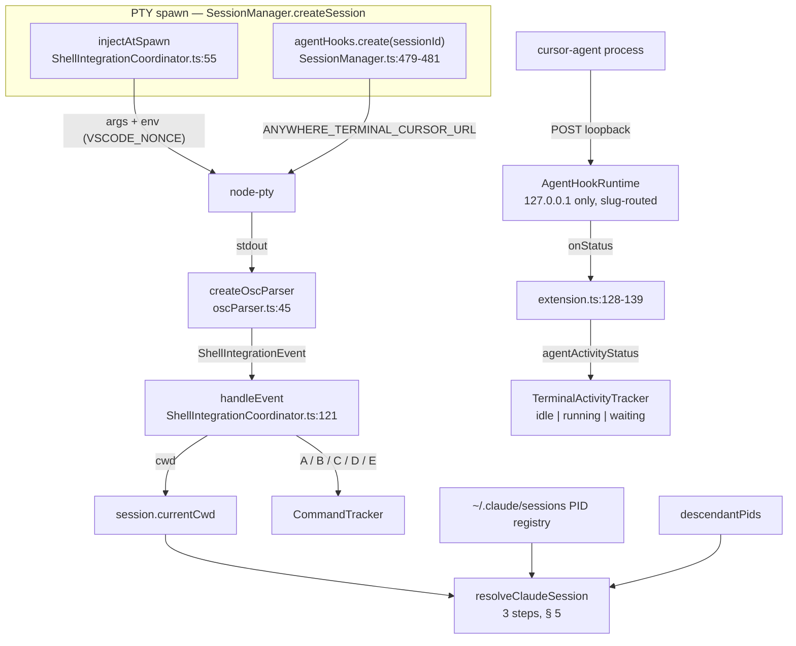
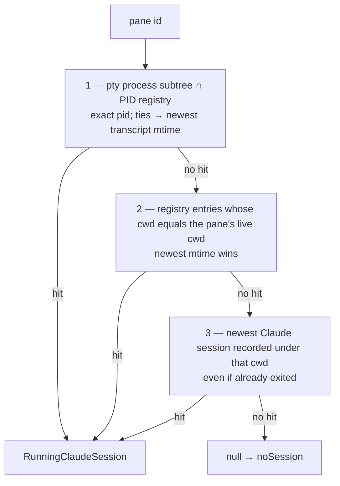
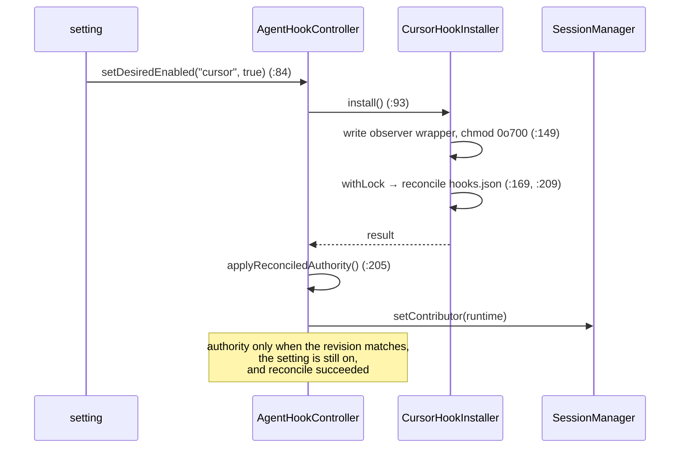

# Agent-CLI Integration Design

> **Scope**: how a terminal pane learns that an **agent CLI** is running inside it and what
> that agent is doing right now. Covers `src/cursor/` (8 files), `src/pty/`
> (`ShellIntegrationInjector.ts`, `ShellIntegrationEvents.ts`, `oscParser.ts`,
> `processTree.ts`, `processCwd.ts`), `src/session/ShellIntegrationCoordinator.ts` and
> `resolveClaudeSession.ts`, and the activity projection in `src/webview/terminal/`.
>
> The stored-transcript side of the same agents is [vault.md](vault.md) and
> [vault-readers.md](vault-readers.md).

## 1. Goals and Constraints

**Goals** — know *which* stored session a live pane belongs to, and *what state* the agent
in it is in, without the extension ever interrogating, wrapping, or slowing the agent.

Three evidence channels answer three different questions, and they never merge into one
mechanism. Each is independently disableable and independently useless without the others.

| Channel | Answers | Authority | Direction |
|---------|---------|-----------|-----------|
| Shell integration (OSC 7 / 633) | where the shell is, what it ran, when it finished | the shell | push |
| Cursor hooks (loopback HTTP) | is the Cursor agent working or idle | the agent | push |
| Claude PID registry | which stored session this pane is running | the filesystem | pull |

**Constraints**

| Constraint | Consequence |
|-----------|-------------|
| We do not own the agent process | every path is **fail-open**: a stopped extension must never block or slow an agent (§ 6, § 9) |
| We edit a config file the user also edits | ownership is exact and reconciliation is atomic under a lock (§ 6.1) |
| Terminal bytes are attacker-controlled | OSC markers carry a nonce and validation is *reported*, never assumed (§ 3) |
| Hook payloads contain the user's prompts | reason codes only; no payload is logged, cached, or persisted (§ 7.2) |
| Detection must not cost the UI | one bounded `ps` / `lsof` per call, 500 ms cap, no background polling (§ 5.2) |
| The feature is opt-in and off by default | with the setting off there is no wrapper, no listener, no config entry (§ 9) |

## 2. Overview

The left column is spawn-time setup, the middle is the push channels, the right is the two
consumers: a pane's live cwd/command state, and its resolved Claude session.

## 3. Shell-Integration Injection

`injectShellIntegration` (`ShellIntegrationInjector.ts:76`) rewrites a spawn's args and env
so VS Code's own (MIT-licensed) shell-integration script loads. It returns `null` — "spawn
unmodified" — when there is no injector context, the shell is unrecognised, or the user
opted out.

| Shell | Mechanism | Line |
|-------|-----------|------|
| bash | `--init-file` pointing at a temp copy of the script | `:139-152` |
| zsh | a temp `ZDOTDIR` holding four mapped scripts; the original is preserved as `USER_ZDOTDIR` | `:156-186` |
| fish | `--init-command` sourcing the script | `:190` |
| pwsh | `-noexit -command` dot-sourcing the script | `:204` |

**Opt-outs are honoured**: bash with both `--noprofile` and `--norc` (`:90`) and pwsh with
`-noprofile` (`:107`) spawn untouched. `scrubLeakedEnv` (`:130`) deletes
`VSCODE_SHELL_INTEGRATION` and `VSCODE_ZDOTDIR` inherited from an outer VS Code, so a nested
shell cannot double-inject.

Env contract: `VSCODE_NONCE` for every injected shell — it is what makes an OSC 633 `E`
marker trustworthy (§ 3.1) — and `VSCODE_INJECTION=1` for bash and zsh only.

Cleanup callbacks are held per session and run on dispose
(`ShellIntegrationCoordinator.ts:68,87`); `cleanupAll` (`:104`) runs them on SessionManager
teardown. Both are best-effort and never throw — the OS temp sweeper is the backstop.

## 4. OSC Parsing

`createOscParser` (`oscParser.ts:45`) is a streaming parser over PTY stdout carrying at most
`MAX_PENDING = 4096` bytes for a sequence split across chunks (`:21`). It exposes `setNonce`
(`:50`) and `feed` (`:53`).

| Sequence | Emitted event | Line |
|----------|---------------|------|
| OSC 7 | `cwd` | `:187` |
| OSC 633 `A` | `promptStart` | `:211` |
| OSC 633 `B` / `C` | `commandStart` | `:211` |
| OSC 633 `D[;code]` | `commandEnd(exitCode)` | `:211`, parse at `:292` |
| OSC 633 `E;cmd[;nonce]` | `commandLine(commandLine, nonceValid)` | `:211` |
| OSC 633 `P;Cwd=…` | `cwd` | `:273` |

The event union is `ShellIntegrationEvents.ts:19`.

### 4.1 Two safety rules

- **`nonceValid` is reported, never assumed.** An `E` marker with no nonce, or the wrong
  one, still produces a `commandLine` event — flagged invalid — so a hostile program echoing
  OSC 633 cannot forge a trusted command line, and the consumer decides what untrusted
  means.
- **A cwd must survive validation.** `emitCwdIfValid` (`:347`) requires an absolute path,
  resolves it, and rejects control characters (`CONTROL_CHARS`, `:344`); `unescapeOscValue`
  (`:312`) runs first.

`handleEvent` (`ShellIntegrationCoordinator.ts:121`) is the only reducer: `cwd` routes to
the session-level cwd store, everything else to that session's `CommandTracker`. The session
is resolved **lazily per event** (`:76,122`), so the sink survives a transient lookup race
and a destroyed session.

## 5. Detecting a Running Agent

### 5.1 Resolution

`resolveClaudeSession` (`resolveClaudeSession.ts:50`) maps a pane to the Claude session
inside it. Headless sessions are filtered out **before** any step runs (`:58`), so a
background `sdk-cli` process can never win a tie against the interactive one the user is
looking at.

The steps run strictly in order — process evidence, then live-cwd evidence, then
on-disk-history evidence — each weaker than the last, and the first hit wins. Documented at
`resolveClaudeSession.ts:2-7`, implemented at `:61-72`, `:80`, `:85`.

The registry itself is described in [vault-readers.md](vault-readers.md) § 10: strict
`<pid>.json` names, a signal-0 liveness probe where `EPERM` counts as alive, an allow-list
for headless entrypoints, and an empty list rather than a throw on any failure.

### 5.2 Process subtree and cwd

| Helper | Behaviour | Limits |
|--------|-----------|--------|
| `descendantPids` (`processTree.ts:79`) | one `ps` on darwin and linux; **every other platform returns `[]`** (`:83-95`) | `PS_TIMEOUT_MS = 500` (`:15`); no cache, one `ps` per call |
| `queryProcessCwd` (`processCwd.ts:46`) | `/proc/<pid>/cwd` on linux; `lsof` on darwin | `LSOF_TIMEOUT_MS = 500` (`:16`) |
| `sanitize` (`processCwd.ts:74`) | rejects a trailing `" (deleted)"`, control characters, and any non-absolute path | — |

Because `descendantPids` is a no-op on Windows, step 1 never fires there and detection falls
through to the cwd steps — degraded, but never wrong.

### 5.3 Consumer

`TerminalViewProvider.subagentResolveDeps` (`:764-797`) wires SessionManager and the Claude
readers into these dependencies. A pane's cwd preference is **live OS query →
shell-integration-tracked cwd → spawn cwd** (`:767-770`) — the same order the vault's "This
folder only" filter uses (`:705-712`), so a pane and its vault row never disagree about
where they are.

## 6. Cursor Hooks — Install Lifecycle

Off by default: `anywhereTerminal.cursorAgent.hooks.enabled`, `machine` scope, default
`false` (`package.json:101-106`). `extension.ts:116-167` reads it, builds the controller,
subscribes to configuration changes, and awaits `start()`.

`AgentHookController` serializes every transition per agent (`AgentHookController.ts:132,205`),
so a stale async result can never restore access after the setting was turned back off;
`revokeAgent` (`:226`) is the inverse. The contributor itself is an aggregate: it detaches only
when the last authoritative agent goes away, so disabling one agent never revokes another's
live panes (generalize-agent-hook-runtime D6).

### 6.1 What is written to disk

| Artefact | Content | Line |
|----------|---------|------|
| `~/.cursor/hooks.json` | one entry per event, each a command plus a 2 s timeout | `CursorHookInstaller.ts:293` |
| an observer wrapper under global storage (`.sh` posix / `.cmd` win32) | the script those entries invoke | `:280` |

Twelve events are registered (`CURSOR_HOOK_EVENTS`, `:6-19`). Reconciliation is
read → clone → change → verify unchanged → atomic replace (`:209`), under a lock file beside
the config (`:169`) with a 25 ms poll, a 1 s wait ceiling, a 30 s stale-lock threshold, and 3
attempts (`:53-57`).

**Ownership is exact.** `isOwnedEntry` (`:297`) matches only an object with exactly the two
keys `ownedEntry` writes, so uninstall removes ours and leaves the user's own hooks intact.
`isSupportedDocument` (`:308`) requires a known version and an object `hooks` map — an
unrecognised document is left byte-identical rather than rewritten.

The wrapper is chmod `0o700` on posix; on Windows it is probed and accepted only if it exits
0 and prints an empty JSON object (`:149`). Both wrappers (`:338`, `:354`) POST to the URL in
`ANYWHERE_TERMINAL_CURSOR_URL`, are **fail-open**, and always print an empty object — so a
stopped extension, a closed port, or a network error never blocks the agent.

## 7. Cursor Hooks — Runtime

`AgentHookRuntime` binds one HTTP server to `127.0.0.1` on an OS-assigned ephemeral port
(`:161`, port `0` by default `:134`), shared by every registered agent and routed by the
third path segment to that agent's module in `src/agentHooks/agents/`.

### 7.1 Per-session authority

`create(sessionId)` (`:175`) mints a fresh random token, invalidating any prior token and
state for that id, and returns exactly one environment variable whose value is a loopback URL
carrying the session id and token as path segments (`:188-189`).

SessionManager merges that env **last** into the spawn (`SessionManager.ts:474-478`), so a
per-session override cannot shadow it, and re-mints on every PTY incarnation. A spawn failure
releases the authority immediately (`:482`).

Swapping the contributor — including to `undefined` — first releases **every** tracked
session through the *old* contributor (`:253-264`), so a token minted while attached can
never go live later by re-attaching without a fresh PTY. `releaseCursorHookAuthority`
(`:1435`) also posts an `agentActivityStatus` with a null agent and state, clearing the
pane's badge.

### 7.2 Request handling

`parseHookPath` (`:466`) requires exactly three path segments whose last is the literal
`cursor`. The token is compared with `constantTimeEquals` (`:484`). `resolveLiveSession`
(`:214`) re-checks enabled + registration + token **at the moment of use**, not at auth time,
so revocation takes effect on the next request rather than the next spawn.

| Guard | Value | Line |
|-------|-------|------|
| Body cap | 1 MiB | `:36` |
| Request deadline | 5 s | `:37` |
| Dedup TTL / max entries | 5 min / 256 | `:40-41` |

Dedup is by hash of the body, per session (`:340`). Diagnostics are **reason codes only**
(`:23-34`) — no hook payload is ever logged — and a session is identified in them by its last
six characters (`sessionSuffix`, `:499`).

### 7.3 Event to semantic state

`EVENT_EFFECTS` (`:46-59`) is the source of this table; effects are applied by `applyEffect`
(`:376`).

| Effect | Events | Result |
|--------|--------|--------|
| `clear` | `sessionStart` | cancel timers, state → `null` |
| `working` | the eight before/after tool, shell and MCP events | cancel the quiet timer, state → `working`, re-arm freshness |
| `quiet` | `afterAgentResponse`, `stop`, `sessionEnd` | (re-)arm a single cancelable 1.5 s window; on expiry state → `idle` |

| Timer | Value | Line |
|-------|-------|------|
| Quiet window | 1500 ms | `:38` |
| Freshness expiry | 30 min, then state → `null` | `:39`, armed at `:402` |

`quiet` arms rather than sets, because a tool call frequently follows a response within
milliseconds and a pane must not flicker. **No hook produces `waiting`** (`:43`); an unknown
event is ignored with the `unknown-event` reason code. `setState` (`:412`) suppresses no-op
transitions, so the webview only ever sees real changes.

## 8. Mapping to Terminal Activity Status

`onStatus` posts `agentActivityStatus`, but **only through the session's own live webview**
(`extension.ts:128-139`; a non-`live` session is dropped at `:130-132`). The message shape is
in `messages.ts:1213-1219`.

The webview projects three independent evidence bits into one status
(`TerminalActivityTracker.ts:112-128`):

| Evidence | Meaning | Set by |
|----------|---------|--------|
| `waiting` | an approval dialog is on screen | `hasCurrentCursorApproval` after a committed write (`main.ts:495-498`) |
| `semanticWorking` | hook state is `working` | `onAgentActivityStatus` (`main.ts:509-518`) |
| `outputActive` | PTY output within the last 1500 ms | `markOutput` (`TerminalActivityTracker.ts:33`, `idleDelayMs` default `:30`) |

| Precedence | Condition | Status |
|-----------|-----------|--------|
| 1 | `waiting` | `waiting` |
| 2 | `semanticWorking` **or** `outputActive` | `running` |
| 3 | otherwise | `idle` |

`waiting` outranks everything because a pane blocked on the user is not making progress no
matter how much it is printing. The vocabulary is
`TerminalActivityStatus = "idle" | "running" | "waiting"` (`TerminalActivityTracker.ts:1`).

Approval detection is deliberately narrow (`CursorApprovalDetector.ts`): it runs only when
the pane has **validated hook identity or an exact Cursor terminal title**
(`STRICT_CURSOR_TITLE`, `:16,52`), then scans the last 8 non-blank rows of the visible screen
for an approval prompt followed by at least two recognised choice lines, the last of which
must be the final line (`:20,81-97`). Hook identity is remembered per tab and dropped on a
null agent or on exit (`main.ts:100,511,515,520`).

## 9. Failure Behaviour and Edge Cases

| Condition | Behaviour |
|-----------|-----------|
| Hooks setting off | no wrapper, no config entries, no contributor, no listener |
| `hooks.json` unreadable or unsupported | left byte-identical; warning reason code, hooks stay off (`CursorHookInstaller.ts:308`) |
| Lock unavailable within the ceiling | reconcile reports failure; authority **not** granted (`:169`) |
| Wrapper probe fails on Windows | `probe-failed`; authority not granted (`:149`) |
| Runtime cannot bind | a warning; every pane continues without hook observability (`extension.ts:167-174`) |
| Extension stopped while the agent runs | the POST fails, the wrapper still prints `{}`, the agent proceeds (`CursorHookInstaller.ts:338,354`) |
| Bad path, bad token, oversized body, stale session | reason code, no state change (`AgentHookRuntime.ts:23-36`) |
| Duplicate body within the dedup TTL | ignored (`AgentHookRuntime.ts:480`) |
| No hook event for 30 min | state cleared; the pane falls back to output-derived activity (`agents/cursor.ts:11`) |
| Setting toggled while sessions are live | that agent loses its entitlement in every live session and a fresh spawn is required (`AgentHookRuntime.ts:193`); the contributor detaches, releasing every tracked session, only when no agent remains authoritative (`SessionManager.ts:255-266`) |
| Two panes running Cursor | distinct id + token; a status update reaches only its own pane (`AgentHookRuntime.ts:225`) |
| Approval dialog in a non-Cursor pane | ignored — the identity gate fails (`CursorApprovalDetector.ts:52`) |
| Shell unrecognised or opt-out flags present | injection returns `null`; the shell spawns exactly as configured (`ShellIntegrationInjector.ts:76,90,107`) |
| Nested VS Code shells | `scrubLeakedEnv` prevents double injection (`:130`) |
| A program echoes OSC 633 `E` | `nonceValid: false` is reported; the marker is not trusted (`oscParser.ts:211`) |
| A cwd with control characters, or an OSC split across chunks | rejected / carried in the 4096-byte pending buffer (`oscParser.ts:347,21`) |
| Session destroyed mid-event | the sink resolves lazily and returns (`ShellIntegrationCoordinator.ts:122`) |
| `ps` / `lsof` slow | 500 ms cap, then treated as unknown (`processTree.ts:15`, `processCwd.ts:16`) |
| Claude PID file whose process died | filtered by the liveness probe (`runningSessions.ts:115`) |
| A pane running headless Claude | excluded before resolution (`resolveClaudeSession.ts:58`) |
| Windows pane | no subtree step; cwd steps only (`processTree.ts:83-95`) |

## 10. Scale

| Dimension | Growth axis | Bound |
|-----------|-------------|-------|
| OSC parsing | PTY throughput | streaming; ≤ 4096 bytes carried (`oscParser.ts:21`) |
| `ps` invocations | detection calls | 1 per call, no cache, 500 ms cap (`processTree.ts:79`) |
| Hook requests | agent activity | 1 MiB body, 5 s deadline, 256 dedup entries (`AgentHookRuntime.ts:38,39,41`) |
| Status posts and re-renders | hook events, PTY output | only on a real transition (`:412`); one per 1500 ms idle window (`TerminalActivityTracker.ts:30`) |
| Approval scan | screen size | last 8 non-blank rows (`CursorApprovalDetector.ts:20`) |
| Reconcile attempts | contention on `hooks.json` | 3 (`CursorHookInstaller.ts:53-57`) |

## 11. Boundaries and Decisions

**Out of scope.** Reading stored transcripts, launching agents, and everything the vault does
with a session after it exists belong to [vault.md](vault.md). This document ends at the
moment a pane's state is known.

**Executable resolution** sits at the boundary and is shared with launch:
`resolveAgentExecutable` (`CursorExecutableResolver.ts:62`) probes `--help` when the registry
entry declares `requiredHelpTokens`, otherwise `--version`, trying the executable then each
alias, with `PROBE_TIMEOUT_MS = 2000` (`:6`). For Cursor the help output must genuinely be
Cursor's — a usage line with a positional prompt, an identifying command, and three specific
flags (`isCursorHelp`, `:39`; the same tokens declared at `registry.ts:164`) — because
`agent` is a plausible name for an unrelated binary on `$PATH`. `agentKindForExecutable`
(`registry.ts:244`) maps a resolved executable back to a vault agent id.

| Decision | Alternative rejected | Reason |
|----------|---------------------|--------|
| Three separate channels | one unified activity service | they have different authorities and different failure modes; merging makes both untrustworthy |
| Hooks off by default | on by default | it edits a user config file outside our extension's storage |
| Loopback + per-session token | a shared secret or an unauthenticated port | any local process could otherwise drive a pane's state |
| Re-check authority per request | validate at mint time | a setting toggled mid-session must take effect without a respawn |
| Fail-open wrappers | fail-closed | a hook that blocks is worse than no observability |
| Report `nonceValid`, don't filter | drop unverified markers | the consumer knows what untrusted means; the parser does not |
| Allow-list for headless entrypoints | exclude anything not `cli` | a new entrypoint would silently vanish from detection |
| No port setting | a configurable port | an ephemeral loopback port has nothing to configure and something to get wrong |

**Settings.** One key: `anywhereTerminal.cursorAgent.hooks.enabled`, boolean, `machine`
scope, default `false` (`package.json:101-106`), whose description states the contract
plainly — hooks are fail-open and only report terminal activity. There is no setting for the
hook port, for shell-integration injection (driven by the injector context), or for agent
detection.

## 12. Testing

- [ ] Injection is skipped for an unrecognised shell and for each documented opt-out combination
- [ ] zsh injection preserves the user's `ZDOTDIR` as `USER_ZDOTDIR`; leaked outer-VS-Code env is scrubbed
- [ ] An OSC 633 `E` marker with a missing or wrong nonce yields `nonceValid: false`
- [ ] A relative cwd or one with a control character emits no `cwd` event; a sequence split across two feeds still parses
- [ ] `descendantPids` returns `[]` on an unsupported platform and never throws on timeout; `queryProcessCwd` rejects a `" (deleted)"` suffix
- [ ] `resolveClaudeSession` prefers subtree over cwd match over newest-under-cwd, and a headless entry never wins any step
- [ ] `isCursorHelp` rejects help text from an unrelated `agent` binary
- [ ] Uninstall removes only owned entries; an unsupported document is left byte-identical
- [ ] Authority is granted only when revision, enabled state, and reconcile outcome all agree
- [ ] A valid session with a wrong token changes no state; a duplicate body within the TTL is ignored
- [ ] Each `EVENT_EFFECTS` entry produces exactly its documented effect; an unknown event produces none
- [ ] A `quiet` followed by `working` within 1.5 s never reaches `idle`; freshness expiry clears the state
- [ ] Swapping the contributor releases every tracked session through the old one
- [ ] The tracker projects `waiting` over `running` over `idle`
- [ ] `hasCurrentCursorApproval` is false without hook identity and without an exact Cursor title

### Quality Criteria

| Metric | Target | How to measure |
|--------|--------|----------------|
| Hook request handling | never blocks the agent | the wrapper prints `{}` on every failure path |
| Hook payload in logs | zero | reason codes only (`AgentHookRuntime.ts:23-36`) |
| Listener exposure | loopback only | bind address asserted `127.0.0.1` (`:138`) |
| Detection cost per pane | ≤ 1 `ps` + ≤ 1 `lsof`, each ≤ 500 ms | spy on the deps |

---

> **Sync rule**: § 7.3's effect table follows `EVENT_EFFECTS` — if that constant changes, this table changes with it.
> **Registry**: values shared with other documents belong in [DESIGN.md](../DESIGN.md) § 15 — do not keep a second copy here.
