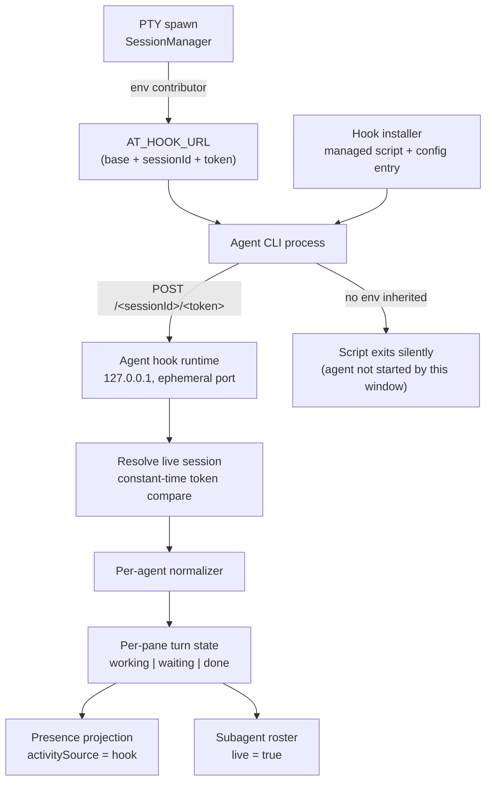

# Agent Hook Runtime Design

> **Ref**: docs/DESIGN.md § 13.2 — the "Authoritative status and live subagent rosters" row
> **Consumer**: `asimov-plan` reads this to turn a PLAN.md task into spec deltas and builder tasks.

A loopback HTTP endpoint that agent CLIs post lifecycle events to, replacing inference with
declaration. This is what turns the Worktree view's agent rows from "the terminal is
producing output" into "this agent is on turn 3, waiting for a permission decision, with two
subagents working".

**This is a generalization, not a new subsystem.** The extension already runs exactly this
architecture for one agent. `src/cursor/` contains a loopback server with per-session
renewable tokens, an env contributor that reaches the pty at spawn, a settings-file installer
with a cross-process lock, and an event→semantic-state reducer. The work is widening that
stack from one agent to several — not standing a second one beside it.

## 1. Overview



## 2. What already exists, and what this task adds

| Capability | Existing | Change needed |
|------------|----------|---------------|
| Loopback bind, ephemeral port | `CursorHookRuntime.ts:130-150` | None |
| **Per-session** renewable token, constant-time compare | `:174-188`, `:219` | None — this is already stronger than a server-wide token |
| Liveness re-check at time of use, not at auth time | `:213-219` | None |
| Token invalidation on disable / dispose | `:155` | None |
| Env injection at spawn | `SessionEnvironmentContributor` | **Widen**: `SessionManagerOptions.cursorHookContributor` is a **singular slot** (`SessionManager.ts:101`, `:172`). One contributor cannot serve several agents; it becomes a collection, or one multi-agent contributor |
| Config install with cross-process lock, atomic rename, `chmod` | `CursorHookInstaller.ts:169-196` | **Generalize** the config path and entry shape per agent; the lock/rename/typed-failure machinery is reused as-is |
| Typed install failures (`lock-unavailable`, `write-failed`, `unsupported-config`) | `CursorHookInstaller.ts:45-50` | None |
| Event → semantic state reducer | `CursorHookRuntime.ts` | **Extend** with the Claude event set in § 3.4 |
| Enable setting | `anywhereTerminal.cursorAgent.hooks.enabled` | **Migrate** to the per-agent key family in § 4.7, preserving the existing value |

Everything in the "None" rows is why this phase is a generalization rather than a rewrite,
and why the safety properties below are claims about shipped code rather than aspirations.

**Migrating Cursor's behaviour and its tests is in scope for this phase.** Two runtimes that
disagree about enablement, token authority, or disposal is a worse outcome than either one
alone; the generalization is only finished when Cursor runs on the shared runtime with its
existing tests passing.

### 2.1 How the reference architecture differs, and why we do not copy it

Orca installs a **static** entry into `~/.claude/settings.json` whose script sources
`$ORCA_AGENT_HOOK_ENDPOINT` — a file on disk holding the live port and token
(`orca/src/main/claude/hook-service.ts:114-115`). It has an explicit regression test asserting
it does **not** pass `--settings` at launch
(`orca/src/shared/tui-agent-startup.test.ts:462-473`).

That endpoint file exists *because* of the static global install: the config entry is written
once, but the relay's port and token change across restarts, so the file is the indirection
that lets a static registration find a moving server. The two are a matched pair. Orca pays
for it with remote-agent support (it installs over SFTP) and daemonized ptys that outlive the
relay — and with roughly 30k lines across its hook subsystem.

**Neither condition holds here.** This extension kills every pty on deactivation
(`docs/DESIGN.md` § 11.2) and restores by spawning fresh ones, so env captured at spawn can
never go stale — the process cannot outlive the server that gave it its coordinates. There is
no remote agent. So the same global-install shape works with **env as the only channel**, and
the endpoint file is not merely unnecessary but actively wrong here: a window-global file
against a window-local server would route window A's pane events into window B's runtime.

This is exactly the shape `src/cursor/` already ships.

## 3. Data Model

```
AgentHookStatus {
  paneKey:        string        // the AT session id, already the env contributor's key
  state:          "working" | "waiting" | "done"
  updatedAt:      number
  stateStartedAt: number
  agent:          VaultAgentId
  sessionId?:     string        // agent-reported; validated per § 3.5 before use
  transcriptPath?: string       // agent-reported; validated per § 3.5 before use
  toolName?:      string
  interactivePrompt?: string    // one JSON string; see § 3.4
  interrupted?:   boolean
  sessionBoundary?: boolean     // a resume/clear landing idle — NOT a completed turn
  subagents:      AgentHookSubagent[]
}

AgentHookSubagent {
  id:        string
  name?:     string
  state:     "working" | "idle" | "done"
  startedAt: number
}
```

Two fields exist purely to stop the status from lying, and each maps to a documented
real-world bug:

- `sessionBoundary` — a resumed or cleared session lands idle. Without this flag it reads as
  a completed turn and fires a false "done" (`02-hook-status-architecture.md` § 2,
  `06-completion-notifications.md` § 2).
- `interrupted` — a turn that ended by Ctrl+C is not a completed turn.

**There is no `blocked` state and no `restoredUnconfirmed` flag.** `blocked` had no event
that produced it, and a state no event can reach is a state the reducer will eventually be
asked to guess at. `restoredUnconfirmed` described a status surviving a reload — which cannot
happen here, because the pane's process does not survive it. § 5 states the actual reload
behaviour instead.

## 4. Algorithm / Logic

### 4.1 Transport

| Property | Value | Why |
|----------|-------|-----|
| Bind | `127.0.0.1`, ephemeral port | Never reachable off-host |
| Auth | Per-**session** token in the URL path, constant-time compared, re-checked against live registration at use time | An expired or cross-pane token is rejected even if it was valid when minted |
| Method | POST only | |
| Routing | `/<sessionId>/<token>`, then a per-agent normalizer selected by the payload's source | |
| Response | Always `204`, always fast | **Fail open** — a malformed payload must never block the agent |
| Body cap | 1 MB, single growing buffer | |
| Timeout | 5 s slowloris guard | |

Fail-open is the governing property. This runtime sits in the critical path of the user's
agent; every failure mode must degrade to "we learn nothing", never to "the agent stalls".

### 4.2 Reaching the agent

**One channel: env injected at spawn**, through the existing `SessionEnvironmentContributor`
seam. The contributor mints a token for the session and hands the pty a single variable
carrying base URL, session id, and token together, so there is no way to inherit a partial
set of coordinates.

The script **no-ops when the variable is absent**. That is the correct behaviour for the most
common case by far: the hook is registered in the user's global agent config, so it also runs
for agents started in ordinary terminals this extension never spawned. Those have no
coordinates and must silently do nothing.

### 4.3 Install

Per agent, idempotent, reversible, and **opt-in**, reusing `CursorHookInstaller`'s existing
machinery:

- Write a managed script to an extension-owned directory — never inline the logic into the
  user's config.
- Register it in the agent's own hook configuration. Managed entries are matched by the
  script's filename, removed, then re-appended; **user-authored hooks are preserved**.
- All of it under the existing `<configPath>.anywhere-terminal.lock` cross-process lock with
  a stale-lock timeout, then written to a same-directory temp file and moved into place by
  atomic rename. This is what makes the read→merge→write sequence safe against a concurrent
  edit by another window, by the agent CLI itself, or by the user's editor.
- Unknown JSON keys in the user's config are preserved verbatim. A typed serializer that
  round-trips only the fields we know about would silently drop settings a newer CLI added.
- Refuse a symlinked destination rather than following it.
- Provide an uninstall that removes exactly the managed entries, exposed as a command
  (§ 4.7) so a user can undo it without hunting through settings.

The Claude script's shape: print `{}` to stdout first, guard against the background-job
environment variable that would attribute a worker's events to the wrong pane, exit silently
when the coordinates are absent from its environment, then a form-encoded POST with a short
connect and total timeout so a dead runtime costs the agent well under two seconds.

> The `{}` is harmless defensive output, not a fail-closed guard: an empty stdout with exit 0
> makes no permission decision and the normal flow proceeds. Earlier drafts of this design
> justified it as preventing a denied tool call; that rationale was wrong even though the
> practice is fine.

Because this writes into a config file the user owns, installation is gated behind a setting
and is **off by default** until it has proven itself. The Worktree view works without it —
less precisely — which is what makes defaulting to off acceptable rather than crippling.

### 4.4 Event → turn state

Minimum viable Claude event set for this phase:

| Event | State | Notes |
|-------|-------|-------|
| `SessionStart` | `done` + `sessionBoundary` | Wipes any stale roster |
| `UserPromptSubmit` | `working` | |
| `PreToolUse` (ordinary tool) | `working` | |
| `PreToolUse` (ask-user-question tool) | `waiting` | The tool name decides, not the event name |
| `PermissionRequest` | `waiting` | |
| `Stop` / `StopFailure` | `done` | See the interrupt note below |
| `SubagentStart` / `SubagentStop` | roster change only | Re-emits the **cached** lead state — never fabricates lead completion |

Pane state is the lead's state, with one gate: `done` is held at `working` while any roster
child is still working. A lead that finished while its subagents run has not finished.

**Interrupts are not detected.** An earlier revision of this table mapped `is_interrupt` on
`Stop` / `StopFailure` to an `interrupted` turn. That field does not exist on those events —
it belongs to `PostToolUseFailure`, which this build does not register — so nothing would
ever have set it. The reducer therefore reads `interrupted` only where a payload actually
carries it and never synthesizes it, and an interrupted turn is currently indistinguishable
from an ordinary finished one. Detecting it needs an event Claude does not send; see the
Deferred row in PLAN.md.

`interactivePrompt` is one JSON string in one of two shapes — `{questions: …}` for a
question, `{approval: {tool, summary}}` for a permission request — and is **never inherited
across events**. Inheriting it is how a stale question card survives into the next turn
(`03-interactive-prompts.md` § 3). No payload carries an approval `summary` either, so it is
derived from the request's own `tool_input` rather than reported.

Deferred to a later phase: Codex and OpenCode installers, answering questions from the panel,
keystroke-inferred interrupt and answer detection, and notifications. The reducer's shape
accommodates them without a rewrite; none is needed for the Worktree view.

### 4.5 Turn state → presence

A fresh hook status for a pane supersedes the inferred activity in
[worktree-agent-presence.md](worktree-agent-presence.md) § 3.3, setting
`activitySource: "hook"` — which is what makes that row's activity authoritative — and turning
the roster into live subagent rows with `live: true`.

**Complete cross-layer mapping.** The turn vocabulary and the activity vocabulary are
deliberately different (a turn describes a conversation; activity describes a terminal), so
every turn state needs an explicit landing place:

| Turn state | Activity | Note |
|------------|----------|------|
| `working` | `running` | |
| `waiting` | `waiting` | |
| `done` | `idle` | Never `exited` — a finished turn does not close the pane |
| *(no status)* | inference path | Unchanged |

`exited` is never produced by the hook layer. It comes only from pty exit, and it overrides
any hook state: a pane whose process is gone is not `working`, whatever it last published.

Precedence and its guards:

| Condition | Result |
|-----------|--------|
| Fresh hook status (within the staleness window) | Wins outright over title and output evidence |
| Stale hook status | Identity only; state falls back to inference, prompt cleared |
| `sessionBoundary` `done` | Recorded, but does not mark a turn complete |
| Pty exited | `exited`, regardless of the published state |
| Shell title (`zsh`/`bash`/`pwsh`) reclaims the pane | Forces `done` even against a published `working` |
| No hook status | Inference path, unchanged |

The staleness window's canonical value lives in [DESIGN.md](../DESIGN.md) § 15. It is
deliberately short: the inference path already covers a genuinely long-running turn, so a
short window costs precision on a slow tool call and buys a hard bound on how long a wrong
status can persist.

### 4.6 Reported identity is a lookup key, never a path to open

Hook status carries `sessionId` and `transcriptPath`, which link a live pane to its vault
entry — replacing the process-tree and cwd heuristics in
`src/session/resolveClaudeSession.ts` for panes that report hooks, and keeping those
heuristics as the fallback for panes that do not.

Both fields are **agent-reported, therefore untrusted**:

- `sessionId` is used to *look up* an entry in the vault's own store. A session id that
  resolves to nothing is discarded and the pane falls back to the heuristics — it never
  causes an entry to be synthesized.
- `transcriptPath` is **never opened on the strength of the report**. It is compared against
  the path the vault store already holds for that session id; a mismatch is dropped. Opening
  a reported path directly would let a local process steer a file read.

### 4.7 Settings and commands

| Key | Type | Default | Scope | Behaviour on change |
|-----|------|---------|-------|---------------------|
| `anywhereTerminal.agentHooks.claude.enabled` | boolean | `false` | application | Installs or uninstalls at the next reconcile |
| `anywhereTerminal.cursorAgent.hooks.enabled` | boolean | `false` | application | **Existing key, retained.** The generalization must not silently change a value the user already set |
| `anywhereTerminal.agentHooks.claudeConfigDir` | string | `""` | application | Overrides the managed config root; empty means the agent's default. Honours `CLAUDE_CONFIG_DIR` when set and this is empty |

| Command | Purpose |
|---------|---------|
| `anywhereTerminal.agentHooks.uninstall` | Removes every managed entry for every agent, whatever the settings say |

**Activation-time reconciliation.** The registered script path is absolute and lives inside
the extension's install directory, which **changes on every extension update**. On activation,
compare the path in each managed entry against the current one; when they differ, rewrite the
entry under the same lock. Without this, an update leaves every user's config pointing at a
script that no longer exists.

## 5. Error Handling & Limits

| Condition | Behavior |
|-----------|----------|
| Malformed payload | 204, dropped |
| Bad / missing / cross-pane token | 204, dropped, not counted as an error the user sees |
| Body over 1 MB | Truncated read, request dropped |
| Runtime cannot bind | Feature disabled for the session, logged once; every pane falls back to inference |
| Agent module fails | Contained by the core and reported as `agent-error`, whether it throws while constructing a session, while decoding, or from a timer — synchronously or as a rejected promise. A module that fails while constructing is omitted from that pane: no entitlement, no environment variable. Other agents and pane creation are unaffected |
| Agent module publishes after revocation | Dropped. A module that retains its channel past rollback, release, disable, or disposal cannot restore a status its entitlement no longer covers, and cannot schedule new timer work |
| Minting coordinates throws | The pane still opens. Authority is released best-effort and the shell spawns with no hook environment at all — observability never decides whether a terminal exists |
| Agent config file unreadable / unwritable | Install fails with a typed reason and a clear message; nothing else is affected |
| Config lock held by another process | Install reports `lock-unavailable` and retries at the next reconcile; never forces the lock |
| Agent config file has user hooks | Preserved — a failure to preserve them is a data-loss bug |
| Window reloads | Every pty is killed and respawned with fresh coordinates. Hook status is **not** persisted across a reload: the process that published it is gone, so the pane starts on the inference path until its new process publishes |
| Two windows open | Each has its own runtime, port, and per-session tokens; a pane posts to the window that spawned it, because its coordinates came from that window's spawn |
| Status cache growth | Bounded pane count with eviction preferring `done` and stale entries |
| Pane destroyed | Its cached status, roster, and token cleared on teardown, on every teardown path |

## 6. Edge Cases

| Condition | Behavior |
|-----------|----------|
| Two windows both running the runtime | Each pane's env points at its own window's runtime. This is why there is no shared on-disk endpoint artifact (§ 2.1) |
| Agent started in a terminal this extension did not spawn | The hook is registered globally, so the script still runs — with no coordinates in its env. It exits silently and makes no status claim |
| Headless `claude -p` subprocess posts events | Guarded by the background-job environment check in the script |
| Subagent event arrives with no cached lead | A `SubagentStart` proves activity → `working`; a `SubagentStop` for an unknown child makes **no** state claim |
| Question answered | Claude emits no hook; without inference the pane stays `waiting` until the next tool event clears it. Accepted limitation for this phase |
| `/compact` | Pre-compact → `working`, post-compact → `done`, or the pane keeps a stuck spinner |
| User uninstalls the agent CLI | Registered hook entry becomes inert; uninstall still removes it |
| User edits the managed script | Overwritten on the next reconcile; it is extension-owned |
| Extension updated, script path moved | Reconciled at activation (§ 4.7) |

## 7. Security

| Surface | Control |
|---------|---------|
| Network exposure | Loopback bind only; ephemeral port |
| Authentication | Per-session token, constant-time compared, re-validated against live registration at use time, invalidated on pane teardown and on disable. One token per pane; which agents it speaks for is a per-session entitlement set fixed at spawn, so disabling an agent strikes it from every live pane permanently — coordinates already sitting in an environment cannot be revived by re-enabling, only by a fresh spawn |
| Coordinate distribution | Process environment only. No shared on-disk artifact exists to read, race on, or leak between windows (§ 2.1) |
| Config mutation | Opt-in setting, off by default; cross-process lock; atomic rename; unknown keys preserved; symlinked destination refused; managed entries only; uninstall command provided |
| Script path | Absolute and extension-owned, reconciled on update. A relative path would resolve against the agent's cwd and execute whatever happened to be there (`07-orchestration-teams.md` § 2) |
| Reported identity | `sessionId` is a lookup key; `transcriptPath` is compared against the vault store and never opened on the report's authority (§ 4.6) |
| Payload trust | Hook payloads come from a local process and are treated as data: bounded, validated, never executed, never interpolated into a command |

**The trust boundary is the pane, not the agent.** A per-session token stops one pane from
publishing as another and stops a token from outliving its pane. It does **not** distinguish
the agent process from anything else running in that same pane — a repo build script, a test
harness, any tool the agent itself spawns. All of them inherit the variable and can post as
that pane. This is inherent to env-based coordinate distribution and is accepted: the blast
radius is a wrong status on the pane that process already occupies, and the alternative
(withholding coordinates from the pty) removes the feature. It is recorded here so nobody
later reads "authoritative" as "provenance-checked".

## 8. Testing

### Test Cases

- [ ] POST without a token, with a wrong token, or with another pane's token → 204, no state change
- [ ] Token of a torn-down pane → rejected even though it was valid when minted
- [ ] Malformed JSON → 204, no state change, no throw
- [ ] Body over the cap → dropped, runtime stays healthy
- [ ] Install is idempotent: twice → one managed entry
- [ ] Install preserves pre-existing user hooks and unknown top-level keys
- [ ] Concurrent install from two processes → the lock serializes them; neither loses the other's entry
- [ ] Lock held and stale → reclaimed; lock held and fresh → `lock-unavailable`, config untouched
- [ ] Symlinked config destination → refused, not followed
- [ ] Uninstall command removes only managed entries, for every agent, regardless of settings
- [ ] Activation with a script path from a previous extension version → entry rewritten under the lock
- [ ] Managed entry's script path is absolute
- [ ] Cursor's existing hook behaviour and tests pass unchanged on the generalized runtime
- [ ] Two agents enabled at once → both contribute env to a spawn; neither's contributor displaces the other
- [ ] `SessionStart` → `done` + `sessionBoundary`, and does not count as a completed turn
- [ ] `Stop` with the interrupt flag → `interrupted`
- [ ] Lead `Stop` while a roster child works → pane stays `working`
- [ ] `SubagentStop` for an unknown child → no state claim
- [ ] `interactivePrompt` is not inherited by the following event
- [ ] Every turn state maps to exactly one activity per the § 4.5 table; no state is unmapped
- [ ] Pty exit while a `working` status is fresh → activity is `exited`, not `running`
- [ ] Stale status → identity only, prompt cleared
- [ ] Shell title after a `working` status → forces `done`
- [ ] Fresh hook status overrides output-derived activity in presence
- [ ] Reported `sessionId` with no vault entry → discarded, pane falls back to heuristics
- [ ] Reported `transcriptPath` disagreeing with the store's path for that session → dropped, never opened
- [ ] Pane teardown clears its status, roster, and token
- [ ] Bind failure → feature disabled, every pane still renders via inference
- [ ] Setting off → no config file is written or read
- [ ] Script invoked with no coordinates in its environment → exits silently, posts nothing, makes no status claim
- [ ] Two runtimes on different ports → a pane posts to the one whose coordinates it inherited at spawn, never the other
- [ ] No shared endpoint artifact is written anywhere on disk
- [ ] After a window reload, a restored pane starts on the inference path with no status carried over

---

> **Sync rule**: the § 1 diagram must show the same channels and flow as § 4.
> **Registry**: values this doc shares with others belong in [DESIGN.md](../DESIGN.md) § 15 — do not keep a second copy here.
