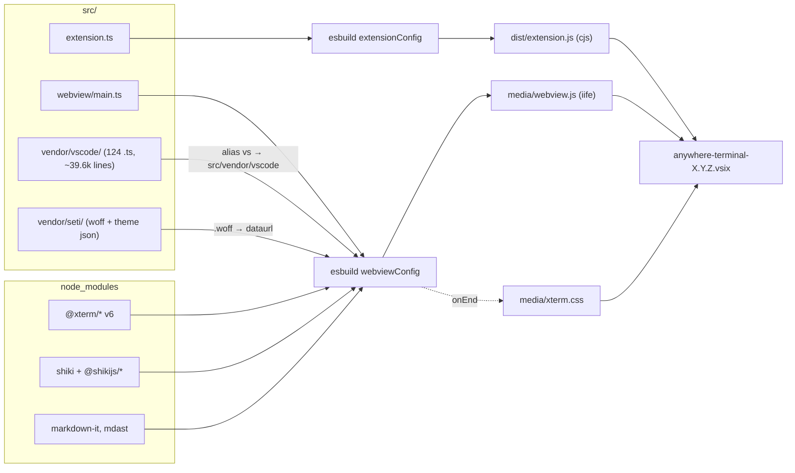
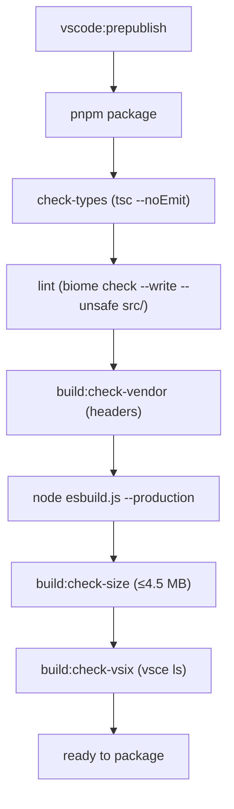
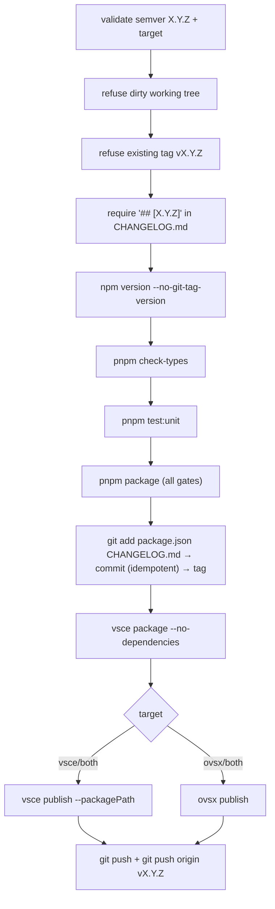

# Build System — Detailed Design

## 1. Overview

One esbuild invocation produces **two bundles** with incompatible targets, and five gates guard what ships.

| Artifact | Entry | Format | Platform | Target | Config |
|---|---|---|---|---|---|
| `dist/extension.js` | `src/extension.ts` | `cjs` | `node` | `node18` | `esbuild.js:65-86` |
| `media/webview.js` | `src/webview/main.ts` | `iife` | `browser` | `es2020` | `esbuild.js:89-121` |
| `media/xterm.css` | copied from `@xterm/xterm` | — | — | — | `esbuild.js:39-62` |

Toolchain, as of `package.json`:

| Concern | Tool | Not |
|---|---|---|
| Bundling | esbuild `^0.27.3` | webpack, rollup |
| Types | TypeScript `^5.9.3`, `tsc --noEmit` | tsc-as-bundler |
| Lint + format | **biome `^2.4.5`** | eslint, prettier |
| Unit tests | **vitest `^4.0.18`** (157 `*.test.ts` files) | mocha |
| Integration tests | `@vscode/test-cli` + `@vscode/test-electron` | — |
| Package manager | pnpm (`pnpm-lock.yaml`) | npm, yarn |
| Publish | `vsce` + `ovsx` via `scripts/release.sh` | CI |

There is **no `.github/workflows`** directory. Every gate below runs locally, through `pnpm package` or `scripts/release.sh`.

### Reference

- `esbuild.js` (140), `tsconfig.json` (27), `biome.json` (53), `vitest.config.mts` (39)
- `package.json` (644) — version `0.18.1`, `engines.vscode: ^1.105.0` (`:5`, `:41`)
- `scripts/` — `check-bundle-size.mjs`, `check-vendor-headers.mjs`, `check-vsix-contents.mjs`, `measure-vendor-delta.mjs`, `vendor-vscode-list.mjs`, `release.sh`
- `.vscodeignore` — deny-by-default allowlist

---

## 2. Build Architecture

`main()` builds both targets **in parallel** — `Promise.all([build(extensionConfig), build(webviewConfig)])` (`esbuild.js:132`), and in watch mode `Promise.all([extCtx.watch(), wvCtx.watch()])` (`esbuild.js:127-128`). A build failure exits non-zero (`esbuild.js:137-140`).

---

## 3. Dual-target esbuild configuration

### 3.1 Extension bundle (`esbuild.js:65-86`)

| Option | Value | Why |
|---|---|---|
| `format` / `platform` / `target` | `cjs` / `node` / `node18` | VS Code extension host |
| `external` | `["vscode", "node-pty"]` | `vscode` is injected at runtime; `node-pty` is loaded from VS Code's own `node_modules(.asar)` at runtime — see `docs/design/error-handling.md` §3.1 |
| `loader` | `{ ".css": "text" }` | `webviewHtml.ts` imports vendored CSS **as strings** and interpolates them into a `<style>` block |
| `sourcemap` | `!production` | |
| `sourcesContent` | `false` | keeps maps small |
| `minify` | `production` | full minify is safe here — no xterm in this bundle |
| `logLevel` | `"silent"` | errors are surfaced by the problem-matcher plugin instead |

### 3.2 WebView bundle (`esbuild.js:89-121`)

| Option | Value | Why |
|---|---|---|
| `format` / `platform` / `target` | `iife` / `browser` / `es2020` | webview sandbox, single `<script nonce>` |
| `alias` | `{ vs: src/vendor/vscode }` | resolves `vs/base/...` imports to the vendored tree (§4) |
| `loader` | `{ ".woff": "dataurl" }` | the Seti icon font ships inside the JS — no second resource fetch under the CSP (§5) |
| `external` | *(none)* | xterm + addons + Shiki + markdown-it are all bundled (`esbuild.js:106-107`) |
| `minifySyntax` | **`false`** | xterm.js v6 breaks under it (`ReferenceError` in the `requestMode`/DECRQM parser) |
| `minifyIdentifiers` | **`false`** | same |
| `minifyWhitespace` | `production` | the only minification that is safe |

The two disabled minifiers are the reason the bundle ceiling is as large as it is — TextMate grammars are full of long identifier-like property names an identifier-minifier would otherwise mangle (`scripts/check-bundle-size.mjs:22-27`). The comment cites precedent: VS Code loads xterm as an external AMD module and never minifies it; `vscode-sidebar-terminal` uses webpack `{minimize: false}` (`esbuild.js:110-115`).

### 3.3 Plugins

| Plugin | Applies to | Behaviour |
|---|---|---|
| `esbuildProblemMatcherPlugin` (`:17-33`) | both | Emits `[watch] build started` / `finished` and prints `✘ [ERROR] …` with `file:line:column` — the shape the VS Code task problem-matcher expects |
| `copyXtermCssPlugin` (`:39-62`) | webview only | On a zero-error build, `require.resolve("@xterm/xterm/css/xterm.css")` → copy to `media/xterm.css`, creating `media/` if absent. A copy failure is a `console.warn`, **not** a build failure (`:56-58`) |

---

## 4. Vendored VS Code source tree

`src/vendor/vscode/` holds a transitive closure of upstream VS Code files, entry point `vs/base/browser/ui/list/listWidget.ts` — the list widget that backs the file-tree and vault panels.

| Fact | Value | Source |
|---|---|---|
| Files | 124 `.ts` + 4 `.css` | `find src/vendor/vscode` |
| Size | ~39,614 lines of TS | |
| Upstream repo | `https://github.com/microsoft/vscode` | `MANIFEST.json:2` |
| Upstream SHA | `5aefa4caeb76874b77ba5b00075b4f4c37b59cf0` | `MANIFEST.json:3`, `scripts/vendor-vscode-list.mjs:27` |
| Entry point | `src/vs/base/browser/ui/list/listWidget.ts` | `MANIFEST.json:5-7`, `vendor-vscode-list.mjs:33` |
| Manifest | `src/vendor/vscode/MANIFEST.json` (748 lines) — per-file `src`, `dest`, `upstreamSha`, `copiedAt` | |

### 4.1 `scripts/vendor-vscode-list.mjs`

Re-vendoring tool, **not** part of any build script — run by hand, `--dry-run` first (`:39`). It walks the import graph from the entry point and copies each reached file **byte-for-byte**, deliberately preserving upstream's `.js` import extensions so future re-vendoring diffs stay clean; `moduleResolution: "Bundler"` maps them back to `.ts` (`:14-17`). `nls.ts` is project-owned and never overwritten (`:37`). `UPSTREAM_ROOT` is a **hard-coded absolute path** to a local VS Code checkout (`:26`), so the script only runs on a machine that has one.

### 4.2 Three build-time consequences

| Consequence | Mechanism |
|---|---|
| `vs/*` resolves for `tsc` | `compilerOptions.paths: {"vs/*": ["./src/vendor/vscode/*"]}` (`tsconfig.json:10-12`) |
| `vs/*` resolves for esbuild | `alias.vs` (`esbuild.js:96-99`) |
| `vs/*` resolves for vitest | `test.alias.vs` (`vitest.config.mts:17`) |

Two upstream-required compiler flags leak into the whole project: `experimentalDecorators: true` and `useUnknownInCatchVariables: false` (`tsconfig.json:21-22`). The second is documented as type-compatible because app catch handlers are bare `catch (err)` with no `: unknown` annotation (`tsconfig.json:15-20`).

`src/vendor/**` is excluded from biome (`biome.json:10`) — vendored code is never reformatted or linted.

### 4.3 Vendor smoke tests

Two vitest files pin the closure rather than the widget's behaviour:

- `src/test/vendor-import.test.ts` — `vs/*` resolves under vitest, `listWidget` imports without a module-not-found, and `new List(...)` stamps `.monaco-list` onto its container. Runs under `// @vitest-environment jsdom` and stubs `ResizeObserver`/`matchMedia`/`requestAnimationFrame` first. A failure points at a missing transitive dep — re-run the vendor script's `--dry-run`.
- `src/test/vendor-filters.test.ts` — golden cases for `fuzzyScore` / `createMatches`, which the file-tree search depends on.

---

## 5. Vendored Seti icon assets

`src/vendor/seti/` — four files vendored from microsoft/vscode release/1.96 (originally jesseweed/seti-ui, both MIT): `seti.woff` (37 KB), `vs-seti-icon-theme.json` (54 KB, extension/filename → icon-class + colour), `setiIconResolver.ts` (consumed by `ReadOnlyFileRenderer.ts:32`), and `setiFontCss.ts`.

The font never becomes a separate resource. `setiFontCss.ts:14` imports the `.woff`, esbuild's `dataurl` loader turns it into a `data:font/woff;base64,…` string, and `main.ts:57-62` injects the resulting `@font-face` rule into a `<style data-source="seti-icon-font">` element at runtime. That keeps it inside the CSP's `font-src … data:` allowance with no second fetch.

It is **webview-only by construction**: the `dataurl` loader is configured on `webviewConfig` alone, so the ~50 KB base64 payload never reaches `dist/extension.js` (`main.ts:54-56`).

---

## 6. CSS handling — three distinct paths

| Path | Mechanism | Ends up as |
|---|---|---|
| `media/xterm.css` | copied by `copyXtermCssPlugin` | a real `<link href>` in the webview HTML (`webviewHtml.ts:68,81`) |
| Vendored list CSS + project panel CSS | `.css: "text"` loader on **extensionConfig**, imported by `webviewHtml.ts:11-21` | interpolated into the inline `<style>` block |
| Seti font | `.woff: "dataurl"` on **webviewConfig** | a `data:` URL inside `media/webview.js` |

The second path is why the extension bundle needs a CSS loader at all — the strings are consumed on the **host** side, at HTML-generation time.

---

## 7. TypeScript configuration (`tsconfig.json`)

| Option | Value | Why |
|---|---|---|
| `module` / `moduleResolution` | `ESNext` / `Bundler` | lets the vendored tree keep upstream's `.js` import extensions |
| `target` / `lib` | `ES2022` / `ES2022` + `DOM` + `DOM.Iterable` | one program spans host **and** webview code |
| `rootDir` / `baseUrl` | `src` / `.` | |
| `paths` | `vs/* → ./src/vendor/vscode/*` | §4 |
| `strict`, `skipLibCheck` | `true` | |
| `experimentalDecorators` | `true` | required by the vendored tree |
| `useUnknownInCatchVariables` | `false` | required by the vendored tree |
| `exclude` | `vitest.config.mts`, `third_party`, `asimov` | `asimov/` holds repro scripts that import `src` from outside `rootDir` (TS6059) |

`lib` carries **both** `ES2022` and `DOM` because one program covers host and webview code. `asimov/` is excluded because it holds debug-repro scripts that import from `src` while living outside `rootDir` — TS6059 otherwise (`tsconfig.json:24-25`).

`tsc` is never used to emit the shipped bundles: `check-types` is `tsc --noEmit` (`package.json:599`). The only emitting use is `compile-tests` → `tsc -p . --outDir out` for the `vscode-test` integration suite (`package.json:596`).

---

## 8. Lint and format — biome

`biome.json` (53 lines), schema pinned to `2.4.5`.

| Setting | Value |
|---|---|
| VCS integration | `git`, `useIgnoreFile: true` (`:3-7`) |
| Ignored paths | `dist`, `out`, `.vscode`, `.vscode-test`, **`src/vendor/**`** (`:10`) |
| Formatter | spaces, width 2, **line width 120** (`:12-17`) |
| Import sorting | `assist.actions.source.organizeImports: "on"` (`:18`) |
| JS style | double quotes, always semicolons (`:48-53`) |

Rules start from biome's `recommended` set (`biome.json:23-45`). The deviations that matter for reading this codebase: `noExplicitAny`, `noAssignInExpressions`, `noNonNullAssertion`, and `useNamingConvention` are **off**; `noDoubleEquals`, `useBlockStatements`, and `useThrowOnlyError` are **warn**; nine `style/*` rules are promoted to **error**. `useExhaustiveDependencies` is downgraded to `info` — there is no React here.

> The `lint` script is `biome check --write --unsafe src/` (`package.json:600`) — it **mutates sources** as part of `compile`, `package`, and `pretest`. It is a formatter-fixer in the pipeline, not a read-only gate.

---

## 9. Tests — two runners

### 9.1 vitest (unit)

`vitest.config.mts`:

| Setting | Value |
|---|---|
| `include` | `src/**/*.test.ts` — colocated, 157 files |
| `exclude` | `node_modules`, `dist`, `out`, `src/test/extension.test.ts` |
| `alias.vscode` | `src/test/__mocks__/vscode.ts` — the manual `vscode` API mock |
| `alias.vs` | `src/vendor/vscode` |
| Coverage provider | `v8`, reporters `text` + `lcov` |
| Coverage thresholds | lines / functions / branches all **80** |

Coverage deliberately excludes `src/test/**`, **`src/webview/**`**, `src/types/messages.ts`, `src/extension.ts`, and `src/providers/**` (`vitest.config.mts:23-30`) — the DOM-heavy and VS Code-API-heavy layers are covered by integration tests instead.

Tests needing a DOM opt in per-file with `// @vitest-environment jsdom` (e.g. `src/test/vendor-import.test.ts:16`); `jsdom ^28.1.0` is a devDependency.

### 9.2 `vscode-test` (integration)

`pnpm test` runs `vscode-test` (`package.json:602`), preceded by `pretest` = `compile-tests && compile && lint` (`package.json:598`). The suites live in `src/test/`: `extension.test.ts`, `fileTreeGitDecorations.integration.test.ts`, `fileTreeRpc.integration.test.ts`.

> ⚠️ No `.vscode-test.mjs` / `.js` / `.cjs` config file exists in the repo. See §14.2.

---

## 10. Build gates

Four gate scripts; **three** are wired into `pnpm package`. Each asserts one invariant and exits non-zero.

| Gate | Asserts | Threshold / rule | Wired? |
|---|---|---|---|
| `check-vendor-headers.mjs` | Every `.ts`/`.d.ts` under `src/vendor/vscode/` carries the upstream `"Microsoft Corporation"` header in its first 6 lines (`:58-61`). Skips `nls.ts` and `*-stub.d.ts` (`:18-19`) | license attribution | ✅ — runs **before** the production build, so a licensing failure costs no build |
| `check-bundle-size.mjs` | `media/webview.js` fits the ceiling (`:64-67`) | `CEILING_BYTES = 4.5 MB` (`:16`) | ✅ — after the production build |
| `check-vsix-contents.mjs` | All 14 `REQUIRED_FILES` appear in `vsce ls --no-dependencies` (`:20-35`, `:55`) | `dist/extension.js`, `media/webview.js`, `media/xterm.css`, seven `resources/shell-integration/*` scripts, `package.json`, `README.md`, `CHANGELOG.md`, `LICENSE` | ✅ — last |
| `measure-vendor-delta.mjs` | Growth over the pre-vendor baseline stays in budget (`:21-28`) | `DELTA_CEILING_BYTES = 650 KB` (`:41`) | ❌ **orphaned** — §14.1 |

Two of these encode history rather than taste:

- The **size ceiling** climbed 1.6 MB → 3 MB → 3.6 MB (vendored list closure) → 4.5 MB (v0.16.0 AI Vault redesign) (`check-bundle-size.mjs:22-40`). It is production-only by design: dev builds skip minification and run ~10–15 % larger (`:18-20`).
- The **VSIX gate** exists because of a real 0.14.0 regression — `resources/shell-integration/*` was silently excluded by `.vscodeignore` and shell-integration injection broke in the published extension (`check-vsix-contents.mjs:4-8`). Its failure message names the missing paths and points at the absent `!<path>` un-ignore line (`:57-65`).

---

## 11. npm script pipeline

All scripts live at `package.json:587-608`. Four define the shape; the rest are thin aliases over `esbuild.js`, `tsc`, `biome`, `vitest`, and the gate scripts.

| Script | Chain | Line |
|---|---|---|
| `package` | `check-types` → `lint` → `build:check-vendor` → `esbuild --production` → `build:check-size` → `build:check-vsix` | `:592` |
| `compile` | `check-types` → `lint` → `esbuild` (dev) | `:588` |
| `pretest` | `compile-tests` → `compile` → `lint`, then `test` runs `vscode-test` | `:598`, `:602` |
| `watch` | `npm-run-all -p watch:*` — `esbuild --watch` **and** `tsc --noEmit --watch` | `:589-591` |

`watch` runs the esbuild watcher and a `tsc --noEmit --watch` **in parallel** — esbuild never type-checks, so the separate tsc watcher is what surfaces type errors during the inner loop.

---

## 12. Packaging

### 12.1 `.vscodeignore` — deny by default

| Rule class | Entries |
|---|---|
| Exclude everything | `**` |
| Re-include shipped assets | `!dist/**`, `!media/**`, `!resources/**`, `!package.json`, `!README.md`, `!CHANGELOG.md`, `!LICENSE` |
| Re-exclude build inputs | `src/**`, `node_modules/**`, `docs/**`, `*.ts` (but `!*.d.ts`), `tsconfig*.json`, `esbuild.js`, `biome.json` |
| Re-exclude tooling / agent dirs | `.git/**`, `.vscode/**`, `.vscode-test/**`, `.github/**`, `.agents/**`, `.opencode/**`, `.drafts/**`, `bun.lock`, `pnpm-lock.yaml`, `AGENTS.md` |

The inverted-allowlist shape is exactly what `check-vsix-contents.mjs` exists to police — a new runtime asset that is not un-ignored ships broken. Packaging uses `--no-dependencies` (`package.json:606`) because the single runtime dependency (`strip-ansi`) is already bundled into `dist/extension.js`.

### 12.2 `scripts/release.sh` — atomic release

`bash scripts/release.sh <version> [both|vsce|ovsx]`.

`set -euo pipefail` (`:14`). Two details worth keeping: the commit step is **idempotent** — if both files are already staged-clean it tags current HEAD instead of failing (`:76-82`); and the push happens **last**, so a failed publish never leaves a dangling remote tag (`:104-107`).

Note that `release.sh` runs `pnpm test:unit` (vitest) but **not** `pnpm test` (`vscode-test`).

---

## 13. `package.json` contributions

### 13.1 Settings (canonical: `package.json:61-184`)

Sixteen keys. Runtime readers are `src/settings/SettingsReader.ts` and `src/providers/hoverPreviewSettings.ts`; clamps and fallback chains are canonical in `docs/design/theme-integration.md` §4.

| Key | Type | Default | Line |
|---|---|---|---|
| `anywhereTerminal.shell.macOS` | string | `""` | `:64` |
| `anywhereTerminal.shell.linux` | string | `""` | `:70` |
| `anywhereTerminal.shell.windows` | string | `""` | `:76` |
| `anywhereTerminal.shell.args` | array | `[]` | `:82` |
| `anywhereTerminal.scrollback` | number | `10000` | `:91` |
| `anywhereTerminal.sessionRestore.enabled` | boolean | `true` | `:96` |
| `anywhereTerminal.cursorAgent.hooks.enabled` | boolean | `false` | `:101` |
| `anywhereTerminal.fileSearch.maxResults` | number | `50` | `:107` |
| `anywhereTerminal.fontSize` | number | `0` (0 ⇒ inherit editor) | `:114` |
| `anywhereTerminal.fontFamily` | string | `""` (⇒ inherit) | `:119` |
| `anywhereTerminal.cursorBlink` | boolean | `true` | `:124` |
| `anywhereTerminal.defaultCwd` | string | `""` | `:129` |
| `anywhereTerminal.hoverPreview.delay` | number | `300` | `:134` |
| `anywhereTerminal.hoverPreview.blockSensitive` | boolean | `true` | `:141` |
| `anywhereTerminal.fileTree.autoReveal` | boolean \| string | `true` | `:147` |
| `anywhereTerminal.fileTree.autoRevealExclude` | object | `{"**/node_modules": true, "**/bower_components": true}` | `:160` |

There is **no** `anywhereTerminal.macOptionIsMeta` and no `anywhereTerminal.macOptionClickForcesSelection` — those xterm options are hardcoded (`TerminalFactory.ts:239-240`). See `docs/design/keyboard-input.md`.

### 13.2 View containers and views

| Contribution | Id | Line |
|---|---|---|
| `viewsContainers.activitybar` | `anywhereTerminal`, icon `media/icon.svg` | `:185-200` |
| `viewsContainers.panel` | `anywhereTerminalPanel`, icon `media/icon.svg` | same |
| `views.anywhereTerminal` | `anywhereTerminal.sidebar`, `type: "webview"` | `:201-216` |
| `views.anywhereTerminalPanel` | `anywhereTerminal.panel`, `type: "webview"` | same |

A container registered under `activitybar` can be dragged to the Secondary Sidebar by the user; `anywhereTerminal.moveToSecondary` automates that (`extension.ts:810-814`).

### 13.3 Commands (35, `package.json:217-380`)

| Group | Count | Shape |
|---|---|---|
| Global | 10 | `newTerminal`, `killTerminal`, `clearTerminal`, `focusSidebar`/`focusPanel`, `moveToSecondary`, `splitHorizontal`/`splitVertical`, `closeSplitPane`, `newTerminalInEditor` |
| Location-scoped | 8 | `{newTerminal,killTerminal,splitHorizontal,splitVertical}.{sidebar,panel}` |
| Webview context menu | 7 | `ctx.*` — clear, new, kill, close pane, split ×2, reveal in file tree |
| Explorer / file tree | 2 | `insertPath`, `setFileTreePosition` |
| Export | 5 | `exportBuffer`, `exportLastCommand`, `exportCommand`, `exportPick.{sidebar,panel}` |
| AI vault | 3 | `openVault`, `openVault.{sidebar,panel}` |

The `.sidebar` / `.panel` duplication exists because `view/title` menu entries need a `when: view == <id>` clause and cannot disambiguate a single command's target view.

### 13.4 Menus (`package.json:381-570`)

Four contribution points: `view/title`, `webview/context`, `explorer/context`, `commandPalette`. The `commandPalette` block is used to **hide** the location-scoped duplicates from the palette.

### 13.5 Keybindings (`package.json:571-584`)

| Command | Key | Mac | `when` |
|---|---|---|---|
| `anywhereTerminal.splitVertical` | `ctrl+\` | `cmd+\` | `focusedView == anywhereTerminal.sidebar \|\| focusedView == anywhereTerminal.panel` |
| `anywhereTerminal.splitHorizontal` | `ctrl+shift+\` | `cmd+shift+\` | same |

> Both `when` clauses name only the sidebar and panel views. Editor-tab terminals (`anywhereTerminal.editor`) get no split keybinding. See §14.5.

### 13.6 Activation

`activationEvents` (`package.json:45-57`) lists both `onView:` ids, six `onCommand:` ids, and `onWebviewPanel:anywhereTerminal.editor` — the last is what lets the panel serializer revive editor terminals after a window reload without any other trigger.

---

## 14. Known Inconsistencies

Recorded, not fixed.

### 14.1 `measure-vendor-delta.mjs` is orphaned

No `package.json` script references it. The 650 KB vendor-growth budget it enforces is documented in the spec it cites but is never executed by `pnpm package` or `release.sh`.

### 14.2 `pnpm test` has no configuration file

`"test": "vscode-test"` (`package.json:602`), but there is no `.vscode-test.mjs`/`.js`/`.cjs` at the repo root. `@vscode/test-cli` requires one to locate the compiled suites under `out/`.

### 14.3 Stale ceiling figures in gate comments

`check-bundle-size.mjs:30` ("3.6 MB for an enhanced terminal is well within the budget") and `measure-vendor-delta.mjs:35` ("The absolute bundle ceiling (3.6 MB)") both still name 3.6 MB, while `CEILING_BYTES` is 4.5 MB. `check-bundle-size.mjs:35-36` also says the vendor delta is gated at "≤ 450 KB" while `DELTA_CEILING_BYTES` is 650 KB.

### 14.4 No CI

There is no `.github/workflows`. `.vscodeignore` excludes `.github/**`, but the directory does not exist. Every gate depends on a developer running `pnpm package` or `scripts/release.sh` locally.

### 14.5 Split keybindings skip the editor location

See §13.5.

### 14.6 `lint` mutates sources inside the release path

Previously recorded drift, restated here because this is where a reader looks for it.

`biome check --write --unsafe src/` runs inside `package`, which `release.sh` invokes at step 5 — *after* the working-tree-clean precondition at `release.sh:39`. Two consequences:

- The step-6 commit stages only `package.json` and `CHANGELOG.md` (`release.sh:76`), so any source file the autofix rewrote stays uncommitted and fails the **next** release's clean-tree check.
- Less obvious: the VSIX is packaged from that same rewritten tree at step 7, so an unsafe autofix can ship **unreviewed** in a published build.

---

## 15. File Locations

| File | Role |
|---|---|
| `esbuild.js` | Dual-target build, two plugins |
| `tsconfig.json` | One program covering host + webview; `vs/*` path mapping |
| `biome.json` | Lint + format; excludes `src/vendor/**` |
| `vitest.config.mts` | Unit runner, `vscode` mock alias, 80 % thresholds |
| `.vscodeignore` | Deny-by-default packaging allowlist |
| `package.json` | Scripts, deps, and the whole `contributes` surface |
| `scripts/check-vendor-headers.mjs` | Attribution gate |
| `scripts/check-bundle-size.mjs` | 4.5 MB webview ceiling |
| `scripts/check-vsix-contents.mjs` | 14-file VSIX allowlist gate |
| `scripts/measure-vendor-delta.mjs` | 650 KB vendor delta budget (unwired) |
| `scripts/vendor-vscode-list.mjs` | Re-vendoring tool (manual) |
| `scripts/release.sh` | Bump → verify → commit → tag → publish → push |
| `src/vendor/vscode/MANIFEST.json` | Per-file upstream SHA record |

### Dependents

- `docs/design/webview-provider.md` §4 — consumes the `.css: "text"` loader and the `?v=` cache-buster
- `docs/design/xterm-integration.md` — addon versions bundled here
- `docs/design/error-handling.md` §3.1 — why `node-pty` is `external`
