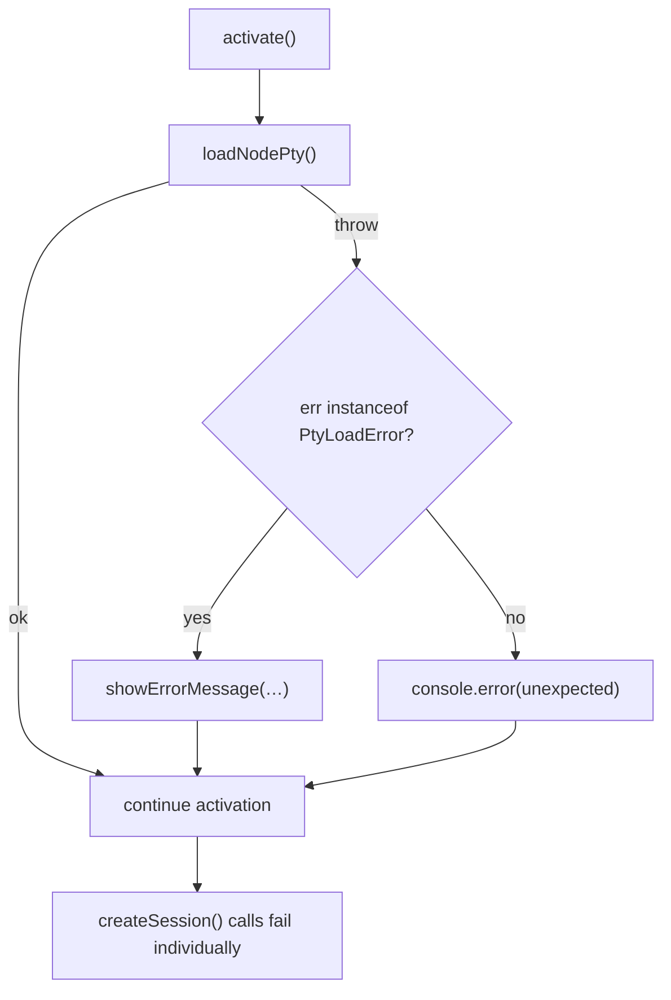
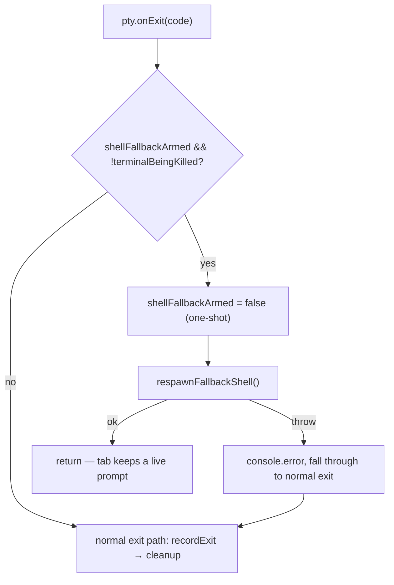
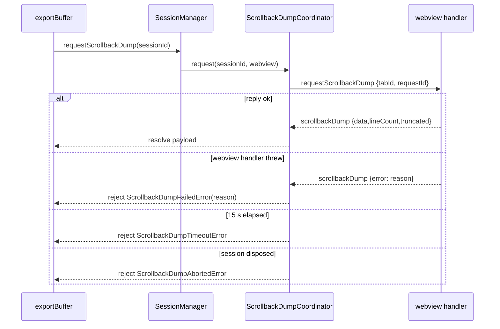
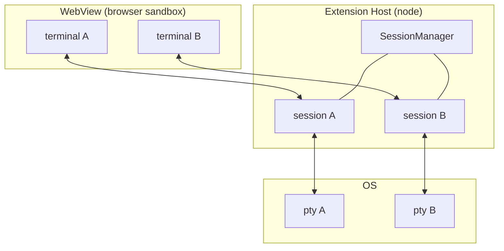
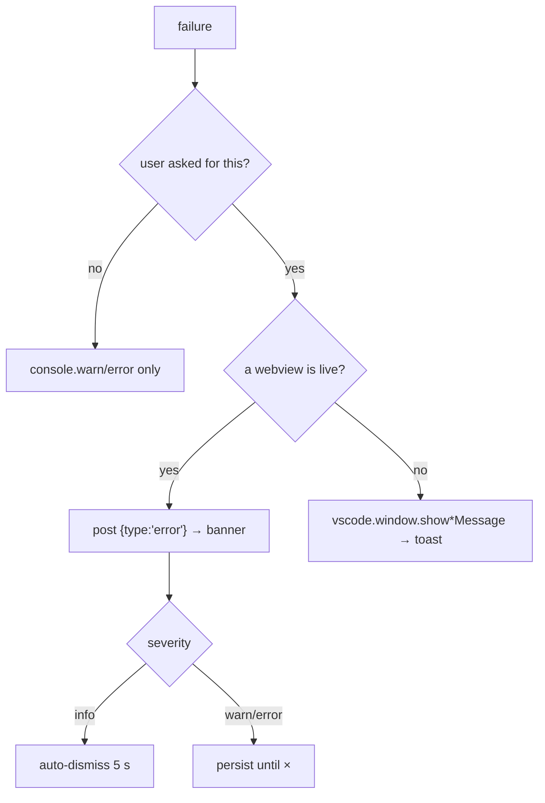
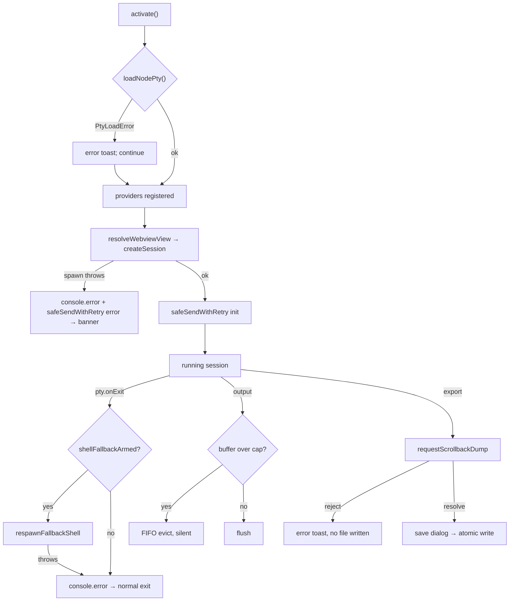

# Error Handling — Detailed Design

## 1. Overview

AnyWhere Terminal handles failures across three boundaries: the Node.js **extension host**, the **PTY process layer**, and the browser-sandboxed **WebView**. The design is deliberately asymmetric:

- The host has a **small typed error vocabulary** (`src/types/errors.ts`) for the few failures a caller must branch on.
- Everything else is handled by **local, best-effort `catch` blocks** that log and degrade — there is no global error bus, no error-reporting service, and no retry queue.
- The **only** structured error channel from host → webview is the `error` message (`src/types/messages.ts:782-787`), which renders as a dismissible banner.

### Design goals (as realised in code)

| Goal | Mechanism | Where |
|---|---|---|
| Session independence | Every per-session teardown op is individually wrapped; `performDestroy` "never throws" | `src/session/SessionManager.ts:1186-1197` |
| Never crash the webview | Dispose / render / decode paths use bare `catch {}` | `src/webview/terminal/TerminalFactory.ts:641,662` |
| Degrade, don't disappear | WebGL → canvas, agent exit → fallback shell, unreadable bundle → nonce cache-buster | §3.8–§3.9 |
| Survive a disposed webview | `safePostMessage` swallows sync throw **and** async rejection | §5.1 |

### Reference

- Parent design: `docs/DESIGN.md` §10
- Typed errors: `src/types/errors.ts` (103 lines) — **canonical**
- Output-buffer caps: `docs/design/output-buffering.md` (canonical for `MAX_TOTAL_BUFFER_CHARS`)

---

## 2. Typed Error Vocabulary

### 2.1 `ErrorCode` (canonical: `src/types/errors.ts:7-14`)

Six string-enum members. All errors derive from `AnyWhereTerminalError` (`errors.ts:19-27`), which carries `code: ErrorCode` and sets `name` per subclass.

| `ErrorCode` | Class | Declared at | Thrown at | Live? |
|---|---|---|---|---|
| `PTY_LOAD_FAILED` | `PtyLoadError` | `errors.ts:32-40` | `src/pty/PtyManager.ts:112` | ✅ |
| `SHELL_NOT_FOUND` | `ShellNotFoundError` | `errors.ts:43-51` | — | ❌ never thrown (§9.1) |
| `BUFFER_OVERFLOW` | *(no class)* | `errors.ts:10` | — | ❌ unreferenced (§9.1) |
| `SCROLLBACK_DUMP_ABORTED` | `ScrollbackDumpAbortedError` | `errors.ts:58-66` | `ScrollbackDumpCoordinator.ts:127,139`; `SessionManager.ts:1012` | ✅ |
| `SCROLLBACK_DUMP_TIMEOUT` | `ScrollbackDumpTimeoutError` | `errors.ts:73-81` | `ScrollbackDumpCoordinator.ts:71` | ✅ |
| `SCROLLBACK_DUMP_FAILED` | `ScrollbackDumpFailedError` | `errors.ts:91-103` | `ScrollbackDumpCoordinator.ts:112` | ✅ |

`ScrollbackDumpFailedError` is the only subclass that carries a free-form `reason: string` (`errors.ts:95`) — it relays the webview's failure text verbatim.

### 2.2 `instanceof` consumers

Only **one** site in the codebase branches on a typed error class — `extension.ts:40`, testing `err instanceof PtyLoadError`. Every other consumer treats errors structurally (`err instanceof Error ? err.message : String(err)`).

### 2.3 Untyped failure classes

Most failures never reach `src/types/errors.ts`. They fall into five handling shapes:

| Shape | Meaning | Representative site |
|---|---|---|
| **Log + degrade** | `console.error/warn`, continue with a lesser capability | `TerminalFactory.ts:126` (WebGL → canvas) |
| **Log + notify webview** | `console.error` then post `{type:"error"}` | `TerminalViewProvider.ts:1443-1447` |
| **Log + toast** | `vscode.window.showErrorMessage` | `fileTreeHost.ts:389,400,414,428` |
| **Swallow (best-effort)** | bare `catch {}` with a comment; disposal / idempotent paths | `TerminalFactory.ts:641,662` |
| **Return sentinel** | catch → `false` / `{}` / `null` so the caller decides | `clipboardImageSync.ts:178-179`; `WebviewStateStore.ts:193-194` |

---

## 3. Category Details

### 3.1 node-pty load failure — `PtyLoadError`

`loadNodePty()` (`PtyManager.ts:88-113`) walks `NODE_PTY_CANDIDATE_PATHS` (`PtyManager.ts:63`) relative to `vscode.env.appRoot`:

1. `node_modules.asar/node-pty`
2. `node_modules/node-pty`

Resolution uses `module.require(fullPath)` rather than bare `require` — esbuild rewrites bare `require` to `__require`, which cannot resolve an absolute external path (`PtyManager.ts:100-102`). A success is cached in `cachedNodePty` (`PtyManager.ts:89-91`). Exhausting both candidates throws `new PtyLoadError(attemptedPaths)` (`:112`).

`activate()` probes this **eagerly** and does **not** abort:



`src/extension.ts:36-48`. The toast text is at `extension.ts:41-43`.

> ⚠️ The toast says *"Requires VS Code >= 1.109.0"*, but `package.json:41` declares `"vscode": "^1.105.0"`. See §9.2.

### 3.2 Shell resolution — no error path

`detectShell()` (`PtyManager.ts:130-…`) resolves in order: VS Code's resolved default → `$SHELL` / `%ComSpec%` → the platform fallback chain (`SHELL_FALLBACK_CHAINS`, `PtyManager.ts:69-72`). When nothing validates it returns a last-resort default unconditionally — `/bin/sh` on POSIX (`:167`, `chain[chain.length - 1]`), `%ComSpec%` else `cmd.exe` on Windows (`WINDOWS_DEFAULT_SHELL`, `:75`).

**Detection therefore never throws**, which is why `ShellNotFoundError` has no throw site.

### 3.3 PTY spawn failure

`SessionManager.createSession` wraps the spawn: on failure it releases the Cursor-hook authority the session had already claimed, then rethrows to the caller (`SessionManager.ts:480-488`). The rethrow is caught by whichever provider initiated the create, which logs and posts an `error` message. Entry points:

| Trigger | Catch site | Message |
|---|---|---|
| Initial webview resolve | `TerminalViewProvider.ts:1440-1448` | "Failed to initialize terminal" |
| Editor-panel resolve | `TerminalEditorProvider.ts:872-879` | "Failed to initialize terminal" |
| `createTab` from webview | `TerminalViewProvider.ts:1004-1015` | "Failed to create new terminal tab" |
| Split-pane create | `TerminalViewProvider.ts:1172-1181` | "Failed to create split terminal" |
| Command-palette new terminal | `extension.ts:366-373` | "Failed to create new terminal" |
| Vault launch / continue | `TerminalViewProvider.ts:434-440`, `:513-519` | "Failed to launch/continue AI session" |
| Vault list | `TerminalViewProvider.ts:404-419` | "Failed to list AI vault sessions" — **suppressed when a cached list is already rendered** (`:412`) |

### 3.4 Agent exit → fallback-shell respawn

Not an error path in the strict sense, but the codebase's only *recovery* retry. A session launched as a vault agent is armed with `shellFallbackArmed` (`SessionManager.ts:532`). When its PTY exits on its own — and the user is not closing the tab (`terminalBeingKilled`) — the session respawns a plain shell **in the same tab** instead of leaving a dead terminal:



`SessionManager.ts:604-620`. The respawn itself is transactional — a spawn failure releases hook authority, disposes the half-spawned PTY, and rethrows, leaving the old PTY/buffer intact for the caller's fall-through (`SessionManager.ts:688-698`).

### 3.5 Scrollback-dump failures (three-way)

`ScrollbackDumpCoordinator` (`src/session/ScrollbackDumpCoordinator.ts`) is a promise-backed request map with three rejection causes. Timeout default: **15 000 ms** (`ScrollbackDumpCoordinator.ts:56`).



| Cause | Rejects with | Site |
|---|---|---|
| Session disposed while pending | `ScrollbackDumpAbortedError` | `abortForSession` `:122-130`, `abortAll` `:136-142` |
| No reply within `timeoutMs` | `ScrollbackDumpTimeoutError` | `:69-73` |
| Webview handler failed | `ScrollbackDumpFailedError` | `:112` |
| No request ever issued | `ScrollbackDumpAbortedError("<no-request-yet>")` | `SessionManager.ts:1011-1012` |

**Reply authentication.** `handleReply` ignores unknown/settled `requestId`s (`:96-99`) and additionally rejects a reply whose echoed `tabId` does not match the request target (`:100-105`) — defence in depth beyond `requestId` unguessability. A mismatched reply leaves the pending entry intact so the legitimate reply or the timeout can still settle it.

**Webview side.** `scrollbackDumpHandler` replies with `error` set rather than throwing, so the host rejects instead of writing a silently-empty file (`src/webview/messaging/scrollbackDumpHandler.ts:94-113`). The `error` field on `ScrollbackDumpMessage` (`src/types/messages.ts:1357-1358`) marks `data`/`lineCount`/`truncated` as placeholders that **must not** be consumed. Addon disposal after the dump is best-effort (`scrollbackDumpHandler.ts:142`).

**User surface.** `exportBuffer` catches any rejection and shows one toast, then aborts without opening the save dialog (`src/commands/exportCommands.ts:71-79`).

### 3.6 WebView communication failure

See §5.1 — `safePostMessage` and `safeSendWithRetry`.

### 3.7 Output-buffer overflow

There is no `BufferOverflow` error. `OutputBuffer.append` handles overflow **silently and structurally** (`src/session/OutputBuffer.ts:121-160`):

| Condition | Action |
|---|---|
| Single chunk > cap | Truncate to the **tail**, clear existing chunks (`:128-132`) |
| `bufferSize + chunk` > cap | FIFO-evict oldest chunks, slicing the boundary chunk (`:133-150`) |
| Paused and `chunks.length >= MAX_CHUNKS` | Coalesce to one joined chunk (`:157-160`) |

No log, no user notification — the user sees older output disappear from the *pending* buffer only. Cap constants are canonical in `docs/design/output-buffering.md` (`OutputBuffer.ts:38,41,44`).

### 3.8 WebView best-effort catches (complete inventory)

| Site | Failure absorbed | Degradation |
|---|---|---|
| `TerminalFactory.ts:126-129`, `:421-424` | `new WebglAddon()` throws | `webglFailed = true` → canvas for **all future** terminals |
| `TerminalFactory.ts:288-290`, `:308-310` | hover popup's `onAsyncRefresh` throws | swallowed; async re-render still applied |
| `TerminalFactory.ts:484-487` | `decodeURIComponent` on an OSC 7 payload | drop the sequence rather than persist a half-decoded cwd |
| `TerminalFactory.ts:641-643` | `HoverPreviewController.dispose()` throws | map entry still deleted |
| `TerminalFactory.ts:662-664` | `PastedImageStore.dispose()` throws | map entry still deleted |
| `main.ts:826-831` | `terminal.resize()` before `open()` | post-open fit recovers |
| `main.ts:67-69` | Shiki preload rejects | hover popups fall back to plain text |
| `WebviewStateStore.ts:193-194` | corrupt persisted state | return `{}` |
| `WebviewStateStore.ts:260-261` | corrupt persisted split tree | return the partially-restored map |
| `DragDropHandler.ts:31,64,80,96,117,127` | per-strategy path extraction | try the next of five strategies |
| `imagePasteBridge.ts:80,112,170` | clipboard read / blob encode | fall through to the plain paste trigger |

### 3.9 Host best-effort catches

| Site | Failure absorbed | Degradation |
|---|---|---|
| `webviewHtml.ts:58-62` | `fs.statSync` on `media/webview.js` | cache-buster falls back to the nonce → always-fresh |
| `clipboardImageSync.ts:152-156`, `:178-179` | `wl-copy`/`xclip`/`osascript`/PowerShell failure, `mkdtemp` ENOSPC/EACCES | return `false`; caller still fires the PTY trigger |
| `clipboardImageSync.ts:181-183`, `:253-255`, `:308-310` | temp-dir cleanup | `finally` + `.catch(() => undefined)` |
| `SnapshotPersistence.ts` (18 sites, e.g. `:278-281`, `:319-322`, `:399-401`) | snapshot / index write failure | `console.error` and return — persistence is best-effort |
| `PtySession.ts:165-167` | OSC parser or shell-integration sink throws | `console.error`; byte forwarding to `onData` is unaffected |
| `SessionManager.ts:1146-1149` | `scheduleDestroyForView` `onFire` callback throws | logged; destroy already completed |
| `SessionManager.ts:1195-1197` | queued `destroyAllForView` rejects | logged; queue chain continues |
| `SessionManager.ts:308-312` | `writeLivePanelsAwaited` fails | logged; shutdown continues |

---

## 4. Error Isolation

### 4.1 Boundaries



| Boundary | Isolation guarantee | Evidence |
|---|---|---|
| PTY ↔ PTY | Separate OS processes; one crash exits only its session | `pty.onExit` is per-session, `SessionManager.ts:604` |
| Session ↔ session | Teardown is per-session and never throws; parallel destroy | `SessionManager.ts:1186-1197` |
| Host ↔ webview | `postMessage` failures are absorbed both ways | §5.1 |
| Webview ↔ webview | Sidebar / panel / editor each own a webview and a `viewId` | `TerminalViewProvider.ts:1503-1505` |

### 4.2 Cross-cutting failures

Only two failures are genuinely global:

1. **node-pty missing** — no session can spawn anywhere (§3.1).
2. **`webglFailed`** — set on the *factory*, so one WebGL failure downgrades **every subsequent terminal** in that webview to canvas (`TerminalFactory.ts:127,422`). This is deliberate: a machine that fails WebGL once will fail it again.

---

## 5. Transport-Level Error Handling

### 5.1 `safePostMessage` — swallow both failure modes

`webview.postMessage` can fail **synchronously** (disposed webview) or **asynchronously** (the returned `Thenable<boolean>` rejects). Every posting site funnels through a guard that handles both. Four near-identical copies exist:

| Copy | Location |
|---|---|
| `TerminalViewProvider.safePostMessage` | `src/providers/TerminalViewProvider.ts:1455-1463` |
| `TerminalEditorProvider.safePostMessage` | `src/providers/TerminalEditorProvider.ts:885-893` |
| `SessionManager.safePostMessage` | `src/session/SessionManager.ts:1453-1460` |
| module-scope `safePostMessage` in `extension.ts` | `src/extension.ts:822-828` |

Each wraps the call in `try`/`catch` for the synchronous throw **and** attaches a no-op rejection handler to the returned `Thenable` for the asynchronous one. Both arms are silent — a disposed webview is an expected state, not an error.

`fileTreeHost` does not own a copy — providers inject their own shim as `post` (`fileTreeHost.ts:136-141`).

### 5.2 `safeSendWithRetry` — for messages that must land

Critical messages (`init`, `tabCreated`, `splitPaneCreated`, `error`, `vaultSessionsResponse`) use a retrying variant. Two copies, deliberately mirrored (`TerminalEditorProvider.ts:895-901` cites review round-4 [W1]):

| | `TerminalViewProvider.ts:1471-1498` | `TerminalEditorProvider.ts:902-919` |
|---|---|---|
| `maxRetries` | `2` (⇒ up to 3 attempts) | `2` |
| Retry delay | `50 ms`, skipped after the last attempt | `50 ms` |
| Success test | `postMessage` resolves **truthy** | same |
| Abort hook | `shouldAbort?: () => boolean`, checked **before every attempt** | *(absent)* |
| Return | `true` delivered / `false` exhausted | same |

The `shouldAbort` hook exists so a late retry cannot overwrite newer data the caller has since posted — the vault-list refresh passes `() => token !== this._vaultRefreshSeq` (`TerminalViewProvider.ts:405-411`, review round-2 F4).

Every call site is `void`-ed: **no caller inspects the boolean**. Exhausted retries are silent.

### 5.3 What is not retried

| Not retried | Why |
|---|---|
| PTY spawn | Surfaced immediately as an `error` banner; the user retries by creating a tab |
| Scrollback dump | Single 15 s window, then a toast (`exportCommands.ts:71-79`) |
| `safePostMessage` (non-retry variant) | Non-critical / high-frequency (output, theme, activity) |
| node-pty load | Cached negative is not cached — a later `loadNodePty()` re-walks the candidates (`PtyManager.ts:89-113`) |
| OS clipboard write | Returns `false`; the PTY trigger is fired regardless (`clipboardImageSync.ts:143-145`) |

---

## 6. User-Facing Surfaces

### 6.1 The `error` message → banner

`ErrorMessage` (canonical: `src/types/messages.ts:782-787`):

```typescript
interface ErrorMessage {
  type: "error";
  message: string;                        // human-readable
  severity: "info" | "warn" | "error";    // drives banner colour + auto-dismiss
}
```

Router → `onError` (`src/webview/main.ts:625-631`): logs to the webview console, then `showBanner(#terminal-container, message, severity)`.

`showBanner` (`src/webview/ui/BannerService.ts:14-41`) builds a `.error-banner.error-banner-<severity>` element, prepends it to the container, and always adds a `×` dismiss button. **Only `info` banners auto-dismiss**, after `INFO_BANNER_DISMISS_MS = 5000` (`BannerService.ts:7`). `error` and `warn` banners persist until dismissed.

Every host-side producer currently sends `severity: "error"` — see the table in §3.3. There is no `warn`/`info` producer for this channel in `src/` outside tests.

### 6.2 VS Code notifications (toasts)

Reserved for host-initiated flows that have no webview to render into.

| Toast | Kind | Site |
|---|---|---|
| node-pty load failure | error | `extension.ts:41-43` |
| Scrollback dump failed | error | `exportCommands.ts:74-77` |
| `NO_FOCUS_TOAST` — "focus a terminal session before exporting." | warning | `exportCommands.ts:52`, raised at `:144` and `extension.ts:506` |
| `NO_TRACKED_TOAST` + **Help** action | information | `exportCommands.ts:53`, raised at `:261` |
| File-tree open/reveal/copy/delete failures | error | `fileTreeHost.ts:361,389,400,414,428,435,457` |
| File-tree delete confirmation | warning, **modal** | `fileTreeHost.ts:445` |
| External-link confirmation | warning | `openExternalLink.ts:15` |
| Open-file-link failures | warning/error via injected `showWarning`/`showError` | `openFileLink.ts:56-58`; wired at `TerminalViewProvider.ts:1224-1225`, `TerminalEditorProvider.ts:621-622` |

Injecting `showWarning`/`showError` as deps (rather than calling `vscode.window` directly) is what makes `openFileLink` unit-testable under vitest — the mock lives at `src/test/__mocks__/vscode.ts:384-386`.

### 6.3 Console logging

There is no output channel and no log-level configuration. All logging goes to `console.*` with a `[AnyWhere Terminal]` prefix — visible in the **Extension Host** log for host code and in **webview devtools** for webview code.

| Level | Convention | Examples |
|---|---|---|
| `console.error` | An operation failed and something the user asked for did not happen | `TerminalViewProvider.ts:1442`, `SnapshotPersistence.ts:279` |
| `console.warn` | Degraded but functional | `TerminalFactory.ts:128` (WebGL), `PtySession.ts:129,135` (double-spawn guard), `extension.ts:141` (Cursor hook), `main.ts:68` (Shiki preload) |
| bare `catch {}` | Expected/benign; always carries a `// Best-effort` style comment | `TerminalFactory.ts:642,663` |

Density (non-vendor, non-test): `SnapshotPersistence.ts` 18, `TerminalViewProvider.ts` 16, `extension.ts` 11, `SessionManager.ts` 8, `TerminalEditorProvider.ts` 7.

### 6.4 Display strategy summary



---

## 7. End-to-End Flowchart



---

## 8. File Locations

| File | Role |
|---|---|
| `src/types/errors.ts` | 6 `ErrorCode` members, 1 base + 5 subclasses |
| `src/types/messages.ts:782-787` | `ErrorMessage` contract |
| `src/types/messages.ts:1349-1359` | `ScrollbackDumpMessage` (incl. `error?`) |
| `src/pty/PtyManager.ts:88-113` | Only `PtyLoadError` throw site |
| `src/session/ScrollbackDumpCoordinator.ts` | Timeout / abort / failure state machine |
| `src/session/SessionManager.ts` | Spawn wrap, fallback respawn, per-session teardown isolation |
| `src/session/OutputBuffer.ts:121-160` | Silent overflow eviction |
| `src/providers/TerminalViewProvider.ts:1455-1497` | `safePostMessage` + `safeSendWithRetry` (with abort hook) |
| `src/providers/TerminalEditorProvider.ts:885-…` | Mirrored copies for the editor panel |
| `src/commands/exportCommands.ts` | Toast vocabulary for export failures |
| `src/webview/ui/BannerService.ts` | Banner DOM + `INFO_BANNER_DISMISS_MS` |
| `src/webview/messaging/scrollbackDumpHandler.ts:94-113` | Webview-side failure reply |
| `src/providers/clipboardImageSync.ts` | Sentinel-returning clipboard writes |

### Dependents

- `docs/design/pty-manager.md` — shell resolution + spawn
- `docs/design/output-buffering.md` — canonical buffer caps
- `docs/design/webview-provider.md` — provider lifecycle and message routing

---

## 9. Known Inconsistencies

Recorded, not fixed.

### 9.1 Dead members of the error vocabulary

- `ShellNotFoundError` (`errors.ts:43-51`) has **no throw site**. `detectShell` returns a last-resort default unconditionally (`PtyManager.ts:167`), so the class is unreachable by construction.
- `ErrorCode.BufferOverflow` (`errors.ts:10`) is referenced by **nothing** — no class, no throw, no test. `OutputBuffer` handles overflow by silent FIFO eviction instead.

### 9.2 Version claim in the node-pty toast

`extension.ts:42` tells the user *"Requires VS Code >= 1.109.0"*, while `package.json:41` declares `"engines": { "vscode": "^1.105.0" }`. One of the two is wrong; the toast cannot be reached on a host below the engine floor.

### 9.3 Retry results are never inspected

Every `safeSendWithRetry` call site is `void`-ed. A permanently-failing `init` or `tabCreated` send exhausts three attempts over ~100 ms and then vanishes with no log — unlike the non-retry path, which at least has a comment explaining the silence.

### 9.4 Four copies of `safePostMessage`

`TerminalViewProvider.ts:1455`, `TerminalEditorProvider.ts:885`, `SessionManager.ts:1453`, `extension.ts:822` are byte-equivalent modulo the webview accessor. `safeSendWithRetry` is duplicated twice more, and the two copies have **diverged**: only the provider copy accepts `shouldAbort`.
