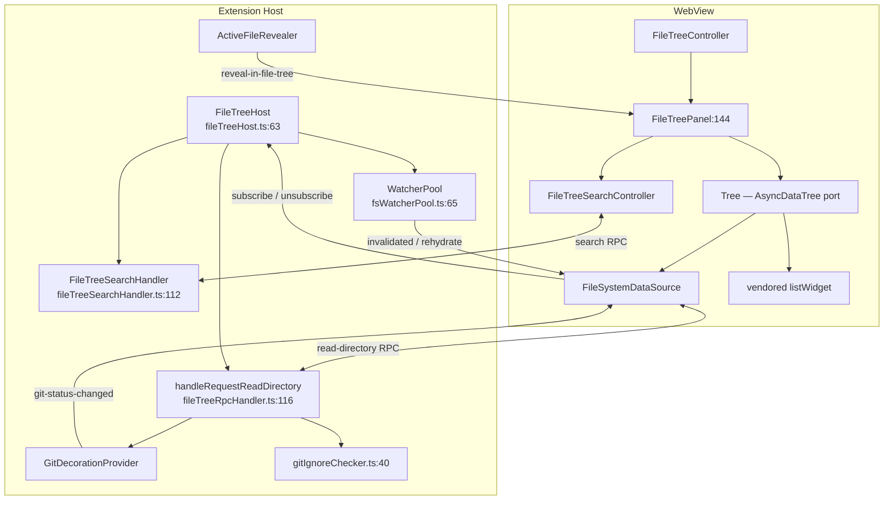
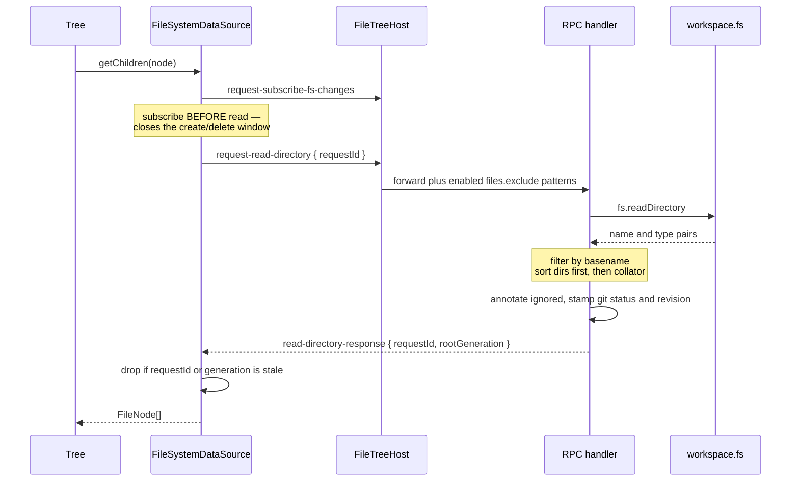
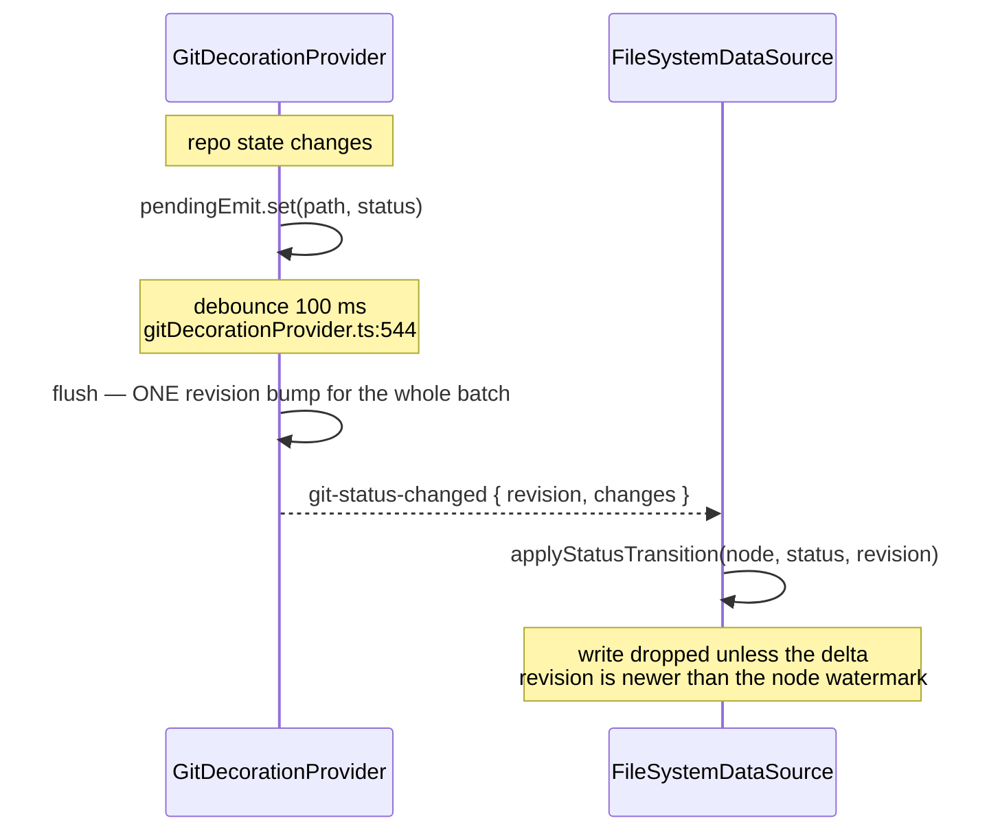
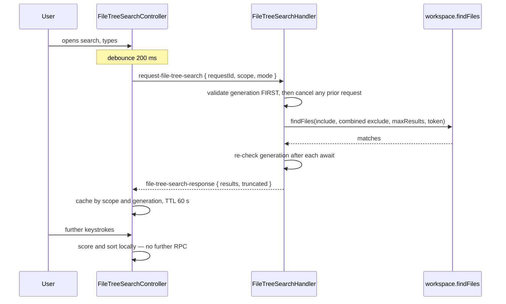
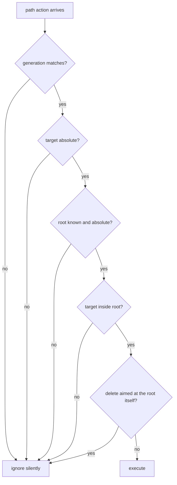

# File Tree — Detailed Design

## 1. Overview

The file tree is a webview-side explorer mounted beside the terminal in every location.
It is a port of VS Code's `AsyncDataTree` — an identity-keyed, lazily-expanding virtual
tree over the vendored list widget — driven entirely by a correlated RPC to the host.

### Goals
- **Terminal-adjacent, not workspace-bound.** The tree follows wherever the shell went,
  including outside the workspace. That is the mental model a terminal user has.
- **Never blink.** Decoration and status updates must not rebuild rows or collapse
  expanded subtrees.
- **Never apply a stale answer.** Reads, git deltas, and searches all race each other and
  a possible re-rooting.
- **Bounded cost.** Watchers, search results, and enumerations all carry explicit caps.

### Constraints
- The webview has **no filesystem**. Every read, watch, and mutation is an RPC.
- Responses arrive out of order, and a workspace re-root can invalidate any of them
  mid-flight (§3).
- Git status and directory reads are **two independent sources for the same field**, so
  one must be able to tell which is newer (§6.3).
- The list widget, the fuzzy matcher (`vs/base/common/filters`), and the Seti icon set
  are **vendored VS Code code** under `src/vendor/`, consumed as-is. Their internals are
  out of scope here.

### Non-goals
- Message shapes and dispatch → [message-protocol.md](message-protocol.md) §4.3
- Hover preview of terminal links → [link-detection.md](link-detection.md) §7. The tree
  shares that popup but not the detection.

---

## 2. Architecture

`FileTreeHost` is constructed once per webview-hosting provider and attached inside that
provider's webview-resolve method (`fileTreeHost.ts:145`). Both providers route the ten
file-tree message types into `FileTreeHost.handleMessage` (`:239`), which is why the tree
behaves identically in the sidebar, the panel, and an editor tab — unlike most of the
rest of the protocol (see [message-protocol.md](message-protocol.md) §8.1).

Note the two paths into `DS` from the host: the RPC reply and the git delta. §6.3 is
about reconciling them.

---

## 3. The Generation Gate

`FileTreeHost.rootGeneration` (`fileTreeHost.ts:64`) is a monotonic counter bumped on
every workspace-root change. Correlation ids alone cannot solve this: a reply can be for
the right request and still describe the wrong root.

| Direction | Rule | Site |
|-----------|------|------|
| Request | Every file-tree request carries the generation; the host rejects a mismatch | `fileTreeHost.ts:244-254`, `fileTreeRpcHandler.ts:148` |
| Response | Every response echoes it; the webview drops a mismatch | `FileTreeController.ts:160-167`, `FileSystemDataSource.ts:684` |
| Path action | Re-checked alongside absoluteness and containment before acting | `fileTreeHost.ts:470-488` |

**One deliberate exception.** `request-unsubscribe-fs-changes` bypasses the gate
(`fileTreeHost.ts:292-299`) — unsubscribing is idempotent cleanup, and dropping a stale
one would leak watchers for the lifetime of the window.

---

## 4. Directory Reads

Subscribing before reading is the ordering that matters: the reverse leaves a window in
which a file created between the two calls is never reported. A failed read rolls the
subscription back.

`requestId` is minted as `sourceId` plus a counter (`FileSystemDataSource.ts:622`) and
matched in `handleResponse` (`:684`).

### 4.1 Entry shaping

| Step | Behavior | Site |
|------|----------|------|
| Exclusion | Only `files.exclude` entries valued literally `true`, compiled to a **basename** regex — `*` and `?` only, no braces, no internal slashes | `fileTreeRpcHandler.ts:30-36`, `:59-71` |
| Type bits | A directory symlink is `Directory\|SymbolicLink` and still counts as a directory | `fileTreeRpcHandler.ts:82-88` |
| Sort | Directories first, then a base-sensitivity numeric collator, matching VS Code's explorer | `fileTreeRpcHandler.ts:93-99` |
| Ignore | `git check-ignore` annotation | `fileTreeRpcHandler.ts:217-229` |
| Git | Status, revision, and descendant buckets | `fileTreeRpcHandler.ts:236-257` |

Exclusion is evaluated at a single directory level because the handler enumerates one
folder per call, which is why patterns containing a slash are dropped rather than
approximated (`fileTreeRpcHandler.ts:61-64`).

**Reads are not workspace-restricted**, and this is a decision rather than an oversight
(`fileTreeRpcHandler.ts:109-114`): the tree can re-root to any directory the shell
entered, and the OS remains the effective boundary. See §11.2.

Error codes: `STALE_ROOT` (`fileTreeRpcHandler.ts:148`) and `FS_ERROR` (`:174`).

### 4.2 Identity and eviction

`getChildren` (`FileSystemDataSource.ts:274-407`) keeps an identity-stable node cache so
an expanded subtree survives a re-read of its parent:

- **Bucket adoption** (`:357-376`) — a re-read child inherits the previous node's
  descendant counts, so folder badges do not flicker mid-refresh.
- **Pending-status drain** (`:380-386`) — a git delta that landed while the read was in
  flight is applied to the fresh nodes rather than lost.
- **Subtree eviction** (`:397-405`, `evictSubtree` `:415`) — vanished children are
  dropped with their descendants and their watcher subscriptions.

`gitStatus` on a node has exactly **one** writer, `applyStatusTransition`
(`FileSystemDataSource.ts:569`), asserted at `IFileSystemProvider.ts:33-38`. That
single-writer rule is what makes the watermark in §6.3 enforceable.

---

## 5. Filesystem Watching

`fsWatcherPool.ts` owns one refcounted watcher per directory.

| Value | Meaning | Canonical site |
|-------|---------|----------------|
| `DEBOUNCE_MS = 150` | Trailing debounce coalescing create/delete per directory | `src/providers/fsWatcherPool.ts:35` |
| `SOFT_CAP = 500` | One-shot warning threshold on live watcher count | `src/providers/fsWatcherPool.ts:38` |

Surface: `subscribe`, `subscribePattern`, `onDidRequestRehydrate`, `dispose`
(`fsWatcherPool.ts:65-111`).

Per-directory watchers are **non-recursive and ignore change events**
(`fsWatcherPool.ts:184-185`). The tree only cares about the row set — a file's contents
changing is a git concern, and arrives as a decoration delta instead. `subscribePattern`
is the only entry point that surfaces change events.

Coalesced events fan out as `fs-changes-invalidated` (`scheduleFanout` `:212`).

**Focus rehydrate.** A watcher cannot report what happened while VS Code was backgrounded
on every platform, so a rising edge on window focus (`fsWatcherPool.ts:172-180`) fires
`onDidRequestRehydrate`; the webview then re-reads the root and every expanded directory
(`FileTreePanel.ts:747`).

---

## 6. Git Decorations

### 6.1 Acquisition and mapping

The provider consumes the built-in `vscode.git` extension's API v1 through minimal
vendored typings (`src/providers/git.ts:53-75`), walking a five-stage lifecycle
(extension present → activated → `getAPI(1)` → repositories → per-repo subscriptions) and
keeping only repositories contained by a workspace folder
(`gitDecorationProvider.ts:172-194`). Per-repo state is keyed by root path (`:198`).

A path can appear under several git states at once (staged-added *and*
working-tree-modified). `pickHigherSeverity` (`gitStatusMapping.ts:79`) resolves it by a
fixed order — conflicted 6, deleted 5, modified 4, renamed 3, added 2, untracked 1,
ignored 0 (`src/providers/gitStatusMapping.ts:64-72`).

### 6.2 Propagation to folders

A collapsed folder shows the dominant status among its descendants.
`getDescendantBuckets` (`gitDecorationProvider.ts:605`) counts per status, **excluding
`deleted` and `ignored`** (`:631`) — a deleted file no longer occupies a row, and an
ignored one is not interesting. The webview keeps those counts incrementally via
`adjustAncestorBuckets` (`FileSystemDataSource.ts:78`) and `walkAncestorsAndAdjust`
(`:600`), rendering the winner through `dominantDirtyStatus` (`folderDirtyState.ts:7`).
The propagating set is conflicted, modified, renamed, added, untracked
(`src/webview/fileTree/folderDirtyState.ts:5`).

### 6.3 The revision watermark

Git deltas and directory reads both write `gitStatus`, and they race.

One flush bumps the counter once, so every change in a delta shares a revision
(`gitDecorationProvider.ts:540-546`). A directory read stamps the same counter
(`fileTreeRpcHandler.ts:236-257`). Because `applyStatusTransition` is the sole writer
(§4.2) and compares against the per-node watermark, a read that started before a delta
can never overwrite it — regardless of which reply lands first.

### 6.4 Rendering

| Concern | Site |
|---------|------|
| Status → CSS class | `ReadOnlyFileRenderer.ts:39` |
| Status → badge letter; `ignored` renders empty | `ReadOnlyFileRenderer.ts:50` |
| Folder dirty-kind classes | `ReadOnlyFileRenderer.ts:71` |
| Indent — `20 + depth * 20` px | `ReadOnlyFileRenderer.ts:242` |
| Drag MIME `application/x-anywhere-terminal-file-tree-path` | `ReadOnlyFileRenderer.ts:101` |

A delta calls `rerenderRows()` (`FileTreePanel.ts:677`), never `refresh()`.
`Tree.refresh` (`Tree.ts:637`) deliberately does not rebuild the row array — that
restraint is what keeps decoration updates blink-free (goal 2).

### 6.5 Gitignore

`getIgnoredPaths` (`gitIgnoreChecker.ts:40`) shells out to `git check-ignore -z --stdin`
with a `TIMEOUT_MS = 1500` budget (`src/providers/gitIgnoreChecker.ts:18`). Exit codes
**0 and 1 are both success** (`:72`) — `1` means nothing in the batch is ignored. Any
other outcome resolves to an empty set: the annotation is decorative, never load-bearing
(`gitIgnoreChecker.ts:14`).

---

## 7. Search

The host performs **one** enumeration; all filtering, scoring, and highlighting happen in
the webview, so keystrokes after the first cost no IPC.

| Value | Meaning | Canonical site |
|-------|---------|----------------|
| `[1, 5000]`, default `2000` | Host clamp on `maxResults` | `src/providers/fileTreeSearchHandler.ts:29-31` |
| `2000` | Cap the webview requests | `src/webview/fileTree/search/FileTreeSearchController.ts:25` |
| `200 ms` | Enumeration debounce | `src/webview/fileTree/search/FileTreeSearchController.ts:27` |
| `60_000 ms` | Cache TTL, guarding against silent fs drift | `src/webview/fileTree/search/FileTreeSearchController.ts:29` |

`truncated` is set when the result count reaches the cap
(`fileTreeSearchHandler.ts:194`). The exclude glob is `files.exclude` ∪ `search.exclude`
(`:57-78`) — deliberately **wider** than the read path's `files.exclude`-only set (§4.1),
matching VS Code's own split between what you browse and what you search.

**Cancellation.** The handler owns at most one enumeration (`:107-113`). A newer request
is validated *before* the old one is cancelled, so a request bearing a stale generation
cannot kill a good enumeration already running. `cancel-file-tree-search` cancels the
token and posts nothing (`:223`); the webview sends it when search closes (`:284`) and
when the root changes (`:307`).

Scoring runs over the relative path only (`search/matching.ts:44`, `:94`). Overflow and
error states are rendered as sentinel rows rather than real entries
(`FileTreeSearchController.ts:32`, `:34`, recognized at `:103`).

---

## 8. Row Actions and Reveal

All four actions are host-executed, and the webview sends only a path plus a generation —
never a base. The host derives the root from its own state.

| Action | Host handler | Note |
|--------|--------------|------|
| Reveal in OS | `fileTreeHost.ts:382` | — |
| Copy path | `fileTreeHost.ts:393` | absolute |
| Copy relative path | `fileTreeHost.ts:404` | base is the host's active root; output forward-slashed (`:501`) |
| Delete | `fileTreeHost.ts:418` | modal confirm, trash rather than unlink, **re-validated after the confirm**, then invalidate the parent (`:461-467`) |

`isSameOrInside` (`:495`) rejects `..` traversal and absolute escapes; `pathApiFor`
(`:505`) switches to Windows path semantics when either side looks like a Windows path.
Delete passes the reject-root flag, so the active root can never be trashed. Re-validating
*after* the modal matters — the user may have re-rooted while the dialog was open.

**Reveal** arrives from two sources distinguished by a `source` field: the active-editor
revealer and shell-driven `cd` / open-folder. The revealer debounces 100 ms
(`ActiveFileRevealer.ts:12`), compares case-insensitively off Linux (`:15`), accepts only
`file:`-scheme text, custom, and notebook tabs (`:45`), and walks ancestors when matching
excludes (`:24`). On the webview side `revealPath` (`FileTreePanel.ts:290-398`) expands
ancestors then calls `revealElement` (`Tree.ts:716`), which no-ops when the row is already
visible — so reveal never scroll-jitters.

---

## 9. Layout and Settings

| Concern | Behavior | Site |
|---------|----------|------|
| Row height | 22 px | `src/webview/fileTree/Tree.ts:38` |
| Row diff | Prefix/suffix diff, then one splice | `Tree.ts:1011` |
| Selection | Snapshotted before flattening, restored after | `Tree.ts:790` |
| Stale async | Child loads compare the **promise reference** on resolve | `Tree.ts:939` |
| Root row | Hidden in the list, rendered by the panel header instead | `FileTreePanel.ts:1475`, `:807-977` |
| Initial size | 240 px horizontal, 200 px vertical | `src/webview/fileTree/FileTreePanel.ts:139-140` |
| Size clamp | Floor 120 px, ceiling 85% of the container | `FileTreePanel.ts:142`, `:1645` |

Default position depends on where the terminal is hosted — panel → right, editor → left,
sidebar → bottom (`FileTreeController.ts:70-78`), each choosing the axis with room to
spare.

| Setting | Default | Read at |
|---------|---------|---------|
| `anywhereTerminal.fileTree.autoReveal` | `true` | `src/settings/FileTreeSettingsReader.ts:35` |
| `anywhereTerminal.fileTree.autoRevealExclude` | `**/node_modules`, `**/bower_components` | `FileTreeSettingsReader.ts:16-19`, `:36` |
| `files.exclude` | VS Code default | `fileTreeRpcHandler.ts:31` |
| `search.exclude` (search only) | VS Code default | `fileTreeSearchHandler.ts:59` |

`autoReveal` accepts booleans, their string forms, and `focusNoScroll`, defaulting to
reveal for anything unrecognized (`FileTreeSettingsReader.ts:44-55`). VS Code's
`{ when: … }` exclude shape is **not** honored; such entries are dropped with a one-shot
warning (`:21-22`, `:57-60`).

---

## 10. Boundaries and Decisions

| Decision | Rationale |
|----------|-----------|
| Reads are not workspace-restricted | The tree follows the shell. Restricting it would break the core mental model; the OS permission model is the real boundary (`fileTreeRpcHandler.ts:109-114`) |
| Path actions take no base from the webview | The host owns the root, so a buggy or compromised webview can name a target but never widen its own reach (§8) |
| One writer for `gitStatus` | Makes the revision watermark enforceable at a single point rather than at every call site (`FileSystemDataSource.ts:569`) |
| Watchers ignore change events | Row-set changes are the tree's concern; content changes arrive as git deltas, avoiding a second high-frequency event stream (`fsWatcherPool.ts:184-185`) |
| Search filters client-side | One enumeration serves an entire typing session; per-keystroke IPC would dominate the latency budget (§7) |
| Vendored list widget, matcher, icons | Reused rather than reimplemented. Their internals are explicitly not documented here |

### Known drift

| # | Finding | Evidence |
|---|---------|----------|
| 1 | `OUT_OF_WORKSPACE` is documented as an error code for both file-tree responses, but no handler emits it — a leftover from when reads *were* restricted | Documented `src/types/messages.ts:968`, `:987`; emitters are `STALE_ROOT`/`FS_ERROR` (`fileTreeRpcHandler.ts:148`, `:174`) and `STALE_ROOT`/`INTERNAL`; removal recorded in `src/test/fileTreeRpc.integration.test.ts:151` |
| 2 | `FileTreeHost.handleMessage` returns a boolean its doc comment shows being branched on, but both callers group the cases and discard it | Doc `fileTreeHost.ts:228-238`; callers `TerminalViewProvider.ts:1255`, `TerminalEditorProvider.ts:602` |

### File locations

Host: `fileTreeHost.ts` (routing, path actions), `fileTreeRpcHandler.ts` (reads),
`fileTreeSearchHandler.ts` (search), `fsWatcherPool.ts`, `gitDecorationProvider.ts`,
`gitStatusMapping.ts`, `gitIgnoreChecker.ts`, `git.ts`, `ActiveFileRevealer.ts`, all under
`src/providers/`; settings in `src/settings/FileTreeSettingsReader.ts`.

WebView: `src/webview/fileTree/` (controller, panel, tree, data source, renderer, sash,
context menu) and `src/webview/fileTree/search/`.
