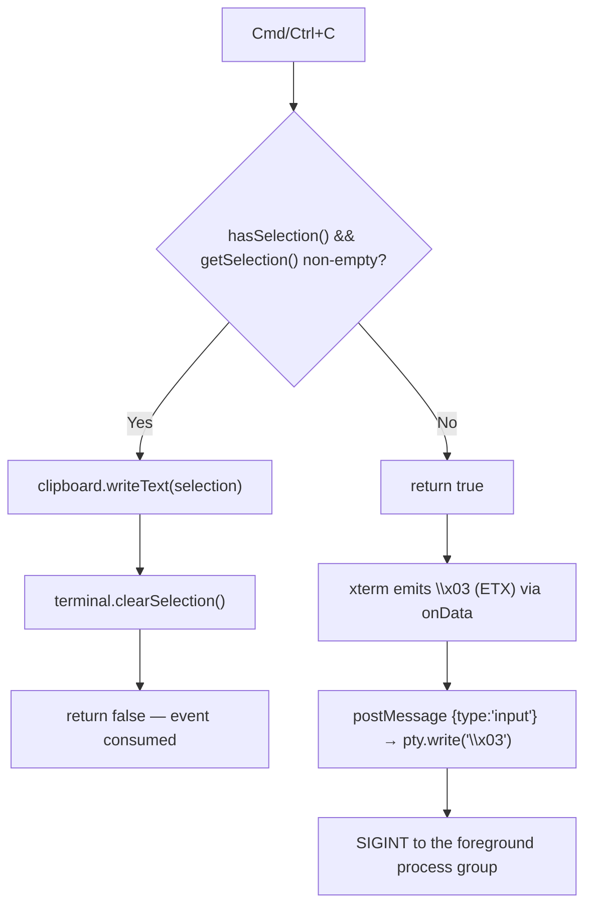
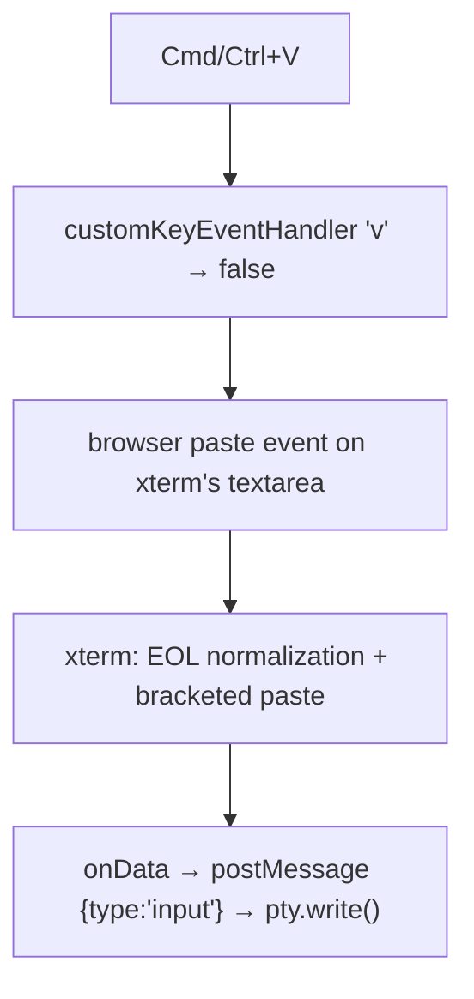
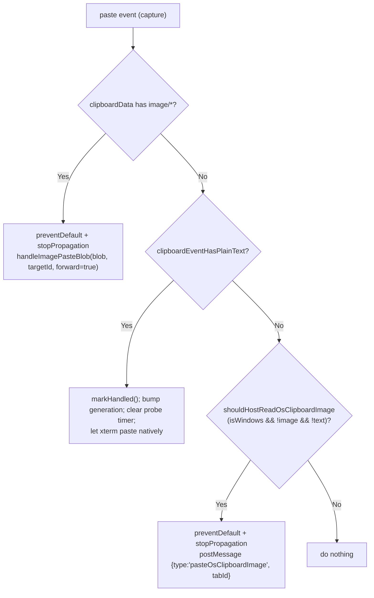
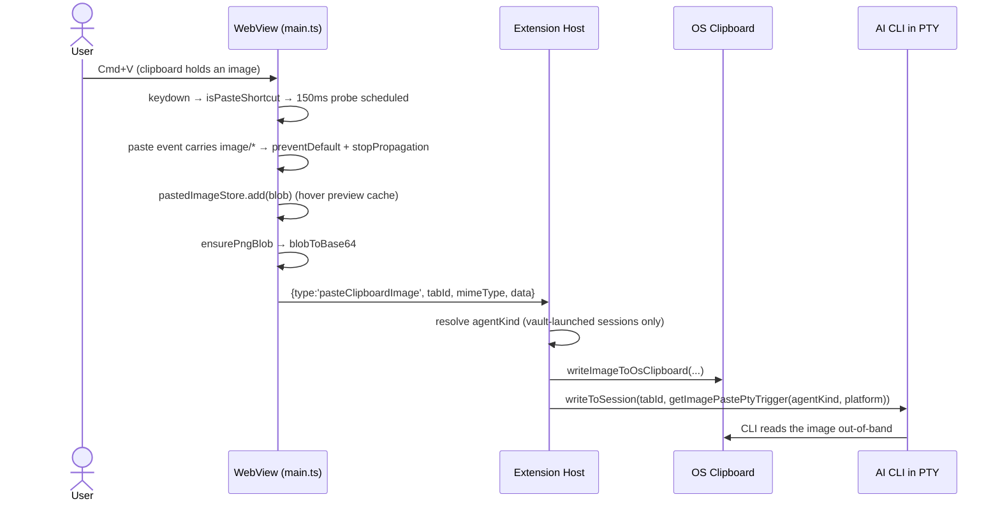
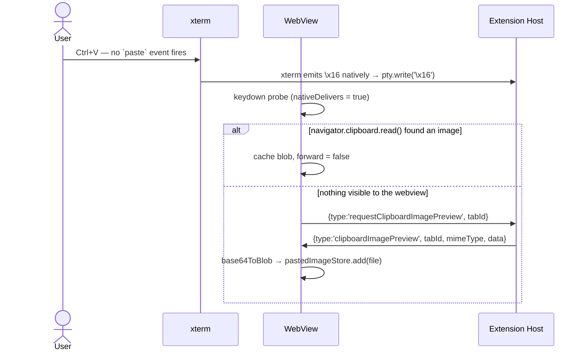

# Flow: Clipboard, Image Paste, and Drag-Drop

> Part of [DESIGN.md](../DESIGN.md)

## Overview

Three distinct flows move content between the OS and the terminal:

| Flow | Direction | Owner | Bytes over the PTY? |
|---|---|---|---|
| **Copy** | terminal → OS clipboard | `InputHandler.ts` | no |
| **Text paste** | OS clipboard → terminal | xterm's native `paste` event | yes |
| **Image paste** | OS clipboard → AI CLI | `imagePasteBridge.ts` + `providers/clipboardImageSync.ts` | **no** — only a trigger byte |
| **Drag-drop** | file path → terminal | `DragDropHandler.ts` | yes (escaped path text) |

The image flow is the unusual one: image bytes **never traverse the PTY**. AI CLIs (Claude Code, Codex, OpenCode, Grok) read the OS clipboard out-of-band once they see a trigger byte, so the host mirrors the image onto the OS clipboard and then writes a single short sequence into the PTY.

> **Cross-references**: [keyboard-input.md](keyboard-input.md) | [message-protocol.md](message-protocol.md)

---

## 1. Copy

`Cmd+C` (macOS) / `Ctrl+C` (elsewhere) is dual-meaning: **copy** when text is selected, **SIGINT** when it is not.



Implementation: `src/webview/InputHandler.ts:81-95`. The clipboard write is fire-and-forget with a `.catch` that logs a warning (`InputHandler.ts:86-88`); `clipboard` itself is `undefined` when `navigator.clipboard` is unavailable (`terminal/TerminalFactory.ts:160-163`).

`Cmd/Ctrl+A` → `terminal.selectAll()` (`InputHandler.ts:110-112`).

---

## 2. Text Paste — native xterm

There is **no** custom `handlePaste()`. `Cmd/Ctrl+V` returns `false` from the key handler, which skips xterm's *keydown* processing while the browser's native paste event still fires on xterm's internal textarea. xterm normalizes line endings, applies bracketed-paste mode from `terminal.modes.bracketedPasteMode`, and routes the result through `onData` (`InputHandler.ts:97-103`).



The document-level `paste` capture listener (`main.ts:1232-1285`) sees the event first, but for plain text it **deliberately does nothing except cancel the image probe** and lets the event continue to xterm (`main.ts:1254-1267`). Keeping text on the native path means it is instant — no waiting on a host clipboard probe.

---

## 3. Image Paste

### 3.1 Why it needs a bridge

An AI CLI running inside the PTY cannot receive image bytes through the terminal stream. Each CLI instead reads the OS clipboard itself when it sees a paste signal. The webview can see a pasted image blob but cannot write to the OS clipboard in a way those CLIs read, so:

1. The **webview** captures the blob (for hover preview) and base64s it to the host.
2. The **host** writes it to the OS clipboard using platform tooling.
3. The **host** writes the CLI-specific trigger bytes into the PTY.

### 3.2 The trigger table (canonical)

`getImagePastePtyTrigger(agentKind, platform)` — `src/shared/imagePasteTrigger.ts:63-74`.

| Constant | Bytes | When | Cite |
|---|---|---|---|
| `CTRL_V_PASTE` | `\x16` | any CLI in `CTRL_V_AGENTS` (Codex / OpenCode / Grok) on **any** OS; and Claude/unknown on Linux | `imagePasteTrigger.ts:27,64,73` |
| `BRACKETED_EMPTY_PASTE` | `\x1b[200~\x1b[201~` | Claude / unknown on **macOS** | `imagePasteTrigger.ts:24,67-69` |
| `ALT_V_PASTE` | `\x1bv` | Claude / unknown on **Windows** — Claude Code binds image paste to Alt+V there; Ctrl+V is an ordinary text paste | `imagePasteTrigger.ts:34,70-72` |

`CTRL_V_AGENTS` is derived from `AGENT_USES_CTRL_V` in `src/vault/types.ts`, so adding a vault agent without declaring its trigger is a compile error (`imagePasteTrigger.ts:42-47`).

| Constant | Value | Cite |
|---|---|---|
| `MAX_PASTE_IMAGE_BYTES` | **20 MB** (`20 * 1024 * 1024`) — enforced webview-side on `blob.size` and host-side on the decoded length | `imagePasteTrigger.ts:21`; webview `main.ts:1172-1175`; host `clipboardImageSync.ts:404`, `:337` |

**Known limitation** (documented in code at `imagePasteTrigger.ts:55-62`): `agentKind` is only known for vault-**launched** sessions — the host derives it from `session.shell` via `agentKindForExecutable` and only when `session.isAgentLaunch` (`TerminalViewProvider.ts:900-901`). A Codex/OpenCode started by hand in a plain shell reports `agentKind: undefined`, so on macOS it falls to the bracketed-paste branch, which Codex ignores — the Cmd+V forward path then no-ops. macOS Ctrl+V is unaffected (xterm emits `\x16` natively and the host sends no trigger).

### 3.3 Webview capture paths

Two listeners cooperate, deduplicated by `ImagePasteDeduper` (`imagePasteBridge.ts:138-152`) and a monotonically increasing `pasteProbeGeneration`.

| Constant | Value | Cite |
|---|---|---|
| `PASTE_PROBE_DEBOUNCE_MS` | **150 ms** trailing debounce — a burst of Ctrl+V (vim visual-block, key repeat) collapses to one clipboard read | `main.ts:1166` |

#### (a) `keydown` capture probe — `main.ts:1183-1230`

Gated by `isPasteShortcut(event, isMac)` (`imagePasteBridge.ts:47-57`), which accepts, with no Alt and no Shift:

- macOS: **either** `metaKey` (the OS accelerator, fires a `paste` event) **or** `ctrlKey` (no `paste` event; xterm sends `\x16` natively, which OpenCode/Codex use to read the clipboard themselves).
- Elsewhere: `ctrlKey`.

After the debounce, `probeClipboardForImageBlob()` (`imagePasteBridge.ts:158-174`) reads `navigator.clipboard.read()` and returns the first `image/*` item. The result is dropped if a newer shortcut superseded this generation or the `paste` listener already handled it (`main.ts:1211-1213`).

`nativeDelivers` = macOS **Ctrl+V** (`main.ts:1196`). In that case the CLI already got the image via `\x16`, so the blob is cached for **preview only** — `handleImagePasteBlob(file, targetId, /* forward */ false)`. Forwarding would double-paste (`main.ts:1171,1217`).

If the probe finds nothing under `nativeDelivers`, the webview asks the host for a preview-only read: `{type:'requestClipboardImagePreview', tabId}` (`main.ts:1224`). This is never done from keydown for the non-`nativeDelivers` case, because it would race with native text paste.

#### (b) `paste` capture listener — `main.ts:1232-1285`



The image branch is **authoritative** and never consults the sticky dedup flag — a context-menu paste has no preceding keydown and must not be dropped (`main.ts:1243-1252`).

`shouldHostReadOsClipboardImage` is Windows-only (`imagePasteBridge.ts:38-44`): Windows DIB/CF_BITMAP never surfaces as `image/*` in a webview paste event, and Linux never needs it (the host read is a no-op there).

### 3.4 Blob normalization

`ensurePngBlob(blob)` (`imagePasteBridge.ts:94-115`) re-encodes any non-PNG image through `createImageBitmap` + `OffscreenCanvas`. Every target CLI reads the clipboard as PNG (`osascript «class PNGf»`, `arboard`, `-t image/png`), so a pasted JPEG/GIF/WebP would otherwise land as corrupt PNG-labeled bytes. It falls back to the original blob when the canvas APIs are missing (e.g. the test environment) or re-encoding throws.

`blobToBase64` chunks at `0x8000` bytes to avoid blowing the argument limit of `String.fromCharCode` (`imagePasteBridge.ts:60-69`). `base64ToBlob` decodes host-supplied bytes back for the preview cache (`imagePasteBridge.ts:72-83`).

### 3.5 Host-side OS clipboard write

`writeImageToOsClipboard(mimeType, data)` — `src/providers/clipboardImageSync.ts:145-185`.

| Platform | Mechanism | Timeout | Cite |
|---|---|---|---|
| Linux, Wayland (`$WAYLAND_DISPLAY`) | `wl-copy --type <mime>` via stdin | none (settles on `close`); stdin `error` swallowed so an EPIPE cannot take down the host | `clipboardImageSync.ts:29-53,92-96` |
| Linux, X11 (`$DISPLAY`) | `xclip -selection clipboard -t <mime> -i` | **2000 ms** kill — xclip forks into a clipboard owner and would otherwise hang `execFile` | `clipboardImageSync.ts:61-89,98-102` |
| macOS | `osascript -e 'set the clipboard to (read (POSIX file "…") as «class PNGf»)'` | **2000 ms** | `clipboardImageSync.ts:107-116` |
| Windows | PowerShell `System.Windows.Forms.Clipboard::SetImage` | **5000 ms** | `clipboardImageSync.ts:121-138` |

macOS/Windows go through a temp file written into a per-write `fs.mkdtemp` directory (mode 0700) rather than a predictable name in the shared tmpdir — this closes a symlink-swap race on multi-user `/tmp` (CWE-377). The directory is removed in a `finally` (`clipboardImageSync.ts:159-184`).

> Known limitation recorded in code: Windows `Clipboard::SetImage` places a Bitmap/DIB, which carries no alpha — a CLI reading it back via `arboard` loses PNG transparency (`clipboardImageSync.ts:118-120`).

`handlePasteClipboardImage(payload, writeToSession, context)` (`clipboardImageSync.ts:388-413`) validates the base64 with `/^[A-Za-z0-9+/]*={0,2}$/`, enforces `MAX_PASTE_IMAGE_BYTES`, writes the clipboard, then writes the trigger. A write failure does **not** abort the trigger — the image may already be on the clipboard from an external copy (`clipboardImageSync.ts:140-144`).

### 3.6 Host-side OS clipboard read

`readImageFromOsClipboard()` — `clipboardImageSync.ts:320-341`. macOS and Windows only; Linux returns `null` (the webview probe covers it).

macOS reads in two steps (`clipboardImageSync.ts:259-284`):

1. `POSIX path of (the clipboard as «class furl»)` — a **copied image file** (Finder Cmd+C). Coercing that file-URL to `«class PNGf»` would yield the generic file *icon*, not the image, so the real bytes are read from disk after an extension→MIME check and a size/`isFile` gate (`clipboardImageSync.ts:187-203,269-279`).
2. Otherwise `the clipboard as «class PNGf»` — the correct read for bitmap content (screenshot-to-clipboard, copy-image-in-browser). The coercion throws when the clipboard holds no image, which *is* the "is there an image?" probe (`clipboardImageSync.ts:223-257`).

`handlePasteOsClipboardImage` (`clipboardImageSync.ts:352-367`) reads, emits the trigger, and returns the bytes so the webview can cache them for hover preview. It deliberately does **not** re-write the image to the OS clipboard — it is already there, and a second PowerShell spawn on Windows made paste noticeably slower (`clipboardImageSync.ts:346-351`).

### 3.7 End-to-end sequences

#### Cmd+V with an image (macOS / Windows / Linux)



#### macOS Ctrl+V (native delivery, preview only)



#### Windows DIB paste (host-read fallback)

```mermaid
sequenceDiagram
    actor User
    participant WV as WebView
    participant EXT as Extension Host
    participant PTY as AI CLI in PTY

    User->>WV: Ctrl+V — paste event has no image/* and no text/plain
    WV->>WV: shouldHostReadOsClipboardImage → true; preventDefault
    WV->>EXT: {type:'pasteOsClipboardImage', tabId}
    EXT->>EXT: readImageFromOsClipboard() (PowerShell)
    alt image found
        EXT->>PTY: writeToSession(trigger)
        EXT->>WV: {type:'clipboardImagePreview', tabId, mimeType, data}
    else no image
        EXT->>WV: {type:'osClipboardPasteMiss', tabId}
        Note over WV: no-op — text paste never reaches here
    end
```

Host handlers: `TerminalViewProvider.ts:898-952` (mirrored in `TerminalEditorProvider.ts`). Webview handlers: `main.ts:722-737`.

### 3.8 Preview cache

`PastedImageStore` is per session (`TerminalFactory.ts:97,365-366`). `ImagePlaceholderLinkProvider` resolves a hovered `[Image #N]` / `[Image N]` placeholder against it and renders the blob in the hover popup (`TerminalFactory.ts:394-400`). The store is disposed — revoking its object URLs — on every terminal teardown path via `disposeHoverController` (`TerminalFactory.ts:646-648,656-667`).

CSP must allow `blob:` in `img-src` for this to render (`providers/webviewHtml.ts:79`).

---

## 4. Drag-Drop Path Insertion

`src/webview/DragDropHandler.ts`, attached to `#terminal-container` at init (`main.ts:914-918`).

### 4.1 Two branches

| Source | Shift required? | Target pane | Cite |
|---|---|---|---|
| **In-webview file tree** — drag carries `application/x-anywhere-terminal-file-tree-path` | **no** | the pane under the pointer (`resolveLeafAtPoint`), falling back to the active pane | `DragDropHandler.ts:268-283`, MIME at `fileTree/ReadOnlyFileRenderer.ts:101` |
| **VS Code Explorer / OS drag** | **yes** — matches VS Code, which restores pointer-events on Shift | the active pane | `DragDropHandler.ts:285-303` |

Both branches no-op when the target terminal has exited (`DragDropHandler.ts:256-259`).

`resolveLeafAtPoint` defaults to walking ancestors of `document.elementFromPoint(x, y)` for a `data-session-id` — the attribute `SplitContainer` stamps on every `.split-leaf` — so it works with no extra wiring (`DragDropHandler.ts:189-198`).

### 4.2 Path extraction (OS branch)

`extractPathsFromDrop(dataTransfer)` (`DragDropHandler.ts:51-132`) tries five strategies in priority order, matching VS Code's `TerminalInstanceDragAndDropController.onDrop()`, and stops at the first non-empty result. Each is wrapped in try/catch.

| # | `DataTransfer` key | Shape |
|---|---|---|
| 1 | `ResourceURLs` | JSON array of `file://` URI strings (VS Code Explorer tree items) |
| 2 | `CodeFiles` | JSON array of file paths (VS Code internal) |
| 3 | `text/uri-list` | newline-separated `file://` URIs |
| 4 | `DataTransfer.files[i].path` | Electron's non-standard `File.path` |
| 5 | `text/plain` | used only when it starts with `/` |

> OS file-manager (Finder) drops are **not** supported — a sandboxed webview iframe cannot access `File.path` or `webUtils.getPathForFile()` (`DragDropHandler.ts:7-8`).

### 4.3 Escaping

Both branches send `postMessage({type:'input', tabId: targetSessionId, data: escapePathForShell(path) + " "})` — the escaped path plus a trailing space.

`escapePathForShell()` — `src/utils/shellEscape.ts:22-48`, shared with the host-side "Insert Path" command:

1. `\` → `\\`
2. Strip `` ` $ | & > ~ # ! ^ * ; < `` (`BANNED_CHARS`, `shellEscape.ts:7`)
3. Quote: both quote kinds → ANSI-C `$'…'` with `\'`; only `'` → POSIX break-and-escape `'…'\''…'`; otherwise a plain single-quote wrap

### 4.4 Overlay

`showOverlay` creates an absolutely-positioned `div.terminal-drop-overlay` at `z-index: 34` with `pointer-events: none` (`DragDropHandler.ts:308-332`). The hint text switches on Shift state — and is always affirmative for the file-tree branch, which never needs Shift (`DragDropHandler.ts:334-350`):

| State | Text |
|---|---|
| file-tree drag, or Shift held | "Drop to insert path" |
| OS drag without Shift | "Hold Shift to drop file path" |

`dragleave` only removes the overlay when the drag actually left the container — while dragging over xterm's own DOM, `relatedTarget` is still inside (`DragDropHandler.ts:239-248`).

`setup()` is idempotent via an `isSetup` guard and forces `position: relative` on a statically-positioned container (`DragDropHandler.ts:204-221`).

A dismissable tip banner explains the Shift requirement on first run; dismissal is persisted in `vscode.setState()` under `dragDropTipDismissed` (`main.ts:1005-1047`).

---

## 5. Platform Differences

| Shortcut | macOS | Linux / Windows | Action |
|---|---|---|---|
| Copy | `Cmd+C` (with selection) | `Ctrl+C` (with selection) | copy selected text |
| Interrupt | `Ctrl+C`, or `Cmd+C` with no selection | `Ctrl+C` with no selection | SIGINT |
| Paste (text) | `Cmd+V` | `Ctrl+V` | native xterm paste |
| Paste (image) | `Cmd+V` (bridged) or `Ctrl+V` (native `\x16` + preview) | `Ctrl+V` | see §3 |
| Select All | `Cmd+A` | `Ctrl+A` | select all terminal text |
| Clear | `Cmd+K` | `Ctrl+K` | clear + `{type:'clear'}` |

The platform modifier is chosen once from `navigator.platform.includes("Mac")` (`TerminalFactory.ts:182`, `main.ts:1075`).

---

## 6. Edge Cases

1. **Clipboard API unavailable** — `getClipboardProvider()` returns `undefined`; copy still clears the selection and consumes the event (`TerminalFactory.ts:160-168`).
2. **Clipboard permission denied** — `probeClipboardForImageBlob()` swallows the rejection and returns `null` (`imagePasteBridge.ts:170-173`).
3. **Image over the cap** — a `blob.size` above `MAX_PASTE_IMAGE_BYTES` logs a warning and is skipped entirely, webview-side (`main.ts:1172-1175`).
4. **Rapid repeated Ctrl+V** — the 150 ms trailing debounce plus the generation counter collapse the burst to a single clipboard read (`main.ts:1204-1227`).
5. **Context-menu paste (no keydown)** — the `paste` listener's image branch does not gate on the dedup flag, so it is still handled (`main.ts:1243-1247`).
6. **Large text paste** — flows through xterm's native path and the normal per-session flow control; see `output-buffering.md`.
7. **Bracketed paste** — handled entirely inside xterm from `terminal.modes.bracketedPasteMode`. The only place we emit bracketed-paste markers ourselves is `BRACKETED_EMPTY_PASTE`, and its payload is intentionally empty.

---

## 7. Not Implemented

- **OSC 52** — `tmux`/`vim` clipboard access via `OSC 52 ; c ; <base64> ST`. xterm's `ClipboardAddon` is not loaded; the package is not a dependency (`package.json:624-629`).
- **`ClipboardProvider.readText()`** — declared in the interface (`InputHandler.ts:12`) and implemented (`TerminalFactory.ts:165`), but never called: text paste is xterm's, image paste uses `navigator.clipboard.read()` directly.

---

## 8. File Locations

| File | Role |
|---|---|
| `src/webview/InputHandler.ts` | Copy / select-all / clear key branches |
| `src/webview/imagePasteBridge.ts` | Capture predicates, PNG normalization, base64, probe, deduper |
| `src/webview/main.ts:1154-1285` | Keydown probe + `paste` listener wiring |
| `src/webview/DragDropHandler.ts` | Drop overlay, path extraction, pane targeting |
| `src/webview/links/PastedImageStore.ts` | Per-session preview cache |
| `src/utils/shellEscape.ts` | `escapePathForShell()` — shared with the host |
| `src/shared/imagePasteTrigger.ts` | `MAX_PASTE_IMAGE_BYTES` + the PTY trigger table |
| `src/providers/clipboardImageSync.ts` | Host-side OS clipboard read/write + trigger emission |

