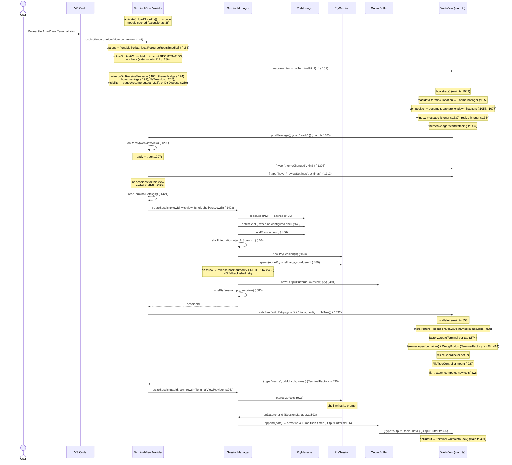
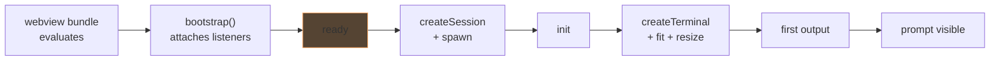
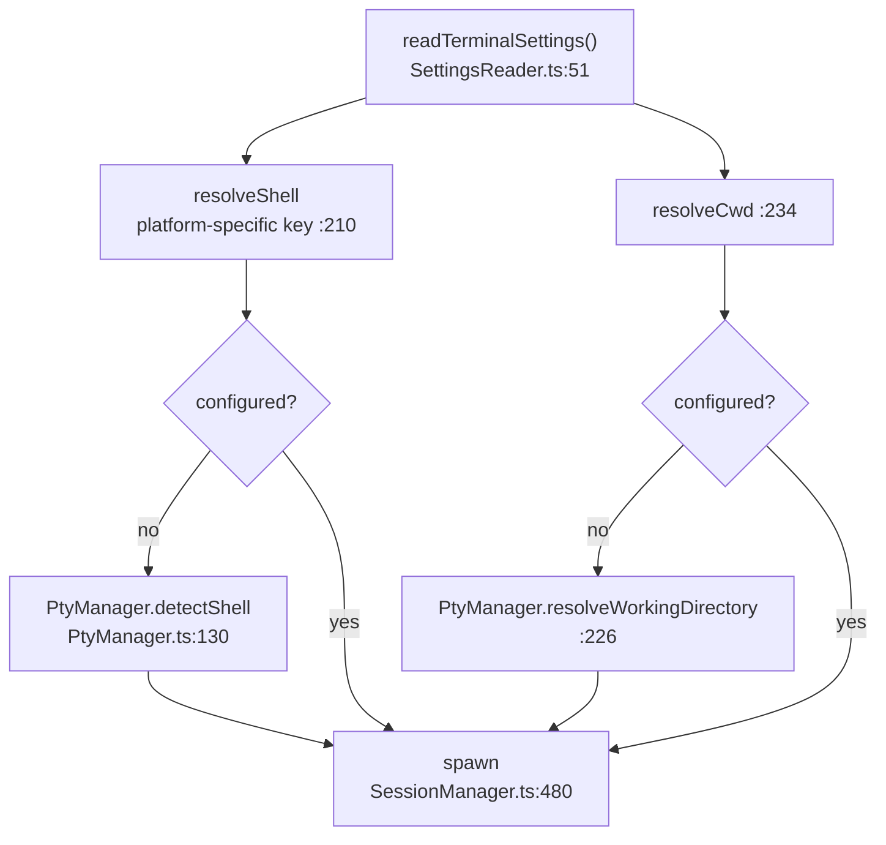

# Flow: Terminal Initialization

> Part of [DESIGN.md](../DESIGN.md) — Section 3.1

## 1. Purpose & Scope

The **cold-open** path: a user reveals the AnyWhere Terminal view in a window that
has no sessions for it, and a shell prompt appears.

### Goals

- Nothing host-side is created until the webview says it is listening — no
  message can be posted into a view that would drop it.
- A broken node-pty install is reported once, at activation, not as a mysterious
  per-terminal failure.
- The shell that gets spawned is one that has been proven to exist and be
  executable, chosen before any process is created.

### Constraints

- The webview bundle is a single esbuild IIFE; there is no dynamic import and no
  loading order to negotiate inside it.
- `postMessage` can be dropped or rejected at any point — the handshake and the
  four structural messages must tolerate it.
- The PTY must be spawned with *some* geometry before the webview has measured
  its container, so the true size always arrives late.

### The two warm paths

A webview re-created with sessions still alive, and a cross-restart snapshot
restore, branch off the same `ready` handshake (`TerminalViewProvider.ts:1321`,
`:1363`) and are documented in
[flow-view-lifecycle.md](flow-view-lifecycle.md).

> **Cross-references**: [pty-manager.md](pty-manager.md) | [session-manager.md](session-manager.md) | [webview-provider.md](webview-provider.md) | [output-buffering.md](output-buffering.md)

---

## 2. Sequence

---

## 3. The `ready` Handshake

`ready` is posted as the **last** statement of `bootstrap()` (`main.ts:1340`),
after every listener is attached. That ordering is the whole contract: the host
creates nothing and posts nothing structural before it, and the cold branch of
`onReady` is the only place a cold-open session is spawned
(`TerminalViewProvider.ts:1422`).

`_ready` also gates the outbound bridges wired in `resolveWebviewView`: theme
(`:176`), hover settings (`:193`), and file tree (`:207`) all no-op until the
handshake completes, and `onReady` posts the initial value of each itself
(`:1303`, `:1312`).

### Retry treatment

`init` is sent through `safeSendWithRetry` (`:1471`) — up to two retries 50 ms
apart, abandoned early if a newer payload has superseded it. A dropped `init`
would leave the webview with no terminal at all, which is why it is one of the
four messages that gets this treatment (`init`, `tabCreated`,
`splitPaneCreated`, `error`). Everything else is fire-and-forget, because a
dropped frame of output or theme is self-correcting and a dropped structural
message is not.

---

## 4. Module Loading

### node-pty (extension host)

Loaded once at `activate` (`extension.ts:38`) so a broken native module surfaces
as a toast immediately rather than on first terminal. Activation deliberately
**continues** on failure (`:47`): the file tree, vault, and commands are all
useful without a PTY. The consequence is that `createSession` throws per session
instead, and `onReady`'s catch turns that into an error message in the webview
(`TerminalViewProvider.ts:1443`). The load result is cached at module level
(`PtyManager.ts:58`), so the call inside `createSession` (`SessionManager.ts:455`)
is a lookup.

### xterm.js (webview)

Statically imported and bundled into the single-file webview bundle
(`TerminalFactory.ts:11`). `FitAddon` and `WebLinksAddon` load at construction
(`:257`–`:258`); `WebglAddon` loads only **after** `terminal.open()` (`:414`),
because opening is what attaches the canvas it needs. A WebGL context loss
disables the addon process-wide for every future terminal (`:417`) rather than
retrying per terminal.

---

## 5. Shell Resolution

`detectShell` walks `SHELL_FALLBACK_CHAINS` (`:69`), validating each candidate
for existence and executability (`:242`) — see [pty-manager.md](pty-manager.md)
§3 for the full algorithm.

**There is no post-spawn retry.** The whole fallback chain is consumed inside
`detectShell`, before any process exists. If `pty.spawn` itself throws,
`createSession` releases the Cursor-hook token and rethrows
(`SessionManager.ts:481`–`:484`); no second shell is attempted. Fallback
respawn-on-*exit* is a different mechanism entirely and belongs to agent launches
— see [session-manager.md](session-manager.md).

---

## 6. Geometry

The PTY spawns at 80×30 (`SessionManager.ts:515`, `PtySession.ts:139`) because a
PTY cannot exist without a size and the webview has not measured anything yet.
The real geometry arrives from the other direction: `FitAddon` computes cols/rows
from the container, xterm fires `onResize`, the webview posts it
(`TerminalFactory.ts:429`), and the host forwards it to the PTY while mirroring
the size into the snapshot (`SessionManager.ts:733`).

`ResizeCoordinator.setup()` is called from `handleInit` (`main.ts:916`), not from
`bootstrap` — the `ResizeObserver` must attach after the container has content,
or its first observation is a 0×0 box (`ResizeCoordinator.ts:83`).

---

## 7. Error Paths

| Failure | Detection | Behaviour |
|---------|-----------|-----------|
| node-pty load | `PtyLoadError` (`PtyManager.ts:112`) | Toast at activate (`extension.ts:41`); activation continues; later `createSession` calls throw |
| Shell binary invalid | validation fails (`PtyManager.ts:242`) | Next candidate in the chain; the last resort is returned unvalidated (`:164`) |
| `pty.spawn` throws | try/catch in `createSession` (`SessionManager.ts:481`) | Hook authority released, rethrown → `onReady` posts an error message (`TerminalViewProvider.ts:1443`) |
| `init` dropped | `safeSendWithRetry` returns false (`:1471`) | Two retries at 50 ms, then given up silently |
| WebView disposed mid-init | post throws or rejects | Swallowed (`:1455`); `onDidDispose` pauses output for the view (`:262`) — sessions survive for re-creation |

> **Known inconsistency:** the node-pty toast says "Requires VS Code >= 1.109.0"
> (`extension.ts:42`) while `package.json:40-42` declares `engines.vscode:
> "^1.105.0"`.

---

## 8. Boundaries & Decisions

- **`retainContextWhenHidden` is a registration-time option**, set on the view /
  panel registration (`extension.ts:212`, `:230`,
  `TerminalEditorProvider.ts:195`), never on `webview.options` where it would
  silently do nothing. It pairs with output pause: a hidden view stops receiving
  output (`TerminalViewProvider.ts:224`) and resumes on re-show (`:218`), and the
  retained context is what makes the resumed flush land on an intact screen.
  Only two other options are set — scripts enabled and asset roots restricted to
  the bundled `media/` directory (`:154`, `:155`).
- **The webview declares readiness; the host never guesses.** No timer, no
  polling, no retry-until-it-answers.
- **There is no pre-launch input queue.** Keystrokes typed before the PTY exists
  are dropped: the input handler posts unconditionally
  (`TerminalFactory.ts:195`) and an unknown session id is a silent no-op
  (`SessionManager.ts:724`). The terminal is not focusable before it exists, so
  the window is imperceptible — and a queue would introduce a replay-ordering
  problem for no observable benefit.
- **Failure to load a native module is not failure to activate.** Everything that
  does not need a PTY still works.
- **Startup owns no flow-control state.** A fresh buffer simply starts at zero
  with the default interval and an unarmed timer (`OutputBuffer.ts:69`, `:84`,
  `:165`); the watermarks and the adaptive interval belong to
  [output-buffering.md](output-buffering.md), not here.
