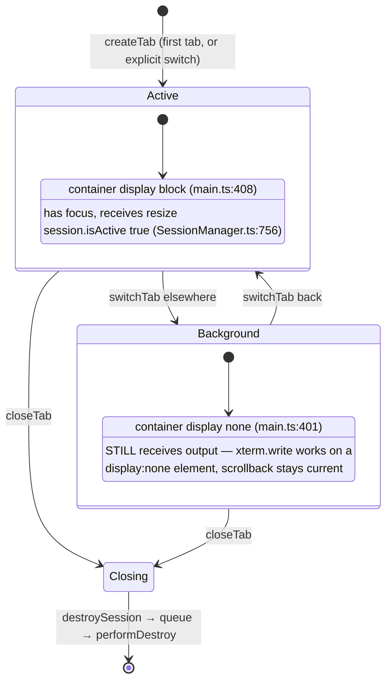
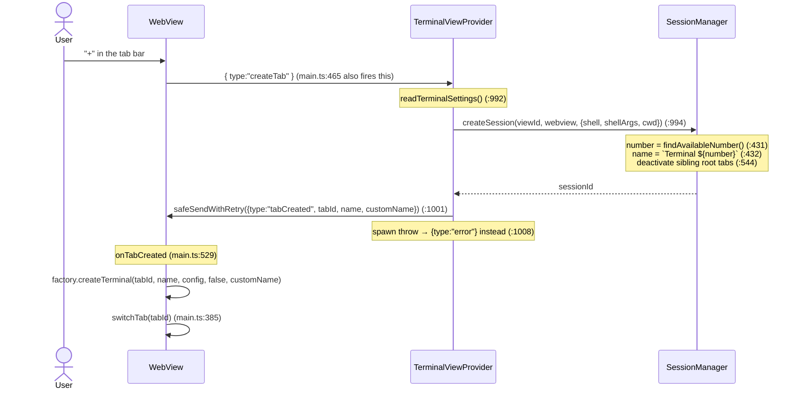
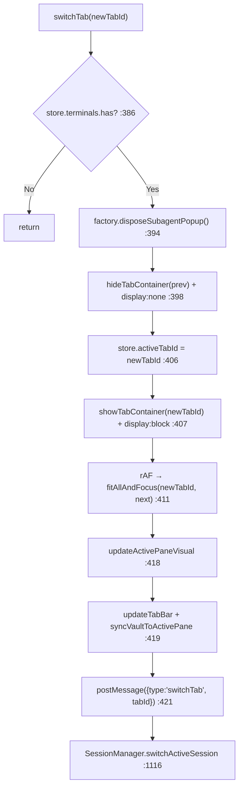
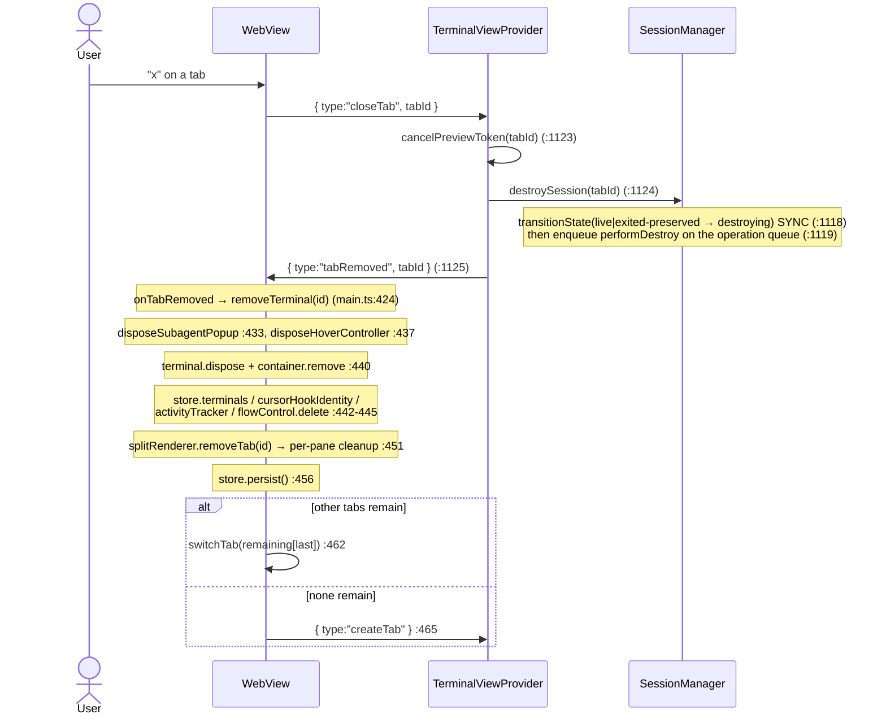
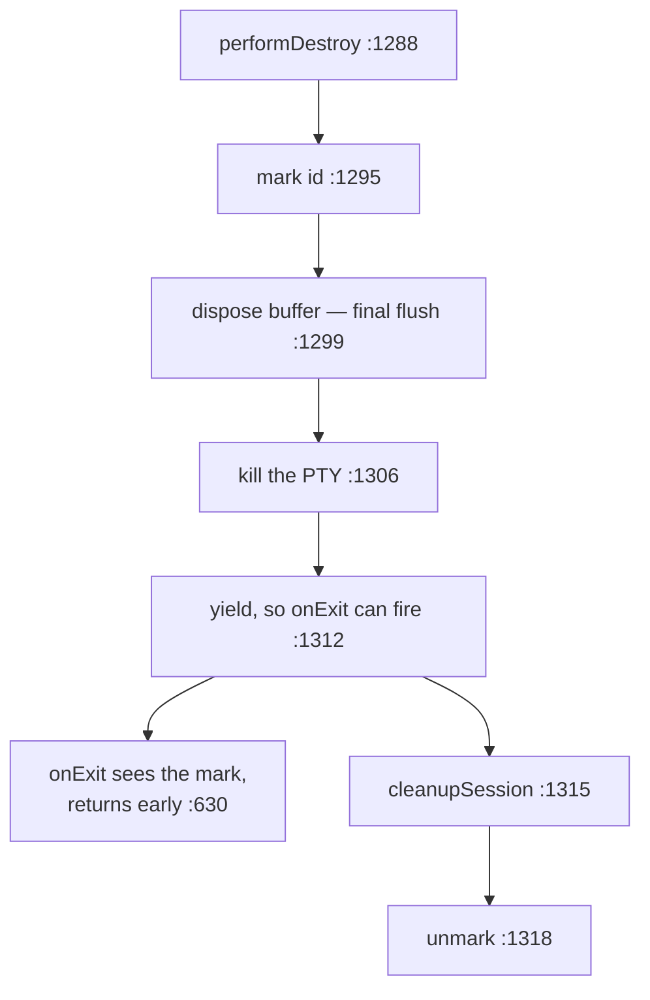
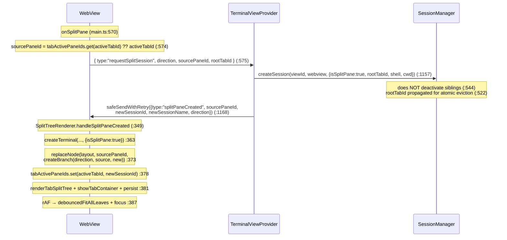
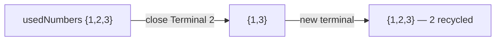
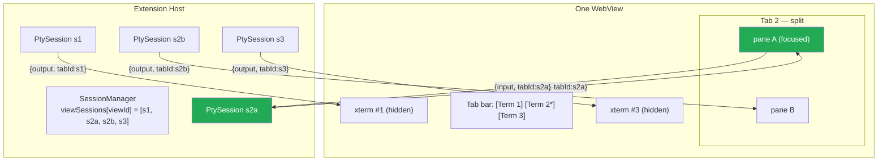
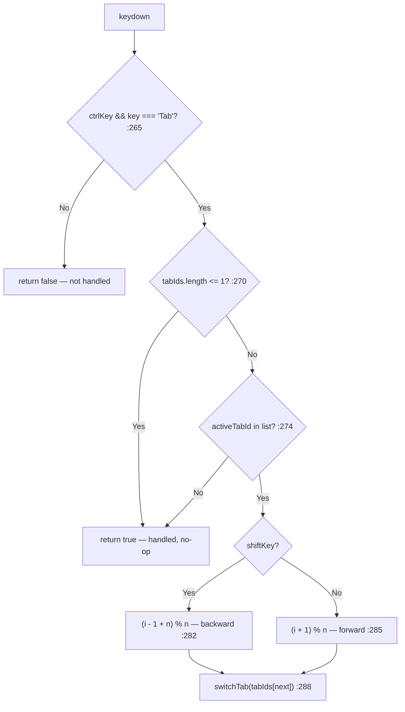

# Flow: Multi-Tab & Split-Pane Lifecycle

> Part of [DESIGN.md](../DESIGN.md) — Section 3.5

## 1. Purpose & Scope

Each view (sidebar, panel, editor tab) hosts multiple **tabs**, and each tab may
be split into multiple **panes**. Every tab *and* every pane is an independent
`TerminalSession` with its own PTY, `OutputBuffer`, and terminal number.

### Goals

- One uniform session concept: a pane is not a lesser kind of terminal, it just
  renders inside someone else's tab.
- Switching tabs must be instant and lossless — no replay, no re-render, no gap
  in what a background shell printed.
- Closing anything must leave no orphaned process, and closing the last thing
  must leave the user with a usable terminal.

### Constraints

- The webview owns layout; the host owns sessions. Neither can see the other's
  structure, so every message carries an explicit id.
- A `display: none` container measures 0×0, so any fit performed while hidden
  produces garbage geometry.
- Destroy is asynchronous but a race with shutdown is not tolerable, so intent
  must be recorded before the work is queued.

### Root tab vs split pane

The distinction that drives everything here:

| | Root tab | Split pane |
|---|---|---|
| `isSplitPane` | `false` | `true` (`SessionManager.ts:519`) |
| `rootTabId` | its own id | the owning tab's id (`:522`) |
| In `getTabsForView` | yes | filtered out (`:784`) |
| In `getAllSessionsForView` | yes | yes (`:798`) |
| Deactivates siblings on create | yes (`:544`) | no |
| Gets a `customName` | yes | never (`:496`) |
| Renamable | yes | `renameSession` no-ops (`:891`) |
| Consumes a terminal number | yes | yes (`:431`) |

> **Cross-references**: [session-manager.md](session-manager.md) | [message-protocol.md](message-protocol.md) | [resize-handling.md](resize-handling.md)

---

## 2. Tab State

Host-side, "active" is just a boolean sweep over the view's sessions:
`switchActiveSession` sets `isActive` true for the target and false for every
other session in the same view (`SessionManager.ts:753`), after rejecting ids
that do not belong to the view (`:750`).

---

## 3. Create Tab

`tabCreated` is one of the four retried messages (`safeSendWithRetry`,
`TerminalViewProvider.ts:1471`) — a dropped one would leave a live PTY with no
xterm to render it.

---

## 4. Switch Tab

`switchTab(newTabId)` — `src/webview/main.ts:385`:

Two details:
- The fit is deferred to `requestAnimationFrame` and **re-checks that the tab
  still exists** (`:412`) — a close racing a switch must not fit a disposed
  terminal.
- The body-mounted subagent popup is disposed on every switch (`:394`); a
  keyboard switch has no outside-click to dismiss it.

### Resize on switch

`fitAllAndFocus` refits every leaf of the tab's split tree
(`TerminalFactory.ts:609`). Any leaf whose computed cols/rows changed fires
xterm's `onResize`, which posts `{type:"resize", tabId, cols, rows}`
(`TerminalFactory.ts:429`) — so a background tab that was hidden while the
sidebar was resized re-syncs its PTY on reveal.

### Background output

All tabs receive output regardless of visibility: `onOutput` looks the instance
up by `tabId` and writes (`main.ts:492`). xterm.js parses into its buffer even
when the container is `display: none`, so switching to a background tab shows
already-rendered scrollback with no replay.

Only the **focused pane** produces input — `onData` is per-terminal
(`TerminalFactory.ts:188`) and the document-capture chords resolve
`tabActivePaneIds.get(tabId) ?? tabId` (`main.ts:1084`).

---

## 5. Close Tab

`removeTab` (`SplitTreeRenderer.ts:233`) disposes each split child's terminal and
posts `{type:"requestCloseSplitPane", sessionId}` per pane (`:247`), so the host
destroys the pane sessions too — the webview never leaves orphaned PTYs behind.

### Kill tracking

`terminalBeingKilled` (`SessionManager.ts:127`) is a **re-entrancy guard between
`performDestroy` and `pty.onExit`**, not a lock on `destroySession`. A deliberate
kill and a shell exiting on its own reach the same cleanup path, so the guard
marks the id for the window between the kill and the yield that lets `onExit`
fire (`:1295`–`:1318`); `onExit` sees the mark and returns without cleaning up a
second time (`:630`).

Serialization comes from the operation queue (`:130`), and destructive **intent**
is recorded synchronously via `transitionState` before enqueueing, so a
`dispose()` racing a queued destroy still drops the snapshot rather than
preserving it. See [session-manager.md](session-manager.md) §5.

### Auto-create on last close

Closing the active tab promotes the last remaining one, and closing the last tab
of all asks the host for a fresh one (`main.ts:459`–`:465`) — a view with a tab
strip and no terminal is not a state the UI has an answer for.

The candidate list is enumerated from `tabLayouts`, not `terminals` — the layout
map is keyed by **root tab**, so a split child can never be promoted into a
tab-strip slot.

---

## 6. Split Panes

### Create

`isSplitPane: true` in `createTerminal` skips two per-tab side effects: it does
not create a `tabLayouts` leaf (the parent's tree already references the pane),
and it skips the `setTimeout(0)` pre-reparent fit that would measure a 0×0
container and emit a spurious resize (`SplitTreeRenderer.ts:359`).

### Close a pane

`closeSplitPaneById(paneSessionId)` (`SplitTreeRenderer.ts:283`):
- layout is a single leaf → fall back to a full `closeTab` (`:294`)
- otherwise `removeLeaf` collapses the branch, the tree re-renders, and the
  caller destroys the pane session via `requestCloseSplitPane`
  (`TerminalViewProvider.ts:1188` → `destroySession`, `:1192`)

### Layout persistence

`WebviewStateStore` holds `tabLayouts` (root tab → `SplitNode`) and
`tabActivePaneIds` (root tab → focused pane), persisted through
`vscode.setState`. On `init` they are filtered against the tab ids the host sent
(`main.ts:860`, `:864`), so a layout referencing a session the host no longer
knows is dropped. See [flow-view-lifecycle.md](flow-view-lifecycle.md) §7.

---

## 7. Terminal Number Recycling

Allocation is the lowest free positive integer, scanned without an upper bound —
there is no maximum tab count (`SessionManager.ts:1392`). Numbers are released in
`cleanupSession` (`:1375`), so a closed terminal's number is immediately
available again. Split panes consume numbers too: a tab split three ways occupies
four.

The restore path reserves a *preferred* number instead (`:1410`), taking it if
free and falling back to a scan otherwise, so a restored terminal usually keeps
the name the user remembers. A non-positive preference means "no preference",
which is how hydrate's orphan-recovery entries
(`SnapshotPersistence.ts:893`) fall through to normal allocation.

---

## 8. Data Routing

Every message in both directions carries `tabId`; the webview routes by
`store.terminals.get(tabId)` and the host by `sessions.get(sessionId)`. There is
no per-view broadcast.

---

## 9. Keyboard Shortcuts

`handleTabKeyboardShortcut` — `src/webview/TabBarUtils.ts:261`, wired at
`main.ts:1148`.

Both directions wrap around. The order is `store.terminals` insertion order
(`:269`), which is creation order, not tab-strip order.

Returning `true` for the single-tab case is deliberate: the caller
`preventDefault()`s (`main.ts:1150`) so Ctrl+Tab never leaks to VS Code's editor
tab-switcher from inside a terminal.

---

## 10. Boundaries & Decisions

- **A pane is a session, not a sub-session.** Splitting creates a peer with its
  own PTY, buffer, and number; the only differences are the six rows in the §1
  table, all of which exist because a pane has no tab-strip identity.
- **`rootTabId` is never null.** A root tab points at itself (`:522`), which is
  what lets eviction, restore, and layout treat a tab and its panes as one group
  without null checks. See [session-manager.md](session-manager.md).
- **Background tabs are live, not suspended.** xterm parses into its buffer while
  its container is `display: none`, so a switch is a CSS change plus a refit —
  never a replay. That is what makes switching feel free.
- **Fits are deferred and re-validated.** Every fit runs in a
  `requestAnimationFrame` and re-checks that its tab still exists (`main.ts:412`)
  — a close racing a switch must not measure a disposed terminal.
- **The webview cleans up what it created; the host cleans up what it owns.**
  Closing a tab disposes each pane's terminal locally and asks the host to destroy
  each pane session (`SplitTreeRenderer.ts:247`), rather than assuming the host
  will infer the tree.
- **Routing is explicit in both directions.** Every message carries an id and is
  resolved by map lookup on the receiving side; there is no per-view broadcast and
  no implicit "active terminal" on the wire.
- **Ctrl+Tab is claimed even when it does nothing** (`TabBarUtils.ts:270`), so the
  chord never leaks to VS Code's editor tab-switcher from inside a terminal.
