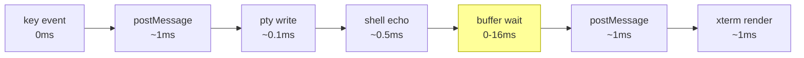
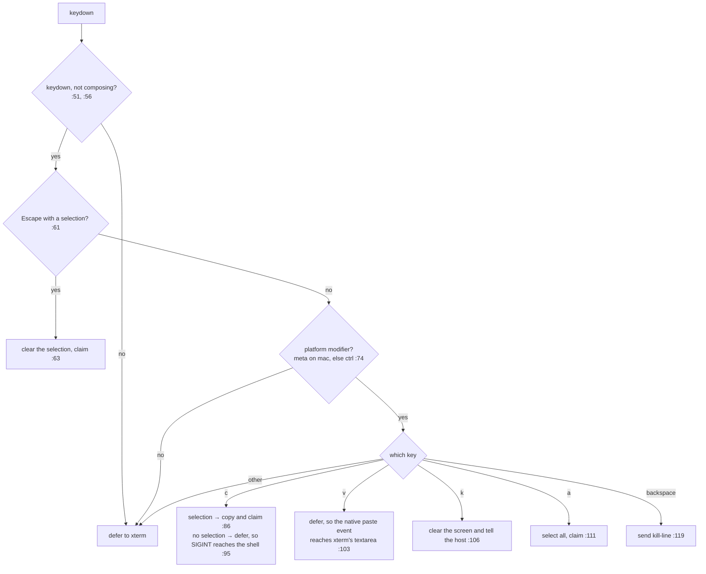
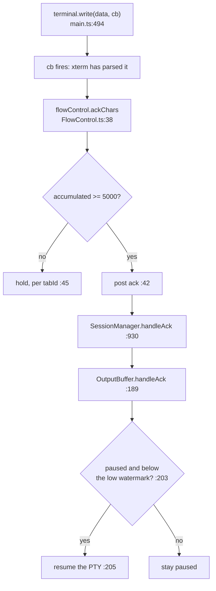

# Flow: User Input (Keystroke → Shell → Output)

> Part of [DESIGN.md](../DESIGN.md) — Section 3.2

## 1. Purpose & Scope

The round-trip of a single keystroke: key event → IPC → PTY → shell echo →
buffered output → screen, plus the flow-control acknowledgment on the return
path.

### Goals

- A keystroke echo must feel immediate; the buffering that exists for bursts must
  not tax interactive typing.
- Chords that a terminal user expects from Terminal.app or iTerm2 must work even
  though xterm.js has no binding for them.
- A shortcut must never fire mid-IME-composition, and a dead session must never
  be able to write into a recycled id.

### Constraints

- xterm.js owns key → escape-sequence translation for everything ordinary. The
  first-party code only intervenes where the default is absent or wrong.
- The host cannot see DOM focus. Which pane a key belongs to is decided entirely
  in the webview, before the message is posted.
- Interception has to happen in the capture phase for chords that must work while
  focus is on the file tree rather than the terminal.

### The three input paths

Which path wins is decided before xterm.js ever sees the event:

| # | Path | Entry point | Wins for |
|---|------|-------------|----------|
| 1 | Document-capture handler | `main.ts:1077` (capture phase, `:1146`) | Shift+Enter, Cmd/Ctrl+arrow, Cmd/Ctrl+Backspace — even with focus on the file tree |
| 2 | xterm custom key handler | `InputHandler.ts:46` | Cmd/Ctrl + C / V / K / A, Escape-with-selection |
| 3 | xterm `onData` | `TerminalFactory.ts:188` | Everything else — plain keys, escape sequences, pasted text |

> **Cross-references**: [output-buffering.md](output-buffering.md) | [keyboard-input.md](keyboard-input.md) | [flow-clipboard.md](flow-clipboard.md)

---

## 2. Sequence

```mermaid
sequenceDiagram
    actor User
    participant WV as WebView (xterm.js)
    participant VP as TerminalViewProvider
    participant SM as SessionManager
    participant PTY as PtySession
    participant Shell as shell
    participant OB as OutputBuffer

    User->>WV: keydown 'l'
    Note over WV: document capture handler — no match,<br>falls through (main.ts:1077)
    Note over WV: custom key handler — no modifier,<br>defers to xterm (InputHandler.ts:76)
    Note over WV: terminal.onData("l") fires

    WV->>VP: { type:"input", tabId, data:"l" } (TerminalFactory.ts:195)
    Note over VP: shape-validated: tabId and data must be strings (:893)
    VP->>SM: writeToSession(tabId, "l") (:894)
    SM->>PTY: write (SessionManager.ts:724)
    PTY->>Shell: write to the PTY fd (PtySession.ts:195)

    Note over Shell: shell echoes 'l' (+ completion, prompt repaint)
    Shell->>PTY: stdout
    PTY->>SM: onData("l") (SessionManager.ts:593)
    SM->>OB: append (:594)
    SM->>SM: appendToScrollback (:595) + snapshots.recordData (:596)

    alt flush by timer (normal)
        Note over OB: 4-16ms adaptive timer fires (OutputBuffer.ts:166)
    else flush by size (burst)
        Note over OB: 64KB or 100 chunks (OutputBuffer.ts:173)
    end
    OB->>WV: { type:"output", tabId, data } (OutputBuffer.ts:325)

    Note over WV: routeMessage → onOutput (main.ts:489)
    Note over WV: terminal.write(data, cb) (:494)
    Note over WV: cb → flowControl.ackChars (:499)
    WV->>VP: { type:"ack", charCount, tabId } once >= 5000 (FlowControl.ts:42)
    VP->>SM: handleAck (TerminalViewProvider.ts:969)
    Note over SM: unacked -= count; resume PTY below 5K (OutputBuffer.ts:203)

    WV->>User: 'l' on screen
```

---

## 3. Latency Budget



The buffer wait dominates, and everything else is noise beside it. That is why
the adaptive interval exists and why it settles at its 4 ms floor for
interactive work: a keystroke echo is a handful of chars, so the rolling average
never approaches the low threshold (`OutputBuffer.ts:313`). It only climbs to
16 ms under a sustained burst, where batching is the right trade. Every figure
except the buffer bound is an order-of-magnitude estimate, not a measurement.

---

## 4. Path 1 — Document-Capture Handler

Registered on the document in the capture phase (`main.ts:1077`, `:1146`) so it
runs before xterm's own listener and before any sibling in the DOM. It resolves
its target as the **active pane**, falling back to the tab itself (`:1084`) —
the one place in the input flow where split-pane focus is honoured.

| Chord | Sends | Line | Why it is here |
|-------|-------|------|----------------|
| Shift+Enter | `\x1b\r` | `:1091` | REPLs (Claude Code) insert a newline instead of submitting |
| Cmd+← / Cmd+→ (mac) | Ctrl+A / Ctrl+E | `:1104`, `:1110` | xterm.js has no default binding; matches Terminal.app and iTerm2 |
| Cmd+Backspace (mac) | Ctrl+U | `:1116` | kill-line |
| Ctrl+Backspace (non-mac) | Ctrl+U | `:1124` | kill-line |
| Option+← / Option+→ (mac) | `\x1bb` / `\x1bf` | `:1133`, `:1139` | readline word motion; `macOptionIsMeta: false` suppresses the default |

Every branch both prevents the default and stops propagation, and the whole
handler returns early while composing (`:1080`). A second, non-capture listener
handles tab-switch chords (`:1148`).

---

## 5. Path 2 — xterm Custom Key Handler

Attached per terminal (`TerminalFactory.ts:185`), this handler answers one
question for xterm: *should you process this event yourself?* Declining is how a
chord is claimed.



Cmd+C is the interesting case: it is copy *only* when there is something to copy,
and otherwise falls through so Ctrl+C still interrupts. Its dependencies are
injected (`:26`) so the handler is unit-testable without a browser — the
clipboard is simply absent when the platform has none (`TerminalFactory.ts:160`).

Two reachability notes: the backspace case (`:119`) is shadowed in practice, because
the capture handler claims that chord first (`main.ts:1116`, `:1124`); and the
tab id this handler reports is the **root tab**, not the focused pane
(`TerminalFactory.ts:180`) — see §8.

---

## 6. Path 3 — `terminal.onData`

Everything xterm decides is input arrives here already encoded
(`TerminalFactory.ts:188`): printable characters, control characters, and the
escape sequences for arrows, Home/End, Tab and the rest. No first-party code maps
key → sequence for any of them.

The one gate is `instance.exited` (`:191`): input from a terminal whose session
has already exited is dropped, so a dead pane cannot post into a recycled id.

### Paste

Cmd/Ctrl+V defers to xterm (`InputHandler.ts:103`) so the browser's native paste
event still fires on xterm's hidden textarea. xterm emits the whole pasted string
through `onData` in one call, and it crosses the bridge as a single input
message. Bracketed-paste wrapping is applied by **xterm.js internally** when the
shell has enabled the mode — there is no first-party code that wraps paste
payloads.

That is also why Cmd+Backspace sends its control character as raw input rather
than through xterm's paste API: pasting would get bracketed-wrapped and print the
control character literally (`InputHandler.ts:117`).

Image paste is a separate bridge — see [flow-clipboard.md](flow-clipboard.md);
its entry point is the paste-shortcut listener at `main.ts:1183`.

### IME composition

Composition start/end toggle a module-level flag (`main.ts:1056`, `:1059`). Both
the capture handler (`:1080`) and the custom key handler (`InputHandler.ts:56`)
bail while it is set, so no shortcut can fire mid-composition. Composed text
arrives normally through `onData`.

---

## 7. Return Path — Acknowledgment



The ack fires from xterm's write callback — "parsed", not "delivered" — because
that is the only signal that reflects the consumer actually keeping up. If no
xterm instance exists for the tab, the webview acks anyway (`main.ts:502`), or
the counter would climb past the high watermark and strand the PTY paused
forever. See [output-buffering.md](output-buffering.md) for the watermarks.

---

## 8. Boundaries & Decisions

- **Three paths, in a fixed priority order, decided in the webview.** The host
  receives one message type and does not know or care which path produced it.
- **Intervene only where xterm's default is absent or wrong.** Every entry in the
  §4 table exists because the terminal-native behaviour it restores has no xterm
  binding; everything else is left alone deliberately.
- **The host trusts nothing about routing.** Messages are shape-validated
  (`TerminalViewProvider.ts:893`), an unknown session id is a silent no-op
  (`SessionManager.ts:724`), and a write to a dead process is a no-op too
  (`PtySession.ts:195`). A stale webview posting after teardown is normal, not
  exceptional, so it degrades rather than throws.
- **Backpressure is measured at the far end.** Acking on receipt would measure
  the bridge; acking on parse measures the renderer.

### Known inconsistency — Cmd+K in a split pane

Cmd+K clears the terminal the handler is attached to (`InputHandler.ts:106`) but
reports the **root tab** id (`:107`, via `TerminalFactory.ts:180`). With focus in
a split pane, the visible clear and the host-side clear therefore target
different sessions: the host wipes the root tab's scrollback cache, tracked
commands, and snapshot instead of the pane's
(`TerminalViewProvider.ts:1140` → `SessionManager.ts:918`).

The context-menu path does not have this problem — it carries an explicit session
id and falls back to the active *pane* (`main.ts:619`). Documented, not changed.
