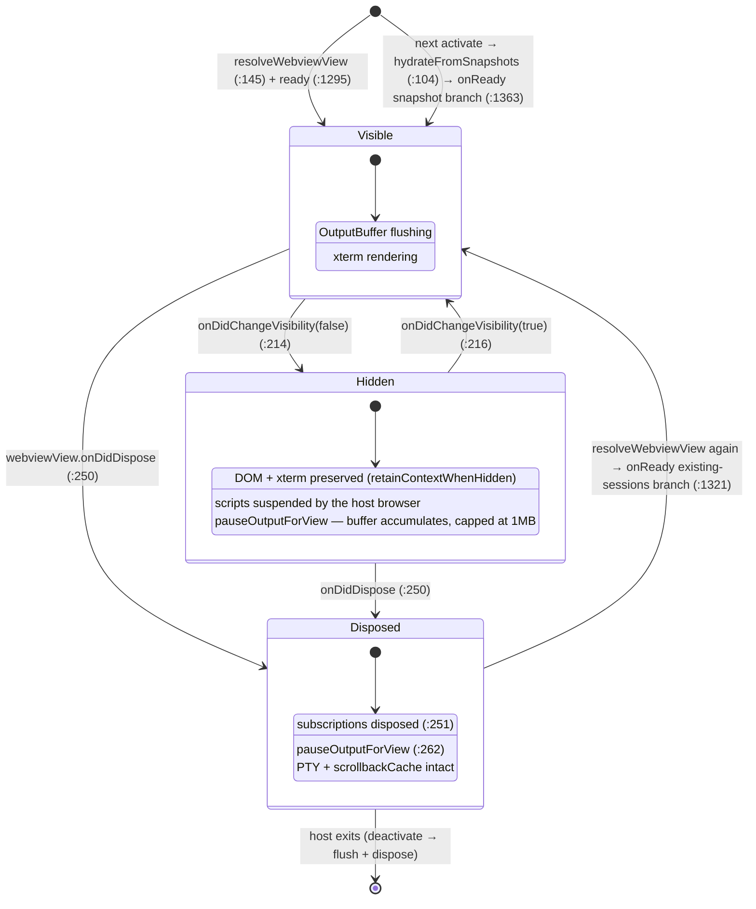
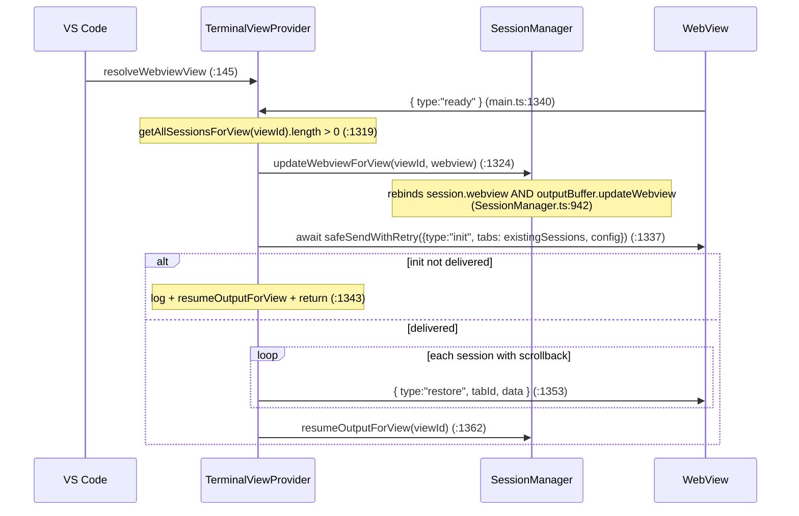
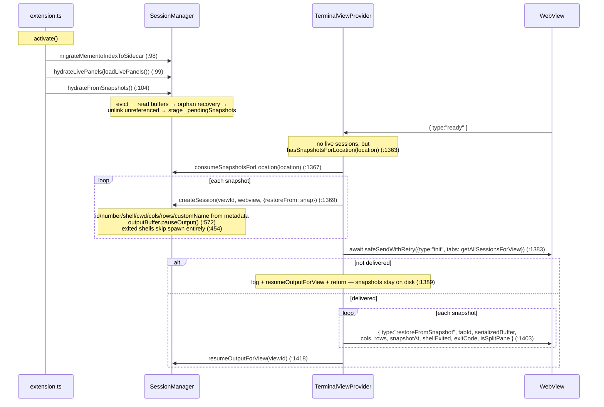
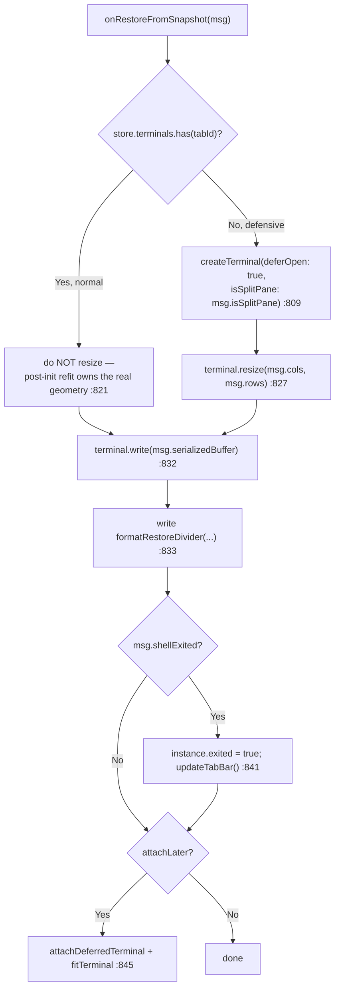
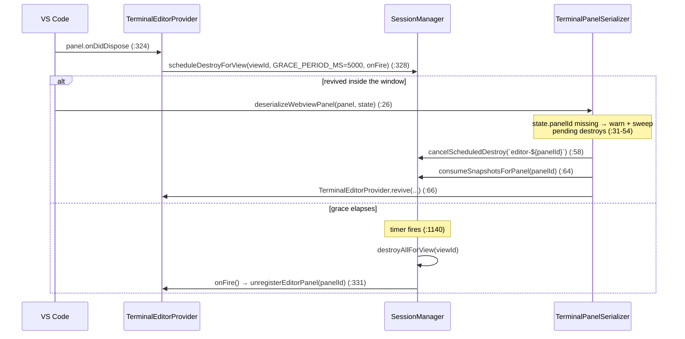

# Flow: View Lifecycle (Hide, Re-create, Restart)

> Part of [DESIGN.md](../DESIGN.md) — Section 3.4

## 1. Purpose & Scope

A terminal session is anchored to the **extension host**, not to the webview
(`TerminalViewProvider.ts:248`). Everything in this document is a consequence of
that: the PTY keeps running while the view is hidden, disposed, or replaced, and
each level of loss has its own recovery path.

| Level of loss | What survives | Recovery mechanism |
|---------------|---------------|--------------------|
| **Hidden** — sidebar collapsed / tab switched | DOM, xterm instance, PTY | `retainContextWhenHidden` + output pause/resume |
| **WebView disposed** — view closed and re-resolved, editor panel reload | PTY, `TerminalSession`, scrollback cache | `updateWebviewForView` + `restore` replay |
| **Window/host restart** | Nothing in memory | Snapshot pipeline: buffer files + sidecar index → snapshot restore |

### Goals

- Losing a view must never lose a process. Recovery is always the cheapest
  mechanism that covers the loss actually suffered.
- A restored screen must look like the screen the user left, not like a replay
  interleaved with whatever the shell printed meanwhile.
- Each host — sidebar, panel, editor tab — has an independent lifecycle, and one
  closing must not disturb another.

### Constraints

- VS Code destroys and re-creates an editor tab's webview on reload, so disposal
  cannot be read as intent to close.
- A hidden webview has its scripts suspended: inbound messages queue rather than
  execute, so the host has to stop sending, not just keep sending optimistically.
- A webview that is hidden or unattached measures its container as 0×0, so every
  revive path has to refit rather than trust persisted geometry.

> **Cross-references**: [webview-provider.md](webview-provider.md) | [session-manager.md](session-manager.md) | [resize-handling.md](resize-handling.md) | [output-buffering.md](output-buffering.md)

---

## 2. States

The **editor-tab** variant adds a fourth state — a disposed panel whose sessions
are on a 5-second execution reprieve. See §5.

---

## 3. Hidden ↔ Visible

`retainContextWhenHidden: true` is set at registration for all three hosts
(`extension.ts:212`, `:230`, `TerminalEditorProvider.ts:195`). VS Code keeps the
DOM alive but suspends the webview's scripts, so timers and `requestAnimationFrame`
do not fire and inbound `postMessage` is queued by the browser.

Because messages queue rather than execute, the host **also** stops sending. The
visibility handler (`TerminalViewProvider.ts:214`) resumes output and posts a
`viewShow` when the view returns (`:218`, `:220`, gated on the ready handshake),
and pauses output for the whole view when it goes away (`:224`).

| Behaviour | Hidden | On re-show |
|-----------|--------|-----------|
| `setTimeout` / `rAF` in the webview | do not fire | resume |
| DOM + xterm buffer | preserved | immediately available |
| PTY | keeps running | unaffected |
| `OutputBuffer` flush timer | cleared (`OutputBuffer.ts:221`) | re-armed on next append |
| Buffered output | accumulates, hard-capped at 1 MB (`OutputBuffer.ts:38`) | flushed immediately by `resumeOutput` (`:238`) |

`pauseOutputForView` iterates the view's sessions and pauses each buffer
(`SessionManager.ts:1058`); `resumeOutputForView` mirrors it (`:1072`). Flow
control (PTY pause/resume) is **independent** and keeps operating while output is
paused (`OutputBuffer.ts:212`).

### Re-show resize

`viewShow` routes to `ResizeCoordinator.onViewShow` (`main.ts:562`), which flushes
the `pendingResize` flag set when the `ResizeObserver` saw a 0×0 box while hidden
(`ResizeCoordinator.ts:84`) and refits every leaf of the active tab's split tree
inside a `requestAnimationFrame` (`:143`). The refit changes xterm's cols/rows,
which fires `onResize` and posts `{type:"resize"}` back to the host
(`TerminalFactory.ts:429`).

---

## 4. WebView Disposed → Re-created (same host process)

`onDidDispose` deliberately does **not** destroy sessions
(`TerminalViewProvider.ts:250`):

1. dispose the view's subscriptions (`:251`)
2. cancel in-flight hover-preview tokens (`:255`) and the vault watch client (`:257`)
3. `pauseOutputForView(viewId)` — sessions live on but must not flush into a dead
   webview (`:262`)
4. clear `_view`, `_ready`, and the focus-recency entry (`:263`–`:267`)

When VS Code resolves the view again, `onReady` takes the **existing-sessions**
branch:

Three things make this correct:

- **`getAllSessionsForView`, not `getTabsForView`** (`:1319`) — split-pane
  children must be in `init` or the webview cannot recreate the xterms its
  persisted `tabLayouts` references (`SessionManager.ts:798`).
- **`init` is awaited** (`:1337`). `safeSendWithRetry` may schedule a 50 ms retry;
  a synchronous post-loop would enqueue `restore` first, the webview would look up
  a `tabId` not yet in `store.terminals`, and `onRestore` would silently drop it
  (`main.ts:553`). Symptom: populated tab strip, blank terminal.
- **Output stays paused until the replay is posted** (`:1362`), so live PTY output
  cannot interleave ahead of the cached scrollback.

The replayed payload is the 512 KB scrollback cache
(`getScrollbackData` → `chunks.join("")`, `SessionManager.ts:958`), written in one
call (`main.ts:556`). See [session-manager.md](session-manager.md) §8.

---

## 5. Cross-Restart Restore

Nothing in memory survives. The recovery source is the snapshot pipeline
described in [session-manager.md](session-manager.md) §11.

### Webview side — `onRestoreFromSnapshot` (`main.ts:790`)

- The `deferOpen` path exists so the buffer is written **before** the terminal
  attaches to the DOM; it is defensive, taken only when `init` did not include the
  tab.
- Passing `isSplitPane` through matters: without it a deferred revive of a split
  child would overwrite the parent's `tabLayouts` entry with a bare leaf and
  persist the collapsed tree (`main.ts:802`).
- Resizing on the already-open path is deliberately skipped — writing at the
  persisted (stale) cols/rows and refitting afterwards mis-wraps any concurrent
  live output (`main.ts:822`).
- The divider (`formatRestoreDivider`, `src/webview/terminal/restoreDivider.ts:11`)
  opens with `\r\x1b[2K` so it *overwrites* the stale prompt line the serialized
  buffer just drew, rather than stacking beneath it (`:17`).

An exited shell restores read-only: no PTY is spawned (`SessionManager.ts:454`),
the session starts in `exited-preserved` (`:502`), and it is never made active
(`:509`).

---

## 6. Editor Panels — Grace-Period Destroy

An editor tab's webview is destroyed and re-created on window reload, so
`onDidDispose` cannot mean "kill the PTY". `TerminalEditorProvider` schedules the
destroy instead and lets the serializer cancel it.

The live-panels registry entry is removed **only** on the real destroy
(`TerminalEditorProvider.ts:329`) — that is what lets `revive` match the panel to
its snapshots, and what lets hydrate's orphan recovery map a stray buffer file
back to an editor panel instead of defaulting it to the sidebar
(`SnapshotPersistence.ts:886`).

`TerminalEditorProvider.onReady` (`:759`) mirrors the sidebar's three branches:
existing sessions (Phase A, `:784`), panel snapshots (Phase B, `:808`), cold open
(`:855`), each calling `attachSessionToPanel` (`:818`, `:862`).

---

## 7. Webview State Persistence

`vscode.setState` / `getState` carries the layout across a webview re-creation.
`WebviewStateStore.restore()` is called at the top of `handleInit`
(`main.ts:858`) and its layouts are **filtered against the tab ids in `init`**
(`:860`): a layout referencing a session the host no longer knows is discarded,
and `tabActivePaneIds` entries for dead tabs are pruned (`:864`).

This is why `createSession` preserves the persisted session id on restore
(`SessionManager.ts:430`) — the ids in `tabLayouts` must still resolve after a
restart, or every restored split collapses.

After init, every branch layout is re-rendered (`splitRenderer.renderTabSplitTree`,
`main.ts:886`), the active root's container revealed (`:897`), and each root
refit in a `requestAnimationFrame` (`:908`) — split children were created with
`isActive: false`, so `terminal.open()` measured a 0×0 box and the canvas would
otherwise stay blank (`:900`).

---

## 8. Shutdown

`deactivate` (`extension.ts:840`) runs three ordered steps — sync buffer + sidecar
writes, awaited index flush, then PTY teardown. The ordering and its rationale are
documented in [session-manager.md](session-manager.md) § 9, "Shutdown".

---

## 9. Edge Cases

| Case | Behaviour |
|------|-----------|
| **Window reload** | Webviews and host both die. Snapshots written by `deactivate` drive §4. |
| **Extension update** | Same as reload. |
| **Multiple views** | Sidebar, panel, and each editor tab have independent `viewId`s and independent lifecycles; collapsing one does not affect the others. |
| **Rapid collapse/expand** | Each toggle is a pause/resume pair; the buffer coalesces and `resumeOutput` flushes once (`OutputBuffer.ts:238`). |
| **Restore disabled mid-session** | `setRestoreEnabled(false)` bumps the persist generation, disposes every mirror, purges storage, and clears the editor-panel registry (`SessionManager.ts:235`). Live terminals are untouched. |
| **No workspace folder** | `context.storageUri` is undefined → persistence disabled for the window rather than leaking snapshots into global storage (`extension.ts:51`–`:62`). |
| **`init` undeliverable** | Both warm branches log, resume output, and return without posting replay payloads (`:1343`, `:1389`). Snapshots stay on disk for the next activate. |

---

## 10. Boundaries & Decisions

- **The session belongs to the host.** A webview is a view onto it and may be
  destroyed at any time. `onDidDispose` therefore tears down subscriptions and
  pauses output — it never kills a process (`TerminalViewProvider.ts:250`,
  `:262`).
- **Disposal is ambiguous; the grace period resolves it.** For editor panels,
  destruction is scheduled rather than performed, and a revive inside five
  seconds cancels it (`TerminalEditorProvider.ts:328`,
  `TerminalPanelSerializer.ts:58`). Nothing else in the system has to distinguish
  "closed" from "reloading".
- **Replay is ordered, not merged.** Output stays paused across every warm branch
  until the replay payload is posted (`:1362`, `:1418`), so live output can never
  interleave ahead of the cached or serialized screen.
- **The structural message is awaited; the payload is not.** `init` is awaited
  before any `restore` (`:1337`), because a replay for a tab the webview does not
  yet know is silently dropped (`main.ts:553`) — populated tab strip, blank
  terminal.
- **Undeliverable init fails closed.** Both warm branches resume output and
  return without posting replay payloads (`:1343`, `:1389`); snapshots stay on
  disk for the next activation rather than being consumed into nothing.
- **Persisted layout is advisory.** Webview state is filtered against the tab ids
  the host actually reports (`main.ts:860`), so a stale layout can never resurrect
  a session that no longer exists.
