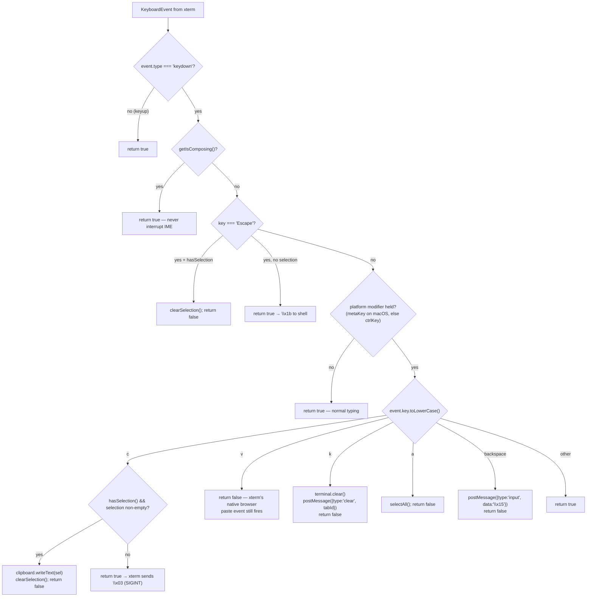
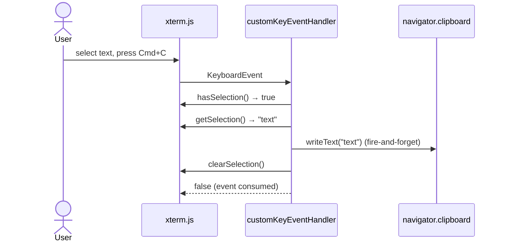
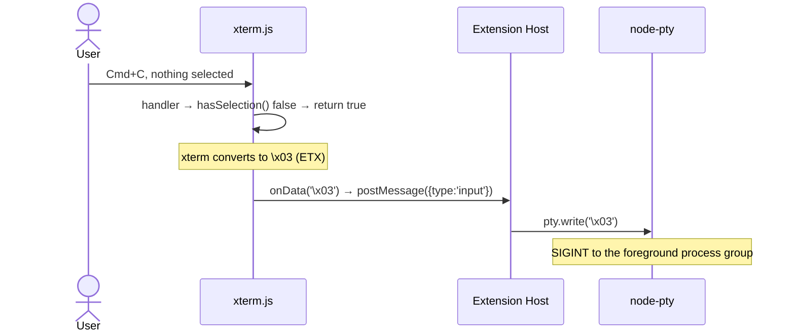
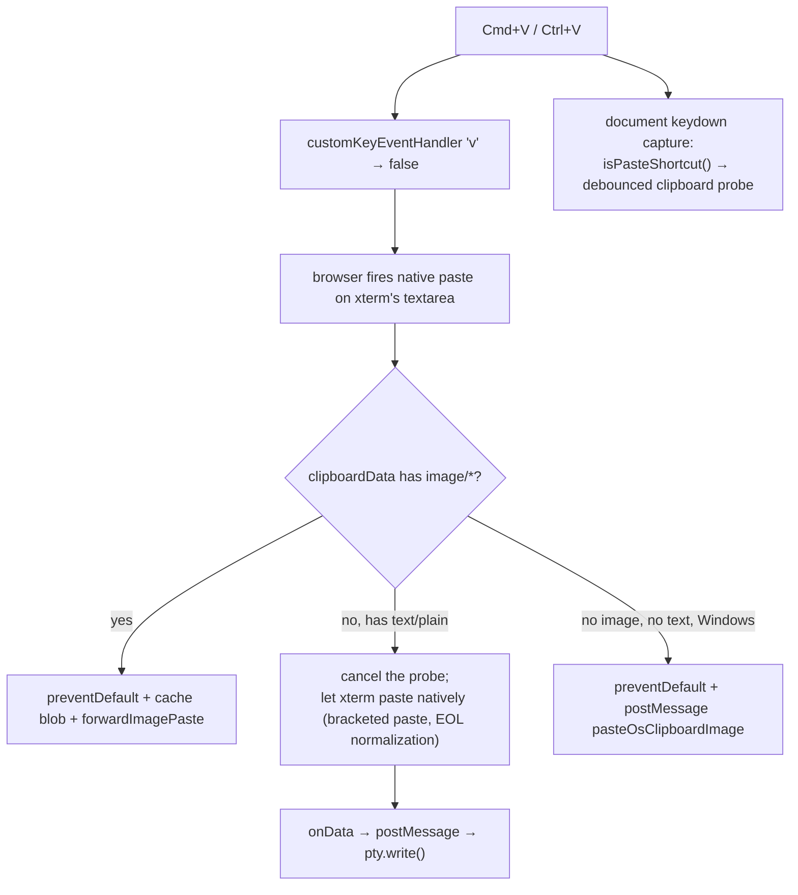
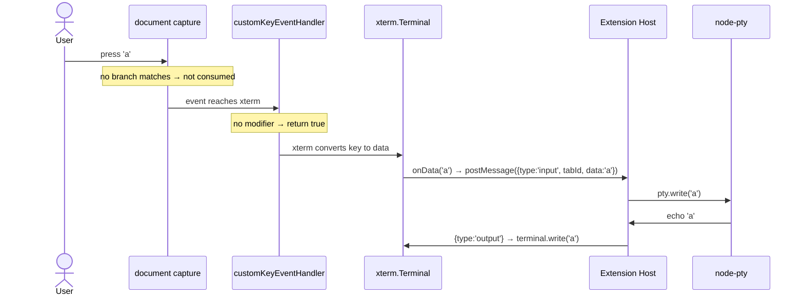
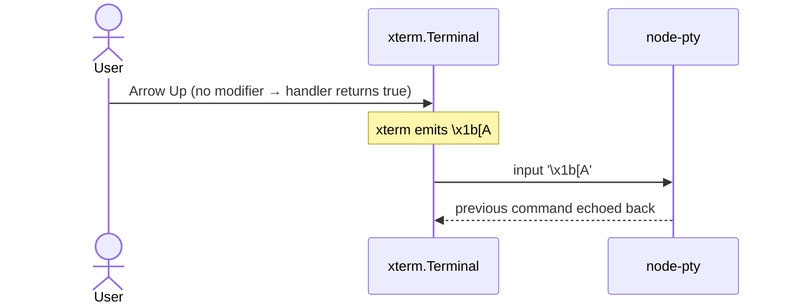

# Keyboard & Input Handling — Detailed Design

## 1. Overview

Keyboard input reaches the shell through **three** layers, in this order:

| # | Layer | Registration | Purpose |
|---|---|---|---|
| 1 | Document-level **capture** listeners | `document.addEventListener("keydown", fn, true)` | Shortcuts that must win before xterm and before any sibling (file tree, vault) — Shift+Enter, macOS readline motions, the image-paste probe |
| 2 | xterm's `attachCustomKeyEventHandler` | per terminal, in `TerminalFactory` | Clipboard + terminal-local shortcuts; returns `false` to consume, `true` to let xterm convert the key to terminal data |
| 3 | Document-level **bubble** listener | `document.addEventListener("keydown", fn)` | Ctrl+Tab / Ctrl+Shift+Tab tab cycling |

Anything none of them claims falls through to xterm → `onData` → `postMessage({type:'input'})` → `pty.write()`.

Layer 1 exists because xterm's handler only sees events routed to its own textarea. When DOM focus sits on the file tree or the vault, the terminal shortcuts must still work — and because a capture-phase listener runs before xterm's, it also lets us override keys xterm would otherwise bind (`main.ts:1062-1076`).

### Reference Sources
- VS Code: `terminalInstance.ts` (custom key handler, bracketed paste)
- xterm.js: `attachCustomKeyEventHandler`, `terminal.modes.bracketedPasteMode`

---

## 2. Layer 1 — Document Capture Handler

`main.ts:1077-1147`, registered with `capture: true`.

Every branch resolves its target the same way — the active tab's focused pane if it has one, else the tab itself — so a split pane receives the input rather than the root tab. A tab with no resolvable target aborts the handler (`main.ts:1083-1087`).

| Trigger | Modifier guard | Sent | Cite |
|---|---|---|---|
| `Enter` | `shiftKey && !meta && !ctrl && !alt` | `\x1b\r` (ESC+CR) — REPLs like Claude Code insert a newline instead of submitting | `main.ts:1090-1095` |
| `ArrowLeft` (macOS) | `metaKey && !ctrl && !alt && !shift` | `\x01` (Ctrl+A) — readline beginning-of-line | `main.ts:1103-1108` |
| `ArrowRight` (macOS) | same | `\x05` (Ctrl+E) — readline end-of-line | `main.ts:1109-1114` |
| `Backspace` (macOS) | same | `\x15` (Ctrl+U) — kill line | `main.ts:1115-1120` |
| `Backspace` (non-macOS) | `ctrlKey && !meta && !alt && !shift` | `\x15` | `main.ts:1123-1128` |
| `ArrowLeft` (macOS) | `altKey && !meta && !ctrl && !shift` | `\x1bb` (ESC+b) — backward-word | `main.ts:1132-1137` |
| `ArrowRight` (macOS) | same | `\x1bf` (ESC+f) — forward-word | `main.ts:1138-1143` |

Every claimed branch calls `preventDefault()` + `stopPropagation()` and returns. The whole handler no-ops while `isComposing` (`main.ts:1080-1082`).

> These are sent as **raw PTY input** via `postMessage`, not `terminal.paste()` — `paste()` would wrap them in bracketed-paste markers and the shell would print `^U` literally rather than acting on it (`InputHandler.ts:115-118` documents the same reasoning for the xterm-level branch).

`macOptionIsMeta: false` (`TerminalFactory.ts:239`) means xterm does not generate ESC-prefixed sequences for Option — which is exactly why the Option+Arrow branches exist here.

---

## 3. Layer 2 — xterm `customKeyEventHandler`

### Decision Flow



Canonical implementation: `createKeyEventHandler()` — `src/webview/InputHandler.ts:46-126`. It is a factory returning a closure; every dependency is injected so it unit-tests without a browser.

> **Shift+Enter is not in this handler.** It is intercepted one layer up, at document capture, and `InputHandler.ts:69-71` says so explicitly.

### Notable details

- **Empty selection falls through.** The `c` branch requires both `hasSelection()` and a non-empty `getSelection()`; otherwise it returns `true` and xterm emits `\x03` (`InputHandler.ts:81-95`).
- **Clipboard write is fire-and-forget.** `writeText(...).catch(err => console.warn(...))` — a rejected write logs and does not block the selection clear (`InputHandler.ts:86-88`).
- **`clipboard` may be `undefined`.** `getClipboardProvider()` returns `undefined` when `navigator.clipboard` is absent; the copy branch then just clears the selection (`TerminalFactory.ts:160-168`).
- **`v` returns `false` deliberately.** That skips xterm's *keydown* processing but the browser's native Cmd+V still fires a `paste` event on xterm's textarea, which xterm captures and routes through `onData` (`InputHandler.ts:97-103`).

---

## 4. Layer 3 — Tab Cycling

`main.ts:1148-1152` (bubble phase) delegates to `handleTabKeyboardShortcut()` — `TabBarUtils.ts:261-290`.

| Key | Behavior | Cite |
|---|---|---|
| `Ctrl+Tab` | next tab, wrapping | `TabBarUtils.ts:285-286` |
| `Ctrl+Shift+Tab` | previous tab, wrapping | `TabBarUtils.ts:281-283` |

It returns `true` (so the caller calls `preventDefault()`) even when there is only one tab or the active tab is unknown — the shortcut is claimed unconditionally once `ctrlKey && key === "Tab"` matches (`TabBarUtils.ts:265-277`).

The cycle order is `Array.from(deps.terminals.keys())` over the **tab-bar data map**, which contains only root tabs (`TabBarUtils.ts:33-66`) — split panes are never cycled to.

---

## 5. Cmd+C Dual Behavior

### With selection → copy



### Without selection → SIGINT



On macOS the platform modifier is `metaKey`, so plain **Ctrl+C always** reaches xterm and always sends `\x03`, regardless of selection state (`InputHandler.ts:74`).

---

## 6. Paste Handling

Text paste is xterm's job; image paste is ours. The split is decided inside the `paste` listener (`main.ts:1232-1285`) — full details in `flow-clipboard.md`.



Keeping text on xterm's native path matches VS Code's built-in terminal and avoids re-implementing bracketed paste and line-ending normalization.

---

## 7. IME Composition Handling

### Problem

IMEs (CJK and other complex scripts) compose one character from several keystrokes. Intercepting shortcuts mid-composition breaks the input.

### State Tracking

`isComposing` is a single module-level flag in `main.ts:95`, toggled by document-level `compositionstart` / `compositionend` listeners (`main.ts:1056-1061`).

Both interception layers consult it:

| Consumer | Cite |
|---|---|
| Document capture handler — bails out entirely | `main.ts:1080-1082` |
| xterm key handler — via injected `getIsComposing()` | `InputHandler.ts:55-58`, wired at `TerminalFactory.ts:181` |

```mermaid
sequenceDiagram
    actor User
    participant DOM as DOM Events
    participant M as main.ts
    participant XT as xterm.js

    User->>DOM: start typing CJK
    DOM->>M: compositionstart → isComposing = true
    Note over M: capture handler returns early;<br>xterm handler returns true for every key
    User->>DOM: select final character
    DOM->>M: compositionend → isComposing = false
    DOM->>XT: input event with composed text → onData
```

| Without IME tracking | With IME tracking |
|---|---|
| `n` in `ni` (你) hits the shortcut switch | `n` passes through untouched |
| IME can be interrupted | IME completes normally |
| Garbled or missing input | 你 appears correctly |

Dead-key sequences (Option+e then a → á) go through the same `compositionstart`/`compositionend` pair and are covered by the same guard.

---

## 7b. Tab-Rename Overlay — a temporary fourth consumer

While the tab-rename input is open (double-click a tab), it becomes an **absolute key sink**: its `keydown` listener calls `stopPropagation()` on *every* key, so nothing reaches the document capture handler, xterm, or the tab-cycling listener (`src/webview/tabRenameOverlay.ts:94-108`).

| Key | Behaviour | Cite |
|---|---|---|
| `Enter` | `stopPropagation()` + `preventDefault()`, then `commit()` unless composing | `:95-100` |
| `Escape` | `stopPropagation()` + `preventDefault()`, then `cancel()` | `:101-104` |
| anything else | `stopPropagation()` only — the character still lands in the input | `:105-107` |
| `blur` | `commit()` unless composing | `:110-115` |

The overlay carries its **own** `composing` flag, fed by `compositionstart` / `compositionend` on the input element (`:116-121`) — independent of `main.ts`'s module-level `isComposing`. Enter and blur both check it, so an IME's confirmation Enter does not commit a half-composed name.

`commit()`/`cancel()` are idempotency-guarded via `state.finalized` (`:48`, set at `:178,202,212`), which is why `Enter` (commit) followed by the resulting `blur` (commit) fires only once. The committed value is the **raw** input string; normalization happens host-side (`:25`).

---

## 8. Key Event Flow (End-to-End)

### Normal keystroke



`onData` is suppressed once the session has exited — `TerminalFactory.ts:188-196` checks `instance.exited` before posting.

### Special key (Arrow Up → history)



---

## 9. Keybinding Conflicts with VS Code

### The problem

VS Code has hundreds of built-in keybindings. When the terminal webview has focus, they compete with terminal input.

### Why we cannot copy VS Code's approach

VS Code's built-in terminal uses `softDispatch()` to ask whether a chord has a registered command. That is an internal API; a webview runs in an isolated context with no access to the keybinding service, and no extension API exposes "is this keybinding registered?".

### Our approach: an explicit interception list

Everything not in the tables below passes through. xterm does not consume unrecognized Cmd combos, so VS Code's webview bridge forwards them to the host window's keybinding system.

### Key Routing Summary

| Key | Layer | Action | Cite |
|---|---|---|---|
| Regular keys, Enter, arrows, Tab | — | xterm → shell | — |
| `Escape` **with** selection | 2 | clear selection | `InputHandler.ts:61-67` |
| `Escape` no selection | — | `\x1b` to shell | `InputHandler.ts:66` |
| `Ctrl+C` (macOS) / `Ctrl+C` no selection | — | `\x03` SIGINT | `InputHandler.ts:74,95` |
| `Cmd/Ctrl+C` **with** selection | 2 | copy + clear selection | `InputHandler.ts:81-95` |
| `Cmd/Ctrl+V` | 2 | return `false`; xterm pastes natively | `InputHandler.ts:97-103` |
| `Cmd/Ctrl+K` | 2 | `terminal.clear()` + `{type:'clear', tabId}` | `InputHandler.ts:105-108` |
| `Cmd/Ctrl+A` | 2 | select all | `InputHandler.ts:110-112` |
| `Shift+Enter` | 1 | `\x1b\r` | `main.ts:1090-1095` |
| `Cmd+←` (macOS) | 1 | `\x01` | `main.ts:1103-1108` |
| `Cmd+→` (macOS) | 1 | `\x05` | `main.ts:1109-1114` |
| `Cmd+Backspace` (macOS) | 1 | `\x15` | `main.ts:1115-1120` |
| `Ctrl+Backspace` (non-macOS) | 1 | `\x15` | `main.ts:1123-1128` |
| `Option+←` (macOS) | 1 | `\x1bb` | `main.ts:1132-1137` |
| `Option+→` (macOS) | 1 | `\x1bf` | `main.ts:1138-1143` |
| `Ctrl+Tab` / `Ctrl+Shift+Tab` | 3 | cycle root tabs | `TabBarUtils.ts:261-290` |
| `Cmd/Ctrl+P`, `Cmd/Ctrl+Shift+P`, `Cmd/Ctrl+B`, `Cmd/Ctrl+,` | — | VS Code handles | — |

> The `backspace` case inside `createKeyEventHandler` (`InputHandler.ts:114-120`) is **unreachable in practice**: the layer-1 capture handler claims Cmd+Backspace on macOS and Ctrl+Backspace elsewhere and calls `stopPropagation()`, so the event never reaches xterm. It is kept as a defensive fallback.

### Contributed keybindings (`package.json:571-584`)

| Command | Windows/Linux | macOS | `when` |
|---|---|---|---|
| `anywhereTerminal.splitVertical` | `ctrl+\` | `cmd+\` | `focusedView == anywhereTerminal.sidebar \|\| focusedView == anywhereTerminal.panel` |
| `anywhereTerminal.splitHorizontal` | `ctrl+shift+\` | `cmd+shift+\` | same |

Both `when` clauses name only the sidebar and panel views — an **editor-tab** terminal (`anywhereTerminal.editor`) does not get these keybindings and must use the command palette or the pane context menu.

---

## 10. Terminal Input Configuration

There are **no** `anywhereTerminal.macOption*` settings. Both macOS Option-key behaviors are hardcoded at terminal construction:

| xterm option | Value | Effect | Cite |
|---|---|---|---|
| `macOptionIsMeta` | `false` | Option+key types the macOS special character (Option+e → ´) rather than an ESC-prefixed Meta sequence. Word-motion is provided by the layer-1 Option+Arrow branches instead. | `TerminalFactory.ts:239` |
| `macOptionClickForcesSelection` | `true` | Option+click forces text selection instead of sending a mouse escape sequence | `TerminalFactory.ts:240` |
| `rightClickSelectsWord` | `false` | Right click opens the VS Code webview context menu (see `webview/context` in `package.json:434`) instead of selecting a word | `TerminalFactory.ts:243` |
| `fastScrollSensitivity` | `5` | Alt+wheel scroll multiplier | `TerminalFactory.ts:244` |
| `tabStopWidth` | `8` | — | `TerminalFactory.ts:245` |

`enableCmdK` was described in an earlier design and was never implemented — Cmd+K always clears, with no opt-out.

---

## 11. Edge Cases

### 1. Clipboard unavailable or denied
`getClipboardProvider()` returns `undefined` when `navigator.clipboard` is missing (`TerminalFactory.ts:160-163`), and a rejected `writeText` is caught and logged (`InputHandler.ts:86-88`). Either way, the selection is still cleared and the event is still consumed.

### 2. Large paste
Pasted text flows through xterm's native paste → `onData` → `postMessage` → `pty.write()`. It is subject to the normal per-session flow control (see `output-buffering.md`); no special handling is needed. Pasted **images** are capped — see `flow-clipboard.md`.

### 3. Focus is not on the terminal
Layer 1 is on `document` in capture phase, so Shift+Enter and the readline motions still reach the active pane while the file tree or vault has DOM focus (`main.ts:1097-1101`).

### 4. Split panes and `Cmd+K`
`createKeyEventHandler` receives `getActiveTabId: () => this.store.activeTabId` (`TerminalFactory.ts:180`) — the **root tab** id, not the active pane id. `terminal.clear()` correctly affects the focused pane's own terminal (the handler is per-instance), but the accompanying `{type:'clear', tabId}` names the root tab, so the host clears the root session's scrollback cache (`TerminalViewProvider.ts:1138-1142`). In a split, this is a mismatch. See §12.

---

## 12. Known Inconsistency

`getActiveTabId` is wired to `store.activeTabId`, while every other input path resolves `store.tabActivePaneIds.get(tabId) ?? tabId`. Consequences inside a split tab:

- **Cmd+K** clears the focused pane's xterm but tells the host to clear the *root* session's scrollback (`TerminalFactory.ts:180`, `InputHandler.ts:105-108`).
- The `backspace` branch would have the same mismatch, but is unreachable (§9).

Recorded here as an observation; not fixed by this document.

---

## 13. Injected Contracts

`createKeyEventHandler(deps)` (`InputHandler.ts:46`) takes every dependency by injection, which is what makes layer 2 unit-testable without a browser.

```typescript
interface ClipboardProvider {                       // InputHandler.ts:11
  readText(): Promise<string>;
  writeText(text: string): Promise<void>;
}

interface TerminalLike {                            // InputHandler.ts:17
  hasSelection(): boolean;
  getSelection(): string;
  clearSelection(): void;
  clear(): void;
  selectAll(): void;
}
```

`KeyHandlerDeps` (`InputHandler.ts:26`) bundles those two with `postMessage`, `getActiveTabId`, `getIsComposing`, and `isMac`. `clipboard` may be `undefined` — see §3.

`ClipboardProvider.readText()` is declared but never called — paste is handled by xterm's native path and by the `imagePasteBridge` probe.

---

## 14. File Locations

| Location | Role |
|---|---|
| `src/webview/InputHandler.ts` | `createKeyEventHandler()` factory — layer 2 |
| `src/webview/main.ts:1056-1152` | Composition tracking, capture handler (layer 1), tab cycling (layer 3) |
| `src/webview/main.ts:1183-1230` | Image-paste keydown probe — see `flow-clipboard.md` |
| `src/webview/TabBarUtils.ts:261-290` | `handleTabKeyboardShortcut()` |
| `src/webview/tabRenameOverlay.ts:94-121` | Rename-overlay key sink — §7b |
| `src/webview/imagePasteBridge.ts:47` | `isPasteShortcut()` |

### Dependencies
- Browser APIs — `navigator.clipboard` (via injected `ClipboardProvider`), `navigator.platform`
- IME state via injected `getIsComposing()`

### Dependents
- `TerminalFactory.attachInputHandler()` — builds and attaches the handler per terminal (`TerminalFactory.ts:175-197`)
