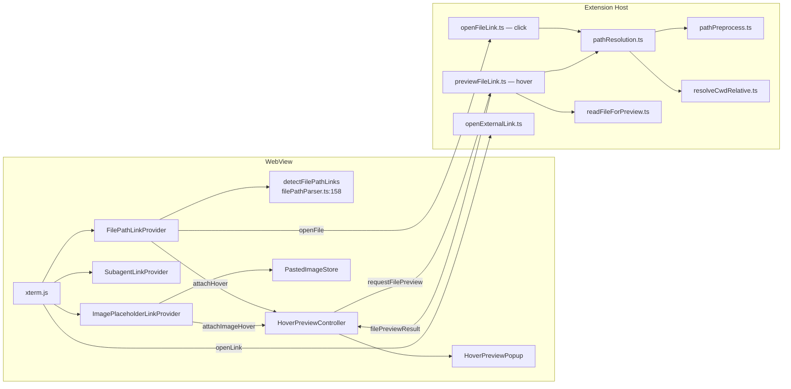
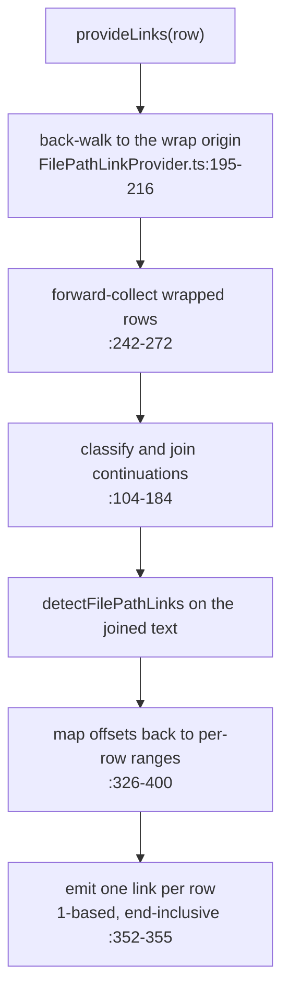
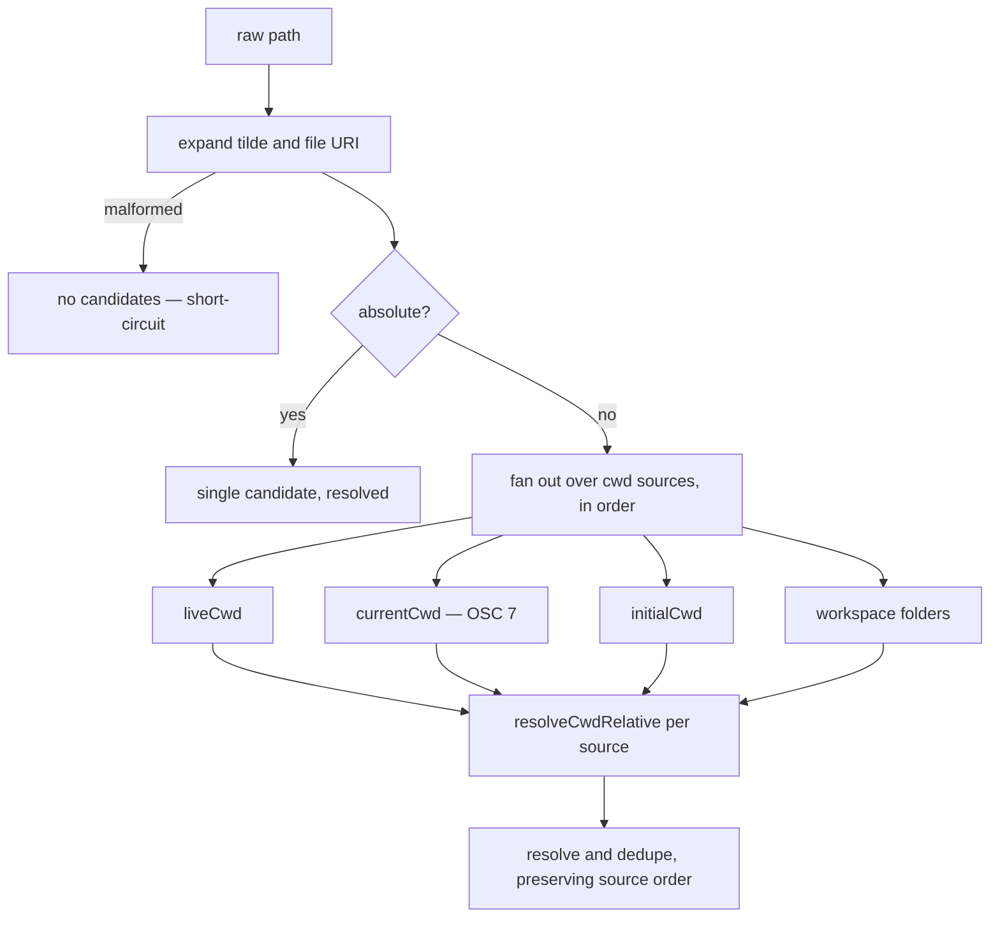
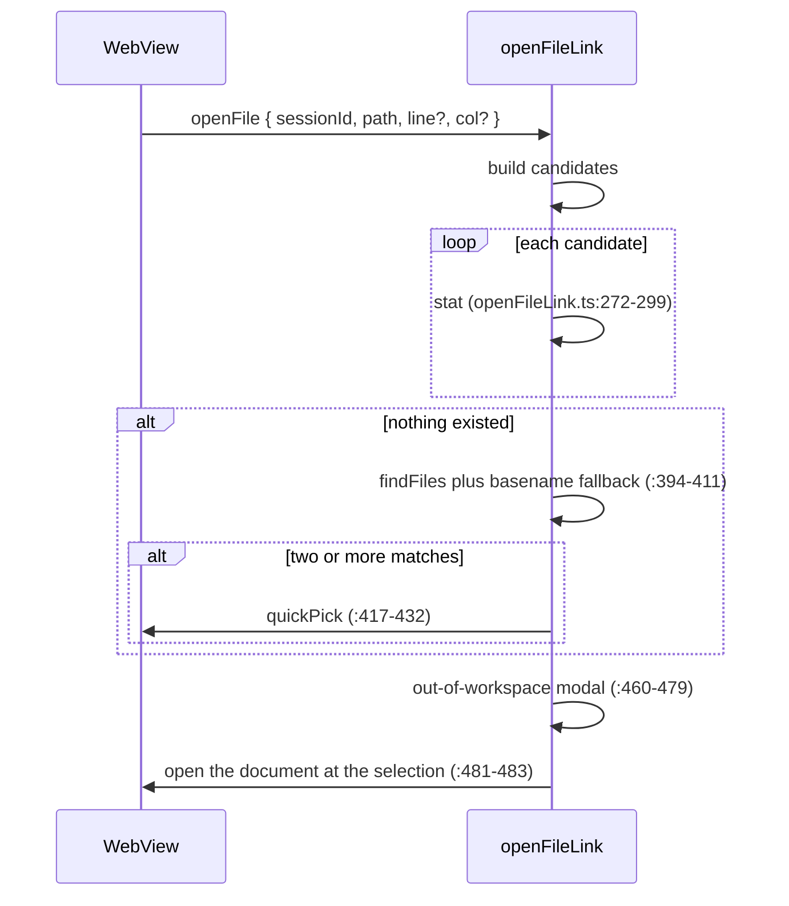
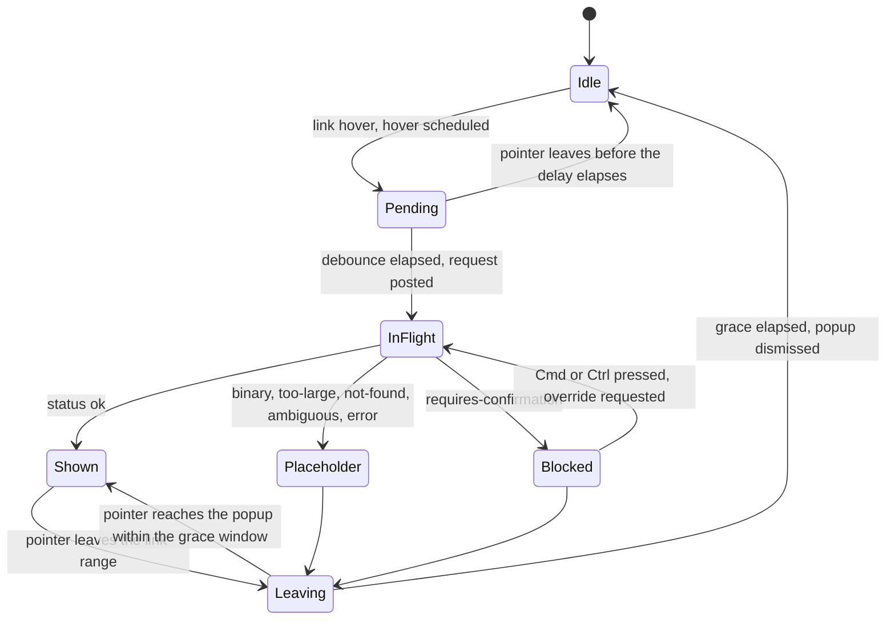

# Link Detection — Detailed Design

## 1. Overview

Terminal output is undifferentiated text. Link detection turns three classes of substring
into clickable or hoverable regions inside xterm.js, and routes activation to the
extension host — the only side with a filesystem and `vscode.env`.

| Class | Provider | Activation |
|-------|----------|-----------|
| File paths, with optional line/column suffixes | `FilePathLinkProvider` | open in editor |
| Claude CLI subagent (`Task`) header lines | `SubagentLinkProvider` | floating transcript popup |
| `[Image #N]` paste placeholders | `ImagePlaceholderLinkProvider` | hover only; click is a no-op |

Web URLs are not ours: xterm's built-in `WebLinksAddon` claims them, and its click
handler posts `openLink` (`TerminalFactory.ts:254-256`) because VS Code webviews block
`window.open`.

### Goals
- Detect path-shaped text **without a filesystem** — the webview has none, so detection
  produces candidates and the host adjudicates
- Survive soft wrapping, which splits long paths across rows
- Resolve relative paths the way a human reading the terminal would, i.e. against the
  shell's actual location
- Never let terminal output talk the host into disclosing a file the user did not ask for

### Constraints
- **Terminal output is attacker-controlled.** Anything a process prints can become a
  link, so detection is a parsing problem with a trust boundary behind it.
- **OSC 7 is forgeable.** The shell reports its cwd over an escape sequence any process
  can emit. It is usable as a *hint* and never as a *permission* (§7.3).
- **Hover is passive.** A preview happens without the user deciding to open anything, so
  it must disclose strictly less than a click (§6.4).
- **The webview cannot dynamically import.** CSP nonce checks forbid it, so the syntax
  highlighter is a statically bundled subset (§7.5).

### Non-goals
- Message shapes → [message-protocol.md](message-protocol.md) §4.4
- The file tree's own hover plumbing → [file-tree.md](file-tree.md)

All three providers are registered on the same terminal — paths
(`TerminalFactory.ts:372`), subagent headers (`:385`), image placeholders (`:394`). xterm
allows multiple providers and treats them additively.

---

## 2. Architecture

The two host entry points, `openFileLink` and `previewFileLink`, share the resolution
chain (`pathResolution` → `pathPreprocess` / `resolveCwdRelative`) and then diverge
deliberately — §6.4.

---

## 3. What Is Detected

`filePathParser.ts` is pure and dependency-free. It never touches a filesystem; it emits
*candidates*, and the host decides what is real. That split is what lets detection run on
every visible row without I/O.

| Value | Meaning | Canonical site |
|-------|---------|----------------|
| `MAX_LINE_LENGTH = 2000` | Longer lines are skipped entirely | `src/webview/links/filePathParser.ts:24` |
| `MAX_RESULTS = 10` | Candidates per line | `src/webview/links/filePathParser.ts:25` |

A scheme regex rejects `https?`, `ftp`, `ssh`, `git`, and `mailto` so web links stay with
`WebLinksAddon` (`filePathParser.ts:30`). **`file:` is deliberately absent** — `file://`
URIs are claimed by this detector and handed to the host resolver (`:27-29`).

| Grammar | Site |
|---------|------|
| Shared path body, reused by both path regexes | `filePathParser.ts:93` |
| Path with a location suffix | `:95` |
| Bare path | `:119` |
| Python verbose traceback — `File "x.py", line 3` | `:127` |
| Python colon form | `:131` |
| Claude CLI `… lines 10-20` form | `:143` |

Recognized location suffixes (`:108`): `:L`, `:L:C`, `:L.C`, `:L-L`, `(L)`, `(L,C)`,
`[L]`, `[L:C]`, `#L`, `#LL`, `#L-L`.

Three filters keep prose from becoming links: a shape heuristic (`:45`), an `@`-mention
strip so agent chat's `@src/foo.ts` resolves to `src/foo.ts` (`:211-219`), and overlap
resolution that keeps the more specific of two intersecting matches (`:261`).

---

## 4. Soft-Wrap Reassembly

A path longer than the terminal width is split across rows, so the provider rebuilds it
before parsing and then maps the result back.

| Value | Meaning | Canonical site |
|-------|---------|----------------|
| `MAX_WRAP_ROWS = 8` | Rows joined per reassembly | `src/webview/links/FilePathLinkProvider.ts:192` |
| `MAX_WRAP_CHARS = 3000` | Characters joined per reassembly | `src/webview/links/FilePathLinkProvider.ts:193` |

The caps exist because hard-wrapped output would otherwise make a single hover allocate
text proportional to the scrollback (`:188-191`).

Continuation classification (`:104-184`) distinguishes an explicit wrap marker from a
path that simply continues from a row that does not continue at all; marker glyphs are
trimmed before parsing (`:275-293`). Because xterm ranges are per-row, a path spanning
three rows becomes three links that each underline their visible fragment. Every emitted
link is attached to the hover controller (`:396`).

---

## 5. Path Preprocessing

`expandTildeAndFileUri` (`pathPreprocess.ts:15`) runs first on the host side and reports
a *kind* alongside the transformed path, so the caller can distinguish "nothing to do"
from "this input is broken".

| Input | Result |
|-------|--------|
| `~/x` | expanded against the home directory |
| `file:///x` | decoded to `/x` |
| malformed `file://…` | flagged, and the caller short-circuits with zero candidates (`pathResolution.ts:70`, `:85-92`) |

The `file://` guards reject a non-`file` scheme, a non-empty authority, a query, a
fragment, or an embedded NUL (`pathPreprocess.ts:31-38`) — each of which would otherwise
smuggle a different meaning past the resolver.

---

## 6. Path Resolution

### 6.1 Candidate construction

The absolute short-circuit (`pathResolution.ts:93-100`) is not an optimization: joining
an absolute path onto a cwd silently strips its leading separator and produces a bogus
concatenation. Source order encodes confidence — where the shell is now beats where it
started, which beats the workspace.

### 6.2 The cwd-relative walk

`resolveCwdRelative` (`resolveCwdRelative.ts:22`) ports VS Code's
`updateLinkWithRelativeCwd` (upstream `terminalLinkHelpers.ts:221-251`). It returns an
ordered candidate list that progressively strips the link's leading segments while they
match the cwd's trailing segments — so with cwd `/x/y/a` and link `a/file.md` it tries
`/x/y/a/a/file.md` first and `/x/y/a/file.md` second. That covers the common case of a
tool printing a path already relative to the directory named in the prompt.

Single-segment links degenerate to a plain join (`:35-37`); comparison is
case-insensitive on Windows (`:38-41`).

**One intentional divergence from upstream** (`:15-18`): a filter for empty segments after
splitting, because cwd values from `lsof` or OSC 7 can carry a trailing slash or doubled
separators, and an empty segment corrupts the reverse-walk comparison.

### 6.3 Click flow

| Value | Meaning | Canonical site |
|-------|---------|----------------|
| `FIND_FILES_TIMEOUT_MS = 2000` | Budget for the fallback search | `src/providers/openFileLink.ts:73` |
| exclude glob | `node_modules` and `.git` | `src/providers/openFileLink.ts:74` |
| `DEFAULT_FIND_FILES_MAX_RESULTS = 50` | Default cap, overridable via `anywhereTerminal.fileSearch.maxResults` | `src/providers/openFileLink.ts:81` |
| ceiling `1000` | Hard limit on that setting, so a runaway value cannot freeze the click | `src/providers/openFileLink.ts:84` |

A suffix check (`:146`) is what makes the basename fallback safe: a search hit only counts
when the clicked path is a suffix of the found path.

### 6.4 Click versus hover versus external

|  | File click | File hover | Web URL |
|---|---|---|---|
| Detected by | `FilePathLinkProvider` | same | xterm `WebLinksAddon` |
| Host entry | `openFileLink.ts` | `previewFileLink.ts` | `openExternalLink.ts:11` |
| Ambiguity | quickPick | returns `ambiguous`, no UI | n/a |
| Not found | toast | returns `not-found`, silent | n/a |
| Out of scope | modal, user decides | no modal; the popup header discloses the path | always modal |
| Schemes | bare paths and `file://` | same | `http(s)` only (`openExternalLink.ts:12`) |

The hover divergences are stated at `previewFileLink.ts:1-12` and all follow from one
principle: a hover is not a decision, so it must never prompt, never nag, and never
surprise. The URL confirmation is unconditional for the opposite reason — VS Code's
trusted-domains prompt only appears when enabled and untrusted, which would make Cmd+Click
unpredictable inside the webview (`openExternalLink.ts:3-10`).

---

## 7. Hover Preview

### 7.1 State machine

| Value | Meaning | Canonical site |
|-------|---------|----------------|
| `HOVER_DEBOUNCE_MS = 300` | Default delay, matching VS Code's editor hover | `src/webview/links/HoverPreviewController.ts:21` |
| `HOVER_LEAVE_GRACE_MS = 150` | Window to cross the ~12 px gap from link into popup | `src/webview/links/HoverPreviewController.ts:31` |

Without the grace state, the popup would dismiss the instant the cursor left the link's
buffer cells — before it could ever reach the popup to scroll it (`:23-30`).

Replies whose `requestId` is not the pending one are dropped (`:253`). The override
gesture is deliberately strict: exactly a `Meta` or `Control` keydown, and only while the
active result is a `requires-confirmation` (`:531`).

### 7.2 Trust policy

`classifyTrust` (`previewFileLink.ts:127-158`) decides whether content may load without a
gesture. Order matters — a dotfile is blocked even inside the workspace.

| Reason | Rule |
|--------|------|
| `dotfile` | basename starts with `.` (`:134`) |
| `sensitive-dir` | a non-basename segment is in an explicit allowlist (`:88-107`) |
| `out-of-workspace` | not under any trust base — **including when the trust-base list is empty** (`:149-151`) |

The sensitive set is an explicit allowlist, not a generic "any dot-folder" rule: the
earlier broad rule made everyday project directories like `.vscode` and `.next` require
the modifier key (`:85-107`). It covers credential stores such as `.ssh`, `.aws`,
`.gnupg`, `.kube`, `.docker`, `.config`, `.git`, `.terraform`, `.npm`, `.gem`, `.azure`,
`.bluemix`, `.helm`, plus `node_modules` as a performance guardrail.

Failing **closed** on an empty trust-base list is the subtle case: a stale session or
forged session id would otherwise let an absolute path auto-preview with nothing to
anchor it against (`:143-151`).

> **The invariant both flows share.** `currentCwd` — parsed from shell-emitted OSC 7 —
> is excluded from the trust bases. Any process in the terminal can emit
> `OSC 7 ; file:///`, so including it would let terminal output disable its own gate. It
> is used purely as a resolution hint. Click: `openFileLink.ts:452-467`. Hover:
> `previewFileLink.ts:170-181`.

### 7.3 Request validation

| Value | Meaning | Canonical site |
|-------|---------|----------------|
| `MAX_PREVIEW_PATH_LENGTH = 4096` | Max `path` on a preview request | `src/providers/previewValidation.ts:9` |
| `MAX_ID_LENGTH = 128` | Max `requestId` / `sessionId` | `src/providers/previewValidation.ts:11` |

### 7.4 Settings

| Key | Default | Clamp |
|-----|---------|-------|
| `anywhereTerminal.hoverPreview.delay` | 300 | `[100, 2000]` (`hoverPreviewSettings.ts:23-28`) |
| `anywhereTerminal.hoverPreview.blockSensitive` | `true` | — |

Defaults at `src/providers/hoverPreviewSettings.ts:17-20`; contributed at
`package.json:134`, `:141`. `blockSensitive` is read from the **global and default scopes
only** (`:42-50`) — a workspace-level setting must not be able to weaken the trust policy
of a repository you just opened. Writes from the popup's own toggle therefore go to the
global target (`:78`).

### 7.5 Reading and rendering

| Value | Meaning | Canonical site |
|-------|---------|----------------|
| `HARD_LIMIT_BYTES = 1_000_000` | Above this the file is never read | `src/providers/readFileForPreview.ts:20` |
| `PREVIEW_LIMIT_BYTES = 200_000` | Bytes actually returned under that limit | `src/providers/readFileForPreview.ts:22` |
| `MAX_LINES = 1000` | Line cap; beyond it the result is flagged truncated | `src/providers/readFileForPreview.ts:29` |
| `BINARY_SCAN_BYTES = 8_192` | NUL-scan window for the binary heuristic | `src/providers/readFileForPreview.ts:31` |

Reads go through a bounded open-and-read rather than a whole-file read
(`readBytesBounded.ts`), so a symlink swapped between the stat and the read cannot exceed
the cap.

Rendering: the popup is a body-mounted fixed overlay so it can extend past the terminal
over the vault or file tree (`HoverPreviewPopup.ts:1-4`), sized 640 px by default, up to
1000 wide and 360 tall, never below 280 × 120 (`:28`, `:34`, `:36`, `:38-39`).
Highlighting uses a **statically imported** 20-language, 4-theme Shiki bundle — a runtime
import would break the CSP nonce (`syntaxRenderer.ts:1-8`, `:43`). Markdown is rendered
with HTML disabled, linkification disabled, and every href stripped, using a fresh
instance per render so concurrent theme-differing renders cannot bleed
(`markdownRenderer.ts:27-42`).

---

## 8. Subagent and Image Links

**Subagent links.** `subagentLineParser.ts` recognizes Claude CLI `Task` header lines
(`:34`, parsed at `:52`), excluding built-in tool names so only real subagent launches
become links (`:16-29`). The provider emits a single-row link — no wrap reassembly — and
passes the click's viewport coordinates as the popup anchor (`SubagentLinkProvider.ts:59-62`).

`SubagentPreviewPopup` deliberately reuses the **vault's** chrome rather than the hover
popup's, sharing only the position math (`SubagentPreviewPopup.ts:1-17`, `:29`), so the
two transcript surfaces cannot drift apart visually. Nested sub-subagents are fetched on
demand by re-issuing the request with an entry id (`src/types/messages.ts:592-599`).

**Image placeholders.** When an image is pasted into an agent CLI, the agent echoes
`[Image #N]` (`imagePlaceholderParser.ts:25`). The webview still holds the bytes, so the
placeholder becomes a hover target — and only that; the click is a no-op
(`ImagePlaceholderLinkProvider.ts:71`). Rank is mapped into the most recent batch only
(`PastedImageStore.ts:76`, `ImagePlaceholderLinkProvider.ts:58-59`), which is what lets
the store cap itself at 16 entries (`PastedImageStore.ts:30`) without losing anything a
user would plausibly hover.

The paste triggers themselves live in `src/shared/imagePasteTrigger.ts`, shared by host
and webview: a 20 MiB cap (`:21`) and three PTY trigger encodings — bracketed-empty-paste
for Claude on macOS (`:24`), `Ctrl+V` for most agents (`:27`), and `Alt+V` for Claude on
Windows (`:34`), selected per agent and platform (`:63-74`).

---

## 9. Boundaries and Decisions

| Decision | Rationale |
|----------|-----------|
| Detection is filesystem-free | Runs on every visible row on every render; any I/O there would be a per-frame cost |
| The host adjudicates every candidate | Only it can stat, search, and apply policy — and only it should |
| `currentCwd` is a hint, never a trust base | It arrives over a forgeable escape sequence (§7.2) |
| Hover discloses strictly less than click | A hover is not a user decision, so it must not prompt, toast, or reveal a path the user did not ask for (§6.4) |
| Empty trust bases fail closed | The alternative silently opens the widest possible surface in exactly the degraded cases (`previewFileLink.ts:143-151`) |
| Sensitive directories are an allowlist | The prior "any dot-folder" rule blocked common project dirs and trained users to reflex past the gate (`previewFileLink.ts:85-107`) |
| Shiki is statically bundled | Dynamic import is unavailable under the webview CSP; the cost is a fixed language subset (`syntaxRenderer.ts:1-8`) |
| Subagent popup reuses vault chrome | One transcript look, maintained once (`SubagentPreviewPopup.ts:1-17`) |

### File locations

WebView, all under `src/webview/links/`: `filePathParser.ts` and
`FilePathLinkProvider.ts` (paths and wrap reassembly), `subagentLineParser.ts` /
`SubagentLinkProvider.ts` / `SubagentPreviewPopup.ts`, `imagePlaceholderParser.ts` /
`ImagePlaceholderLinkProvider.ts` / `PastedImageStore.ts`, `HoverPreviewController.ts` /
`HoverPreviewPopup.ts`, `syntaxRenderer.ts`, `markdownRenderer.ts`. Registration lives in
`src/webview/terminal/TerminalFactory.ts:254`, `:372`, `:385`, `:394`.

Host, all under `src/providers/`: `openFileLink.ts`, `previewFileLink.ts`,
`openExternalLink.ts`, `pathPreprocess.ts`, `pathResolution.ts`, `resolveCwdRelative.ts`,
`readFileForPreview.ts`, `readBytesBounded.ts`, `previewValidation.ts`,
`hoverPreviewSettings.ts`. Dispatch: `TerminalViewProvider.ts:1208`, `:1214`, `:1236`;
`TerminalEditorProvider.ts:605`, `:611`, `:633`.

External dependencies: `@xterm/xterm` link provider API, `@xterm/addon-web-links`
(web URLs, not ours), `shiki` with static language and theme bundles, `markdown-it`.
