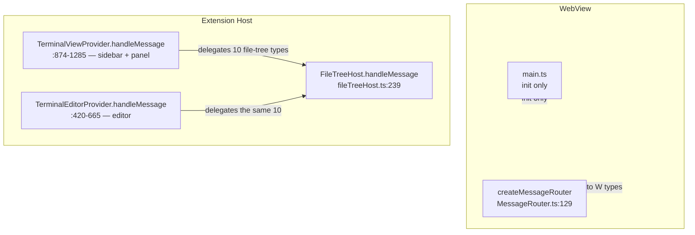
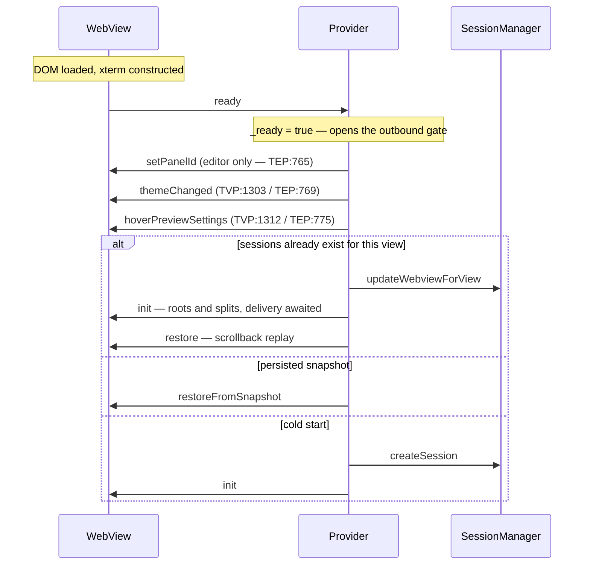

# Message Protocol — Detailed Design

## 1. Overview

The extension host (Node.js) and the webview (browser sandbox) share no memory. Every
interaction between them is a JSON message over VS Code's `postMessage` IPC. This
document is the **map** of that surface: which messages exist, which direction they
travel, who handles them, and the invariants a reader cannot derive from the type file.

Field-level detail is not repeated here. `src/types/messages.ts` (1359 lines) is the
contract; every row below anchors to a line in it.

### Goals
- One discriminated union per direction, so both sides narrow exhaustively on `type`
- Every supersedable request correlated, so a late reply can be dropped, not applied
- Every file-tree message generation-gated, so a re-rooted tree cannot be poisoned
- Result shapes that make an invalid combination fail to compile

### Constraints
- **Structured clone, JSON subset only.** No `Date`, `Map`, `Set`, `ArrayBuffer`, or
  class instances. Binary content travels base64 in a `string` (e.g. `:529`).
- **No delivery guarantee.** A disposed webview drops in-flight messages silently.
  Recovery is state replay via the `ready` handshake, never retransmission (§6).
- **Two host surfaces, unequal coverage.** `TerminalViewProvider` (sidebar + panel) and
  `TerminalEditorProvider` (editor) each implement their own dispatch, and the editor's
  is a strict subset (§8).
- **No protocol version field.** Both sides ship in one VSIX, so the contract is
  compile-time-checked rather than negotiated.

| Union | Members | Declared |
|-------|---------|----------|
| `WebViewToExtensionMessage` | 47 | `src/types/messages.ts:606-653` |
| `ExtensionToWebViewMessage` | 42 | `src/types/messages.ts:1225-1267` |

### Reference
- Flow control behind `ack` / `output`: [output-buffering.md](output-buffering.md) §4
- File-tree semantics: [file-tree.md](file-tree.md)
- Link and preview semantics: [link-detection.md](link-detection.md)
- Constant registry: `docs/DESIGN.md` §15

---

## 2. Contract Model

### 2.1 Correlation

Anything that can be superseded carries an id the responder echoes verbatim; the
requester drops replies that do not match its pending id. This is what makes a fast
typist's fourth keystroke not render the first keystroke's search results.

| Domain | Correlation field | Stale-drop site |
|--------|-------------------|-----------------|
| Directory read | `requestId` | `FileSystemDataSource.ts:684` |
| File-tree search | `requestId` | `FileTreeSearchController.ts` (`onResponse`) |
| Hover preview | `requestId` | `HoverPreviewController.ts:253` |
| Subagent preview | `requestId`, plus `entryId` for nested fetches | `messages.ts:1177-1184` |
| Vault detail | `entryId`, optional `requestId` | `messages.ts:1103-1124` |
| Vault context cwd | `sessionId` | `messages.ts:1156-1167` |

### 2.2 Generation gating

Every file-tree message carries `rootGeneration`, a monotonic counter owned by the host.
Correlation alone is insufficient there: a response can be for the *right request* and
still be for the *wrong root*. [file-tree.md](file-tree.md) §3 owns the semantics.

### 2.3 Result shapes

Three replies are a discriminated XOR — exactly one of two fields is present, so a
producer cannot compile while sending both or neither:

| Message | Branches | Declared |
|---------|----------|----------|
| `vaultSessionDetailResponse` | `detail` \| `error` | `:1131-1133` |
| `vaultMessageRecordResponse` | `record` \| `error` | `:1146-1148` |
| `subagentPreviewResponse` | `detail` \| `error` | `:1191-1193` |

`filePreviewResult` (`:888-926`) applies the same idea but discriminates on a `status`
string, because it has seven outcomes rather than two — and because which fields are
*present* is itself the security-relevant part (§5.2).

---

## 3. Handler Topology

Both providers own a full `switch` over `WebViewToExtensionMessage` and hand the ten
file-tree types to a shared `FileTreeHost`. On the webview side a single generated
router covers **every** member of `ExtensionToWebViewMessage` except `init`, which is
bootstrap orchestration owned by `main.ts` (`MessageRouter.ts:58`, `:255-257`); unknown
types are ignored rather than thrown on (`:258-260`). Vault, subagent, clipboard, and
agent-activity handlers are **optional** on the handler interface
(`MessageRouter.ts:100-114`) so a webview with those panels unmounted degrades silently
instead of crashing.

The diagram's asymmetry is the finding in §8.1: the editor's `switch` is a strict subset
of the sidebar/panel one.

**Abbreviations used in §4:** `TVP` = `TerminalViewProvider.ts`,
`TEP` = `TerminalEditorProvider.ts`, `FTH` = `fileTreeHost.ts`,
`MR` = `webview/messaging/MessageRouter.ts`. Bare `:NNN` in the *Defined* column is a
line in `src/types/messages.ts`.

---

## 4. Message Map

### 4.1 Terminal I/O and lifecycle

| Type | Dir | Purpose | Defined | Handled |
|------|-----|---------|---------|---------|
| `ready` | W→E | Webview DOM + xterm live; opens the outbound gate | `:80` | TVP:888 / TEP:431 |
| `input` | W→E | Keystrokes, paste, IME output | `:85` | TVP:892 / TEP:435 |
| `resize` | W→E | New cols/rows | `:94` | TVP:955 / TEP:494 |
| `ack` | W→E | Flow-control credit, batched per 5000 chars (`:173`) | `:171` | TVP:967 / TEP:506 |
| `clear` | W→E | Clear scrollback | `:164` | TVP:1138 / TEP:583 |
| `focus` | W→E | View focused; reports the active pane for split routing | `:180` | TVP:1197 only |
| `scrollbackDump` | W→E | Scrollback text, answering `requestScrollbackDump` | `:1349` | TVP:973 / TEP:512 |
| `init` | E→W | Initial state: tabs (with `isSplitPane` `:692`), `rootGeneration` `:702`, `workspaceRoot` `:704` | `:671` | main.ts |
| `output` | E→W | Buffered PTY output | `:711` | MR:132 |
| `exit` | E→W | PTY exited | `:720` | MR:135 |
| `restore` | E→W | Scrollback replay after webview re-creation | `:766` | MR:147 |
| `viewShow` | E→W | View became visible | `:794` | MR:153 |
| `error` | E→W | User-facing error | `:782` | MR:174 |
| `requestScrollbackDump` | E→W | Ask the webview for its scrollback (export) | `:1329` | MR:219 |

### 4.2 Tabs and splits

| Type | Dir | Purpose | Defined | Handled |
|------|-----|---------|---------|---------|
| `createTab` | W→E | New tab requested | `:105` | TVP:990 / TEP:529 |
| `switchTab` | W→E | Active tab changed | `:110` | TVP:1114 / TEP:549 |
| `closeTab` | W→E | Tab close requested | `:117` | TVP:1120 / TEP:555 |
| `renameTab` | W→E | Inline rename committed | `:129` | TVP:1132 / TEP:566 |
| `requestSplitSession` | W→E | Split a pane | `:141` | TVP:1144 only |
| `requestCloseSplitPane` | W→E | Close a split pane | `:157` | TVP:1188 / TEP:572 |
| `tabCreated` | E→W | Tab creation acknowledged | `:729` | MR:138 |
| `tabRemoved` | E→W | Tab gone | `:759` | MR:141 |
| `tabRenamed` | E→W | Host-normalized name | `:747` | MR:144 |
| `splitPane` | E→W | Command-initiated split | `:799` | MR:156 |
| `splitPaneCreated` | E→W | Reply to `requestSplitSession` (posted TVP:1169) | `:806` | MR:159 |
| `closeSplitPane` | E→W | Close the focused pane | `:819` | MR:162 |
| `closeSplitPaneById` | E→W | Close a named pane | `:824` | MR:165 |
| `splitPaneAt` | E→W | Split a named pane | `:830` | MR:168 |
| `flashPane` | E→W | Flash a leaf so the user sees which pane exports; no-op when unmounted (`:1269-1274`) | `:1275` | MR:222 |

`renameTab` is emitted **only** by the inline dblclick-overlay rename. Host-side triggers
(context menu, command palette, F2) call `SessionManager.renameSession` directly and
never round-trip. The host owns normalization: trim → empty becomes `null` → truncate 80.

### 4.3 File tree

All ten W→E types carry `rootGeneration` and are routed by **both** providers into the
shared host (TVP:1242-1256, TEP:589-602).

| Type | Dir | Purpose | Defined | Handled |
|------|-----|---------|---------|---------|
| `request-read-directory` | W→E | Lazy directory read | `:255` | FTH:244 |
| `request-file-tree-search` | W→E | Start host enumeration | `:214` | FTH:309 |
| `cancel-file-tree-search` | W→E | Abandon the in-flight enumeration | `:236` | FTH:320 |
| `request-open-folder` | W→E | Open-folder action | `:271` | FTH:326 |
| `request-subscribe-fs-changes` | W→E | Watch a directory | `:286` | FTH:255 |
| `request-unsubscribe-fs-changes` | W→E | Stop watching | `:299` | FTH:292 |
| `file-tree-reveal-in-os` | W→E | Reveal in Finder/Explorer | `:308` | FTH:365 |
| `file-tree-copy-path` | W→E | Copy absolute path | `:317` | FTH:368 |
| `file-tree-copy-relative-path` | W→E | Copy path relative to the host-owned root | `:330` | FTH:371 |
| `file-tree-delete` | W→E | Confirm, then trash | `:339` | FTH:374 |
| `read-directory-response` | E→W | Entries or an error code | `:972` | MR:189 |
| `file-tree-search-response` | E→W | Results plus a `truncated` flag | `:993` | MR:201 |
| `set-file-tree-position` | E→W | Move the panel (`FileTreePosition` `:75`) | `:1003` | MR:195 |
| `workspace-root-changed` | E→W | New root, new generation | `:1013` | MR:192 |
| `git-status-changed` | E→W | Debounced decoration delta with a revision stamp | `:1026` | MR:204 |
| `fs-changes-invalidated` | E→W | A watched directory changed | `:1040` | MR:207 |
| `fs-rehydrate` | E→W | Window regained focus; re-read everything expanded | `:1054` | MR:210 |
| `reveal-in-file-tree` | E→W | Three shapes (osc7 / autoReveal / openFolder) via `source?` `:1087` | `:1078` | MR:198 |

Shared payload types: `GitStatus` `:31`, `FileEntry` `:33`, `FileTreeSearchResult` `:243`.

**Contract:** path-action messages carry **no webview-supplied base path**. The host owns
the active root, checks the generation, verifies containment, and refuses a delete
aimed at the root itself (`fileTreeHost.ts:470-488`). A compromised or buggy webview
therefore cannot widen its own reach — it can only name a path, never a base.

### 4.4 Links and preview

| Type | Dir | Purpose | Defined | Handled |
|------|-----|---------|---------|---------|
| `openLink` | W→E | Open an http(s) URL externally | `:187` | TVP:1208 / TEP:605 |
| `openFile` | W→E | Resolve and open a clicked path | `:194` | TVP:1214 / TEP:611 |
| `requestFilePreview` | W→E | Hover preview; `override?` `:366` is the Cmd/Ctrl escalation | `:348` | TVP:1236 / TEP:633 |
| `requestSubagentPreview` | W→E | Subagent transcript; `entryId?` `:592-599` switches to vault drill-down | `:581` | TVP:1080 / TEP:639 |
| `updateHoverPreviewSetting` | W→E | Persist a popup toggle | `:953` | TVP:1258 / TEP:643 |
| `filePreviewResult` | E→W | Seven-status preview outcome (§5.2) | `:888` | MR:180 |
| `hoverPreviewSettings` | E→W | Settings snapshot on init and on change | `:947` | MR:186 |
| `subagentPreviewResponse` | E→W | Transcript or an error marker | `:1191` | MR:243 |

### 4.5 Clipboard and images

| Type | Dir | Purpose | Defined | Handled |
|------|-----|---------|---------|---------|
| `pasteClipboardImage` | W→E | Webview-captured image bytes (base64) | `:529` | TVP:898 / TEP:441 |
| `requestClipboardImagePreview` | W→E | Ask the host to read OS clipboard bytes | `:545` | TVP:914 / TEP:457 |
| `pasteOsClipboardImage` | W→E | Host-side clipboard paste fallback | `:557` | TVP:932 / TEP:471 |
| `clipboardImagePreview` | E→W | OS clipboard image bytes | `:573` | MR:246 |
| `osClipboardPasteMiss` | E→W | Clipboard held no image; text paste is never deferred here | `:567` | MR:249 |

### 4.6 Vault and agent status

All fifteen vault requests are handled **only** by `TerminalViewProvider` (bodies at
`TVP:373-867`) — see §8.1.

| Type | Dir | Purpose | Defined | Handled |
|------|-----|---------|---------|---------|
| `requestVaultSessions` | W→E | List sessions | `:373` | TVP:1019 |
| `vaultRenameSession` | W→E | Rename a session | `:489` | TVP:1023 |
| `vaultWatchSession` | W→E | Follow a session live | `:501` | TVP:1029 |
| `vaultResume` | W→E | Resume into a terminal | `:378` | TVP:1035 |
| `vaultFork` | W→E | Fork a session | `:385` | TVP:1041 |
| `requestVaultSessionDetail` | W→E | Load a transcript | `:397` | TVP:1047 |
| `vaultContinueSession` | W→E | Continue the latest session | `:433` | TVP:1058 |
| `requestVaultLaunchTargets` | W→E | Available agents to launch | `:449` | TVP:1064 |
| `requestVaultMessageRecord` | W→E | One raw record | `:420` | TVP:1068 |
| `requestVaultContextCwd` | W→E | Resolve a pane's cwd | `:514` | TVP:1074 |
| `vaultRevealInOS` | W→E | Reveal a session file | `:454` | TVP:1084 |
| `vaultOpenSessionFile` | W→E | Open the transcript file | `:460` | TVP:1090 |
| `vaultOpenWorkingDir` | W→E | Open the working directory | `:466` | TVP:1096 |
| `vaultCopyResumeCommand` | W→E | Copy the resume CLI | `:472` | TVP:1102 |
| `vaultCopyFilePath` | W→E | Copy the transcript path | `:478` | TVP:1108 |
| `vaultSessionsResponse` | E→W | Session list; `fromCache?` `:1100` marks the instant reply | `:1091` | MR:225 |
| `vaultSessionDetailResponse` | E→W | Transcript XOR error | `:1131` | MR:228 |
| `vaultMessageRecordResponse` | E→W | Record XOR error | `:1146` | MR:231 |
| `vaultLaunchTargets` | E→W | Launchable agents | `:1151` | MR:234 |
| `vaultContextCwd` | E→W | Resolved cwd, `null` when the OS query failed | `:1163` | MR:237 |
| `openVault` | E→W | Expand the vault panel | `:1200` | MR:240 |
| `agentActivityStatus` | E→W | Pane-scoped agent state; both fields `null` when cleared | `:1213` | MR:252 |

`vaultSessionsResponse` arrives **twice** by design: once from cache, once
authoritative. The webview renders both; a no-op guard makes the second invisible when
nothing changed (`:1094-1100`). `agentActivityStatus` is posted only through the owning
session's own live webview, so a disposed or non-live session's callback can never reach
another pane (`:1204-1212`).

### 4.7 Config, theme, panel identity

| Type | Dir | Purpose | Defined | Handled |
|------|-----|---------|---------|---------|
| `persistPanelId` | W→E | Ack that the webview stored the panelId | `:663` | **none — §8.1** |
| `configUpdate` | E→W | New `TerminalConfig` (`:10`) | `:775` | MR:150 |
| `themeChanged` | E→W | One of four theme kinds (`:935`) | `:929` | MR:183 |
| `ctxClear` | E→W | Context-menu clear | `:837` | MR:171 |
| `insertPathEffect` | E→W | Visual confirmation of a path insert | `:843` | MR:177 |
| `setPanelId` | E→W | Editor tells the webview what to persist via `setState` | `:1287` | MR:213 |
| `restoreFromSnapshot` | E→W | Cold-start restore from a persisted snapshot | `:1301` | MR:216 |

---

## 5. Handshake and Result Semantics

### 5.1 Ready handshake

Both `onReady` implementations (`TVP:1295-1449`, `TEP:759`) take exactly these three
branches. The ordering in the diagram is load-bearing:

1. `ready` is sent once per webview instantiation; `_ready` gates every outbound post.
2. Theme and hover settings precede `init` so the preview renderer has a theme before
   the first hover can fire.
3. `init` delivery is **awaited** before any `restore`. Inside the 50–150 ms retry
   window a transient failure would otherwise let `restore` reach a webview that has not
   processed `init`, mis-wrapping a deferred-open terminal with a default-config
   instance (`TEP:755-757`).
4. On re-creation, `updateWebviewForView` runs **before** replay — otherwise the
   surviving sessions still hold the disposed webview and every post silently no-ops
   (`TEP:786-789`).

### 5.2 `filePreviewResult` status ladder

The seven statuses (`FilePreviewStatus` `:848`) are ordered by how much they disclose.
The failure statuses deliberately carry **no path**, so a probe cannot use the preview
channel to confirm that a file exists.

| Status | Discloses | Meaning |
|--------|-----------|---------|
| `ok` | content, language, size, line count, `absPath` | File read |
| `binary`, `too-large` | size + `absPath`, no content | Resolved but not read |
| `requires-confirmation` | `absPath?`, a `reason` (`dotfile`, `sensitive-dir`, `out-of-workspace`) | Trust policy blocked auto-preview; awaits Cmd/Ctrl |
| `not-found`, `ambiguous`, `error` | nothing beyond the echoed request | No content, no path |

Base fields on every variant: `requestId`, `path`, `line?` (`:861-869`). The trust policy
behind `requires-confirmation` lives in [link-detection.md](link-detection.md) §7.3.

---

## 6. Delivery Semantics

`postMessage` preserves order per direction per webview, which is what makes the `ack`
credit loop sound: output cannot overtake the ack that released it.

| Function | Behavior | Site |
|----------|----------|------|
| `safePostMessage` | Fire and forget; swallows both the sync throw and the async rejection of a disposed webview | `TVP:1455-1463` |
| `safeSendWithRetry` | Up to 2 retries, 50 ms apart; returns whether delivery succeeded | `TVP:1471-1498` |

Retry is reserved for messages whose loss corrupts state rather than merely delaying it:
`init`, `tabCreated`, `splitPaneCreated`, `error` (`TVP:1465-1470`). It takes a
`shouldAbort` predicate re-checked before **every** attempt including retries, so a late
retry cannot overwrite newer data the caller has since posted (`TVP:1478-1483`).

Messages are lost when a webview is disposed mid-flight (collapse, editor close, window
reload). There is no retransmission — the `ready` handshake replays state instead. The
editor keeps its PTY alive across a reload for `GRACE_PERIOD_MS = 5000`
(`TerminalEditorProvider.ts:42`), comfortably longer than a ~1 s Cmd+R re-attach.

---

## 7. Validation Boundaries

Both sides treat the other as untrusted. The host does so because a webview runs
rendered content; the webview does so because a stale reply is indistinguishable from a
current one without checking.

| Boundary | Rule | Site |
|----------|------|------|
| Host dispatch | `switch` with a `default` that ignores unknown types | `TVP:874-1285`, `TEP:420-665` |
| Generation | Every file-tree message re-checked | `fileTreeHost.ts:244-254` |
| Containment | Path actions must sit inside the host-owned root; `..` rejected | `fileTreeHost.ts:470-499` |
| Preview input | Path ≤ 4096 chars, ids ≤ 128 | `previewValidation.ts:9,11` |
| Preview trust | `classifyTrust`; OSC-7 `currentCwd` excluded from trust bases | `previewFileLink.ts:127-158`, `:170-181` |
| External links | `http(s)` only, then an unconditional modal | `openExternalLink.ts:12-24` |
| Image paste | Size cap enforced on the decoded length | `imagePasteTrigger.ts:21` |
| Search caps | `maxResults` clamped to `[1, 5000]` | `fileTreeSearchHandler.ts:29-31` |
| Settings | Delay clamped `[100, 2000]`; `blockSensitive` read from global/default scope only | `hoverPreviewSettings.ts:23-28`, `:42-50` |
| Webview dispatch | Typed router; unknown types ignored; optional handlers invoked with `?.()` | `MR:258-260`, `:100-114` |
| Webview staleness | Non-matching `requestId` / `rootGeneration` dropped | `HoverPreviewController.ts:253`, `FileTreeController.ts:160-167` |

The two `currentCwd` exclusions are the sharpest edge: the shell can emit OSC 7 with any
absolute path, so treating it as a trust base would let any process in the terminal
disable its own gate. It is a resolution hint only — see
[link-detection.md](link-detection.md) §7.3.

---

## 8. Known Drift

### 8.1 Handler gaps

Verified by grep against the union and both dispatch sites. Recorded, not fixed.

| # | Gap | Evidence |
|---|-----|----------|
| 1 | `persistPanelId` has **no host handler** at all. The webview sends it; nothing consumes it. The editor persists the id itself via `setState`, so the ack is dead protocol | Union `:633`; sender `webview/main.ts:700`; `grep -rn persistPanelId src --include="*.ts"` returns only those two |
| 2 | `requestSplitSession` is editor-blind, but the path is **unreachable**, not a live drop: the webview only sends it in reply to `splitPane` / `splitPaneAt`, and both are posted through view-provider-only helpers. The adjacent real bug is that a right-click split on an editor-hosted session resolves to no provider and falls back to the focused view, so the new pane appears in the **wrong surface** | Handled TVP:1144 only; senders `webview/main.ts:575`, `:610` are `onSplitPane` / `onSplitPaneAt` reactions; posters `extension.ts:403-409` and `:577-583` take a `TerminalViewProvider`; `getProviderBySessionId` scans only sidebar + panel (`extension.ts:553`) |
| 3 | `focus` is editor-blind **and live** — it is sent from a `focusin` listener on `document`, so every focus in an editor-hosted terminal posts a message nothing handles | Handled TVP:1197 only; sender is a DOM listener at `webview/main.ts:1298-1321`, independent of host messages |
| 4 | All 15 vault requests are editor-blind except `requestSubagentPreview` | `TEP:420-665` has no `vault*` cases; the sole overlap is TEP:639 |
| 5 | `OUT_OF_WORKSPACE` is a documented-but-dead error code — no emitter exists, and reads are deliberately not workspace-restricted | Documented `:968`, `:987`; emitters are `STALE_ROOT`/`FS_ERROR` (`fileTreeRpcHandler.ts:148,174`) and `STALE_ROOT`/`INTERNAL`; removal recorded in `src/test/fileTreeRpc.integration.test.ts:151` |
| 6 | `filePreviewResult.truncated` doc says "200 KB / 500-line cap"; the line cap is 1000 | Doc `:876-877`; `readFileForPreview.ts:29` records the 500 → 1000 bump |
| 7 | `FileTreeHost.handleMessage` returns a boolean its own doc comment shows being branched on, but both callers discard it | Doc `fileTreeHost.ts:228-238`; callers TVP:1255, TEP:602 |

**The E→W side has no gaps** — the router covers all 42 members.

### 8.2 Declaration placement

Cosmetic, not defects: eight interfaces sit on the "wrong" side of the file relative to
the union that references them — `ScrollbackDumpMessage` `:1349` and
`PersistPanelIdMessage` `:663` (W→E, declared late); `OsClipboardPasteMissMessage` `:567`
and `ClipboardImagePreviewMessage` `:573` (E→W, declared in the W→E region); and
`FlashPaneMessage` `:1275`, `SetPanelIdMessage` `:1287`, `RestoreFromSnapshotMessage`
`:1301`, `RequestScrollbackDumpMessage` `:1329` (declared after their union).

### 8.3 Deliberate asymmetries

These look like bugs and are not:

- **`request-unsubscribe-fs-changes` skips the generation gate**
  (`fileTreeHost.ts:292-299`). Unsubscribing is idempotent cleanup; dropping a stale one
  would leak watchers.
- **`init` is not routed.** It is bootstrap, not an event, and `main.ts` must sequence
  terminal construction around it (`MR:255-257`).
- **Ten handler slots are optional.** A webview without a vault or terminal factory
  mounted must ignore those replies, not fail on them (`MR:100-114`).

---

## 9. File Location

`src/types/messages.ts` — both unions and every payload type. Its only dependency is
`src/vault/types` for the vault payload shapes.

Dependents: `TVP:874-1285`, `TEP:420-665`, `fileTreeHost.ts:239-380`,
`webview/main.ts` (`init`), `webview/messaging/MessageRouter.ts:129-263`.
