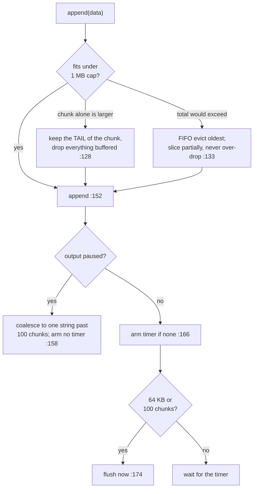
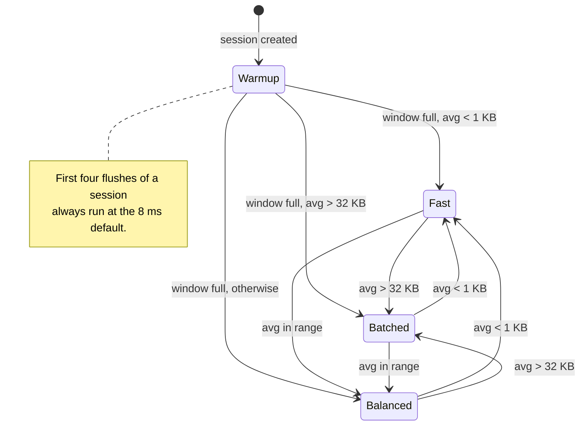
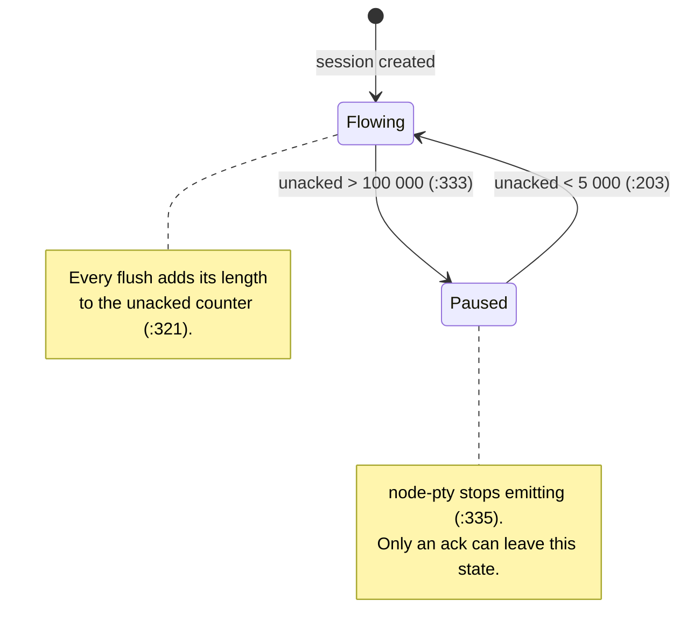

# Output Buffering & Flow Control

> Part of [DESIGN.md](../DESIGN.md)

## 1. Purpose & Scope

Shell output arrives in bursts that no UI can absorb one event at a time
(`find /`, `yes`, `cat large-file`). This subsystem sits between the PTY and the
webview and decides **when** bytes cross the IPC bridge, and **whether the PTY is
allowed to keep producing them at all**.

### Goals

- Turn many small PTY data events into few `postMessage` calls, without making an
  interactive keystroke echo feel late.
- Keep a slow or hidden webview from becoming unbounded memory in the extension
  host.
- Never let a producer outrun a consumer permanently: a paused PTY must always
  have a path back to flowing.

### Constraints

- **One buffer, on the host side.** The webview writes straight to xterm.js;
  only its *acks* are batched. A second buffer would add latency without removing
  work — `Terminal.write()` is already internally queued and renders on an
  animation frame.
- **No `vscode` and no node-pty import.** `OutputBuffer` declares the two
  structural interfaces it needs (`OutputBuffer.ts:7`, `:13`) so it is testable
  with plain fakes.
- **Coalescing and flow control are independent.** Pausing *output* (a hidden
  view) does not pause the *PTY*, and vice versa. Conflating them is the bug this
  separation exists to prevent.
- The bridge is ordered but lossy on teardown: a post may throw synchronously or
  reject asynchronously, and both must be survivable.

### Non-Responsibilities

| Not here | Where |
|----------|-------|
| Repainting a re-created webview | `scrollbackCache` — [session-manager.md](session-manager.md) |
| Surviving a window reload | snapshot pipeline — [session-manager.md](session-manager.md) |
| The scrollback the user scrolls | xterm's own, sized by `anywhereTerminal.scrollback` (`SettingsReader.ts:22`, applied `TerminalFactory.ts:234`) |
| Parsing or interpreting the bytes | `oscParser` — [pty-manager.md](pty-manager.md) |

### Module map

| File | Lines | Role |
|------|-------|------|
| `src/session/OutputBuffer.ts` | 338 | Coalescing, adaptive interval, watermarks, PTY pause/resume |
| `src/webview/flow/FlowControl.ts` | 53 | Per-session ack accumulation in the webview |

---

## 2. Architecture

```mermaid
flowchart LR
    subgraph PTY["PTY (node-pty)"]
        P["shell output"]
    end

    subgraph ExtHost["Extension host"]
        OB["OutputBuffer<br>OutputBuffer.ts:62"]
    end

    subgraph WebView["WebView"]
        XT["xterm.write(data, cb)<br>main.ts:494"]
        ACK["FlowControl<br>FlowControl.ts:38"]
    end

    P -->|"onData<br>SessionManager.ts:593"| OB
    OB -->|"output message<br>OutputBuffer.ts:325"| XT
    XT -->|"write callback"| ACK
    ACK -->|"ack, batched at 5000 chars"| OB
    OB -->|"pause / resume"| P

    style OB fill:#345,stroke:#6af
    style ACK fill:#543,stroke:#fa6
```



Two loops share one object. The **downward** loop is coalescing: accumulate,
flush on a timer or a size trigger. The **upward** loop is flow control: count
what has been sent, subtract what has been acknowledged, and pause the source
when the gap grows too large.

---

## 3. Coalescing

### 3.1 Tuning constants

All defined at the top of `src/session/OutputBuffer.ts` — this table is their
canonical home; other docs reference rather than restate it.

| Constant | Value | Line | Why |
|----------|-------|------|-----|
| `MIN_FLUSH_INTERVAL_MS` | 4 | `:20` | Adaptive floor — latency wins at low throughput |
| `DEFAULT_FLUSH_INTERVAL_MS` | 8 | `:26` | Start value, between VS Code's 5 ms and the 16 ms reference |
| `MAX_FLUSH_INTERVAL_MS` | 16 | `:23` | Adaptive ceiling — batching wins at high throughput |
| `THROUGHPUT_WINDOW_SIZE` | 5 | `:29` | Rolling window of recent flush sizes |
| `HIGH_THROUGHPUT_THRESHOLD` | 32 768 | `:32` | Average flush size that selects the ceiling |
| `LOW_THROUGHPUT_THRESHOLD` | 1 024 | `:35` | Average flush size that selects the floor |
| `MAX_TOTAL_BUFFER_CHARS` | 1 048 576 | `:38` | Hard memory cap; FIFO eviction past it |
| `MAX_BUFFER_SIZE` | 65 536 | `:41` | Size trigger for an immediate flush |
| `MAX_CHUNKS` | 100 | `:44` | Array-length trigger; also the paused-coalesce trigger |
| `HIGH_WATERMARK_CHARS` | 100 000 | `:47` | Unacked chars that pause the PTY |
| `LOW_WATERMARK_CHARS` | 5 000 | `:50` | Unacked chars that resume it |

### 3.2 Accepting data

`append` (`:121`) decides three things in order: whether the incoming chunk fits
the memory cap, whether a flush timer should exist, and whether the size triggers
demand a flush right now.



Two choices worth naming, because the obvious implementation gets them wrong:

- **Overflow keeps the newest bytes**, not the oldest (`:130`). The user is
  looking at the tail of the output; discarding it to preserve history the
  scrollback already owns would be backwards.
- **Eviction slices** the oldest chunk rather than dropping it whole (`:145`), so
  the buffer never discards more than the exact excess.

### 3.3 Adaptive interval

The flush interval is not fixed. Each flush records its own size into a 5-sample
rolling window (`:305`); once the window is **exactly full** (`:309`) the average
selects one of three intervals: 16 ms above 32 KB, 4 ms below 1 KB, 8 ms in
between (`:312`–`:316`).



Interactive typing settles on the floor — a keystroke echo is a handful of chars,
so the average never approaches 1 KB. A sustained dump settles on the ceiling,
where one 16 ms batch is strictly cheaper than four 4 ms ones for the same bytes.

The interval is read when a timer is **armed** (`:169`), never applied by
rescheduling a pending one, so a change takes effect on the following cycle.
Disposal resets both window and interval (`:280`).

### 3.4 Pausing output

Output pause is a *view* concern, not a producer concern: it stops the flush
timer while `append` keeps accepting data (`:214`, `:212`). That is exactly why
the 1 MB cap has to exist — a hidden view running `yes` would otherwise grow
without bound. While paused, the chunk array is additionally collapsed to a
single string past 100 entries (`:158`), bounding array length as well as bytes.

| Caller | Trigger | Lines |
|--------|---------|-------|
| `TerminalViewProvider` | view hidden / shown, and webview disposal | `TerminalViewProvider.ts:213`–`:227`, `:262` |
| `SessionManager` | restored session, so a fresh prompt cannot beat the snapshot replay onto the screen | `SessionManager.ts:572` |
| `SessionManager` | fallback respawn inspects `isOutputPaused` (`:102`) to decide whether to discard undelivered chunks | `SessionManager.ts:700` |

---

## 4. Flow Control

Coalescing bounds *message count*. It does nothing about a producer that is
simply faster than the renderer. Flow control closes that gap by making the PTY
itself stop.



The gap between the watermarks — 100 000 down to 5 000 — is deliberate
hysteresis. Resuming at the same threshold that paused would thrash the PTY once
per flush under sustained load.

### 4.1 Why acks are batched

The webview acknowledges from xterm's write callback, meaning "parsed", not
"received" — the only signal that actually reflects consumer progress. Acking
every write would put a message on the bridge for every message taken off it, so
`FlowControl` accumulates **per session** (`FlowControl.ts:26`) and posts once the
count reaches 5 000 (`:11`, `:42`).

Per-session counters matter: a shared counter would let a busy tab's progress
credit an idle tab's stalled buffer. When a terminal is removed its counter is
dropped (`:50`, called from `main.ts:445`) so residue cannot leak into a recycled
id. A single ack carries the whole accumulated count including the overshoot past
the threshold, so bytes are never double-counted or lost.

### 4.2 Trust boundary

`handleAck` (`:189`) treats the ack count as untrusted input. Non-finite and
non-positive values are rejected outright (`:195`), and the subtraction floors at
zero (`:200`). An over-counting webview must not be able to drive the counter
negative — that would permanently disable the high watermark and remove the only
backpressure the host has.

Routing is `webview → TerminalViewProvider` (`TerminalViewProvider.ts:969`) →
`SessionManager.handleAck` (`SessionManager.ts:930`) → the session's buffer.

### 4.3 The two deadlocks, and how each is avoided

| Deadlock | Avoided by |
|----------|-----------|
| Output arrives for a tab with no xterm instance (created late, or torn down) — nobody would ever ack it, the counter climbs past 100 000, the PTY stays paused forever | The webview acks anyway when no instance exists (`main.ts:502`) |
| A final flush during disposal pushes past the high watermark and pauses a PTY that is on its way out | The watermark check is skipped while disposing (`:333`) |

---

## 5. End-to-End

```mermaid
sequenceDiagram
    participant PTY as PTY process
    participant Buf as OutputBuffer
    participant WV as WebView

    Note over PTY,WV: steady state
    PTY->>Buf: onData(chunk)
    Buf->>WV: output (on flush; unacked += len :321)
    WV->>WV: terminal.write(data, cb) — main.ts:494
    WV->>Buf: ack, once 5 000 chars are parsed
    Note over Buf: unacked -= count :200

    Note over PTY,WV: burst
    loop rapid flushes
        PTY->>Buf: onData(chunk)
    end
    Note over Buf: unacked > 100 000
    Buf->>PTY: pause :335

    loop webview drains
        WV->>Buf: ack
    end
    Note over Buf: unacked < 5 000
    Buf->>PTY: resume :205
```

The same `pty.onData` event that feeds the buffer (`SessionManager.ts:593`) also
feeds the scrollback cache (`:1421`) and the snapshot recorder
(`SnapshotPersistence.ts:479`). Those three consumers are siblings, not layers —
see §1's non-responsibilities table.

---

## 6. Edge Cases

| Case | Behaviour |
|------|-----------|
| `cat` of a huge file | node-pty delivers chunks well under 1 MB, so the 64 KB trigger (`:173`) fires per chunk and the truncate path never runs; flow control does the real work |
| Tight `echo` loop | ~2 bytes per write; one interval of coalescing produces one message, and the throughput window pins the interval at its 4 ms floor |
| PTY exits with data buffered | The buffer is disposed **before** the kill (`SessionManager.ts:1299`, `:1306`) and disposal performs a final flush (`:271`); the exit message is posted after cleanup (`:639`) and ordering holds because the bridge is ordered |
| WebView disposed mid-flush | Sync throw and async rejection are both swallowed (`:324`–`:330`). Sessions survive — the provider pauses output rather than destroying (`TerminalViewProvider.ts:262`), and a re-resolved view rebinds every buffer (`SessionManager.ts:942` → `:247`) |
| Buffer swapped under a live session | Fallback respawn disposes the old buffer without flushing when it was output-paused (`SessionManager.ts:701`), discarding chunks the replay had not released, and pauses the replacement to match (`:705`) |

---

## 7. Boundaries & Decisions

- **The buffer is a `string[]`, joined once per flush** (`:300`) — repeated
  concatenation would be quadratic in the exact scenario this subsystem exists
  for.
- **Timers are created lazily and are one-shot.** None on an idle session
  (`:165`); `_flush` clears before running (`:291`) so the immediate-flush path
  cannot strand a duplicate. An empty flush returns early (`:296`), so a forced
  flush on an idle session posts nothing and does not perturb the throughput
  window.
- **Pause-output and pause-PTY stay separate concepts.** One is about a view
  nobody is watching; the other is about a consumer that cannot keep up. They
  have different owners, different triggers, and different exit conditions.
- **Backpressure is measured at parse time, not delivery time.** Acking on
  arrival would make the watermarks measure the bridge instead of the renderer.
- **The webview never decides how much to send.** It reports progress; the host
  decides. That keeps the untrusted side unable to do worse than under-ack, which
  degrades to a paused PTY rather than to unbounded host memory.

### Contracts

`OutputBuffer` imports nothing. It depends only on two structural interfaces it
declares itself, which is what makes it testable with plain fakes.

| Interface | Member | Type | Satisfied by |
|-----------|--------|------|--------------|
| `FlowControllable` (`:7`) | `pause` | `() => void` | `PtySession` (`src/pty/PtySession.ts:207`) |
| | `resume` | `() => void` | `PtySession` (`:221`) |
| `MessageSender` (`:13`) | `postMessage` | `(message: unknown) => Thenable<boolean>` | `vscode.Webview` |

### Public surface

Constructed per session from a tab id, a message sender, and the PTY (`:62`,
`:106`).

| Member | Line | Role |
|--------|------|------|
| `append` | `:121` | Data in |
| `flush` | `:181` | Force a flush now |
| `handleAck` | `:189` | Backpressure credit from the webview |
| `pauseOutput` / `resumeOutput` | `:214` / `:231` | View visibility |
| `updateWebview` | `:247` | Rebind after a webview is re-created |
| `dispose` | `:257` | Teardown; an optional flag discards instead of flushing |
| `unackedCharCount`, `bufferSize`, `isPaused`, `isOutputPaused` | `:87`–`:102` | Read-only observers |

### Dependents

`SessionManager` owns one buffer per session (`SessionManager.ts:491`) and swaps
it on fallback respawn (`:703`). `src/webview/main.ts` closes the loop from the
other side (`:499`, `:502`).
