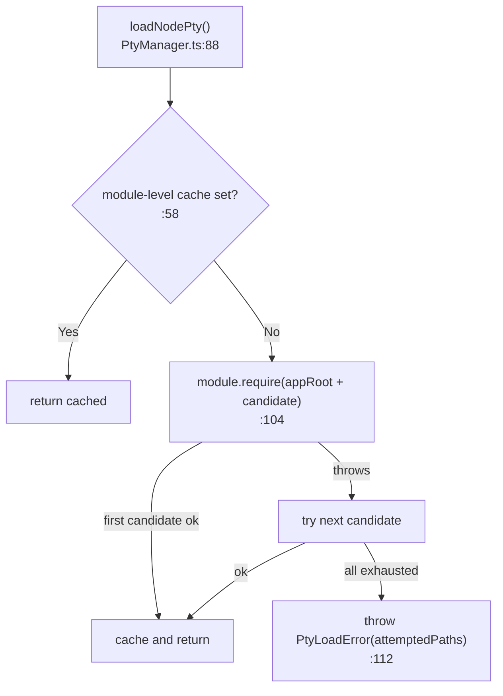
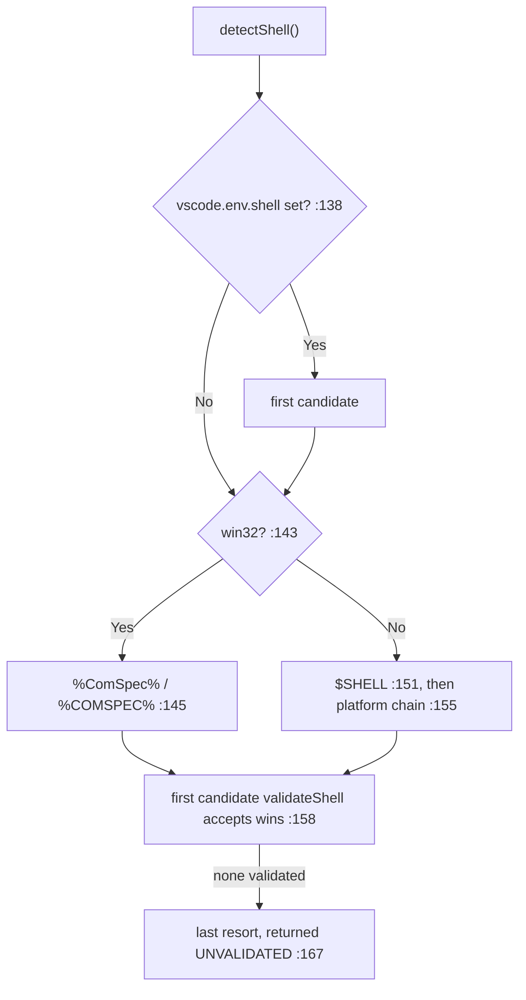
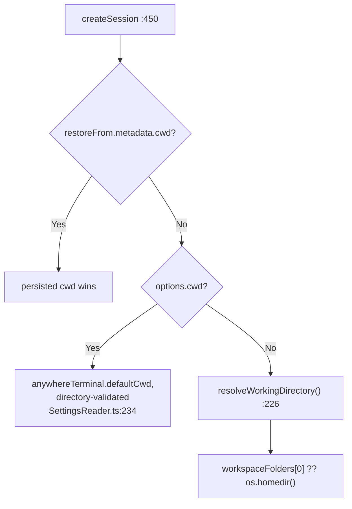
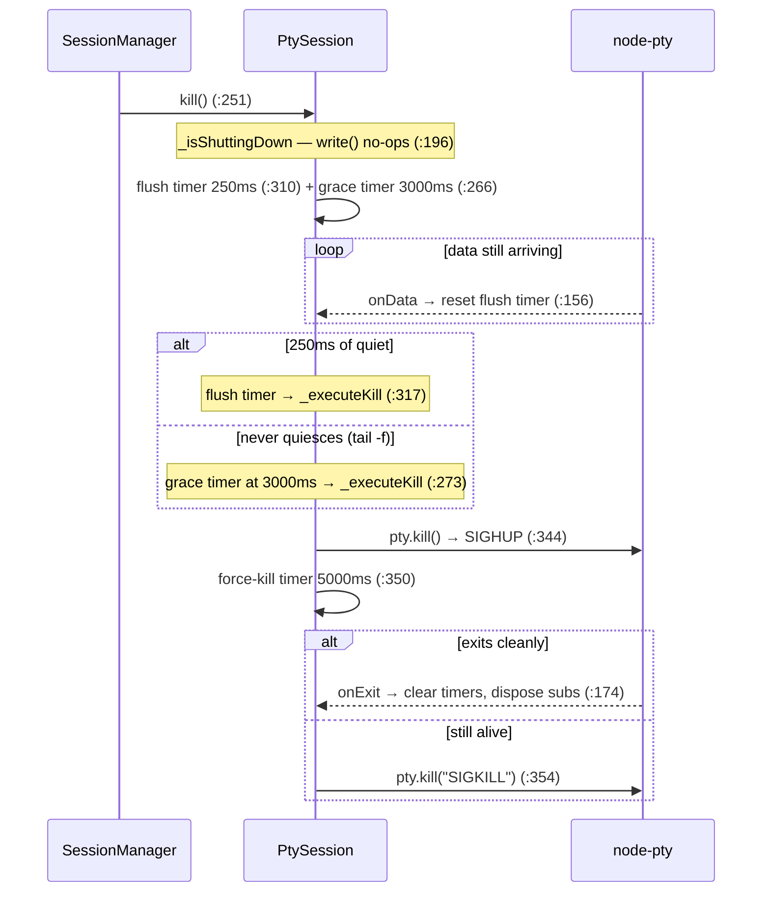

# PTY Layer — Design

## 1. Purpose & Scope

`src/pty/` is the boundary between the extension host and the OS process table.
It loads `node-pty`, decides *which* shell to run, owns one process's lifecycle,
and passively reads the shell-integration escape sequences coming back out.

### Goals
- Never compile native code — reuse the `node-pty` VS Code already ships
- Always produce a usable shell, on any platform, without throwing
- Kill a shell gracefully: let it flush, then escalate, but never hang shutdown
- Observe shell-integration markers without ever altering the user's byte stream

### Constraints
- The bundler (esbuild) cannot resolve a path outside the bundle, so the loader
  must reach Node's real `require`
- `node-pty` is not a dev dependency; its API surface is hand-typed
  (`PtyManager.ts:15`–`53`)
- A shell that never goes quiet must not be able to stall extension shutdown
- Shell-integration scripts are vendored MIT code from `microsoft/vscode` and are
  used unmodified

### Non-Responsibilities

| Concern | Owner |
|---|---|
| Sessions, tab numbers, restore | [session-manager.md](session-manager.md) |
| Output buffering, flow control | [output-buffering.md](output-buffering.md) |
| *Reacting* to shell-integration events | `ShellIntegrationCoordinator` / `CommandTracker` → [session-manager.md](session-manager.md) §9 |
| Reading `anywhereTerminal.*` settings | `src/settings/SettingsReader.ts:51` — nothing in `src/pty/` reads configuration |

### Module Map

| File | Role |
|------|------|
| `PtyManager.ts` (279 lines) | Free functions — load, detect, build env, resolve cwd, validate |
| `PtySession.ts` (379) | One class wrapping one spawned PTY |
| `ShellIntegrationInjector.ts` (238) | Per-shell injection of the vendored scripts at spawn |
| `oscParser.ts` (364) | Passive OSC 7 / OSC 633 scanner |
| `ShellIntegrationEvents.ts` (28) | The typed event union the parser emits |
| `processCwd.ts` (118) | "What is this pid's cwd?" |
| `processTree.ts` (103) | "What are this pid's descendants?" |

There is no service object here — one class, everything else free functions.

---

## 2. Loading node-pty

`node-pty` is a native addon. Bundling it would mean shipping a compiled binary
per platform/arch. VS Code already has one inside its own installation, so the
loader borrows it.

Candidates are tried in order (`NODE_PTY_CANDIDATE_PATHS`, `PtyManager.ts:63`):
`node_modules.asar/node-pty` for modern VS Code, then plain
`node_modules/node-pty` for older builds.

Two decisions worth naming:

- **`module.require`, not `require`** (`:104`). esbuild rewrites bare `require`
  into its own `__require`, which cannot resolve an absolute path outside the
  bundle. `module.require` is the genuine Node resolver.
- **Failure is surfaced early but is not fatal.** `activate` calls the loader
  eagerly only to raise a friendly toast (`extension.ts:38`, `:41`), then
  continues activating (`:47`). Individual `createSession` calls fail on their
  own afterwards. A broken install therefore degrades to "no terminals", not
  "extension dead".

---

## 3. Shell Detection

`detectShell(platform?, env?, vscodeShell?)` (`PtyManager.ts:130`) takes all
three inputs as injectable parameters, so the POSIX and Windows branches are
testable on one host.

**VS Code's own resolved shell comes first.** That single ordering choice means
`terminal.integrated.defaultProfile` and remote extension hosts are honoured
without any profile-parsing code of our own.

`detectShell` never throws. When nothing validates it returns a last-resort path
unvalidated (`:164`) — `%ComSpec%` else `cmd.exe` on Windows, the tail of the
chain (`/bin/sh`) on POSIX. A wrong-but-present answer beats an exception on a
path the user cannot recover from.

| Platform | `SHELL_FALLBACK_CHAINS` (`:69`) |
|---|---|
| `darwin` | `/bin/zsh` → `/bin/bash` → `/bin/sh` |
| `linux` | `/bin/bash` → `/bin/sh` |
| other POSIX | reuses the linux chain (`:183`) |
| `win32` | none — `%ComSpec%`, else `WINDOWS_DEFAULT_SHELL = "cmd.exe"` (`:75`) |

`validateShell` (`:242`) requires a regular file plus an execute bit on POSIX,
but **file-existence only on Windows** (`:248`) — Node does not report reliable
Unix execute bits for `.exe`, so an execute check would reject valid shells.

`getShellArgs` (`:262`) adds `--login` for `zsh` and `bash` only; every other
shell gets no default args. The basename match tolerates backslashes and `.exe`.

---

## 4. Spawn Configuration

`PtySession.spawn` assembles the node-pty options (`PtySession.ts:139`):
terminal name `xterm-256color`, cols and rows floored at 1 and defaulting to
**80 × 30**, plus the caller's cwd and env. `SessionManager` never passes
cols/rows, so every PTY starts at 80 × 30 and is resized by the webview's first
fit (`SessionManager.ts:480`, `:515`).

### CWD — two layers

`resolveWorkingDirectory` reads **no settings** — it is workspace-root-then-`$HOME`
and nothing else. `defaultCwd` is entirely a `SettingsReader` concern.

### Environment

`buildEnvironment` (`:193`) clones `process.env`, dropping undefined values, then
sets `TERM=xterm-256color` (`:204`), `COLORTERM=truecolor` (`:205`),
`LANG=en_US.UTF-8` **only when unset** (`:208`), `TERM_PROGRAM=AnyWhereTerminal`
(`:213`), and `TERM_PROGRAM_VERSION` from the extension's `packageJSON`
(`:216`). Everything else — `PATH`, `HOME`, `SHELL`, `LC_ALL` — is inherited
untouched; there is no exclusion list because nothing else is ever assigned.

At spawn time `createSession` merges four layers, last wins
(`SessionManager.ts:462`–`:478`):

```mermaid
flowchart LR
    A["buildEnvironment()<br>base"] --> B["injector env<br>VSCODE_NONCE, ZDOTDIR…"]
    B --> C["options.env<br>vault per-session"]
    C --> D["cursorHooks.create(id)<br>renewable authority"]
    style D fill:#345,stroke:#6af
```

The Cursor-hook layer is merged last deliberately, so no earlier override can
shadow it (`SessionManager.ts:475`).

---

## 5. PtySession Lifecycle

`PtySession` (`:39`) wraps exactly one process and is single-use — a second
`spawn()` warns and returns (`:134`). Four flags drive it: `_isAlive` (`:43`),
`_isShuttingDown` (`:44`, makes `write` a no-op), `_hasSpawned` (`:45`), and
`_killSent` (`:46`, makes the kill idempotent).

### Graceful shutdown — three timers

The shape is *quiet-period first, deadline second, force third*: a shell gets to
finish writing, a pathological stream cannot hold shutdown open, and a wedged
process is killed outright.

| Constant | Value | Line | Rationale |
|---|---|---|---|
| `DATA_FLUSH_TIMEOUT_MS` | 250 | `:14` | Quiet period after last `onData` (VS Code `ShutdownConstants.DataFlushTimeout`) |
| `MAX_GRACE_PERIOD_MS` | 3000 | `:26` | Hard deadline from `kill()` |
| `MAX_SHUTDOWN_TIME_MS` | 5000 | `:20` | `SIGKILL` if SIGHUP is ignored (VS Code `ShutdownConstants.MaximumShutdownTime`) |

`_executeKill` is idempotent (`:327`) because both the flush timer and the grace
timer can reach it. `dispose()` (`:281`) is the *ungraceful* path — clear timers,
kill now; `SessionManager.dispose` deliberately uses `kill()` instead
(`SessionManager.ts:1247`).

`pause()` / `resume()` (`:207`, `:221`) forward to node-pty behind a feature
check. `OutputBuffer` holds the session as its `FlowControllable` and drives them
from the watermarks — see [output-buffering.md](output-buffering.md) §4.

---

## 6. Shell Integration — Host Side

Shell integration powers cwd tracking, tracked commands, and the export
commands. The **producer** half lives here; the **consumer** half is
[session-manager.md](session-manager.md) §9.

```mermaid
flowchart LR
    subgraph Spawn["Spawn time"]
        A["injectShellIntegration<br>ShellIntegrationInjector.ts:76"] --> B["args + env + nonce"]
        B --> C["setShellIntegrationNonce<br>SessionManager.ts:468"]
    end
    subgraph Runtime["Every chunk"]
        D["pty.onData<br>PtySession.ts:153"] --> E["oscParser.feed<br>:164"]
        D --> G["_onDataCallback<br>byte-identical, ALWAYS"]
        E --> F["ShellIntegrationEvent"]
    end
    F --> H["Coordinator<br>session-manager.md §9"]
    style G fill:#345,stroke:#6af
```

### Injection

`injectShellIntegration` (`ShellIntegrationInjector.ts:76`) returns `null` whenever it cannot
help, and the caller then spawns with the original args and env
(`SessionManager.ts:465`). Integration is a bonus, never a precondition.

| Shell | Strategy | Line |
|---|---|---|
| `bash` | copy the script into a 0700 temp dir, prepend `--init-file` | `:139` |
| `zsh` | copy four scripts into a temp `ZDOTDIR`; set `ZDOTDIR` + `USER_ZDOTDIR` | `:156` |
| `fish` | prepend `--init-command "source …"` (POSIX-quoted) | `:190` |
| `pwsh` | prepend `-noexit -command ". '…'"` | `:204` |
| `sh`, `dash`, `cmd.exe`, `nu`, custom | `null` — no integration | `:113` |

Opt-outs are honoured: `bash --noprofile --norc` (`:90`) and any
case-insensitive pwsh `-NoProfile` (`:107`) return `null`.

| Variable | Set for | Why |
|---|---|---|
| `VSCODE_NONCE` | all four | Stamped on every OSC 633 `E`; the parser rejects forged ones |
| `VSCODE_INJECTION=1` | bash, zsh | Gates the vendored scripts' sourcing of user dotfiles — without it the shell starts with no user `PATH`, aliases, or prompt |
| `ZDOTDIR` / `USER_ZDOTDIR` | zsh | Temp-dir bridge; `USER_ZDOTDIR` falls back to `ZDOTDIR` → `HOME` → `""` (`:173`) |

`scrubLeakedEnv` (`:130`) removes `VSCODE_SHELL_INTEGRATION` and
`VSCODE_ZDOTDIR` inherited from an extension host that was itself launched from
an integrated shell — left in place they make the vendored scripts silently
no-op. `TERM_PROGRAM` is deliberately left as `AnyWhereTerminal` (`:73`).

bash and zsh injections return a cleanup closure that removes the temp dir,
guarded by a done-flag (`:225`); fish and pwsh source the extension's own
`resources/` copy and use `NOOP_CLEANUP` (`:48`). The injector context is
assembled in `extension.ts:70`.

### The parser

`createOscParser` (`oscParser.ts:45`), one per `PtySession` (`PtySession.ts:63`),
is a **pure observer**. `PtySession` feeds it inside a try/catch and forwards the
chunk to the data callback regardless (`:162`–`:169`), so a parser or consumer
bug can never mutate or swallow user-visible bytes.

A `pending` buffer lets a sequence split across chunks still be recognised; a
partial OSC longer than `MAX_PENDING = 4096` (`:21`) is discarded as garbage.

| Sequence | Event | Line |
|---|---|---|
| `OSC 7 ; file://…` | `cwd` | `:187` |
| `OSC 633 ; A` | `promptStart` | `:220` |
| `OSC 633 ; B` / `; C` | `commandStart` | `:224` |
| `OSC 633 ; D[;code]` | `commandEnd` (exit code `null` when absent/malformed) | `:228` |
| `OSC 633 ; E ; cmd[;nonce]` | `commandLine` with `nonceValid` | `:242` |
| `OSC 633 ; P ; Cwd=…` | `cwd` | `:285` |
| any other OSC (title, hyperlink, clipboard, iTerm) | silently consumed | `:176` |
| everything else | `text` | `:66` |

Emitting plain text as an ordered event, rather than skipping it, is what stops a
single `[output][OSC D]` chunk from closing a command before its output was
captured (`:64`). The union is `ShellIntegrationEvent`
(`ShellIntegrationEvents.ts:19`).

`nonceValid` is true only when a nonce was configured *and* matches exactly
(`:261`); consumers must drop invalid `commandLine` events, and `CommandTracker`
does (`TrackedCommand.ts:141`). Reported cwds are sanitized (`:347`): absolute,
`path.resolve`-stable, no control characters (`:344`), after unescaping VS Code's
`__vsc_escape_value` encoding (`:312`). Anything failing is dropped silently.

---

## 7. OS Process Queries

Two independent best-effort shell-outs, both split into a pure parser plus an IO
half, both with injectable dependencies, and **neither ever throws** — every
failure returns `undefined` or `[]` so the caller falls through.

`queryProcessCwd(pid)` (`processCwd.ts:46`) answers "where is this shell *right
now*", independent of shell integration: `readlink /proc/<pid>/cwd` on Linux
(`:54`), `lsof -a -p <pid> -d cwd -Fn` on macOS (`:109`), `undefined` elsewhere
(`:59`). `LSOF_TIMEOUT_MS = 500` (`:16`) caps the macOS call so a hung `lsof`
cannot stall a click, and `sanitize` (`:74`) rejects empties, `" (deleted)"`
suffixes, control bytes, and relative paths. It is reached lazily through
`SessionManager.getLiveCwd` (`SessionManager.ts:864`) — only when a click
actually needs it.

`descendantPids(rootPid)` (`processTree.ts:79`) walks the process table breadth-
first to find the `claude` process under a terminal's PTY, mapping a pane to a
running agent session (`resolveClaudeSession.ts:52`). `ps -axo pid=,ppid=` on
macOS (`:88`), `ps -eo` on Linux (`:91`), `[]` elsewhere (`:93`), capped by
`PS_TIMEOUT_MS = 500` (`:15`). `parseProcessTable` (`:18`) and
`collectDescendants` (`:41`, with a cycle guard) are pure.

---

## 8. Error Handling

| Error | Cause | Behaviour |
|---|---|---|
| `PtyLoadError` | node-pty at no candidate path | Thrown by the loader (`PtyManager.ts:112`); `activate` toasts and continues (`extension.ts:40`) |
| spawn throw | invalid shell, bad cwd, env problem | `createSession` releases hook authority and rethrows (`SessionManager.ts:481`); the provider posts `error` to the webview (`TerminalViewProvider.ts:1010`) |
| shell not found | `validateShell` false | Silent — next candidate (`PtyManager.ts:158`) |
| SIGHUP ignored | wedged shell | `SIGKILL` after 5 s (`PtySession.ts:354`) |
| parser or sink throw | malformed sequence, consumer bug | Caught and logged; the chunk still reaches the user unchanged (`PtySession.ts:165`) |

---

## 9. Boundaries & Decisions

**No post-spawn fallback retry.** The fallback chain is consumed entirely during
*detection*. Once a shell is chosen and `spawn` fails, the error surfaces to the
user; no second shell is attempted. Retrying silently would hide a
misconfiguration behind a shell the user did not ask for.

**The data stream is inviolable.** Shell-integration parsing is strictly
observational (`PtySession.ts:162`). Any change that lets the parser rewrite,
delay, or drop bytes breaks this layer's core contract.

**Detection never throws; spawn does.** Detection has a defensible degraded
answer (`/bin/sh`); spawn does not, so its failure is the user's to see.

**node-pty's types are ours.** `Pty`, `PtyForkOptions`, and `NodePtyModule`
(`PtyManager.ts:15`–`53`) are a hand-written minimal subset, keeping the native
package out of `devDependencies` entirely.

### Public surface

| Symbol | Shape | Line |
|---|---|---|
| `loadNodePty()` | → `NodePtyModule` | `PtyManager.ts:88` |
| `detectShell(platform?, env?, vscodeShell?)` | → `{ shell, args }` | `:130` |
| `buildEnvironment()` | → `Record<string, string>` | `:193` |
| `resolveWorkingDirectory()` | → `string` | `:226` |
| `validateShell(shellPath, platform?)` | → `boolean` | `:242` |
| `getShellArgs(shellPath)` | → `string[]` | `:262` |
| `new PtySession(id)` | ctor | `PtySession.ts:75` |
| `isAlive` / `pid` | getters | `:67`, `:71` |
| `onData` / `onExit` | callback setters | `:81`, `:85` |
| `setShellIntegrationSink` / `setShellIntegrationNonce` | wiring | `:99`, `:108` |
| `spawn(nodePty, shell, args, opts)` | one-shot | `:122` |
| `write` / `pause` / `resume` / `resize` | I/O | `:195`, `:207`, `:221`, `:235` |
| `kill()` / `dispose()` | graceful / immediate | `:251`, `:281` |

### Dependents
- `SessionManager` — spawns, wires, and kills every session (`SessionManager.ts:453`, `:591`, `:654`)
- `SettingsReader` — calls `detectShell` for its own fallback (`SettingsReader.ts:223`)
- `TerminalViewProvider` / `TerminalEditorProvider` — `descendantPids` while resolving a pane to a Claude session

Vendored scripts live in `resources/shell-integration/` (7 MIT files from
`microsoft/vscode`), used unmodified.
