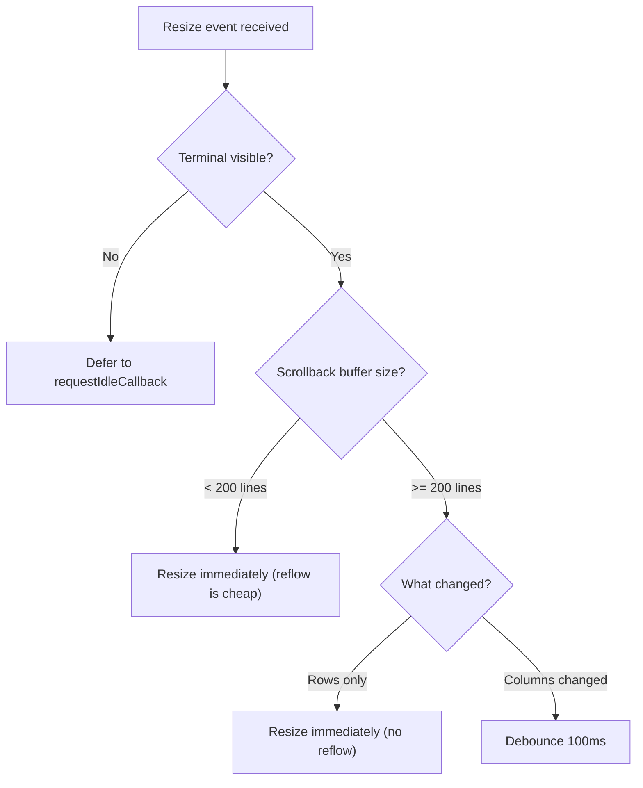
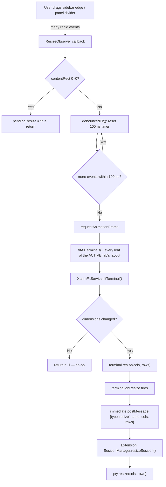
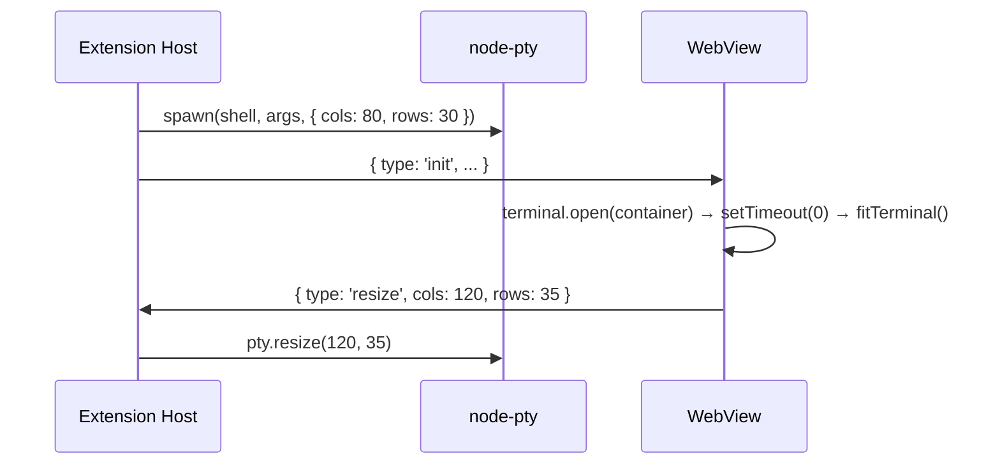
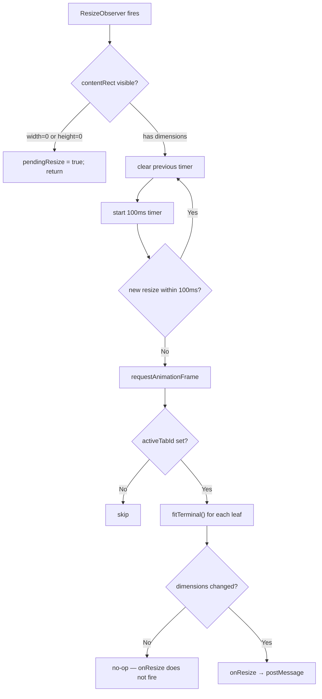

# Resize Handling — Detailed Design

## 1. Overview

Terminal resize is one of the most performance-sensitive operations in a terminal emulator. **Horizontal resize (column change) is expensive** because it triggers text reflow — every line in the scrollback buffer must be re-wrapped. During a drag gesture (sidebar edge, panel divider, split sash), dozens of resize events fire per second.

This document covers how we observe container dimension changes, debounce them, compute cols/rows, and propagate the result through to the PTY.

Two modules own the whole story:

| Module | Responsibility |
|---|---|
| `src/webview/resize/XtermFitService.ts` | **Pure calculation.** Given a terminal + its parent element, return `{cols, rows}` or `null`. Performs no resize. Sole user of xterm private APIs. |
| `src/webview/resize/ResizeCoordinator.ts` | **Policy.** ResizeObserver, debounce timers, deferred-while-hidden state, split-tree fan-out. |

### Design constraints

- **Reflow is the cost centre.** Column changes re-wrap the entire scrollback, so the design optimises for *fewer* fits, not faster ones — hence one debounce window rather than incremental resizing.
- **A hidden container measures 0×0.** Any fit computed while hidden is wrong, so fits are deferred rather than clamped.
- **Calculation and policy must stay separable.** The pure `fitTerminal()` is unit-testable without a DOM; all timers and state live in the coordinator.
- **Private xterm API is contained to one file.** If an xterm upgrade breaks internals, only `XtermFitService` needs fixing.

### Reference Sources
- VS Code: `src/vs/workbench/contrib/terminal/browser/xterm/xtermTerminal.ts`
- VS Code: `src/vs/workbench/contrib/terminal/browser/terminalResizeDebouncer.ts`

---

## 2. VS Code's Smart Resize Strategy (for contrast)

VS Code adapts its debounce based on terminal state:



### Why Column Changes Are Expensive

| Dimension Change | Cost | Reason |
|---|---|---|
| Rows increase | Cheap | Add empty rows at the bottom |
| Rows decrease | Cheap | Remove rows from the bottom |
| Columns change | Expensive | Every scrollback line is re-wrapped — a 10,000-line buffer means 10,000 wrap recalculations |

---

## 3. Our Resize Design

A single fixed debounce on all resize events, applied **between the ResizeObserver and the fit**, not between `onResize` and `postMessage`.

| Constant | Value | Cite |
|---|---|---|
| `RESIZE_DEBOUNCE_MS` | **100 ms** | `resize/ResizeCoordinator.ts:31` |

### Resize Pipeline



> Once `fitTerminal()` changes dimensions, `terminal.onResize` fires and `postMessage` is sent **immediately** — there is no second debounce on the IPC (`terminal/TerminalFactory.ts:429-431`).

### Design Rationale

| Aspect | VS Code | Here | Rationale |
|---|---|---|---|
| Debounce strategy | Adaptive (row/col/buffer-aware) | Fixed 100 ms for all | Column changes are 100 ms in VS Code too; rows-only is the cheap case we simply don't special-case |
| Hidden terminal | `requestIdleCallback` | Defer via `pendingResize`, flush on `viewShow` | See §5 |
| Small-buffer optimization | Immediate below 200 lines | Not implemented | — |
| Row-only optimization | Immediate | Not implemented | — |

---

## 4. Dimension Calculation — `XtermFitService`

`fitTerminal(terminal, parentElement)` (`resize/XtermFitService.ts:21`) returns `{cols, rows}` when a resize is needed, or `null`. It never calls `terminal.resize()` — the caller decides.

It works in four steps:

1. Read the **cell box** from xterm's own render service — `_core._renderService.dimensions.css.cell` (`XtermFitService.ts:27-31`).
2. Read the **available box** from `parentElement.getBoundingClientRect()`, minus the `.xterm` element's own padding (`:33-50`).
3. Apply the fit formula — `cols = max(2, floor(availableWidth / cell.width))`, `rows = max(1, floor(availableHeight / cell.height))` (`:52-54`).
4. Clear the render service's dimension cache so the next paint re-measures, and return the pair (`:60-62`).

Four guards short-circuit to `null` before any of that:

### Early-Return Table

| Guard | Meaning | Cite |
|---|---|---|
| `!terminal.element` | not yet `open()`-ed | `XtermFitService.ts:23-25` |
| `!dims \|\| cell.width === 0 \|\| cell.height === 0` | renderer has not measured a cell yet | `XtermFitService.ts:29-31` |
| `parentRect.width === 0 \|\| height === 0` | container collapsed/detached | `XtermFitService.ts:35-37` |
| `terminal.rows === rows && terminal.cols === cols` | no change — avoids a spurious `onResize` + IPC | `XtermFitService.ts:56-58` |

### Why `getBoundingClientRect()` and not `getComputedStyle()`

`getComputedStyle()` can return stale values during CSS flex layout transitions (e.g. sidebar expand). `getBoundingClientRect()` reports the actual rendered box. This matches VS Code's own approach in `xtermTerminal.ts` (`XtermFitService.ts:12-15`).

### Why there is no explicit devicePixelRatio math

`dims.css.cell.{width,height}` are already **CSS pixels** measured by xterm's own render service on the live canvas, and `getBoundingClientRect()` is also in CSS pixels. Both sides of the division scale together, so multiplying each by `devicePixelRatio` would cancel out. DPR handling lives inside xterm's renderer, not here.

### Why no scrollbar width is deducted

xterm v6's scrollbar is an overlay: it is positioned `right: 0` inside the scrollable element and floats over the rightmost cells when visible (the macOS overlay-scrollbar pattern). No horizontal space is reserved, so `availableWidth` deducts only the `.xterm` element's own padding (`XtermFitService.ts:46-50`).

### Stated risk: the `_core` private-API dependency

Step 1 reaches into `terminal._core._renderService`, which xterm does not treat as public and may rename or restructure in any release. This is accepted deliberately — xterm exposes no supported way to read measured cell dimensions, and the alternative (`FitAddon.fit()`) resizes the terminal itself rather than returning a proposal, which this design needs to keep separate.

The exposure is bounded: `dims.css.cell` and `_renderService.clear()` are the **entire** private surface, and both are touched only in `XtermFitService.ts` (`:16-17`). An xterm upgrade that breaks internals fails in one file, and the four guards above already return `null` when the shape is missing — so the failure mode is "terminal stops re-fitting", not a crash.

---

## 5. Visibility-Triggered Resize

### Problem

When a view is hidden (sidebar collapsed, panel closed), its container measures 0×0. `retainContextWhenHidden` keeps the DOM alive, so the ResizeObserver still fires — with a zero rect. Fitting then would compute nothing useful, and the terminal must be re-fitted when the view returns.

### Flow

```mermaid
sequenceDiagram
    participant User
    participant VSCode as VS Code
    participant RC as ResizeCoordinator
    participant XFS as XtermFitService
    participant EXT as Extension Host

    User->>VSCode: Collapse sidebar
    Note over RC: ResizeObserver fires with 0×0
    RC->>RC: pendingResize = true; return (no debounce started)

    User->>VSCode: Expand sidebar
    VSCode->>EXT: onDidChangeVisibility
    EXT->>RC: { type: 'viewShow' }

    RC->>RC: pendingResize? → clear + requestAnimationFrame
    RC->>XFS: fitTerminal(instance) for every leaf of the active tab
    XFS-->>EXT: terminal.onResize → { type: 'resize', cols, rows }
    EXT->>EXT: pty.resize(cols, rows)
```

### `ResizeCoordinator` state

| Field | Purpose | Cite |
|---|---|---|
| `pendingResize` | a resize was skipped because the container was 0×0 | `ResizeCoordinator.ts:49` |
| `fitTimeout` | single debounce slot for window/container resize | `ResizeCoordinator.ts:50` |
| `splitFitTimeouts: Map<tabId, handle>` | **per-tab** debounce slots for split fan-out | `ResizeCoordinator.ts:58` |
| `observer` | the single `ResizeObserver` | `ResizeCoordinator.ts:59` |

> `splitFitTimeouts` is keyed **per tab**, not a single shared slot. With one shared slot, `debouncedFitAllLeaves(tabA)` followed immediately by `debouncedFitAllLeaves(tabB)` cancelled tabA's timer — after a cross-restart with several split roots, every root except the last stayed visually blank (0×0 canvas). See `ResizeCoordinator.ts:51-57`.

### Public surface

| Member | Role | Cite |
|---|---|---|
| constructor | injected `fitTerminal` + a `getState()` returning `{activeTabId, terminals, tabLayouts}` | `:40-49` |
| `setup(container)` | attach the `ResizeObserver` | `:73` |
| `debouncedFit()` | fit the active tab | `:100` |
| `debouncedFitAllLeaves(tabId)` | fit every leaf of one tab's split tree | `:113` |
| `onViewShow()` | run a deferred fit after re-show | `:140` |
| `dispose()` | detach observer, clear timers | `:168` |

There is exactly one instance, constructed in `main.ts:140-143` and observing the shared `#terminal-container` (`main.ts:914-918`). It fits **all leaf terminals in the active tab's split tree**, falling back to a single terminal keyed by `activeTabId` when the tab has no layout entry (`ResizeCoordinator.ts:183-205`).

### Terminal location is *not* inferred here

`ResizeCoordinator` never guesses the terminal's location from container aspect ratio. Location is the extension's decision, baked into `data-terminal-location` on `<body>` at HTML-generation time (`providers/webviewHtml.ts:680`) and read once at bootstrap (`main.ts:1050-1053`). See `theme-integration.md` §3.

### What triggers a fit

| Trigger | Entry point | Cite |
|---|---|---|
| Container `ResizeObserver` | `debouncedFit()` | `ResizeCoordinator.ts:88` |
| `window.resize` | `debouncedFit()` | `main.ts:1334-1336` |
| View becomes visible (`viewShow`) | `onViewShow()` | `main.ts:562-563` |
| Split sash drag ends | `debouncedFitAllLeaves(tabId)` | `split/SplitTreeRenderer.ts:153-156` |
| Split pane created / closed | `debouncedFitAllLeaves(tabId)` in a `requestAnimationFrame` | `SplitTreeRenderer.ts:387-391`, `:333-339` |
| Init with restored split layouts | `debouncedFitAllLeaves(tabId)` per split root | `main.ts:907-913` |
| File-tree layout change | `debouncedFit()` | `main.ts:947` |
| Drag-drop tip dismissed | `debouncedFit()` | `main.ts:1044` |
| Tab switch | `factory.fitAllAndFocus()` (immediate, not debounced) | `main.ts:411-416` |
| Font size / family config change | `factory.fitTerminal()` per instance (immediate) | `TerminalFactory.ts:598-601` |
| New root terminal created | `setTimeout(0)` → `fitTerminal` | `TerminalFactory.ts:544-554` |

---

## 6. Initial Dimensions

The PTY is spawned in the extension host before the webview has measured anything.

| Property | Default | Cite |
|---|---|---|
| `cols` | 80 | `src/pty/PtySession.ts:141`, `src/session/SessionManager.ts:515` |
| `rows` | 30 | `src/pty/PtySession.ts:142`, `src/session/SessionManager.ts:516` |

On restore, the persisted `metadata.cols/rows` win over the defaults (`SessionManager.ts:515-516`).



The brief window at 80×30 is typically imperceptible: the prompt renders once at 80 columns, then re-renders when the resize lands.

---

## 7. Full Resize-to-PTY Pipeline

```mermaid
sequenceDiagram
    participant DOM as Container DIV
    participant RO as ResizeObserver
    participant RC as ResizeCoordinator
    participant XFS as XtermFitService
    participant XT as xterm.Terminal
    participant EXT as Extension Host
    participant SM as SessionManager
    participant PTY as node-pty

    DOM->>RO: dimensions change
    RO->>RC: callback (contentRect)
    RC->>RC: start/reset 100ms debounce
    Note over RC: 100ms quiet…
    RC->>RC: requestAnimationFrame
    RC->>XFS: fitTerminal(terminal, parentElement)
    XFS->>XT: (caller) terminal.resize(cols, rows)
    XT->>XT: reflow if cols changed
    XT->>EXT: onResize → postMessage({type:'resize', tabId, cols, rows})
    EXT->>SM: resizeSession(tabId, cols, rows)
    SM->>PTY: pty.resize(cols, rows)
    SM->>SM: session.cols/rows = …; snapshots.recordResize(session, cols, rows)
```

`SessionManager.resizeSession()` (`src/session/SessionManager.ts:733-742`) is a silent no-op for unknown session ids, then resizes the PTY, updates the stored dimensions, and records the resize into the snapshot store. `PtySession.resize()` clamps both values to a minimum of 1 and no-ops when the process is not alive (`src/pty/PtySession.ts:235-240`).

### What Happens After `pty.resize()`

1. The kernel updates the tty's `struct winsize`.
2. The kernel sends `SIGWINCH` to the foreground process group.
3. `vim`, `htop`, `less`, TUI agents catch it and re-render.
4. The shell updates `$COLUMNS` / `$LINES`.

---

## 8. Debounce Decision Tree



> The 0×0 branch `return`s out of the whole `ResizeObserver` callback loop — it does not fall through to the debounce (`ResizeCoordinator.ts:83-86`).

---

## 9. Edge Cases

### 1. Rapid sidebar drag
ResizeObserver fires ~120×. Each callback resets the 100 ms timer; only the final fit runs. The terminal jumps to the final size rather than reflowing 120 times.

### 2. Font size change
`terminal.options.fontSize` changes cell dimensions, so `applyConfig()` calls `fitTerminal()` for each instance immediately afterwards (`TerminalFactory.ts:578,598-601`).

### 3. Multiple tabs
One ResizeObserver on the shared `#terminal-container`. Only the **active** tab's leaves are fitted; other tabs are re-fitted on `switchTab` via `fitAllAndFocus` (`main.ts:411-416`).

### 4. Split-pane sash drag
The drag itself only rewrites inline `flex` values. On pointer-up, `onResizeComplete` calls `debouncedFitAllLeaves(tabId)` — a separate per-tab timer, so it cannot clobber `debouncedFit()`'s slot.

### 5. Restored split layout on init
Split children are created with `isActive: false`, so their containers start `display: none` and `terminal.open()` measures 0×0. `main.ts:907-913` schedules `debouncedFitAllLeaves` for every split root inside a `requestAnimationFrame` after `renderTabSplitTree` reparents them — without it, restored panes stay visually blank even though their `restore` payload was written.

### 6. DevicePixelRatio change (monitor swap)
Moving the window between a Retina and a non-Retina display changes `devicePixelRatio`. xterm's renderer re-measures its cell dimensions, and any container resize that follows triggers a normal fit. There is no dedicated `matchMedia('(resolution: …)')` listener.

---

## 10. Boundaries

Deliberate non-goals: no `matchMedia('(resolution: …)')` listener for DPI changes, no small-buffer or row-only fast path, and no explicit `devicePixelRatio` arithmetic — all three are covered by xterm's own renderer or by the next container resize. `XtermFitService` never calls `terminal.resize()`; deciding to apply a computed size is always the caller's.

`TerminalFactory.fitTerminal(instance)` is the thin adapter that resolves the parent element (`instance.terminal.element?.parentElement`), calls the service, and performs the resize when it returns non-null (`TerminalFactory.ts:138-148`).

---

## 11. File Locations

| File | Role |
|---|---|
| `src/webview/resize/XtermFitService.ts` | `fitTerminal()` — the only user of `_core._renderService` |
| `src/webview/resize/ResizeCoordinator.ts` | ResizeObserver, debounce, deferred-while-hidden |

### Dependencies
- `@xterm/xterm` — `Terminal` type; `XtermFitService` reaches into `_core._renderService`
- Browser APIs — `ResizeObserver`, `requestAnimationFrame`, `getBoundingClientRect()`

### Dependents
- `main.ts` — constructs the coordinator, passes the fit delegate and a state accessor
- `TerminalFactory` — `fitTerminal()` for individual fits, `fitAllAndFocus()` on tab switch
- `SplitTreeRenderer` — `debouncedFitAllLeaves()` after split create/close/resize
