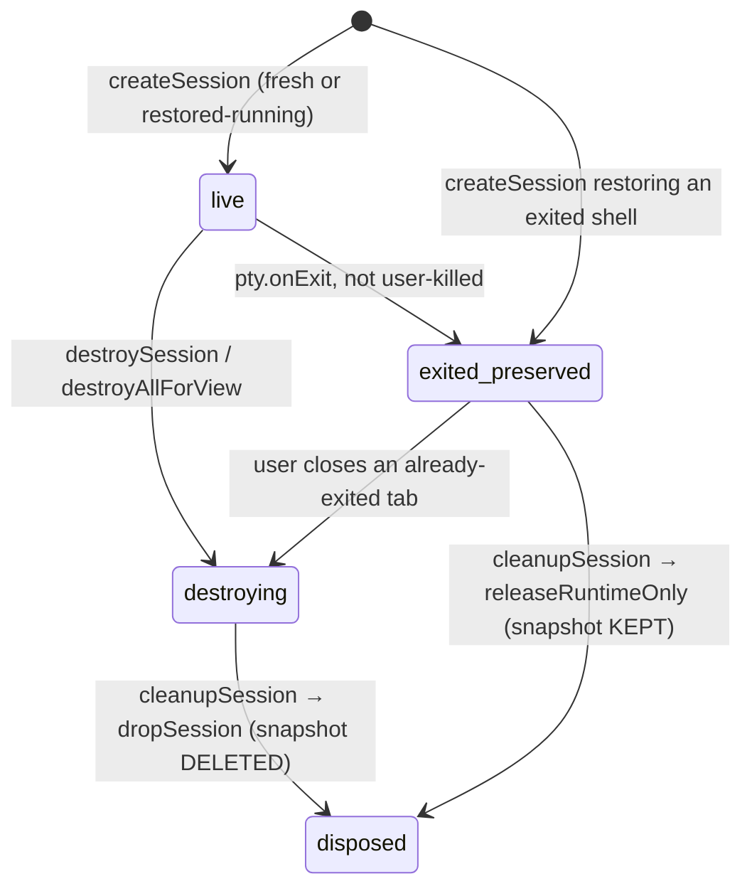
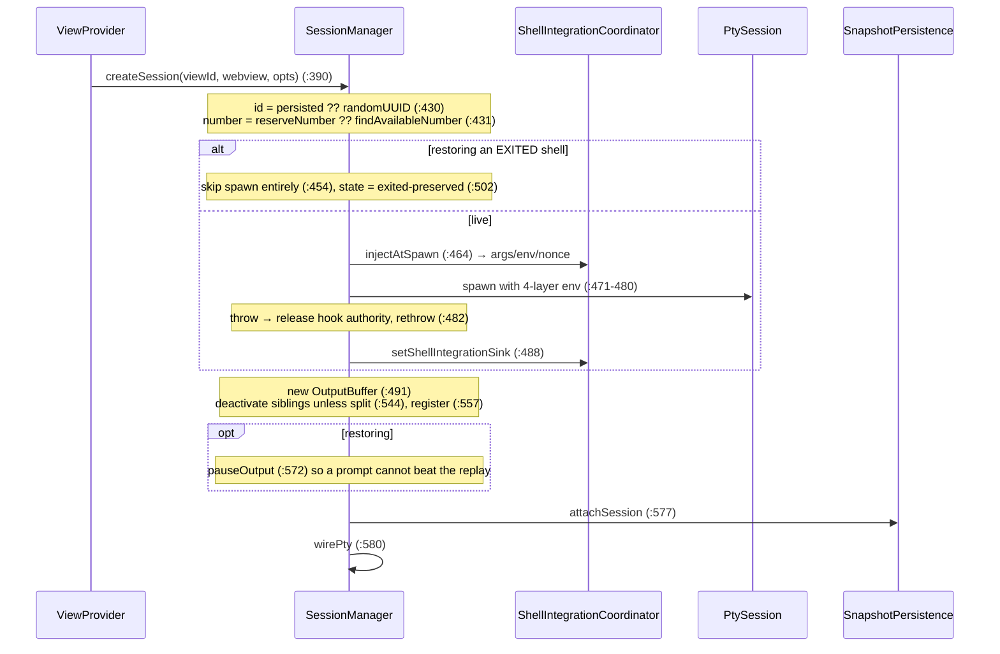
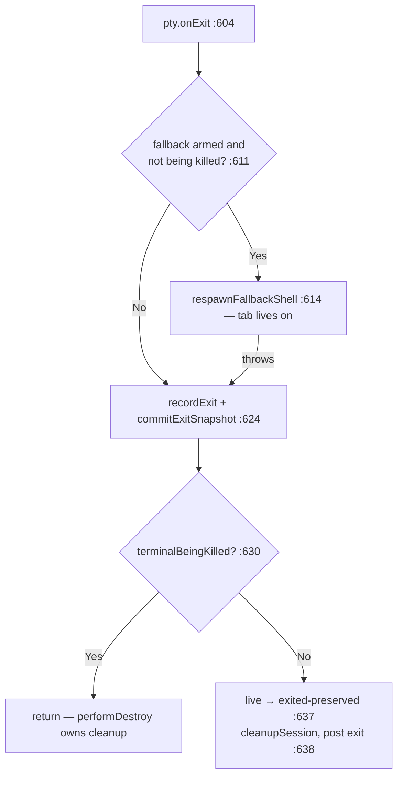
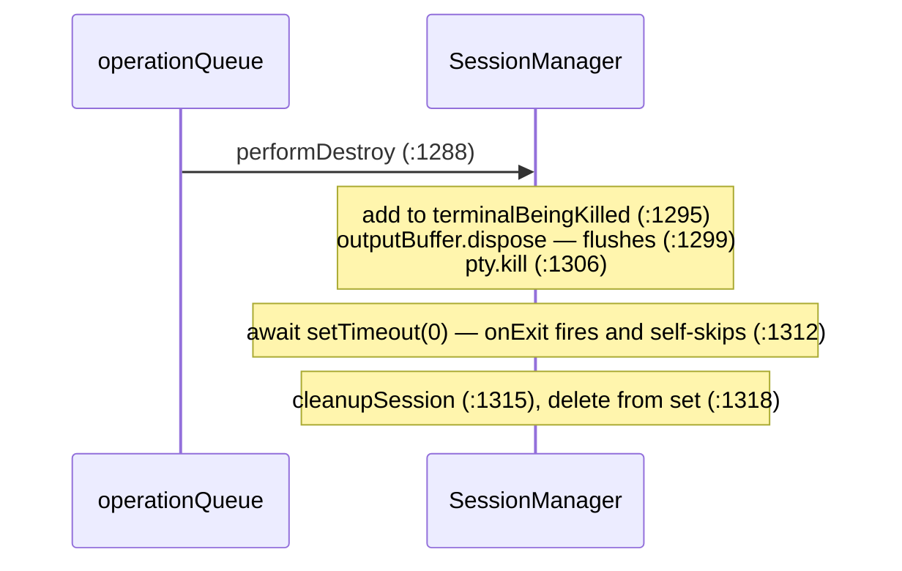
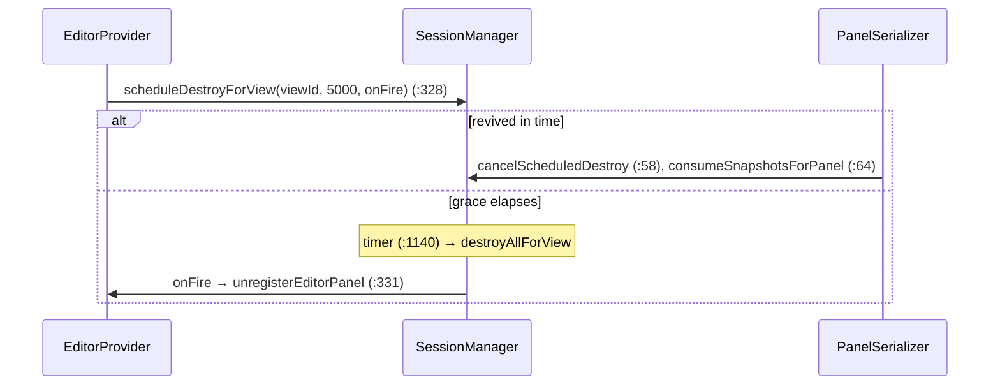
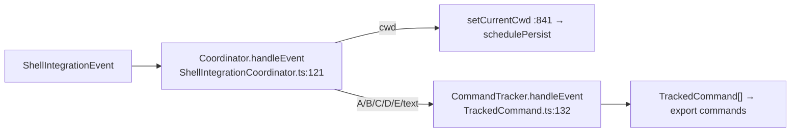
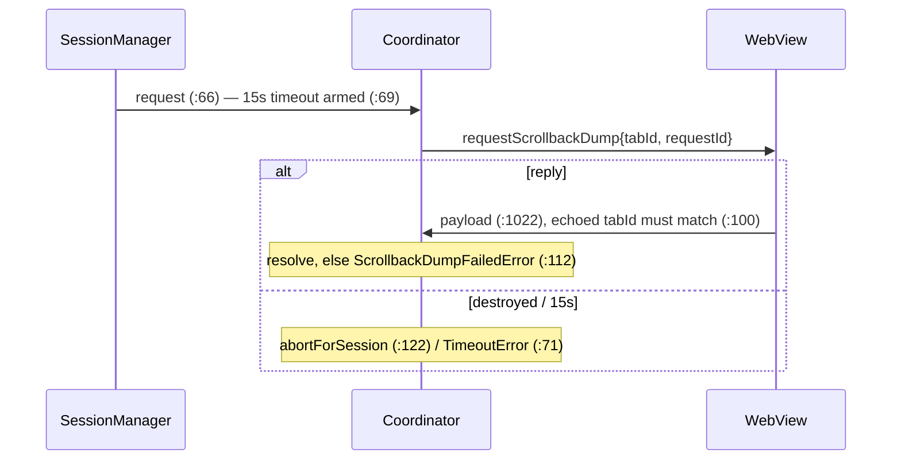
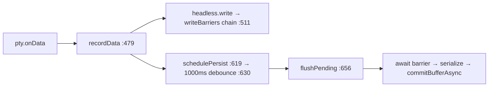
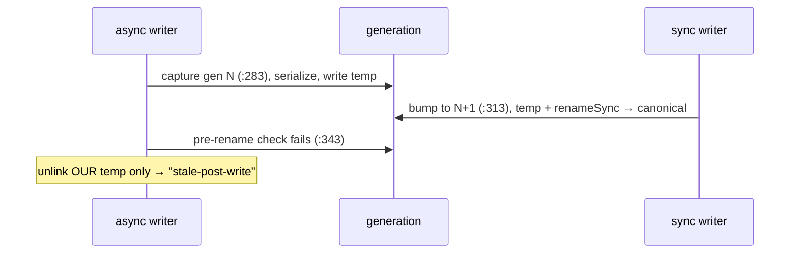

# Session Manager — Design

## 1. Purpose & Scope

`SessionManager` (`src/session/SessionManager.ts:116`) is the single registry of
every terminal session across every view — sidebar, panel, and each editor tab.
It owns session identity and lifecycle; everything else it delegates.

### Goals
- One place that knows which sessions exist, where they live, and their state
- Sessions outlive their webview — closing a view must never kill a shell
- Destructive operations serialized and race-free, including at shutdown
- Terminals survive a window restart with their scrollback intact
- Stay decomposed — the registry must not absorb persistence, integration, or IPC

### Constraints
- Shutdown may be cut short, so durability cannot depend on async work
- A snapshot holds raw terminal bytes — deleting one is a privacy action
- A root tab and its panes are one user-visible unit, preserved or dropped together
- Restore must reuse persisted session ids; the webview's saved layout references them

### Collaborators

```mermaid
graph LR
    SM["SessionManager<br>:116"]
    SM --> SP["SnapshotPersistence<br>cross-restart"] --> ST["SessionStorage<br>sidecar + buffers"]
    SP --> EV["sessionSnapshotEviction"]
    SM --> SIC["ShellIntegrationCoordinator"] --> CT["CommandTracker<br>TrackedCommand.ts:78"]
    SM --> SDC["ScrollbackDumpCoordinator"]
    SM --> EPR["EditorPanelRegistry"]
    SM --> CNR["CustomNameRegistry"]
    style SM fill:#345,stroke:#6af
```

### Non-Responsibilities

| Concern | Owner |
|---|---|
| node-pty, shell detection, OSC *parsing* | [pty-manager.md](pty-manager.md) |
| Output coalescing and flow control | [output-buffering.md](output-buffering.md) |
| WebView HTML and the `ready` handshake | [webview-provider.md](webview-provider.md) |
| xterm.js management | [xterm-integration.md](xterm-integration.md) |

---

## 2. Lifecycle State

`SessionState` (`TerminalSession.ts:46`) exists so every snapshot-touching
decision branches on a declared state, not on implicit set membership.

The distinction carries the persistence contract: `destroying` means *the user
wanted this gone*, so the snapshot is deleted; `exited-preserved` means the shell
ended on its own, so only the runtime mirror is released and the snapshot stays
for a read-only restore.

`transitionState` (`:1094`) accepts one expected state or a list (`:1099`), logs
on mismatch, and **never throws** — shutdown must not derail on a bad transition.
Both destroy entry points allow `live` or `exited-preserved` (`:1118`, `:1181`),
and the transition is recorded *synchronously* before the queue runs, so a
`dispose()` racing a queued destroy still sees the intent.

`TerminalSession` (`TerminalSession.ts:49`) carries seven groups of field:
identity, runtime handles, layout, cwd, respawn identity, scrollback, and
snapshot handles. `rootTabId` is the owning tab's id for a pane and **the
session's own id for a root tab** (`:522`) — removing every null check from group
eviction. Two constants live here: `SCROLLBACK_MAX_SIZE` 512 KB (`:61`) and
`DEFAULT_GRACE_DESTROY_MS` 5000 (`:64`).

---

## 3. Session Creation

Every field prefers the persisted snapshot over the caller's options — id
(`:430`), number (`:431`), shell and *its* args (`:436`–`:448`), cwd (`:450`),
geometry (`:515`), custom name (`:496`). Preserving the **id** is load-bearing:
the webview's split layout persists tab ids, so a new id orphans every pane.

Split panes do not deactivate siblings (`:544`), are excluded from the tab strip
(`:784`) but present in the full session list (`:813`), never carry a custom name
(`:496`), and inherit the owning tab's `rootTabId` (`:522`).

---

## 4. PTY Wiring & Fallback Respawn

`wirePty` (`:591`) is extracted so a replacement PTY can be re-wired onto the
same session; it reads `session.outputBuffer` live rather than capturing it, so a
buffer swap stays correct (`:594`). Each chunk fans out three ways — output
buffer (`:594`), scrollback cache (`:595`), snapshot mirror (`:596`).
Command-output capture is deliberately *not* here: the OSC parser emits ordered
events and the tracker drives capture from them, so a chunk shaped
`[output][OSC D]` cannot close a command before its output is recorded (`:597`).

The exit snapshot is committed **synchronously and before** cleanup (`:622`), so
the exit state is durable even if the window closes an instant later.

### Shell-fallback respawn

When a vault agent CLI owns a tab and quits on its own, the tab is handed a plain
shell instead of dying (`respawnFallbackShell`, `:654`). The ordering makes
failure recoverable: **base env only** so vault variables cannot leak into a
plain shell (`:664`), old integration cleanup and hook token released before new
ones are minted (`:667`, `:670`), all fallible work done before the session is
mutated (`:686`–`:694`), then buffer and PTY swapped atomically (`:700`–`:707`).

It then **flips the persisted identity** — shell, args, cwd, and clearing
`isAgentLaunch` (`:710`–`:713`) — and persists immediately (`:718`), so a later
reload restores *this shell* rather than resurrecting the agent the user already
quit. `shellFallbackArmed` is one-shot, cleared before the respawn (`:612`).

---

## 5. Destruction

### Serialization

Destructive operations chain onto one promise (`:130`) — serial execution
without blocking the event loop. `destroySession` (`:1111`) and
`destroyAllForView` (`:1170`) are queued; creation, writes, resizes, switches,
and acks are not, being safe concurrently.

`destroyAllForView` captures the doomed ids **synchronously** (`:1177`) so a
session created between enqueue and execution is not swept, then kills them in
parallel within one slot (`:1193`). `dispose()` (`:1212`) bypasses the queue and
walks every session inline (`:1233`) — an async drain would let PTYs outlive the
host.

### Kill tracking

`terminalBeingKilled` (`:127`) is a re-entrancy guard between `performDestroy`
and `onExit`, not a lock on `destroySession`: an intentional kill makes `onExit`
return early (`:630`), a natural exit finds the set empty and cleans up itself.

### cleanupSession

The single funnel (`:1324`): dispose disposables (`:1331`), release hook
authority (`:1341`), abort in-flight dumps (`:1345`), run the integration
temp-dir cleanup (`:1349`), then **branch on state** (`:1359`) — `destroying`
drops the snapshot, `exited-preserved` releases only the runtime, anything else
logs a contract violation and defaults to preserving. The session is tombstoned
`disposed` (`:1371`) before removal from the maps.

### Grace-period destroy

An editor panel's webview is destroyed and re-created on window reload, so
`onDidDispose` cannot mean "kill the PTY".

The live-panels entry is removed **only** on the real destroy
(`TerminalEditorProvider.ts:329`) — that is what lets a revive match its
snapshots. `getPendingDestroyViewIds` (`:1165`) exists so the serializer can
sweep orphaned timers when a panel revives without a persisted `panelId`
(`TerminalPanelSerializer.ts:50`).

---

## 6. Numbering, Routing, Scrollback

**Numbers.** `findAvailableNumber` (`:1392`) scans from 1 for the first free
number — gap-filling, unbounded, no cap. `reserveNumber` (`:1410`) takes the
persisted number when free, treating `preferred <= 0` as "no preference", which
is how orphan recovery (`SnapshotPersistence.ts:893`) enters normal allocation.
Released in `cleanupSession` (`:1375`). Split panes consume numbers too.

**View routing.** View ids come from the providers (`:1503`,
`TerminalEditorProvider.ts:171`). The `editor-` prefix is load-bearing — it
drives `panelId` derivation (`:533`) and snapshot view-location classification
(`SnapshotPersistence.ts:69`). Two listing methods serve different audiences:
`getTabsForView` (`:766`) feeds the tab strip, `getAllSessionsForView` (`:798`)
includes panes and feeds any reload or restore, because the webview must recreate
every xterm its saved layout references.

**Scrollback cache.** Distinct from both the output buffer and the snapshot
mirror: it lets a **re-created webview in the same host process** be repainted.
One entry per chunk, FIFO-evicted past `SCROLLBACK_MAX_SIZE` (`:1426`), read
joined (`:958`).

`clearScrollback` (`:918`) is a **privacy boundary**, not a visual clear: cache,
tracked commands, and the persisted snapshot go together, so a restart after
Cmd+K cannot resurrect the content through the buffer or the export quickpick.

Three distinct histories exist — the output buffer (milliseconds), this cache
(host process), and the snapshot mirror (across restarts). They are tabulated
side by side in [output-buffering.md](output-buffering.md) §6.

---

## 7. Shell Integration — Consumer Side

The producer half (injection, OSC parsing) is [pty-manager.md](pty-manager.md) §6.

The coordinator (`ShellIntegrationCoordinator.ts:32`) owns the per-session
cleanup map, resolves the session **lazily per event** so it survives transient
lookup races (`:77`), and supplies only runtime context — now, cwd, id factory —
leaving the state vocabulary to the tracker (`:130`).

**Cwd** has three sources, in call order: a live OS query (`getLiveCwd` `:864` —
works without shell integration, 500 ms cap, no Windows), the shell-integration
report (`:851`), the spawn-time value (`:836`). `extension.ts:670` uses that chain.

**Tracked commands.** `CommandTracker` (`TrackedCommand.ts:78`) keeps a closed
list plus one in-flight slot: `promptStart` abandons an unclosed command rather
than storing it (`:135`), `commandStart` is idempotent because both markers can
fire (`:138`), `commandLine` is accepted **only when the nonce validates**
(`:141`), `text` appends, and `commandEnd` closes and evicts (`:146`).

Caps: `MAX_OUTPUT_PER_COMMAND` 100 000 chars (`:50`),
`MAX_COMMANDS_PER_SESSION` 200 (`:53`), `MAX_TOTAL_OUTPUT_PER_SESSION`
1 000 000 chars (`:56`).

The per-command cap is enforced **at append time** (`:198`), not at close, so a
never-closing command cannot grow unbounded; the true count keeps rising past the
cap so the export UI can report how much was truncated (`:44`). A command with
neither command line nor output is discarded on close (`:235`) — otherwise every
prompt repaint would accumulate an empty entry.

Read through `:976` / `:988`, consumed by `src/commands/exportCommands.ts:84`,
`:94`. Tracked commands persist in the snapshot (`SessionSnapshot.ts:62`) and
rehydrate into a fresh tracker (`:540`), dropping anything in flight
(`TrackedCommand.ts:96`).

---

## 8. Scrollback Dump IPC

Exporting the *rendered* buffer needs data only xterm.js has, so the host asks the
webview; `ScrollbackDumpCoordinator` (`ScrollbackDumpCoordinator.ts:50`) owns the
request/reply/abort/timeout machine.

Three safeguards: dispose-time cancellation, the 15 s backstop (`:56`), and
sender authentication — a mismatched reply is ignored *without* settling the
promise, so the legitimate reply or the timeout still resolves it.

---

## 9. Cross-Restart Persistence

Owned by `SnapshotPersistence` (`SnapshotPersistence.ts:96`), gated on
`sessionRestore.enabled` (default true, `SettingsReader.ts:141`) **and** a
workspace `storageUri` — a no-folder window disables persistence rather than leak
snapshots into shared global storage (`extension.ts:51`–`:62`).

### Capture

The **write barrier** (`:118`) exists because xterm's `write` is asynchronous —
serializing before its callback fires would snapshot a half-parsed buffer. Async
flushes await it; the sync shutdown flush does not, accepting a bounded loss
window. The mirror freezes once the shell exits (`:485`).

Constants: `SNAPSHOT_PERSIST_DEBOUNCE_MS` 1000 (`:28`),
`SNAPSHOT_BUFFER_MAX_BYTES` 1 MB (`:25`), `SERIALIZE_OPTIONS.scrollback` and the
headless mirror both 1000 lines (`:22`, `:40`). Oversize buffers trim from the
head at an LF boundary (`:56`) — xterm tolerates a truncated escape at the start
of a write.

### Intentful commit API

Every snapshot-touching action names a **user intent**, never a cleanup gesture
(`:232`). This is what lets `cleanupSession` decide correctly from state alone.

| Intent | Sync? | Disk effect | Line |
|---|---|---|---|
| `commitLiveSnapshot` | async | Serialize + commit; index updated only on a real rename | `:252` |
| `commitExitSnapshot` | **sync** | Record exit, write buffer + sidecar immediately | `:302` |
| `commitClearSnapshot` | **sync** | Reset the mirror, write an empty buffer | `:339` |
| `dropSession` | sync | Dispose mirror, delete buffer + index entry | `:410` |
| `releaseRuntimeOnly` | sync | Dispose mirror only — never touches disk | `:454` |

### Transactional storage

`SessionStorage` (`SessionStorage.ts:52`) makes concurrent sync and async writers
safe with per-artifact generation counters.

All writes are temp-then-rename. Sync writers and drops bump the generation
*before* touching disk (`:313`, `:394`, `:376`); async writers check three times
— pre-write (`:333`), post-write (`:343`), post-rename (`:359`). The last check
unlinks the canonical file, deliberately surfacing a lost write as *missing*
rather than *stale*: **the privacy boundary outranks data preservation.**

Buffers (`:224`) and the index sidecar (`:239`) are mode `0o600` in a `0o700`
directory (`:48`, `:50`) — a persisted buffer holds raw ANSI including whatever
the shell echoed. **The sidecar is the single source of truth** (`:105`); a
one-time migration imports a legacy Memento index on activate (`:169`). Load
outcomes are three-way and the distinction matters: `valid` restores normally,
`missing` permits orphan recovery, `unsupported` (newer schema) discards the
whole set **without** it. A sieve buckets unknown keys from a newer build on load
(`SessionSnapshot.ts:121`) and spreads them back on write (`:145`), so a
downgrade round-trip does not drop them.

### Eviction

`evictIndex` (`sessionSnapshotEviction.ts:33`) operates on **root-tab groups**,
never individual entries — partial eviction would orphan leaves in the webview's
saved layout.

Three caps, each group-scoped: `SNAPSHOT_MAX_AGE_MS` 7 days — newest member
older than the cap drops the group (`:24`, `:63`); `SNAPSHOT_MAX_BUFFER_BYTES`
1 MB — any member over drops the group (`:25`, `:59`); `SNAPSHOT_MAX_COUNT` 20 —
groups admitted whole, newest-first, until the budget is exhausted (`:26`, `:83`).

### Hydrate and consume

`hydrateFromSnapshots` (`:798`) runs from `extension.ts:104`, **before any view
provider is registered** and after the live-panels record, because its orphan step
depends on it: classify (`:811`), evict (`:847`), read buffers and drop entries
whose file vanished (`:853`), recover orphans by mapping them back to an owning
editor panel (`:868`–`:911`), unlink everything unreferenced plus crash-leftover
temps (`:917`, `:927`), then stage (`:930`).

Providers drain what was staged on their `ready` handshake (`:328`, `:332`,
`:336`), feeding each back as a restore — full sequence in
[flow-view-lifecycle.md](flow-view-lifecycle.md) §5.

### Shutdown

`deactivate` (`extension.ts:840`) runs three ordered steps, and the order *is*
the design: **synchronous** buffer + sidecar writes first (`:295`) because they
survive the host being killed mid-shutdown; then the awaited index flush (`:303`),
which VS Code often cancels — degraded but correct, since step one's sidecar is
authoritative; then PTY teardown (`:1212`). `CursorHookController.dispose` runs
before all three (`extension.ts:847`).

---

## 10. Editor Panels, Names, Hook Authority

`EditorPanelRegistry` (`EditorPanelRegistry.ts:11`) maps `panelId` to its session
ids, persisted through an `onChange` that writes only when restore is enabled
(`:194`). Unregistered only on a *real* destroy, and queried by hydrate's orphan
fallback (`:78`).

`CustomNameRegistry` (`CustomNameRegistry.ts:30`) is keyed by **terminal number,
not session id**, so `Terminal 2` keeps its label when recreated. Names cap at 80
chars (`:10`) under `anywhereTerminal.tabCustomNames` (`:13`); empty normalizes
back to the auto-name (`:63`). The in-memory map is authoritative with a
fire-and-forget snapshot (`:91`) — load-modify-save would let two concurrent
renames overwrite each other (`:5`). `renameSession` (`:889`) is the single entry
point for every rename UX and no-ops on unknown ids **and on split panes**.

**Cursor-hook authority** is an optional per-session env contributor merged last
into every live PTY incarnation (`:477`, `:681`), so each gets fresh renewable
authority. Release (`:1435`) drops the token *and* revokes the webview's badge.
Swapping contributors releases every tracked session through the *old* one first
(`:253`), so a token minted while attached cannot go live later by re-attaching.

---

## 11. Boundaries & Decisions

- **Sessions belong to the host, not the webview.** Every recovery path in this
  document follows from that one choice.
- **Intent is recorded synchronously; work happens asynchronously.** State
  transitions land before the queue runs, so a shutdown racing a queued destroy
  still resolves the snapshot correctly.
- **Durability is synchronous where it counts.** Exit and clear commits, and the
  first shutdown step, are sync — anything awaited may simply never run.
- **Deleting a snapshot is a privacy action.** `clearScrollback` wipes cache,
  tracked commands, and disk together; a lost async write unlinks the canonical
  file rather than leaving stale bytes behind.
- **Groups, not entries.** Eviction, restore, and layout all treat a root tab
  plus its panes as one unit via `rootTabId`.
- **The registry stays a registry.** Persistence, shell integration, dumps,
  panel tracking, and naming each live in their own file. New responsibilities
  belong in a collaborator, not in `SessionManager`.

### Public surface

Grouped by concern, all on `SessionManager.ts`: **core** CRUD (`:390`, `:724`,
`:733`, `:745`, `:889`, `:918`, `:930`); **view** queries (`:766`, `:798`,
`:942`, `:958`, `:1058`, `:1072`); **cwd** (`:836`–`:864`); **export** (`:976`,
`:988`, `:1008`); **destroy** (`:1111`, `:1170`, `:1135`, `:1155`, `:1212`);
**restore** pass-throughs (`:227`–`:347`); **panel and hook** wiring (`:352`–
`:369`, `:253`). It is deliberately **not** in `context.subscriptions` —
`deactivate` orchestrates teardown so the flush order holds (`extension.ts:816`).

### Files

`src/session/` is 31 files. Load-bearing by size: `SessionManager.ts` (1462),
`SnapshotPersistence.ts` (1034), `SessionStorage.ts` (534), `OutputBuffer.ts`
(338, see [output-buffering.md](output-buffering.md)), `TrackedCommand.ts` (292);
the rest are small single-purpose collaborators, none over 180 lines. Dependents:
`TerminalViewProvider`, `TerminalEditorProvider` / `TerminalPanelSerializer`,
`src/commands/exportCommands.ts`, `src/extension.ts`.
