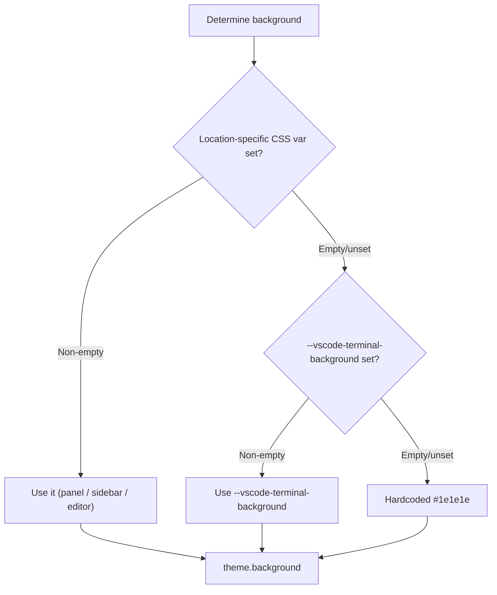
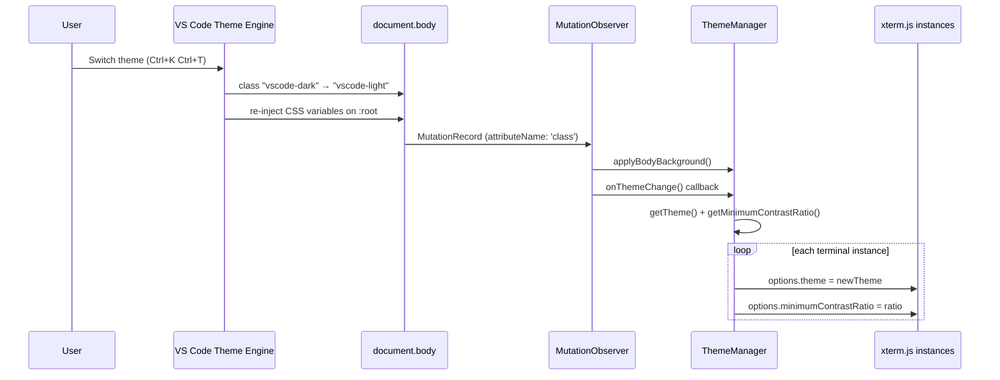
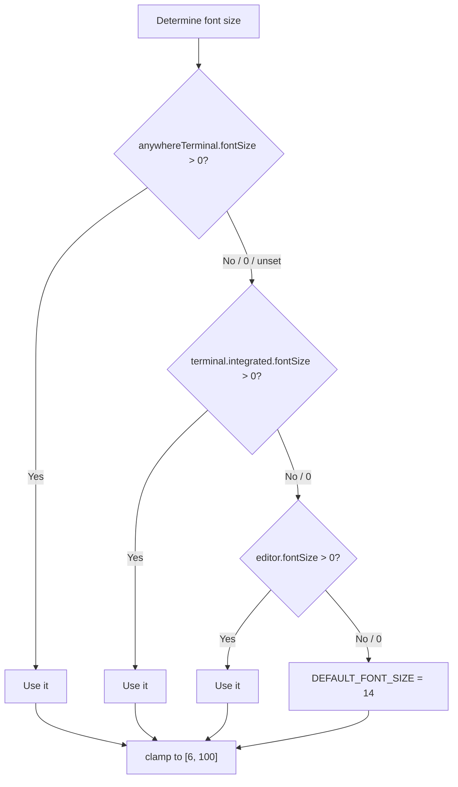
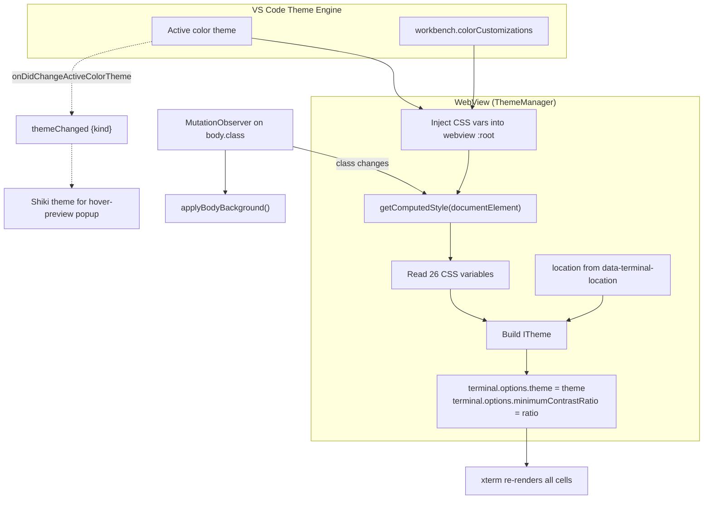
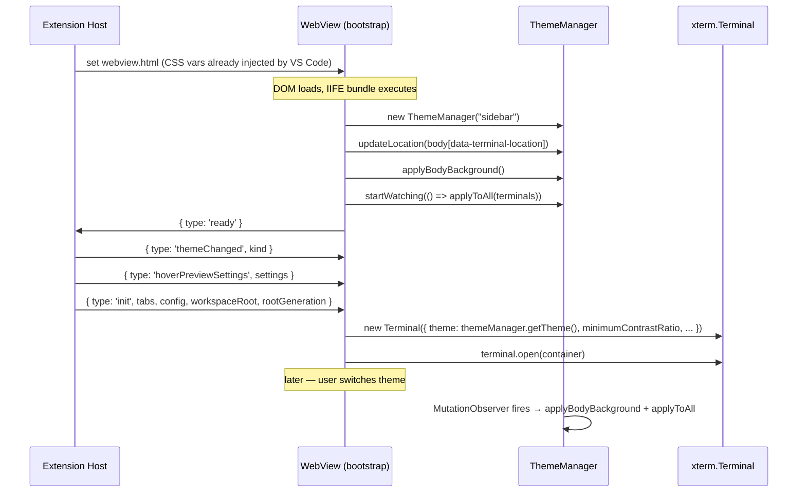

# Theme Integration — Detailed Design

## 1. Overview

AnyWhere Terminal renders xterm.js inside VS Code webviews. VS Code's theme engine injects CSS custom properties into the webview's `:root`, reflecting the active color theme. **ThemeManager** reads these variables at runtime with `getComputedStyle()`, builds an xterm.js `ITheme`, and applies it to every terminal instance.

There are two independent theme channels:

| Channel | Mechanism | Consumer | Owner |
|---|---|---|---|
| **CSS variables** | `getComputedStyle(document.documentElement)` + `MutationObserver` on `body.class` | xterm terminal colors, panel chrome | `src/webview/theme/ThemeManager.ts` |
| **`themeChanged` IPC** | Host `onDidChangeActiveColorTheme` → `{type:'themeChanged', kind}` | Shiki syntax highlighting inside the hover-preview popup | `main.ts:79`, `providers/TerminalViewProvider.ts:38` |

The second channel exists because Shiki needs a *named theme kind*, not a set of colors. See §6.

### Goals and constraints

- **Read the live cascade, never a snapshot.** VS Code rewrites the CSS variables in place on a theme switch, so every value is resolved on demand from `getComputedStyle()` rather than cached at construction.
- **Detect the switch without an IPC round-trip.** VS Code re-stamps `document.body`'s class list; a `MutationObserver` on that attribute is the fastest available signal, so terminal colours update before the host could notify us.
- **Degrade to a readable terminal, never a blank one.** Every mapped colour has a literal fallback, so a theme that omits a variable still produces a usable `ITheme`.
- **`ThemeManager` owns no terminals.** `applyToAll()` takes an iterable from the caller, keeping it decoupled from `WebviewStateStore`.

### Reference Sources
- VS Code: `xtermTerminal.ts` (theme building), `terminalColorRegistry.ts` (CSS variable definitions), `terminalInstance.ts` (font resolution)
- xterm.js `ITheme` interface

---

## 2. CSS Variable Mapping

Canonical implementation: `ThemeManager.getTheme()` — `src/webview/theme/ThemeManager.ts:47-99`.

### 2.1 ANSI Color Mapping

| CSS Variable | `ITheme` Property | ANSI | Cite |
|---|---|---|---|
| `--vscode-terminal-ansiBlack` | `black` | 0 | `ThemeManager.ts:68` |
| `--vscode-terminal-ansiRed` | `red` | 1 | `:69` |
| `--vscode-terminal-ansiGreen` | `green` | 2 | `:70` |
| `--vscode-terminal-ansiYellow` | `yellow` | 3 | `:71` |
| `--vscode-terminal-ansiBlue` | `blue` | 4 | `:72` |
| `--vscode-terminal-ansiMagenta` | `magenta` | 5 | `:73` |
| `--vscode-terminal-ansiCyan` | `cyan` | 6 | `:74` |
| `--vscode-terminal-ansiWhite` | `white` | 7 | `:75` |
| `--vscode-terminal-ansiBrightBlack` | `brightBlack` | 8 | `:78` |
| `--vscode-terminal-ansiBrightRed` | `brightRed` | 9 | `:79` |
| `--vscode-terminal-ansiBrightGreen` | `brightGreen` | 10 | `:80` |
| `--vscode-terminal-ansiBrightYellow` | `brightYellow` | 11 | `:81` |
| `--vscode-terminal-ansiBrightBlue` | `brightBlue` | 12 | `:82` |
| `--vscode-terminal-ansiBrightMagenta` | `brightMagenta` | 13 | `:83` |
| `--vscode-terminal-ansiBrightCyan` | `brightCyan` | 14 | `:84` |
| `--vscode-terminal-ansiBrightWhite` | `brightWhite` | 15 | `:85` |

### 2.2 Special Colors

| CSS Variable | `ITheme` Property | Cite |
|---|---|---|
| location-specific (see §3) → `--vscode-terminal-background` → `#1e1e1e` | `background` | `ThemeManager.ts:54` |
| `--vscode-terminal-foreground` → `--vscode-editor-foreground` → `#cccccc` | `foreground` | `:56` |
| `--vscode-terminalCursor-foreground` | `cursor` | `:61` |
| `--vscode-terminalCursor-background` | `cursorAccent` | `:62` |
| `--vscode-terminal-selectionBackground` | `selectionBackground` | `:63` |
| `--vscode-terminal-selectionForeground` | `selectionForeground` | `:64` |
| `--vscode-terminal-inactiveSelectionBackground` | `selectionInactiveBackground` | `:65` |

> The cursor variables use `terminalCursor` (no hyphen before "Cursor"), not `terminal-cursor` — a VS Code naming quirk.

### 2.3 Scrollbar and Overview Ruler

The scrollbar is **not hidden**. xterm v6 renders a Monaco-style `SmoothScrollableElement` that auto-shows on hover/scroll; the theme feeds it VS Code's real slider colors so it matches the file-tree list scrollbar exactly.

| `ITheme` Property | Value | Cite |
|---|---|---|
| `overviewRulerBorder` | `"transparent"` — hides the decoration-lane border | `ThemeManager.ts:89` |
| `scrollbarSliderBackground` | `--vscode-scrollbarSlider-background` | `:95` |
| `scrollbarSliderHoverBackground` | `--vscode-scrollbarSlider-hoverBackground` | `:96` |
| `scrollbarSliderActiveBackground` | `--vscode-scrollbarSlider-activeBackground` | `:97` |

> These are resolved to **concrete values** via `getComputedStyle` rather than passed as `var(...)`: xterm v6 inlines the slider colours into a runtime `<style>` tag and runs them through `parseColor`, which does not understand `var()` (`ThemeManager.ts:91-94`).

The overview-ruler **lane** (the colored decoration strip on the right edge, distinct from the scrollbar) is hidden in CSS instead: `.xterm .xterm-decoration-overview-ruler { opacity: 0 !important; pointer-events: none !important; }` (`providers/webviewHtml.ts:674-677`).

`overviewRuler.width` is **10**, not 1 — in xterm v6 it also drives the vertical scrollbar width, and 10 px matches Monaco's default (`terminal/TerminalFactory.ts:227-231,247`).

---

## 3. Location-Aware Background Color

### Problem

VS Code's built-in terminal uses a different background depending on where it renders (`TerminalInstanceColorProvider` upstream). Many themes never set `--vscode-terminal-background`, so a terminal that used only that variable would show a mismatched block inside its container.

### Resolution Chain



### Location-to-Variable Mapping

`LOCATION_BACKGROUND_MAP` — `ThemeManager.ts:18-22`:

| `TerminalLocation` | CSS Variable |
|---|---|
| `panel` | `--vscode-panel-background` |
| `sidebar` (primary **and** secondary) | `--vscode-sideBar-background` |
| `editor` | `--vscode-editor-background` |

### Where the location comes from

The location is **the extension's decision**, never inferred in the webview:

1. The host generates the HTML with `<body data-terminal-location="${location}">` — `providers/webviewHtml.ts:680`. `getTerminalHtml()` takes `location: "sidebar" | "panel" | "editor"` as a parameter (`webviewHtml.ts:40-44`).
2. `bootstrap()` reads that attribute once and calls `themeManager.updateLocation(...)`, then `applyBodyBackground()` (`main.ts:1050-1054`).
3. `ThemeManager` is constructed with `"sidebar"` as the pre-bootstrap default (`main.ts:94`, `ThemeManager.ts:39`).

`ResizeCoordinator` explicitly does **not** re-infer location from container aspect ratio — its class doc says so (`resize/ResizeCoordinator.ts:44-47`). Any earlier `inferLocationFromSize()` heuristic is gone.

`updateLocation()` returns `true` only when the value actually changed, and re-applies the body background as a side effect (`ThemeManager.ts:136-143`).

---

## 4. Theme Change Detection

### Mechanism

VS Code signals theme changes by toggling a class on `document.body`:

| Body Class | Theme Kind |
|---|---|
| `vscode-dark` | Dark |
| `vscode-light` | Light |
| `vscode-high-contrast` | High contrast dark |
| `vscode-high-contrast-light` | High contrast light |

When the user switches themes, VS Code updates the body class **and** re-injects all CSS variables on `:root`. `ThemeManager.startWatching()` watches for the class mutation.

### Detection Flow



### MutationObserver Setup

`ThemeManager.startWatching()` — `ThemeManager.ts:150-169`. A `MutationObserver` filtered to `class` attribute changes on `document.body`. It is idempotent (a second call short-circuits on the existing observer), re-applies the body background itself, then invokes the caller's callback once per mutation batch.

`main.ts:1337-1339` wires the callback to `themeManager.applyToAll(store.terminals.values())`.

### Edge Cases

1. **Rapid theme switching** — each callback re-reads synchronously via `getComputedStyle`; no debounce is needed, later applications simply overwrite earlier ones.
2. **Partial themes** — an unset variable makes `getPropertyValue()` return `""`, which the `get()` helper maps to `undefined` (`ThemeManager.ts:49-52`). xterm falls back to its own defaults for those slots. Only `background` and `foreground` have hardcoded final fallbacks.
3. **`workbench.colorCustomizations`** — reflected in the CSS variables, so it is picked up automatically.
4. **`applyBodyBackground()` no-ops on an empty value** — it only assigns when the resolved colour is non-empty (`ThemeManager.ts:127-129`).

---

## 5. Font Resolution

Font values are resolved on the **extension host**, not from CSS variables, because `terminal.integrated.fontSize` and `editor.fontSize` are not exposed to webviews. Canonical implementation: `src/settings/SettingsReader.ts`.

### Font Size Chain



| Constant | Value | Cite |
|---|---|---|
| `FONT_SIZE_MIN` | 6 | `settings/SettingsReader.ts:13` |
| `FONT_SIZE_MAX` | 100 | `SettingsReader.ts:16` |
| `DEFAULT_FONT_SIZE` | 14 | `SettingsReader.ts:19` |
| `DEFAULT_SCROLLBACK` | 10000 | `SettingsReader.ts:22` |
| `DEFAULT_FONT_FAMILY` | `"monospace"` | `SettingsReader.ts:25` |

`resolveFontSize()` — `SettingsReader.ts:156-172`; `clampFontSize()` — `:259-261`.

### Font Family Chain

`resolveFontFamily()` — `SettingsReader.ts:178-193`. Each candidate is `.trim()`-tested, so a whitespace-only setting falls through: `anywhereTerminal.fontFamily` → `terminal.integrated.fontFamily` → `editor.fontFamily` → `"monospace"`.

### Delivery to the webview

`readTerminalConfig()` (`SettingsReader.ts:101-120`) produces the `TerminalConfig` embedded in `init` and `configUpdate`. `affectsTerminalConfig()` (`:126-134`) decides when to re-post it — it fires for the whole `anywhereTerminal` section plus the four inherited font keys.

`TerminalFactory` applies a second, webview-local fallback: an empty `config.fontFamily` resolves to `--vscode-editor-font-family`, and finally the literal `"monospace"` (`terminal/TerminalFactory.ts:153-157,232`). A `fontSize` of 0 means "inherit" and falls back to 14 (`TerminalFactory.ts:585`).

---

## 6. Shiki Theme Kind (`themeChanged`)

The hover-preview popup renders code with Shiki, which needs a discrete theme identity rather than a colour set.

| Step | Detail | Cite |
|---|---|---|
| Host maps `vscode.ColorThemeKind` → 4-way union | `Light→"light"`, `Dark→"dark"`, `HighContrastLight→"hc-light"`, `HighContrast→"hc-dark"`, default `"dark"` | `providers/TerminalViewProvider.ts:38-53` |
| Initial post | on `ready`, alongside `hoverPreviewSettings` | `TerminalViewProvider.ts:1301-1313`, `TerminalEditorProvider.ts:768-778` |
| Live updates | `vscode.window.onDidChangeActiveColorTheme`, gated on `_ready` | `TerminalViewProvider.ts:175-186`, `TerminalEditorProvider.ts:274-284` |
| Webview store | `themeStore.kind`, defaulting to `"dark"` until the first message | `main.ts:79`, `main.ts:652-654` |
| Consumer | `TerminalFactory` reads it per render via `getHoverPreviewTheme()` | `TerminalFactory.ts:43,264-265` |

Message shape: `ThemeChangedMessage` — `src/types/messages.ts:929-937`.

### Adjacent: hover-preview settings

`HoverPreviewSettings { delay, blockSensitive }` (`types/messages.ts:939-945`) travels the same route. Defaults mirror `contributes.configuration`: `delay: 300`, `blockSensitive: true` (`providers/hoverPreviewSettings.ts:17-20`, `package.json:134-146`; webview default at `main.ts:86-88`).

`blockSensitive` is read with `cfg.inspect()` and takes **only** `globalValue ?? defaultValue` — a hostile workspace `.vscode/settings.json` must not be able to disable the trust policy (`hoverPreviewSettings.ts:42-50`). `delay` is a benign UX preference and is clamped to `[100, 2000]` (`hoverPreviewSettings.ts:23-28`).

---

## 7. Theme Application Pipeline



---

## 8. Initialization Sequence



> `bootstrap()` calls `startWatching` **before** posting `ready` (`main.ts:1337-1340`), so no theme change can be missed between mount and init.

---

## 9. ThemeManager API

`ThemeManager` is a concrete class. It does **not** track terminals — `applyToAll()` takes an iterable from the caller, which keeps it decoupled from `WebviewStateStore`.

```typescript
type TerminalLocation = "panel" | "sidebar" | "editor";           // ThemeManager.ts:13

class ThemeManager {
  constructor(initialLocation: TerminalLocation = "sidebar");     // :39
  getTheme(): Record<string, string | undefined>;                 // :47
  getMinimumContrastRatio(): number;                              // :105
  applyToAll(terminals: Iterable<{ terminal: Terminal }>): void;  // :113
  applyBodyBackground(): void;                                    // :123
  updateLocation(location: TerminalLocation): boolean;            // :136
  startWatching(onThemeChange: () => void): void;                 // :150
  dispose(): void;                                                // :172
}
```

### High-Contrast Support

`isHighContrastTheme()` checks for `vscode-high-contrast` or `vscode-high-contrast-light` on `document.body` (`ThemeManager.ts:183-188`).

| Theme kind | `minimumContrastRatio` | Standard |
|---|---|---|
| High contrast (either) | **7** | WCAG AAA |
| Everything else | **4.5** | WCAG AA |

`applyToAll()` re-applies both `theme` and `minimumContrastRatio`, so a switch into or out of a high-contrast theme updates the ratio too (`ThemeManager.ts:113-120`).

---

## 10. File Locations

| File | Role |
|---|---|
| `src/webview/theme/ThemeManager.ts` | CSS variables → `ITheme`, MutationObserver watching |
| `src/settings/SettingsReader.ts` | Host-side font / scrollback / shell / cwd resolution |
| `src/providers/hoverPreviewSettings.ts` | Host-side hover-preview settings snapshot |
| `src/providers/webviewHtml.ts` | `data-terminal-location`, overview-ruler CSS override |

### Dependencies
- `@xterm/xterm` — `Terminal` type
- Browser APIs — `getComputedStyle`, `MutationObserver`

### Dependents
- `main.ts` — constructs `ThemeManager`, calls `updateLocation`, `applyBodyBackground`, `startWatching`, `applyToAll`
- `TerminalFactory` — reads `getTheme()` and `getMinimumContrastRatio()` at terminal creation

---

## 11. Boundaries

`ThemeManager` maps colours and contrast ratio only. It does **not** own font resolution (host-side `SettingsReader`, mirrored into xterm options by `TerminalFactory`), the Shiki theme kind (a separate IPC channel, §6), or panel chrome styling (plain CSS variables in the inlined stylesheets, `webview-provider.md` §4.3).

Deliberate non-goals: no user-facing terminal colour-override settings, no theme caching, and no per-terminal theme — one theme applies to every instance in the webview.

