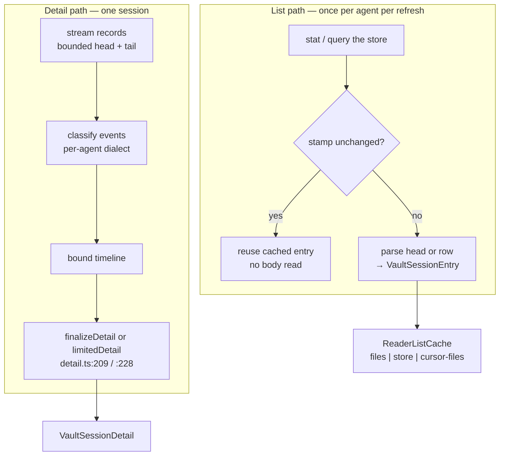
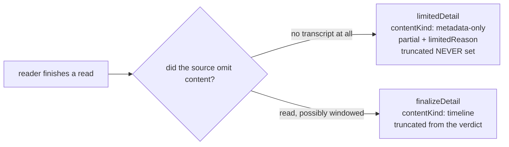
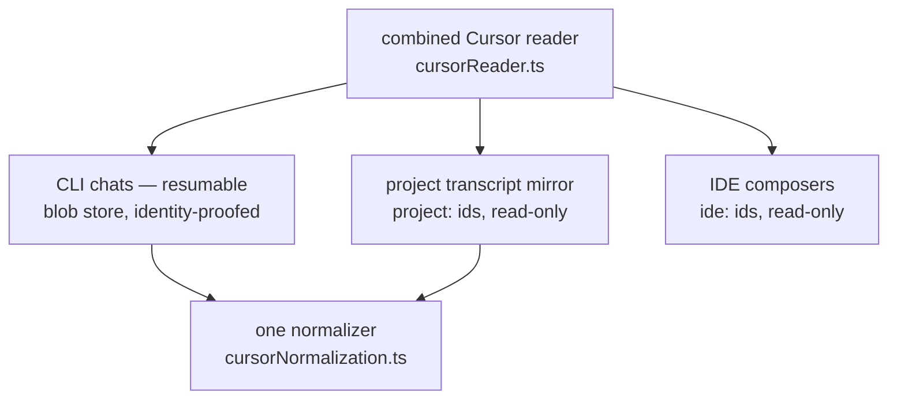

# AI Vault Readers Design

> **Scope**: `src/vault/readers/` — the parsers that turn four unrelated on-disk formats
> into the one contract defined in [vault.md](vault.md) § 3. The host that consumes them
> is [vault.md](vault.md).

Four agent CLIs write their history in four dialects, at four levels of structure, with
four notions of what a "session" contains. This layer is where that ends. Everything above
it sees one entry shape and one detail shape.

## 1. Goals and Constraints

**Goals** — one contract per agent, not one code path per agent; a shared pipeline that owns
every bound and every completeness verdict; per-agent code confined to *reading the format*.

**Constraints**

| Constraint | Consequence |
|-----------|-------------|
| Files belong to another program, being written while we read | reads are bounded and tolerant; we never lock, never write a transcript |
| A session can be gigabytes | head+tail windows with an explicit gap, never a full parse (§ 4.2) |
| Formats are undocumented and change | shape checks and version guards; an unrecognised shape degrades, never guesses (§ 8) |
| The caller must know what it did not get | completeness is a verdict from one constructor pair, not a per-reader flag (§ 4.3) |
| Refreshes are frequent | unchanged files must cost a `stat`, not a parse (§ 3.3) |
| Store content is untrusted | every emitted string capped; ids validated before use |

## 2. Overview



The two paths share the store roots and the freshness stamps, and nothing else. A list
refresh never opens a transcript body; a detail read never touches the cache.

## 3. The Reader Contract

### 3.1 Capabilities

Each agent supplies one adapter (registered `VaultService.ts:187-252`; typed
`VaultAgentAdapter.ts:29`): `list`, `detail`, `entry` (point lookup **without** a full list),
`record` (one message locator → its stored line), plus store and session watch targets.
`renameNative` is optional and present only where the agent owns a title field. Readers run
concurrently under `Promise.allSettled`, so none may assume exclusive access.

### 3.2 Store roots

| Agent | Root | Cited |
|-------|------|-------|
| claude | `$CLAUDE_CONFIG_DIR` else `~/.claude`, sessions under `projects/<encoded-cwd>/` | `claudePaths.ts:43` |
| codex | `$CODEX_HOME` else `~/.codex`; `$CODEX_SQLITE_HOME` may relocate the DB alone | `codexReader.ts:463,472` |
| opencode | XDG data dir — the **same** resolution on every OS, Windows included | `opencodeReader.ts:181` |
| cursor CLI | `~/.cursor/chats/<workspace-bucket>/<chat-id>/` | `cursorPaths.ts:64` |
| cursor mirror | `~/.cursor/projects/<bucket>/agent-transcripts/` | `cursorTranscript.ts:72,198` |
| cursor IDE | platform `state.vscdb` under the Cursor user directory | `cursorIdeReader.ts:56` |

Claude's project directory name is a **lossy** encoding of the cwd (`-` ⇄ `/`), so the
decode is treated as a display hint only (`claudePaths.ts:29`) and every resolved path is
containment-checked under the projects directory (`:61,100,140`), with ids passing
`isSafeSessionId` (`:51`).

### 3.3 Incremental freshness

| Variant | Stamp | Agents |
|---------|-------|--------|
| `files` | per-path `(mtimeMs, size)` | claude, codex JSONL fallback |
| `store` | the `.db` **and** its `-wal`, deliberately not `-shm` | codex, opencode |
| `cursor-files` | per-chat-id location + IDE source stamps, all LRU-capped | cursor |

Defined `cacheTypes.ts:13,38-41,131`. Only entries that were actually *listed* are cached —
a Claude team-member or content-less transcript is excluded from both
(`claudeReader.ts:425-433`) — so a cache hit is always safe to push without re-validation.

## 4. The Shared Pipeline

Everything below this line is agent-independent and lives in `readers/detail.ts`.

### 4.1 Bounds

| Constant | Value | Line |
|----------|-------|------|
| `MAX_TIMELINE_ITEMS` | 400 | `detail.ts:23` |
| `MAX_DETAIL_LIMIT` | 5000 | `:26` |
| `DETAIL_HEAD_RECORDS` / `DETAIL_TAIL_RECORDS` | 100 / 4000 | `:29` / `:32` |
| `MAX_MESSAGE_TEXT` / `MAX_DETAIL_TEXT` | 2000 / 600 | `:21` / `:15` |
| `MAX_ACTIVITY_STEPS` | 12 | `:17` |

`clampDetailLimit` (`:40`) is the single place a caller-supplied limit is bounded.

### 4.2 Head, tail, and the honest gap

A bounded buffer keeps the session's opening (head array) and its most recent activity
(O(1) ring tail). When the middle is dropped it emits one sentinel record that becomes a
`gap` timeline item (`detail.ts:55,116`) — the omission is *shown*, never silently closed
over. Claude's streamer fires its record callback **before** buffering (`claudeRecords.ts:182`),
so side-collectors (team identity, spawn ids) still observe records the buffer discards.

### 4.3 One verdict, one constructor pair



`sourceVerdict` (`detail.ts:198`) turns "was content omitted" into a value; `finalizeDetail`
(`:209`) writes the verdict fields **after** spreading the reader's parts, so precedence —
not type discipline — makes the verdict authoritative and a reader cannot override it by
accident. `limitedDetail` (`:228`) takes no parts at all, which is why `truncated` can never
appear on a metadata-only detail.

This is the mechanism behind the `truncated` ≠ `partial` rule in [vault.md](vault.md) § 3.2.
Before it existed, six readers set three fields independently and drifted.

### 4.4 Shared text hygiene

| Concern | Rule | Line |
|---------|------|------|
| System-reminder blocks | removed by index scan; an **unclosed** block is left intact rather than eating the rest of the message | `detail.ts:356` |
| Prompt wrappers | anchored `startsWith`, never `includes`, so a quoted tag in prose is not stripped | `:396` |
| Rich text | normalized then capped, preserving markdown structure | `:253,267` |
| Titles | whitespace collapsed, capped at 120 | `preview.ts:9,11` |

### 4.5 Claude-style event classification

`classifyClaudeStyleEvents` (`detail.ts:617`) is shared by the Claude reader and its child
readers. The rules that are easy to get wrong, and are therefore centralised: sidechain
records are skipped unless the caller opts in (subagent details do); meta records and
non-user/assistant records are skipped; a workflow tool call is suppressed as an activity
step because the board item already represents it (`:799`); subagent count takes the max of
spawn calls and discovered stubs (`:854`) because neither source alone is complete; token
count sums output plus last context, and only when usage was actually seen (`:855`).

## 5. Claude

### 5.1 Layout

| Path under `projects/<encoded-cwd>/` | Holds |
|--------------------------------------|-------|
| `<sessionId>.jsonl` | the session |
| `<sessionId>/subagents/<stem>.jsonl` + `.meta.json` | a subagent transcript and its `agentType` / `description` / `toolUseId` |
| `<sessionId>/workflows/<wfId>.json` | a workflow manifest |
| `<sessionId>/subagents/workflows/<wfId>/agent-*.jsonl` | per-workflow-agent transcripts |

A session record is one JSON object per line, e.g.

```jsonl
{"type":"user","uuid":"…","message":{"role":"user","content":"…"}}
{"type":"assistant","uuid":"…","message":{"role":"assistant","content":[…],"usage":{…}}}
```

Ground truth for every shape here is `src/vault/__fixtures__/claude*` (§ 9).

### 5.2 Late-written fields

Claude appends title, model and permission metadata **as the session evolves**, so the head
of the file is not enough. The reader scans a 256 KB tail window
(`TAIL_SCAN_BYTES`, `claudeRecords.ts:89`) — a size chosen by measurement, recorded in that
constant's own comment: over 120 local transcripts, 64 KB reached the last `permissionMode`
in 90 of the 109 that record one, 256 KB in 104. Within the window the rule is **last wins,
and an empty value clears** (`:104`).

Title precedence is `customTitle → aiTitle → lastPrompt → head title → ""`
(`claudeReader.ts:344`): the user's own name beats the model's, which beats an inferred one.

> **Drift note**: comments at `claudeReader.ts:377` and `:415` still say "64 KB ai-title
> tail". The constant is 256 KB. Comment-only.

### 5.3 Nested structure

Claude is the only agent with three kinds of child, and the reader resolves all three in a
single pass over the parent (`claudeReader.ts:195`).

| Child | Discovery | Binding to its invocation |
|-------|-----------|--------------------------|
| Subagent | transcript + meta sidecar (`claudeChildren.ts:459,516`) | exact `toolUseId` edge; description+type only as fallback (`detail.ts:123,878`) |
| Workflow | manifest; progress-bearing runs inline as a board, others as a lazy group stub (`claudeChildren.ts:369`) | board agents get an id **only** when their transcript exists (`:143`) |
| Teammate | identity requires **both** a non-empty agent name and team name (`claudeTeam.ts:32`) | turn boundaries within the member's own file (`:351`) |

Direct children are scoped against the parent's spawn ids (`detail.ts:606`) so a grandchild
never renders as a child. Caps: 100 phases / 500 agents per board (`claudeChildren.ts:88-89`);
member turns tail-capped while the turn index keeps counting, so numbering stays true.

### 5.4 Child-id grammar

The `sessionId` half of a vault entry id carries a sub-protocol (`claudeChildIds.ts:6-16`):

| Node | Form |
|------|------|
| subagent leaf | `<parentId>:subagent:<stem>` |
| workflow group | `<parentId>:workflow:<wfId>` |
| workflow agent | `<parentId>:wfagent:<wfId>:<stem>` |
| teammate turn | `<memberId>:turn:<n>` |

This is *why* entry ids split on the first colon only ([vault.md](vault.md) § 3.1). Each
component is validated by its own pattern before touching the filesystem
(`claudePaths.ts:14,18,19`).

### 5.5 Record classification

A user record is classified by **flags before text** (`userRecord.ts:25`): an interruption
marker becomes a notice, a compaction marker becomes a compaction item, and only then is
the text examined. The four outcomes are prompt / drop / notice / compaction (`:11`).
Message lookup scans at byte level with an optional line hint, skipping oversized
non-targets without parsing them (`recordLine.ts:7,26`), and requires **both** uuid and
record type to match (`claudeReader.ts:268`).

## 6. Codex

| Aspect | Behaviour | Cited |
|--------|-----------|-------|
| Index | `threads` rows from SQLite, 500-row cap | `codexReader.ts:45,47` |
| Title | thread title, else the first user message | `:141` |
| Sandbox | internal policy enum mapped to the CLI's own flag value | `:96,114` |
| Fallback | no DB or no sqlite driver ⇒ JSONL rollouts | `:499` |
| Query error | 1 unreadable **and empty stamps**, so the next pass retries rather than caching a failure | `:499` |
| Rollout dialect | `{timestamp, type, payload}` with four record types | `:817` |
| Tokens | usage attributed to the **last** assistant item | `:899-919` |
| Locator | line ordinal, `#<line>` | `:1012,1024` |
| Index-only detail | `metadata-only`, with a reason naming the missing rollout | `:1305`, `:604` |

## 7. OpenCode

| Aspect | Behaviour | Cited |
|--------|-----------|-------|
| Index | one SELECT with correlated last-assistant / first-user subqueries, 500-row cap | `opencodeReader.ts:39,57` |
| Root filter | null-or-empty parent | `:70` |
| Titles | placeholder titles treated as untitled; subtask suffixes split into title + agent | `:118,140` |
| Detail windows | messages 100/2000, parts 1000/4000, children 100 | `:46-51` |
| Omission | proven by `OFFSET` probes, not inferred from counts — one per bounded read, children included | `:690-691` |
| An unproven bound | a probe is consulted only when its query came back saturated; below the bound the result proves itself and the probe is ignored. Saturated with no proof either way fails the read rather than claiming a verdict | `:786-795` |
| Delegation identity | a subtask part and a child session can record the same invocation, and the source carries no id linking them. Every exact title match is reserved before any agent-only fallback runs, so a guess can never take a child another subtask can prove is its own | `:583-604` |
| Declared delegations | the count the correlation accounted for, raised to the bound's lower bound when overflow is proven — never merely what survived a window | `:615,781` |
| Snapshot economy | all eight detail queries share **one** snapshot | `:703` |
| Ordering | timestamp with a reversed id tie-break, so head and tail can neither overlap nor skip | `:679-682` |
| Record read | JSON assembled and size-capped **inside** SQL, so an oversized record never enters the host | `:599` |
| Point lookup | no parent filter, so a child session resolves by id | `:282` |

## 8. Cursor

Cursor is three sources behind one agent id, which is the single largest source of
complexity in this layer.



| Source | Id namespace | Resumable | Why it exists |
|--------|--------------|-----------|---------------|
| CLI chat | plain chat id | ✔ (with proof) | the canonical store the CLI itself resumes |
| Project mirror | `project:<b64url(bucket)>:<id>` | ✘ | readable text where the blob store is unreadable |
| IDE composer | `ide:<b64url(workspaceId)>:<id>` | ✘ | Cursor's editor-side conversations |

Cited `cursorTranscript.ts:283`; `cursorIdeReader.ts:144`; eligibility at `cursorReader.ts:197`.

**Discovery refuses to guess.** A chat id present in two workspace buckets is ambiguous and
is dropped from the list *and* from point lookup (`cursorPaths.ts:143`); an ambiguous bucket
decode yields nothing rather than a plausible cwd (`cursorTranscript.ts:97`).

**The blob store is treated as hostile input.** Content is content-addressed and
**SHA-256-verified** before use (`cursorStore.ts:288`), the cumulative byte guard lives
inside the SQL rather than in a loop the parser could skip (`:231`), the store profile is
checked against an expected version and table shape (`:24,321,346`), and every size is
capped (`:14-19`). The Resume identity proof reads one metadata key and **never fetches a
blob** (`:531`) — proving identity must not cost a full decode. The project mirror is
substituted into a CLI detail only when the store did not contradict that identity
(`cursorReader.ts:692`). Metadata reads are bounded by the read itself rather than a prior
`stat`, closing the TOCTOU window (`:117`).

**One normalizer, two dialects.** The CLI store and the JSONL mirror carry the same
conversation in different vocabularies, so a single Cursor classifier handles both
(`cursorNormalization.ts:1-12`): transport wrappers stripped, injected records turned into
notices or dropped, and activity recorded for tool *calls* and subagent invocations only —
never a standalone tool result. Every emitted string is capped (`:17-25`); no blob,
argument, or result value is logged or cached.

**Deliberate absences**: no fork (`registry.ts:164`); no `msgRef` on any item, because
`readCursorMessageRecord` always reports not-found (`cursorReader.ts:757`) rather than
minting a locator that cannot be re-resolved; `ide:` and `project:` are rejected as launch
targets (`:606`); private child ids never cross IPC ([vault.md](vault.md) § 9).

## 9. Cross-Agent Differences

The axes on which the four genuinely differ — everything else is shared pipeline.

| Axis | claude | codex | opencode | cursor |
|------|--------|-------|----------|--------|
| Structure of a session | append-only jsonl | index row + optional rollout | relational rows | verified blob graph |
| Message locator | record uuid | line ordinal | message id | **none** |
| Native rename | ✘ | ✔ | ✔ | ✘ |
| Fork | ✔ | ✔ | version-gated | ✘ |
| Nested children | subagents, workflows, teams | spawn edges | subtasks | subagent invocations |
| Detail when only the index exists | n/a | `metadata-only` | n/a | `metadata-only` |
| Windowing unit | records | records | rows per table | messages |
| Sources per agent | 1 | 2 | 1 | 3 |

## 10. Running-Session Registry

`runningSessions.ts` is a reader with no vault entry: it answers *which Claude sessions are
alive now* for [agent-cli-integration.md](agent-cli-integration.md) § 5.

| Rule | Behaviour | Line |
|------|-----------|------|
| Source | `~/.claude/sessions`, strict `<pid>.json` names | `:101,115` |
| Liveness | signal-0 probe; a permission error counts as **alive** | `:71` |
| Headless | excluded by an **allow-list**, never by a not-equal test, so an unknown future entrypoint is treated as interactive | `:39,53` |
| Dedupe | interactive over headless, then newer start, then pid | `:85` |
| Failure | **never throws**; an unreadable directory yields an empty list | `:122-125` |

## 11. Failure Behaviour

| Condition | Behaviour |
|-----------|-----------|
| Record line over the byte cap | skipped without parsing (`recordLine.ts:7`) |
| Manifest over 2 MB | not read (`claudeRecords.ts:15`) |
| Blob fails its hash check | not used (`cursorStore.ts:288`) |
| Store profile incompatible | limited result, no blob fetch (`cursorStore.ts:321,346`) |
| Unparseable timestamp | absent, never `NaN` (`claudeRecords.ts:36`) |
| Board agent with no transcript | leaf carries no id and renders non-clickable (`claudeChildren.ts:143`) |
| Subagent meta missing | stub still listed from the transcript alone (`claudeChildren.ts:459`) |
| Source omitted content | `partial` + a reason, never a silently short timeline (`detail.ts:181,198`) |
| A bound that dropped nothing | not `partial`. A false one is not cosmetic: the nested preview discards every partial detail (`PreviewController.ts:449`) |
| One invocation recorded twice | one timeline item, the openable one (`opencodeReader.ts:583`, `detail.ts:785`) |

## 12. Scale

| Dimension | Growth axis | Bound |
|-----------|-------------|-------|
| Unchanged session on a list refresh | — | 1 `stat`, 0 body reads (`claudeReader.ts:412-420`) |
| Changed Claude session | file size | early-exit head scan + 256 KB tail (`claudeRecords.ts:89`) |
| Records in memory per detail | transcript length | 100 + 4000 (`detail.ts:29,32`) |
| Timeline returned | records classified | 400 default, 5000 cap (`detail.ts:23,26`) |
| SQLite snapshots per detail | queries | 1 (`sqlite.ts:287`) |
| Cursor blobs | conversation size | capped by count, per-blob and cumulative bytes (`cursorStore.ts:15-17`) |
| Cursor project scan | buckets on disk | capped buckets and candidates (`cursorTranscript.ts:23-24`) |

## 13. Boundaries and Decisions

**Out of scope.** Caching, refresh scheduling, watching, launching and renaming all belong
to [vault.md](vault.md). A reader is called; it does not decide when.

| Decision | Alternative rejected | Reason |
|----------|---------------------|--------|
| Shared pipeline owns bounds and verdicts | each reader bounds itself | four readers, three fields, guaranteed drift |
| Head **and** tail, with a visible gap | tail only | the opening prompt is the most-asked-for part of an old session |
| Allow-list for headless entrypoints | exclude anything not `cli` | a new entrypoint would silently vanish from detection |
| Cursor gets no message locator | synthesize one from blob offsets | a locator that cannot be re-resolved is a broken button |
| Ambiguity is dropped, not resolved | pick the newest candidate | a wrong session resumed is worse than a missing row |
| Blob hash verification on every fetch | trust the store | the store is another program's private format, rewritten under us |
| Format probes over version sniffing | assume the current shape | these formats are undocumented and change without notice |

## 14. Testing

Every reader has an adjacent test; the fixtures below are their inputs.

| Fixture family | Pins |
|----------------|------|
| `claude/projects/**` | the four base record shapes |
| `claude-title-precedence/*` | precedence order **and** the empty-clears rule |
| `claude-permission-mode/*` | both the record form and the top-level field |
| `claude-subagents/*` | the transcript + meta stub pair |
| `claude-teams/*` | identity fields and the teammate tag |
| `claude-workflows/*` | manifest, per-agent transcripts, and a progress-bearing run |
| `codex/sessions/**` | rollout header as the first line |

- [ ] Title precedence and empty-clears; `permissionMode` last-wins across both record shapes
- [ ] A dropped middle produces exactly one `gap`, and side-collectors still see the dropped records
- [ ] `finalizeDetail` takes `truncated` from the verdict; `limitedDetail` never sets it, and metadata-only always carries a reason
- [ ] Subagent stubs bind by `toolUseId` when present; grandchildren are excluded from direct children
- [ ] All four child-id forms round-trip, and an invalid component never reaches the filesystem
- [ ] A duplicate Cursor chat id across buckets is dropped from list **and** point lookup
- [ ] A blob failing verification is not surfaced; an incompatible store profile fetches none
- [ ] A Codex query error leaves empty stamps so the next pass retries
- [ ] OpenCode `OFFSET` probes mark omission, and the seven queries share one snapshot
- [ ] The running-session registry returns empty for an unreadable directory and never throws; headless entries are excluded by the allow-list

### Quality Criteria

| Metric | Target | How to measure |
|--------|--------|----------------|
| Body reads for an unchanged session | 0 | spy on the file reader across two refreshes |
| Peak records held per detail | ≤ head + tail | instrument the buffer |
| Blob bytes fetched for an identity proof | 0 | spy on the blob fetch during Resume |

---

> **Sync rule**: § 4's bounds table is the single copy of the shared limits; per-agent sections list only what that agent adds.
> **Registry**: values shared with other documents belong in [DESIGN.md](../DESIGN.md) § 15 — do not keep a second copy here.
