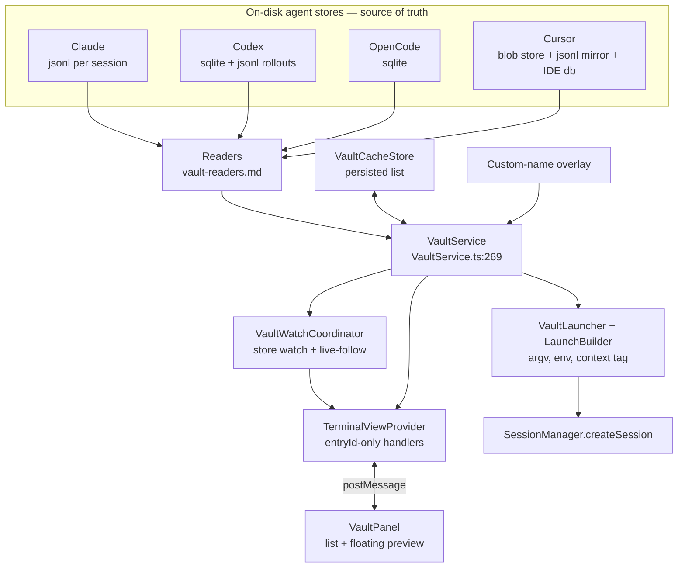
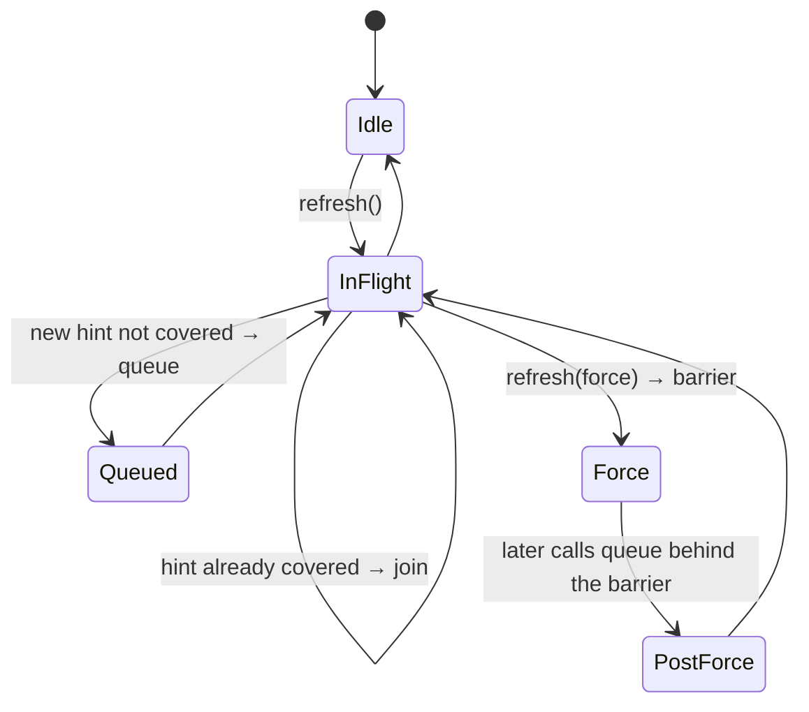
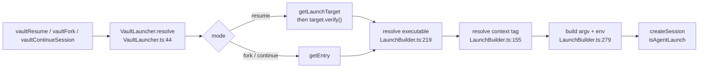
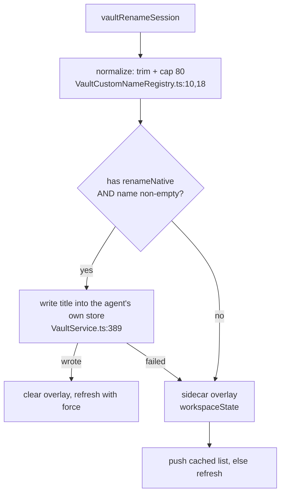

# AI Vault Design

> **Scope**: the host aggregation layer (`src/vault/`) and its webview surface
> (`src/webview/vault/`). Per-agent parsers are [vault-readers.md](vault-readers.md);
> live agent detection is [agent-cli-integration.md](agent-cli-integration.md).

The AI Vault is a **read-only aggregate index of local AI-CLI coding sessions**. Four
agent CLIs already write transcripts to disk in four unrelated formats. The vault
discovers them, normalizes them into one entry/detail contract, and offers three ways back
into a session: resume, fork, continue.

## 1. Goals and Constraints

**Goals** — one recency-ordered list across every agent that paints instantly; one detail
contract so the preview never learns a format; three re-entry paths that drive the agent's
own CLI rather than reimplementing it.

**Constraints that shape everything below**

| Constraint | Consequence |
|-----------|-------------|
| The agents' files are the source of truth; we never write a transcript | the cache is an accelerator, never authoritative (§ 5) |
| A webview must not name a path | every message carries an `entryId`; the host re-resolves (`messages.ts:391-394`) |
| Transcript text is untrusted | `textContent` only in the panel; ids validated before reaching a glob or a CLI (§ 9) |
| Sessions can be enormous | every read is bounded head+tail, and omission is reported, not hidden (§ 6) |
| A launch is a process spawn | argv is a template array, never a shell string (§ 4, § 7) |
| Agents differ in capability | capability is an adapter field, not a branch in the caller (§ 5.1) |

## 2. Overview



Readers are the only code that knows a format. `VaultService` is the only code that knows
there are four agents. The provider is the only code that touches `vscode`. The panel
knows none of the three.

## 3. Data Model

### 3.1 Identity

| Value | Canonical form | Defined in |
|-------|----------------|-----------|
| Vault entry id | `<agent>:<sessionId>` | `src/vault/types.ts:53` — see [DESIGN.md](../DESIGN.md) § 10 |
| Agent ids | `claude` \| `codex` \| `opencode` \| `cursor` | `src/vault/types.ts:27` |

`parseEntryId` splits on the **first** colon only (`src/vault/types.ts:57`); a sessionId may itself
contain colons, which the Claude child grammar and the Cursor namespaces rely on
([vault-readers.md](vault-readers.md) § 5.4, § 8). `VaultSessionEntry.agent` is typed
`string`, not `VaultAgentId` (`:171`) — the value crosses IPC and the webview must survive
an id it does not know. Adding an agent is a 6-step checklist at `src/vault/types.ts:16-26`; only the
CSS accent step is not compile-enforced.

### 3.2 The two shapes

```
VaultSessionEntry {                        // types.ts:171 — the list row
  id, agent, sessionId, title, cwd, modified
  flags:        Record<string,string>      // permissionMode, sandbox …
  canFork:      boolean
  canResume?:   boolean                    // explicit false hides Resume
  source?:      "cli" | "ide"              // Cursor storage domain
  sessionPath?: string                     // UI HINT ONLY, never an action target
  gitBranch?, customName?
}

VaultSessionDetail {                       // types.ts:412 — the preview
  entryId, timeline, recentActivity, stats
  contentKind:  "timeline" | "metadata-only"   // :422 required, derived
  truncated?:   boolean                    // :443 PAGEABILITY only
  partial?:     boolean                    // :455 SOURCE OMISSION only
  limitedReason?
}
```

**`truncated` and `partial` are independent on purpose.** `truncated` means "ask again with
a bigger limit and you get more"; `partial` means "the source could not give everything,
and asking again will not help". Conflating them yields a preview that either loops forever
or silently lies about completeness. One constructor pair enforces the distinction
([vault-readers.md](vault-readers.md) § 4.3).

### 3.3 Timeline vocabulary

| `kind` | Meaning | Line |
|--------|---------|------|
| `message` | user / assistant turn; carries `msgRef`, `model`, `tokens` | `src/vault/types.ts:264` |
| `thinking` | reasoning block | `:264` |
| `notice` / `compaction` | background-task notification / context-compaction summary | `:285` / `:291` |
| `gap` | omitted middle of a bounded read | `:293` |
| `question` | AskUserQuestion turn with options + chosen answer | `:302` |
| `subagentSession` | nested child transcript, fetched lazily by `entryId` | `:318` |
| `teammateTurn` / `teammateMessage` | agent-team communication | `:345` / `:364` |
| `workflowBoard` | a workflow run's phase/agent board | `:381` |
| `VaultActivityStep` | tool call or subagent invocation | `:238` |

## 4. Agent Registry

`registry.ts` is the single data-driven description of each agent; `AGENT_RECORD` is
declared `satisfies Record<VaultAgentId, …>` (`:195`), so omitting one is a compile error.

| | claude (`:36`) | codex (`:86`) | opencode (`:136`) | cursor (`:164`) |
|--|--|--|--|--|
| Store | jsonl under `projects/<encoded-cwd>/` | `state_5.sqlite`, jsonl fallback | `opencode.db` | `chats/<bucket>/<id>/` |
| Session id from | filename stem | `threads.id` | `session.id` | chat dir name |
| Resume / fork | `--resume` / `--fork-session` | `resume` / `fork` | `--session` / version-gated ≥ 1.1.54 | `--resume` / none |
| Permission choices | 4 (ids **are** `--permission-mode` values) | 3 (sandbox) | none | 3 |
| Executable probe | name | name | name | help-token proof (§ 7.1) |

`CLAUDE_AUTH_ENV_ALLOWLIST` (`:25-34`) is the closed set of 8 variables a Claude launch may
inherit. `detectContinuationTargets()` (`:232`) probes what this host can actually start,
so the continuation dialog never offers an agent that would fail at spawn.

## 5. Aggregation and Cache

### 5.1 Adapters, and partial failure

Each agent registers one capability record (`VaultService.ts:187-252`) covering
list / detail / entry / record / watch targets, plus an optional `renameNative` present for
codex (`:207`) and opencode (`:231`) and **absent** — not stubbed — for claude and cursor.
Absence is the signal the caller routes on (§ 8).

`readAll` (`:430-529`) runs the four readers under `Promise.allSettled`. A failed reader
keeps its last-known-good entries and contributes a reason to `VaultListResult.unreadable`
(`src/vault/types.ts:460`). One broken store degrades one agent's rows, never the list. Entries sort
newest-first (`:519`).

### 5.2 Persisted list cache

| Property | Value | Cited |
|----------|-------|-------|
| Path / version | `<globalStorage>/vault-cache/list.json`, version 8 | `VaultCacheStore.ts:211-212`; `cacheTypes.ts:179` |
| Modes | file `0o600`, dir `0o700` | `VaultCacheStore.ts:197,199` |
| Write | temp file → rename, 3 retries on lock errors | `:256,281-296` |
| Load | version-guarded; one malformed entry voids the **whole** cache | `:221` |

Voiding wholesale is deliberate: a half-trusted cache is worse than a cold scan, and the
cold scan is bounded. Per-agent freshness is a discriminated union — `files` (per-path
mtime+size), `store` (the `.db` **and** its `-wal`, deliberately not `-shm`),
`cursor-files` (`cacheTypes.ts:131`; `storeStamp.ts`). Unchanged stamps skip the body read,
which is what makes a refresh cheap.

A `store` generation proves the files are READABLE, not merely present: `readStoreGeneration`
runs two ordered stat passes for coherence and then one open-and-close pass over the stamped
paths, and any refusal — including a `close()` that rejects — makes the generation unusable
rather than reusable. The readability pass sits BESIDE the stat passes, never inside one:
adding its latency to either pass widens the window in which a second pooled borrower misses
the in-flight join and takes a redundant snapshot. This leaves a deliberate check/use boundary
— permission can be revoked between the proof and the read — so the guarantee is that a
reused snapshot and a fresh one answer a store's status the same way, not that the read cannot
fail. The write-side stamp keeps a plain stat; stamping is not a readability claim.

### 5.3 Refresh coalescing



Single-flight with hint coalescing (`VaultService.ts:555,597,606,752`). The **force
barrier** (`:639,661`) exists for one reason: a write-then-read (native rename, § 8) must
not be served by a refresh that started before the write. Pending hint paths cap at 128
(`:254`); past that the next refresh is a full rescan rather than an unbounded set.

`listCached()` (`:543`) is synchronous and is what makes the panel paint on open; `list()`
(`:533`) is the uncached read. The custom-name overlay **clones** (`:407`), so a rename can
never corrupt the persisted list.

## 6. The Detail Contract

`getDetail(entryId, limit?)` (`VaultService.ts:806`) clamps the limit and routes Cursor
through the locator resolver (§ 9). Every detail comes from one of two constructors, never
assembled ad hoc:

| Constructor | `contentKind` | `truncated` | Used when |
|-------------|---------------|-------------|-----------|
| `finalizeDetail` (`readers/detail.ts:209`) | `timeline` | from the source verdict | a transcript was read |
| `limitedDetail` (`readers/detail.ts:228`) | `metadata-only` | **never** | only index metadata exists |

The webview honours the distinction structurally: a `metadata-only` detail renders no
transcript, no per-message actions, and an unanchored "Continue in New Session"
(`PreviewController.ts:785,803-811,821`).

## 7. Launch: Resume, Fork, Continue



| Mode | Gate | Why |
|------|------|-----|
| `resume` | `canResume !== false`; Cursor also needs CLI source **and** a passing identity proof (`VaultLauncher.ts:100-113`, `cursorCapabilities.ts:23`) | one resolution per action, so discovery cannot run twice and land on a different candidate |
| `fork` | `entry.canFork` (`:51`) | OpenCode's flag is version-probed and memoized; any probe failure ⇒ false (`forkSupport.ts:63`) |
| `continue` | none — starts a **new** session seeded with a handoff prompt | the stored session is never touched, so a continuation cannot corrupt history |

`isAgentLaunch: true` (`VaultLauncher.ts:71`) arms the shell-fallback respawn, so a
quitting agent leaves a live shell rather than a dead tab. Argv is data: tokens substitute
into a template array (`LaunchBuilder.ts:46`), the context tag applies to the `model`
argument only (`:54`), failures are typed (`:30-39`), and a **cross-agent** continue drops
the captured flags (`:260`) — a Codex sandbox value means nothing to Claude.

### 7.1 Why the context tag exists

Claude records only the canonical model id, so a plain `--resume` returns at the default
context window even when the session ran at 1M. The tag survives only if the resume argv
restates it, and the one place it is still written down is the user's configured default
model. `claudeContextTag.ts:13-16` therefore mirrors Claude's own precedence
(`ANTHROPIC_MODEL` > project `settings.local.json` > project `settings.json` > config-root
`settings.json`), and the **first** level defining `model` wins outright (`:95`) — a project
pinning an untagged model correctly yields no tag rather than widening a session the CLI
would have run narrow.

### 7.2 Continuation safety

The reader's instruction is capped at 4000 chars (`continuationLimits.ts:2`), enforced in
the dialog (`ContinueDialog.ts:102,267`) **and** re-checked host-side before composing
(`TerminalViewProvider.ts:483`) — a forged message cannot bypass the UI. Session metadata is
fenced in the prompt as untrusted data, not instructions (`ContinuationPrompt.ts:52`). The
webview sends an opaque `anchorRef`; the host resolves it and rejects anything that is not
an assistant record (`TerminalViewProvider.ts:492-503`).

## 8. Rename



Two mechanisms, routed by capability (`TerminalViewProvider.ts:615-672`). Where the agent
owns a title field we write it, so the name is visible in the agent's own UI too; where it
does not, a sidecar overlay keeps our list honest without inventing a field in someone
else's store. The native write is the vault's **only** write to a live agent database —
parameterized, row-scoped, 2 s busy timeout (`sqlite.ts:414,454`; `codexReader.ts:485`;
`opencodeReader.ts:213`). Success clears the overlay, so exactly one source owns the name.

## 9. Untrusted Input Boundaries

| Boundary | Rule | Cited |
|----------|------|-------|
| Cursor child ids | never cross IPC; host issues opaque `child:<32 hex>` locators, LRU 256 | `VaultService.ts:258,261,831` |
| Raw `project:` id from a webview | refused outright | `VaultService.ts:859` |
| `ide:` / `project:` as a launch target | rejected | `cursorReader.ts:606` |
| Ids interpolated into a watch glob | pass `isGlobSafeId` | `VaultService.ts:265` |
| Transcript text in the DOM | `textContent` only | § 10.1 |

Cursor timelines deliberately carry **no** `msgRef` (`cursorReader.ts:757`), so Raw copy and
anchored continue are cleanly absent for Cursor rather than half-working.

## 10. The Webview Surface

The panel owns list rendering; the preview owns one open session. Neither knows a format,
a path, or an agent's capabilities beyond the flags on the entry.

### 10.1 Session list

Search, folder filter and grouping are entirely client-side — no keystroke reaches the
host.

| Concern | Behaviour | Cited |
|---------|-----------|-------|
| Grouping | `recent` flat / by `agent` / by `folder`; groups ordered by newest entry | `grouping.ts:41` |
| Per-group cap | 10 rows behind "Show N more", so one busy agent cannot bury the rest | `VaultPanel.ts:65` |
| Folder filter | subtree match on the pane's **live** cwd, re-pulled each render | `VaultPanel.ts:683-710` |
| No-op render guard | signature over every field the UI reads **plus** query/filter/mode | `vaultRenderSignature.ts:17`; `VaultPanel.ts:598-636,659` |
| Rename guard | an open inline editor defers the rebuild | `VaultPanel.ts:618-621` |
| Scroll + selection | preserved across every rebuild | `VaultPanel.ts:723,759-767` |

The render guard is why the cache→fresh double-render is invisible: entries always update,
the DOM rebuild is skipped when the projection is unchanged.

**Injection rule.** Session-derived strings reach the DOM only via `textContent`. The only
`innerHTML` sources are closed constant maps — agent brand icons (`agentIcons.ts:64`) and
the UI icon set. A session-derived agent string becomes a CSS class only after passing
`getAgentAccent` (`:85`); teammate colors, being untrusted transcript data, collapse to a
closed palette or a strict hex literal (`previewColors.ts:28-37`). Markdown renders through
a small ReDoS-safe parser that emits elements but never interprets HTML
(`markdownLite.ts:1-14`).

### 10.2 Floating preview

| Concern | Rule | Cited |
|---------|------|-------|
| Page size | 400 items, +400 per load-more | `PreviewController.ts:39-40` |
| Load-more | button, or scrolling within 48 px of the top | `:786-794,833` |
| Scroll-to-first | walks older windows only while the timeline **grows**, so a capped session cannot loop | `:504-522` |
| Stale replies | dropped unless the entry id is still the open one | `:476` |
| Nested replies | correlated by an opaque echoed `requestId`, because host reads complete out of order | `:436-446`; `messages.ts:406-412` |
| Two cards, one child | one request fills both; collapsing one leaves the other waiting | `:169-185,887-894` |
| Self-referential child | render-stack guard breaks the cycle | `:130,873-877` |
| Clipboard | writes serialized, so the last activation wins | `:86,759-763` |

Transcript layout groups the timeline into **runs**: user messages flush-left, each
AI-output run capped at 3 items behind an expander, with the run's concluding assistant
message pinned *below* the expander so a trailing tool call cannot bury the answer
(`previewTimeline.ts:92,312,320-354`). Nested cards are keyed by position **and** identity,
so a load-more prepend or a follow append does not reshuffle expansion state (`:235-251`).

### 10.3 Live-follow

A follow push applies only when the timeline's **tail fingerprint** changes
(`PreviewController.ts:552,923-945`): length and timestamp are both unreliable, because a
bounded window can shift at equal length and an assistant message can grow in place. At
the bottom the view re-pins to the newest message; scrolled up it preserves the viewport
and raises an "N new messages" pill (`:576-591`).

Host side, `VaultWatchCoordinator` runs two lifecycles per attached webview:

| | Store watch | Follow watch |
|--|--|--|
| Debounce | 300 ms, 1000 ms max wait | 400 ms |
| Coalescing | per-agent path set; mixed agents or > 128 paths ⇒ full refresh | latest generation only |
| Effect | refresh the list with a hint | re-read and push one detail |

Cited `VaultWatchCoordinator.ts:7-10,203-234`. At most one follow watcher exists per view
(`messages.ts:495-504`); opening a preview points it, closing clears it
(`PreviewController.ts:263,313`).

## 11. Protocol Surface

The fifteen vault messages — every `type` string, direction, and its dispatch line — are
tabulated in [message-protocol.md](message-protocol.md) § 4.6. That is the single copy; do
not restate it here.

Two invariants are vault-specific and belong where a vault reader will meet them:

- **The webview sends an `entryId` (or a pane `sessionId`) and nothing else.** No path, no
  cwd, no argv ever crosses inbound. Everything an action needs is re-derived host-side from
  the id, so a compromised webview cannot name a file it was not already shown (§ 9).
- **List-producing requests carry a monotonic token, re-checked before *each* delivery
  attempt** (`TerminalViewProvider.ts:392-404`) — not once at entry — because a newer request
  can arrive during a retry sleep, and the cache-then-refresh pattern (§ 5) means one request
  legitimately replies twice.

## 12. Failure Behaviour and Edge Cases

| Condition | Behaviour |
|-----------|-----------|
| One reader throws | that agent keeps cached rows + an unreadable reason; the list still renders (`VaultService.ts:430-529`) |
| Cache malformed or stale-versioned | discarded whole; next open does a full scan (`VaultCacheStore.ts:221`) |
| No `node:sqlite` and no `sqlite3` CLI | Codex falls back to JSONL rollouts; others report unreadable (`sqlite.ts:45`) |
| SQLite query error | 1 unreadable **and empty stamps**, so the next pass retries rather than caching the failure (`codexReader.ts:499`) |
| Refresh fails with a cache already shown | error **not** posted — a rendered list is not clobbered (`TerminalViewProvider.ts:405-416`) |
| Record too large vs missing | distinct messages, so the user knows which (`TerminalViewProvider.ts:596`) |
| Preview closed with copies pending; refresh with no reply | promises rejected so buttons unfreeze; a 4 s timer clears the spinner (`PreviewController.ts:306-311`; `VaultPanel.ts:583-588`) |
| sessionId containing `:` | first-colon split preserves it (`src/vault/types.ts:57`) |
| Duplicate Cursor chat id in two buckets | ambiguous ⇒ omitted from list **and** point lookup (`cursorPaths.ts:143`) |
| Claude team-member or content-less transcript | excluded from the list and never cached (`claudeReader.ts:425-433`) |
| Rename during an in-flight refresh | force barrier + request-token ordering (§ 5.4, § 8) |
| Follow push shorter than what the reader loaded | ignored while scrolled up (`PreviewController.ts:566-568`) |
| Open preview whose row is filtered away | preview stays open, just unanchored (`VaultPanel.ts:759-763`) |
| Webview disposed mid-follow | client disposed; a resolved read posts nothing (`VaultWatchCoordinator.ts:204-218`) |

SQLite is never read live: one disposable copy-on-write snapshot per detail, all queries
against it, probe/query/copy timeouts 2 s / 5 s / 30 s, 64 MB buffer cap
(`sqlite.ts:36-43,90,287`).

## 13. Scale

| Dimension | Growth axis | Bound |
|-----------|-------------|-------|
| List refresh | sessions on disk | unchanged files cost 1 `stat`, 0 body reads (`claudeReader.ts:412-420`) |
| SQLite list | sessions per store | 500 rows (`codexReader.ts:45`; `opencodeReader.ts:39`) |
| Detail | messages per session | 400 items default, 5000 cap; 100 head + 4000 tail records (`readers/detail.ts:23,26,29,32`) |
| Store watch / follow | file churn during an agent run | 300 ms / 400 ms debounce, 128-path hint cap |
| Child locators | nested cards opened | LRU 256 (`VaultService.ts:261`) |
| Snapshots per detail; action-bar DOM | queries; messages rendered | 1 snapshot (`sqlite.ts:287`); 1 bar + 2 listeners (`messageActions.ts:44-49,138-139`) |

## 14. Boundaries and Decisions

**Out of scope.** Whether an agent is running *right now*, and what it is doing, belongs to
[agent-cli-integration.md](agent-cli-integration.md). The vault reads what is already
written.

| Decision | Alternative rejected | Reason |
|----------|---------------------|--------|
| `entryId`-only IPC | let the webview pass `sessionPath` | a compromised webview could then name any file to open, reveal, or execute |
| Capability as an adapter field | branch on the agent id per call site | four agents already; branches multiply per feature |
| Cache voided wholly on one bad entry | salvage the good entries | a partially-trusted index is indistinguishable from a correct one |
| `truncated` ≠ `partial` | one "incomplete" flag | one flag makes "load more" either loop forever or stop early |
| Two constructors own the verdict | let each reader set the fields | six readers set three fields; they drifted |
| Native rename where available | overlay everywhere | an overlay-only name is invisible in the agent's own UI |
| Cursor gets no `msgRef` | synthesize one from blob offsets | a locator that cannot be re-resolved is worse than no button |
| Argv as a template array | build a shell string | a session title or cwd would become shell input |

**Settings and persisted state**

| Key | Kind | Default | Cited |
|-----|------|---------|-------|
| `anywhereTerminal.cursorAgent.hooks.enabled` | setting, `machine` | `false` | `package.json:101-106` |
| `anywhereTerminal.vaultCustomNames` | `workspaceState` | — | `VaultCustomNameRegistry.ts:27` |
| `vaultView`, `vaultGroupMode`, `vaultPreviewGeometry` | per-surface view state | — | `VaultPanel.ts:90-96`; [DESIGN.md](../DESIGN.md) § 10 |

No setting enables the vault or changes its scan roots — the roots come from each agent's
own environment ([vault-readers.md](vault-readers.md) § 3).

## 15. Testing

- [ ] Rename routes by capability: native success clears the overlay and force-refreshes; native failure falls back; an empty name never writes; a capability-less agent never writes; an over-long name is capped before the write
- [ ] Continue rejects a user-record anchor, an unreadable anchor, an over-cap instruction, an empty instruction, and an unknown entry — and surfaces a launch failure as a notice, not a broken tab
- [ ] Watch coordinator: per-client isolation; 300 ms coalescing and the max-wait flush; hints merged per agent; full-refresh fallback past the path cap; one follow per client; serialized reads with one coalesced follow-up; nothing posted after disposal; a superseded watcher never publishes
- [ ] A failed reader leaves the other three agents' rows intact and adds one unreadable reason; a stale-version or malformed cache file is discarded, not partially trusted
- [ ] The render guard skips an unchanged projection, repaints for every field a row displays, and a follow push with an unchanged tail fingerprint causes no re-render
- [ ] A `metadata-only` detail renders no transcript and no per-message actions

### Quality Criteria

| Metric | Target | How to measure |
|--------|--------|----------------|
| Store scans on the paint path with a warm cache | 0 | `listCached()` is synchronous |
| DOM rebuilds for an unchanged cache→fresh pair | 0 | signature guard |
| Live-DB writes | only the native rename | grep the write helper's call sites |
| SQLite file copies per detail read | 1 | spy on the copy helper |

---

> **Sync rule**: § 2's diagram names the same collaborators the sections below describe; § 7's and § 8's diagrams must match their prose.
> **Registry**: values shared with other documents belong in [DESIGN.md](../DESIGN.md) § 10 — do not keep a second copy here.
