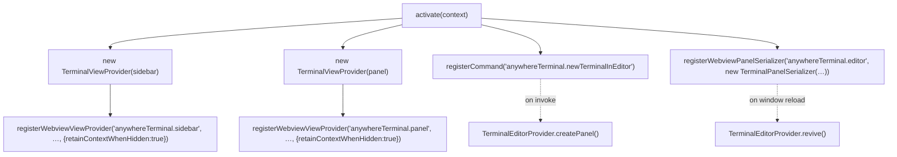
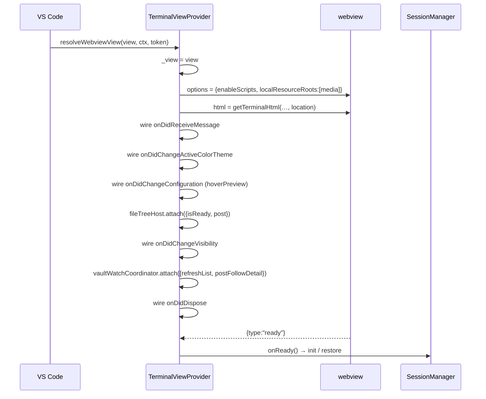
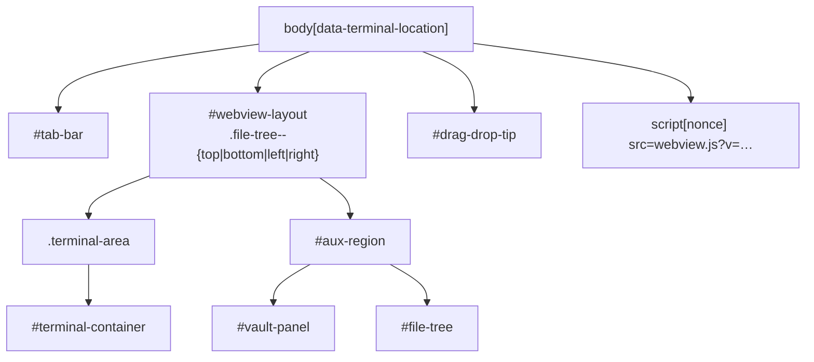
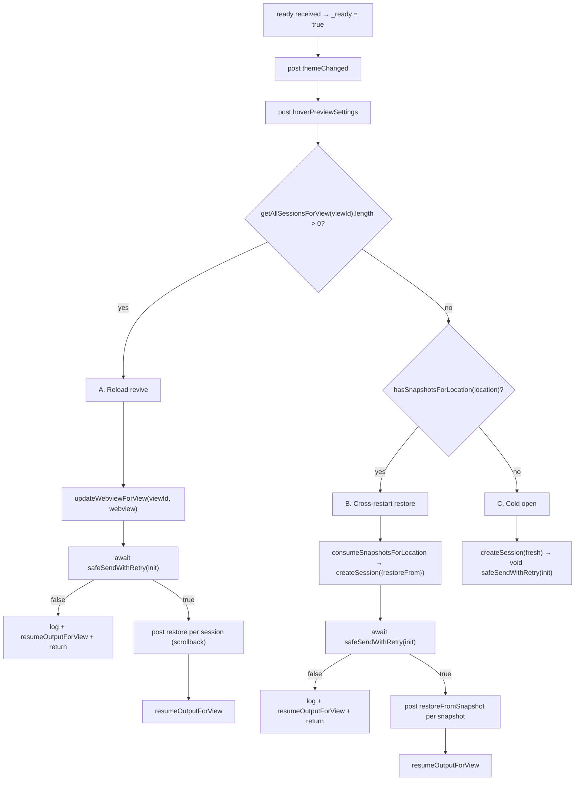
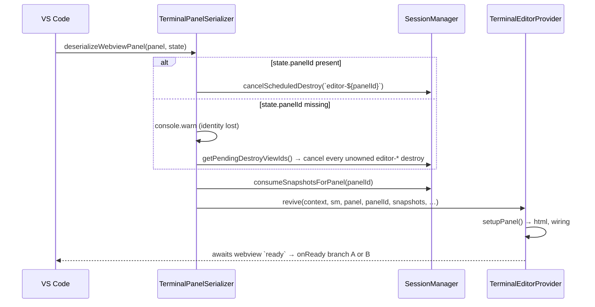
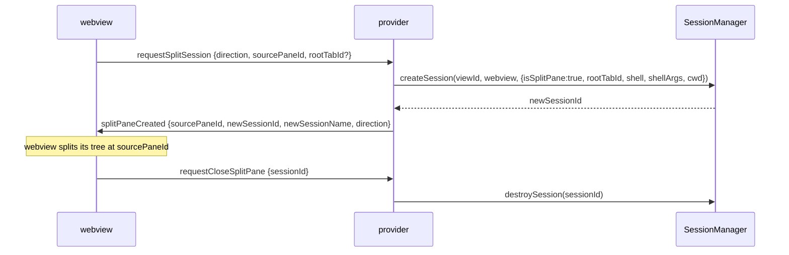

# Webview Providers — Detailed Design

## 1. Overview

AnyWhere Terminal renders terminals in **three host surfaces**, backed by **two provider classes** plus a serializer:

| Surface | Class | VS Code API | View type |
|---|---|---|---|
| Sidebar | `TerminalViewProvider` (`location: "sidebar"`) | `WebviewViewProvider` | `anywhereTerminal.sidebar` |
| Bottom panel | `TerminalViewProvider` (`location: "panel"`) | `WebviewViewProvider` | `anywhereTerminal.panel` |
| Editor tab | `TerminalEditorProvider` | `WebviewPanel` | `anywhereTerminal.editor` |
| *(reload)* | `TerminalPanelSerializer` | `WebviewPanelSerializer` | `anywhereTerminal.editor` |

All three produce **identical HTML** from one generator — `getTerminalHtml(webview, extensionUri, location)` (`src/providers/webviewHtml.ts:40-44`). The only difference in the emitted document is `<body data-terminal-location="…">` (`webviewHtml.ts:680`), which the webview reads to pick its layout defaults.

Sessions are owned by `SessionManager`, **not** by providers. A provider is a webview-lifetime object; sessions outlive webview disposal and are re-bound on the next resolve.

### Goals and constraints

- **One HTML generator, three surfaces.** Any divergence between sidebar, panel, and editor would be a latent bug, so the only per-surface variable in the emitted document is one `data-` attribute.
- **A webview is disposable; a session is not.** Every teardown path pauses output and releases subscriptions but never kills a PTY — the user's shell must survive collapsing a view, reloading a window, or dragging the container.
- **A disposed webview is an expected state, not an error.** All posting is guarded; nothing throws upward from a delivery attempt.
- **Deny by default at the sandbox boundary.** The CSP grants only what the page provably needs, and every inbound message is re-validated field by field — there is no schema layer to lean on.

### Reference sources

| Concern | Canonical file |
|---|---|
| Provider classes | `src/providers/TerminalViewProvider.ts` (1591), `src/providers/TerminalEditorProvider.ts` (918) |
| Panel revival | `src/providers/TerminalPanelSerializer.ts` (78) |
| HTML / CSP / DOM shell | `src/providers/webviewHtml.ts` (703) |
| File-tree host wiring | `src/providers/fileTreeHost.ts` (511) |
| Registration | `src/extension.ts:199-255` |
| Split-pane model (webview side) | `docs/design/xterm-integration.md` §7 — **canonical** |
| Message payload shapes | `src/types/messages.ts` — **canonical** |

---

## 2. Registration

| Step | Site |
|---|---|
| Sidebar instance | `extension.ts:199-209` |
| Sidebar registration | `extension.ts:211-215` |
| Panel instance | `extension.ts:217-227` |
| Panel registration | `extension.ts:229-233` |
| Editor-tab command | `extension.ts:235-245` |
| Serializer registration | `extension.ts:250-256` |

The serializer is registered **after** `SessionManager` construction so `consumeSnapshotsForPanel` sees the already-hydrated pending snapshots (`extension.ts:247-249`).

### 2.1 Constructor dependencies (shared singletons)

Both `TerminalViewProvider` instances receive the same `gitDecorationProvider`, `fsWatcherPool`, `vaultService`, `vaultLauncher`, and `vaultWatchCoordinator` (`TerminalViewProvider.ts:131-143`). Sharing the git decoration provider is deliberate — one revision sequence across all webviews (`TerminalViewProvider.ts:100-107`). `TerminalEditorProvider` receives the git provider and watcher pool but **not** the vault services (`TerminalEditorProvider.ts:183-188`) — the AI vault panel is a sidebar/panel surface only.

### 2.2 `viewId` — the session-partition key

`SessionManager` partitions sessions by `viewId`:

| Surface | `viewId` | Site |
|---|---|---|
| Sidebar | `"anywhereTerminal.sidebar"` | `TerminalViewProvider.getViewId()` `:1503-1505` |
| Panel | `"anywhereTerminal.panel"` | same |
| Editor | `` `editor-${panelId}` `` | `TerminalEditorProvider.ts:171` |

The `editor-` prefix is load-bearing: `TerminalEditorProvider.findByViewId` rejects anything else (`:131-133`), and the serializer's orphan sweep filters pending destroys on it (`TerminalPanelSerializer.ts:48-53`).

---

## 3. `resolveWebviewView` — sidebar / panel lifecycle

Called by VS Code the first time a view becomes visible, and again after the webview is disposed and re-shown.

Numbered steps in code (`TerminalViewProvider.ts:145-269`):

| # | Wiring | Lines |
|---|---|---|
| 1 | `webview.options` — `enableScripts: true`, `localResourceRoots: [<ext>/media]` | `:153-156` |
| 2 | `webview.html = getTerminalHtml(…)` | `:159` |
| 3 | `onDidReceiveMessage` → `handleMessage` | `:165-169` |
| 4a | `onDidChangeActiveColorTheme` → `themeChanged` (gated on `_ready`) | `:174-185` |
| 4a-bis | `onDidChangeConfiguration` → `hoverPreviewSettings` (gated on `affectsHoverPreview` **and** `_ready`) | `:191-201` |
| 4a-ter | `fileTreeHost.attach({isReady, post})` | `:205-210` |
| 4b | `onDidChangeVisibility` → pause/resume output + `viewShow` | `:213-227` |
| 4c | `vaultWatchCoordinator.attach(…)` — one client per resolved webview | `:229-245` |
| 5 | `onDidDispose` → teardown | `:250-268` |

### 3.1 Dispose semantics — sessions survive

`onDidDispose` (`:250-268`) does **not** destroy sessions:

1. Dispose all wired subscriptions (`:251-253`).
2. `cancelAllPreviewTokens()` — cancel in-flight hover previews (`:255`).
3. Dispose this webview's vault watch client, clearing `_vaultWatchClient` only if it is still ours (`:257-260`).
4. `sessionManager.pauseOutputForView(viewId)` — sessions keep running; output buffers instead of flushing to a dead webview (`:262`).
5. `_view = undefined`, `_ready = false` (`:263-264`).
6. `unmarkFocused()` — drop out of the static focus-recency stack so `getLastFocusedProvider` cannot return a disposed provider (`:267`).

Sessions are anchored to the **extension-host** lifecycle; they are re-attached on the next `resolveWebviewView` → `ready` → `onReady` (§5).

---

## 4. HTML generation, CSP, and the DOM shell

### 4.1 Content Security Policy (canonical: `webviewHtml.ts:75-80`)

| Directive | Value | Why it is what it is |
|---|---|---|
| `default-src` | `'none'` | Deny-by-default; every other directive is an explicit allowance |
| `style-src` | `${webview.cspSource} 'unsafe-inline'` | The generator inlines a large `<style>` block (vendored list CSS, file-tree, tooltip, vault) |
| `script-src` | `'nonce-${nonce}'` | Only the single nonce-tagged `<script>` executes; no `unsafe-eval`, no CDN |
| `img-src` | `${webview.cspSource} blob: data:` | `blob:` for pasted-image previews, `data:` for inline glyphs |
| `font-src` | `${webview.cspSource} data:` | The vendored Seti icon font is a `data:` URI baked in by esbuild |
| `connect-src` | *(absent)* | The webview cannot make network requests at all |

### 4.2 Nonce and cache-busting

- Nonce: `crypto.randomBytes(16).toString("hex")` — a fresh 32-hex-char value per `getTerminalHtml` call (`webviewHtml.ts:45`).
- Script URL carries `?v=${mtimeMs}-${size}` (`webviewHtml.ts:56-67`). Size is folded in because mtime alone misses rebuilds from a bundler that preserves timestamps. If `fs.statSync` throws, the version falls back to the nonce — always-fresh rather than risking a stale bundle (`:61-62`).
- `localResourceRoots` is limited to `<extensionUri>/media` (`TerminalViewProvider.ts:155`, `TerminalEditorProvider.ts:196`).

### 4.3 Inlined stylesheets

Four vendored VS Code stylesheets plus three project stylesheets are imported as **strings** (esbuild `loader: { ".css": "text" }`) and interpolated into the `<style>` block rather than linked as resources (`webviewHtml.ts:11-25`):

| Import | Source |
|---|---|
| `vs/base/browser/ui/aria/aria.css` | vendored |
| `vs/base/browser/ui/dnd/dnd.css` | vendored |
| `vs/base/browser/ui/list/list.css` | vendored |
| `vs/base/browser/ui/scrollbar/media/scrollbars.css` | vendored |
| `../webview/fileTree/fileTreePanel.css` | project |
| `../webview/ui/tooltip.css` | project |
| `../webview/vault/vaultPanel.css` | project |

Only `media/xterm.css` is loaded as a real `<link>` resource (`webviewHtml.ts:68`, emitted at `:81`).

### 4.4 DOM shell (canonical: `webviewHtml.ts:680-701`)

One fixed skeleton, identical across all three surfaces:

| Node | Role |
|---|---|
| `#tab-bar` | Tab strip; height pinned by `--awt-tab-bar-height: 30px` (`webviewHtml.ts:100`) |
| `#webview-layout` | Flex container; direction/order driven by `file-tree--{top\|bottom\|left\|right}` set at runtime by `FileTreePanel.setPosition()` |
| `.terminal-area` / `#terminal-container` | Where xterm instances and the split tree mount |
| `#aux-region` | The sized edge slot — vault section stacked above the file tree, resize sash mounts here |
| `#vault-panel` | AI-vault list; starts collapsed |
| `#file-tree` | File-tree panel |
| `#drag-drop-tip` | Drag-drop affordance overlay |

The `<style>` block also hides xterm's **overview-ruler lane** (`.xterm .xterm-decoration-overview-ruler { opacity: 0 }`, `webviewHtml.ts:674-677`) — distinct from the scrollbar, whose slider colours come from `ThemeManager`'s `--vscode-scrollbarSlider-*` mapping. See `docs/design/theme-integration.md` §2.3.

---

## 5. Ready handshake

`_ready` is a per-provider boolean that gates **every** outbound message wired in `resolveWebviewView`. The webview posts `{type:"ready"}` once its bundle has booted; `onReady` flips the flag and then decides among three branches.

### 5.1 `TerminalViewProvider.onReady` (`:1295-1450`)

**Why `init` is awaited in branches A and B.** `safeSendWithRetry` schedules a 50 ms retry on a failed first attempt. A synchronous post-loop would enqueue `restore` / `restoreFromSnapshot` *before* the retried `init`; the webview would look up a `tabId` that does not exist in `store.terminals` yet and silently drop the payload — tab strip populated, terminal blank. The awaited form plus the `initDelivered` early-return closes it (`:1336-1348` for A, `:1379-1401` for B; review round-2 [W4]).

Branch C does not await — there is nothing to sequence after it (`:1428-1434`).

`init` always carries `tabs`, `config: readTerminalConfig()`, and the spread of `fileTreeHost.initPayload()` (`{rootGeneration, workspaceRoot}`, `fileTreeHost.ts:124-129`).

Branch A sends **roots *and* splits** in `tabs` (`:1327-1329`) — the webview needs every session referenced by its persisted `tabLayouts` to recreate the split tree.

### 5.2 `TerminalEditorProvider.onReady` (`:759-881`)

Same three-branch shape, with two differences:

1. It first posts `{type:"setPanelId", panelId}` (`:765`) so the webview can persist `{panelId}` via `vscode.setState` — that is what the serializer reads back on reload (§6).
2. Branch B reads `this.restoreSnapshots` (staged by the serializer) instead of `consumeSnapshotsForLocation`, and calls `attachSessionToPanel(panelId, sessionId)` for each (`:806-818`). Cold open does the same for the single new session (`:854-861`).

---

## 6. Editor panels: creation, grace period, revival

### 6.1 Creation

`TerminalEditorProvider.createPanel` (`:183-222`) calls `vscode.window.createWebviewPanel(viewType, "Terminal", ViewColumn.Active, {enableScripts, retainContextWhenHidden: true, localResourceRoots})`, constructs a provider with a fresh `crypto.randomUUID()` panelId, registers the panel in two statics (`_activePanels`, `_instances`), and calls `sessionManager.registerEditorPanel(panelId)`. The returned `Disposable` simply disposes the panel — real cleanup runs in `onDidDispose`.

### 6.2 Grace-period destroy

`GRACE_PERIOD_MS = 5000` (`TerminalEditorProvider.ts:42`). On `panel.onDidDispose` (`:320-333`):

1. Dispose wired subscriptions.
2. `cancelAllPreviewTokens()`.
3. Remove from `_activePanels` and `_instances`.
4. `sessionManager.scheduleDestroyForView(viewId, GRACE_PERIOD_MS, onFire)` — the PTY is **not** killed yet. `onFire` calls `unregisterEditorPanel(panelId)` only when the grace window actually elapses.

A window reload swaps the webview and normally re-attaches within ~1 s, well inside the window.

### 6.3 Revival

`TerminalPanelSerializer.ts:26-77`. The `stateMissing` path is a documented degradation, not a silent one: without a `panelId` the revival cannot match its prior identity, so the serializer logs a warning (`:38-44`) and best-effort cancels **all** pending `editor-*` destroys that no live panel currently owns (`:45-54`). The orphaned on-disk snapshot for the original panelId is swept by the next activate's hydrate.

---

## 7. `retainContextWhenHidden`

All three surfaces set it (`extension.ts:212,230`; `TerminalEditorProvider.ts:195`).

| | `retainContextWhenHidden: false` | `true` (what we use) |
|---|---|---|
| Hidden webview | Destroyed; DOM + xterm state lost | Kept alive in memory |
| Re-show | Full re-resolve + `ready` + restore | Instant; DOM intact |
| Cost | Lower memory | Higher memory per hidden view |

Even so, output is **paused while hidden** rather than flushed into a retained-but-invisible webview:

- Hidden → `sessionManager.pauseOutputForView(viewId)` (`TerminalViewProvider.ts:224`)
- Visible → `resumeOutputForView(viewId)` then `{type:"viewShow"}` when `_ready` (`:216-221`)

The editor provider's `onDidChangeViewState` only posts `viewShow` — it does not pause output on hide (`TerminalEditorProvider.ts:299-305`).

`viewShow` exists so the webview can run a deferred fit; see `docs/design/resize-handling.md`.

---

## 8. Message router

`TerminalViewProvider.handleMessage` (`:874-1292`).

### 8.1 Guards

1. **Shape validation** — reject anything that is not an object with a string `type`, logging `Invalid message from webview` (`:876-879`).
2. `this._onDidReceiveInteraction?.()` fires on every valid message (`:884`) — feeds the keybinding-fallback "last interacted provider" tracking in `extension.ts`.
3. The entire `switch` is wrapped in one `try/catch` that logs and **does not rethrow** — a malformed handler cannot kill the provider (`:1281-1284`).
4. Unknown `type` falls through to a silent `default` (`:1277-1279`).
5. Every case re-validates its own field types inline (`typeof message.tabId === "string"`, `Number.isFinite(cols)`, …). There is no schema layer.

### 8.2 Case inventory

| Group | Cases | Lines |
|---|---|---|
| Handshake | `ready` | `:888` |
| Terminal I/O | `input`, `resize`, `ack`, `clear` | `:892`, `:955`, `:967`, `:1138` |
| Tabs | `createTab`, `switchTab`, `closeTab`, `renameTab` | `:990`, `:1114`, `:1120`, `:1132` |
| Splits | `requestSplitSession`, `requestCloseSplitPane` | `:1144`, `:1188` |
| Focus | `focus` | `:1197` |
| Images | `pasteClipboardImage`, `requestClipboardImagePreview`, `pasteOsClipboardImage` | `:898`, `:914`, `:932` |
| Export | `scrollbackDump` | `:973` |
| Links | `openLink`, `openFile`, `requestFilePreview` | `:1208`, `:1214`, `:1236` |
| File tree | `request-read-directory`, `request-open-folder`, `request-file-tree-search`, `cancel-file-tree-search`, `request-subscribe-fs-changes`, `request-unsubscribe-fs-changes`, `file-tree-reveal-in-os`, `file-tree-copy-path`, `file-tree-copy-relative-path`, `file-tree-delete` | `:1242-1251` (one shared body) |
| Settings | `updateHoverPreviewSetting` | `:1258` |
| AI vault | `requestVaultSessions`, `vaultRenameSession`, `vaultWatchSession`, `vaultResume`, `vaultFork`, `requestVaultSessionDetail`, `vaultContinueSession`, `requestVaultLaunchTargets`, `requestVaultMessageRecord`, `requestVaultContextCwd`, `requestSubagentPreview`, `vaultRevealInOS`, `vaultOpenSessionFile`, `vaultOpenWorkingDir`, `vaultCopyResumeCommand`, `vaultCopyFilePath` | `:1019-1112` |

`TerminalEditorProvider.handleMessage` mirrors the non-vault subset; the vault cases are absent because no vault services are injected.

### 8.3 Security-relevant validations in the router

| Case | Guard | Site |
|---|---|---|
| `requestFilePreview` | `isValidPreviewRequest(message)` before dispatch | `:1237` |
| `requestFilePreview` (handler) | unknown `sessionId` rejected **before** any resolution work — a forged id would otherwise reach `previewFileLink` with an empty trust-base list | `:281-287` |
| `openLink` | routed through `openExternalLink`, which shows a confirmation toast | `:1209`; `openExternalLink.ts:15` |
| file-tree RPCs | `rootGeneration` gate drops messages tagged with a superseded workspace state | `fileTreeHost.ts:258-261` |
| `request-unsubscribe-fs-changes` | deliberately **bypasses** the generation gate so a rapid root rotation cannot leak host-side subscriptions | `fileTreeHost.ts:291-298` |

### 8.4 Hover-preview supersession

`_previewTokens: Map<sessionId, CancellationTokenSource>` (`TerminalViewProvider.ts:95`). A new `requestFilePreview` for a session cancels the prior entry first (`:289`). Ownership rule: `cancelPreviewToken` cancels and removes but **does not dispose** (`:347-357`) — disposal is deferred to the owning handler's `finally`, so an in-flight `await` loop can still read `token.isCancellationRequested` safely (`:330-337`, review round-1 [W6]). The `finally` also only deletes the map entry if it is still the same source (`:327-329`). Cleared on `closeTab` (`:1122`), `requestCloseSplitPane` (`:1191`), and webview dispose (`:255`).

---

## 9. Host side of split panes

The split-tree model, rendering, and sash behaviour are canonical in `docs/design/xterm-integration.md` §7. The host contributes only session identity:

`TerminalViewProvider.ts:1144-1196`. Two details:

- `rootTabId` is propagated so `SessionManager` can evict a tab's pane group atomically. It is optional — a legacy webview omits it and the create falls through (`:1160-1162`).
- `splitPaneCreated` uses `safeSendWithRetry`, and a create failure posts an `error` banner instead (`:1167-1181`). See `docs/design/error-handling.md` §3.3.

**Active-pane routing.** The webview posts `{type:"focus", activeSessionId}` on pane focus; the provider stores it in `_lastActivePaneSessionId` (`:1197-1206`). Two distinct accessors then exist:

| Accessor | Returns | Used for |
|---|---|---|
| `getActiveSessionId()` | `_lastActivePaneSessionId` when it still resolves to a live session, else the active **tab** id | Commands that act on the focused pane |
| `getActiveTabId()` | Always the active **root tab** id | Rename, which must never target a split pane |

`:1514-1534`. `TerminalEditorProvider.getActiveTabId()` is the symmetric root-tab accessor (`:84-86`).

---

## 10. Focus recency

`TerminalViewProvider` keeps a **static** most-recently-focused stack, `_focusOrder` (`:1560`), updated from the `focus` IPC message via `markFocused()` (`:1571-1582`) and pruned on dispose via `unmarkFocused()` (`:1584-1590`).

`getLastFocusedProvider()` walks the stack and returns the first provider whose `_view?.visible` is true (`:1546-1553`) — so collapsing the panel after focusing it falls back to the still-visible sidebar rather than returning a hidden view.

For editor panels the equivalent is `getActiveProvider()`, which scans `_instances` for `panel.active` (`TerminalEditorProvider.ts:70-77`).

---

## 11. `FileTreeHost` — shared host surface

One `FileTreeHost` instance per provider (`TerminalViewProvider.ts:142`, `TerminalEditorProvider.ts:173`), constructed with the **shared** `gitDecorationProvider` and `watcherPool` so all three surfaces observe the same revision sequence.

| API | Role | Site |
|---|---|---|
| `get workspaceRoot` | `workspaceFolders?.[0]?.uri.fsPath ?? null` | `fileTreeHost.ts:120-122` |
| `initPayload()` | `{rootGeneration, workspaceRoot}` spread into every `init` | `:124-129` |
| `attach({isReady, post})` | Wires `onDidChangeWorkspaceFolders`, git-decoration forwarding, fs-watch invalidation, active-file reveal; returns a `Disposable` | `:145-…` |
| `handleMessage(msg, post)` | Dispatches the ten file-tree message types; returns `true` when handled | `:239-…` |

`isReady` is passed as a **getter, not a snapshot** (`:136-139`) — the provider's `_ready` flag flips after construction. `post` is the provider's own `safePostMessage` shim so retry/logging stays in one place (`:140-144`).

On a workspace-folder change the host bumps `rootGeneration` and posts `workspace-root-changed`; the webview clears its node cache and per-path revision watermark on that message, evicting phantom decorations from the previous workspace (`:159-176`). The `GitDecorationProvider` owns its own reset so the fan-out does not scale with host count (`:160-165`).

Async fs-watch events post through `attachPost`/`attachReady` — the channel captured at `attach()` — so they outlive any single inbound RPC's post-closure (`:275-288`).

---

## 12. Outbound transport

Both providers funnel every post through `safePostMessage` (fire-and-forget, absorbs sync throw and async rejection) or `safeSendWithRetry` (2 retries, 50 ms apart). Only `TerminalViewProvider`'s copy takes a `shouldAbort` predicate, used by the vault-list refresh to drop a superseded retry. Full contract and the duplication note: `docs/design/error-handling.md` §5.

---

## 13. Boundaries

| Not decided here | Owner |
|---|---|
| Session lifecycle, PTY spawn/kill, snapshots | `SessionManager` (`session-manager.md`) |
| Message payload shapes | `src/types/messages.ts` (`message-protocol.md`) |
| Split-tree model, rendering, sash | webview side — `xterm-integration.md` §7 |
| Delivery guarantees and error surfaces | `error-handling.md` §5–§6 |
| File-tree data source, git decorations, search | `fileTreeHost` collaborators (`file-tree.md`) |

Deliberate non-goals: providers do not queue messages before `ready` (they gate on `_ready` and drop), do not inspect `safeSendWithRetry`'s boolean outside the two awaited `init` paths, and do not share a `FileTreeHost` instance across surfaces — only the git/watcher singletons inside it are shared.

---

## 14. File Locations

| File | Role |
|---|---|
| `src/providers/TerminalViewProvider.ts` | Sidebar + panel provider, message router, vault handlers, focus stack |
| `src/providers/TerminalEditorProvider.ts` | Editor-tab provider, grace-period destroy, panel identity |
| `src/providers/TerminalPanelSerializer.ts` | Panel revival on window reload |
| `src/providers/webviewHtml.ts` | Shared HTML, CSP, nonce, inlined CSS, DOM shell |
| `src/providers/fileTreeHost.ts` | Shared file-tree wiring for all three surfaces |
| `src/providers/VaultWatchCoordinator.ts` | Shared vault watcher; providers attach one client per resolved webview |
| `src/extension.ts:199-255` | Registration of all three surfaces + serializer |

### Dependencies

- `docs/design/session-manager.md` — session ownership, `viewId` partitioning, snapshots
- `docs/design/message-protocol.md` — payload shapes for every message named here
- `docs/design/xterm-integration.md` §7 — split-pane model (canonical)
- `docs/design/error-handling.md` §5 — `safePostMessage` / `safeSendWithRetry`

### Dependents

- `docs/design/theme-integration.md` — consumes `data-terminal-location` and `themeChanged`
- `docs/design/resize-handling.md` — consumes `viewShow`
- `docs/design/build-system.md` — the CSS text-import and `?v=` cache-buster constraints
