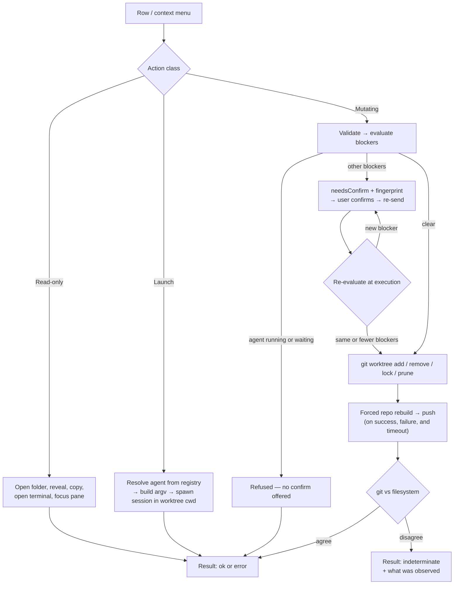

# Worktree Actions Design

> **Ref**: docs/DESIGN.md § 8.2 — the "Create / remove / lock / prune / launch" row
> **Consumer**: `asimov-plan` reads this to turn a PLAN.md task into spec deltas and builder tasks.

Everything the user can *do* from the Worktree view: navigate, create, remove, and launch
agents. Message shapes live in [worktree-rpc.md](worktree-rpc.md); this document owns the
behaviour and the safety model.

## 1. Overview

## 2. Action inventory

| Action | Class | Target | Notes |
|--------|-------|--------|-------|
| Focus pane | read-only | Agent row, window scope | Reveals the pane's view and tab |
| Open session preview | read-only | Agent row | Existing preview overlay, by `entryId` |
| Open folder — new window | read-only | Worktree | |
| Open folder — add to workspace | read-only | Worktree | Makes the worktree a workspace folder; the tree dedupes it into the same repo group |
| Reveal in OS | read-only | Worktree | Reuses the vault's existing reveal helper |
| Copy path | read-only | Worktree | Copies `displayPath` |
| Open terminal here | read-only | Worktree | New terminal tab, cwd = worktree |
| Launch agent here | launch | Worktree | § 4 |
| Resume session here | launch | Agent row with `entryId` | Existing vault resume, cwd forced to the worktree |
| Copy resume command | read-only | Agent row with `entryId` | Existing vault helper |
| Create worktree | mutating | Repo | § 3.2 |
| Remove worktree | mutating | Worktree | § 3.3 |
| Lock / unlock | mutating | Linked worktree | § 3.4 |
| Prune | mutating | Repo | § 3.5 |

Read-only actions reuse the vault's existing handlers wherever one exists — reveal, copy
path, and copy resume command already have host implementations
(`src/providers/TerminalViewProvider.ts:808`, `:843`, `:861`). The worktree variants re-resolve
the path from a `worktreeId` and then call the same code.

**An offered action must be performable on the surface offering it.** Absent, never present and
inert — the same rule the panel applies to a row that cannot act. Two consequences fall out of it,
both of which cost a review round to find:

- **Some rows cannot perform some actions.** Preview, resume, copy-resume, and the two
  agent-cwd items all need a session; a window row without one falls back to focusing its pane
  rather than offering an item that resolves to nothing.
- **Some surfaces cannot perform any of them.** The panel renders identically in the sidebar, the
  panel, and an editor tab, but an editor surface answers only the two vault READS a preview
  needs, and none of the vault action messages. It therefore declares that in the init payload
  (`vaultActionsAvailable`) and every control that would post an action is absent there — the row
  Resume button, the whole row context menu, the rename editor, and the preview overlay's own
  Resume, Continue, and Raw controls. The overlay itself still opens, because opening it is a read.

  `vaultWatchSession` is deliberately exempt: it is automatic preview lifecycle traffic rather
  than an offered control, so a surface that does not answer it drops it and loses live-follow,
  with nothing on screen claiming otherwise.

The declaration is one boolean rather than a capability set, because the split is all-or-nothing
per surface today. A surface that gains a subset of the actions is when that becomes an enum.

## 3. Mutating actions

### 3.1 Shared rules

1. **argv arrays only.** No git command is ever assembled as a shell string.
2. **Re-resolve the path host-side** from the id, per [worktree-rpc.md](worktree-rpc.md) § 3.2.
3. **Never delete files directly.** Directory removal is `git worktree remove`'s job; the
   extension does not call `rm -rf`, ever. This bounds *our* bugs, not git's consequences:
   `git worktree remove` still recursively deletes, so a wrong-but-valid path is data loss,
   not a safe failure. The invariant is worth keeping because it removes an entire class of
   path-handling bug — it is not a safety net under the ones that remain.
4. **The main worktree is never removable**, and no confirmation overrides that.
5. **Blockers are re-evaluated at execution time**, and a *newly appeared* blocker re-prompts
   rather than riding the previous confirmation (§ 3.3).
6. **Rebuild after every mutation attempt**, success or failure — see § 3.6.
7. **git's stderr is the error message.** It is bounded and shown, not replaced.

### 3.2 Create worktree

Inputs: `repoId`, `branchName`, optional `baseRef`, optional `path`, `createBranch`,
`openAfter`.

**Defaults** (`requestWorktreeCreateDefaults`):

- Path: `<root>/<sanitized branch>`, where `<root>` is the first of:

  | # | Source | Wins because |
  |---|--------|--------------|
  | 1 | `anywhereTerminal.worktree.createRoot`, when the user actually set it | An explicit statement outranks a heuristic |
  | 2 | The directory most of this repo's existing linked worktrees already live in | The repo's own convention beats ours |
  | 3 | `.claude/worktrees`, the setting's declared default | Nothing else to go on |

  Detection (2) is the mode of the parent directory of each **linked** worktree, read from the
  listing the host already holds — no extra git work. It infers the **root only, never the
  naming pattern**: one root can hold worktrees named two different ways, and a pattern
  inferred from them encodes one tool's rule as the repo's.

  A relative `createRoot` resolves against the main worktree; an absolute one is used as-is.
  That is what lets the default be a plain string rather than a template needing a repo-name
  placeholder. When the computed path exists, append `-2`, `-3`, … until free.

- Branch name: empty. A suggestion is not offered — a wrong-but-plausible branch name is
  worse than a blank field.

**The default root sits inside the main worktree.** The model supports that
([worktree-model.md](worktree-model.md) § 6): both worktrees list, and longest-prefix mapping
keeps panes attributed to the nested one. What it costs is that the new worktree is untracked
content in the parent's working tree, so a create under a root inside the main worktree adds
that root to the repository's `info/exclude` once, idempotently. That file is repo-local and
uncommitted — the right home for a layout this user chose and their collaborators did not.
`.gitignore` is never touched: it is tracked, and committing an entry on the user's behalf is
not ours to do. A failed exclusion write is reported and does not block the create — the
worktree is what was asked for, and a noisy `git status` is a nuisance, not a failure.

**Validation** (before git): per [worktree-rpc.md](worktree-rpc.md) § 4. The branch name
passes `git check-ref-format --branch`; the path must be absolute, non-existent or empty, and
outside every **linked** worktree of the repo, and not the main worktree itself. A path *inside*
the main worktree is allowed — that is where the default root lives — and is the case the
`info/exclude` handling below exists for. [worktree-rpc.md](worktree-rpc.md) § 4 is the canonical
statement of this rule; an earlier "outside every existing worktree" wording here contradicted it
and the default root in the same section.

**The create path is untrusted input, and this is the one action where that is true.** Every
other action names a host-issued id; create necessarily accepts a path for an object that does
not exist yet, so there is nothing to re-resolve it from. Three consequences:

- Validation is the *only* barrier, so it runs host-side and its result is never cached across
  a queue wait. An action that waited behind another mutation on the same repo revalidates
  against the fresh listing before it runs.
- The normalizer realpaths the nearest existing ancestor and re-appends the missing segments
  (`worktree-model.md` § 3.1). Those missing segments are not resolved, so a local process can
  create a symlink or mount inside them between validation and execution. `lstat` every
  component that does exist and refuse symlinked components; re-check the existing ancestor's
  identity immediately before spawning git. This narrows the window; it does not close it.
- Path aliasing is not fully solvable. UNC paths, mapped drives, and network mounts can denote
  one object through strings that normalize unequally. Those cases are documented as
  unsupported rather than papered over with a claim that one canonical path exists on every
  platform.

**Execution**:

| Case | Command |
|------|---------|
| New branch | `git worktree add -b <branch> <path> [<baseRef>]` |
| Existing branch | `git worktree add <path> <branch>` |
| Detached at a ref | `git worktree add --detach <path> <baseRef>` |

No `--force`. If the branch is already checked out in another worktree, git refuses and its
message — which names the other worktree — is exactly what the user needs to see.

**After success**, honour `openAfter`: `terminal` opens a terminal tab in the new path;
`agent` hands off to § 4 to launch the chosen agent in it; `newWindow` / `addToWorkspace`
open the folder; `none` just refreshes.

**The create form carries an agent picker.** Creating a worktree in order to put an agent to
work in it is one intent, and the reference UI treats it as one action — the form offers
project, branch, and agent together. Splitting it into "create" then "find the row, launch an
agent" makes the user do the composition every single time. The picker is optional
(`openAfter: "none"` is a valid choice); the launch itself is the same code path as § 4, not
a second one.

A failed launch after a **successful** create is reported as exactly that: the worktree
exists, the agent did not start. The create is never rolled back to make the compound action
look atomic — deleting a freshly created worktree because a CLI failed to spawn would destroy
the thing the user asked for in order to tidy up an error message.

#### 3.2.1 Form presentation

The form is a worktree form, not a git-plumbing form. What the user states is a **branch name**;
everything else is derived, defaulted, or advanced.

| Element | Rule |
|---------|------|
| Lead input | Branch name, and nothing above it. It is the one thing only the user can supply |
| Destination | **One derived line under the lead input**, shortened, and not a field in the common case. The exact value is carried by a tooltip and by a visually-hidden span beside the shortened text — the line's implicit role is `generic`, which prohibits naming, so an `aria-label` on it is not exposed to AT. The line is focusable so the exact value is reachable by keyboard, not by pointer alone |
| Collision | When the computed path exists and a suffix was appended, one line says so and names the result. It replaces a second full path, it does not add one |
| "After creating" | Four choices, mapping onto all five `WorktreeOpenAfter` wire values: `Nothing` → `none`; `Open a terminal` → `terminal`; `Start an agent` → `agent`; `Open the folder` → `newWindow` or `addToWorkspace`, chosen by a secondary control on that choice and defaulting to `addToWorkspace` unconditionally. The condition this default once carried — "a workspace that already has folders" — cannot be false where the control exists: the dialog returns early without repos, and a repo implies a folder. Evaluating it would have cost a wire field to answer a question with one answer. No wire value is unreachable from the form |
| Repo picker | Below the destination line when the workspace has more than one repo. "Nothing above the lead input" is a rule about order; the picker cannot go into Advanced, because the destination is derived from it and burying it would trade one contradiction for another |
| Agent block | Agent, permission posture, and first prompt are revealed **only when "After creating" is "Start an agent"**. Always-visible with "Nothing" selected states two contradictory things at once. While absent nothing agent-shaped is tabbable and the submitted draft carries no agent details |
| Advanced | Collapsed by default, holding base ref, branch source (new / existing / detached), and the path override. While collapsed none of them is tabbable. Opened, the override is the only place a full path is *editable* — a different thing from a statement of where the worktree will go. Overriding moves the stated line and withdraws the collision message, which described a derived path the create no longer takes; clearing the field withdraws the override and returns the line to the derivation |
| Dangerous posture | Offered, labelled, and never preselected. WHERE every posture an agent offers is dangerous, the control holds a non-submittable placeholder rather than falling through to its first option, and submission waits for a choice. Both doors that show the block — create and launch — gate on it; fixing one leaves the other stating the opposite |
| Submit | Disabled until the value the chosen branch source requires validates — the branch name for new or existing, the **base ref** when detaching, which is the one case the lead input is not what is being validated. Also disabled while a destination request is outstanding, and while a revealed posture list has no choice |

**Path transparency is preserved, not traded away.** The host still states the free path it will
actually take (§ 3.2), because that is a safety property: the user sees the destination before
authorizing a filesystem write. What changes is that it is stated **once**, shortened, with the
exact value one hover away — instead of twice in full in a dialog whose tree view deliberately
shows no path on any row.

**The dialog submits the offer it was opened against.** The host answers the destination question
per keystroke and its reply carries the panel's whole live repo record, agent list included.
Only the *destination* is what was asked for, so only that is taken; the agents an open dialog
shows and submits stay the ones it was constructed with. Admitting the rest relabels the user's
posture choice under them as they type, which is the same defect § 3.1's "a launch is submitted as
the offer it was shown" names for the launch door.

**Whoever owns the caret owns the text.** Nothing writes the derived path into the override field
while it holds focus. The rule lives at the write, not at its callers: the answer callback arrives
on the host's schedule and is the one caller that can land mid-edit, so a guard on any single
caller leaves that one — and every future one — open by construction.

#### 3.2.2 Where create is offered

Four entry points, each for a different way the intent arrives:

| Entry point | Rule |
|-------------|------|
| Toolbar "+" | The primary affordance, matching VS Code view-title conventions. Rendered **only** while the Worktrees body is active — a "+" in the sessions toolbar has nothing to create — and only while the tree holds a repository, because an action the view cannot perform is absent rather than present and inert. Availability comes from the tree itself; the workspace's initial "has a repo" hint is deliberately looser than git's own answer, so seeding from it showed a dead button on every cold open |
| Repo group header "+" | On hover or keyboard focus of the group header. It pre-answers the repo the dialog needs in a multi-repo workspace, matching the native SCM view's per-repo actions. Rendered only where group headers are (§ 3.1 of [worktree-panel-ui.md](worktree-panel-ui.md)) |
| Empty-state CTA | The state for a repository holding only its main checkout carries the create action in its body. Asking a user to find a 20 px icon in a toolbar is not an empty state doing its job. "No worktrees yet" and "one worktree so far" are one state under two names — a repository holds its main checkout unless its listing FAILED, and that is a degraded repository, not an unbranched one. The CTA renders beside the main row, never instead of it: every supplied worktree stays reachable exactly once, and that row carries the context-menu door |
| Row context menu | "New Worktree…" already exists — kept, as the discoverable path for keyboard and menu users |

All four open the same dialog and run the same action. The repo-scoped ones differ only in which
repo the form opens on — which means **every door asks the host about every repository**, not only
the one it names. The form builds its repository picker once from the seed it opened with, so a
door that asked about one would offer one, and the doors would differ in more than the selection.

Two rules the create-defaults conversation depends on:

- **An open form's asks carry a branch; an opening ask does not.** That is what tells an answer
  meant to OPEN a form from one meant to UPDATE the open one. The form's own staleness guard
  compares the branch an answer is for, so it cannot catch a branch-less leftover — one reaching an
  open form cleared its wait and rewrote the destination for a branch the user had already typed.
  The convention is currently unenforced by any type; a `kind` tag on the request and its answer is
  the follow-up that would enforce it.
- **A create that can no longer open says so.** The repositories a door asked about can leave the
  tree while the host resolves. The panel reports that nothing was attempted and names them, using
  the `unavailable` outcome; a control that silently does nothing when pressed is worse than one
  that is absent.

### 3.3 Remove worktree

**Blockers**, evaluated together so the confirmation can name all of them at once:

| Blocker | How it is determined |
|---------|---------------------|
| `isMain` | `kind === "main"` — unconditional refusal |
| `locked` | From the listing |
| `dirty` | `git status --porcelain` in the worktree, tracked changes present |
| `untracked` | Same command, untracked entry count |
| `idlePanes` | Panes in this window inside the worktree whose agent is not mid-turn — confirmable |
| `busyAgents` | Rows here whose activity is `running` or `waiting` — **refused, not confirmable** |
| `externalAgents` | Live registry sessions rooted in the worktree |

`idlePanes`, `busyAgents`, and `externalAgents` are worktree-view-specific and the reason this action is
worth building here rather than leaving to the terminal: removing the directory out from
under a running agent is the failure mode a worktree UI is uniquely positioned to prevent.

**Execution**: `git worktree remove <path>`, or `git worktree remove --force <path>` only
after an explicit confirmation that named the blockers. A locked worktree needs
`--force --force` — a single `--force` does not override a lock, so the documented
"confirm past a lock" path fails outright without the second flag. A `missing` worktree
removes cleanly because git prunes the registration.

**What confirmation actually authorizes.** Earlier drafts said a confirmation "permits rather
than bypasses" the check. That is true of the *unforced* path and false of the forced one, and
the difference matters enough to state plainly:

- Re-evaluating blockers before spawning git narrows the window. It does not close it. Git's
  own clean check is skipped entirely under `--force`, and even unforced removal has a gap
  between its status read and its recursive delete. A file written after the last check — by
  an agent, another window, an external editor — is deleted with everything else.
- Per-repo serialization covers this extension host only. Another VS Code window, a bare
  `git` invocation, or any other process is outside it.
- So `--force` is presented for what it is: **irrevocable deletion of everything under that
  path, whose contents may change after you confirm.** Not "you have reviewed the losses".

Two rules follow, and they are the reason this is a safety model rather than a warning label:

- **A newly appeared blocker re-prompts.** The confirmation is bound to the blocker set the
  user saw (`worktree-rpc.md` § 3.1). If execution-time re-evaluation finds a *different*
  blocker — a live agent that was not there when they confirmed dirty files — the action
  returns `needsConfirm` again rather than proceeding on authority the user never granted.
- **Force never runs against a working agent.** A row whose activity is `running` or
  `waiting` blocks removal outright, with no confirm available; the user stops the agent
  first. An idle pane remains a confirmable blocker — a terminal sitting at a prompt is a
  different risk from a turn in flight.

**Removal asks the same observation a launch does.** A repository publishes that observation
only when its own listing was read: withheld when the cache retained a listing it could not
re-read, withheld for every repository while git itself is unusable, and kept for a repository
nobody can watch — an unwatched listing was still read, it may just go stale unnoticed, and
refusing there would disable removal on every host without file watching. Like a launch, the
claim is re-asked rather than remembered: across the assessment's status and session reads,
immediately before the destructive command with no `await` in between, and again across the
post-attempt filesystem read. Evidence gathered under one observation never authorizes a
command issued under another — at the same path, that is how a replacement would be removed on
its predecessor's evidence. A mismatch reports the listing as unreadable, which is
indeterminate, not a refusal: a refusal is an answer, and nobody could read the listing it
would be derived from.

**Panes are not killed.** Removing a worktree with idle panes inside it leaves those panes
running in a deleted directory — which is what a terminal does, and what the user asked for
by confirming. The confirmation says so.

Branch deletion is **not** part of removal. `git worktree remove` leaves the branch; deleting
it is a separate decision with separate consequences, and silently bundling it would destroy
work the user believed was merely un-checked-out.

### 3.4 Lock / unlock

`git worktree lock [--reason <reason>] <path>` / `git worktree unlock <path>`. Reason is
bounded and passed as a single argv token. Lock state comes back through the normal rebuild.

### 3.5 Prune

`git worktree prune` for the repo. Offered only when the repo has at least one `prunable`
worktree, and the confirmation names how many registrations will be dropped. Prune touches
registrations, not working directories, so it is the least destructive mutating action — but
it is still confirmed, because "prune" reads as dangerous and an unexplained count is worse
than a confirmation.

### 3.6 Failure is not the same as "nothing happened"

Git mutations are **not atomic**, and treating a non-zero exit as a clean no-op is how the UI
starts describing a repository that no longer exists:

- `git worktree add -b` creates the branch, writes the administrative record, and checks out
  the tree as separate steps. A timeout kill partway leaves the branch and the registration
  behind; the next attempt then collides with a branch it appears not to have created.
- `git worktree remove` deletes the working tree and the administrative metadata separately.
  A non-zero exit can mean the directory is gone, the metadata is gone, both, or neither.

Therefore: **every mutation attempt is followed by a forced authoritative rebuild — on
success, on non-zero exit, and on timeout.** The rebuild inspects git's registration and the
filesystem; when they disagree, the result is reported as **indeterminate**, naming what was
observed, rather than as a clean failure. There is still no retry: a partially applied
mutation is for the user to resolve, and the rebuild is what gives them an accurate picture to
resolve it from.

The 10 s timeout applies to read-only listings. Mutations get a longer budget and a
cancellable path where one exists, because killing git mid-write is the thing that creates
these states in the first place.

## 4. Launch agent into a worktree

Reuses the existing launch stack rather than growing a second one: the agent registry
(`src/vault/registry.ts`), the argv builder (`src/vault/LaunchBuilder.ts`), and the launcher
that turns a resolved command into a terminal session (`src/vault/VaultLauncher.ts`).

**"Reuses" understates one gap: there is no fresh-launch contract today, and this task adds
one.** Every existing path starts from a session that already exists —
`VaultLauncher.resolve` takes a vault `entryId`, and the registry's templates are `resume`,
`fork`, and `continue`, all of which describe *returning to* a session. `continue` also
requires a prompt, while a launch from this view may legitimately have none. Starting an agent
in an empty worktree fits none of them.

So the registry gains a **start** capability alongside the resume family:

| Element | Contract |
|---------|----------|
| Start command | The agent's argv for a brand-new session, prompt optional. Declared per agent, like the resume templates, so no caller assembles it |
| Prompt delivery | Declares whether the agent can be seeded at launch. An agent that cannot is offered no prompt field, rather than being seeded by a mechanism it does not support |
| cwd composition | An explicit override that wins over the session's recorded cwd, so resume-into-a-different-worktree is expressible rather than an accident of ordering |

An agent that declares no start capability is simply not offered in this view. Leaving the
contract implicit is how two implementers invent two incompatible start APIs.

| Step | Behaviour |
|------|-----------|
| Agent choice | From `VAULT_AGENT_IDS`; only agents whose executable resolves are offered |
| Permission choice | From the agent's `permissionChoices`; a `dangerous` choice is labelled as such and never preselected |
| Prompt | Optional. Delivered by the agent's own prompt mechanism — never by concatenating into a shell string |
| Working directory | The worktree path, always. This is the one place the existing `cwdPolicy: "preserve"` does not apply, because the user picked the directory explicitly |
| Session creation | The launcher's existing session-creation path, with `isAgentLaunch` set |

Two rules carried from the research:

- **Prefer a native prefill over pasting.** When the agent supports seeding its composer at
  launch, use it; pasting into a TUI that has just started is a race
  (`docs/research/20260822-orca-deep-dive/05-prompt-injection.md` § 5.9).
- **Never send text and Enter in one write.** If a prompt must be delivered by writing to the
  pty, the submit is a separate write after the composer is provably ready. Combining them
  leaves the prompt editable and unsent (`05-prompt-injection.md` § 1). No agent takes this
  path today: every agent this view offers declares native seeding, so the pty writer and the
  readiness signal it would need are deferred rather than built unused (PLAN.md § Deferred).

**Which launch this is.** A launch is one immutable intent, minted where the user picks the
worktree and re-checked where it is acted on. The intent quotes the observation the panel
rendered — a per-repository number the tree cache advances whenever it re-reads that
repository — and the host admits the launch only against the same number. Nothing git reports
can carry this: a worktree removed and recreated on the same branch at the same commit at the
same path lists identically, and git reuses `.git/worktrees/<name>` after a deletion. The
number is therefore the cache's own claim about what it observed, not a fact derived from
repository state.

The claim is re-asked, never remembered, at every point where reading and acting are separated
by an `await` — dialog open, menu build, submit, and again after the launch options resolve. A
launch that spans two observations is refused rather than aimed at whatever occupies that path
now. The one deliberate exception is create-then-launch: the worktree the create just made is
not yet in the host's tree, so requiring an observation there would refuse the ordinary path.

Resume-into-worktree is the same path with the vault's existing resume command, with the cwd
overridden to the worktree instead of the session's recorded cwd.

## 5. Error Handling & Limits

| Condition | Behavior | User-Facing Result |
|-----------|----------|--------------------|
| Validation failure | Reject before git | Field-level error in the form |
| Blocked destructive action | `needsConfirm` with every blocker | Confirmation naming the path and what is at risk |
| `isMain` with force | Refuse | Explains the main worktree cannot be removed |
| Git non-zero exit | Surface stderr, bounded; forced rebuild; indeterminate if state disagrees (§ 3.6) | Inline error under the row, tree reflects reality |
| Git timeout | Kill, forced rebuild, report what was actually left behind | Inline error naming the observed state |
| Removal blocked by a running or waiting agent | Refused outright; no confirm offered | Explains which agent must be stopped first |
| A blocker appeared since the confirmation | `needsConfirm` again with the new set | Second confirmation naming what changed |
| Agent executable not found | Launcher's existing not-found error | Existing error surface |
| Path not writable | Detected in `requestWorktreeCreateDefaults` and re-checked at execution | Form error before any git work |
| Action on a stale id | Reject, force rebuild | Inline error, tree refreshes |
| Concurrent mutating actions on one repo | Serialized per `repoId` | Second action waits, then re-resolves |

### Fallback Chain — none

Mutating actions have **no fallback and no retry**. A failed `git worktree add` is reported
and the user decides. Retrying a partially-applied git mutation is how a recoverable error
becomes an unrecoverable one.

## 6. Edge Cases

| Condition | Behavior |
|-----------|----------|
| Create with a branch checked out elsewhere | Git refuses; its message names the other worktree |
| Create where the computed default path exists | Suffix until free; the form shows the final path before submit |
| Create into a path inside a linked worktree | Rejected in validation |
| Create into a path inside the main worktree | Allowed — the default root is there; the root is added to `info/exclude` |
| Repo whose linked worktrees already live elsewhere | Detection wins over the default; the form shows the detected root |
| Remove a worktree that is a VS Code workspace folder | Allowed after confirmation; VS Code is left showing a missing folder, and the confirmation says so |
| Remove a `missing` worktree | Succeeds; registration pruned |
| Remove while a pane inside it is running an agent | Refused — a running window-owned pane carries no confirmation that could authorize it; panes are left alive |
| Lock an already-locked worktree | Git no-ops or errors; surfaced verbatim |
| Prune with nothing prunable | Action not offered |
| Launch an agent into a `missing` or `bare` worktree | Not offered |
| Launch while the agent is already running there | Allowed — a second session in the same worktree is legitimate |
| Two windows removing the same worktree | Second gets git's error; both rebuild |

## 7. Security

| Surface | Control |
|---------|---------|
| Branch / ref / path from the webview | Validated per [worktree-rpc.md](worktree-rpc.md) § 4; leading `-` rejected; argv arrays only |
| Path traversal | Actions on **existing** objects re-resolve host-side from a host-issued id. **Create is the exception**: it takes an untrusted candidate path, canonicalized and validated host-side, with the residual TOCTOU stated in § 3.2 |
| Directory deletion | Never performed directly; delegated to git, whose deletion is still recursive and irreversible (§ 3.1 rule 3) |
| Prompt text | Passed as an argv token or through the agent's own prefill; never interpolated into a shell command |
| Environment | **Known limitation, pre-existing.** `PtyManager.buildEnvironment()` clones the entire extension-host `process.env` (`src/pty/PtyManager.ts:193-201`) and the agent's `authEnvAllowlist` is merged *over* that clone rather than filtering it. A launched agent — and every subprocess it spawns — therefore inherits whatever the host holds: `GITHUB_TOKEN`, `AWS_*`, npm and cloud credentials. This affects every vault launch today and is not introduced by this feature, so it is recorded here rather than fixed inside it. Any doc claiming the allowlist restricts the launch environment is wrong; it only adds to it |

## 8. Testing

### Test Cases

- [ ] Create with a new branch → `worktree add -b`, tree gains the row, `openAfter` honoured
- [ ] The create form shows the resolved destination exactly once, shortened, with the full path in its hint
- [ ] A collision line names the suffixed result and does not restate the full path
- [ ] The agent block is absent while "After creating" is not "Start an agent", and appears when it is
- [ ] Every one of the five `WorktreeOpenAfter` values is reachable from the form's choices
- [ ] A create path under the default root inside the main worktree is accepted; one inside a linked worktree, and the main worktree itself, are rejected
- [ ] Advanced is collapsed by default; the path override appears only when it is opened
- [ ] The toolbar "+" is present in the Worktrees body and absent in every sessions body
- [ ] The repo group header offers create on hover and on keyboard focus, opening the form on that repo
- [ ] The "no worktrees" and "one worktree" empty states carry the create action in the body
- [ ] All four entry points open one dialog and run one action
- [ ] Create with an agent → worktree created, then the agent launched in it through the same path as a standalone launch
- [ ] Create succeeds, launch fails → reported as created-but-not-started; the worktree is not rolled back
- [ ] Create with no agent chosen → no launch attempted
- [ ] Create with an existing branch → `worktree add <path> <branch>`, no `-b`
- [ ] Create with a branch already checked out → git's error surfaced verbatim
- [ ] Create default path collides → suffixed, and the suffixed path is what the form shows
- [ ] Create path inside a linked worktree → rejected before git runs
- [ ] Default root with nothing configured and no linked worktree → `.claude/worktrees` under the main worktree
- [ ] Repo whose linked worktrees share another parent → that parent is the suggested root; a set named two different ways still yields one root and no inferred naming pattern
- [ ] An explicitly configured `createRoot` outranks detection; a relative value resolves against the main worktree
- [ ] Create under a root inside the main worktree → the root is excluded once via `info/exclude`, and a second create adds no duplicate entry
- [ ] The exclusion write fails → the create still succeeds and the failure is reported
- [ ] Branch name `-x` / invalid ref → rejected by validation
- [ ] Remove clean, unlocked, no panes → runs without confirmation
- [ ] Remove dirty → `needsConfirm { dirty: true }`, no git run
- [ ] Remove with idle panes → `needsConfirm { idlePanes: N }`
- [ ] Remove with an external agent inside → `needsConfirm { externalAgents: N }`
- [ ] Confirmed remove → `--force`, idle panes still alive afterwards
- [ ] Remove with a `running` or `waiting` agent inside → refused outright, no confirm offered
- [ ] Confirmed for dirty, then a live agent appears before execution → `needsConfirm` again, git never runs
- [ ] Confirmed remove of a **locked** worktree → `--force --force`, since one `--force` does not override a lock
- [ ] `worktree add` killed by timeout → forced rebuild reports the branch and registration that survived, as indeterminate, not as a clean failure
- [ ] Removal exiting non-zero with the directory already gone → reported as indeterminate with what was observed
- [ ] Create path validated, then a symlink appears in a not-yet-existing segment → refused at the pre-spawn re-check
- [ ] Create queued behind another mutation → revalidated against the fresh listing, not the cached one
- [ ] Remove main with force → refused
- [ ] Remove leaves the branch intact
- [ ] Remove a missing worktree → succeeds
- [ ] Lock / unlock round-trips into the next listing
- [ ] Prune not offered with nothing prunable; confirmation names the count when it is
- [ ] Two mutating actions on one repo serialize
- [ ] Launch agent → session created with cwd = worktree and `isAgentLaunch` set, through the registry's start capability rather than a resume template
- [ ] Launch with no prompt → succeeds; no template that requires a prompt is used
- [ ] Agent declaring no start capability → not offered in this view
- [ ] Resume into a different worktree → the cwd override wins over the session's recorded cwd
- [ ] Launch with a dangerous permission choice → labelled, not preselected
- [ ] Launch with a prompt → prefill preferred; when written to the pty, text and Enter are separate writes
- [ ] Every git invocation is an argv array
- [ ] No code path in this feature deletes a file or directory directly

---

> **Sync rule**: the § 1 diagram must show the same action classes as § 2.
> **Registry**: values this doc shares with others belong in [DESIGN.md](../DESIGN.md) § 10 — do not keep a second copy here.
