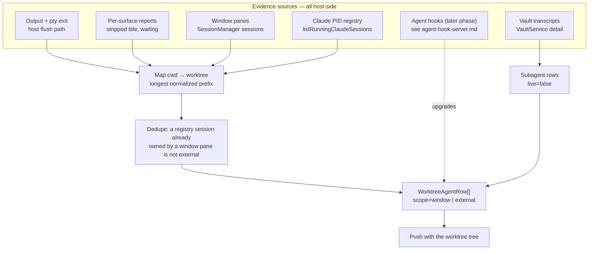
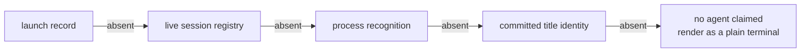

# Worktree Agent Presence Design

> **Ref**: docs/DESIGN.md § 8.2 — the "Pane→worktree mapping, agent identity, activity, external rows, subagents" row
> **Consumer**: `asimov-plan` reads this to turn a PLAN.md task into spec deltas and builder tasks.

How a worktree row learns which agents are working inside it. Owns the **evidence model**:
what we know, how strongly, and what we are forbidden to claim. The worktree entities
themselves come from [worktree-model.md](worktree-model.md); rendering from
[worktree-panel-ui.md](worktree-panel-ui.md).

## 1. Overview



## 2. Data Model

```
WorktreePresence {
  rowsByWorktreeId: Record<string, WorktreeAgentRow[]>   // key = WorktreeInfo.id
  scannedAt:        number       // epoch ms of the scan that produced these rows
  degradedSources:  PresenceDegradation[]   // empty when every source succeeded
}

PresenceDegradation {
  source: "panes" | "registry" | "vault" | "hook"
  reason: string                 // shown verbatim in the stale affordance
  since:  number                 // epoch ms of the first consecutive failure
}

WorktreeAgentRow {
  rowId:        string           // stable across rebuilds — see § 3.5
  scope:        "window" | "external"
  paneId?:      string           // AT session id; present iff scope === "window"
  viewId?:      string           // which webview hosts the pane; window scope only
  title?:       string           // pane title, decoration-stripped (§ 3.4)
  preview?:     string           // last transcript activity, bounded at read (§ 3.8); NOT frame-stripped
  model?:       string           // agent-reported model label, when known
  agent?:       VaultAgentId     // omitted when identity is unproven
  agentSource:  "launch" | "process" | "registry" | "title" | "none"
  activity:     "running" | "waiting" | "idle" | "exited"
  activitySource: "hook" | "output" | "title" | "registry" | "none"
  entryId?:     string           // vault `<agent>:<sessionId>` once resolved
  startedAt?:      number        // when this row's agent was first seen
  stateStartedAt?: number        // when the current `activity` began — drives the age column
  finishedAt?:     number        // when the last turn ended; set only while `idle` after work
  lastActivityAt?: number        // newest evidence timestamp — the worktree ordering key
  pid?:         number           // external rows only
  delegations?: DelegationRoster  // absent = never read — see § 3.6
}

DelegationRoster =
  | { kind: "ok", rows: WorktreeSubagentRow[], incomplete?: boolean }
  | { kind: "failed", reason: string }

WorktreeSubagentRow {
  name:     string               // agent type, or the invoking tool when undeclared
  title?:   string
  status:   "running" | "completed" | "failed" | "unknown"
  live:     false                // ALWAYS false until the hook phase lands — see § 3.6
  entryId?: string               // drill-down into the vault detail
}
```

`activity` reuses the vocabulary of the existing webview tracker
(`src/webview/terminal/TerminalActivityTracker.ts:1`) and adds `exited`. `agent` reuses
`VaultAgentId` from `src/vault/types.ts:27`; presence never invents an agent id.

**The evidence tuple is not collapsed to one status.** `agentSource` and `activitySource`
travel to the webview intact so the dot, the icon, and any future notifier each apply their
own rule — the split-evidence lesson from
`docs/research/20260822-orca-deep-dive/06-completion-notifications.md` § 1.

**There is no separate `confidence` field, deliberately.** Confidence is a *function of* the
source, and a single field cannot carry two answers: a pane can have authoritative identity
(it was launched by us) and fallback activity (we only see output), or the reverse (title-only
identity, hook-published activity). One field forces a lossy choice between them. Each
consumer derives what it needs from the source it is reasoning about:

| Field | Authoritative when | Fallback otherwise |
|-------|--------------------|--------------------|
| `agentSource` | `launch`, `registry`, `process` | `title`, `none` |
| `activitySource` | `hook`, `registry` | `output`, `title`, `none` |

Deriving it costs one lookup and makes the impossible states unrepresentable.

## 3. Algorithm / Logic

### 3.1 Window panes → worktrees

For every live session in this window (`SessionManager` is window-scoped, so its session set
*is* the window scope the user asked for):

1. `cwd = session.currentCwd ?? session.initialCwd`. Absent → the pane produces no row.
2. `normalizeWorktreePath(cwd)` (see [worktree-model.md](worktree-model.md) § 3.1).
3. Longest-prefix match against every known `WorktreeInfo.id`, on **segment boundaries**:
   `/repo/feature-x` must not match a pane in `/repo/feature-x-old`. Compare
   `cwd === id || cwd.startsWith(id + sep)`.
4. Longest match wins, which is what makes a worktree nested inside another worktree
   attribute correctly.
5. No match → the pane belongs to no worktree in this workspace and is not rendered.

A pane can appear under exactly one worktree. A worktree can hold many panes.

### 3.2 Agent identity per pane

Resolved in this precedence, first proven answer wins:

| Rank | Source | Evidence | Derived confidence |
|------|--------|----------|--------------------|
| 1 | `launch` | The pane was spawned by the vault launcher for a known agent | authoritative |
| 2 | `registry` | The pane's pty subtree contains a live agent session (Claude today, via `resolveClaudeSession`) | authoritative |
| — | | **Windows caveat**: `descendantPids` supports darwin and linux only and returns an empty list elsewhere (`src/pty/processTree.ts:83-95`), so on Windows rank 2 degrades to its cwd fallbacks. Identity there rests on ranks 1, 4 and 5, and the UI's fallback marker is correspondingly common | |
| 3 | `process` | Process-tree recognition of the foreground descendant | authoritative |
| 4 | `title` | The pane title *commits* to an agent name | fallback |
| 5 | `none` | Nothing proved it | fallback |

Two rules the research pins and this design adopts:

- **Token-boundary matching only.** Any name test uses
  `(?<![\w./\\-])name(?:\.(exe|cmd|bat|ps1))?(?![\w./\\-])`, never `includes`. Without it
  `openclaude ⊃ claude` and `android ⊃ droid` produce false identities
  (`01-agent-detection.md` § 3.1).
- **A spinner is not an identity.** A title showing only a braille frame, `✳`, `. ` or `* `
  proves *something* is running and feeds `activity`; it never sets `agent`. Committed
  identity requires the title to actually name an agent (`01-agent-detection.md` § 3.2,
  `06-completion-notifications.md` § 1).

Rank 3 requires a process-recognition table. It does not exist in the codebase today, so
until it lands only ranks 1, 2, 4 and 5 can fire — meaning Codex and OpenCode panes resolve
by title or not at all. That is stated as a limitation in the UI, not papered over.

### 3.3 Activity per pane

| `activity` | Condition | `activitySource` |
|-----------|-----------|------------------|
| `exited` | The pty exited **while the pane is still open** | `output` |
| `waiting` | Waiting evidence is set for the pane | `output` |
| `running` | Output seen within the idle window, or semantic working evidence | `output` |
| `idle` | A shell name in the title overruled live work | `title` |
| `idle` | None of the above | `output` |

`activitySource` names the rule that **decided**, not the state it landed in. `idle` is reached
three ways, so an idle pane that merely happens to carry a shell title is `output` — crediting the
title there reports a cause that was not one. The projection therefore returns the winning rule
alongside the activity rather than letting each consumer re-derive it.

These are the same rules `TerminalActivityTracker` applies — literally the same, since both
sides now call the projection extracted into `src/shared/paneEvidence.ts` — but **presence
cannot consume that tracker**, and assuming it can is a mistake worth stating plainly:

- The tracker is **webview-side**. It is constructed in the webview entry point and reads
  that webview's own terminal store (`src/webview/main.ts:96`). Presence is projected in the
  extension host, which has no access to it.
- The tracker is **per-surface**. Each of the three webview surfaces — sidebar, panel, editor
  — runs its own instance over its own panes. The sidebar's tracker cannot see a pane living
  in the editor. Since this view's scope is *the window*, a per-surface tracker is
  structurally the wrong source.

So the host projects activity itself, from evidence held per pane in a window-scoped registry
(`src/session/PaneEvidenceStore.ts`) that surfaces report into and the host writes directly.
The projection **rules** are shared with the tracker — extracted as pure logic used by both
(`src/shared/paneEvidence.ts`) — so the two cannot drift into disagreeing about what
`running` means. Duplicating the rules instead of sharing them is how the tab bar and the
worktree row end up showing different states for the same pane.

#### The host evidence seam

The rules are the easy half. The inputs are the part that does not exist yet, and this
section is the contract for building it — it is a **transport design**, not an implementation
detail to be discovered during the task.

| Signal | Host already owns it? | How presence gets it |
|--------|----------------------|----------------------|
| Pane exists / destroyed / cwd | Yes — `SessionManager` is the registry | Direct read, plus lifecycle events it must now emit |
| Pty exit | Yes | Existing exit path |
| Output seen | Yes — the host buffers and flushes every pane's output | Tap the same flush point; a timestamp per pane, not the bytes — recorded when the surface takes delivery, so host and tab count the same output |
| Semantic agent status | Yes — the host **sends** these to the webview (`SessionManager.ts:1444`) | Read at the source instead of round-tripping |
| Pane title | **No** — the title is xterm state, known only inside the webview | Each surface reports its panes' decoration-stripped titles to the host |
| Waiting evidence | **No** — derived in the webview tracker today | Reported by the surface, on its own message — the derivation stays where the xterm state it reads lives |

Two of those six flow the wrong way today, so the seam needs a webview→host direction that
does not currently exist. Its contract:

- **Report normalized values, not raw ones.** Titles are decoration-stripped (§ 3.4) *before*
  they are sent. An unstripped title turns every spinner frame into a message, a presence
  rebuild, and a push — the animation-rate failure this design exists to avoid.
- **Report on change, not on a timer**, and only for panes that surface owns.
- **The host deduplicates by pane id, not by surface.** The same pane can be reported by more
  than one surface; last write wins, and they agree because the value is normalized.
- **A surface's disposal retracts nothing.** Panes outlive the surfaces that render them, so
  a closed sidebar must not blank the titles it was reporting.
- **Evidence lives as long as the pane, which is not as long as its session.** A pty exiting
  naturally removes the session from `SessionManager` while the tab is still on screen showing
  `[Process exited]`, and that tab must keep reading `exited`. Evidence is therefore discarded
  by pane closure — one pane closing, or a whole view closing and taking its panes with it —
  never by the session leaving the map. Closing a pane and closing a view are two distinct
  paths in `SessionManager`, and both must discard.
- **Title and waiting evidence travel independently.** A message carries the fields that
  changed and no others, so reporting a title never restates a waiting value the call did not
  observe. An empty title is a reported value, not the absence of one: a program that clears
  its title has stopped claiming to be anything, which is different from a pane no surface has
  reported yet.
- **Absence is not `none`.** A pane no surface has reported yet has *unknown* title evidence,
  which falls through to the next identity rank — it does not resolve to "no agent".

Because titles and waiting evidence arrive asynchronously and per-surface, a pane can be
projected before its title has ever been reported. That is expected and is exactly why
identity has ranks below `title`: the row renders with what is proven now and sharpens on the
next push.

**Degraded-scan stickiness.** When a scan of any source fails or times out, keep the last
good rows, append a `PresenceDegradation` naming that source and its reason, and never
rewrite a `running` row to `idle` on the strength of a failed scan. A failed scan is an
absence of evidence, not evidence of absence. A source that recovers drops its entry; the
`since` timestamp lets the UI distinguish a blip from a source that has been down for an hour.

### 3.4 Title handling

Titles arrive per keystroke-frame from spinner animations. Before a title is compared,
diffed, or used for identity, strip decorative frames: braille `U+2800–U+28FF`, quarter
circles `U+25D0–U+25D3`, then collapse whitespace. `⠋ Fix tests` and `⠙ Fix tests` must
compare equal, otherwise every animation frame is a presence rebuild and a re-render
(`06-completion-notifications.md` § 4).

### 3.5 External rows — agents running outside this window

The user's scope is this VS Code window, but Claude's PID registry is machine-wide. A
worktree with a live agent started from another window or a bare terminal must not render as
"nobody is working here" — a worktree view that under-reports is worse than one that says
"external".

1. `listRunningClaudeSessions()`, liveness-probed, deduped, and returning a **typed outcome**:
   a registry directory that does not exist is `ok` with no sessions — a machine where Claude
   never ran genuinely has none — while any other read failure is `failed` and carries its
   reason. Mapping both to an empty list is what would silently clear every external row on a
   permissions error, and it is what the degraded-stickiness rule below triggers on. A record
   earns its place: the numeric filename stem must equal the payload pid (Claude writes
   `${process.pid}.json` carrying `pid: process.pid`, so a mismatch is malformed by
   construction and could otherwise impersonate whatever live process it names), the session id
   must pass the same canonical guard every Claude reader uses, the cwd must be absolute, and a
   launch time is honoured only when finite and non-negative.
2. Drop headless one-shots via `isHeadlessSession` — `claude -p` hook subprocesses are the
   single largest source of phantom "an agent is running" rows (`01-agent-detection.md`
   § 3.3).
3. Normalize each session's `cwd`, map to a worktree by § 3.1.
4. **Dedupe against window panes**: resolve each window pane's session id (the existing
   `resolveClaudeSession` path) — every pane this rebuild resolved, not merely the panes that
   produced rows. A registry session already claimed by a pane is that pane's row — never a
   second, external row. The limit is deliberate: a pane inside no worktree emits no row, so
   its session can still surface as external under the registry's own cwd.
5. What survives becomes `scope: "external"`, `agentSource: "registry"`,
   `activitySource: "registry"` — authoritative for identity by the § 2 derivation — with
   `activity: "running"` only while the pid is alive. There is no turn-level state without
   hooks, so an external row reports `running` (a live agent process) and never `waiting`.

**A failed read retains, it does not clear.** The last successfully indexed session list is
re-attributed against the current worktrees and the scope is marked degraded with the reason,
so an unreadable registry leaves the rows standing rather than emptying them. Pane identity is
told the registry failed rather than handed that retained list: resolving a pane against a list
the failed read did not produce would manufacture identity evidence, where retaining what the
pane last proved is both honest and cheaper.

**External rows are non-focusable by contract.** There is no pane in this window to reveal.
Their affordances are: open that worktree's folder, resume the session in a new terminal
here, copy the resume command. Any UI that offers "focus" on an external row is a bug.

`rowId` is `window:<paneId>` or `external:<agent>:<sessionId>` — stable across rebuilds so
expansion state, focus, and scroll survive a push.

### 3.6 Subagent rows — post-hoc, and labelled as such

Subagents come from the vault transcript, which is written *after the fact*: the reader sees
`subagentSession` / `subagent` timeline items (`src/vault/types.ts:238`, `:318`) for a
resolved `entryId`. That yields a true roster of what the session delegated, but it is not a
live roster — a subagent that started two seconds ago may not be on disk yet, and one that
finished may still read as `running` in a stale record.

Therefore:

- `WorktreeSubagentRow.live` is hard-coded `false` in this phase. The field exists so the
  hook phase can flip it without a shape change.
- Subagents are fetched **lazily**, only when a row is expanded, and only for rows that have
  an `entryId`. Never on every tree push — that would read every transcript on every
  watcher event.
- The UI must render them as history, not as live workers (see
  [worktree-panel-ui.md](worktree-panel-ui.md) § 4).
- **A roster that could not be read is not an empty one.** The outcome is typed
  (`DelegationRoster`), because an optional array collapses three different answers — not
  asked yet, asked and none found, could not be read — into one shape, and the last two are
  the pair a view must never confuse. `incomplete` is the reader's own admission that it
  dropped records; nothing at this seam ever proves a roster is the whole of what the session
  delegated, so completeness is only ever the absence of evidence of omission.
- **A delegation is one row, whatever the source recorded.** A transcript may hold a
  delegation twice — once as the invocation step, once as the child session it produced — and
  the reader owes one timeline item per invocation, the openable one where both exist. This is
  the vault reader's job, not presence's: only the reader knows which of its own bounded
  windows dropped what, and de-duplicating downstream by name would fold genuinely repeated
  delegations into one.

Two structural rules hold in both this phase and the hook phase, because they follow from what
a subagent *is* rather than from where the data came from:

- **A subagent has no pane.** It runs inside its parent's session. Activation therefore
  targets the parent row's `paneId`; the subagent row carries no pane identity of its own and
  must never be offered a focus target that does not exist.
- **Children inherit the parent's freshness.** When the parent row's evidence goes stale,
  every child decays with it in the same pass. A stale parent cannot have provably-working
  children, and letting one child keep a `running` status after its parent went unknown is how
  a roster starts describing work that ended long ago.

Nesting is exactly one level deep. A subagent that itself delegates is not rendered as a third
level — the roster reports a flat child list per parent, and inventing depth the source does
not report would be a claim about structure we cannot support.

After the hook phase lands, the live roster from `SubagentStart` / `SubagentStop` supersedes
the transcript-derived rows for panes with a fresh hook status, and `live` becomes true for
those. Transcript-derived rows remain the fallback for panes with no hook evidence.

### 3.7 Rebuild triggers

| Signal | Rebuild scope |
|--------|---------------|
| Pane created / destroyed / exited | Presence only |
| Pane cwd changed (OSC 7) | Presence only |
| Pane activity status changed | Presence only |
| Worktree tree rebuilt | Presence (mapping targets moved) |
| Periodic external-session scan | External rows only |

Presence rebuilds are **coalesced with the same 150 ms debounce** the tree uses, and the two
are pushed together so the webview never renders rows against a tree that does not contain
their worktree.

The external scan is the one polled source, because the PID registry emits no events. **Poll
it at a flat 5 s while the Worktree view is the active segment on at least one surface, and
not at all otherwise.** The scan is a readdir, a JSON parse per entry, and a `kill(0)` — low
single-digit milliseconds. It is priced that way only because the poll runs an **external-only
projection**: the pane pass is skipped and the last full pass's window rows, ranks and pane
degradation are replayed, so a poll costs no process-table read. Replay is refused — and a full
pass runs — when the worktree MEMBERSHIP has moved, never merely its order, since presence
re-ranks the tree and a positional test would reject the replay after every ranking change. A
poll also runs the full pass while pane evidence is outstanding, which it is until a full pass
that read the panes completes and says so. Tiered cadences with jitter would be more machinery
than the thing being paced, and the cost of getting the tiers wrong exceeds anything they save.

"Active on at least one surface" is a window-level fact assembled from per-surface reports:
three surfaces render this view independently, so the scan pauses only when none of them is
showing it.

**Worktree ordering by presence is owned here**, not by the tree. The listing in
[worktree-model.md](worktree-model.md) § 3.4 ranks worktrees with live panes above the rest,
newest activity first; the ranking key is `max(lastActivityAt)` over that worktree's rows,
supplied by this projection. Order is baked into the cache when a repo is assembled, so
presence-only work re-ranks the cached tree in place — but only while the cache has not yet
applied the ranking the projection holds. That is tracked as a revision the CACHE
acknowledges, never as "did the last projection differ": a projection the host discarded
still advances the projector, and an assembly that writes one repo, or retains a degraded
repo's existing rows, has not established a cache-wide order it could acknowledge. Before
presence has resolved, every worktree ranks as having none, so the order stabilizes on the next
push rather than reshuffling mid-render.

### 3.8 The preview line — last activity, read from the tail

`preview` is the session's last usable message. It is read from the **end** of the transcript,
never derived from the pane title and never routed through the vault detail reader.

The detail reader is the obvious reuse and the wrong one: it streams a whole transcript to build a
classified timeline in order to expose one line. A transcript is the one thing here that actually
grows — tens of megabytes for a long session whose last message is still one line — so the read is
a positioned read of the file's last bytes, split on newlines and walked backwards to the first
record the format calls usable. Cost is flat in transcript size.

**Coverage is file-backed transcripts only: Claude JSONL, and Codex when its rollout file exists.**
Not OpenCode (its content is SQLite `message`/`part` rows, with no transcript path exposed), not
Cursor (whose own accepted requirements forbid a listing from opening `store.db`). This is a
property of what the providers expose, not a shortcut.

Two bounds, because "return the last message" and "never read the head" cannot both hold
unconditionally — one record can be larger than any window:

| Bound | Effect |
|---|---|
| Window growth cap | The tail window doubles up to a ceiling; a record not fully seen by then is given up on |
| Line bound | The line is `boundedPreview`-bounded (≤120 chars, newlines collapsed) at the point it is READ, so nothing unbounded crosses IPC or enters the render signature |

Both give up as *absence*, which § 5 treats as an ordinary row rather than a degradation.

**One owner for freshness, rate, and cache — a preview service, not the projector.** The projector
gets the same optional one-argument dep shape `sessionTitle` has (`sessionPreview(entryId)`) and
stays ignorant of files. Behind that call:

| Concern | Answer |
|---|---|
| Freshness | `(mtimeMs, size)` against the stamp held for that `entryId` — the vault list path's own gate. Equal → the held line, nothing opened. `mtimeMs` alone is not enough: coarse granularity hides two writes in one tick |
| Rate | A minimum re-check interval per `entryId`. A full projection can run at the 150 ms debounce cap; without this, syscalls are rows × ~6.7/s during continuous pane activity. Perceivable freshness is seconds, not milliseconds |
| Retry | Deliberately separate from the interval. Re-checking a known file is a `stat`; resolving one that is not there yet is a uuid scan over a history-sized, never-pruned sessions tree. Consecutive looks that achieve nothing decay their own retry; a look that confirms a stamp or completes a read restores the interval. The entry that produced a resolved target is cached beside it, so a healthy row's re-check asks neither the vault nor the store where its transcript is |
| Duplicate reads | One in-flight promise per `entryId`; concurrent askers await it |
| Eviction | An LRU bound on entry count, owned here — the projector holds no stamp and passes no alive set, so it cannot evict for the service |

The cache is in memory and dies with the extension host. **No on-disk preview cache**: it would be
a mutable resource whose failure outlives the request, to save one tail read per session per window
session. The `0o600` list cache is untouched, and nothing about egress changes.

```
scan ──▶ row has entryId? ──no──▶ no preview
             │yes
             ▼
      sessionPreview(entryId)
             │
             ├─ within re-check interval? ──yes──▶ held line, no syscall
             ├─ stat ──▶ stamp unchanged? ──yes──▶ held line, no open
             └─ tail read ──▶ bounded line ──▶ store {stamp, line}
```

**The preview never meets the title's stripper.** § 3.4 strips decorative frames because a leading
`⠋` or `- ` in a pane title is an animation frame. In prose it is content: `- item` becomes `item`,
and a line that is only a marker becomes `""`, which draws no second line at all. The preview is
transcript message text with known provenance, so it is bounded and newline-stripped by its reader
and frame-stripped nowhere. § 3.4's contract for `title` is unchanged.

## 4. Interface

Presence has no RPC of its own. It rides on the worktree tree push and one lazy detail call:

| Operation | Identifier | Summary |
|-----------|-----------|---------|
| Push | `worktreeTreeResponse` | Carries `WorktreePresence` alongside the tree |
| Lazy read | `requestWorktreeSubagents` | Subagent rows for one expanded agent row |
| Focus | `worktreeFocusPane` | Reveal a window-scope pane |

> **Full contracts**: [worktree-rpc.md](worktree-rpc.md) § 2

## 5. Error Handling & Limits

| Condition | Behavior | User-Facing Result |
|-----------|----------|--------------------|
| PID registry unreadable | Previous external rows retained, a `registry` degradation appended | Window rows still render; a stale-data affordance names the source |
| PID registry readable and genuinely empty | External rows cleared, no degradation | The worktree honestly shows nobody outside this window |
| A surface never reports a pane's title | That pane's title evidence is unknown, not `none` | Identity falls to the next rank; no false "plain terminal" |
| Session resolution times out | Keep the row's previous identity | No flicker to "unknown agent" |
| Pane cwd never resolves | Pane produces no row | Absent from every worktree |
| Transcript read fails for subagents | Expansion shows an inline error, row stays | Rest of the tree unaffected |
| Registry session has a cwd outside every worktree | Dropped | Not shown anywhere |
| Same session id in a pane and the registry | Pane row wins | One row, not two |
| No preview: unresolved session, an uncovered source, or a read that found nothing | The row carries no `preview` key and `degradedSources` is untouched | A row with a blank second line — the ordinary case, not a warning. A preview is optional enrichment; nothing about identity, activity, or ranking reads it |

### Fallback Chain — agent identity



## 6. Edge Cases

| Condition | Behavior |
|-----------|----------|
| Pane `cd`s from worktree A into worktree B | Row moves on the next cwd event; no duplicate |
| Pane in the repo root but not in any worktree path | Impossible — the main worktree *is* the repo root |
| Two panes running the same agent session (split, `tmux`-style) | Two rows; both may resolve to the same `entryId` — allowed and rendered |
| Worktree disappears while a pane is inside it | The worktree row shows `missing`; the pane row stays attached so the user can see what is stranded |
| Agent exits but its shell stays alive | `activity: "idle"`, identity retained from its last proven source |
| The pane's pty exits, tab still open | `activity: "exited"` — this is the **only** producer of that value, and it is durable for exactly as long as the tab is |
| Pane closed entirely | Row removed on the next rebuild. A closed pane is not an `exited` pane; nothing durable remains to describe |
| Registry entry with a dead pid | Filtered by the existing liveness probe |
| `claude -p` hook subprocess | Excluded by `isHeadlessSession` |
| Title flips to `zsh` / `bash` / `pwsh` | Strong evidence the agent ended: force `idle`. A *neutral* title (`Terminal`) is not such proof |
| Spinner-only title | Never `agent`, and never `activity` either. Decoration is stripped before a title reaches the host, so the host sees one report and cannot tell a spinner still animating from one frozen at the moment its process hung — deriving `running` from it would make a hung agent read as working forever. The evidence an agent is working is the **output** a live spinner produces, not the title it left behind |
| A transcript is deleted or moved under a row that had a preview | The next look drops the resolved target and goes back to the vault for the entry rather than re-`stat`ing a dead path |
| A preview line that is only `-` or opens with `- ` / `* ` | Rendered verbatim (§ 3.8) — it is message text, not a spinner frame |
| Hundreds of panes | Mapping is O(panes × worktrees) with a small worktree count; bounded by § 7 |

## 7. Scale & Performance

| Dimension | Growth Axis | Bound |
|-----------|-------------|-------|
| cwd→worktree mapping | panes × worktrees per rebuild | Both are tens at most; prefix match is string work only |
| Session resolution | per pane, per rebuild | Cached per `(paneId, cwd, ptyPid)`; only re-resolved when one changes |
| Process-table reads | per scan | Must be deduped behind a short-TTL snapshot so N panes cost one `ps`, not N. **This snapshot does not exist yet**: `descendantPids` shells out to a full-process-table `ps` on every call with a 500 ms timeout and no cache (`src/pty/processTree.ts:83-102`). Building it is part of the work, not an existing bound |
| External scan | wall-clock | Flat 5 s while any surface shows the view; paused otherwise |
| Title / waiting reports | per pane, per change | Decoration-stripped before send, so animation frames collapse to zero messages |
| Preview reads | rows × scans | A per-`entryId` re-check interval bounds syscalls independently of scan rate; a `(mtimeMs, size)` stamp means a quiet scan opens nothing; the read itself is a tail window, flat in transcript size (§ 3.8) |
| Subagent reads | per expanded row | Lazy; never on a tree push |

The one non-obvious cost is session resolution, which walks a process tree per pane. It must
be memoized on `(paneId, ptyPid, cwd)` and reuse a single TTL-deduped process-table snapshot
per scan, or a window with ten panes shells out ten times per rebuild.

## 8. Testing

These are truthfulness invariants; they encode failures the research documents as already
having happened in a shipped product.

### Test Cases

- [ ] Pane in `/repo/wt-feature` and worktree `/repo/wt-feature-old` both exist → pane attributes to the exact match only
- [ ] Nested worktree: pane inside the inner worktree attributes to the inner one
- [ ] Symlinked root: git path and OSC 7 path differ textually → same worktree
- [ ] Registry session already owned by a window pane → exactly one row, `scope: "window"`
- [ ] Registry session in another window → one row, `scope: "external"`, no focus affordance offered
- [ ] `claude -p` registry entry → no row anywhere
- [ ] Registry unreadable → previous rows retained, a `registry` degradation appended, no row flips to idle
- [ ] Registry readable and empty → external rows cleared, **no** degradation appended
- [ ] A source recovering drops its degradation entry; `since` reflects the first consecutive failure, not the latest
- [ ] Identity and activity confidence derive independently: a launch-identified pane with only output evidence is authoritative for one and fallback for the other
- [ ] A pane reported by two surfaces produces one row; a surface disposing retracts no evidence
- [ ] A pane no surface has reported yet resolves identity by a lower rank, never to "no agent"
- [ ] Titles are decoration-stripped **before** they leave the webview, so a spinner animation produces zero host messages
- [ ] Pty exits with the tab open → `exited`; the tab is then closed → the row disappears
- [ ] Worktree ordering uses the newest `lastActivityAt` across a worktree's rows; before presence resolves, order is stable rather than reshuffling
- [ ] Spinner-frame title change → no identity change and no presence rebuild
- [ ] Title changes from an agent name to `zsh` → activity forced `idle`
- [ ] Title changes from an agent name to `Terminal` → activity unchanged
- [ ] Pane exits → row disappears on the next rebuild
- [ ] Worktree goes missing with a live pane inside → worktree marked missing, pane row retained
- [ ] Subagent rows always arrive with `live: false` in this phase
- [ ] Subagent fetch is not issued on a tree push, only on expansion
- [ ] A subagent row carries no pane identity; activating one targets the parent's pane
- [ ] Parent evidence goes stale → every child decays in the same pass, none left `running`
- [ ] A subagent that delegates further is still rendered one level deep, not two
- [ ] Session resolution is memoized: N rebuilds with unchanged panes issue one resolution
- [ ] `rowId` is stable across a rebuild that changed nothing → expansion state survives

### Quality Criteria

| Metric | Target | How to Measure |
|--------|--------|----------------|
| Presence rebuild, 10 panes / 10 worktrees | < 50 ms excluding the memoized resolution | Unit bench |
| Process-table reads per rebuild | 1 | Spy on the snapshot provider |

---

> **Sync rule**: the § 1 diagram must show the same sources and precedence as the prose below.
> **Registry**: values this doc shares with others belong in [DESIGN.md](../DESIGN.md) § 10 — do not keep a second copy here.
