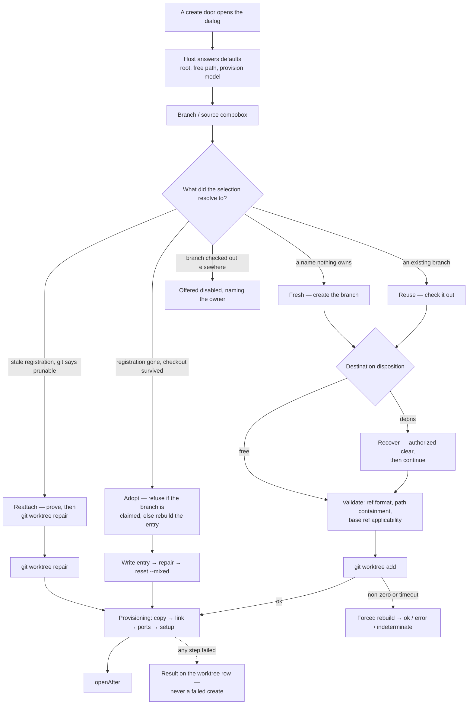

# Worktree Create Design

> **Ref**: docs/DESIGN.md § 8.2 — the "Create / remove / lock / prune / launch" row
> **Consumer**: `asimov-plan` reads this to turn a PLAN.md task into spec deltas and builder tasks.

Everything about bringing a new worktree into existence: what the user states, what is derived,
which creation mode applies, what the destination already holds, and what happens after git returns.

Split out of [worktree-actions.md](worktree-actions.md) § 3.2 — that document keeps the action
inventory, the shared mutating rules, and the actions other than create and remove. What a new
worktree is *filled with* is [worktree-provisioning.md](worktree-provisioning.md). Message shapes
are [worktree-rpc.md](worktree-rpc.md).

## 1. Overview

## 2. Creation modes and destination disposition

A branch and a destination can each be occupied, and the research found every one of these states
treated as first-class by at least one prior tool. Today they all arrive as a git failure *after*
the user has committed to the action. They become states of the **selection**, resolved before
submit.

| Mode | Recognised by | What the dialog offers |
|---|---|---|
| **Fresh** | Nothing owns the name | Create the branch and the worktree |
| **Reuse** | The branch exists and no worktree holds it | Check it out into a new worktree instead of creating a near-duplicate |
| **Reattach** | The branch's registration **survives but is stale** — git lists the worktree as `prunable` — and its directory is findable | Repair the registration in place, naming the directory (§ 2.3) |
| **Adopt** | The registration is **gone**, but a populated checkout survives at the destination | Re-register the surviving directory in place, stating what cannot be restored with it (§ 2.4) |

A fifth case is not a mode because it is not actionable here: a branch **already checked out in
another worktree**. Git permits one worktree per branch, so the combobox offers it **disabled with
the owning directory as its badge**, rather than letting the user select it and fail at submit.

### 2.0 Branch mode and destination disposition are two questions

A branch can be fresh or already exist; a destination can be free or occupied. They are
**independent**, and an earlier draft that made "recover" a fourth *branch* mode could not express
"an existing branch, and debris at the destination".

So a selection resolves two values:

| Question | Values |
|---|---|
| **Branch mode** | `fresh` · `fresh-detached` · `reuse` · `reattach` · `adopt` |
| **Destination disposition** | `free` · `debris` (a directory with no `.git`) |

`debris` is what the UI calls **recover**, and it composes with any branch mode. Its authorization
is carried alongside the mode rather than replacing it (§ 2.2).

### 2.1 The base ref is contractual

`Base` is **refused, not ignored**, for `reuse`, `reattach`, and `adopt`. Those modes take their starting
point from what already exists; a base ref would have no effect, and a field sitting in the form
looking as though it applies is a promise the action will not keep. When such a selection is active
the control is disabled with a one-line reason.

Destination disposition does **not** affect the base: clearing debris and then creating a fresh
branch is an ordinary fresh create that happened to need the ground cleared first.

For fresh creates the base is applied and validated: it must resolve to a commit. An
ancestry-incompatible or unresolvable base is reported before submit, not after.

### 2.2 Recover deletes, and says so

Recover is the only create path that removes anything. It therefore does not proceed on a bare
"Create": it states the directory and what it holds, and the removal is authorized explicitly.
This is the same principle as [worktree-removal.md](worktree-removal.md) § 3 — a destructive step
inside a constructive action is still destructive.

**Recover is an explicit, named carve-out of the "never delete files directly" invariant**
([worktree-actions.md](worktree-actions.md) § 3.1 rule 3). That rule exists because
`git worktree remove` should own directory deletion — but git cannot remove a directory that is
deliberately *not* a worktree, which is exactly what debris is. Leaving recover behind the rule
would mean the design forbids the only mechanism that implements it.

The carve-out is bounded, and every bound is load-bearing:

- The directory sits at the **resolved** destination, and is re-resolved immediately before the
  delete with no `await` in between.
- It contains **no `.git`** file or directory. A `.git` means it is a worktree or a repository, and
  either way it is not debris.
- It passes the containment rules in § 6, checked on the resolved path, and **no component of it is
  a symlink** — a symlinked component means the thing deleted is not the thing validated.
- Its identity (device and inode) is captured at validation and re-checked before the delete.
- The user authorized **this** removal: the confirmation carries a fingerprint over the path and
  what was found there, in the manner of
  [worktree-removal.md](worktree-removal.md) § 3.

Failing any one means it is not debris, recover is not offered, and the create falls back to a
suffixed fresh path. A partial deletion reports what remains rather than continuing, and never
reports the create as successful.

### 2.3 Reattach repairs a stale registration; it cannot resurrect a deleted one

Two failure states look alike to a user and are completely different to git. The distinction was
verified against git 2.50.1 rather than assumed:

| State | What git can do |
|---|---|
| The administrative entry under `.git/worktrees/<id>` **survives**, but its recorded path is wrong — git lists the worktree as **`prunable`** | `git worktree repair <path>` rewrites the two-way link. The listing loses `prunable` and gains the correct path |
| The administrative entry has actually been **removed** by `git worktree prune` | Nothing re-registers it. `repair` fails with *"unable to locate repository; .git file does not reference a repository"*, and `git worktree add` refuses the non-empty directory with *"already exists"* |

**Reattach is the first state only.** It is exactly git's own `prunable` flag, which
[worktree-model.md](worktree-model.md) § 2 already carries on every worktree — no new detection is
needed.

The sequence:

1. The listing marks the worktree `prunable` and its branch is the one selected.
2. The directory exists and holds a `.git` **file** whose `gitdir:` names an administrative
   directory that **still exists**. If that directory is gone, this is the second state.
3. Its `HEAD` matches the branch's current OID. A working tree that does not match the branch is
   not a reattachment; it is a directory that needs a human.
4. `git worktree repair <path>`, then confirm the worktree appears in `git worktree list` without
   `prunable`.

**The second state is `adopt` (§ 2.4).** The surviving directory is never treated as debris — it is
a checkout whose registration is gone, and deleting it would destroy work to tidy a listing.

Reattach never rewrites the working tree. Where any of the four conditions fails, the mode is not
offered.

`git worktree repair` exists from git 2.29.0, below the subsystem's 2.31 floor, so no capability
probe is needed.

### 2.4 Adopt re-registers a surviving checkout

No git command attaches a populated directory. Verified against git 2.50.1 and against upstream
source: `git worktree repair` reads the id out of the worktree's `.git` file and then requires the
administrative directory to already exist (`infer_backlink()` — `if (!is_directory(...)) goto
error;`), so it never creates one; and `git worktree add` has refused a non-empty destination since
2.5.0 (`if (file_exists(path) && !is_empty_dir(path)) die(_("'%s' already exists"), path);`), a check
that runs *before* `--force` is consulted, so neither one nor two `--force` flags reach it. Upstream
discussed a `--keep-worktree` adoption flag in 2019; it was never implemented.

The administrative entry is therefore **reconstructed**, then handed to git's own repair:

| Step | Effect |
|---|---|
| Write `<wt>/.git` containing `gitdir: <common>/worktrees/<id>` | The checkout can find the repository |
| Write `worktrees/<id>/gitdir` containing `<wt>/.git` | The repository can find the checkout |
| Write `worktrees/<id>/commondir` containing `../..` | Resolves `$GIT_COMMON_DIR` |
| Write `worktrees/<id>/HEAD` — `ref: refs/heads/<branch>`, or the OID when detached | Without it the entry is not a repository at all |
| `git worktree repair <path>` | Normalises the recorded paths git itself would have written |
| `git -C <path> reset --mixed` | Rebuilds the per-worktree index from HEAD |

`reset --mixed` is **not optional and not cosmetic**. The index lived in the deleted directory, so
until it is rebuilt every tracked file reports as both deleted and untracked — a working tree that
looks destroyed. `reset --mixed` writes the index and does not touch a single file. The index is
binary and is never written by hand.

**The guard git cannot supply.** `git worktree add` refuses a branch already checked out elsewhere;
reconstruction bypasses that check entirely, and git reports nothing — two entries claim the branch,
both commit, and the second commit silently lands on top of the first carrying a tree that reverts
it. No conflict, no warning, a linear history. So adopt **verifies against
`git worktree list --porcelain` that no live worktree holds the branch, before writing any file**,
and treats a claim as a hard refusal rather than a warning. This is a refusal in the sense of
[worktree-removal.md](worktree-removal.md) § 2.2 — there is no confirmation path past it.

**What adopt cannot restore, and must say so.** Everything that lived in the deleted directory is
gone with it, and none of it is recoverable from the surviving files:

| Lost | Consequence the user sees |
|---|---|
| The index | Staged changes become unstaged. Content is intact; the staging decision is not |
| In-progress rebase, merge, bisect, cherry-pick | The operation is no longer running. The files are left as that operation last wrote them |
| Per-worktree refs and reflog | `ORIG_HEAD`, `refs/bisect`, and the worktree's own reflog are empty |
| `config.worktree` | Only when the repository sets `extensions.worktreeConfig`; per-worktree config reverts to repository config |
| `locked` state | The worktree is adopted unlocked |

Adopt **declares** these rather than detecting them — none can be probed after the fact, and a check
that cannot fail is worse than a stated limitation. The confirmation names the directory, the branch
it will be attached to, and this list.

**Rejected alternative — move-aside.** Moving the directory away, running
`git worktree add --no-checkout` into the freed path, moving the contents back without overwriting
the new `.git`, then `reset --mixed`, reaches the same end state through supported commands and
inherits git's already-checked-out guard for free. It is rejected because it relocates every file
twice: slow over a large dependency tree, a copy rather than a rename across filesystems, and an
interruption leaves content in two places — manufacturing precisely the debris state § 2.2 exists to
clean up. Reconstruction writes four small files, touches nothing inside the working tree, and is
undone by deleting the entry.

## 3. Defaults and path derivation

**Defaults** (`requestWorktreeCreateDefaults`):

- Path: `<root>/<sanitized branch>`, where `<root>` is the first of:

  | # | Source | Wins because |
  |---|--------|--------------|
  | 1 | `anywhereTerminal.worktree.createRoot`, when the user actually set it | An explicit statement outranks a heuristic |
  | 2 | The directory most of this repo's existing linked worktrees already live in | The repo's own convention beats ours |
  | 3 | `.claude/worktrees`, the setting's declared default | Nothing else to go on |

  Detection (2) is the mode of the parent directory of each **linked** worktree, read from the
  listing the host already holds — no extra git work. It infers the **root only, never the naming
  pattern**: one root can hold worktrees named two different ways, and a pattern inferred from
  them encodes one tool's rule as the repo's.

  A relative `createRoot` resolves against the main worktree; an absolute one is used as-is. That
  is what lets the default be a plain string rather than a template needing a repo-name
  placeholder. When the computed path exists, append `-2`, `-3`, … until free — **and report the
  occupied candidate alongside the free one**. Suffixing silently is what made recover
  unreachable in an earlier draft: the default never resolved to an occupied path, so debris was
  never offered for clearing and simply accumulated `-2`, `-3`, `-4` beside itself. The form
  states the free path it will take, and where the candidate it skipped is debris, offers to clear
  it instead (§ 2.2).

- Branch name: empty. A suggestion is not offered — a wrong-but-plausible branch name is worse
  than a blank field. Generated names are a **non-goal**: this form makes the branch name its lead
  input and blocks submission until it validates, which is a different product from one whose
  subject is a workspace that happens to have a branch.

**The default root sits inside the main worktree.** The model supports that
([worktree-model.md](worktree-model.md) § 6): both worktrees list, and longest-prefix mapping keeps
panes attributed to the nested one. What it costs is that the new worktree is untracked content in
the parent's working tree, so a create under a root inside the main worktree adds that root to the
repository's `info/exclude` once, idempotently. That file is repo-local and uncommitted — the right
home for a layout this user chose and their collaborators did not. `.gitignore` is never touched:
it is tracked, and committing an entry on the user's behalf is not ours to do. A failed exclusion
write is reported and does not block the create.

**Validation** (before git): per [worktree-rpc.md](worktree-rpc.md) § 4. The branch name passes
`git check-ref-format --branch`; the path must be absolute, non-existent or empty, and outside
every **linked** worktree of the repo, and not the main worktree itself. A path *inside* the main
worktree is allowed — that is where the default root lives — and is the case the `info/exclude`
handling exists for. [worktree-rpc.md](worktree-rpc.md) § 4 is the canonical statement of this rule.

A `debris` disposition (§ 2.0) is the one exception to "non-existent or empty", and it is why the
disposition is explicit rather than an automatic fallback. `reattach` and `adopt` are further
exceptions: their destination is the surviving directory by definition.

## 4. Form presentation

The form is a worktree form, not a git-plumbing form. What the user states is a **branch name**;
everything else is derived, defaulted, or advanced.

| Element | Rule |
|---------|------|
| Lead input | The **branch / source combobox**, and nothing above it (§ 4.1) |
| Base | One compact line under the lead input, not a full row. Disabled with a reason for reuse / reattach / adopt. A `debris` disposition does not disable it (§ 2.1) |
| Destination | **One derived line**, shortened, and not a field in the common case. The exact value is carried by a tooltip and by a visually-hidden span beside the shortened text — the line's implicit role is `generic`, which prohibits naming, so an `aria-label` on it is not exposed to AT. The line is focusable so the exact value is reachable by keyboard, not by pointer alone |
| Collision | One field-local line naming the **result segment only** (§ 4.2) |
| Bring over | The provision model, summarized, with per-entry provenance (§ 4.3) |
| Move uncommitted changes | Conditional row, present only when the source worktree has changes to move |
| "After creating" | Segmented radios mapping onto all five `WorktreeOpenAfter` wire values: `Nothing` → `none`; `Open a terminal` → `terminal`; `Start an agent` → `agent`; `Open the folder` → `newWindow` or `addToWorkspace`, chosen by a secondary control and defaulting to `addToWorkspace`. No wire value is unreachable from the form |
| Repo picker | Below the destination line when the workspace has more than one repo. "Nothing above the lead input" is a rule about order; the picker cannot go into Advanced, because the destination is derived from it |
| Agent block | Agent, permission posture, and first prompt are revealed **only when "After creating" is "Start an agent"**. While absent nothing agent-shaped is tabbable and the submitted draft carries no agent details |
| Advanced | Collapsed by default, holding base ref, the **detached toggle**, and the path override. Branch source is NOT here: once the combobox owns new-versus-existing, an Advanced control writing the same field would be a second source for one wire value (§ 4.1). Detached is what the combobox cannot express, so it is what stays. While collapsed none of them is tabbable. Opened, the override is the only place a full path is *editable* — a different thing from a statement of where the worktree will go |
| Dangerous posture | Offered, labelled, and never preselected. WHERE every posture an agent offers is dangerous, the control holds a non-submittable placeholder rather than falling through to its first option |
| Submit | Disabled until the value the chosen mode requires validates, while a destination request is outstanding, and while a revealed posture list has no choice |

### 4.1 One combobox, not a tab bar

Refs, pull requests, and "create new branch *X*" live in **one list**. The reference UI's
Smart / GitHub / Branch / Name tabs are explicitly rejected: in a modal this narrow they cost
vertical space, split keyboard search across four datasets, and force a mode choice before the
user has typed anything.

The list is ordered by what the typed text most likely means — an exact ref match first, then
prefix matches, then PRs, then the always-available "create new branch" row. Local refs resolve
immediately; PRs are a network call and carry their own async state, so a slow or unauthenticated
forge never blocks branch search underneath it.

**The combobox is the only source of new-versus-existing.** Picking a ref means `existing`; picking
the create-new row means `new`. `draft.branchMode`'s third value, `detached`, is the one the
combobox cannot express, so the Advanced section keeps that and nothing else — one wire value, never
two sources for it.

**A branch another worktree holds is offered, not hidden.** It renders `aria-disabled` with the name
of the directory holding it, stays keyboard-reachable and announced, and cannot be submitted.
Removing the row would return the branch to looking free, which is the failure this exists to
delete. The refusal reads the typed NAME against the current repository's list rather than the
standing selection: the create-new row is always present, so it is always reachable after a held
name has been typed, and committing it sets the mode to `new` while leaving that name in the input.

**The enumeration is bounded and says when it was cut.** Local branches are read through one
`git for-each-ref --count`, asked one over the cap so a full page is distinguishable from a
repository that has exactly that many. A truncated list states that it is partial; a list that could
not be read at all is stated as unavailable rather than rendered as a repository with no branches.
The create-new row is not gated on any of it, so a failed or partial enumeration costs discovery and
never the ability to create.

**Escape belongs to the list while the list is open.** The first Escape closes the list and leaves
the dialog standing; the second dismisses the dialog. The shell binds Escape on `document` in the
capture phase before the form exists, so the form cannot register a handler that runs first — it
answers a "was this handled?" hook instead, keeping one owner rather than two racing ones.

### 4.2 Collision states a segment, never a path

When the computed path is taken and a suffix was appended, **one line names the result and nothing
else**: *"feat-search already exists — will use `feat-search-2`."* It replaces a second full path;
it does not add one.

**The host applies the shortening.** `collidedWith` carries the taken directory's name, per
[worktree-rpc.md](worktree-rpc.md) § 2, and the form renders it as it arrives — so the field and
its rendering agree about which side shortened, and the note opens with the name rather than with
an ellipsis marking an elision it does not have.

The host needs no `basename` for this: the unsuffixed candidate is resolved with a predicate that
never reports a collision, so it is the root joined to the base name the host already holds.

### 4.3 Bring over

The section renders the provision model from
[worktree-provisioning.md](worktree-provisioning.md) § 2. Rules the form owns:

- **The section appears even when the model is empty.** Silence is what ships a worktree with no
  `.env` and no `node_modules`; an empty state says so and offers to set it up.
- **Every row names its source file.** The badge slot answers *which file said so* and nothing
  else. Consequences of the mode — `writes to main` for a link, `copied on Windows` for a
  degraded one — are a separate warning affordance. A linked row carries both.
- **Mixed provenance is click-to-expand.** Collapsed, a row whose entries come from two files
  states the source count; expanded, each path names its own provider. Excluded paths appear in
  the expanded list, marked as deliberate, and are **not** counted in the row total.
- **Every row is a checkbox, and setup steps start unchecked.** A provider file is untrusted
  input, and a default-on box the user did not clear is not consent to run it.
- **The form submits selections against a host-held offer, never command text.** What executes is
  the model the dialog was shown, identified by an offer id
  ([worktree-provisioning.md](worktree-provisioning.md) § 4.0) — not a re-read of the provider
  files after Create was pressed, and not text the webview sent back.
- **A problem is a state, not an absence.** A provider file that exists and does not parse names
  the file and what was lost, offers to open it, and **leaves Create enabled** — a broken
  provisioning config is not a reason to refuse to make a worktree.

### 4.4 Rules the create-defaults conversation depends on

**Path transparency is preserved, not traded away.** The host still states the free path it will
actually take, because that is a safety property: the user sees the destination before authorizing
a filesystem write. What changes is that it is stated **once**, shortened, with the exact value one
hover away.

**The dialog submits the offer it was opened against.** The destination answer is a narrow
message — today `repoId`, `root`, `prefix`, `path`, and optionally `branch` and `collidedWith` —
and only its destination fields are applied. The agent list an open dialog shows and submits stays
the one it was constructed with, held separately from anything a per-keystroke answer carries. The
rule is stated as a constraint on the answer rather than a description of it: whatever the reply
grows to carry, only the destination is what was asked for, and relabelling the user's posture
choice under them as they type is the defect being prevented.

**Whoever owns the caret owns the text.** Nothing writes the derived path into the override field
while it holds focus. The rule lives at the write, not at its callers: the answer callback arrives
on the host's schedule and is the one caller that can land mid-edit.

**An open form's asks carry a branch; an opening ask does not.** That is what tells an answer meant
to OPEN a form from one meant to UPDATE the open one. The form's staleness guard compares the
branch an answer is for, so it cannot catch a branch-less leftover. The convention is currently
unenforced by any type; a `kind` tag on the request and its answer is the follow-up that would
enforce it.

## 5. Pull request as a source

A PR is a **source inside the combobox**, never a fifth tab. Selecting one resolves to a branch
and a base, and states the fork remote up front when the head is on a fork — configuring a remote
is a repository-level side effect and is not something to discover afterwards.

The branch is deterministic — `pr/<number>` — so the same PR twice is a reuse (§ 2), not a second
worktree. An unauthenticated or unreachable forge is **one quiet row**, and branch search keeps
working underneath it: a network dependency must not disable the local one.

Issue-driven and URL-driven creation remain out of scope. The recorded deferral covers
issue-tracker and forge integration as "a separate product surface, not a worktree concern"; the
PR case is carved out of it because a PR names a branch in *this* repository, which is exactly the
thing this dialog creates. An issue does not.

## 6. Execution

| Case | Command |
|------|---------|
| Fresh | `git worktree add -b <branch> <path> [<baseRef>]` |
| Reuse | `git worktree add <path> <branch>` |
| Reattach | `git worktree repair <path>` — **never** `worktree add`, which refuses a non-empty destination |
| Adopt | Write `gitdir` / `commondir` / `HEAD` and the worktree `.git`, then `git worktree repair <path>`, then `git -C <path> reset --mixed`. Refused outright if any live worktree holds the branch (§ 2.4) |
| Detached at a ref | `git worktree add --detach <path> <baseRef>` |

No `--force`. If the branch is already checked out in another worktree, git refuses and its
message — which names the other worktree — is exactly what the user needs to see. The combobox
prevents that selection (§ 2), so reaching this is a race, not a normal path.

**The create path is untrusted input, and this is the one action where that is true.** Every other
action names a host-issued id; create necessarily accepts a path for an object that does not exist
yet, so there is nothing to re-resolve it from. Three consequences:

- Validation is the *only* barrier, so it runs host-side and its result is never cached across a
  queue wait. An action that waited behind another mutation on the same repo revalidates against
  the fresh listing before it runs.
- The normalizer realpaths the nearest existing ancestor and re-appends the missing segments
  (`worktree-model.md` § 3.1). Those missing segments are not resolved, so a local process can
  create a symlink or mount inside them between validation and execution. `lstat` every component
  that does exist and refuse symlinked components; re-check the existing ancestor's identity
  immediately before spawning git. This narrows the window; it does not close it.
- Containment **must be** checked with `isPathInside` / `isResolvedPathInside` from
  `src/utils/pathBoundary.ts`, the single definition in `src/`. This code never spells its own.
- Path aliasing is not fully solvable. UNC paths, mapped drives, and network mounts can denote one
  object through strings that normalize unequally. Those cases are documented as unsupported rather
  than papered over.

**After git succeeds**, provisioning runs
([worktree-apply.md](worktree-apply.md) § 1) and `openAfter` is honoured:
`terminal` opens a terminal tab in the new path; `agent` hands off to
[worktree-actions.md](worktree-actions.md) § 4; `newWindow` / `addToWorkspace` open the folder;
`none` refreshes.

**Setup and `openAfter` are sequenced by an explicit gate, not always.** Copy, link and ports
always complete before `openAfter` — they are fast and everything downstream assumes them. Setup
is different: it can take minutes, and an agent that starts while `pnpm install` is still running
races the very tree it was asked to work in. So *"wait for setup to finish before starting the
agent"* is an offered choice, meaningful only when setup will actually run:

- **Off** (default): setup runs in its own terminal and the agent starts as soon as the worktree
  exists. The user sees a worktree immediately.
- **On**: the agent's start is sequenced after the setup runner exits.

The gate is about **completion, not success** — it does not promise setup worked, and a failed
setup under a gate still starts nothing and reports per § 5.5 of the provisioning doc. The control
is disabled, not hidden, when no setup step is selected: hiding it would make its absence look
like a layout change rather than a consequence of the checkbox above it.

**Moving uncommitted changes**, when the user asked for it, happens between git success and
provisioning, so a setup command sees the moved work. The Git extension's `migrateChanges` is the
supported mechanism.

**A failed launch after a successful create is reported as exactly that**: the worktree exists, the
agent did not start. The create is never rolled back to make the compound action look atomic. The
same rule covers provisioning (§ 5.5 of the provisioning doc) and a failed change migration.

## 7. Where create is offered

Four entry points, each for a different way the intent arrives:

| Entry point | Rule |
|-------------|------|
| Toolbar "+" | The primary affordance. Rendered **only** while the Worktrees body is active and the tree holds a repository. Availability comes from the tree itself; the workspace's initial "has a repo" hint is looser than git's own answer, so seeding from it showed a dead button on every cold open |
| Repo group header "+" | On hover or keyboard focus of the group header. It pre-answers the repo the dialog needs in a multi-repo workspace |
| Empty-state CTA | The state for a repository holding only its main checkout carries the create action in its body. "No worktrees yet" and "one worktree so far" are one state under two names. The CTA renders beside the main row, never instead of it |
| Row context menu | "New Worktree…" — the discoverable path for keyboard and menu users |

All four open the same dialog and run the same action, and **every door asks the host about every
repository**, not only the one it names — the form builds its repository picker once from the seed
it opened with. A door that asked about one would offer one, and the doors would differ in more
than the selection.

**A create that can no longer open says so.** The repositories a door asked about can leave the
tree while the host resolves. The panel reports that nothing was attempted and names them, using
the `unavailable` outcome.

## 8. Edge cases

| Case | Behaviour |
|---|---|
| Branch checked out in another worktree | Offered disabled in the combobox, badged with the owning directory (§ 2) |
| Destination taken | Suffix appended; one line names the result segment (§ 4.2) |
| Destination holds non-git debris | Recover mode, with explicit authorization of the removal (§ 2.2) |
| Registration stale, git says `prunable` | Reattach mode (§ 2.3) |
| Registration gone, checkout survived | Adopt mode (§ 2.4) |
| Adopt whose branch a live worktree holds | Hard refusal — git cannot make this check for a reconstructed entry (§ 2.4) |
| Base ref supplied for reuse / reattach / adopt | Refused with a reason, never silently ignored (§ 2.1) |
| Base ref unresolvable for a fresh create | Reported before submit |
| PR forge unauthenticated | One quiet row; branch search keeps working (§ 5) |
| `info/exclude` write fails | Reported; create still succeeds (§ 3) |
| Provisioning step fails | Reported on the created row; never a failed create (§ 6) |
| Change migration fails | Reported; worktree stands, changes remain where they were |
| Repo left the tree while resolving | `unavailable` — nothing attempted (§ 7) |
| git non-zero or timeout | Forced rebuild; `indeterminate` when git and the filesystem disagree ([worktree-actions.md](worktree-actions.md) § 3.6) |

## 9. Testing

| Area | Cases |
|---|---|
| Modes | Each of fresh / fresh-detached / reuse / reattach / adopt resolves from its recognising condition, independently of the destination disposition; a branch checked out elsewhere is disabled, not selectable; recover refuses a directory that has a `.git` |
| Adopt | A reconstructed entry lists, keeps the branch tip, survives `prune`, and commits back to the repository; `reset --mixed` leaves working-tree files byte-identical; a branch already held by a live worktree is refused before any file is written |
| Base contract | Disabled and refused for reuse / reattach / adopt; validated for fresh; unaffected by a `debris` disposition |
| Collision | The rendered note contains no path separator — this is the regression test for the shipped WT-009.3 defect (§ 4.2) |
| Combobox | Refs, PRs and create-new in one list; ordering; PR async state does not disable ref search |
| Bring over | Empty, populated, mixed-provenance, excluded, and problem states; setup checkbox default; Create stays enabled on a problem |
| Form | Agent block absent unless chosen; posture never preselected; advanced not tabbable while collapsed; destination stated once |
| Staleness | A branch-less answer does not rewrite an open form's destination; the derived path never overwrites a focused override field |
| Path safety | Symlinked component refusal; ancestor re-check before spawn; no local containment implementation in this module |
| Ordering | git → migrate changes → provisioning → openAfter; a failure at any step leaves the earlier ones standing |
